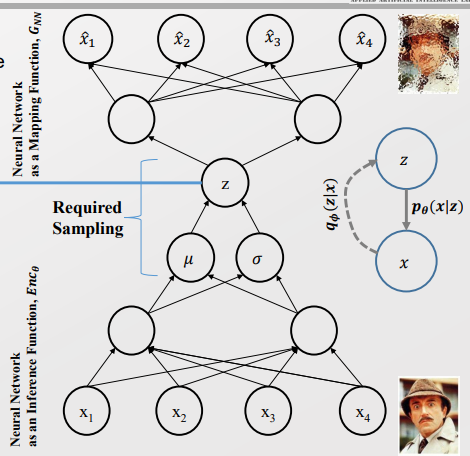
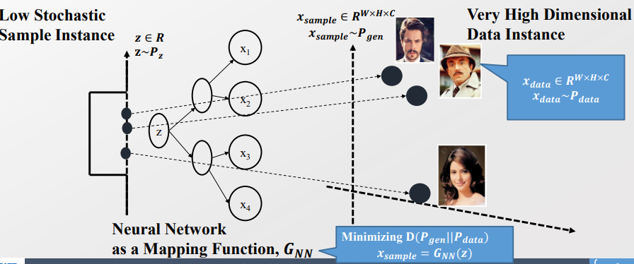
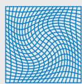

### 10주차 - Normalizaing Flow

기존에 배웠던 방법들은 한번 짚고 넘어가자 

- 1). Explicit Deep Generative model (VAE)
  
  > 
  
  > 중간의 Z 외에는 Deterministic 하게 값이 정해진다. 
  > 
  > Z값은 Stochastic한 값이며 이를 통해서 Sampling을 할 수 있게 된다
  > 
  > NN은 Distribution의 파라미터 $\mu, \sigma$을 학습하기 위해 사용된다. 

- 2). Implicit Deep Generative Model(GAN) 
  
  > 
  > 
  > Z을 통해서 Sampling 되어 나온다. 
  > 
  > NN은 density 모델(z값)을 구체화(specification)하기 위해 사용된다.  
  > 
  > => Complexity 하면서 Flexibility 해진다. 

 

**확률 모델 또는 Generative 모델에 대해 근본적인 질문을 해보자**

- 기본적으로 discriminative / Generative 모델 모두 distribution은 동일하다. 
  
  - 단, Generative Model의 경우 궁극적인 목적은 Data distribution에 대한 근사(Approximation) 하는 것이다. 
  
  - Data distribution에 대한 근사가 된다면, Data 자체를 샘플링하고 Density를 측정할 수 있게 된다. 
  
  - => Bayesian, VAE, GAN 모두 동일한 목표를 추구한다. 

 

- 즉, 실제 데이터 셋의 분포와 최대한 동일하게 만들기 위해 고려할 점이 있다. (* Given $x_j \sim p_{data}, j = 1,2,..., |D|$)
  
  - 1). $p_\theta$(=$q)$의 Flexibility
  
  - 2). $p_{\theta}$ 와 $p_{data}$ 사이의 거리 특성 
  
  - 3). 어떻게 $d(p_\theta, p_{data})$ 을 최적화 할 것인가? 
    
    => Bayesian, VAE, GAN은 서로 다른 접근 방법을 취한 결과이다.

 

- 그럼 또다른 VAE, GAN과 궤를 달리하는 모델을 생각해보자. 
  
  - 이 두 방법은 Data distribution에 대한 Approximation 값이다. 
  
  > $q$ 분포를 가정한다. 
  > 
  > VAE 는 ELBO를 통해 다가간다. 
  > 
  > GAN은 f-divergence에 특수한 경우로, discriminator $\tau$에 대한  근사과정이다
  
  - 이런 점에서 Approximation이 다른 <u>Exact inference가 가능한 방법을 고민해보자.</u> 

---

#### Transformation of Basis from data space to Latent space

- Data distribution에 대한 Exact inference 하기 위해서 준비를 해보자. 

 

###### Transformation in Linear Algebra

- Linear Transformation(transformation matrix)의 개념을 활용한다. 
  
  > Diagonal : Basis에 대한 Scaling 
  > 
  > Off-diagonal : Basis 간의 Correlation 
  > 
  > Det(T) : Transformation 이후 변화한 영역(area)의 크기 
  > 
  > - Det(T) = 0 :  한 축이 사라진다. 

- Diffeomorphism 
  
  - M과 N에 대한 두개의 manifold가 주어졌을 때, 미분가능한 map f : M -> N 을 Diffeomorphism이라 한다.
    
    > 
    
    > f는 bijective 해야한다. (1 to 1 mapping)
    > 
    > f의 역함수도 미분가능하다. 

