### 10주차 - Normalizaing Flow

기존에 배웠던 방법들은 한번 짚고 넘어가자 

- 1). Explicit Deep Generative model (VAE)
  
  > 
  
  > 중간의 Z 외에는 Deterministic 하게 값이 정해진다. 
  > 
  > Z값은 Stochastic한 값이며 이를 통해서 Sampling을 할 수 있게 된다
  > 
  > NN은 Distribution의 파라미터 $\mu, \sigma$을 학습하기 위해 사용된다. 

- 2). Implicit Deep Generative Model(GAN) 
  
  > 
  > 
  > Z을 통해서 Sampling 되어 나온다. 
  > 
  > NN은 density 모델(z값)을 구체화(specification)하기 위해 사용된다.  
  > 
  > => Complexity 하면서 Flexibility 해진다. 

 

**확률 모델 또는 Generative 모델에 대해 근본적인 질문을 해보자**

- 기본적으로 discriminative / Generative 모델 모두 distribution은 동일하다. 
  
  - 단, Generative Model의 경우 궁극적인 목적은 **"Data"** distribution에 대한 근사(Approximation) 하는 것이다. 
  
  - Data distribution에 대한 근사가 된다면, Data 자체를 샘플링하고 Density를 측정할 수 있게 된다. 
  
  - => Bayesian, VAE, GAN 모두 동일한 목표를 추구한다. 

 

- 이때, 실제 데이터 셋의 분포와 최대한 동일하게 만들기 위해 고려할 점이 있다. (* Given $x_j \sim p_{data}, j = 1,2,..., |D|$)
  
  - 1). $p_\theta$(=$q)$의 Flexibility
  
  - 2). $p_{\theta}$ 와 $p_{data}$ 사이의 거리 특성 
  
  - 3). 어떻게 $d(p_\theta, p_{data})$ 을 최적화 할 것인가? 
    
    => Bayesian, VAE, GAN은 서로 다른 접근 방법을 취한 결과이다.

 

- 그럼 또다른 VAE, GAN과 궤를 달리하는 모델을 생각해보자. 
  
  - 이 두 방법은 Data distribution에 대한 Approximation 값이다. 
  
  > $q$ 분포를 가정한다. 
  > 
  > VAE 는 ELBO를 통해 다가간다. 
  > 
  > GAN은 f-divergence에 특수한 경우로, discriminator $\tau$에 대한  근사과정이다
  
  - 이런 점에서 Approximation이 다른 <u>Exact inference가 가능한 방법을 고민해보자.</u> 

---

#### Transformation of Basis from data space to Latent space

- Data distribution에 대한 Exact inference 하기 위해서 준비를 해보자. 

 

###### Transformation in Linear Algebra

- Linear Transformation(transformation matrix)의 개념을 활용한다. 
  
  > Diagonal : Basis에 대한 Scaling 
  > 
  > Off-diagonal : Basis 간의 Correlation 
  > 
  > Det(T) : Transformation 이후 변화한 영역(area)의 크기 
  > 
  > - Det(T) = 0 :  한 축이 사라진다. 

- **Diffeomorphism**
  
  - M과 N에 대한 두개의 manifold가 주어졌을 때, 미분가능한 map f : M -> N 을 Diffeomorphism이라 한다.
    
    > 
    
    > f는 bijective 해야한다. (1 to 1 mapping)
    > 
    > f의 역함수도 미분가능하다. 

- **Change of Variable in Calculus** 
  
  > 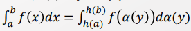
  > 
  > f, h 모두 [a,b]에서 Continuous function이다. 
  > 
  > h는 strictly increasing 함수다. 
  > 
  > $\alpha(y) =x$. $\alpha$는 h에 대한 Inverse function이다. 
  > 
  > > $a<= x <=b, h(a) <= y <= h(b)$
  
  - 통계 / 확률 관점에서 바라보면 아래와 같이 표현할 수 있다. 
    
    > $p_y(y) = p_x(\alpha(y)) \alpha'(y)$
  
  - Multivariate한 상황에서의 Change of variable
    
    > 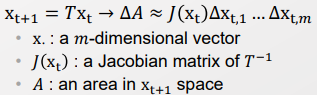
    > 
    > Transformation T로 인해 변한 영역 $\triangle A$ 를 Jacobian matrix $J(x_t)$ 로 표현한다. 
    
    > 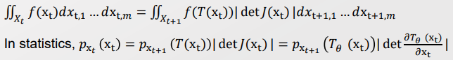
    > 
    > 즉, $|detJ(x_t)|$ 을 통해서 Transition 이후의 넓이 변화를 표현한다. 

 

---- 

#### Flow Model

- 생각해볼 점 : 고차원이라고 해서 Complexity를 보장하나?  그렇지 않다. 
  
  - GAN 때를 생각해보면 간단한 저차원에서 Sampling해서 NN으로 고차원으로 올려보냈다. 
  
  - 그렇다면 고차원에 연연하지 말고, Sampling 할 수 있는 저차원에서 Sampling을 하자, 그리고 이를 고차원의 형태로 표현해주자. 

 

- **Idea : 단순한 Distribution에서 Transition을 거쳐 복잡한 Distribution을 표현하자.**
  
  > 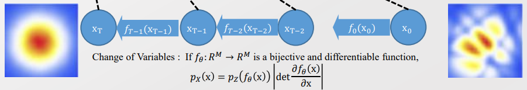
  
  - 단, Neural Network이 아닌, Transition matrix T를 통해 Mapping을 해보자. 
    
    - Change of Variable을 통해 Dimension을 조금 조금씩 바꿔가자. 
    
    - 제한조건 : Mapping은 <u>Bijective 해야한다. </u>제한조건을 충족해야 Inverse가 존재할 수 있음. 
  
  - **장점 : 아주 단순한 분포로 복잡한 분포까지 표현할 수 있다. 1 to 1 Mapping으로 인해 Encoder / Decoder을 동시에 구할 수 있다.** 
    
    - 우측으로  가는 것이 Decoder, 좌측으로 가는 것은 Encoder이다. 
  
  - **단점 : 아무리 Mapping 한다고 해도 태생(ex- Modal 갯수)는 달라지지 않는다.**
    
    - 태생을 바꿔버리면 Bijective 조건을 깨게 된다. 

 

- 생각해볼 점 
  
  - Flow Model은 Bayesian Network 일까? 
    
    - 아니다. Condition으로 만들어지는 점이 아무것도 없다. 즉, Markov Chain이 아니다. 
    
    - 이 점에서 기존에 다루던 모델과 차별점이 있다. 
  
  - 현재는 Transition이 Deterministic 한데, Stochastic 하다고 하면? 
    
    - Invertible이 깨진다. 그리고 Bijective function 조건이 깨진다. 
    
    - 그럼 Transition을 존중하되 살짝 Stochastic element을 살짝 준다면? 
      
      - 대충 Invertable 하게 줄 수 있지 않을까? 
      
      - NN 은 Approximation 이니까, 오류가 살짝 있어도 적당히 Approximation이 가능할 것이다. 
      
      - => 이로써 Flow model의 태생은 바꾸지 못한다는 단점을 해소할 수 있다. 

 

- Flow 모델을 수식으로 정리해보자. 여기서도 MLE을 추구한다. 
  
  > $argmax_{\theta}E_{x \sim p_{data}}[log p_{\theta}(x)]$
  > 
  > $max(log p_x(x)) = max(log p_z(f_\theta(x)) + log |\frac{\delta f_{\theta}(x)}{\delta(x)}|)$
  
  - 지금까지의 대부분의 경우 MLE을 지행해왔다. 
    
    - 예외로는 GAN이 있다. 서로간의 차이 값을 구하고자 한다. 

 

**이제 성능을 점검해보자.**

- 일단 미분이 쉬워야한다. 그래야 계산하기 쉬울 거니까 :) 

##### Elementwise Flows - 각 성분들이 Independent 하다.

> 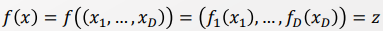

- 각각이 역함수가 존재한다면, 전체 함수 f에 대해서도 역함수가 존재한다. 

- 각각의 Transition 또한 구하기 쉽다. 
  
  - Jacobian Matrix가 Diagonal 한 형태를 가진다. 
  
  > 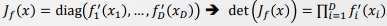

- 목적함수 또한 구하기 쉽다. 
  
  > 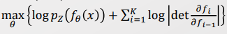

=> 하지만 각 변수간의 상관성을 고려하지 못해 성능이 나오지 않는다.. 

 

##### Linear Flows - 선형 관계까지 고려해주자

> 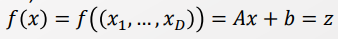

- Matrix A가 invertible 하다면, f 또한 Invertible 하다. 
  
  > $f^{-1}(z) = A^{-1}(z-b)$
  
  - Linear function 이라고 해서 항상 Invertible 한 것이 아님. (ex- 기울기가 0)

- Jacobian Matrix가 더 이상 Diagonal Matrix가 아니여서 계산량이 많다. 
  
  - Inverse 계산량 : $O(D^3)$
  
  - Determint 계산량 : $O(D^3)$

- 목적 함수는 Elementwise Flow와 동일하다. 
  
  > 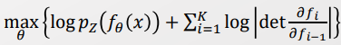
  
  => <u>Element wise 방법에 비해 성능이 개선이 많이 되지 않으면서 필요로 하는 계산량은 대폭 증가했다.</u>

 

##### Coupling Flows - Linear flows에서의 계산량 많다는 단점을 해소하자.

- Determinant를 계산하는 방법으로 Laplace Expansion이 있다. 
  
  > 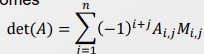
  > 
  > $M_{i,j}$ : Matrix A에서 i와 j row 와 Column을 제거한 Matrix 의 Determinant
  
  - 우린 2차 행렬의 Determinant 가 $ad-bc$ 라는 것을 알고 있다. 그럼 a,b,c,d를 각 행렬로 대입한다면, 큰 Matrix의 Determinant를 $AD-BC$ 로 표현할 수 있지 않을까? 
    
    > 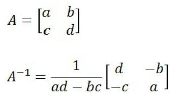
  
  - 또한 이때, B나 C가 영행렬이라면, 우린 AD만 계산하면 될 것이다. 

- 위의 논리를 적용하여 $A_{i,j}=0$ 이 되도록 할 수 있다면 Determinant 계산이 쉬워질 것이다. 
  
  - 그리고 Diagonal과 Triangle Matrix가 그러하다 :) 
  
  > $det(A) = \prod_{i=1}^n A_{i,j}$

  

- **Idea : 행렬을 $x^A, x^B$ 형태로 나눠서 계산을 용이하게 만들자.** 
  
  > 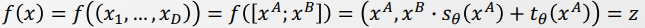
  > 
  > $z^A = x^A$ : Transfomation 적용 x 
  > 
  > $z^B = x^B s_{\theta}(x^A) + t_{\theta}(x^A)$ : Transformation 적용 
  
  - $f$는 $s_\theta, t_\theta$에 큰 제약없이 invertible 하다. 
    
    > 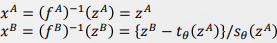
  
  - Jacobian Matrix의 Determinant는 우리가 원하는 Triangle 형태로 나타난다. 
    
    > 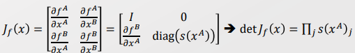
    
    => Inverse 및 Determinant 계산량이 $O(D)$로 대폭 줄어들었다. 

 

- 이때 $x^A, x^B$ 을 나누는 방식에 따라 여러 영역을 표현할 수 있다. 
  
  - Transformation 형태는 서로간의 영향력을 고려할 수 있기 때문 
  
  - 단, 나누는 방식은 Model의 구조에 의존한다. 즉, 최적화하고 있진 않다. 

- 이제부턴 슬슬 계산과정에 있어 Neural Network을 활용한다. 
  
  - Vector가 함수이기 때문에 옛적부터 NN에 올릴 수 있었다. 
  
  - 또한 $s_\theta, t_\theta$ 구조는 Neural Network로 표현하기 쉽다. 
    
    > 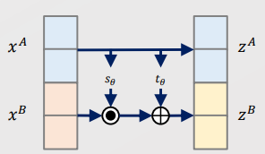
    > 
    > 위의 그림은 Single Layer임. 이를 중첩하면 Multi layer가 됨. 

  

##### Generalized Coupling Flow

- Coupling Flow에서 선형 관계 식을 G function의 형태로 일반화하자. 
  
  > 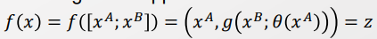
  
  - 구조는 Coupling Flow와 동일하다! 
  
  - $g$ 가 Invertible 하다면, $f$ 또한 Invertible 해진다. 
    
    > 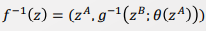
  
  - Determinant를 구하는 것도 크게 다르지 않다. 
    
    > 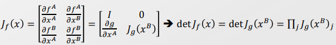
  
  - 함수 g는 Elementise 방식으로 적용될 수 있는 함수면 다 가능하다. 
    
    > Ex)- Linear function, Spline function, and inverse CDF 등등 
    > 
    > Monotonically increase 하며 Inverse 되는 것들

 

##### Diverse Suggestions on variable split

- 그 외에도 Split 기준을 어떻게 하는 냐에 따라서 여러 변형이 있다. 
  
  > 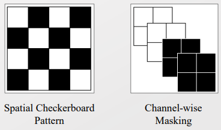

 

#### Coupling Flow을 Bayesian 관점에서 해석해보자.

- 먼저 Flow model은 Bayesian Network가 아니다. 

- 단, Generalarized Coupling Flow는 Bayesian 관점에서 해석할 여지가 있다.
  
  > 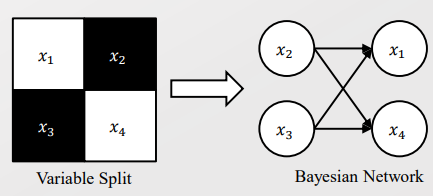
  
  > 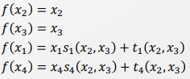
  > 
  > 이때, $x_1, x_4$ 는 $x_2, x_3$ 의 영향을 받는다. 
  
  > 즉, $x_2, x_3$ 은 $x_1, x_4$의 Parent 형태로 바라볼 수 있다. 
  > 
  > 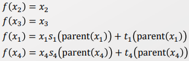
  
  - 다만, 이때 Bayesian Network의 구조가 제한적이다. 
    
    - $x_2, x_3$이 다음 번의 $x_1, x_4$ 에 대해 영향을 미친다. 
    
    - 즉, 스스로의 정보를 재조합해서 답을 만들어 내는 Auto regression의 형태를 가지고 있다. 
    
    - 따라서 현재의 예측 대상은, 다음 번의 Independent variable로 들어와야 한다. 
      
      > 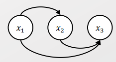
      > 
      > 즉, 이와 같은 형태의 Bayesian Network을 가져야 한다. 

##### Autoregressive Flow

- Density Model 
  
  > 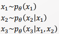

- Generation process : sampling x given z : $p(x|z)$
  
  > 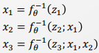
  > 
  > p <-> f  
  
  - 이때 $x_2, x_3$을 계산하기 위해선 이전의 값들이 필요로 한다. 
  
  - <u>즉, 병렬적으로 계산을 할 수 없으며, 이로 인해 속도가 저하된다. </u>

- Inference Process : 주어진 x 를 기반으로 z의 분포를 학습한다. ($q(z|x)$)
  
  > 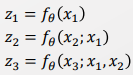
  
  - 반면 Inference process의 경우 주어진 $x_1, x_2$을 대입하면 되기에 병렬화 가능하다. 

 

##### Inverse Autoregressive Flow and ELBO Interpretation

- VAE와 비교해보자 

- 1). Encoder / Decoder 학습 관점 
  
  - VAE에서는 Encoder / Decoder 학습을 위해서 E /M Step을 거쳐야 했다. 
  
  - 하지만 Flow model 에서는 1 to 1 관계이기 때문에 하나만 학습하면 나머지도 구할 수 있다. 
  
  - => <u>각각의 Generation Process 는 $p(x|z)$ 을, Inference Process는 $q(z|x)$ 을 의미하게 된다. </u>

- 2). 전제 
  
  - VAE에서 계산양을 줄이기 위해 Mean field Assumption을 적용한다. 
  
  - Flow Model 에서는 auto regression의 형태로 더 이상 Independent를 가정하지 않는다. 
  
  - <u>=> VAE 보다 더욱 Complex 해진다</u>

 

- 이때 inference process를 볼 때, x를 받아 z을 반환한다. 그리고 z는 결국 Data distribution까지 나아갈 것이다. 
  
  - 그렇다면 Inference process를 MCMC 라고 할 수 있을까? 
  
  - 먼저 Stationary distribution이 Data distribution으로 만드는 것이 MCMC이다. 
  
  - 현재 Inference process는 Bayesian Network가 아니기 때문에 MCMC가 될 수 없다. 
  
  - 하지만 일부 변형을 거친다면 MCMC가 될 수 있다. 
