### 11주차 - Basics of (Stochastic) Differential Equation

##### Differential equation의 종류

- Ordinary Differential Equation(ODE) 
  
  > $F(t, y, y', ..., y^{n}) =0$
  > 
  > t : independent variable 
  > 
  > y : dependent variable ($y = f(t)$)
  
  - Initial Value Problem(IVP) : 초기값 $y_0$가 주어졌을 때 일정 시간 간격 에서의 differential problem을 푸는 것 
  
  Partial Differential Equation(PDE)
  
  > 
  
  - ODE가 Single dimension이나, PDE는 Multi dimension을 다룸 

- Stochasitc Differential Equation(SDE) 
  
  > 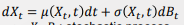
  > 
  > $X_t, B_t$ : Stochasitic process 
  > 
  > $B_t$ : Brownian motion. <u>이것이 Transformation에 Randomness를 부여함</u> 
  > 
  > - Continuous process는 Deterministic 하여 Randomness가 없다. 

 

- 우리의 목적은 Stochastic Process를 만드는 것이다. 
  
  - Stochastic process는 t 가 고정되면 Distribution이 나오며 w가 고정되면 Deterministic한 Pass가 정해져야 한다. 
  
  - Continuous Process는 Randomness가 없어 Stochastic Process가 될 수 없다. 
  
  - 따라서 $\sigma (X_t, t)dB_t$ 을 추가함으로서 Randomness를 부여한다. 이제 Random process가 될 수 있다. 
  
  - => X는 Random process 가 될 수 있다. 

 

##### Modified Euler method

- 한 점에 대해서 변화량을 구하는 것은 Biased 해질 수 있다. 따라서 현재($t_n$)와 예측 지점 ($t_{n+1}$) 두 지점에 대한 변화량을 평균을 구하자. 
  
  > 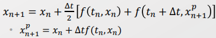

- 단, bias 여부를 알기 위해서는 x의 형태($x^p_{n+1}$)가 예측되어 있어야 한다.  이때 예측값은 Euler method를 통해 예측한다. 

  

- $k_1 = \triangle tf(t_n, x_n), k_2 = \triangle t f(t_n + \alpha \triangle t, x_n + \beta k_1)$로 볼 때, 
  
  > $k_1$ 은 특정 t 이후의 t의 변화량을 의미 
  > 
  > $k_2$ 는 특정 t 이후의 t와 x의 변화량을 의미 
  
  - 위의 식은 $\alpha = \beta =1$ 인 경우[ $x(t_{n+1}) \sim x_n + \frac{1}{2}k_1 + \frac{1}{2}k_2$]로 단순화 할 수 있다. 
  
  - 이를 일반화하여 $x(t_{n+1}) \sim x_n + a k_1 + b k_2$ 로 표현할 수 있다. 
    
    > 이를 Runge-kutta 2(RK2) 방법이라 한다. 
    > 
    > $\alpha, \beta$ 는 $a,b$ 와 다르다. 

 

- RK2 의 식을 Taylor series를 통해 전개하여 Constraint 항을 추출할 수 있다. 
  
  > 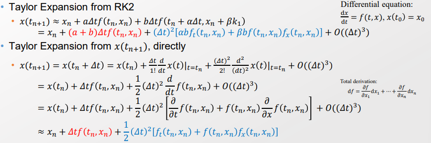
  > 
  > Taylor series 외에는 $f(t_n+ \alpha \triangle t, x_n + \beta k_1)$의 값을 계산할 방법이 없다. 
  > 
  > - $f$ 함수는 Black box function으로 근사 외에는 알아낼 방법이 없다. 
  > 
  > $O((\triangle t)^3)$은 매우 작아 고려하지 않아도 큰 상관이 없다. 
  > 
  > Taylor series를 통해 전개했을 때, 각각의 1차, 2차 항의 계수는 동일해야 한다. 
  > 
  > - 즉, $a + b =1, \alpha b = \frac{1}{2}, \beta a = \frac{1}{2}$ 를 만족해야 한다. 
  
  - 즉, Modified Euler method는 RK2에서 $a,b$ 가 동일한 Fair case에 대한 것이다. 
    
    - 그렇다면 1) 특정 값에 비중을 더 줄 수 있을까, 2). Step을 여러번 갈 수 있는가에 대해서 추가 답변을 할 필요가 있다. 

  

- RK의 경우 보다 고차원을 다룰 수 있다. 그중에서 RK4가 많이 사용된다. 
  
  > 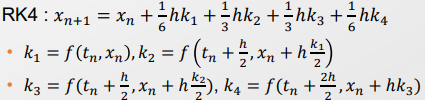
  
  - RK5는 RK4 와도 numerical 특징이 달라진다. 
  
  - 이때 고차원일수록 시간 간격(h)은 동일하나, $x$는 각 이전 차원의 gradient $k_{n-1}$의 절반의 값으로 이동한다. 
    
    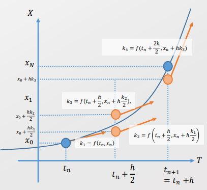
    
    - 각 $h k_{i}$ 의 계수들은 합이 1인 형태로 부여되며, 각각의 값을은 Butcher tableau을 통해 정해진다. 
  
  => 이를 통해서 우린 Adaptive RK을 할 수 있다. 

  

- 어떻게 Adaptive RK을 할 수 있는가? 
  
  - n차원의 RK 식에서 $k_1, ..., k_{n-1}$ 만큼은 동일하고, $k_n$ 만 추가로 더하는 형태가 된다. 즉, 계산에 대한 burden이 크지 않다.  [RK의 장점]
    
    > 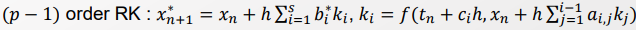
  
  - 이를 통해서 두 RK 간의 Error는 아래와 같이 표현할 수 있다. 
    
    > 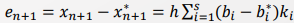
  
  - RK의 차원이 올라갈수록 보다 고차원을 고려한다 볼 수 있을 것이다. 그렇다면 $RK_{p}$ 와 $RK_{p-1}$ 의 차이가 크다면, p-1 차원으로는 충분히 변화량을 고려하지 못한다고 볼 수 있다. 
    
    - 각각의 RK 값들은 틀린 것은 아니다. 둘다 근사값이다. 
    
    - 단지, p차원의 RK 가 더욱 잘 반영한다는 것을 의미한다. 즉, 더욱 고차원을 고려해야한다는 신호로 볼 수 있다. 이는 복잡한 변동이 있음을 의미한다. 
    
    <u>=> 두 RK 간의 차를 통해서 복잡한 변동 유무를 확인하여 Adaptive RK를 할 수 있다. </u>

---------

#### Stochastic Differential Equations

- Le'vy process 
  
  > 1). 두개의 Random variable의 차(Increment)가 Mutually independent 하다 
  > 
  > 2). Increment의 분포가 동일하다. 
  > 
  > > For any $s<t, X_t- X_s$ is equal in distribution to $X_{t-s}$
  > 
  > 3). Continuity in Probability 
  > 
  > > For any $\epsilon >0 $ and $t>=0, $ $lim_{h->0} P(|{X_{t+h} - X_t}|>\epsilon) =0$
  > 
  > > 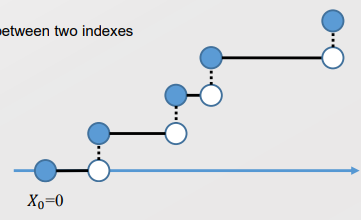
  > > 
  > > - Increment 특성 상, $X_i$의 값이 달라질 때마다 Jump(discontinue)가 발생한다. 
  > > 
  > > - 본 정의에서 말하는 것은 <u>'확률적으로' 시간 간격 h가 0으로 수렴함에 따라 Jump가 일어날 확률이 0에 수렴한다는 것</u>. 

- 각 Increment의 분포에 따른 Process 종류들 
  
  > 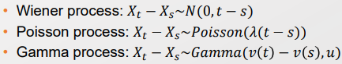

 

- Levy Process을 Differential equation으로 풀어 특정 t에 대한 결과값을 구할 것이다. 
  
  > Differential equation : 초기값이 주어졌을 때, 임의의 시간 t에 대한 결과값을 구하는 것 
  
  - 각각의 Increment을 Probability distribution의 형태로  Levy process를 통해 표현했다. 
  
  - 각각의 Prob distribution에 대한 Differential equation solution을 구하자. 
    
    > 확률에 대한 DE로, 이를 Stocastic differential equation이라 부른다. 
  
  - 결국 임의의 t에 대한 State는 각각의 Increment, 즉 Gradient의 값을 합하는 것이다. 이것이 Stochastic Differential equation을 푸는 것이 된다. 

 

##### Winner process a.k.a. Brownian Motion

> $P(X_t =x) = \frac{1}{\sqrt2\pi t } exp(-\frac{x^2}{2t})$  [1- dimention case]
> 
> 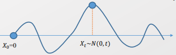

- Winner process의 특징 
  
  > 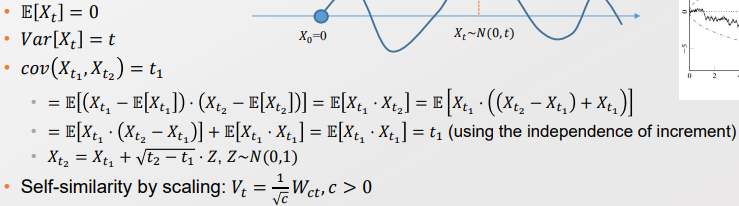
  
  - 이때 $X_{t_2} = X_{t_1} + \sqrt{t_2 - t_1} Z$ 는 Reparametrization으로 볼 수 있다. 
    
    - 또한 $\sqrt{t_2-t_1}$은 매우 작은 시간 변화량을 의미한다. 

- Winner Process의 문제점 
  
  - 또한 Z는 long-tail을 가지고 있어, $X_2- X_1$ 과 $\sqrt{t_2 - t_1}$의 값이 매우 작아져도, 매우 큰 값이 나타날 확률을 가지고 있다.
    
    => Winner Process 에서 시간의 간격을 매우 줄인다 해도, 그러지 않았을 때와 유사한 패턴을 보인다. 이로 인해 기존의 Integration 방법을 적용할 수 없다. 
    
    > Newton's Method의 경우 각각의 직사각형의 합으로 적분한다. 이때 값을 근사시키기 위해 시간 폭을 줄인다. 
    > 
    > 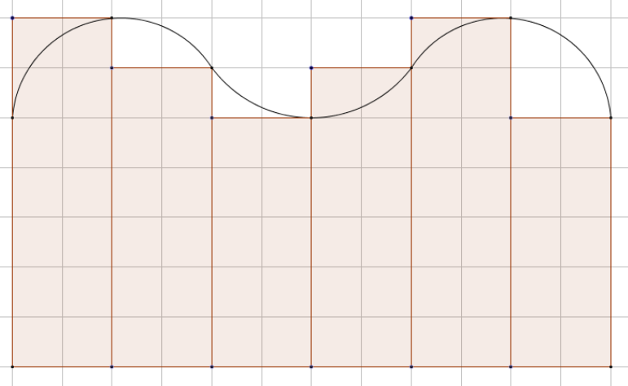
    > 
    > 단, 시간 값을 줄였을 때 높이의 변화량이 완만해지지 않고 튄다면, 각 직사각형의 합이 적분 값이라 할 수 없게 된다. 

----

#### 새로운 적분법 - Riemann-Stieltjes Integral

- 리만 적분의 일반화 공식은 $\int^b_a f(x) dx$ 이다. 

- 이때 $dx$ 부분을 $dg(x)$ 로 바꾼 것이 Riemann-Stieltjes integral이다. 
  
  > $A = \int^b_{x=a} f(x) dg(x) dx$
  > 
  > 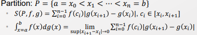
  
  > Riemann-Stieljes Integral을 적용하기 위해선 <u>$|g(x_{i+1}) - g(x_i)|$의 크기가 bound 되어야 한다. </u>
  
  - 리만 적분은 x를 Identity function으로 본 것이며, Riemann-Stieltjes integral은 더욱 확장한 것이라 볼 수 있다. 

- 만약 g가 R 영역에 대해 Continuously differentiable 하다면 아래와 같이 표현할 수 있다. 
  
  > $\int^b_a f(x) dg(x) = \int^b_a f(x) g'(x)dx$
  > 
  > 또는 

- Riemann-Stieltjes Integral을 도입함으로써 풀 수 있게 된 문제가 있다. 
  
  > 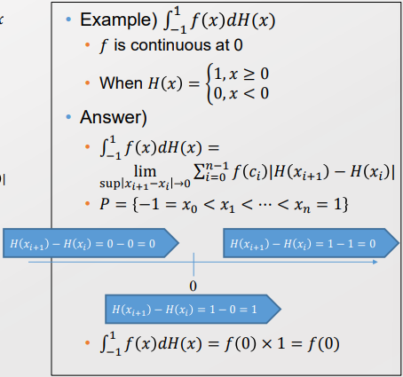
  > 
  > => 시간 축을 줄였을 때 단일 point($f(0)$) 의 값만 남아 적분값이 된다. 

 

- 단, Riemann-Stieltjes Intergral을 사용하려면 $|g(x_{i+1}) - g(x_i)|$ 가 Bound 되어야 한다. 하지만 $Z \sim N(0,1)$은 Long tail로 Bound 되지 않는다. 
  
  => 새로운 적분방법이 필요하다. 

 

#### Stocahstic Ingetral Integral (Ito vs Stratonovich)

- Stochasitc Process Integral의 경우, Total variation이 unbound해도 된다. 
  
  > 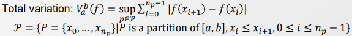
  
  > 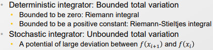

- Stocastic Integral 은 아래와 같으며, $X_{t_k'}$ 을 무엇으로 고려하냐에 따라 종류가 나뉜다. 
  
  > 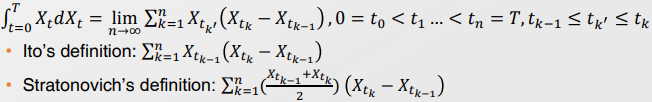
  
  - 현재 값 $X_t$, 변화량 $dX_t$ 모두 Random 하다. 따라서 둘 중 하나를 고정해자 
    
    - 값인 이전 값 $X_{t_{n-1}}$, 폭은 $X_{t_k} - X_{t_{k-1}}$ 을 활용하여 폭만 Random을 고려한다! 
    
    > $X_{t_k}$ 는 아직 주어진 값이 아니라서 Randomness를 가지고 있음. 
  
  - 일반적으로 Randomness를 줄인 Ito의 방식을 선호한다. 

- 각 종류에 따라 적분의 값이 달라진다. 
  
  > 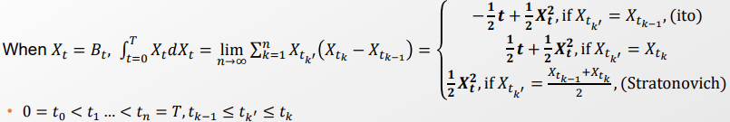
  > 
  > => Stocastic process에 대한 DE를 새로운 적분을 통해 구할 수 있다!
