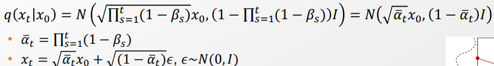
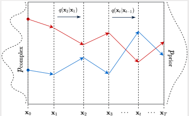
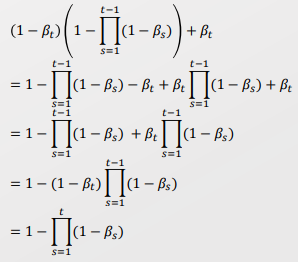
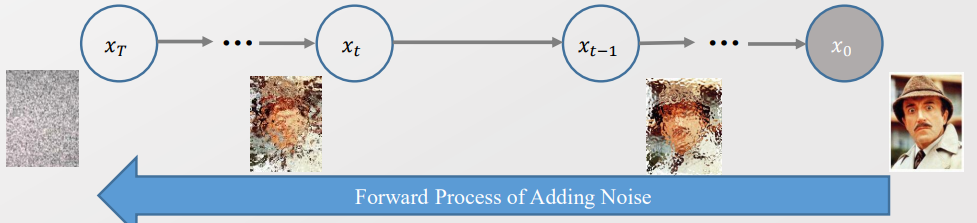
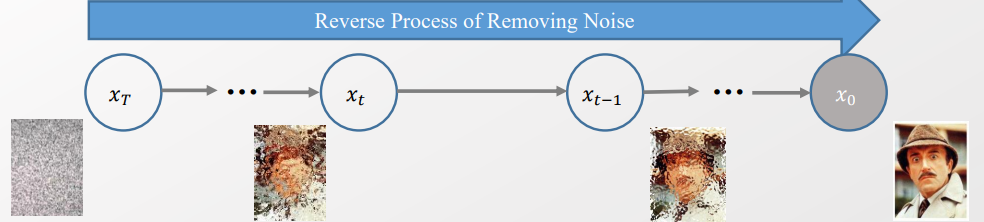
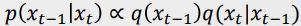
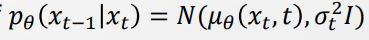
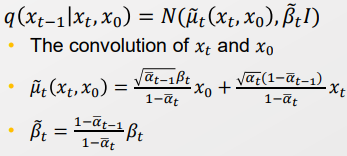

### 12주차 - Diffusion Models

- 기존의 GAN 모델에는 무수히 많은 문제점이 있었다. 하나씩 해결해보자 
  
  > mode Collapse, Non-convergence, performance degradation 

- 이때 p 분포와 q 분포간에 공통점이 없을 때 수렴하지 않는 문제가 심화된다. 
  
  - Long tail을 갖춘 Noise를 더함으로써 Mode collapse를 막는다. 
  
  > 
  > 
  > 겹치는 부분이 조금이라도 있다면, 점차 동화되면서 유사해짐. 
  > 
  > 하지만 한 군데도 겹치지 않는다면 동화될 수가 없다. 
  > 
  > => 따라서 <u>모든 Support 영역에 대해서 겹칠 수 있도록 Normal distribution을 따르는 Noise를 추가해준다. </u>
  > 
  > - 이후에 Noise를 점차 빼면서 둘의 간격을 유사하도록 조정한다. 
  
  - Mode Collapse는 density가 겹치는 점이 없어 생기는 현상이다. Long tail인 Noise를 더해준 결과 이젠 예방할 수 있다. 

-----

### Diffusion

- Complex Data distribution $P_d $ 에서 최초의 Prior Data distribution $P_0$로 돌아가자 

- 여러 Transition T을 거쳐 $P_0 -> P_d$ 가 되었을 것이다. 그럼 이 순서를 역순으로 돌려보자. 
  
  > 기존에 Sampling 방식에서 MCMC 가 유사한 방법을 적용했다. 
  > 
  > MCMC : Burn-in 이후 Stationary 된 distribution이 Data distribution으로 가도록 한다. Markov Chain을 parament inference로 사용한 것. 

- Reverse diffusion을 쭉 거치면 Prior data distribution $P_0$가 될 것이다. 

 

#### Diffusion Process

> $x_0$ : Observable variable 
> 
> $x_i$ : latent variable 

- Forward process[Stochastic] : Noise를 계속해서 추가.  

- Reverse Process[Deterministic] : Noise를 점차 제거. 이로써 noise들이 점차 이미지가 되도록 한다.

 

- $x_i$는 Latent variable이기 때문에 Intractability가 발생한다. 따라서 EM process를 거쳐야 한다. 
  
  - Variational inference -> ELBO -> ELBO optimization이 필요하게 될 것. 
  
  - 이 조각을 다 맞추면 Diffustion이 된다. 

  

- 이 모델은 **Bayesian Network의 구조를 띈다.**
  
  > 
  
  > Bayesian Network은 Stochastic / Generation을 의미 
  > 
  > Flow 모델의 경우 Deterministic / Transformation을 의미함 
  
  - Bayesian Network이기 때문에 Full joint 에서 시작해서 Factorizing 한다. 
    
    > 
  
  - <u>Graphical model을 명시하기 위해선 2가지를 필요로 함</u>
    
    - 1). Plate notation 
    
    - 2). Generative Process : $p_\theta(x_{t-1}|x_t)$
  
  - Latent variable이 있기 때문에 ELBO optimization을 할 것이다. 이때 필요로 한 variational distribution(-여기선 Normal)이 부여되어 있다. 
    
    - 더욱 <u>Mean Field Assumption 또한 가정하지 않는다.</u> 
    
    - 이는 <u>각 분포들이 Normal 이기 때문에 가능하다.</u> Normal + Normal은 Normal, Normal x normal = normal 이기 때문. 
    
    - => <u>모델 posterior가 Model prior distribution, Variational distribution이 같아진다.</u> (?)

 

- 각 단계마다 동일한 구조를 가진다(self-similar). 따라서 한 스텝이 잘 작동하면 문제없다. **[노이즈 한번 추가하기]**
  
  > 
  
  - 위의 것은 예시. 모델을 다양하게 꾸밀 수 있음. 
  
  - 위의 모델은 학습 가능한가? 
    
    - 가능하다. $\beta_t$ 는 학습할 수 있다. 
    
    - 단, 본 논문에선 $\beta_t$는 하이퍼 파라미터로 여김 
    
    => 다 고정된 값으로 여김으로써 각각의 Transition을 표현할 수 있게 된다. 
  
  - 이때 Transition 해봐야 distribution은 Normal일 것이라 기대한다. 더 나아가 Closed form solution이 존재할 것이라 기대한다. 

 

- 이제 SDE를 품으로써 주어진 초기값 $x_0$을 기반으로 임의의 시점 $x_t$의 분포 p distribution ($p(x_t|x_0)$)을 근사하자! 
  
  > 
  > 
  > 위의 $q(x_t|x_{t-1})$ 을 t번 진행한 것. 
  > 
  > 아래 $\bar \alpha_t , x_t$은 계산을 편하게 해주기 위해서 reparametrization을 한 것이다. 
  
  > $\bar \alpha_t$에서 1보다 작은 "$1-\beta_s$"의 값이 t번 곱해짐에 따라서 점차 0에 수렴한다. 
  > 
  > 따라서, 최초에 복잡했던 p 분포에서 노이즈를 추가함에 따라 점차 정규분포의 형태로 수렴해간다. 어느 순간 원래 분포($x_0$)보다 노이즈가 설명하는 비중이 넘어가는 지점($x_t$) 가 발생하며, 이후 조정을 거치면서 비중을 재조정한다. 
  > 
  > 
  > 
  > t가 증가하면 $ \bar \alpha_T -> 0$ 가 되고, 또한 $q(x_T|x_0) \sim N(0,I)$ 에 수렴한다.
  > 
  > t가 작아지면 $\bar \alpha_T -> 1-\beta_1, x_t$ -> $\sqrt{1-\beta_s}x_0 + \sqrt{\beta_1} \epsilon$ 에 수렴한다. 
  
  - 각각의 Noise를 추가하는 과정에서 파라미터들이 변하는 것이 없다. 따라서 수학적 귀납법을 통해 T번의 Noise 추가를 한번에 계산해준다. 
    
    > T-1번을 적용했을 때의 분포를 아래로 가정한다. 
    > 
    > 
    > 
    > 여기에서 noise를 한 번 더 더해주는 과정을 계산해준다. 
    > 
    > 
    > 
    > => $P(x_t|x_0)$ 에 대한 분포값을 한번에 계산할 수 있다. 
  
  - => 이로써 각 단계를 하나 하나 계산할 필요가 없다. 바로 $x_t$ 에 대한 값을 구할 수 있다. 
    
    - 원본 이미지($x_0$)에서 Noise가 t번 더해진 $x_T$ 까지 변환할 수 있음을 의마한다.
    
    > 
    > 
    > 이는 보다 단순한 그림으로 변화하는 것으로 Encoding 과정이 된다. 
    > 
    > 이처럼 $x_0$ 에서 $x_T$로 한번에 encoding 하는 것을 <u>디퓨전 커널</u>이라고 한다.

 

=> 지금까지의 과정을 통해 우리는 $x_0$을 샘플링할 수 있으면, 디퓨전 커널을 통해서 $x_T$ 또한 샘플링 할 수 있게 되었다.

 

- 이제 Decoder을 만들어보자. Noise를 제거하는 과정이 된다. **[Reverse Diffusion]**
  
  > $x_T$ 가 주어졌을 때, $x_t, x_{t-1}, x_0$을 구해보자
  > 
  > 
  
  > Bayesian을 통해서 $p(x_{t-1}|x_t)$ 는 아래와 같이 표현할 수 있다. 
  > 
  > 
  > 
  > 단, 좌측의 분모로 들어가는 값은 $\int p(D) dx$ 로, x가 들어갈 수 있는 모든 영역에 대해서 적분을 해야한다. 그리고 일반적으로 이는 intractable하다. 

- $p(x_{t-1}|x_t)$ 은 intractable 하기 때문에 다른 방법을 찾아야 한다. 
  
  - normal 분포의 경우 우리는 평균($\mu$) 와 분산($\sigma^2$)의 값만 알면 대부분의 경우를 설명할 수 있다. 
  
  - 즉, parameter inference을 시도한다. 이때 데이터를 기반으로 amortised inference를 적용한다. 
    
    > 
  
  - 이때 파라미터 $\theta$을 학습시키기 위해서 MLE을 적용한다. 
    
    - 단, 이때 $\sigma$ 에 대해서 따로 $\theta$를 부여하지 않는다. 그 이유는 1) 모델이 이미 학습할 것이 많다. 2) 또한 각 단계별로 노이즈를 추가하는 것이기 때문에 어차피 $\sigma$의 값을 작게 부여할 것이다. 
  
  - 이때 $\mu_\theta$ 의 값이 매 순간 학습함에 따라서 변한다. 따라서 t번의 단계를 한번에 뛰어넘을 수 없다. 단일 스텝 별로 나아가야한다. 

- 우린 Noise 1개를 추가했을 때의 영향을 파악하기 위해 $x_t, x_0$ 을 고려하여 $x_{t-1}$의 분포를 판단할 것이다.  
  
  > 
  > 
  > => $x_0$의 정보를 같이 고려함으로써 시간에 대한 영향력을 같이 확인한다.
  > 
  > 이게 가능하다면 한번 Noise를 추가했을 때의 영향력을 확인할 수 있다.  

- 우리의 목적은 $p_\theta(x_{t-1|x_t}) = N(\mu_\theta(x_t, t), \sigma_t^2I)$Reverse diffusion에 대한 Loss 함수 식은 다음과 같다. 
  
  
