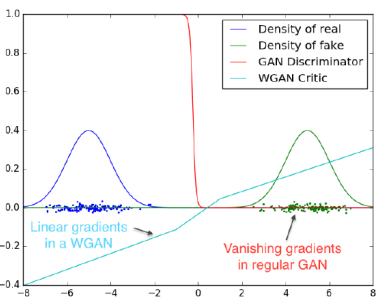
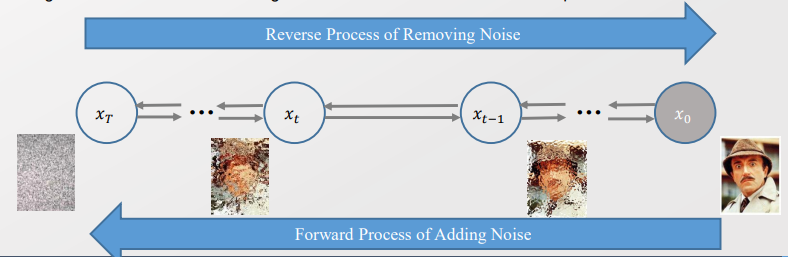
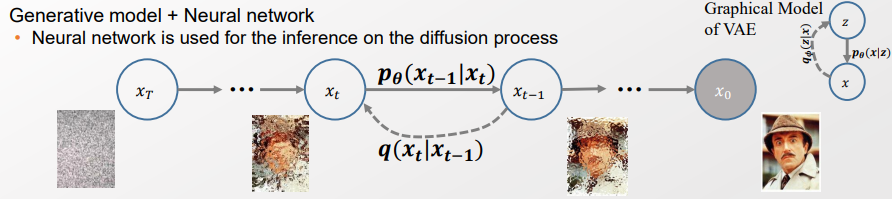
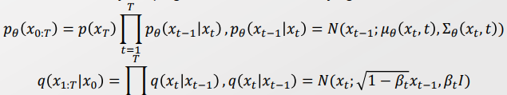
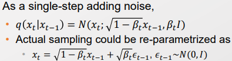
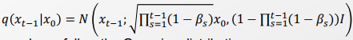

### 12주차 - Diffusion Models

- 기존의 GAN 모델에는 무수히 많은 문제점이 있었다. 하나씩 해결해보자 
  
  > mode Collapse, Non-convergence, performance degradation 

- 이때 p 분포와 q 분포간에 공통점이 없을 때 수렴하지 않는 문제가 심화된다. 
  
  - Long tail을 갖춘 Noise를 더함으로써 Mode collapse를 막는다. 
  
  > 
  > 
  > 겹치는 부분이 조금이라도 있다면, 점차 동화되면서 유사해짐. 
  > 
  > 하지만 한 군데도 겹치지 않는다면 동화될 수가 없다. 
  > 
  > => 따라서 <u>모든 Support 영역에 대해서 겹칠 수 있도록 Normal distribution을 따르는 Noise를 추가해준다. </u>
  > 
  > - 이후에 Noise를 점차 빼면서 둘의 간격을 유사하도록 조정한다. 
  
  - Mode Collapse는 density가 겹치는 점이 없어 생기는 현상이다. Long tail인 Noise를 더해준 결과 이젠 예방할 수 있다. 
  
  

-----

### Diffusion

- Complex Data distribution $P_d $ 에서 최초의 Prior Data distribution $P_0$로 돌아가자 

- 여러 Transition T을 거쳐 $P_0 -> P_d$ 가 되었을 것이다. 그럼 이 순서를 역순으로 돌려보자. 
  
  > 기존에 Sampling 방식에서 MCMC 가 유사한 방법을 적용했다. 
  > 
  > MCMC : Burn-in 이후 Stationary 된 distribution이 Data distribution으로 가도록 한다. Markov Chain을 parament inference로 사용한 것. 

- Reverse diffusion을 쭉 거치면 Prior data distribution $P_0$가 될 것이다. 

 

#### Diffusion Process

> $x_0$ : Observable variable 
> 
> $x_i$ : latent variable 

- Forward process : Noise를 계속해서 추가. Stochastic process 

- Reverse Process : Noise를 점차 제거. 이로써 noise들이 점차 이미지가 되도록 한다. Deterministic process

 

- $x_i$는 Latent variable이기 때문에 Intractability가 발생한다. 따라서 EM process를 거쳐야 한다. 
  
  - Variational inference -> ELBO -> ELBO optimization이 필요하게 될 것. 
  
  - 이 조각을 다 맞추면 Diffustion이 된다. 

  

- 이 모델은 Bayesian Network의 구조를 띈다. 
  
  > 
  
  > Bayesian Network은 Stochastic / Generation을 의미 
  > 
  > Flow 모델의 경우 Deterministic / Transformation을 의미함 
  
  - Bayesian Network이기 때문에 Full joint 에서 시작해서 Factorizing 한다. 
    
    > 
  
  - Graphical model을 명시하기 위해선 2가지를 필요로 함
    
    - 1). Plate notation 
    
    - 2). Generative Process : $p_\theta(x_{t-1}|x_t)$
  
  - Latent variable이 있기 때문에 ELBO optimization을 할 것이다. 이때 필요로 한 variational distribution(-여기선 Normal)이 부여되어 있다. 
    
    - 더욱 <u>Mean Field Assumption 또한 가정하지 않는다.</u> 
    
    - 이는 <u>각 분포들이 Normal 이기 때문에 가능하다.</u> Normal + Normal은 Normal, Normal x normal = normal 이기 때문. 
    
    - => <u>모델 posterior가 Model prior distribution, Variational distribution이 같아진다.</u> (?)

 

- 각 단계마다 동일한 구조를 가진다(self-similar). 따라서 한 스텝이 잘 작동하면 문제없다.
  
  > 
  
  - 위의 것은 예시. 모델을 다양하게 꾸밀 수 있음. 
  
  - 위의 모델은 학습 가능한가? 
    
    - 가능하다. $\beta_t$ 는 학습할 수 있다. 
    
    - 단, 본 논문에선 $\beta_t$는 하이퍼 파라미터로 여김 
    
    => 다 고정된 값으로 여김으로써 각각의 Transition을 표현할 수 있게 된다. 
  
  - 이때 Transition 해봐야 distribution은 Normal일 것이라 기대한다. 더 나아가 Closed form solution이 존재할 것이라 기대한다. 

 

- 이제 SDE를 품으로써 임의의 시점의 p distribution ($p(x_{t-1}|x_0)$)을 근사하자 
  
  > 
  > 
  > 위의 $q(x_t|x_{t-1})$ 을 t-1 번 진행한 것. 

