### 1주차 - Bayesian Network

출처 : GSDS 문일철 교수님 - "Application of AI and DM Technology"

##### 용어 정리

- $\sigma$ algebra : 모든 크기를 잴 수 있는 집합(가측 집합)들의 집합 
  
  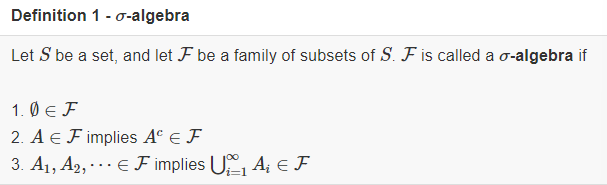

- Measurable Space : 측정 가능한 공간 
  
  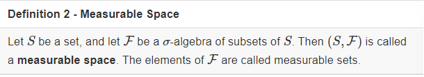
  
  > 가장 작은 $\sigma-algebra$는 F = {$\phi, S$} 이며, 가장 큰 것은 F = P(S) 이다. 
  > 
  > > P(S) : 모든 부분집합의 집합(멱집합 - power set)

- Lebesgue measure : 직육면체의 부피를 측정하는 **르벡 측도** 
  
  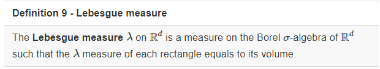

- Borel $\sigma - algebra$ 
  
  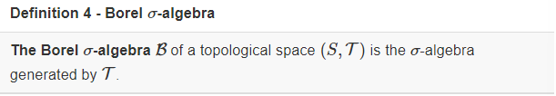

----

##### 확률 기본 개념

> Law of Total Probability : P(a) = $\sum_b P(a,b) = \sum_b P(a|b) P(b)$
> 
> Factorization : P(a,b,c,...,z) = P(a|b,c,...,z) P(b|c,...,z) P(c| ..., z)...P(z)
> 
> - 위 개념들은 정의(Definition)으로 언제든 적용 가능하다. 

##### Bayesian Network

- <mark>의의 : 설계도로서 사용되며, <u>Factorization을 간단하게 사용</u>하게 해준다. </mark>

- Conditional Probability table 
  
  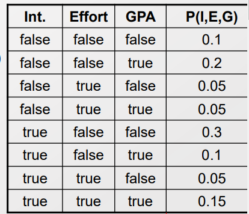
  
  > **위 통계적 모델에서의 문제점**
  > 
  > 1. 각각의 경우에 대해 Point estimation을 정확히 하기 위해선 Sample 수가 많아야 한다. 
  > 
  > 2. 특성의 수가 늘어날 경우 Curse of dim 이 발생하여 설명력을 갖추기 위해 필요로 하는 Sample 수가 지수적으로 증가한다.
  >    
  >    => Scalability 하지 않다.  
  
  > 따라서, Parameter 수를 줄이는 등 Scalability 한 조치들을 진행해야 한다.
  > 
  > - 그 중에 하나가 <u>Parameter을 Indepence하게 선택</u>하는 것이다. 

- **Independence** 
  
  - <mark>의의 : Parameter가 Indepence 하다면, 고려해야할 경우의 수를 확 줄일 수 있다. </mark>
    
    - 만약, 단 2개의 상태 값을 가지는 Parameter n개가 not indep 하다면 $2^n-1$ 경우를 고려해야 한다.
    
    - 하지만 indep 하다면 n개의 경우의 값을 곱해서 구할 수 있다. 
  
  - 정의 
    
    > Marginal indep : P(A|B) = P(A) <=> P(A,B) = P(A) P(B) <=> P(B|A) = P(B)
    > 
    > > mutual Independence 이기도 함. 
    > 
    > Contidional indep : P(A|B,C) = P(A|C) 
    > 
    > 
    > 
    > - B가 관측되었든 안되었든 상관이 없다(A,C는 B에 대해 condi indep) 
    > 
    > - 하지만, C(ommader)의 지시를 못 들었다면, A의 행동은 B와 연관된다. 
    >   
    >   - P(A|B,C) $\neq$ P(A|B) 
    > 
    > - => <mark>Independence 유무는 관측에 달려 있다!</mark>

---

#### Naive Bayes classifier

> $f_{NB}(x) = argmax_{Y=y} P(Y=y) \prod_{1<=i<=d} P(X_i = x_i|Y=y)$

- 아래의 사항들이 주어졌다는 전제 
  
  > P(Y) : Prior prob class 
  > 
  > independent feature $X \in R^d$  s.t. given the class Y 
  > 
  > For each $X_i,$ we have likelihood $P(X_i|Y)$

- <mark>의의 : '좋은(Optimal)' Factorization을 하게 해준다. </mark>
  
  - 앞서 Factorization 정의상, 어떤 확률 분포도 Factorization을 할 수 있다. 
  
  - 이때 <mark>'좋은'</mark>의 기준은 **1) 계산의 양을 줄여주며, 2) Random variable 간의 Condi Indepence 유무**를 잘 보여주는 것이다. 
    
    > 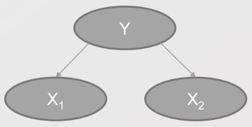
    > 
    > Condi indepdence with X1 & X2 : X1 $\bot$ X2/{Y}
    > 
    > 단, 지금 상태에선 X1, X2가 condi indep 인지 모른다. 
    > 
    > Y에 의해 indep 유무가 정해진다. 

 

- **Optimal Factorization의 정의** 
  
  - 우리는 모집단의 값을 추측할 뿐 알 수 없다. 
    
    - 따라서 모집단의 값들과 표본을 통한 측정값의 오차를 최대한 줄여나가는 것을 목표로 한다. 
  
  - 둘의 오차를 줄이는 하나의 방법으로 Upper bound를 부여한다. 
    
    > **<Hoeffding's inequality>**
    > 
    > let $Z_1, ..., Z_n$ be independent bounded random variables with $Z_i \in [a,b]$ for all i, where $ -\infin < a <= b < \infin$. then 
    > 
    > $P(\frac {1}{n} \sum^n_{i=1}(Z_i - E[Z_i]) >= t ) <= exp(- \frac {2nt^2}{(b-a)^2})$
    > 
    > - t가 커질수록 upper bound가 매우 작아진다. 
    > 
    > - b-a 의 크기가 작아질수록 upper bound가 작아진다.  
    > 
    > - <u>n이 커질수록 Upper bound가 작아진다.</u>
    > 
    > => t, 'b-a', n 중에서 우리가 조정할 수 있는 것은 n이다. **즉, 우리가 원하는 정확도를 충족하기 위해서 n을 늘려야 한다.**
  
  - 또는 <u>Parameter의 개수를 줄임으로써, 정확도를 충족하기 위해 필요로 하는 n의 크기를 줄이는 것</u>이다. 
    
    - 이때, 필요로 하는 n보다 큰 데이터의 개수들은 Hoeffding's inequality에 의해서 모델 성능 향상에 일조할 것이다. 
    
    - 쉽게 말해 fitting 해야하는 Parameter 개수가 적으니 작은 n에서도 모델 성능을 확보할 수 있다.
    
    - 실제로 Neural Network에 적용할 때에도 성능 향상에 도움이 된다.  
  
  - 즉, Optimal Factorizaion 이라 할 수 있는 이유는 <mark>"파라미터의 개수를 줄이는 것은 모델 성능 향상에 긍정적 영향을 주며"</mark> , **Bayesian Network는 Factorization 간 파라미터 개수를 가장 줄이는 방법이다.**

 

- 모델의 문법 
  
  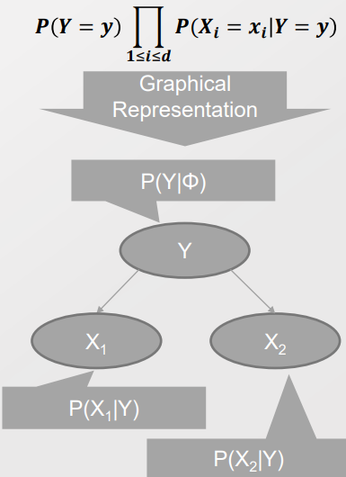
  
  - A acyclic and directed graph (DAG)
  
  - A set of nodes 
    
    - A random variable
    
    - A conditional distribution given its parents ($P(X_i|Parents(X_i))$
  
  - A set of links 
    
    - Direct influence from the parent to the child 
  
  - => *To obtain a compact representation of the full joint distribution*
  
  - Square - Plate Notation 
    
    > 
    > 
    > - 네모 칸에 들어가면 'For loop' 절 처럼 여러 경우를 다 포함한다는 의미이다.

 

- **Design model of Typocal Local Structures**
  
  - Common Parent 
    
    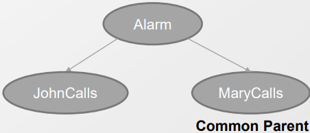
    
    - **Alarm을 관측(Fixing) 시, John 과 Mary는 indep 하다**
      
      > J $\bot$ M|A
  
  - Cascading 
    
    
    
    - **Alarm을 관측(Fixing) 시, Buglary와 MaryCall은 indep 하다.**
    
    > B $\bot$ M|A
  
  - V-Structure
    
    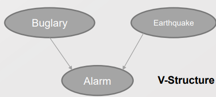
    
    - **Alarm을 관측(Fixing) 시, Buglary와 Earthquake는 not indep 하다.**
    
    - 특히<u> V-structure은 모델 안에 숨겨져 있기에 잘 찾아야 한다.</u>
      
      > ex)- Hidden layer들은 input과 V-Structure 구조를 가진다. 
  
  - Ex)- Finding V-Structure 
    
    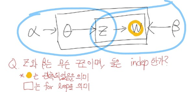
    
    - 정답은 V-Structure 이며, W가 관측되었기 때문에 not indep 하다.
    
    - 만약 W가 관측되지 않았다면 Z와 $\beta$ 는 Indep 한 관계이다.
    
    - <mark>=> 관측 유무를 잘 확인해야 한다! </mark>

----

#### **Bayes Ball Algorithm**

- 목적 : Checking $X_A \bot X_B |X_C$ 

- 방법 : 관측된 노드를 벽처럼 여기고, 나머지 공간 간에 공을 굴려보는 것 
  
  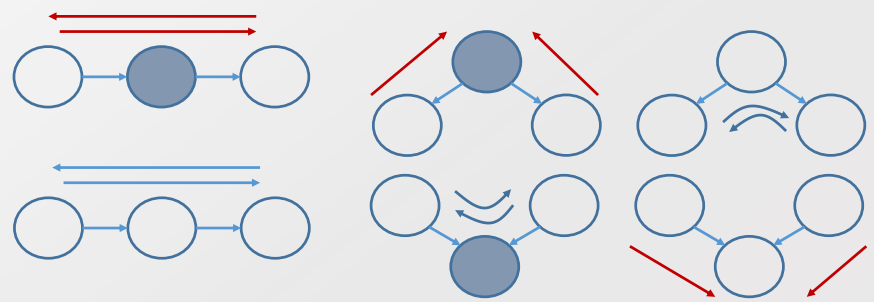
  
  > 빨간 선은 Indep을 의미, 파란 선은 dep 을 의미 
  > 
  > 통하지 않으면 independence 한 것. 

- **D-Seperation**
  
  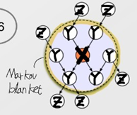
  
  - X is d-separated(directly-separated) from Z given Y if we cannot send a ball from any node in X to any node in Z using the Bayes Ball algorithm 
    
    > Markov Blanket : P(A|blanket, B) = P(A|Blanket) 
    > 
    > > Blanket = {parents, children, children's other parents}
  
  - <mark>의의 : 절대적 Independece의 정의가 D-Seperation 에서 온다!</mark>

----

#### Factorization theorem

- Bayesian network을 고려할 때, 가장 일반적인 형태의 Probability distribution
  
  - P(x) = $\prod_i P(X_i : child node|X_{\pi_i} : Parent node)$ 
  
  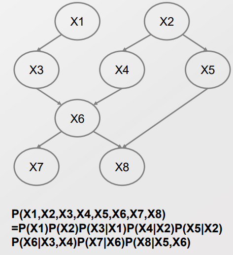

- 왜 가장 일반적이라고 할까? 
  
  - Factorization의 방식은 매우 많다. 
  
  - 하지만 위의 경우 Conti-indep을 고려하여, **1) Parameter의 개수를 줄여 계산 양을 확 줄였으며, 2) 위의 확률 식을 시행착오를 줄이면서 찾을 수 있다.**

---- 

##### Making Q-A machine!

- 목표는 질문(query)를 했을 때, '그럼직한' 답을 내놓는 기계를 만드는 것이다.
  
  > 이때 '그럼직한 답'이란 가장 높은 확률 값을 가지는 경우를 찾는 것이다.
  > 
  > -> 조건 $x_v$ 가 주어졌을 때, 가장 바람직한 Y는 무엇인가?  ($argmaxP(Y|x_v)$)
  > 
  > <mark>**$ex)- argmax_aP(A|B=True, C=True)$**</mark>

 

- Q-A machine인 $argmaxP(Y|x_V))$ 을 알기 위해 아래와 같이 계산할 수 있다. 
  
  > 우리가 알고 싶은 값을 계산하기 위해서, 알고 있는 값들을 활용할 수 있다. 
  > 
  > 확률 값을 Full joint 형식으로 바꾼 다음에 Condi independence 조건을 통해서 계산을 간편화할 수 있다. 
1. **Likelihood 계산 ($p(x_v)$)**
   
   > <mark>$P(X_V) = \sum_{X_H} P(X_H, X_V) = \sum_{x_1}... \sum_{x_k}P(x_1, ..., x_k, X_V)$</mark>
   > 
   > > $X = [X_1, ... , X_N]$ : all random variables
   > > 
   > > $X_V = [X_{K+1}, ... , X_N]$ : evidence variables
   > > 
   > > $X_H = X-X_V = [X_1, ... , X_k]$ : hidden variables 
   
   - **Tip) 확률을 계산할 떄에는 Full Joint probability 에서 시작해라!**
     
     > ex)- P(B=True, M = True) = $\sum_E\sum_J\sum_A P(B,E,A,J,M)$
     > 
     >     $= \sum_E\sum_J\sum_A P(B) P(E) P(A|B,E) P(J|A) P(M|A)$ 
   
    

2. **Contidional Probability 계산**
   
   > $P(Y|x_V) = \sum_z P(Y,Z=z|x_V)$
   > 
   >                     $= \sum_z \frac{P(Y,Z,x_V)}{P(x_V)} = \sum_z \frac{P(Y,Z,x_V)}{\sum_{y,z} P(Y=y, Z=z, x_V)}$ 
   > 
   > > $X_H = [Y,Z] $
   > > 
   > > Y : interested hidden variables 
   > > 
   > > Z : uninterested hidden variable 

3. **Contidionmal probability 중 argmax 값 찾기**

-----

##### Marginalization and Elimination

- 특정 확률 값을 구할 때 곱 연산이 너무 많아 Computation complexity가 높다! 
1. **Marginalization - 필요없는 값들을 앞으로 빼자!**
   
   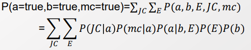
   
   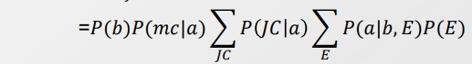
   
   > 계산 과정을 나눠서 따로 따로 진행할 수 있다. 

 

2. **Variable Elimination** 

> 전제 : $P(e|j,m) = \frac{P(e,j,m)}{p(j,m)} = \alpha P(e,j,m)$
> 
> > $\alpha = p(j,m)$ 는 Normalizer 의 역할을 한다. 
> 
> - j,m은 이미 관측된 값으로 Constant 값으로 부여할 수 있다. 
> 
> - 단, 아직 관측이 안된 값일 경우 그럴 수 없다. 

- 각 P들을 Topological 순서대로 나열한다. 
  
  - Topological order 란 Parent -> child 순으로 나열한다는 의미다. 
  
  - 이는 컴퓨터에서 계산할 때 leaf node(Child) 부터 시작하기 위함이다.

- <u>각 확률 분포를 함수(Function)으로서 고려한다. </u>
  
  > 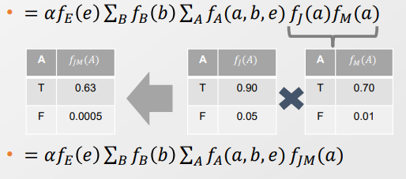
  
  - 함수로서 고려한다면, 동일한 입력값을 필요로 하는  $f_J, f_M$ 을 통합하여 $f_{JM}$ 로 표현할 수 있다. <u>즉, 총 필요로 하는 경우의 수를 줄일 수 있다.</u>
    
    > $f_J(a)f_M(a) = f_{JM}(a)$
    > 
    > $f_A(a,b,e)f_{JM}(a) = f_{AZM}(a,b,e)$
  
  - $\sum$ 별로 하나의 함수로 통합한 다음 Marginalization을 통해 변수를 줄인다.
    
    > 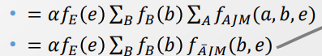
  
  - 위의 두 과정을 반복하여 하나의 함수로 표현한다. 
    
    > 
  
  - 마지막으로 e의 모든 경우에 대해서 확률을 합한다. 이때 1이 나오도록 $\alpha$ 값을 조정한다. 

---- 

#### Potential Functions

- 정의 : 확률모델은 아니나, Normalized를 하면 확률분포 모델로 될 수 있는 함수들 
  
  > 확률은 2가지 조건을 충족해야 한다. 
  > 
  > 1. 각 확률 분포값이 0 이상이여야 한다.
  > 
  > 2. 총 합이 1이여야 한다. 
  
  > 즉, Potential Function은1번 조건, 모든 값이 0 이상을 충족해야 한다. 
  > 
  > 2번 조건은 Normalized 를 통해서 달성될 수 있다. (즉, **Unnormalized Probability** 이다. )
  
  > ex)- Lelu 

 

- **Joint Distribution을 Sequel Model 형태로 표현함으로써 Potential func의 연산으로 구해낼 수 있다.**
  
  > P(A,B,C,D) = P(A|B) P(B|C) P(C|D) P(D)
  
  - <mark>P(A,B,C,D) = P(U) = $\frac {\prod_N \psi(N)}{\prod_L \phi(L)}$ = $\frac {\psi(a,b) \psi(b,c) \psi(c,d)}{\phi(b) \phi(c)}$</mark>
    
    > $\phi$ : ex)조건부 확률 . 내가 원하는 대로 형태를 정할 수 있다. 
    > 
    > $\psi$ : ex)각 상황별 확률. 내가 원하는 대로 형태를 정할 수 있다 
    
    - 이때 $\phi, \psi$ 은 다양한 형태를 띌 수 있다. 
  
  > 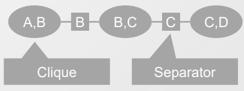
  > 
  > > **Potential function on Nodes** : $\psi(a,b), \psi(b,c), \psi(c,d)$
  > > 
  > > **Potential Function on Link**: $\phi(b), \phi(c)$
  > 
  > > Q. 흠.. 노드와 링크를 다른 형태로도 표현해줄 수 있을 텐데 이렇게 정의한 이유가 있나?  
  
  
  
  > Potential functions on Node에서 방향성을 제거하며, Clique만 탐색하게 설정
  > 
  > > Q. 흠.. 조건부 확률은 방향성이 있는데 어떻게 방향성을 제거해주는 거지? 
  > 
  > > Clique : Graph간 Fully Connectd 된 Component 들의 집합 
  > > 
  > > Separator : 각 Clique 사이에서 Intersection을 의미. 공통 요소 외의 나머지에 대해 $\psi$를 Marginalization 하여 구할 수 있음. 
  > > 
  > > - (A,B) 에서 A를, (B,C) 에서 C를 Marginalization 한 것은 같아야 한다. 
  > 
  > 여기서 (B,C) Clique에서 B값이 갱신이 된다면, B / (A,B) 방향으로 값 갱신이 일어난다. <mark>(Message passing)</mark>
  > 
  > - **Clique 상황에서의 Inference를 "Message passing" 이라고 한다.**

 

- 그럼 어떻게 Potential 함수를 통해서 확률 분포값을 어떻게 알아 낼 수 있을까?
  
  - **유일한 방식을 Absortion rule 또는 Update Rule이라고 부른다.**
  
  > $\psi(A,B)$ 에서만 Update가 진행되어 $\psi^*(A,B)$ 가 되었다고 하자. 
  > 
  > 그럼 다른 값들을 다음과 같이 업데이트 한다. 
  > 
  > > $\phi^*(B) = \sum_A \psi^*(A,B)$     [Update rule for separators]
  > > 
  > > $\psi^*(B,C) = \psi(B,C) \frac{\phi^*(B)}{\phi(B)}$   [Update rule for cliques]
  > > 
  > > 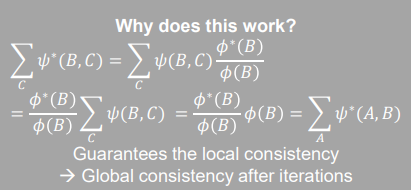
  > > 
  > > - $\sum_C \psi^*(B,C) = \sum_A \psi^*(A,B)$ 를 통해서 유추해낸 식 
  > > 
  > > - 위의 식은 local consistency 만을 보장하나, Message passing이 확장 및 반복을 통해서 Global consistency를 보장한다. 

 

- **Ex)- Potential Function의 Message Passing을 통해서 확률값 구하기**
  
  > 사전지식이 아래와 같이 주어진다고 가정하자 
  > 
  > - $\psi(a,b) = P(a|b), \psi(b,c) = P(b|c) P(c)$
  > 
  > - $\phi(b) =1 $
  
  > P(b)를 구해보자! 
  > 
  > 이때, Update rule을 통해서 값을 갱신하며, Separator의 확률 값은 좌우 상관없이 동일해야 한다. 
  > 
  > <mark>$\phi^*(b)$</mark> $= \sum_a \psi(a,b) = \sum_a P(a|b) $= <mark>$ 1 $</mark>   [(a,b) → b 방향]
  > 
  > $\psi^*(b,c) = \psi(b,c) \frac{\phi^*(b)}{\phi(b)} = P(b|c) P(c) = P(b,c)$
  > 
  > <mark>$\phi^{**}(b)$ </mark>$= \sum_c \psi^*(b,c) = \sum_c P(b,c) $=<mark> $P(b)$ </mark>  [(b,c) → b 방향 ]
  > 
  > > $\phi^*(b) \neq \phi^{**}(b)$. **이때 $\psi(a,b)$ 도 Message Passing으로 업데이트 할 것**
  > 
  > $\psi^{**}(a,b) = \psi^*(a,b) \frac{\phi^{**} (b)}{\phi^*(b)} = \frac{P(a|b)P(b)}{1} = P(a,b)$
  > 
  > <mark>$\phi^{***}(b)$</mark> $= \sum_a \psi^{**}(a,b) $= <mark>$P(b)$</mark> 
  > 
  > - $\phi(b)$ 의 값이 좌우 공통으로 통일됨. <mark>P(b)을 새로 알게 된 값($\phi^*(b)$)과 Potential func의 연산으로 구할 수 있다. </mark>

- Ex2 - P(b|a =1, c=1) 계산하기 
  
  > $\phi^*(b)= \sum_a \psi(a,b) \delta(a=1) = P(a=1|b)$
  > 
  > > $\delta$ : 특정 값이면 1의 값을, 그 외의 값이면 0을 띄는 함수 
  > 
  > $\psi^*(b,c) = \psi(b,c) \frac{\phi^*(b)}{\phi(b)} = P(b|c=1)P(c=1) \frac{P(a=1|b)}{1}$
  > 
  > $\phi^{**}(b) = \sum_c \psi^*(b,c) \delta(c=1) $= <mark>$P(b|c=1) P(c=1) P(a=1|b)$</mark>
  > 
  > $\psi^*(a,b) = \psi(a,b) \frac{\phi^{**} (b)}{\phi^*(b)} = P(a=1|b) \frac{P(b|c=1)P(c=1)P(c=1|b)}{P(a=1|b)} = P(b|c=1)P(c=1)P(a=1|b)$
  > 
  > $\phi^{***}(b) = \sum_a \psi^*(a,b) \delta(a=1) $= <mark>$P(b|c=1) P(c=1) P(c=1|b)$</mark> 
  
  - 특정 값에 대해서 알기 위해 $\delta$ 함수를 도입! 그 외에는 동일하게 점검!
