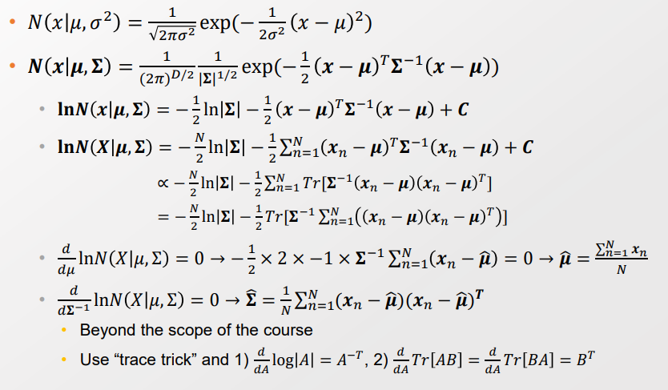
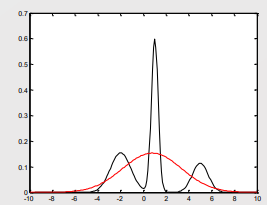
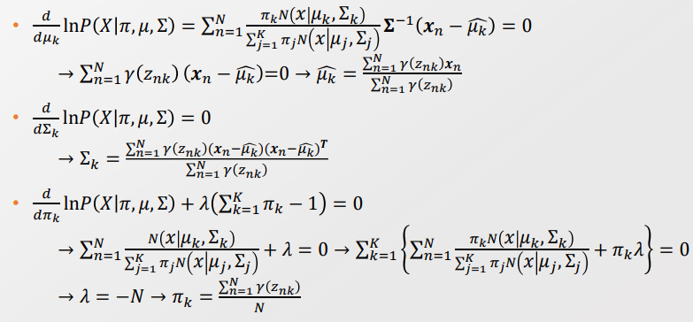
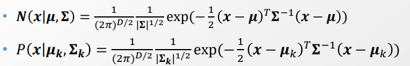
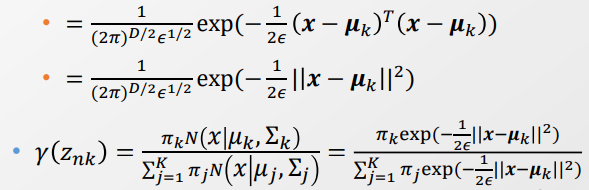
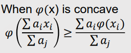
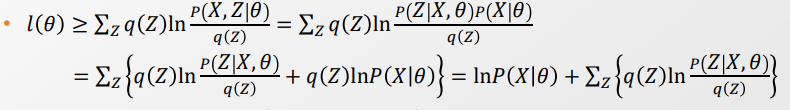
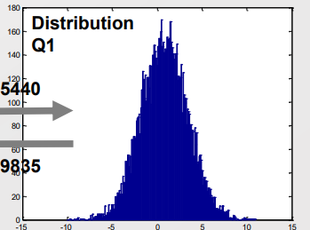
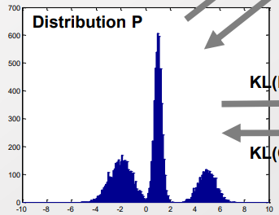
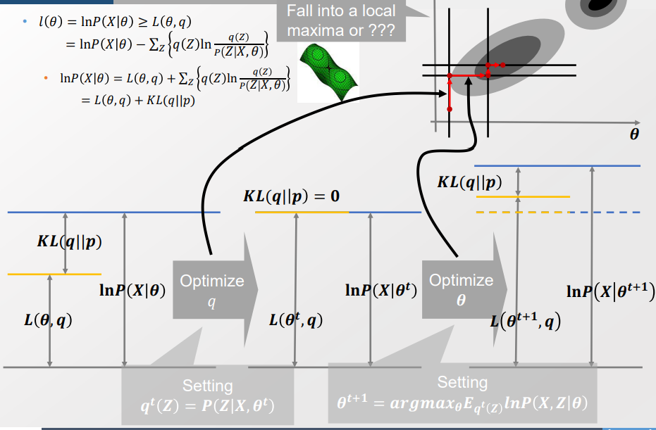

#### 2주차 - k means Algorithm

출처 : GSDS 문일철 교수님 - "Application of AI and DM Technology"

##### K-means Algorithm

- k 개의 중심점을 설정한 다음, 거리를 기반으로 가장 가까운 점들을 Clustering 하는 것
  
  > Minimize J : <mark>$\sum^N_{n=1} \sum^K_{k=1} r_{nk} ||x_n-\mu_k||^2$</mark>
  > 
  > > $r_{nk} :$ n개의 점들이 k개의 Cluster에 속했는지 여부(0,1의 BInary 값)
  > > 
  > > $\mu_k$ : k번째 중심점의 위치 (평균이 아님!)
  
  - $r_{nk}, \mu_k$ 을 최적화함으로써 J를 최소화할 것임.
    
    - $r_{nk}, \mu_k$ <u>두 값은 상호작용하기 때문에 교대하며 최적화할 것이다</u>. (ex- EM 방식)
    
    - 이 방식은 <mark> Decision Variable이 많은 경우 항상 적용하는 방법</mark>이다. 

- **<mark>E-M Algorithm </mark>**
  
  - E(xpectation) : 주어진 파라미터 기반으로 기댓값을 갱신
    
    - $r_{nk}$  를 가장 가까운 Centroid(k)로  업데이트
    
    > $r_{nk} =$ {0,1}
  
  - M(aximization) : 주어진 샘플값을 기반으로 가장 가능성 높은 파라미터를 갱신
    
    - $\mu_k$ 를 업데이트 
    
    > $\frac{dJ}{d\mu_k} = \frac {d}{d\mu_k} \sum^N_{n=1} \sum^K_{l=1} r_{nl}||x_n-\mu_l||^2 = \frac{d}{d\mu_k} \sum^N_{n=1} r_{nk}||x_n - \mu_k ||^2$
    > 
    >         $= \sum^N_{n=1} -2r_{nk}(x_n-\mu_k) $
    > 
    >         $= -2(-\sum^N_{n=1} r_{nk}\mu_k + \sum^N_{n=1} r_{nk} ||x_n - \mu_k||^2$
    > 
    > <mark>$\mu_k = \frac{\sum^N_{n=1} r_{nk} x_n}{\sum^N_{n=1} r_{nk}}$</mark>

- 아직까진 E-M Algorithm을 사용하는 데 있어 Probabilty 함수가 적용되지 않았다. 
  
  - 하지만 Minimize의 대상인 J 값이 Mean-sqaured error로 정의된 것으로 보아, Normal distribution을 이미 가정하고 있다. 
    
    > Normal distribution : $\frac{1}{\sigma \sqrt{2\pi}} exp(-\frac{(x-\mu)^2}{2\sigma^2})$
    > 
    > Mean-square error는 Normal distribution에 log를 취한 것에서부터 유래했다. <mark>즉, Mean-square error로 정의하는 것은 Normal을 전제로 한다.</mark> 
  
  - 이미 Normal을 가정하고 있기 때문에 언제든 Probability 형태로 표현가능해진다.

- **Property of K-means algorithm** 
  
  - 클러스터의 개수가 정해져 불확실하다.
  
  - 중심점의 최초 위치가 어디냐에 따라 결과가 달라질 수 있다. 
  
  - 거리 측정 방식에 따라 한계가 있다. 
  
  - Hard 클러스트링 했을 때, 기존 특성이 덮여버릴 수 있다. 
    
    > ex)- 빨간 30%, 파랑 70% 였는데, Clustering 시 파랑 100%로 단순화된다.

----

#### Gaussian Mixture model

**Multinomial Distribution**

- k 개의 Binary Variance 중 1개를 선택하는 것. [Binomial distrubution 일반화]

> $\sum_k x_k = 1, P(X|\mu) = \prod^K_{k=1} \mu_k^{x_k} s.t. \mu_k >=0, \sum_k \mu_k =1$
> 
> > $x_k : ${0,1}. 해당될 때에만 1의 값을 가진다. 

- N개의 Selection을 할 경우,
  
  >  $P(X|\mu) = \prod^N_{n=1} \prod^K_{k=1} \mu_k^{x_nk} = \prod^K_{k=1} \mu_k ^{\sum^N_{n=1} x_{nk}} $=<mark> $\prod^K_{k=1} \mu_k^{m_k} $</mark>
  > 
  > > $m_k = \sum^N_{n=1} x_{nk}$
  > 
  > - N개의 선택 중 k 번째 옵션을 선택한 횟수를 의미 
  > 
  > => <u>Distribution 형태로 표현할 수 있다. </u>

- **Distribution을 알 때 할 수 있는 것**
  
  - 샘플을 생성할 수 있게 해준다.
  
  - 밀도 측정(Density estimation)이 가능하게 해준다.
  
  - => <u>보다 정확한 Distribution을 위해 파라미터 $\mu$을 최적화해줘야 한다.</u> 
    
    - 파라미터 $\mu$ 를 최적화하는 방법은 많다. 그 중에 하나가 Maximum likelihood 이다. 

- **Lagrange Method - 파라미터 $\mu$ 최적화 방법의 일환**
  
  - 파라미터 $\mu, m, \lambda$ 에 대해서 Lagrange Function으로 정의 
    
    > $L(\mu, m, \lambda) = \sum^K_{k=1} m_k ln\mu_k + \lambda(\sum^K_{k=1} \mu_k -1) $
    > 
    > > $\mu_k$는 $\prod$ 연산을 거치기 때문에 반응 정도를 낮추기 위해 log를 사용 
    > > 
    > > *Q. 왜 $\lambda$ 부분에 -1을 하지?*
  
  - Lagrange function을 편미분하여 optimal value를 찾는다.
    
    > $\frac{d}{d\mu_k} L(\mu,m, \lambda) = \frac{m_k}{\mu_k} + \lambda = 0  →$ <mark>$\mu_k = -\frac{m_k}{\lambda}$</mark>
  
  - 제약조건을 사용하여 제약 조건 내 최적값을 찾는다. 
    
    > 제약조건 : $\mu_k >= 0 , \sum_k \mu_k =1$, when $m_k = \sum^N_{n=1} x_{nk}$
    
    > $\sum_k \mu_k =1$ 
    > 
    > $→ \sum_k -\frac{m_k}{\lambda} =1 $
    > 
    > $→ \sum_k m_k = -\lambda $
    > 
    > $→ \sum_k \sum^N_{n=1} x_{nk} = -\lambda$
    > 
    > $→ N = -\lambda$
    > 
    > <mark>$\mu_k = \frac{m_k}{N} = \frac{발생 수}{ 총 시행 수}$ : Maximum parameter of multinomial distribution</mark>
    > 
    > - 추후에는 Gaussian Distribution 외에 다른 분포에서도 MLE를 잘 도출해낼 수 있어야 한다.

-----

##### **Multivariate Gaussian Distribution**

- 

- 나중에는 Gaussian Distribution 외에 다른 분포에도 MLE를 도출해낼 수 있어야 한다.

----

**(Gaussian) Mixture model**

- 데이터가 하나의 분포가 아닌, 여러 분포에서 나왔다고 가정한 모델
  
  
  
  > $P(x) = \sum^K_{k=1} \pi_k N(x|\mu_k, \sigma_k)$
  > 
  >             $= \sum^K_{k=1} P(x_k) P(x|z_k)$
  > 
  > > $\pi_k$ : Mixing coefficients. s.t. $\sum^k_{k=1} \pi_k = 1, 0 <= \pi_k <= 1$
  > > 
  > > - Probability 조건을 성립할 수 있도록 Discounting 해주는 역할  
  > > 
  > > <mark>$z_k$</mark> : New variable s.t. $z_k \in$ {0,1}. <mark>[Latent Variable]</mark>
  > > 
  > >  s.t. $\sum_k z_k = 1, P(z_k =1 ) = \pi_k, \sum^K_{k=1} \pi_k=1, 0 <=\pi_k <=1$
  > > 
  > > P(z) = $\prod^K_{k=1} \pi_k^{z_k}$  
  > 
  > $P(X|z_k=1) = N(x|\mu_k, \sum_k)$       (이때 $\sum_k$ 는 k번째 공분산을 의미)
  > 
  > → $P(X|Z) = \prod^K_{k=1} N(x|\mu_k, \sum_k)^{z_k}$

- **Mixture 모델의 Graphical 형태**
  
  
  
  > $\pi, \mu, \sum$ 은 파라미터로 Decision Variable, X는 Observed Variable. 
  > 
  > 즉, Latent variable인 z값만 Inference 대상이 됨
  > 
  > 만약, 파라미터가 Distribution 형태가 된다면 Prior(distribution) 모델이 된다?
  
  - **각 $x_n$이 특정 Cluster에 속할 확률 계산하기 [Conditional probability]**
    
    > $\gamma(z_{nk})$을 $p(z_k =1 |x_n)$ 이라 하자 
    > 
    > $\gamma(z_{nk}) = \frac{P(z_k=1) P(x|z_k=1)}{\sum^K_{j=1} P(z_j=1)p(x|z_j=1)}$      [Bayesian Network에 의거 Factorize]
    > 
    >               $= \frac{\pi_k N(x|\mu_k, \sum_k)}{ \sum^K_{j=1} \pi_i N(x|\mu_j, \sum_j)}$
    > 
    > > $\theta = [\mu, \sum, \pi]$ : 파라미터. 이 값을 알아야 z의 값을 구할 수 있다. 
    > 
    > - 이때 <mark>$\gamma(z_{nk})$</mark> 은 <u>'각 $x_n$이 kth cluster에 매칭될 확률'</u>를 의미한다.  <mark>[Assign probability]</mark>
    > 
    > - 가장 $\gamma(z_{nk})$ 의 값이 큰 것으로 $r_{nk}$을 갱신한다 
  
  - **편미분을 통해 각 $x_n$ 특정 Cluster에 속할 확률을 최대화하는 파라미터들로 갱신**
    
    
    
    > 여러 값들을 $\gamma(z_{nk})$ 로 변경
    > 
    > $\mu_k$, $\sum_k, \pi_k$ 값 갱신하기 

- **단, Gaussian Mixture Model은 Cluster 모델이 아니다!**
  
  - Mixture 모델 설정 상 Cluster가 나온거지, Cluster 자체가 목적이 아니다. 
  
  - <u>Gaussian Mixture Model의 목적은 Density estimation 이다! </u>
    
    - 다른 Distribution을 적용할 때에도 동일하게 Density estimation을 추구한다.

- **k-means 와 GMM의 관계**
  
  - GMM의 Covariance를 $\epsilon I$ 라고 가정해야 K-mean과 유사해진다. 
    
    <mark>[k-mean은 GMM의 매우 특수한 경우이다.]</mark>
    
    
    
    - 이때, $\sum_k = \epsilon I$ 라고 해보자 
      
      
    
    > $\epsilon → 0 $ 일때, $||x - \mu_k||$는 0에 가장 늦게 수렴한다. 
    > 
    > 다른 항목들이 0이 될 때, 가장 큰 값인 $exp(-min(||x-\mu_k||^2))$ 만이 유의미한 값으로 수렴한다. 
    > 
    > <mark>즉, min($||x-\mu_k||^2)$ 외에는 고려하지 않는 Hard assignment가 된다. </mark>
  
  - GMM은 k-means이 Soft assignment + Covariance matrix learning 한 일반화이다. 

----

##### EM Algorithm

- Supervised / Unsupervised learning 이 섞여 있는 경우가 너무 많다. 

- <mark>즉, SL/USL 두가지를 언제 나눠서 사용하는지, 상황을 이해하는게 더 중요하다.</mark>
  
  - Latent Variable 유무는 주어지는 X,y의 형태, 조건에 따라 변한다. 
    
    > Latent Variable : 숨겨져 있는 변수들 
    
    - Training 모델에서는 X(input), Y(label) 이 모두 주어짐(SL 버전)
      
      - Latent variable이 없음 
    
    - Tasking 모델에서는 X만이 주어짐. 이때는 Latent Variable이 있음 
      
      > Tasking : Query를 날려서 그에 대한 그럴듯한 답안을 얻는 것. 
  
  - **즉, Bayesian Network을 설정하고 나서, 사용 형태와 시점, 용도에 따라서 Latent Variable이 생겼다 없어졌다 한다.**

- 단,<u> 특정 모델에서는 Latent Variable이 항상 존재할 때도 있다. </u>
  
  - 이것은 Variable z에 대해서 어떠한 주장(추론)도 할 수 없음을 의미하고, 
  
  - 최적화를 하는 대상은 Z를 고려할 수 없기 때문에 Partial Joint Distribution에 한정되며, 
  
  - 즉, <mark>Query에 대한 답변을 위해 필요한 Full joint Distribution을 구하기 위해선</mark>,  <mark>Z에 대해서 Marginalization을 해야만 한다.</mark>
    
    > Optimizing $P(X|\theta) = \sum_ZP(X,Z|\theta)$
  
  - 이것은 한편으로 Latent Variable이 존재할 때, **편미분을 통해 최적값으로 업데이트 하는 것이 아닌, EM 또는 다른 번거로운 방법을 써야만 하는 이유**이다.
    
    > *아직 완전히 이해가 안되는 기분. 뭔가 하나 부족해*
    > 
    > Latent Varible은 파라미터에 따라서 변화하며, 파라미터는 E에 따라 계속 변하기 때문?
    > 
    > Latent Variable은 Marginalization을 통해 고려하지 않으려고 하니, 고려하지 않는 상태에서 바로 해석적으로 최적값을 찾는 건 어렵다? 
  
  - 더 나아가, Latent Variable이 존재함에도 불구하고 EM, Evidence Low bound를 사용해야 하는데 사용 안했다면 잘못 접근한 것이다. 
    
    > Evidence Low Bound(ELBO) : 우리가 관찰한 P(z|x)가 다루기 힘든 분포를 이루고 있을 때 좀 더 다루기 쉬운 분포인 q(x)로 표현하는 과정에서 사용하는 lower bound 

- 또한 likehood를 알기 위해 Log를 사용하면 미분이 잘 적용되지 않는다. 
  
  > $P(X|\theta) = \sum_Z P(X, Z|\theta)$
  > 
  > $→ ln P(X|\theta) = ln(\sum_Z P(X,Z|\theta))$
  > 
  > - ln를 미분하면 식이 분모에 그대로 간다. 
  > 
  > - 즉, n번 미분하는데 계산이 많이 필요하다.

-----

**Probability Decomposition** 

- **'Log를 씌었을 때 미분이 잘 안된다'를 해소하기 위해** q(z)와 Jensen's equality를 적용 
  
  > Likelihood($\theta$) = $ln P(X|\theta) = ln(\sum_Z P(X,Z|\theta) $= <mark>$ln(\sum_Z q(z) \frac{P(X,Z|\theta)}{q(z)})$</mark>
  > 
  > > [전제] q(z)는 0 이상이여야 한다. 0에 가까워지면 GAN에서 오류가 발생
  > 
  >  [Jensen's Equality. log를 식 안으로 넣기]
  > 
  > $         = ln(\sum_Z q(z) \frac{P(X,Z|\theta)}{q(z)}) >= \sum_Z q(Z) ln \frac {P(X,Z|\theta)}{q(Z)} $
  > 
  > $= \sum_Z q(Z) ln P(X,Z|\theta) - q(Z) lnq(Z)$
  > 
  > $= E_q(Z) ln P(X, Z|\theta) + H(q)$ 
  > 
  > > H(q) = $-\sum_X P(X=x) log_b P(X=x)$
  > 
  > $Q(\theta, q) = E_{q(Z)} ln P(X,Z|\theta) + H(q)$
  > 
  > - $Q(\theta, q)$ 는 모든 q 분포에 성립하며, 이러한 분포를 우린 Posteriority(사후 확률)이라 한다. 
  > 
  > - 사후 확률은 Basian Network를 통해서 사전 확률로 바꿀 수 있다.

- 다른 방식으로도 표현할 수 있다. 
  
  > 
  > 
  > $L(\theta, q) = lnP(X|\theta) - \sum_Z(q(Z) ln\frac{q(Z)}{p(Z|X, \theta) } )$
  > 
  > > 이때 두번째 항은 KL Divergence와 동일하다. 
  > > 
  > > $KL(q(Z)||P(Z|X,\theta)) = \sum_Z(q(Z) ln \frac{q(Z)}{P(Z|X,\theta)} )$

------

**KL Divergence**

- KL Divergence는 두 분포간의 차이를 측정한다. [Aymmetric]
  
  > $KL(P||Q) >= 0 $
  > 
  > P와 Q가 완전히 동일할 때만 KL(P||Q) =0 이 된다. 

- KL Divergence는 크게 2가지 행동 패턴이 있다. 
  
  1. Covering Behavior : 모두를 포괄하는 일반화된 1개의 분포 찾기
     
     
  
  2. Capturing Behavior : 각각 가장 적합한 분포로 매칭 
     
     
  
  > 둘다 상황에 따라 필요로 하는게 다르다. 

**Maximizing the Lower Bound** 

- Lower Bound를 크게 만들수록 값이 정밀해진다. 

- 기존 식(l($\theta$) -check 필요)은 $\theta$ 과 $z$ 가 주어지면 하나의 결과값이 정해진다. 
  
  - 대신, Lower bound에 제약을 추가함으로써 Q의 값을 최적화한다. 
  
  > $L(\theta, q) = lnP(X|\theta) - \sum_Z(q(Z) ln\frac{q(Z)}{p(Z|X, \theta) } )$
  > 
  > 이 때 첫번째 항은 t 시간일 때 $\theta$가 고정됨에 따라 Fix 된다. 
  > 
  > 두번째 항(KL-Divegence)은 q(z)를 설정함에 따라 변동 가능하다. 
  > 
  > - $KL(q(Z)| P(Z|X,\theta)) = 0 $
  > 
  > - → $q^t(Z) = P(Z|X, \theta^t)$ [이때 Z 값은 가장 높은 확률값을 가지게 하는 값]
  >   
  >   - 추가로 이 조치는 <u>Z 값을 Sudo-Known Variable로 만들게 됨.</u> 
  
  > <mark>→ Q($\theta, q^t$) = $E_{q^t(Z)} lnP(X,Z| \theta^t) + H(q^t)$</mark>

- 따라서 파라미터 $\theta$를 최적화 하는 것은 아래와 같다. 
  
  > <mark>$\theta^{t+1} = argmax_\theta Q(\theta, q^T) = argmax_\theta E_{q^t(Z)} lnP(X,Z|\theta)$</mark>
  > 
  > > $q^t(Z) : $ t 시간에 Latent variable에 대한 Distribution 파라미터
  > > 
  > > lnP(X,Z|$\theta$) : t 시간에 최적화된 log likelihood 파라미터 

- 이제 Z값을 Sudo-known Variable 이 되었기 때문에, 이제는 Supervised learning의 Training과 동일하게 됨. 
  
  - 이제는 EM 과정 없이 바로 최적값을 찾을 수 있게 되버림. 

--------------

##### EM 과정의 시각화

- E- Step 
  
  - p의 근사 분포인 q를 최적화함으로써 Lower bound를 최대화 시킨다. 

- M-Step 
  
  - q가 변화했기 때문에, 이에 맞춰서 걸맞는 Parameter $\theta$를 할당해준다. 
  
  - 이때 우리의 목표는 $lnP(X|\theta^{t+1})$ 을 키워주는 것으로, 변화한 q에 맞춰 더욱 크게 설정하게 된다. 
  
  - 이때 생겨나는 $lnP(X|\theta)$의 차이를 Variation R(?) Gap이라고 부른다. 
