### 3주차 - Hidden Markov Model & Conditional Random field

##### Why we should learn Hidden Markov Model?

- 최근들어 Hidden Markov Model은 잘 다루지 않는다. 
  
  - 그럼에도 다뤄야 할 필요가 있다. 

- 앞서 K-means / EM Algorithm을 다룰 때 있어 Latent Variable이 i.i.d. Condition을 충족한다고 가정했다. 
  
  - 하지만, <u>현실에선 i.i.d 가정이 파괴될 경우가 종종 있다.</u> 
    
    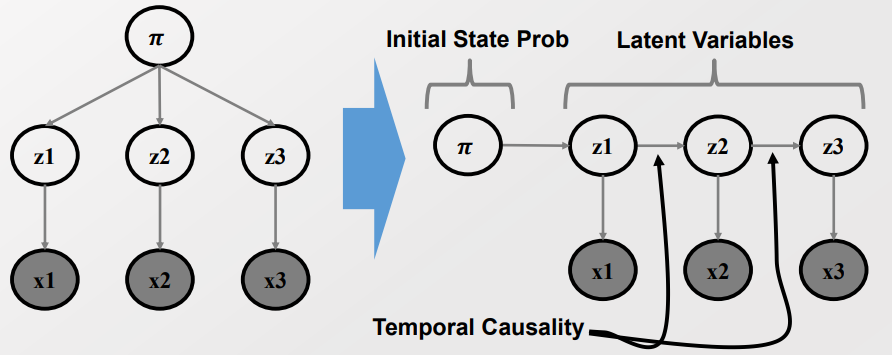
    
    > 우측에서 x1은 z1에 의해서만 생성된다. 하지만 Z3와의 Dependency를 가진다. 
    > 
    > -> 생성 유무와 Dependency는 구분하여 고려해야 한다.
  
  - 이때 Hidden Markov Model이 적용될 수 있다.

- 추가로 Parameter $\theta$ 도 안주어질 때가 많다. 이땐 E-M Algorithm을 통해 점차 최적화해나가면 된다. 

##### HMM의 의의

- Directed Model의 경우 Neural Network가 더 뛰어난 성능을 거둠 

- 따라서 **HMM은 NN이 커버할 수 없는 Undirected model, Contidional random field 에서 유용성이 있다**. 

-----------

##### Hidden Markov Model

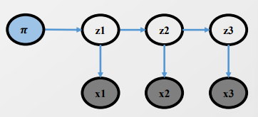

> Observed Data(x) 와 Latent Variable(z) 는 Discrete / Conti 다 될 수 있다.
> 
> 여기선 편의를 위해 둘다 Discrete한 경우로 설명하겠음 

- Model의 구성 - Stochastic Generative Model 
  
  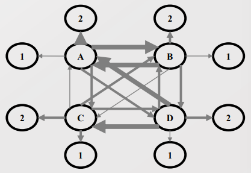
  
  > Initial State prob : $P(z_i) \sim Mult(\pi_1, ... , \pi_{k})$
  > 
  > > Q. $\pi$ 가 의미하는 건 무엇인가? 각 $z_i$에 속할 확률 값? 이게 맞는 듯. 
  > > 
  > > 각각의 Latent Variable이 분포할 확률을 의미하나? 
  > 
  > Transition prob $a_{i,j}$ : $P(z_t|z_{t-1}^i =1) \sim Mult(a_{i,1}, ..., a_{i,k})$
  > 
  > Emission prob $b_{i,j}$ : $P(x_t|z_t^i =1 ) \sim Mult(b_{i,1}, ..., b_{i,m}) \sim f(x_t|\theta_l)$

- **HMM의 주요 질문 - EM과 동일함!** 
  
  1. Evaluation question : How much X likely to be observed in the trained model? 
     
     > 조건 : $\pi, a, b, X(observed Data)$ 주어짐 
     > 
     > 목표 : $P(x|M, \pi, a, b)$ 를 계산하자 
     > 
     > - 모든 값이 주어져 있으니 Likelihood만 계산하면 됨 
  
  2. Decoding Question : What would be the most probable sequences of latent states? **[E-Step]**
     
     > 조건 : $\pi, a, b, X$ 주어짐 
     > 
     > 목표 : $argmax_z P(Z|X,M, \pi, a, b)$ 인 Z의 값으로 assign하자
     > 
     > - <mark>여기서 GMM과 HMM이 달라짐. </mark>
     > 
     > - <u>i.i.d. 조건이 깨졌기 때문에 Joint distribution에 대한 Well-factorizition이 불가하다</u>. 즉, <mark>고려해야할 경우가 너무 많다.</mark> 
  
  3. Learning Question : What would be the underlying parameters of the HMM given the observations? **[M-Step]**
     
     > 조건 : X 
     > 
     > 목표 : $argmax_{\pi, a, b} P(X|M, \pi, a, b)$ 인 Parameter $\theta$ 를 찾아라 
     > 
     > - Latent Variable Z가 있는 상황이므로 E-M Algorithm을 필요로 한다. 

--------------

##### How to deal Calculate P(Z|X) when iid condi is collapsed.

- i.i.d. 조건이 있을 경우 우린 $P(X,Z)$ 를 다음과 같이 효율적으로 계산할 수 있다. 
  
  > $P(X,Z) = P(x_1, ..., x_t, z_1, ..., z_t)$
  > 
  >                    $= P(z_1) P(x_1|z_1)P(x_2|z_2) .... P(x_t|z_t)$

- 하지만 Latent Variable z 간에 dependence 할 경우 아래와 같이 된다. 
  
  > $P(X,Z) =  P(z_1) P(x_1|z_1)P(z_2|z_1)P(x_2|z_2) .... P(z_t|z_{t-1}) P(x_t|z_t)$

- 이는 $P(X)$ 를 구할 때 아래와 같이 계산해야 함을 의미한다. 
  
  > $P(Z) = \sum_Z P(X,Z) = \sum_{z_1} ... \sum_{z_t} P(x_1, ..., x_t, z_1, ..., z_t) $
  > 
  >             $ = \sum_{z_1} ... \sum_{z_t} \pi_{z_1} \prod^T_{t=2} a_{z_{t-1}, z_t} \prod^T_{t=1} b_{z_t, x_t}$
  > 
  > <mark>-> 계산량을 어마무시하게 필요로 한다. </mark>

- 따라서 Markov Blanket 및 Dynamic Program을 통해  Exponential 한 계산량을 Linear하게 바꿀 것이다. 
  
  > Markov Blanket : Unobserved 노드 간 Independence를 보장
  > 
  > - Parent node, 이웃 노드, Child Node의 다른 Parent 노드가 주어질 때 가능 
  > 
  > Let $A : x_1, ..., x_{t-1}$ , $B : x_t$ $C: z_{t-1}$,  $D : z_t^k =1$ , 
  > 
  > > P(X,Z) = P(A,B,C,D)  
  > > 
  > > - 이때 D는 $z_t^k$ 를 의미. 
  > > 
  > > P(A,B,C,D) = P(A,C) P(D|A,C) P(B|A,C,D)
  > 
  > **By Markov Blanket,**
  > 
  > - $z_t$ 는 A 와 Indep :  $P(D|A,C) = P(D|C))$
  > 
  > - A,C는 D와 Indep : $P(B|A,C,D) = P(B|D)$ 
  > 
  > > P(A,B,D) = $\sum_C P(A,B,C,D)$
  > > 
  > > P(A,B,C) = $\sum_C P(A,C) * P(D|C) * P(B|D)$
  > > 
  > >                $= P(B|D) \sum_CP(A,C) * P(D|C)$ 
  > 
  > Since P(D) = $b_{z_t^k, x_t}$  & P(D|C)= $a_{z_{t-1}, z_t^k}$ , 
  > 
  > > let P(A,C) = $\alpha^k_{t-1}$
  > > 
  > > <mark>P(A,B,D) = $\alpha_t^k = b_{k, x_t} \sum_i \alpha_{t-1}^i a_{i,k}$ </mark>
  > 
  > a,b, Observed Data X가 주어졌을 때 P($z_t^k$|X)는, 아래와 같다. 
  > 
  > > P($z_t^k|X$) = P($z^k_t, X$) / P(X)
  > > 
  > >                 = $\alpha_t^k /P(X)$   
  > 
  > > 또한 <mark>$\alpha_t^k$ 를 구할 때, $\alpha^i_{t-1}$ 만 알고 있다면 Lineal 한 계산양을 필요로 </mark>한다.

> Dynamic Program : 수학적 귀납법 - 반복 계산식 활용 
> 
> 앞서 Markov Blanket으로 간소화한 식을 바탕으로, 한번 $\alpha^t_k$을 구한 것을 반복해서 잘 사용해먹는다 :)  

- 단, 업데이트 방향이 t=1 > t=T 일방향적이라 반대 방향으로도 유사한 과정을 거쳐줘야 함. 
  
  > Let $A : x_1, ..., x_{t}$ , $B : x_{t+1}$, $C: x_{t+2}, ..., x_T$ , $D : z_t^k=1$, $E : z_{t+1}^k =1$
  > 
  > > P(D, X) = P(D, A,B,C) = P(A,B,D) P(C|A,B,D)
  
  > Let $\beta_t^k : P(B, C|D)$,  $\alpha_t^k : P(A,D)$  
  
  > $P(B,C|D) = \sum_E P(B,C,E|D)$
  > 
  >                             $  = \sum_{i=1}^k P(E|D) * P(B|D,E) * P(C|B,D,E)$
  > 
  > By Markov Blanket,
  > 
  > - Given D, A is indep with D. Then P(B,C|A,D) = P(B,C|D)
  > - Given E, D is indep with E. Then P(B|D,E) = P(B|E)
  > - Given E, B&D is indep with E. Then P(C|B,D,E) = P(C|E)   
  > 
  >  $P(B,C|D)$     $= \sum_{i=1}^k P(E|D)* P(B|E)* P(C|E)$
  > 
  >                             <mark>$= \sum_{i=1}^k a_{k,i} * b_{i,x_t} \beta_{t+1}^i$</mark>
  
  > By Markov Blanket, 
  > 
  > - Given D, B&C is indep with A 
  > 
  > Then P(A,B,C,D) = P(B,C|D) * P(A,D)
  > 
  > <mark>P($z_t^k=1, X) = P(A,B,C,D) $</mark> $= \alpha_t^k \beta_t^k$
  > 
  >                            <mark> $= (b_{t, x_t} \sum_i \alpha_{t-1}^i a_{i,k})$ * ($\sum_i \alpha_{k,i} b_{i, x_t}\beta_{t+1}^i$)</mark>

---------------

#### How to Find Most probable assignment of Latent Variable

- Since $P(z_t^k=1, X) =  (b_{t, x_t} \sum_i \alpha_{t-1}^i a_{i,k}) * (\sum_i \alpha_{k,i} b_{i, x_t}\beta_{t+1}^i) $

- let <mark>$k_t^*$</mark> $= argmax_k P(z_t^k=1 |X) = argmax_k P(z_t^k=1, X) =$ <mark>$argmax_k \alpha_t^k \beta_t^k$</mark>

- Let $V_t^k = max_{z_1, ..., z_{t-1}} P(x_1, ..., x_{t-1}, z_1, .., z_{t-1}, x_t, z_t^k=1)$
  
  > Let A : $x_1, ..., x_{t-1}$, B : $x_t$, C : $z_1, ..., z_{t-1}$, D : $z_t^k=1$ 
  > 
  > <mark>$V_t^k$</mark> $= max_C P(A,B,C,D)$ 
  > 
  >       $= max_C P(B,D|A,C) * P(A,C) $
  > 
  > > Given $z_{t-1}$ , A & C/{$z_{t-1}$} is indep with $z_{t-1}$, P(B,D|A,C) = P(B,D|$z_{t-1}$) 
  > 
  > > P(A,C) = P(A/{$x_{t-1}$}, $x_{t-1}$, C/{$z_{t-1}$}, $z_{t-1}$ )
  > 
  >      $= max_C P(B,D|z_{t-1}) P(A/{x_{t-1}}, x_{t-1}, C/{z_{t-1}}, z_{t-1} )$
  > 
  >      $= max_{z_{t-1}} P(B,D|z_{t-1})$ <mark>$max_{z_1, ..., z_{t-2}} P(A/{x_{t-1}}, x_{t-1}, C/{z_{t-1}}, z_{t-1} )$</mark>
  > 
  >       $= max_{z_{t-1}} P(B,D|z_{t-1}) $ <mark>$V_{t-1}^i$</mark> 
  > 
  >       $= max_{i \in z_{t-1}} P(B,D|z_{t-1}^i =1) $ $V^i_{t-1}$ 
  > 
  >       $= max_{t \in z_{t-1}} P(B|D) P(D|z_{t-1}^i =1) V^i_{t-1} $
  > 
  > > *How?* 위에 부분이 어떻게 전환시킨 건지 감이 안옴. 
  > 
  >        $= P(B|D) max_{t \in z_{t-1}} P(z_t^k =1 | z_{t-1}^i =1) V_{t-1}^i$
  > 
  >       <mark> $= b_{k, idx(x_t)} max_{i \in z_{t-1}} a_{i,k} V^i_{t-1}$</mark>

- 이렇게 Most assignable of Latent Variable도 Dynamic Probramming을 통해서 계산!

---

##### Feature of Hidden Markov Model

- 한계 : HMM은 아래 상황에 해당하는 경우에 한정된 Dependencies를 포착한다.
  
  - Emission : 현재 시각에서 상태와 관측(또는 발생한 사건) 사이의 관계
  
  - Transition : 이전 시각와 현재 시각 사이의 상태
  
  - 상태의 Forward 관점에서의 Dependency
    
    - Backward 방식은 고려하지 못한다.

- HMM은 Generative model의 일종으로 Classification에도 이용될 수 있다. 
  
  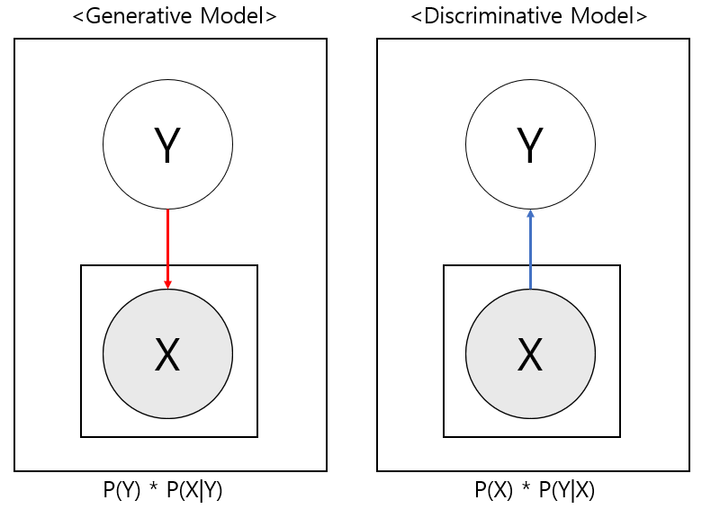

- **반면 MEMM의 경우 Discrimative Model로 Classification에'만' 사용된다.**
  
  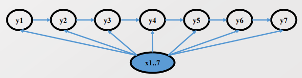
  
  > MEMM : Maximum Entropy Markov Model. 지금은 거의 않쓰임 
  > 
  > 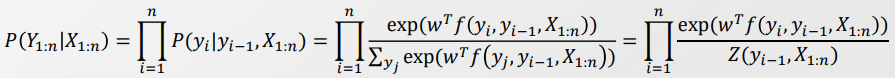
  > 
  > - 2번째 항에서 3번쨰 항으로 넘어갈 때, Conditional probability( - '|')이 사라진다. 
  > 
  > - 즉, Undirected Model과 동일하게 고려할 수 있다. 
  >   
  >   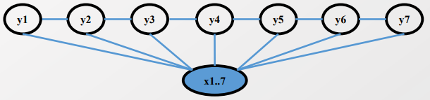

------------------

#### Conditional Random Field(CRF)

- **Undirectd Graphical Model**
  
  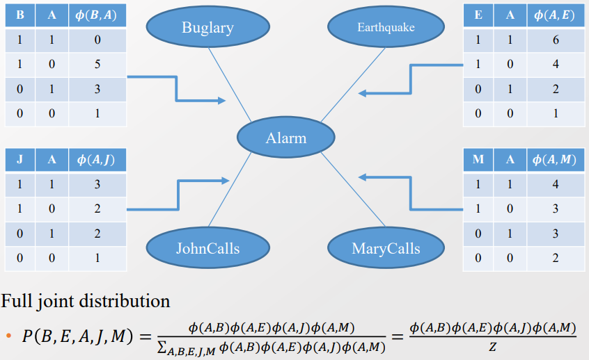
  
  > 이때의 P는 Potential Func(Unnormalized probability)을 의미한다! 
  
  - 기존의 Bayesian Network, Neural Network는 Directed Model을 가정했다. 
    
    - Undirected Graphical Model과의 비교를 통해 Direct Model가 얼마나 의미있는지 확인해보자. 
  
  - 한편으론 우린 인과관계(Direct-direction) 보다 <u>각 사건 간의 관련성 또는 독립성에 더 관심이 많다</u>. 
  
  

- **Markov random field** - in Undirected graphical model 
  
  - 정의 : Undirected graphical model G 에서 각각의 노드 $x_i$ 의 확률 분포
  
  > $p(x_1, ..., x_n) = \frac{1}{Z} \prod_{c \in C} \phi_c(x_c)$
  > 
  > > C : set of cliques of G(Undirected Graphical Model)
  > > 
  > > $\phi_c$ : nonnegative function over the variable variables in a clique 
  > 
  > $Z = \sum_{z_1, ..., x_n} \prod_{c \in C} \phi_c(x_c)$
  > 
  > > Z : partiton function to normalize 
  > 
  > ex)- $P(B,E,A,J,M) = \frac{\phi(A,B) \phi(A,E) \phi(A,J) \phi(A,M)}{\sum_{A,B,E,J,M} \phi(A,B) \phi(A,E) \phi(A,J) \phi(A,M)}$ 
  > 
  >                                             = $\frac{\phi(A,B) \phi(A,E) \phi(A,J) \phi(A,M)}{Z}$ 

- ##### Conditional random field defines
  
  
  
  - Conditional random field 에선 2가지를 고려한다. 
    
    - Potential function between state transition 
    
    - Potential function between the state and the obsrvations 
    
    - -> 최초에는 Potential Function으로 정의하나, 마지막에 Z로 Normalize 시켜준다.
    
    
  
  > 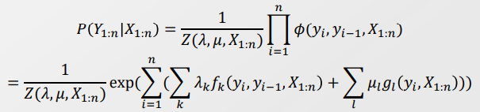
  > 
  > > $\lambda_k, \mu_l$ : 각 $f_k, g_l$ 함수에 대한 가중치 
  > > 
  > > - 확률값이 $f, g$의 Linear combination의 형태로 이뤄져 있다고 가정함 
  > 
  > > $f_k, g_l$ : 임의의 함수. 마음대로 정의할 수 있어 다양한 형태를 표현하는 데 사용됨
  > 
  > 위의 식에서 Z값으로 Normalize 했기 때문에 전체 경우의 합은 1과 같다. 
  
  > 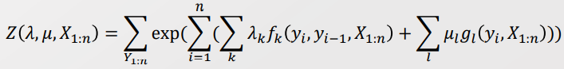
  > 
  > - Tip ; $\phi$를 exp의 형태로 나타낸 것은 Potential 함수의 nonnegative 조건을 충족시키기 위함이다. 

- **이후 E-M 알고리즘과 동일하게 진행한다.**
  
  -  주어진 Parameter 값을 기반으로 Most propable $\lambda_k, \mu_l$ 을 할당한다. 
    
    > 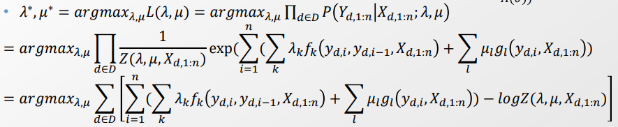
  
  - Loss 함수를 $\lambda_k, \mu_l$ 를 기반으로 최소화하는 값으로 Parameter을 최적화시킨다. 
    
    - 이때 Simple gradient method를 적용한다.
    
    > 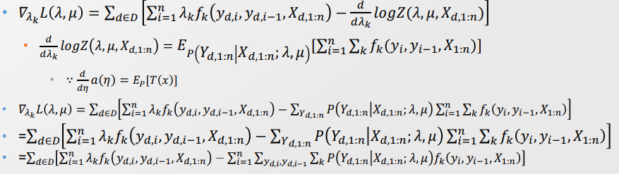
    > 
    > <mark>$a(\eta)$의 1st-derivative는 Exponential Family의 특성을 통해 쉽게 구한다.</mark>

- 이후 CRF는.. 
  
  - Deep learning의 특성과 CRF의 특성은 겹치는 면이 있어 상호보완적으로 사용되었다. **Transfomer가 등장하기 전까지..**
    
    - 모델 구조 : CRF 가정은 DL의 Logistic activation function dml Neuron과 유사
    
    - 모델 추론 : DL, CRF 모두 Gradient descent 사용 
    
    > ex)- bi-direction LSTM 

---- 

#### Exponential Family

- 정의 : $P(x|\theta) = h(x) exp(\eta(\theta) * T(x) - A(\theta))$ 의 형태를 띄는 지수 함수들 
  
  > T(x) : Sufficient Statistics 
  > 
  > $\eta(\theta)$ : Natural parameter - 우리가 구하고자 하는 목표 
  > 
  > h(x) : Underlying measure 
  > 
  > A($\theta$) : log normalizer. exp 밖으로 나가면 정규화 계수가 된다. 
  
  > ex)- Normal DIstribution , Dirichlet Distribution, <u>Conditional random Field</u>

- <u>Exponential Family를 만족할 경우 아래 식을 통해서 Natural parameter의 1st derivative를 쉽게 구할 수 있다. </u>
  
  > 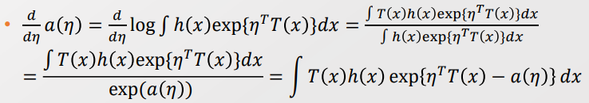
