#### 4주차 - Sampling Based inference

###### 서론

- 모델 추론에 있어서 대부분의 방법은 계산량 때문에 Infeasible 하다 
  
  > Why? 계산량이 얼마나 많길래? 
  > 
  > Bayesian Inference Algorithm에서, Likilihood인 P(D|H) 와 Prior인 P(H)이 주어진다 하더라도 Evidence term에 대한 계산하기란 매우 어렵다. 즉, 목표인 Posterior을 구하는데 제한이 있다.
  
  > Evidence term : $\int_H P(D|H')P(H')dH'$
  > 
  > Posterior = $\frac{Likelihood * Prior}{Evidence form}$

- 그나마 ELBO method가 Feasible 하나 단점이 있다. 
  
  1. 직접적으로 Optimizing을 못한다.
  
  2. Jensen's equaility & Variatinal Error(?) 로 Optimal Solution과 차이가 생긴다
  
  3. <mark>Local Optima에서 못 빠져나온다.(- 모든 Gradient based method에게 해당)</mark>

**→ Gradient-based 외의 방법이 필요하다.**

- Sampling-method은 이 문제를 해결할 수 있다. 
  
  > 특히 Posterior이 High-dimension일 경우 Directly sampling은 어렵다. 따라서 근사할 수 있는 알고리즘(MCMC, VI)을 사용한다. 

--------

##### Sampling-based 방법의 종류

- Forward sampling : 모든 경우가 나올 때까지 경우의 수를 확인한다. 느려서 안쓴다. 

- Rejection Sampling : 조건을 충족하지 않는다 싶으면 계산 중간에 그만둔다.
  
  > Rejection Sampling 은 요즘에 잘 사용되고 있지 않음. 역사적인 관점에서 다룸 
  
  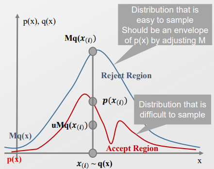
  
  > p(x) : Rejection Sampling 을 적용했을 때의 분포 
  > 
  > q(x) : 임의의 확률분포. 충분히 큰 값 M을 곱하여 p(x)를 전부 포괄하도록 한다. 
  > 
  > - M이 작다면 중간에 p(x)와 Mq(x)가 겹치는 부분 이후는 고려하지 못한다. 
  > 
  > - 왜냐하면, q를 nomal distribution으로 고려하며, 조건 식을 $u < \frac{p(x_{(i)})}{Mq(x_{(i)})}$ 로 두었기에 때문에, M이 충분히 크지 않다면 고려해야 하는 상황인데도 잘라버릴 수 있다. 
  >   
  >   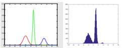[좌 : p(x), 우 : p(x)를 덮지 못한 m(qx)] 
  
  - 단점 : P(x)의 값을 모르기 때문에 일단 M을 크게 잡아야 한다. 하지만 적절하게 Rejection을 못하기 때문에 효율이 떨어진다. 

------------

#### Importance Sampling

- VAE 등과 같이 현재에도 쓰이는 방법 

- <u>Rejection 방법은 필요할 수도 있는 데이터를 버려 비효율성이 발생할 수 있다.</u> 
  
  - 즉, 데이터를 버리지 않으면서 각각의 중요도를 고려할 수 있는 방법이 필요 
  
  - Importance Sampling은  최대한 자료의 정보를 반영함과 동시에, 모든 데이터를 활용한다는 비효율성을 고른 만큼 그 외 부분에서 효율성을 얻고자 한다. 

- 과거에는 <u>확률의 분포(PDF)을 알아내어 데이터의 분포를 확인하는 것</u>을 목표로 했다. 
  
  - 그러나 최종적으로 <u>우리의 목적은 Query에 대해서 Most Probable Answer을 하는 것을 목표</u>로 하며, 따라서 중간 단계로 **Expectation을 구하는 것을 목표로 한다.** 
  
  - 즉, PDF를 굳이 만들기 위해 샘플링을 많이 하지 말고, **"샘플링 한 것을 버리지 않고서 Expectation을 구해볼 수는 없을까"** 가 해결하고자 하는 문제이다. 
  
  -> Expectation을 확장하여 고민해보자! 
  
  > $E_p(f(z)) = \int f(z)p(z)dz $
  > 
  >                   $= \int f(z) \frac{p(z)}{q(z)} q(z) dz$   (= $E_q (f(z)\frac{p(z)}{q(z)})$)<mark>[like ratio trick]</mark>
  > 
  >                   $\sim \frac{1}{L} \sum_{l=1}^L \frac{p(z^l)}{q(z^l)}f(z^l)$ 
  
  > > L : num of samples 
  > > 
  > > $z^l$ : sample of Z 
  
  - <u>q는 P의 Long Tail에서도 0이 되면 안된다는 강력한 전제를 필요로 한다</u> 
    
    - 이는 모든 상황에 성립하는 것은 아니기에<u> Like ratio trick이 깨질 Risk가 있다</u>
  
  > let <mark>$r^l = \frac{p(z^l)}{q(z^l)}$</mark> 
  > 
  > - 이때 **$r^l$ 은 계산 가능**하다! $q$는 임의의 Distribution이니 정할 수 있다. 
  > 
  > - P(z)의 값은 "like ratio trick" 을 통해 <u>q-sampling으로 변환시 계산가능</u>하다. 
  
  > $P(z>1) = \int^\infin_1 1_{z>1} p(z) dz$
  > 
  >                    $= \int^\infin_1 1_{z>1} \frac{p(z)}{q(z)} q(z) dz$
  > 
  >                    $\sim \frac{1}{L} \sum^L_{l=1} \frac{p(z^l)}{q(z^l)} 1_{z^l>1}$
  > 
  > - P는 모르니 Sampling 할 수 없다. 그러니 알고 있는 Q에 대해서 Sampling 하여 $r^l$ 을 계산하겠다. 
  > 
  > -> <mark>$ r^l = \frac{p(z^l)}{q(z^l)}$ 을 구할 수 있다.</mark>
  > 
  > -> <mark>즉, $E_p(f(z))$ 은 p(z)을 모름에도 구할 수 있게 된다. </mark>

- 이를 통해서 **q-분포를 통해서 나온 모든 값을 버리지 않고 반영한다.** 
  
  - 단, 매우 작은 weight를 부여! 
  
  - => IID 조건에서는 가장 효율적으로 정보를 사용하는 것일 것. 

- 값이 이산인 경우에는 Likely load trick으로도 부르기도 한다. 
  
  - 각 Likelyhood를 가중치로 부여하여 계산한다. 

----- 

##### Markov Chain

- **더 정보를 효율적으로 쓸 수 없을까? [문제]**

- - I.I.D 조건은 과거/현재와의 관련이 없다 가정한다.**(=IID 조건은 현실과 맞지 않다)**
  - **=> 과거와 현재의 연관성을 받아들인 방법을 채택하자! - Markov Chain**

*편의를 위해 이산 상황만 고려하겠음* 

- Continuous 상황에서 Chaining하는 것이 Diffusion 모델이다. 

##### Markov Chain의 특성

- 용어 정리 
  
  > **Accessible** 
  > 
  > - i → j : State j is <u>accessible</u> from i if $T_{i,k}^k$ > 0 and k >=0  
  > 
  > > k번 Transition 이후에도 j로 넘어갈 확률이 0보다 커야 한다. 
  > 
  > - i ↔ j : State i and j <u>communicate</u> if i → j and j → i 
  > 
  > > i와 j가 서로 왔다 갔다 할 수 있다. 
  
  > **Reducibility**
  > 
  > - A Markov chain is <u>irreducible</u> if i ↔ j, $\forall i \in S, \forall j \in S$
  > 
  > > 한번 있었던 노드간의 연결성(Communicate)은 사라지지 않는다. 
  
  > **Periodicity**
  > 
  > - State i has <u>period d</u> if d = gcd{n: $T_{i,i}^n >0 $}
  > 
  > > i에서 다시 i로 주기성을 가지고 돌아온다. 
  > 
  > - if d=1, State i is <u>aperiodic</u>
  > 
  > > 주기성이 없다. 언제 돌아올지 모른다. 
  
  > **Transience**
  > 
  > - State j is <u>recurrent</u> if $P(inf(t>=1 : X_t = j) < \infin|X_0 =j ) =1$
  > 
  > > 최초 상태로 언젠가 돌아온다. 
  > 
  > - State which are not recurrent are <u>transient</u> 
  > 
  > > 최초 상태로 돌아오지 않는다. 
  
  > **Ergodicity**
  > 
  > - A tate is <u>ergodic</u> if the state is (positive) <u>recurrent</u> and <u>aperiodic</u>
  > 
  > > 언제 돌아올지 확답할 수 없지만 언젠가 오긴 온다. 
  > 
  > **→ Markov chain은 모든 State가 Ergodic 하면 Ergodic 하다고 할 수 있다.**

- **Graph Structure 구조를 통해 Markov Chain을 설명해보자**
  
  - Graph Structure 에는 Node와 Link를 가지고 있다. 
    
    > Node : 특정 Distribution의 State(- PDF)를 의미
    > 
    > Ex)- 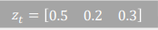. $P(z_t)$ 로도 표현함. 
    > 
    > - 이때 Distribution으로 Multinomial distribution으로 보통 가정하나, 다른 분포도 가용함 
    
    > Link : 각 State 사이에서 Transition이 일어나는 과정을 표현
    > 
    > 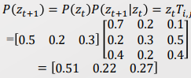
    > 
    > > $P(z_{t+1}|z_t)$ : Transition function(또는 Matrix) 
    > 
    > - 이때 Transition function의 Diagonal 부분은 각 항목들에 대해 얼마나 가중치를 매길 건지를 의미함. 
  
  - 위의 내용을 확률 관점으로 바라보면 다음과 같다. 
    
    - 먼저 Random Variable의 특성을 돌아보자 
      
      - 모든 Random Variable은 Distribution을 따른다. 
      
      - Sampling 될 때에는 특정 경우로 Fix 되어 버린다. 즉, Distribution에서 벗어난다. 
      
      - 이는 Most probable Assignment 될 때에도 동일하다. 
    
    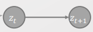
    
    - $z_t → z_{t+1}$ 과정도 Bayesian Network을 따른다. 
    
    > Bayesian Network 에서 원 형태의 Node는 Random variable을 의미한다. 
    > 
    > 즉, $z_t$ 또한 특정 Distribtution(-[0.5, 0.2, 0.3])을 따르고 있음을 의미한다.  
    
    - 각 Expectation을 구할 때 각 Value에 확률 값을 곱한 것을 합한다. 이는 확률에 맞춰 Sampling 하며, 모든 경우의 결과를 평균내는 것과 동일한 의미를 가진다. 
      
      - 즉, 각 Value에 확률 값을 곱하는 것은, 확률 값에 맞춰 Sampling 하는 것과 동일하게 볼 수 있다. 

- **우리는 그럼 어떻게 Markov Chain을 Sampling에 사용할 수 있을까?**
  
  - Markov Chain은 Prop(?) Distributin을 가지고 있다. 
  
  - <mark>우리는 이 Prop distribution을 Stationary Distribution을 바꾸고 싶다.</mark>
    
    - 어떤 Travel을 통해서 Stationary Distribution으로 바꿀 수 있을까? 
    
    - 또한 Stationary Distribution 상황에서는 어떤 특성을 가지나? 
    
    → Travel을 모델링 하는 것은 어려우니, **목표인 Stationary 상황에서 역순으로 고려해보자!**

- **Limit Theorem of Markov Chain**
  
  - 만약 Markov Chain 이 irreducible 하고 Ergodic 하다면, 
  
  - **Stationary distribution $\pi$을 모델링함으로써 문제를 해결하자!**
  
  > $\pi_i$ : $lim_{n → \infin} T_{i,j}^{(n)} = \frac{1}{E[RT_i]}$. i node가 Stationary 상황 아래에서 존재할 확률
  > 
  > - Irreducible 하기 때문에 RT의 존재는 보장된다. 또한 T가 주어지는 RT의 Expectation을 할 수 있겠다. 
  >   
  >   > *How? 무수히 많은 양의 샘플링을 통해서? 어떻게 Expectation을 한다는 거지? 결국 경험해봐야 하는 거잖아. 즉, Stationary까지 일단 무작정 뽑는 건가?* ㅇㅇㅇ 그런듯. 
  >   > 
  >   > 아 아래에서 $\pi$ 를 해석적으로 구하기 때문에 무작정 Sampling 안해도 될듯 
  >   > 
  >   > 아래 $RT_i$ 를 보면 Stationary할 때까지 뽑아야 하는 듯. 
  > 
  > - 위의 Expectation을 기반으로 $\pi_i$ 를 정의한다. 
  > 
  > > $RT_i$ : min{$n>0 : X_n =i | X_0 =i$}
  > 
  > - $\pi_i$ 는 아래 식에 의해서만 Uniquely determined 된다. 
  > 
  > > $\pi_i >=0, \sum_{i \in S} \pi_i =1, \pi_j = \sum_{i \in S} \pi_i T_{i,j}$
  > > 
  > > T : Transition Matrix
  > > 
  > > - $\sum_{i\in S} \pi_i T_{i,j} $ 은 Node i가 모든 스테이트에서 Transition을 거쳐 j 로 이동하는 모든 경우를 고려한 것임. 즉, Transition을 1번, 2번, ... 무수히 거쳐서라도 j에 오는 경우까지 다 고려한 것
  > > 
  > > → 이때 위의 첨자 $(n)$ 이 사라져 있음. **즉, 아무리 Transition을 거쳐도 이 분포에서 벗어날 수 없음을 의미한다.** 
  > 
  > - Station distribution인 $\pi_i$ 의  Support 영역은 sigma algebra를 따른다(? )
  >   
  >   - 이걸 설명하려면 르벡 적분에 대해서 설명해야하니 Skip 

- **남은 문제는 아래 2가지다.** 
  
  1) 어떻게 Stationary distribution $\pi$ 까지 가느냐
     
     → Balance한 조건을 충족시키도록 제한조건을 둔다. 
  
  2) $\pi$ 를 샘플링 할 수 있는 distribution의 형태로 만들 수 있을 것인가? 
     
     → Metropolis-Hastings Algorithm을 적용한다.

- 주어진 Transition Matrix T를 통해 $\pi_i$ 계산하는 방법 
  
  - $\pi$ 의 Stationary 특성을 활용하여 아래 식을 만든다.  
  
  > (1) $\pi_i = \sum_{i \in S} \pi_i T_{i,j}$ ↔ $\pi_i - \sum_{i \in S} \pi_i T_{i,j} =0$ → <mark>$\pi(I_{|S|, |S|} -T)) =0$</mark>
  > 
  > - $\pi$ 는 Stationary 해서 한번 더 Transition한다 해도 동일한 값을 가진다. 
  > 
  > (2) $\sum_{i \in S} \pi_i =1$ →  <mark>$\pi 1_{|S|, |S|} = 1_{1, |S|}$</mark>  
  > 
  > > $1_{1, |S|}$ 는  크기 |S|의 [1,1,1,.... 1]  행렬을 의미함. 
  > 
  > By (1), (2), 
  > 
  > $\pi(I_{|S|, |S|} - T) + 1_{1, |S|} = 0 + 1_{1, |S|}$ 
  > 
  > <mark>→ $\pi(I_{|S|, |S|} - T- 1_{|S|, |S|}) = 1_{1, |S|}$</mark> 
  
  - 이후에 $\pi$ 좌측에 곱해진 Matrix의 Inverse를 양쪽에 곱하는 것으로 $\pi$ 를 구한다. 
    
    > <mark>Q. Inverse가 항상 존재하는 건가? 교수님께 질문 드려 보자!</mark>
    > 
    > - 항상 Inverse가 존재하는 것이 아님! 
    > 
    > - 하지만 Closed 형태로, 이전 단계로 돌아갈 수 있음이 보장된다면 존재!
    > 
    > → Markov chain이 irreducible하고 Ergodic하면 inverse가 보장됨! 

- 이때 두 가지 경우로 나눠짐. 
  
  1. Stationary를 만족하지만 Balance되어 있지 않다( $\pi_iT_{i,j} \neq \pi_iT_{j,i} $)
     
     - $\pi_j = \sum_{i \in S} \pi_i T_{i,j}$ 은 만족하나, Sum은 상태의 순서를 고려하지 않기 때문에 Balance가 안되어 있을 수 있다.
     
     → 기존의 Stationary 만으로는 충분한 제한 조건이 되지 못한다.
  
  2. **Stationary 하며, Balance 되어 있다.** 
     
     - 단, Balance 할 경우 반드시 Stationary를 보장한다. 
     
     - → Balance는 Stationary보다 강한 조건으로, <mark>Balance 한 조건을 달성하면 목표로 하는 Stationary는 자동으로 달성하게 된다.</mark>

----

**Markov chain theory vs Markov Chain Monte Carlo** 

- Markov chain theory 
  
  - 조건 : Transition rule을 알 때, 
  
  - 목표 : Stationary distribution $\pi(z)$ 을 찾는 것

- MCMC(Markoc Chain Monte Carlo) : Markov Chain을 통해서 Sampling 하는 것 
  
  - 조건 : 목표인 target stationary distribution $\pi(z)$ 을 알 때,  
  
  - 목표 : Stationary distribution에 도달하기 위한 효율적인 Transition rule을 찾는 것

→ 둘의 방향이 다르다. 

------ 

##### Metropolis-Hastings Algorithms

- MCMC의 매우 Generalization version의 알고리즘. 
  
  - MCMC 방법론의 근간이라 할 수 있음
  
  - 최근 방법들은 Metropolis-Hastings Algorithms의 특수한 Case임 

- 상황 : 초기값($z_t$) 를 알 수 없다. 
  
  > 반대로, 초기값을 알면 충분히 Transition matrix를 통해 Travel 시켜 Stationary 하게 된다. 
  
  - $z_t$ 의 다음 candidate 상태를 $z_*$ 라고 하자 
    
    > $z^* \sim q(z^*|z^t)$ .
    > 
    > > $q_t$ 는 Proposal distribution로, Transition 역할을 함.
    > > 
    > > $q_t$ 에 따른 Transition을 Accept할 수도, Reject 할 수도 있음.  
    > 
    > $z^*$ 을 $z_{t+1}$ 로 표현하지 않는 것은 $q_t$ 의 수락 유무에 따라 달라지기 때문 
    > 
    > > Accept $q_t : z^{t+1} = z^*$
    > > 
    > > Reject $q_t : z^{t+1} = z^t$  [그대로 유지]
    
    > $q_t$ 를 수락하는가 Acceptance probability $\alpha$ 를 통해 결정한다. 

<mark>→ 우리가 알아야 하는 것은 1) q-distribution, 2) $\alpha$ 를 알아야 함</mark> 

> 이때의 q-distribution은 앞서 Important Weight의 q-distirubution과는 다름 

- Metropolis-Hastings Algorithm 
  
  - 새로운 ratio $r(z^*|z_t)$ 를 고려하자  
  
  > $r(z^*|z_t) = \frac{q(z^t|z^*)P(z^*)}{q(z^*|z^t)P(z^t)}$.  [제한조건]
  > 
  > <mark>→ $r(z^*|z_t)$을 1로 보냄으로써 Balance 조건을 충족하겠다.</mark> 
1) $r(z^*|z^t) <1 $ 일 때, $q(z^t|z^*)P(z^*) < q(z^*|z^t)P(z^t) $
   
   - <mark>$r(z^*|z^t)$ 의 값을 1로 보내기 위해서 $q(z^*|z^t)$ 을 줄인다.</mark>
   
   > $q(z^t|z^*), q(z^*|z^t)$ 두 값 중에서 우리는 후자만을 조정할 수 있다. 
   > 
   > 왜냐하면 우리가 조정 가능한 q-distribution은 과거($z^t$)에서 미래($z^*$)로 보낼 걸 제안하는 Proposal Transition으로, 수락 여부를 모르는 상태로 미래($z^*$) 에서 과거($z^t$)로 보내는 확률값을 건드릴 수 없다. 
2. $r(z^*|z^t) > 1$ 일 때, $q(z^t|z^*)P(z^*) > q(z^*|z^t)P(z^t)$ 
   
   - <mark>$r(z^*|z^t)$ 의 값을 1로 보내기 위해서 $q(z^*|z^t)$ 을 키운다.</mark>
   
   **→ 위의 조건을 만족할 수 있는 Q-distribution을 정의해야 한다.**
   
   - 일반적으로 Gausian distibution을 가정한다.
   
   - 단, 과거의 정보를 기반으로 현재의 정보를 업데이트 할 수 있도록 설정한다. 
   
   > ex- 과거의 평균값, 분산값을 현재, 다음 단계에 반영해준다. 
- **위의 q-distribution의 조건은  $\alpha(z^*|z^t) $의 값을 조정함으로써 달성한다.** 
  
  - $r(z^*|z^t) >1$ 상황이 의미하는 것은 $z^t → z^*$로 보내는 확률 값이 반대보다 더 크다는 의미이다. 
    
    - 즉, 밸런스를 맞추기 위해 $z^t$ → $z^*$ 의 모든 경우를 100% 확률로 보내줘여 한다. 
  
  - $r(z^*|z^t) < 1$ 상황에선 반대로 $z^t → z^*$ 로 가는 경우를 줄여 밸런스를 맞춰준다.
  
  → 이 두 경우를 같이 고려하기 위해 $\alpha(z^*|z^t)$ = min{1, $r(z^*|z^t)$} 로 정의한다.

---

#### Random Walk M-H Algorithm

- Random walk은 q-distribution의 Special Case이다.
  
  > $z^* \sim N(z^t, \sigma^2)$
  > 
  > $q(z^*|z^t) = \frac{1}{\sigma \sqrt{2\pi}} exp(-\frac{(z^*-z^t)^2}{2\sigma^2})$
  > 
  > - 이때 $\mu$ 대신 $z^*$ 가 나타남!

> Transition probability : $T_{t, *}^{MH} = q(z^*|z^t)\alpha(z^*|z^t)$
> 
> 이 때, q는 임의의 Function이니 구할 수 있고, z를 Random walk로 정의하면 Transition probability를 계산할 수 있다!

>  $\sigma$ 는 Hyperparameter임. 
> 
> - 따라서 Sensitive analysis를 진행하여 최적화시킴 
>   
>   - 큰 분산을 잡아 형태를 확인한 후에 줄여나갈 것
>   
>   - 단, 최소한 Likelihood(pdf)는 있어야 분석이 가능함. 
> 
> 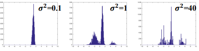
> 
> - $\sigma$의 값이 너무 작으면 특정 모드에 Collapse 됨 (특정 Density만은 반환함)
> 
> - Model Collapse은 Gan 에서 자주 발생함. Gan에선 이를 벗어나기 위해서 MCT(?)를 적용함. 

---

#### Gibbs Sampling

- 앞서 M-H Algorithm에서는 $\alpha$ 를 도입하여 샘플을 Accept/reject 하였다. 

- 하지만 **Efficient Sampler를 추구하고자, $\alpha$를 없앨 순 없을까? [문제]**
  
  - 우리가 마음대로 다룰 수 있는 q-distiribution 잘 조정해보자. 
  
  - 또한 우리가 진정으로 구하고자 하는 건 <u>unobserved data의 분포인 p</u>이다. 
  
  → Gibbs Sampling을 통해서 $\alpha$ 를 없애면서도 p 자체에 대해 Directly 구해보자

- $z^t$ 다음과 같이 정의해보자 
  
  > $z^t = (z^t_k, z^t_{-k}) → z^* = (z^*_k, z^t_{-k})$
  > 
  > > $z_{-k} : z_k$ 외에 다른 모든 것. k dim, 그리고 아닌 것들 둘로만 고려하자!
  > 
  > - $z^t$ 모두를 표현하기는 어려우니까, 하나의 Latent variable만 표현하자!
  > 
  > → <mark>$q(z^*|z^t) = P(z^*_k, z^t_{-k}|z^t_k, z_{-k}^t) = P(z^*_k, z^t_{-k}|z^t_k) = P(z^*_k|z_{-k}^*)$</mark>

- 위의 $z^t$ 정의를 기반으로 MH 알고리즘의 목표인 Balance 조건을 성립하는지 확인!
  
  > Balance : $P(z^t)q(z^*|z^t) = P(z^*)q(z^t|z^*)$ 성립
  > 
  > 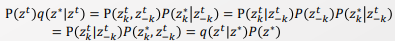 
  > 
  > <mark>→ $\alpha$ 도입 없이도 항상 Balance 조건을 성립한다!</mark> 

- **즉, 전체를 업데이트하는 것이 아니라 한 dim만 업데이트를 한다면 언제든 가능하다.**
  
  - 이를 Markov Blanket과 활용하여, 업데이트 하고자 대상과 관련된 것만 Sampling함으로써 값을 업데이트 할 수 있다. 
    
    > ex)- P(E,JC,M|A=F, MC=T) =? 
    > 
    > 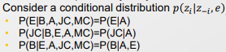
    
    > 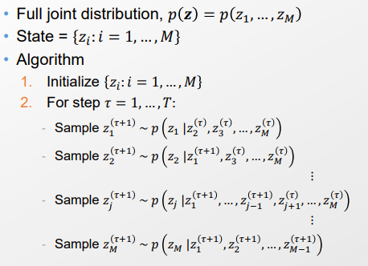
    > 
    > → 관련있는 것에 대해서 Sampling 해서 업데이트 한다. 그 결과는 Posterior distribution과 동일해진다. 

- GMM에도 적용가능하다. 
  
  - GMM의 Latent variable은 z 하나임.
  
  - 예전에는 z의 값은 deterministic 하게 정했다(most assignment value).
  
  - 하지만 Stocastic하게 했을 때 다른 값을 가질 경우가 생김. 그 결과 학습 속도는 느려질 순 있지만, 여러 가능성을 고려하여 잠재성이 더 있다.   

----

##### Gibbs sampling 예시 - Latent Dirichlet Allocation

- Topic Modeling : 사람들이 어떤 토픽으로 이야기하는지 알아내보자. 
  
  - 각 단어들이 어떤 Topic으로 부터 유래한 것인가를 찾기 
  - Likelihood를 통해서 어떤 단어가 많이 쓰이고 있는지 확인가능 

- Dirichlet 은 Multinomial distribution의 확률을 모델링하는 분포이다. [Conjugate 관계]
  
  > 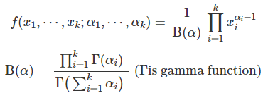[Dirichlet 분포]
  > 
  > - Dirichlet 분포에서 k개의 Conti random variables를 샘플링할 수 있다. 
  > 
  > - Dirichlet 특성(probabilistic k-simplex)에 따라, 이 Continuous random variable은 0보다 크거나 같으며, 합은 1이 된다. (확률의 정의를 따름)
  > 
  > - 따라서 이 k차원 벡터는 합이 1을 만족하기 떄문에, multinomial 분포의 모수인 $p_k(\sum p_k =1)$ 에 사용될 수도 있다. 
  >   
  >   - 즉, <u>Dirichlet분포에서 샘플링하면 Multinomial 분포가 나온다.</u>

- Generative Process에서는 각각 다음과 같은 분포를 따른다. 
  
  > 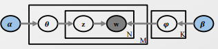
  > 
  > 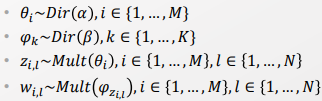
  > 
  > > w : 단어 
  > > 
  > > z : 단어의 Latent variable 
  > > 
  > > $\psi$ : 주제 내에서의 단어 분포 
  > > 
  > > $\theta$ : 문서 내에서의 주제 분포 
  > > 
  > > M : Document 별 Plate 
  > > 
  > > N : Document 별 Word Plate
  
  > > 단어 $w_{i,j}$ 는 word-topic 분포인 $\psi_z$ 로부터 생성된다. 
  > > 
  > > Topic z는 문서-주제 분포인 $\theta$ 분포로부터 생성된다. 
  > > 
  > > 문서-주제 분포인 $\theta$ 는 $\alpha$ 분포로부터 생성된다. 
  > > 
  > > 단어-주제 분포인 $\psi$는 $\beta$ 분포로부터 생성된다. 
  > 
  > - 만약 z 분포를 알고 있다면, 우린 most likely $\theta, \psi$ 값을 찾을 수 있다. 

- Generative 모델에 Gibbs Sampling을 적용하자
  
  > 항상 시작은 Full-joint distribution을 Factorize하는 것에서 시작 
  > 
  > $P(W,Z,\theta, \psi, \alpha, \beta) = $ 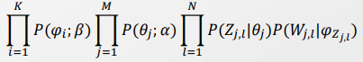 
  > 
  > - 이때 V-structure 구조로, z 와 $\psi$ 는 Dependece 하다.
  
  - 이제 $\theta, \psi$를 Collapse(Marginalize) 시켜서 W,Z, $\alpha, \beta$ 만 남기겠다. <mark>[Collapsed Gibbs Sampling]</mark>
    
    - 왜냐면 z만 제대로 알고 있다고 하면, 
    
    - $\beta$, z를 이용하여  $\psi$ 를 구할 수 있고, $\alpha, z$를 활용하여 $\theta $ 를 구할 수 있다. 
    
    - → 따라서, 우리가 직접 계산할 수 있는 W,Z, $\alpha, \beta$ 만을 남겨 Z를 구한다. 
      
      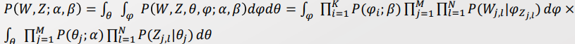

- $P(W,Z;\alpha, \beta)$를 계산하자! 
  
  > 두 부분으로 나눠 계산한다.
  > 
  > 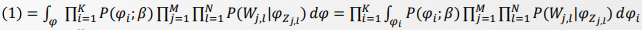
  > 
  > - 이때 좌우 식에서 $\int$ 와 $\prod$ 의 위치를 바꿀 수 있었던 것은 Finite 개수만 다루기 때문임. 
  > 
  > - Inifinite 경우에선 Limit가 각각 들어가는데, 하나의 Limit의 조건이 다른 limit 조건을 성립시키지 않을 수 있어 성립하지 않는다.
  > 
  > - 여기선 분배법칙을 통해서 공통된 곱의 부분은 앞으로 빼내는 것임. 
  > 
  > > Dirichlet 분포 대입 
  > > 
  > > $P(\psi_i; \beta) = \frac{\gamma(\sum^V_{v=1} \beta_v)}{\prod^V_{v=1}\gamma(\beta_v)}$
  > 
  > > $\prod^M_{j=1}\prod^N_{l=1} p(W_{j,l}| \psi_{z_j,l})$ = $\prod^V_{v=1}\psi_{i,v}^{n^i_{(.), v}}$
  > > 
  > > $n^i_{j, r}$ : i번째 주제의 j번째 문서의 r번째 unique 단어의 개수  
  > 
  > > $\prod^V_{v=1} \psi_{i,v}^{\beta_v -1}$ $\prod^V_{v=1}\psi_{i,v}^{n^i_{(.), v}}$ = $\prod^V_{v=1}\psi_{i,v}^{n^i_{(.), v +\beta_v -1}}$
  > 
  > (1) = 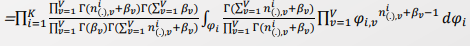
  > 
  >       = 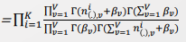
  
  > (2) 부분도 1번과 유사한 과정을 통해 계산한다. 
  > 
  > 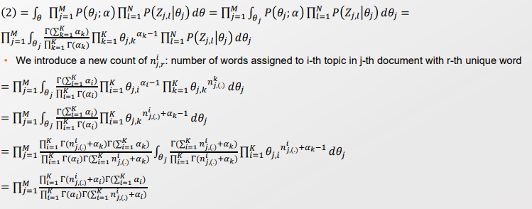
  
  > (1), (2)을 곱하여 목표했던 바를 구한다. 
  > 
  > 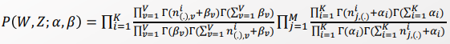
  
  > 이제 Z를 구할 수 있는 Joint Distribution을 구했다. 그러니 이젠 z 1개 원소에 대한 확률로 바꿔낸다. 
  > 
  > 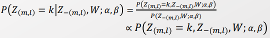
  > 
  > - Normalize 부분은 $\alpha$ 상수로 둬 계산에서 제거해줄 수 있다.(Variable Elimination) 
  > 
  > > 여기서 분모 부분이 상수가 맞나? 다 관찰된 값이라 상수로 둬도 되는 건가?

- 지금까지 구한 $P(W,Z; \alpha, \beta)$ 와 $P(Z_{(m,l)} = k, Z_{-(m,l)}, W; \alpha, \beta) $ 를 Gibbs Sampling에 맞게 조정해준다. 
  
  > 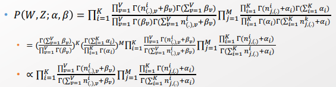
  > 
  > > $\prod$ 에 걸리지 않는 것들은 다 앞으로 빼주기. 
  > > 
  > > 그리고 변하지 않는 값들은 상수 처리하기 
  
  > P(W,Z';$\alpha, \beta$)를 활용하여 k dim에 관련된 것들만 남기기
  > 
  > 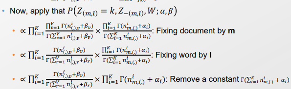
  > 
  > > k -dim에 맞게 Document를 m으로, Word를 I로 고정하기 
  > > 
  > > 분모에 Normalization 역할하는 것은 상수 취급하기 
  > 
  > → 이걸 계산하여 Normalization을 하면 Gibbs의 Prop distribution을 구하게 된다.
  > 
  > 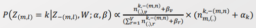
  > 
  > - 계산 과정은 각각의 상황에서 Counting 하는 형태로 구할 수 있음. 
  > 
  > → 이후에는 Gibbs Sampling을 여럿 적용하여 Statinary distribution을 구할 것이다.

- 위의 과정으로 우리는 2가지 특성을 확인할 수 있다. 
  
  1. 새로운 데이터를 받아들이며 Bayesian Frame을 활용하여 Posterior distribution을  업데이트하는 Mechanism이다.
  
  2. 이전 데이터를 활용한다는 점에서 MCMC임을 확인할 수 있다. 
     
        

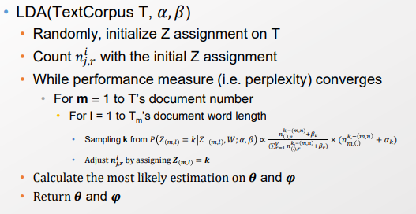

**Sampling 방식의 의의** 

1. Smapling 방식은 Black box를 다룰 수 있다. 
- V.I는 Likelihood를 필요로 한다.
2. Diffusion problem에선 Sample efficiency가 낮다. 
- 즉, Efficient sampler design을 위해서 Sampling method를 이용할 수 있다.
