#### 5주차 - Variational Inference

##### Approximation Gap - 2개

1. Jensus's enquality 

2. Mean-field auumption 
   
   => Variational inference를 쓰는 많은 논문에서 Theoritically 보이려면, 언제 위의 2개의 조건이 Tight 해질 수 있는가를 다뤄야만 한다. 

##### Variational Inference 라고 이름붙인 이유는 무엇인가?

- Variational Calculus 분야에서 Variational(르장도르) Transform에서 유래한다. 
  
  - Nonlinear 함수가 있을 때 이를 Linear 함수와 같이 간편한 형태로 바꿀 수 있을까? 
  
  - 가능하다! <u>"특정 x의 위치에 한해"</u> 접선은 <u>Concave/convex 함수</u>와 동일하다.
    
    > f = lnx
    > 
    > y = $min_x(\lambda x + b - lnx)$
    > 
    > > $\frac{d}{dx} (\lambda x + b -lnx) =0$
    > > 
    > > $\lambda = \frac{1}{x}$
  
  - 비선형 함수를 이에 근사하는선형 함수로 간편하게 만들 수 있다. 단, 이때 $\lambda$ 라는 새로운 parameter을 추가하게 된다. 
  
  <mark>→ 즉, 파라미터를 1개 내어주는 대신 모델의 Complexity를 낮출 수 있다.</mark> 
  
  > 이때 추가하는 Parameter(- $\lambda$)를 Variational parameter이라고 한다. 

- 만약 Nonlinear 함수가 Concave/Convex가 아니라도 조치해줄 수 있다. 
  
  - 함수에 Log를 씌움으로써 항상 Concave/Convex하게 만들어 줄 수 있다.
  
  - 물론 이때 접선의 방정식에도 log를 씌워줘야 한다. 

----

##### Convex Duality

- Variational parameter($\lambda$) 와 input x 을 Dual 관계로서 변환해줄 수 있다. 

- 함수 $f$ 가 Concave/Convex 하면 접선으로, 그렇지 않다면 log(f)를 log(접선)으로 표현가능하다.
  
  > $f(x) = min_\lambda(\lambda^Tx - f^*(\lambda))$
  > 
  > ↔ $f^*(\lambda) = min_x(\lambda^Tx - f(x))$
  > 
  > > $f$ : Model 
  > > 
  > > x : Data
  > 
  > <mark>=> $\lambda$ or x 가 fix 되어 있다면, Optimize를 통해 반대의 것을 구할 수 있다. </mark>

---- 

##### Applying to Probability Function

- 확률 함수에도 Vartional parameter를 도입해보자 
  
  - 이때, 간단한 형태는 꼭 선형일 필요는 없다. 
  
  > $P(S) = \prod_iP(S_i|S_{\pi(i)}) = min_\lambda \prod_i P^U(S_i|S_{\pi(i)}, \lambda^U_i)$
  > 
  > $P(S) = \prod_iP(S_i|S_{\pi(i)}) <= \prod_i P^U(S_i|S_{\pi(i)}, \lambda^U_i)$
  > 
  > 이처럼 형태를 바꾸는 것을 **Variational Transform**이라 한다.
  
  > $P(E) = \sum_H P(H,E) = \sum_HP(S)$ 
  > 
  >             $= \sum_H \prod_iP(S_i|S_{\pi(i)}) <= \sum_H \prod_i P^U(S_i|S_{\pi(i)}, \lambda_i^U)$
  > 
  > > E(vidence) : Observed, fixed, and hard fact 
  > > 
  > > H(ypothesis) : Estimated, inferred, and floating 
  
  > $ln P(E) = ln \sum_H P(H,E) = ln \sum_H Q(H|E) \frac{P(H,E)}{Q(H|E)}$
  > 
  > <mark>By Jensens's Inequality, [1차 variational Gap]</mark>
  > 
  >                 $>= \sum_H Q(H|E) ln [\frac{P(H,E)}{Q(H|E)}]$
  > 
  >                    *$P(H,E) = P(E|H) P(H)$
  > 
  >                     $= \sum_HQ(H|E) lnP(E|H) - Q(H|E) \frac{lnQ(H|E)}{lnP(H)}$
  > 
  >                     $= E_{Q(H|E)}lnP(E|H) - KL(Q(H|E)||P(H))$
  > 
  > > $KL(Q||P) = -\sum_iQ(i) ln [\frac{P(i)}{Q(i)}]$ $= \sum_{Q(H|E)} \frac{lnQ(H|E)}{lnP(H)}$
  > > 
  > > Q : Variational distribution 
  > 
  > <mark>Q에 대해 어떤 가정을 하느냐에 따라 2차 Vatriational Gap이 발생한다. </mark>
  > 
  > > ex)- Mean-field assumption : Latent var이 모두 ind 
  
  - <u>모델을 간편하게 표현하는 만큼 실제 값과의 차이가 생길 수 있다. </u>
  
  - **→ 따라서 둘의 차이를 최소화하는 것을 목표로 한다.** 

- 이때 $KL(Q||P)$ 을 최소화하여 Lower bound를 최대화하는 데 목적을 두겠다. 
  
  > $L(\lambda, \theta) = \sum_H Q(H|E, \lambda) lnP(H,E|\theta) - Q(H|E, \lambda) lnQ(H|E, \lambda)$
  > 
  > > $P(H,E|\theta) = P(H|\theta) 인가?$ 어차피 E는 observed data라 큰 상관은 없는 듯 함. 
  > 
  > > Q. $\lambda$와 $\theta$ 사이에는 어떤 차이가 있나? 
  > > 
  > > $\lambda$ 는 실제 값와 근사의 차이를 줄이는 Hypothesis의 파라미터
  > > 
  > > $\theta$ 는 실제값의 Parameter을 의미하나? 즉, P의 patameter 인듯 

- 방법은 크게 **2가지**가 있다.
  
  1. **Q의 pdf 구조를 잘 구성하여 P의 inference를 잘 구할 것**
  
  2. **Variational parameter $\lambda$를 잘 선정하는 것** 

- Example 1 - Suppose $Q(H|E, \lambda) = P(H|E, \theta)$
  
  > lnP(E|$\theta$) >= $\sum_H Q(H|E, \theta) ln \frac{P(H,E|\lambda)}{Q(H|E, \lambda)}$ 
  > 
  >  = $\sum_H P(H|E, \theta) ln \frac{P(H,E|\theta)}{P(H|E, \theta)}$  <mark>*[$Q(H|E, \lambda) = P(H|E, \theta)$]</mark>
  > 
  > 
  
  - 1). 이 경우 Q 분포의 inference는 P와 동일하다.
    
    - 단,아직 단순화하지 않았아서 Variational distribution의 목적 "단순화" 가 아직 달성되지 못했다. 
  
  - 2). $\lambda$ 는 아래 과정을 통해 최적화한다.
    
    - q(Z)를 Hidden(Latent) Variable Z에 대한 distribution 이라 하자.
    
    > 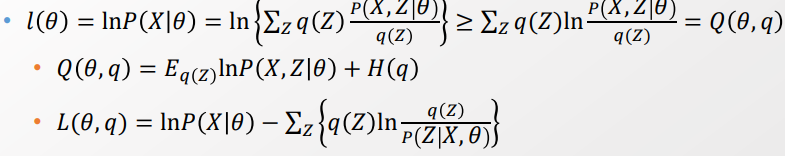
    > 
    > Entropy P : $H(q) = - \sum_z q(Z) lnq(Z) = -E_{q(Z)} lnq(Z)$ 
    > 
    > $L(\theta, q)$ : log p inference - KL term(q(z), P(Z|X, $\theta$)
    
    - 우린 q(Z)에 대한 정보 없이는 $Q(\theta, q)$를 최적화할 수 없다. 
    
    - 이때, <u>$L(\theta, q)$ 의 각 항목을 통해서 어떻게 q(z)를 정의해야할지 알 수 있다.</u> 
      
      - 첫번째 항($lnP(X|\theta)$)은 $\theta$ 가 t 시간에서 고정될 때 정해진다. 즉, 우리가 건드릴 수 있는 부분이 없다. 
      
      - 두번째 항($\sum_Z[q(Z)ln \frac{q(Z)}{p(Z|X,\theta)}]$) 이 최소화되어야 $L(\theta, q)$가 최대가 된다. 
      
      > $KL(q(Z)||P(X,Z|\theta^t)=0 →$ <mark>$q^t(z) = P(Z|X, \theta^t)$</mark>
      > 
      > t 타임에서 $P(Z|X, \theta^t)$ 와 동일하도록 q(Z)를 설정한다. 
      
      → $H(\theta, q^T) = E_{q^t(z)}lnP(X, Z|\theta^t) + H(q^t)$
    
    - 이후 $\theta$는 Lower bound을 최대화하도록 최적화시킨다.
      
      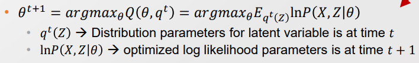

##### Factorizing Q

- 지금까지 Q에 대해서 어떠한 가정도 하지 않았다. 

- **모델의 Complexity를 낮추기 위해 Hidden value 간의 Independence를 가정**한다.
  
  > $Q(H) = \prod_{i <= |H|} q_i(H_i|\lambda_i)$
  > 
  > mean field theory에서 왔기 때문에, Mean field assumption이라 부름 
  > 
  > 이 가정은 강력하여 맞지 않는 경우가 많을 수 있음. 
  
  - 다른 가정을 기반으로 해도 됨(ex- HMM 에서 Emission 간의 연결성만 끊음)

> $L(\lambda, \theta)$ 에 Meanfield Assumption을 가정하자 
> 
> 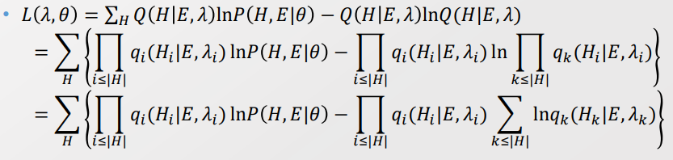
> 
> 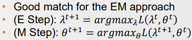
> 
> - $\theta$는 M-step에서 일어나며, h가 다 known 상태이기 때문에 발전 가능성이 없다. 
> 
> - 따라서 <u>$\lambda$ 를 Optimization 함으로써 모델을 발전시킬 것</u>이다.

> $\lambda_j$ 에 대한 값으로 뽑아내자! 
> 
> 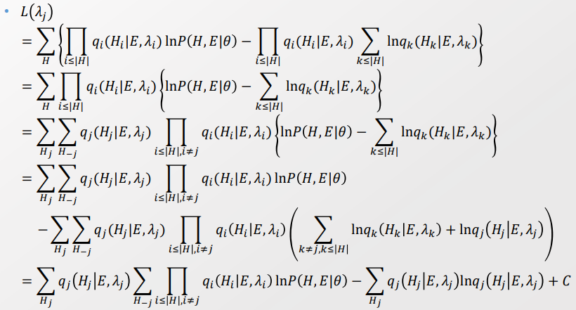
> 
> - Gibbs sampling을 위한 조건 마련을 위해, "i <= |H|" 을 1) $H_{-j}$ 와 2) $H_j$ 로 나눠준다. 
>   
>   > $\sum_H \prod_{i<= |H|} q_i(H_i|E,\lambda_i)$ 
>   > 
>   > = $\sum_{H_j}$ <mark>$q_j(H_j|E,\lambda_j) [\sum_{H_{-j}}\prod_{i <= |H|, i \neq j} q_i(H_i|E,\lambda_i)]$</mark>
> 
> - 계산을 편하게 하기 위해 $ln \tilde P(H,E|\theta)$ 을 설정한다.  
>   
>   > 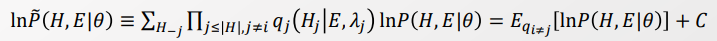
>   > 
>   > C : $\lambda_j$ 가 속해있지 않은 나머지 값 들. derivative를 계산할 때 사라진다. 
> 
> - 마지막 식에서 rate-like trick을 통해서 Differentiation 없이 Sampling으로 계산할 수 있다.
>   
>   > 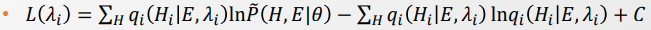
> 
> - i <= |H| 을 $H_j$, $H_{-j}$ 로 나눠서 고려했기에  <mark>Gibbs sampling </mark>이 가능하다.
>   
>   → Meanfield 가정 하에 Closed form을 형성한다.

##### Simple Example Model

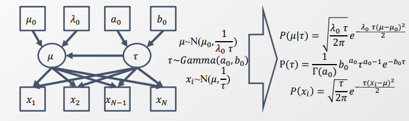

> $\mu, \tau$ 는 Random variable이자 Variational parameter임. 임의로  분포를 정의해줌  
> 
> - $\tau$ 는 Gamma 분포임. 아마 아래 조건 때문인듯 하다 
>   
>   > $\sum_{i=1}^n X_i \sim Gam(\sum_i^n k_i, \lambda)$
>   > 
>   > 즉, independent 한 각 hidden variable의 합은 gamma 분포를 따라서 

> Mean field Assumption 아래에서, 
> 
> 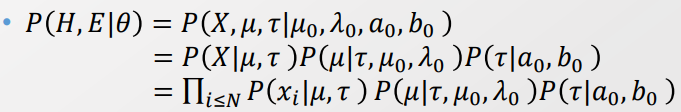
> 
> 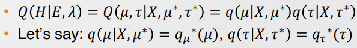

> $\mu$ ,$\tau$ 를 각각 Inference를 하기 위해선, Inference 대상 외의 것은 다 없애줘야한다.
> 
> $lnq_i^*(H_i|E, \lambda_i) = ln \tilde P(H,E|\theta) = E_{q_{i\neq j}} [lnP(H,E|\theta)] + C$
> 
> > E : X 
> > 
> > H : $\mu, \tau$
> > 
> > $\lambda$ : $\mu^*, \tau^*$
> > 
> > $\theta$ : $\mu_0, \lambda_0, a_0, b_0$
> > 
> > $lnq_i^*(H_i|E, \lambda_i) = lnq(\mu|X, \mu^*)= lnq_\mu^*(\mu)$
> > 
> > $lnP(H,E|\theta) = lnP(\mu, \tau, X|\mu_0, \lambda_0, a_0, b_0)$
> 
> 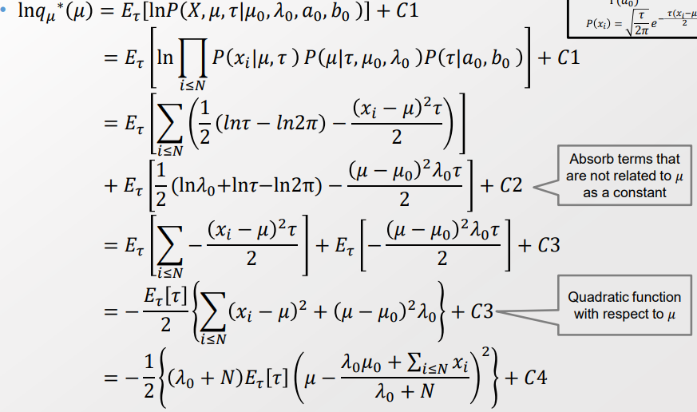
> 
> > 4번째 줄에서 C2는 $lnP(\tau|a_0, b_0)$ 을 의미한다. 
> 
> $\mu$ 을 추론하는 데 있어 Random variable인 $\tau$에 대해서 식이 정리된다.
> 
> - 관련 없는 값들은 전부 Constant로 여긴다. 
> 
> - $E_\tau[\tau]$ 는 $\tau$ 에 대한 관련 정보로, $lnq_\mu^*(\mu)$ 를 구하는데 연결되어 있진 않다. 
> 
> - 이때 **$q(\mu|\tau)$가 아닌, $q(\mu)$로 표현한다는 점이 중요**하다. 
>   
>   - Why? $\tau$ 와 연결되어 있지 않기 때문에, <mark>$E_\tau[\tau]$ 를 상수처럼 여길 수 있다.</mark> 
> 
> 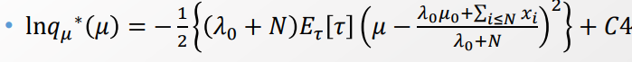
> 
> 이때, q가 normal distribution이라 가정한다면
> 
> > $ln(N(x)) = -\frac{1}{2}[\frac{(x-\mu)}{2\sigma^2}] +  log\sigma + \frac{log(2\pi)}{2}$
> 
> - "$\frac{\lambda_0\mu_0 + \sum_{i <= N}x_i}{\lambda_i + N}$"은 평균이, $\frac{1}{(\lambda_0 + N)*E_\tau[\tau]}$ 는 분산($\sigma^2$)이 된다. 
>   
>   > 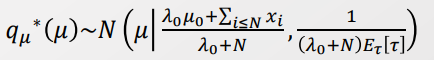
>   > 
>   > **→ 이 식은 데이터가 추가될 수록 정확도가 올라갈 것임을 의미한다.**

- 마지막으로 $lnq_\mu^*(\mu)$ 를 구하기 위해선 $E_\tau[\tau]$ 만 구하면 된다. 
  
  - $\mu_o, \lambda_0, \sum_{i<=N} x_i, N$ 은 이미 주어진다. 
  
  > 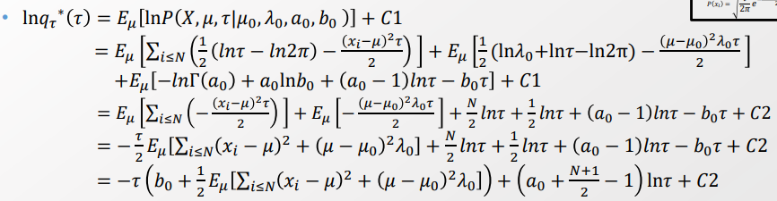
  > 
  > 위의 식은 Gamma distribution과 매우 유사하다. 따라서 Gamma 분포로 가정해본다. 
  > 
  > 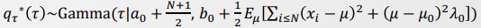
  > 
  > **→ 이 식은 데이터가 추가될 수록 정확도가 올라갈 것임을 의미한다.**  
  > 
  > > <mark>데이터를 추가함으로써 update를 하는 것을 Bayesian Update</mark>라고 한다.
  > 
  > **→ $\mu, \tau$를 번갈아 가며 계산한다. [E-M Step과 유사]**

- $\mu$와 $\tau$ 번갈아 update하기 
  
  > 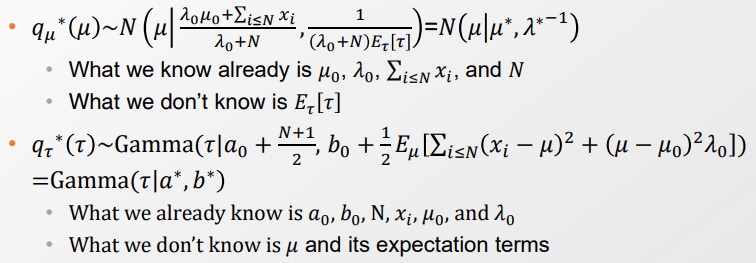
  > 
  > 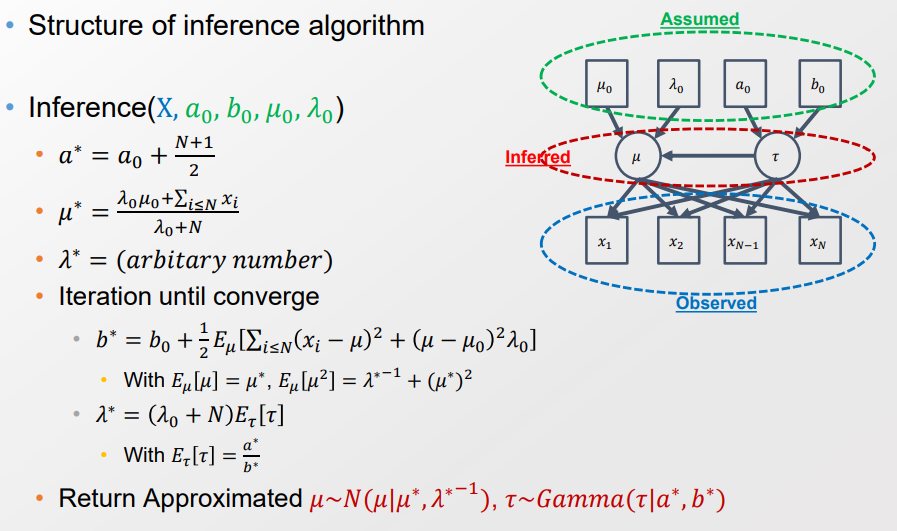
  > 
  > 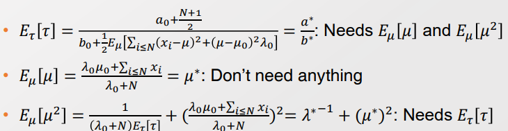

---- 

**각 방법별 목적** 

- Differentiation → Gradient descent 적용 

- Jensen's Enequality → lower bound 적용 

- Sampling → MCMC approximation 
  
  - Exact Model을 구할 수 있어 정확도가 높지만, Burn-in 비용이 든다.

-----

### Variational inference of latent dirichlet Allocation

###### Dirichlet Allocation 을 Bayesian network에서 해보자 [앞에선 Gibs sampling으로 함]

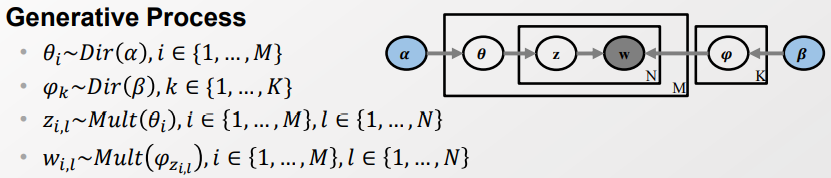

> 단어(w)는 단어-주제 분포인 $\psi_z$ 으로 부터 생성된다. 
> 
> 단어-주제 분포($\psi_z$) 는 분포 $\beta$ 로부터 생성된다. 
> 
> 주제(z)는 문서-주제 분포인 $\theta$ 로부터 생성된다. 
> 
> 문서-주제 분포($\theta$)는 $\alpha$ 분포로부터 생성된다.
> 
> → 우리가 Z 분포를 안다면 most likely $\theta, \psi$를 구할 수 있다. 
> 
> → 따라서 <u>Z의 most likely 할당을 아는 것이 $\theta, \psi$ 추론에 핵심</u>이다. 

- 앞서 전개했던 기본 식에서 Generative process에 맞게 변형하자 
  
  **MLE에 해당하는 값을 찾자!**
  
  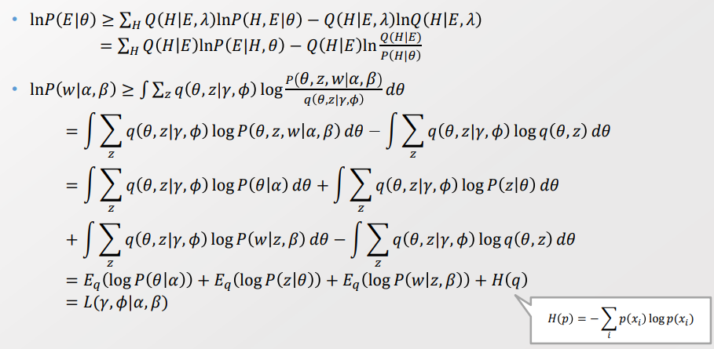
  
  > $lnP(w|\alpha, \beta) = \int P(w, \theta | \alpha, \beta) d\theta = \int \sum_z P(w, z, \theta|\alpha, \beta) d\theta $
  
  > E : w 
  > 
  > H : $\theta$, z
  > 
  > $\lambda : \gamma, \phi$
  > 
  > $\theta$ : $\alpha, \beta$. Given Data
  > 
  > $q(\theta, z) = q(\theta, z | \gamma, \phi)$. - 2번째 줄 
  > 
  > - <mark>Why? $\lambda$와 H가 독립이라는 건가? 성립안하지 않나?</mark>
  > 
  > - 오타인가..? $q(\theta, z) $ 가 아니라 $q(\theta, z|\gamma, \phi)$ 로 내려와야 함 
  > 
  > $p(\theta, z, w|\alpha, \beta) = p(\theta|\alpha) * p(z|\theta) * P(w|z, \beta)$
  
  - 위의 식은 $q(\theta, z | \gamma, \phi)$ 분포에 따른 기댓값(expectation)을 구하는 것과 같다. 
  
  - → 기댓값 형태로 나왔기 때문에 Free-form optimization이 가능하다! 
    
    이젠 ELBO를 maximize 해서 MLE를 구하자!
    
    > Q. Free-form optimization이 뭐지..? E-M Step을 말하는 것 같기도 하고 

###### Derivation of $E_q(logP(\theta|\alpha))$ 구하기

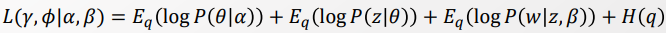

- 여기서 우린 $logP(\theta| \alpha), logP(z|\theta), logP(w|z,\beta)$ 의 기댓값을 각각 구해야 한다.
  
  - 물론 $H(q) $까지!

- $E_q(logP(\theta|\alpha))$ 구하기 
  
  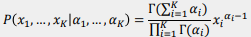
  
  > $x_i : \theta_{d,i}$
  
  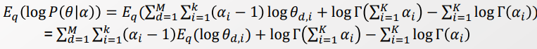
  
  > 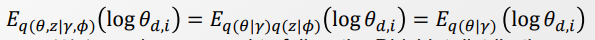
  > 
  > - mean-field assumption을 통해서 $q(\theta,z|\gamma, \phi) = q(\theta|r)q(z|\phi) $ 로 바꿈. 
  > 
  > - 또한 $q(z|\phi)$ 는 $log(\theta_{d,i})$ 와 관련성이 없어서 상수 취급해줄 수 있음.  
  
  - 이제 $E_q(logP(\theta|\alpha))$ 에 대해서 미분을 통해 최댓값을 찾을 것임 
    
    - By Exponential Thm, log normallizer의 미분 = moments of sufficient statistic
      
      > 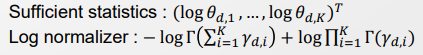
    
    - Sufficient statistics를 통해 미분을 계산하자! 
    
    
    
    > $\psi$ : Digamma function. log 감마 함수를 미분한 것. 
    > 
    > 이때 감마 함수 $\Gamma$ 는 미분 가능해야 함으로 Conti여야 함. 
    > 
    > > $\Gamma(z) = \int_0^\infin t^{z-1} e^{-t} dt$
  
  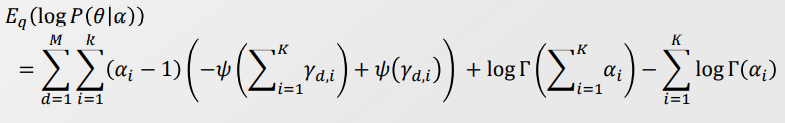
  
  > $E_q(log \theta_{d,i})$ 을 계산한 것을 처음 식에 대입

- $E_q(logP(\theta|\alpha))$ 구하기! 
  
  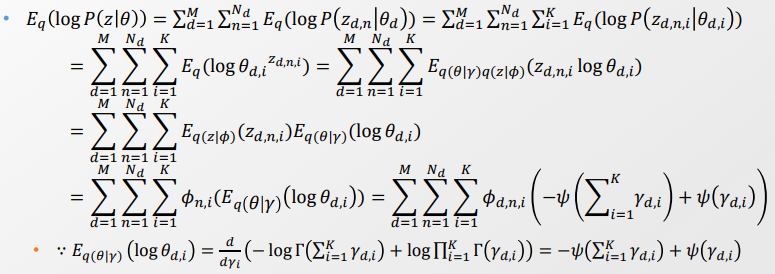

- $E_q(logP(w|z,\beta)$ 구하기! 
  
  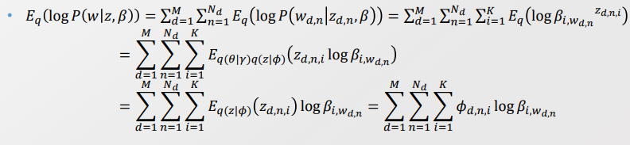

- $H(q)$ 구하기! 
  
  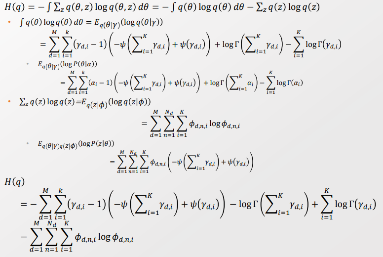

- 지금까지 구한 값들을 한꺼번에 정리하면 아래와 같다 
  
  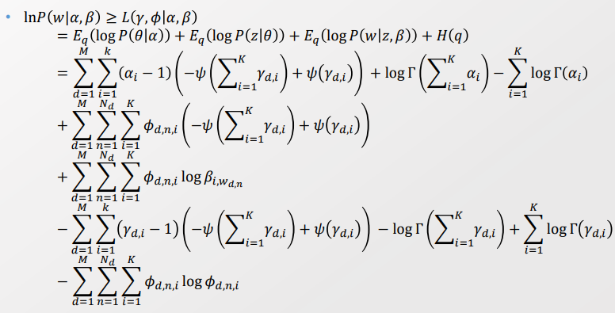

- 그리고 구한 값에 대해서 미분하여 ELBO를 최대화하는 값을 찾는다.
  
  총 $\phi, \gamma, \alpha, \beta$, 4개 변수에 대한 미분 값을 구해내야 한다. 
  
  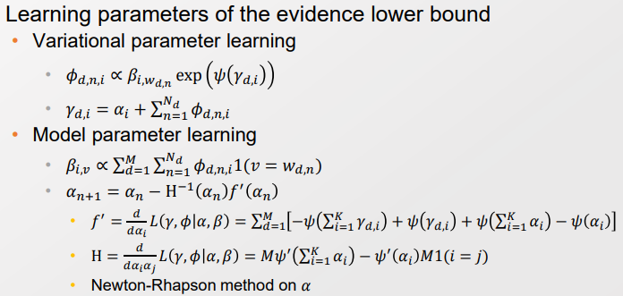
  
  > $\beta_{i,v}$ 의 $v=w_{d,n}$ 가 Information entry point임. 
  > 
  > 데이터가 들어감에 따라 $\phi, \gamma, \beta$ 를 업데이트 함. 
  
  - 위의 식처럼 깔끔하게 값이 나올 수 있었던 것은 Drichlet과 Multinomial이 Conjugate distribution이기 때문! 
  
  - 각각에 대한 미분 과정은 Youtube의 교수님 강의 참고하기! 
  
  - 4개의 변수 중 $\alpha$ 만큼은 미분의 값을 0으로 만들수가 없다. 따라서 Netwon-Rhapson method를 통해 해결한다. 
    
    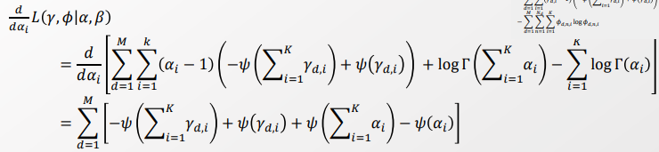
    
    > 이때 $\psi(\sum_{i=1}^k \alpha_i)$ 식에서 $\alpha$ 값을 밖으로 꺼낼 방법이 없음. 그 결과 절대 0이 될 수가 없음. 
    > 
    > $\frac{d}{d\alpha_i} =0$ 으로 만들기 위해 Newton-Rhapson method을 사용한다. 
  
  - 우리가 원했던 파라미터는 $\alpha, \beta$ 뿐! 단지 이 계산과정에 도움을 받기 위해서 $\gamma, \phi$ 를 사용한다.
    
    - 즉, $\gamma, \phi$는 끝까지 계산하지 않아도 된다. 

- 만약 우리가 계산을 정확히, tight 하게 하고 싶다면 "Held-out log likelihood"를 계산하면 된다. 

- $\beta$ 업데이트 해주기 
  
  - 각 파라미터를 update 할 때 $\beta_{i,v}$ 가 $\sum^M_{d=1} \sum^N_{n=1}$ 으로 인해 계산양을 엄청 많이 사용한다.
    
    - d에 대해서 Batch를 뽑아 Sampling으로 Stochastic infernce를 구해준다.
    
    - 이건 근사이나 Gradient estimate bias가 없기 때문에 더 좋다.
    
    - 반면 모든 경우를 고려할 때 local optima에 빠지면 헤어나오지 못해 성능이 낮다.
    
    → 성능도 좋아지고, 속도도 빠른 이 방식을 사용 안할리가 없다!
  
  - 단, Stochastic 하게 뽑는 것이기 때문에 분산이 증가할 수 있다. 
    
    - 따라서 $\rho$ 를 사용하여 분산을 줄여준다. 
      
      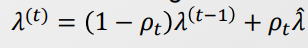

-----

## Gibs sampler vs Variational inferene

- Variation inference가 현재 많이 사용되고 있다. 

- 2002 ~ 2010 까지는 GIbs sampler가 많이 사용되었음 
  
  - Gap이 존재하지 않아 Exact 함 
  
  - Gibs가 VI 보다 모델을 향상시키기 쉬웠기 때문에 발전되는 속도가 빨랐다. 
  
  - 반면 V.I. 는 Derivation이 너무 길기도 하고 등등 어려웠다. 

- 하지만 Black-box Variational inference 를 통해 계산과정을 단순화했다. 
  
  - 어차피 Analytic하게 expectation으로 갈걸 안다면, 그냥 MCMC를 통해 Sampling 해버리자! 
  
  - 이제 Derivative 안 구해! Q를 임의로 정해버려! 그래서 계산가능하게 만들어! 
  
  - 결국 평균 치면 똑같아! 

- 단, 이럴 경우 Stocastic Var을 엄청 많이 들어가기 때문에 Variation이 엄청 크게 늘어남. 
  
  - 하지만 이 당시 Deep learning과 Amortized variational inference이 등장했고, 여기로 다 몰려가면서 이후 개발을 하는 사람이 없어짐ㅠ
  
  - 나중에 보니 Amortized variational inference가 Black-box 의 개념이 동일했음. 
  
  - 그 결과 Black box 연구는 Variational Autoencoder로 흡수되었다. 
