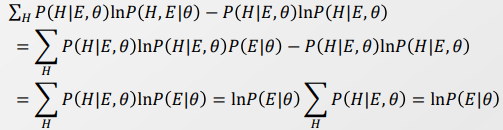

#### 5주차 - Variational Inference

##### Variational Inference 라고 이름붙인 이유는 무엇인가?

- Variational Calculus 분야에서 Variational(르장도르) Transform에서 유래한다. 
  
  - Nonlinear 함수가 있을 때 이를 Linear 함수와 같이 간편한 형태로 바꿀 수 있을까? 
  
  - 가능하다! <u>"특정 x의 위치에 한해"</u> 접선은 <u>Concave/convex 함수</u>와 동일하다.
    
    > f = lnx
    > 
    > y = $min_x(\lambda x + b - lnx)$
    > 
    > > $\frac{d}{dx} (\lambda x + b -lnx) =0$
    > > 
    > > $\lambda = \frac{1}{x}$
  
  - 비선형 함수를 이에 근사하는선형 함수로 간편하게 만들 수 있다. 단, 이때 $\lambda$ 라는 새로운 parameter을 추가하게 된다. 
  
  <mark>→ 즉, 파라미터를 1개 내어주는 대신 모델의 Complexity를 낮출 수 있다.</mark> 
  
  > 이때 추가하는 Parameter(- $\lambda$)를 Variational parameter이라고 한다. 

- 만약 Nonlinear 함수가 Concave/Convex가 아니라도 조치해줄 수 있다. 
  
  - 함수에 Log를 씌움으로써 항상 Concave/Convex하게 만들어 줄 수 있다.
  
  - 물론 이때 접선의 방정식에도 log를 씌워줘야 한다. 

----

##### Convex Duality

- Variational parameter($\lambda$) 와 input x 을 Dual 관계로서 변환해줄 수 있다. 

- 함수 $f$ 가 Concave/Convex 하면 접선으로, 그렇지 않다면 log(f)를 log(접선)으로 표현가능하다.
  
  > $f(x) = min_\lambda(\lambda^Tx - f^*(\lambda))$
  > 
  > ↔ $f^*(\lambda) = min_x(\lambda^Tx - f(x))$
  > 
  > > $f$ : Model 
  > > 
  > > x : Data
  > 
  > <mark>=> $\lambda$ or x 가 fix 되어 있다면, Optimize를 통해 반대의 것을 구할 수 있다. </mark>

---- 

##### Applying to Probability Function

- 확률 함수에도 Vartional parameter를 도입해보자 
  
  - 이때, 간단한 형태는 꼭 선형일 필요는 없다. 
  
  > $P(S) = \prod_iP(S_i|S_{\pi(i)}) = min_\lambda \prod_i P^U(S_i|S_{\pi(i)}, \lambda^U_i)$
  > 
  > > 이렇게 정의를 한 듯 
  > 
  > $P(S) = \prod_iP(S_i|S_{\pi(i)}) <= \prod_i P^U(S_i|S_{\pi(i)}, \lambda^U_i)$
  > 
  > 이처럼 형태를 바꾸는 것을 **Variational Transform**이라 한다.
  
  > $P(E) = \sum_H P(H,E) = \sum_HP(S)$ 
  > 
  >             $= \sum_H \prod_iP(S_i|S_{\pi(i)}) <= \sum_H \prod_i P^U(S_i|S_{\pi(i)}, \lambda_i^U)$
  > 
  > > E : Evidence. observed, fixed, and hard fact 
  > > 
  > > H : Estimated, inferred, and floating 
  > > 
  > > S : E, H의 합집합
  
  > $ln P(E) = ln \sum_H P(H,E) = ln \sum_H Q(H|E) \frac{P(H,E)}{Q(H|E)}$
  > 
  > By Jensens's Inequality, 
  > 
  >                 $>= \sum_H Q(H|E) ln [\frac{P(H,E)}{Q(H|E)}]$
  > 
  >                     $= \sum_HQ(H|E) lnP(E|H) - Q(H|E) \frac{lnQ(H|E)}{lnP(H)}$
  > 
  >                     $= E_{Q(H|E)}lnP(E|H) - KL(Q(H|E)||P(H))$
  > 
  > > $KL(Q||P) = -\sum_iQ(i) ln [\frac{P(i)}{Q(i)}]$ 
  > > 
  > > Q : Variational distribution 
  
  - <u>모델을 간편하게 표현하는 만큼 실제 값과의 차이가 생길 수 있다. </u>
  
  - **→ 따라서 둘의 차이를 최소화하는 것을 목표로 한다.** 

- 이때 $KL(Q||P)$ 을 최소화하여 Lower bound를 최대화하는 데 목적을 두겠다. 
  
  > $L(\lambda, \theta) = \sum_H Q(H|E, \lambda) lnP(H,E|\theta) - Q(H|E, \lambda) lnQ(H|E, \lambda)$

- 방법은 크게 **2가지**가 있다.
  
  1. **Q의 pdf 구조를 잘 구성하여 P를 inference를 잘 구할 것**
  
  2. **Variational parameter $\lambda$를 잘 선정하는 것** 

- Example 1 - Suppose $Q(H|E, \lambda) = P(H|E, \theta)$
  
  > 아래 부분 식이 맞는지 검토가 필요함 
  > 
  > Since 
  > 
  > $ln P(E) >= E_{Q(H|E)}lnP(E|H) - KL(Q(H|E)||P(H))$
  > 
  >                 $>= E_{Q(H|E, \lambda)}lnP(E|H, \lambda) - KL(Q(H|E, \lambda)||P(H))$ [임의]
  > 
  > lnP(E|Q) >=
  > 
  > 
  
  - 1). 이 경우 Q 분포의 inference는 P와 동일하다.
    
    - 단,아직 단순화하지 않았아서 Variational distribution의 목적 "단순화" 가 아직 안된 것
  
  - 2). $\lambda$ 는 아래 과정을 통해 최적화한다.
    
    - q(Z)를 Hidden(Latent) Variable Z에 대한 distribution 이라 하자.
    
    > 
    > 
    > Entropy P : $H(q) = - \sum_z q(Z) lnq(Z) = -E_{q(Z)} lnq(Z)$ 
    > 
    > $L(\theta, q)$ : log p inference - KL term(q(z), P(Z|X, $\theta$)
    
    - 우린 q(Z)에 대한 정보 없이는 $Q(\theta, q)$를 최적화할 수 없다. 
    
    - 이때, <u>$L(\theta, q)$ 의 각 항목을 통해서 어떻게 q(z)를 정의해야할지 알 수 있다.</u> 
      
      - 첫번째 항($lnP(X|\theta)$)은 $\theta$ 가 t 시간에서 고정될 때 정해진다 
      
      - 두번째 항($\sum_Z[q(Z)ln \frac{q(Z)}{p(Z|X,\theta)}]$) 이 최소화되어야 $L(\theta, q)$가 최대가 된다. 
      
      > $KL(q(Z)||P(X,Z|\theta^t))=0 →$ <mark>$q^t(z) = P(Z|X, \theta^t)$</mark>
      
      → $H(\theta, q^T) = E_{q^t(z)}lnP(X, Z|\theta^t) + H(q^t)$
    
    - 이후 $\theta$는 Lower bound을 최대화하도록 최적화시킨다.
      
      

##### Factorizing Q

- 지금까지 Q에 대해서 어떠한 가정도 하지 않았다. 
  
  > Q. 앞에서 $q^t(z) = P(Z|X, \theta^t)$ 로 정의한 건 뭐지?  structure을 정의한 건가?

- **모델의 Complexity를 낮추기 위해 Hidden value 간의 Independence를 가정**한다.
  
  > $Q(H) = \prod_{i <= |H|} q_i(H_i|\lambda_i)$
  > 
  > mean field theory에서 왔기 때문에, Mean field assumption이라 부름 
  > 
  > 이 가정은 강력하여 맞지 않는 경우가 많을 수 있음. 
  
  - 다른 가정을 기반으로 해도 됨(ex- HMM 에서 Emission 간의 연결성만 끊음)

> $L(\lambda, \theta)$ 에 Meanfield Assumption을 가정하자 
> 
> 
> 
> 
> 
> - $\theta$는 M-step에서 일어나며, h가 다 known 상태이기 때문에 발전 가능성이 없다. 
> 
> - 따라서 <u>$\lambda$ 를 Optimization 함으로써 모델을 발전시킬 것</u>이다.

> $\lambda_j$ 에 대한 값으로 뽑아내자! 
> 
> 
> 
> - 계산을 편하게 하기 위해 $ln \tilde P(H,E|\theta)$ 을 설정한다.  
>   
>   > 
> 
> - 마지막 식에서 rate-like trick을 통해서 Differentiation 없이 Sampling으로 계산할 수 있다.
>   
>   > 
> 
> - i <= |H| 을 $H_j$, $H_{-j}$ 로 나눠서 고려했기에  <mark>Gibbs sampling </mark>이 가능하다.
>   
>   → Meanfield 가정 하에 Closed form을 형성한다.

##### Simple Example Model

> $\mu, \tau$ 는 Random variable이자 Variational parameter임. 임의로  분포를 정의해줌  

> Mean field Assumption 아래에서, 
> 
> 
> 
> 

> $\mu$ ,$\tau$ 를 각각 Inference를 하기 위해선, Inference 대상 외의 것은 다 없애줘야한다.
> 
> 
> 
> $\mu$ 을 추론하는 데 있어 Random variable인 $\tau$에 대해서 식이 정리된다.
> 
> - 관련 없는 값들은 전부 Constant로 여긴다. 
> 
> - $E_\tau[\tau]$ 는 $\tau$ 에 대한 관련 정보로, $lnq_\mu^*(\mu)$ 를 구하는데 연결되어 있진 않다. 
> 
> - 이때 $q(\mu|\tau)$가 아닌, $q(\mu)$로 표현한다는 점이 중요하다. Why? 
> 
> 
> 
> 이때, q가 normal distribution이라 가정한다면
> 
> > $ln(N(x)) = -\frac{1}{2}[\frac{(x-\mu)}{2\sigma^2}] +  log\sigma + \frac{log(2\pi)}{2}$
> 
> - "$\frac{\lambda_0\mu_0 + \sum_{i <= N}x_i}{\lambda_i + N}$"은 평균이, $\frac{1}{(\lambda_0 + N)*E_\tau[\tau]}$ 는 분산이 된다. 
>   
>   > 
>   > 
>   > **→ 이 식은 데이터가 추가될 수록 정확도가 올라갈 것임을 의미한다.**

- 마지막으로 $lnq_\mu^*(\mu)$ 를 구하기 위해선 $E_\tau[\tau]$ 만 구하면 된다. 
  
  - $\mu_o, \lambda_0, \sum_{i<=N} x_i, N$ 은 이미 주어진다. 
  
  > 
  > 
  > 위의 식은 Gamma distribution과 매우 유사하다. 따라서 Gamma 분포로 가정해본다. 
  > 
  > 
  > 
  > **→ 이 식은 데이터가 추가될 수록 정확도가 올라갈 것임을 의미한다.**  
  > 
  > > 데이터를 추가함으로써 update를 하는 것을 Bayesian Update라고 한다.
  > 
  > **→ $\mu, \tau$를 번갈아 가며 계산한다. [E-M Step과 유사]**

- $\mu$와 $\tau$ 번갈아 update하기 
  
  > 
  > 
  > 
  > 
  > 

---- 

**각 방법별 목적** 

- Differentiation → Gradient descent 적용 

- Jensen's Enequality → lower bound 적용 

- Sampling → MCMC approximation 
  
  - Exact Model을 구할 수 있어 정확도가 높지만, Burn-in 비용이 든다.

-----
