### 6주차 - Deep Generative Models Variational Autoencoder

##### Taxonomy of deep Generative model

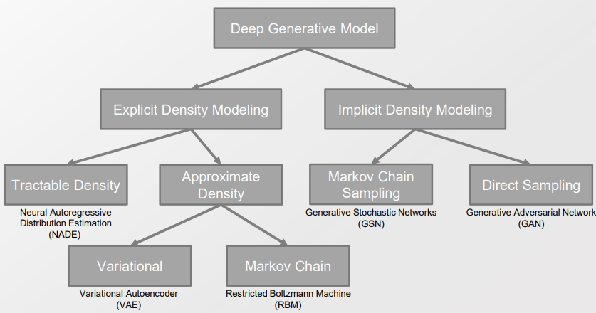

> 수년 전에 작성된 분류 모델. 이 중에서 살아남지 못한 것들이 꽤 있음 
> 
> - Ex)- Tractable Density, Markov Cahin Sampling(GSN), Markov Chain도 에너지 모델의 형태로 있으나 RBM은 잘 사용이 안됨 
> 
> 교수님의 생각으론 크게 2가지 기준 1) Explicit / Implicit, 2) Likelihood / free-Likelihood 이렇게 나눠 볼 수 있을 듯 

----

##### Autoencoders

- Hidden 층의 차원을 정하는 것 : 정보의 Loss 또는 Hidden layer의 크기 중 무엇을 중요시 할 것인가? **[Trade off 관계]**
  
  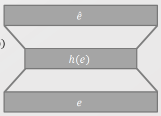
  
  - Hidden layer의 크기를 키우면 계산양이 많아지는 대신 정보의 loss가 줄어든다. 
  
  - 반대로 줄이면 계산양이 적어지는 대신 정보의 loss가 늘어난다. 

----

##### Amortized Analysis and Inference

- 기존의 variational inference에서는 데이터셋이 주어지지 않았을 때 만들어진 수식들이있다. 
  
  - 데이터 셋이 없어도 모델의 구조, genetic process만 명시되면 구할 수 있다.
    
    > 구체적으로 무엇이 구조고 Genetic process는 뭘 의미하지? 
    > 
    > 구조 : Analytically soved 된 것. 음.. E-M Algotirm과 Loss 함수를 의미하나? 
    > 
    > - $P(H|E)$ 이건 데이터 기반이라고 해야하지 않을까? 아닌가? 
    > 
    > Genetic(유전) Process : 세대를 거쳐가며 점차 발전하는 모델? 
  
  - Big O 등을 계산할 수 있다. 하지만 데이터셋을 활용하지 않은 것으로 의미가 크게 없다.
  
  -> <mark>즉, 데이터에 기반하지 않은 inference다.</mark>

- **CS 분야에서 계산양(big O)에 대해 유의미하려면 Amortized Analysis를 말해야 한다.**
  
  > Amortized Analysis : 데이터 셋이 존재했을 때의 Complexity를 분석하는 방법
  > 
  > ex)- 데이터 셋이 다음과 같은 분포일 때Binary search tree 를 만들면 Complexity가 어떻게 되는가? 해쉬 구조를 만들면 어떻게 되는가? 

 

- **Amortized inference는 데이터셋이 존재했을 때의 inference를 의미한다.** 
  
  - Amortized inference는 경험적으로 모델을 학습하는 방식의 추론을 의미한다.
    
    - 새로운 데이터가 들어왔을 때 파라미터를 전부 새롭게 바꿔야 하는지, 또는 새로운 경우만 고려하면 되는지로 나눠 볼 수 있다.  
    
    - 데이터 셋 없이 Analytically parameter inference를 한 VI는 Amortized inference가 아니다.
    
    - 반면 Black box inference는 경험적으로 데이터셋이 있는 상황에서만 가능하니 Amortized inference에 속한다. 
      
      - Black box는 Amortized inference로 계산 방법 중에서 MCMC로 국한하여 계산하려고 했던 것 
  
  - <u>MCMC보다 좋은 Inference 방법이 개발되었다. </u>
    
    - Variational inference의 결과물로써 $\phi_i$ 에 대한 update 수식을 얻을 수 있다. 
      
      > P(H|E, $\lambda$) 에 대한 variational distribution $q_E(H; \phi)$ 에 대해, 
      > 
      > Mean-field assumption을 통해서 $q_E^{MF}(H; \phi) = \prod_iq(H_i; \phi_i)$ 로 표현할 수 있다. 
      > 
      > 그리고 ELBO, KL-term의 최적화하는 과정에서 $\phi_i$에 대한 업데이트 수식을 계산했다. 
    
    - 이후 데이터 셋이 들어왔을 때, $\phi_i$ 업데이트 수식을 통해서 $\phi_i$ 가 생성된다.
    
    - <mark>$\phi_i$ 가 만들어지는 과정을 Neural network로 표현하자!</mark> Update 수식도 함수니까 Neural network로 표현할 수 있다. 

 

- **해결해야 하는 문제 : 어떻게 inference를 Neural Network로 훈련시킬 수 있는 구조를 만들 수 있을까?**
  
  > **어떻게 하면 Stochastic 변수를 Neural Network에서 학습시킬까?** 
  > 
  > ↔ 기존 NN 연구들은 Deterministic 한 환경에서 작동해왔음. 
  
  - Kingma "Auto-encoding variational Bayes" 논문에서 구조를 제시함. 
  
  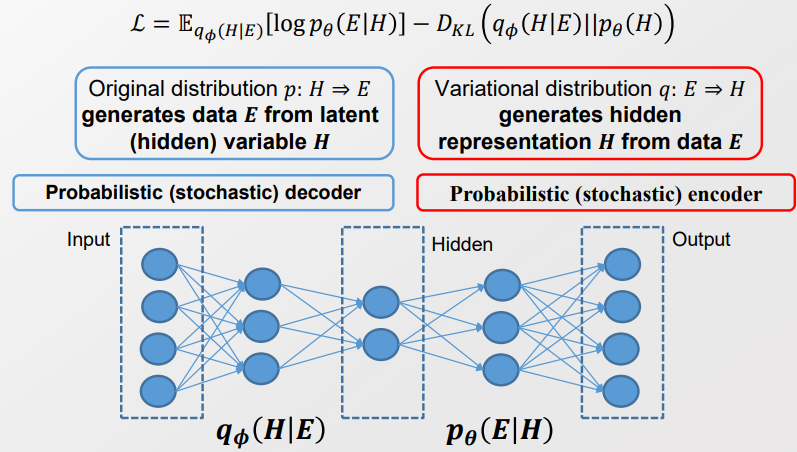
  
  > ELBO 구조에서 P와 Q 분포의 대칭성을 찾아낸 것 
  > 
  > $P_\theta(E|H)$ : Hidden 층을 input으로 받아 Evidence를 output으로 생성 
  > 
  > $Q_\phi(H|E)$ : Evidence를 input으로 받아 Hidden 층을 output으로 생성 
  > 
  > - Variational Inference이기도 하다. Variatoinal inference는 Latent space에 대한 Distribution이니까. 
  
  > $p_\theta(H)$ : Prior. 사실상 학습에 어떠한 영향을 미치지 않음. 
  
   
  
  - **핵심은 "reparametrization Trick(또는 Stochastic Gradient Variational Bayes)"이다.**     
    
    - $q_\phi(H|E)$ 를 미분가능하고 결정적인 변수로 reparameterize 하는 것이다. 
    
    > ELBO에서 미분을 한다는 것은 아래 식으로 풀어볼 수 있다. 
    > 
    > 
    > 
    > $E[X] = \lim_{n -> \infin} \frac{\sum_{i=1}^n X}{n}$
    > 
    > $f'(x) = \lim_{h-> 0} \frac{f(x+h)-f(x)}{h}$ 
    > 
    >  이 두개의 lim은 특정 조건을 만족하지 않는 이상 서로 위치를 바꿀 수 없다.   바꿀 수 없다면 우리는 ELBO 식에 Differentiation이 불가능해진다.  
    > 
    > - Hidden Variable의 개수가 Finite이다? 
    > 
    > - Gaussian distribution은 조건을 충족하여 ELBO를 계산할 수 있음
    
    > Neural Network의 Chain rule을 적용할 때, Stochastic한 h의 값을 1)update 해야하는 deterministic value와 2)update를 하지 않아도 되는 Stocastic Value(e)로 구분하자. 
    > 
    > 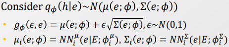
    > 
    > 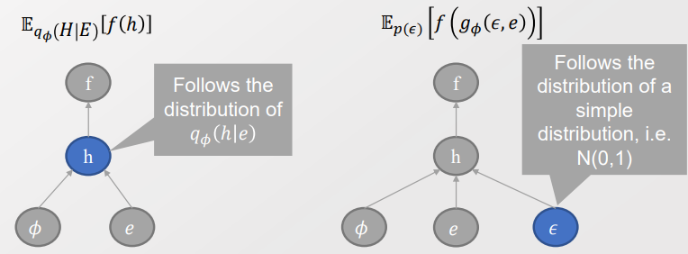
    > 
    > - $\epsilon$ 은 고정되어 있음. Chain rule에서 포함되어 있지 않음. 
    > 
    > - 학습해야하는 deterministic value $\phi, e$ 에는 Chain rule을 통해서 학습시킴. 
    > 
    > - Neural Network가 학습하기 위해선 E(dataset) 이 들어와야 하니 Amortized inference 임.  
    
    > H의 값을 Stochasitic 이라하면 H 자체에도 Variance가 생김. 그 결과 전체 모델에 어마어마한 Variance를 가져오게됨 
    > 
    > 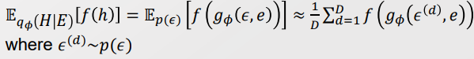
    > 
    > MC를 통해서 계산가능. Black box의 잔재. 

 

- 앞으로의 질문 - Gaussian distribution 이 아닐 때는 어떻게 다룰 것인가? 
  
  > ex)- gamma, beta
  > 
  > 문일철 교수님이 Drichlet 상황에서는 해놓음. 
  > 
  > Continuous 상황에서는 DNSP Assmuption을 적용하여 또다른 Reparametrization trick을 적용하여 진행할 수 있음. 

 

##### Derivation of Evedence Lower Bound for Gaussian VAE

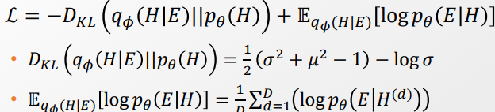

>  계산을 줄이기 위해서 analytic 하게 풀이함.
> 
> - 자세한 풀이 과정은 교수님의 유튜브 참고하기 
> 
> E는 Explicit 모델로 계산해주자! 
> 
> 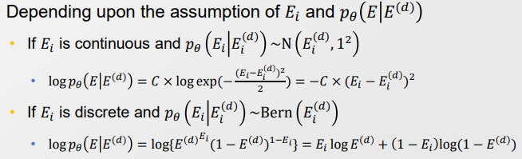

- Loss 수식 구했고, 미분 가능하고, reparameterization trick으로 모델도 안정화되었다. 

    →  계산하자!

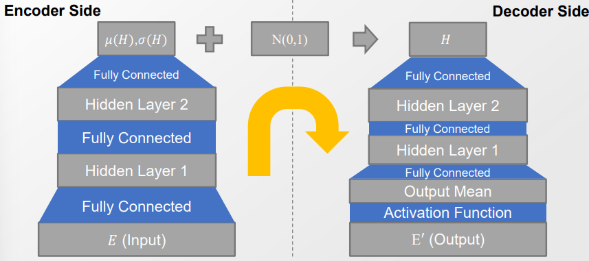

- VAE를 통해 Stochastic한 Value 들도 Deterministic value들과 동일하게 NN으로 학습할 수 있다.

---- 

#### Variants of Variational Autoencoder with conditional probability

- 기존의 Topic modeling 방식과 다르게 VAE는 Variation이 매우 낮아서 Flexible하고 안정적이였다. 즉, 기존의 방법들을 다 압도할 방법이 나온 것이다. 
  
  - 이제 더 이상 Parameter inference에 대해서 더 고민을 안해도 된다.

- 이후 지금까지 구상했던 구조들을 모두 VAE를 통해서 다시 표현하고자 했다.  
  
  > VAE는 Bayesian network로 표현하면 H -> E 인 구조다. 

 

###### Conditional Variational Autoencoder

- VAE에 Condition을 추가하자!(Hierarchical model을 만들자!)
  
  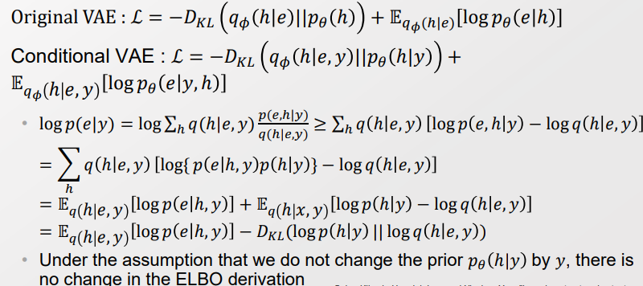
  
  - "e|y" 로 Condition을 표현하자!
  
  > y는 random variable로 표현하면 가장 일반화한 것. 지금은 Observed data로 대입함. 아직 연구가 더 필요한 부분  
  
  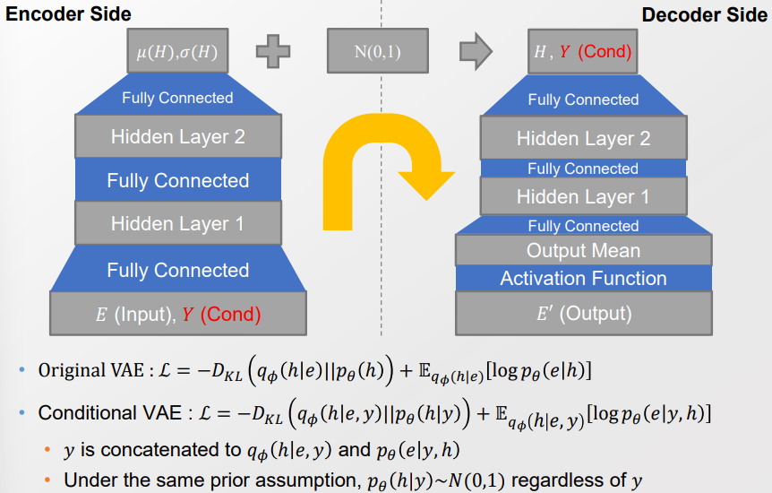
  
  - 정리하고 보니 기존의 VAE와 크게 다르지 않은 모델이 나옴. 
  
  - VAE 에서의 구조와 Variational Inference 구조는 동일함
    
    - Y가 관측되지 않는다고 하면 y가 왼쪽으로 넘어갈 뿐. (VI)
    
    - 둘다 Mean field assumption을 적용함
    
    - VAE와 VI를 구분하는 것은 하나, Dataset이 주어져서 Amortized variational inference가 일어난다는 것 뿐이다. 
    
    - 즉, Neural Network를 Parameter Inference 수식을 유도하기 쓴다는 점 외에는 모두 동일하다.

 

- **Conditional VAE가 계속 연구가 계속되는 이유** 
  
  - Mode Collapse를 해결하자! 
  
  - Mode Collapse는 Generative model, MCMC Sampling 간 Random walk 가 좋지 않을때도 일어남 
    
    - -> unobserved 데이터 분포를 inference를 하는 모든 상황에서 일어날 수 있음 

 

##### Variational Auto(?) Deep Embedding(VADE)

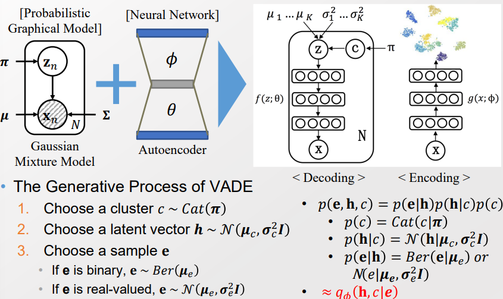

> e ↔ x 
> 
> h ↔ z

- q distribution을 구했으니, 이를 ELBO 형태로 표현하자. 

##### Key Idea on Probabilistic Modeling

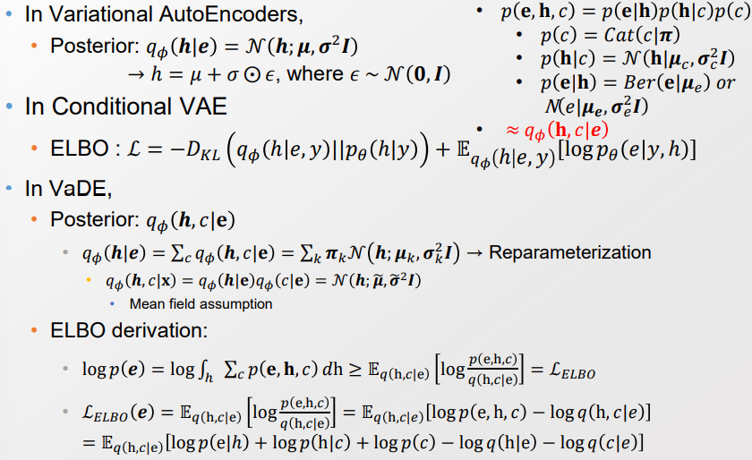

> by mean field assumption, $q_\phi(h,c|x) = q_\phi(h|e) q_\phi(c|e)$
> 
> c는 Discrete 한 값으로 따로 고려해줘야 함. 

----

#### Variants of Variational Autoencoder with Elaborated losses

- Support Vector Machine(SVM) 
  
  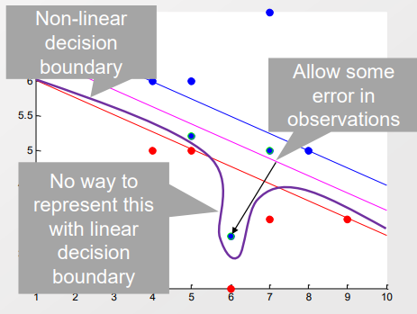
  
  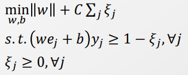
  
  - Kernel trick 까지 적용될 때 많은 의미를 가짐 
    
    > Kernel trick : Kernel trick은 Vector의 Basis를 확장하는 것을 모델링 하지 않고 Inner product를 계산하는 것. 원 정보를 담고 있는 Vector의 Basis를 Scalability 하게 등 다양하게 확장시킬 수 있는데, 이때 Kernel trick을 사용하면 계산양을 늘리지 않고도 원하는 목표를 이룰 수 있다는 것
  
  - SVM의 Loss는 Margin-based Loss로 Likelihood loss로 다르다. 
    
    > SVM의 Loss 함수를 "Hinge Loss" 라고 부름 
    
    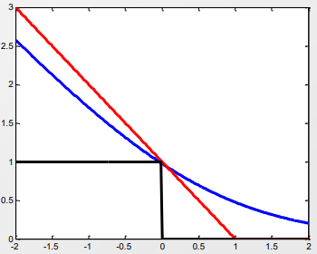
    
    > 빨강색 : Hinge loss. 차이가 나는 지점부터 Linearly loss 값이 커짐.  
    > 
    > 파란색 : log logg. 항상 penalty를 부여함. 
    > 
    > - NN에서 마지막 층에서 Logistic function을 적용하기 때문에 다 log loss가 된다. 
    > 
    > 검은색 : Z 로몬 loss? 차이가 커져도 항상 1의 Penalty를 부여함. 
    > 
    > 값이 1에서 차이가 나는 것은 SVM 모델에서 (we +b)y = 1 로 둬서 이지 않을까? 

- 다음 시간 질문 : SVM Margin-based 사람들에게 ELBO를 적용할 때에는 어떻게 사용할까? 

--------

#### $\beta$- Variational Autoencoder

- Auto encoder는 사전 확률에 의해서 규제가 부여된다. 
  
  > $lnP(E) >= E_{q_\phi(H|E)} [log p_\theta(E|H)] - D_{KL}(q_\phi(H|E)||p_\theta(H))$
  > 
  > - 여기서 $E_{q_\phi(H|E)} [log p_\theta(E|H)]$ 는 Reconstruction error을 의미한다 
  > 
  > - $D_{KL}(q_\phi(H|E)||p_\theta(H))$ 은 사전 확률에 의한 규제를 의미한다.
  
  > Q. 여기서 D의 의미는 무엇인가?

- SVM과 Lagrange를 하는 사람들의 입장에서 규제 방식을 수정해보자! 
  
  > $max_{\phi, \theta}E_{E\sim D}[E_{H \sim q_\phi(H|E)}[logp_\theta(E|H)]]$ : AE의 Reconstruction error
  > 
  > $D_{KL}(q_\phi(H|E)||p_\theta(H)) <\epsilon $ : SVM 식 규제항  
  > 
  > 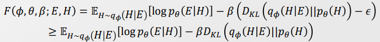
  > 
  > > F 함수는 목표로 하는 inference 값인듯 
  > > 
  > > $\beta$ 는 Lagrange multiplier 이다. construction 항에 weight를 부여한다.
  > > 
  > > $\beta\epsilon$의 값이 양수이기 때문에, 이를 빼준 아래 항이 lower bound라 해석할 수 있다. [새로운 관점]
  
  - 이때 $\beta$ 값은 규제항의 hyperparameter이다. 
    
    > $\beta =1 $ : Original VAE
    > 
    > $\beta >1$ : 사전 확률에 대한 보다 강한 규제를 적용 
  
  - 단, 사전 확률은 데이터를 고려하지 않고 무지성으로 가정한 것이라 멍청하다. 
  
  - Likelihood와 규제항으로 부여한 Prior이 Conflict한다.
    
    - 따라서 $\beta$ 값을 1보다 크게하면 그만큼 Likeli가 무시되어 성능이 악화될 수 있다. 
    
    - 한편으론 사전 확률의 가정대로 <u>Latent dimension 간 independence를 보장하여 Latent disentanglement을 부여할 수 있다</u>. 
    
    > Latent disentanglement : Latent Var 간의 dependence를 제거하는 것. 
    > 
    > 또는 $\sigma$ 의 행렬 $\sum$ 의 off diagonal을 0으로 만드는 것과 동치 

-----

##### Evidence Lower Bound with Neural Net.

Q. 앞의 $\beta$- Variational Autoencoder에서 꼭 likelihood와 prior을 conflicting 하는 형태로 풀어야 하는가?

- off diagonal이 0인(?) 상황에서 많이 보이는 거라면 weight를 자연스럽게 떨어뜨리면 되겠다.
  
  > ㅠㅠ.. 주어가 목적어가 빠져서 이해하기가 어려워 

- 단, VAE 에서 Expectation을 계산하는 과정에서 불-편한 식이 있었다. 
  
  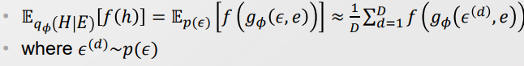
  
  > 모든 샘플에 대해서 동일한 가중치를 부여한다. 
  > 
  > 그런데 $\epsilon$ 의 분포에서 Outlier가 발생할 수 있다. 샘플이 많으면 점차 normal이 되겠지만, 최초의 Outlier은 잘못된 영향을 미친다. 이를 고려해줘야 한다.  

- 즉, 각 샘플에 대해서 가중치를 고려해줄 필요가 있다. 
  
  > 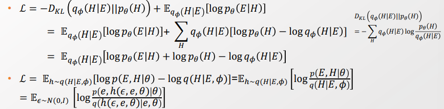
  > 
  > -> Lower bound를 수정 및 $\epsilon$ 항을 끼워 수식을 만든다. 
  
  > 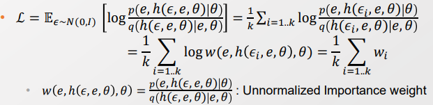
  > 
  > $\epsilon$ 항을 추가하여 만든 식을 가중치로서 고려해준다. 
  > 
  > 이때 Sampling의 목적은 $\epsilon$을 update해주는 것이다. 여기서부터 $\epsilon$을 normal distribution으로 가정한 VAE와 달라진다. 
  > 
  > 샘플링의 결과를 기반으로 $\epsilon$ 의 값에 반영한다. 
  
  > $\epsilon$ 을 위한 Sampling을 더 많이 할 수록 Tight 한 ELBO가 생성된다. by Jensus's
  > 
  > 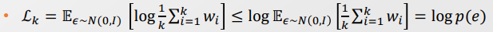
  > 
  > > Expectation은 nice한 상황에서 확률과 Value의 선형 결합과 같다. 
  > > 
  > > 따라서 Jensus's를 적용할 수 있다. 
  > 
  > <mark>-> VAE를 좀 더 Tight 하게 적용할 수 있다.</mark>

- Tightness의 조건을 알게 되었으니까, 이를 적용할 수 있는지 확인하자
  
  - Gradient Descent가 가능하면 바로 Neural Net에 적용할 수 있다. 
  
  - Stocastic variable이 Reparameterize를 하려면 Limit Exchange가 되어야 한다. 
    
    - Derivative의 Limit과 Expectation의 limit이 서로 위치를 바꿀 수 있어야 한다.
    
    - Var가 discrete 할 때 변경가능하다. [자세한 것은 르벡 적분 확인 필요]
    
    - -> 조건 성립 
  
  - 현재 $\epsilon$은 Gaussian을 가정하고 있기에 적용에 문제없다. 
  
  > 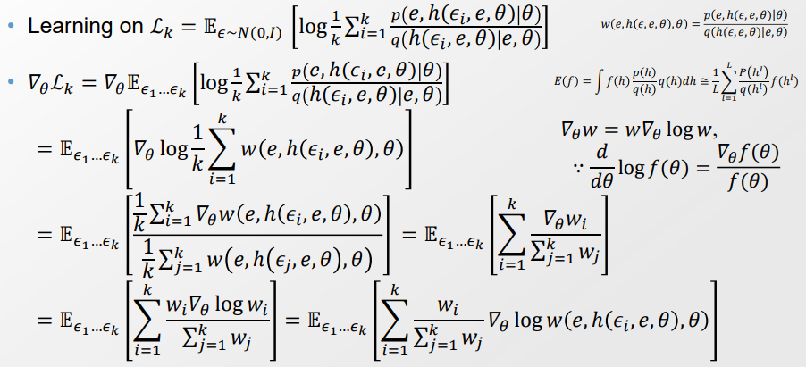
  > 
  > $w(e,h(\epsilon_i, e, \theta), \theta)$ 은 input의 모든 값을 알고 있으니 구할 수 있다. 
  > 
  > Score trick 적용하여 3번째 -> 4번째 줄 적용 
  > 
  > > $\bigtriangledown_\theta w$ = dw = w x $\frac{1}{w} dw$  = $w \bigtriangledown_\theta logw$
  > > 
  > > $\frac{d}{d\theta} log w = \frac{\bigtriangledown_\theta w}{w}$
  > 
  > 전체 Expectation에 대해 gradient는 개별 Gradient의 가중치를 부여한 것의 expectation과 같아진다. 

 

------

##### Derivation of Implicit Distribution from ELBO - Prior ELBO

- 앞서서 Prior을 고정시켜뒀었는데, 이제 손 좀 보자. 데이터 분포에 따라 다 다른데 항상 normal distribution을 따른다고 확신할 수 없다. 
  
  - Prior 또한 update의 대상으로 보자. 
  
  - Posterior update는 다시 Prior에 영향을 미치고, 반대의 경우도 적용된다. 
  
  - 즉, Prior 학습이 끝났다는 것은 Posterior도 학습이 끝났음을 의미한다. 

- $prior  :P(E) = \int P(E)*P(H|E)$ 을 성립한다. 
  
  > $p^*_\lambda(h) = \int p_D(e)q_\phi(h|e)de = q_\phi(h)$

 

- 기존 VAE와 Prior ELBO의 차이점 
  
  - 기존 VAE에서 $D_{KL} term$ 에서 Prior $p_\theta$가 Gaussian 분포로 Closed form으로 떨어진다.
  
  - 반면 Prior ELBO에선 더이상 Gaussian 분포를 가정하지 못해서 Closed form이 안될 수 있다. 

- Prior ELBO의 $D_{KL} term$을 계산할 방법이 필요하다. 
  
  > 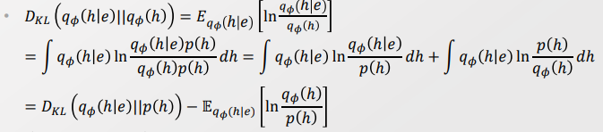
  > 
  > $D_{KL}(q_\phi(h|e||q_\phi(h)))$ 의 값을 계산할 수 있는 두 항으로 나눈다. 
  > 
  > > $D_{KL}(q_\phi(h|e)||p(h))$ 에서 p(h)는 임의의 함수로, Gaussian 분포를 가정함으로써 Closed form을 만들 수 있다. 
  > > 
  > > $E_{q_\phi(h|e)}[ln\frac{q_\phi(h)}{p(h)}]$ 는 Expected density ratio로 값을 구할 수 있다. 
  > > 
  > > - 단, $p(h)$ 가 0이 되는 경우가 생기면 안된다.
  > 
  > <mark>Sampling이 가능한 것과 Density ratio를 계산할 수 있다는 다른 말이다. </mark> 
  > 
  > > Q. 구체적으로 조건이 뭐가 다른거지? 교수님은 $p(h)$가 0이 될 조건이 제일 중요하다고 하셨는데. 
  > 
  > - <u>현재는 Sampling은 되나, Density ratio는 계산할 수 없는 상황이다. </u>
  > 
  > - 따라서 Density ratio를 계산할 추가적인 방안을 찾아야 한다.  

- Expected Density Ratio 값 계산하기 
  
  - 데이터가 어떤 모델에서 생성되었는가를 판별하는 Classifier을 통해 계산할 수 있다. 
  
  > Classifier : 데이터가 임의의 prior 또는 $q_\phi(h)$ 에서 나온 것인지 판별 
  > 
  > $E_p : p(h) $ 분포를 통해 생성된 샘플 데이터
  > 
  > $E_q$ : $q_\phi(h)$ 분포를 통해 생성된 샘플 데이터 
  > 
  > 샘플이 $E_p$에 속하면 1, $E_q$에 속하면 0의 값을 갖는 Random variable y 도입 
  > 
  > 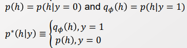
  
  > Bayesian 룰을 통해서 $r(h) = ln \frac{q_\phi(h)}{p(h)}$을 계산할 수 있다. 
  > 
  > 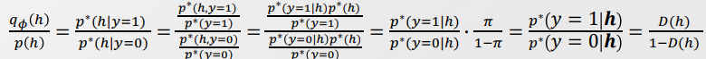
  > 
  > - $\pi = P(y=0)$ 이나, 우리는 원하는 데이터를 원하는 만큼 뽑을 수 있다. 따라서 여기선 $\pi = 0.5$ 가 되도록 설정해준다. 
  >   
  >   <mark>-> Density ratio estimation = Class probability estimation</mark>
  > 
  > - 이때 <mark>D(h) 를 Discriminator</mark>이라고 부른다. 
  
   
  
  - D(h) 모델링하기 
    
    - $D(h) = \sigma(T_\psi(h))$ 로 가정한다. 
      
      > D(h)를 Neural network classifier로 고려하는 것  
      > 
      > <mark>Q. 아래의 식이 어떻게 나온 것인가? </mark> 각 순간에 확률값을 최대화할 것
      > 
      > <mark>$T^*(h) = max_\psi E_{q_\phi(h)}[ln(\sigma(T_\psi(h)))] + E_{p(h)}[1-\sigma(T_\psi(h))]$</mark>
      > 
      > > x가 $q_\psi(h)$로 생성되었을 때 확률 값 $\sigma(T_\psi(h))$ 을 최대한 크게, 
      > > 
      > > $p(h)$ 로  생성되었을 때 확률값 1-$\sigma(T_\psi(h))$ 을 최대한 크게 설정  
      > 
      > $\psi$ : discriminator의 parameter
      
      > Since D(h) = $\sigma(T_\psi(h)),$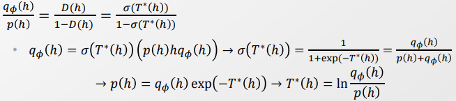
      > 
      > <mark>-> $T^*(h)$ 를 통해서 $ln\frac{q_\phi(h)}{p(h)}$ 을 계산할 수 있다. </mark>
  
   
  
  - 앞서 계산한 항목들을 모두 추가해준다. 
    
    > 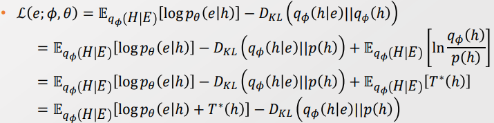
    > 
    > Expectation은 Monte Carlo estimation과 reparametrization trick을 통해 계산한다. 
    > 
    > Reconstruction eroor 항에 $T^*(h)$ 항만 추가해주면 된다. 기존의 구조에서 바뀌는 것이 없다. 
    > 
    > <mark>-> NN 모델에서 학습하는 과정에서 $T^*$을 통해서 Prior 또한 업데이트</mark> 시켜줄 수 있다.
    
    
    
    > Decoder의 $\theta$, Incoder의 $\phi$ , discriminator의 $\psi$ 모두 학습 가능 
    > 
    > $\theta, \phi$는 학습 모델의 Back propagation 간 같이 학습됨. 
    > 
    > $\psi$ 는 Discriminator 학습 간 업데이트 된다.  

- 이 방법은 Prior의 Optimality를 보장해준다. 

- 단, Practically Optimal prior에 도달할 수 없다. 
  
  - 1). Learning function이 다르다. 학습 모델의 learning function과 Discrinator의 learning functino이 Align 되어 있지 않은 상태에서 Optima setting으로 가기가 어렵다.
  
  - 2). H에 대한 차원을 모른다. 즉, optimal prior에 대한 보장을 할 수 없다. 
    
    > Q. Why? 언제 Optimal prior에 대해 보장, 또는 보장을 못하나? 

-------

##### Factorizing Z dimensions : Factor VAE

- Latent disentagle이 필요하다. 하지만 기존의 방법인 $\beta$ - VAE는 과한 규제를 한다.
  
  >  Ideal form : $\bar q(z) = \prod_{j=1}^d q(z_i)$

- Simulation과 Permutation을 통해서 기존의 분포는 유지하되, Hidden variable의 dependency를 끊자! 
  
  > Total Correlation : $KL(q(z)|| \bar q(z))$
  > 
  > 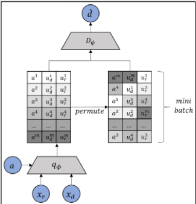
  > 
  > $\bar q(z|x^{(i)})$ 는 기존 샘플을 활용하되, 위 아래 순서만 섞는다(permute)
  > 
  > 그러면 각 Hidden variable들은 기존의 분포를 유지하면서, 다른 Hidden variable 과의 dependency를 끊을 수 있다. 

- 마지막으로 $KL(q(z)|| \bar q(z))$을 계산하자 
  
  > 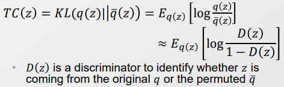
  > 
  > $\bar q(z)$ 를 계산할 방법이 없다. 
  > 
  > 그런데 우리에게 중요한 것은 $\bar q(z)$ 간 Permute 한 데이터 셋만 필요하다. 
  > 
  > log ratio Trick을 쓰고 싶으나 Density esimation이 불가능 할 경우, Discriminator을 통해 계산할 수 있음을 앞에서 보였다. 

---

##### Variational inference and Implicit Models

- VI에서도 Discriminator을 사용한다. 
  
  - Gan 말고도 사용한다. 
  
  - Density ratio을 계산할 때 사용해야 한다. 

- Density ratio는 분모가 0이 될 때 사용하지 못한다. 
  
  - 가능성이 조금이라도 있으면 사용할 수 없다. 
  
  - $q_\phi$ 는 우리가 통제할 수 있는 것이 아니라서 support 영역이 0을 포함할 수 있다. 

--- 

##### Structuring Multiple Latent Variables - 최근 유행하는 구조

- Probability graph 모델과 VAE의 연관짓는 것은 앞서서 이야기했다. 
  
  > ex)- Conditional VAE, Hierharchy VAE

- 단, VAE 구조와 Random variable과 Latent Variable이 서로 Interaction 할 때 어떻게 모델링 할 것인가에 대해선 다루지 않았다. 
  
  > 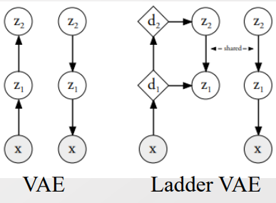
  > 
  > - 기존의 VAE 모델에서 x를 통해 $z_1,... z_i$ 까지 올라간 후 다시 내려올 때, 각 z를 거칠 때마다 $\epsilon \sim N(0,1)$ 에 영향을 받는다. 
  > 
  > - 즉, 층을 깊게 쌓을 수록 x의 값이 $\epsilon \sim N(0,1)$에 영향을 많이 받는 다는 의미이며, 이는 높은 Variance를 유발할 수 있다.  
  > 
  > -> Latent variable을 Stacking 할 때 Variance를 줄이기 위한 새로운 방안 필요

- Ladder 형태의 VAE 구조를 제안한다. 
  
  > 데이터 x를 통해서 가장 위까지 올라갈때는 Amortized inference를 통해 학습한다. 
  > 
  > 이때  Parameter update를 Deterministic Value $d_i$에 저장한다.
  > 
  > 이후 맨 위에서부터 Deterministic Value를 값을 통해 $z_i$를 학습시킨다. 
  > 
  > - 이를 통해서 모든 단위의 Variance를 통일한다.
  > 
  > - 이때 Hidden variable 간의 Dependence가 존재한다. Mean-field 가정은 하지 않는다. 
  
  > 한편 Stocastic variable을 reparametrization 해주기 위해서 $\epsilon$을 고려했다. 다르게 말하면 Stocastic 하게만 만들어 준다면 다르게 조치해줘도 된다는 것. 
  > 
  > - $z_{i+1} -> z_i$ 방향으로 weighted average 형태로 stocastic 하게 만들어 주자. 
  > 
  > > 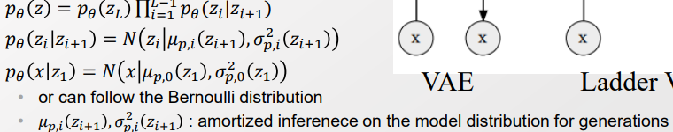
  > > 
  > > 기존에는 $p_\theta(z_{i+1}|z_i)$ 였다. 지금은 순서가 반대로 이다.
  
  > 또한 Encoder에서 학습한 Parameter들은 Decoder와 함께 공유해준다. 

 

- 마지막으로 Inference 해주자. ELBO의 구조는 아래와 같이 된다. 
  
  > $q_\phi$ : encoder 에서의 $\mu, \sigma$ 분포 (? normal 분포를 말하나?)
  > 
  > 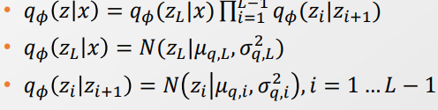
  > 
  > $p$ : decoder 에서의 $\mu, \sigma$ 분포 
  > 
  > 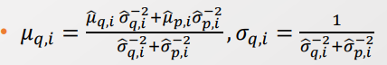
  > 
  > -> 각각 모델(encoder, decoder)에서 좀더 Precise 한 것에 가중치를 두도록 $\mu, \sigma$ 설정
  > 
  > > 애들은 어디의 $\mu, \sigma$ 일까 
  
  > Decoder와 Encoder의 $\mu, \sigma$ 는 $d_i$를 Neural Network로 Amortized inference 을 통해 학습한다. 
  > 
  > 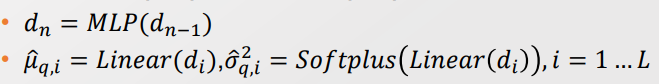
  > 
  > - Variance를 줄이기 위해서 Decoder와 Encoder의 $\mu, \sigma$를 공유한다. 
  
  > 최종 ELBO 식은 다음과 같다. 
  > 
  > 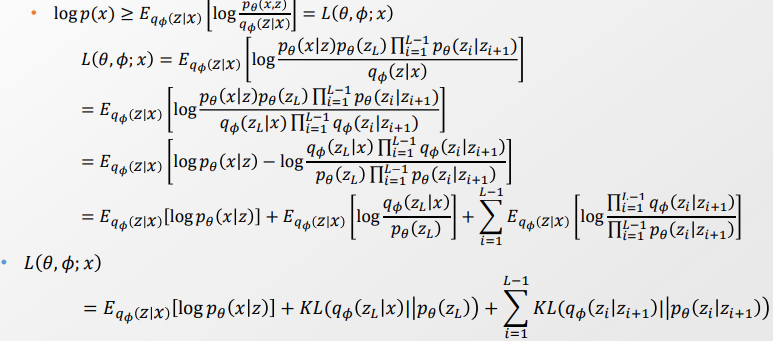
  > 
  > > ELBO 마지막 식에 부호가 잘못 되어 있음. 
  > > 
  > > 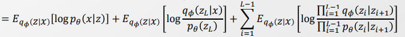
  > > 
  > > 2번째 항, 3번째 항 '-' 로 바꿔야 함.
