### 7주차 - Implicit Deep Generative Model

##### Implicit Density Modeling

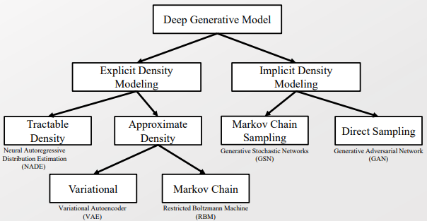

- 앞서서 Deep Generative Model 중 Explicit Approximate Density에 해당하는 Variational Autoencoder에 대해서 배웠다. 

- 이젠 Implisit Density Modeling 중 Direct Sampling에 해당하는 GAN에 대해서 배울 것이다. 
  
  - 앞서 Explicit Model 에서는 PGM(probability graph model)이 가능했으나, Implicit Model에서는 불가능하다. 

 

- 기존 Variational Inference 에선 Conjugacy 관계와 tractable Likelihood를 필요로 한다. 
  
  > Conjugate 관계 예시 ) Drichlet ↔ Multinomial distribution 
  > 
  > Tractable Likelihood는 Explicit density를 의미하나? ㅇㅇ 그런듯 
  
  - VAE에서 Variational distribution에 대한 Inference Network를 형성하여 Conjugate 관계를 더 이상 필요로 하지 않는다. 
  - 하지만 여전히 Explicit likelihood function을 필요로 한다.

- Implicit Likelihood Model을 고려할 수 있으면 <u>Explicit model에 비해 1) 표현력이 좋아질 수 있으며, 2) P 분포가 implicit 한 경우에도 적용</u>할 수 있다. 
  
  <mark>-> Learning in Implicit Model 을 연구하자! </mark>

-----

#### Generative Adversarial Network(GAN)

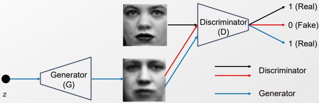

- Hidden Variable Z에 Generator을 통해서 이미지를 재 생산하자! 그리고 진짜 이미지와 생성한 이미지를 구별하기 위해 Discriminator을 적용한다! 

- 서로 Adversarial한 학습 관계를 가지고 있는 Generator과 Discriminator을 연결하여 서로 성능이 향상되도록 만든다! 

- 이때 구별해야 할 것이 있다. 
  
  - 생성한 이미지들은 Generator을 통해서 Sampling 되는 것처럼 보이지만, 정확히는 Z가 Random Variable이 이기 때문에 가능한 것이다. 
  
  - Generator은 Neural Network로 Z를 이미지로 만드는 것 밖에 하지 못한다. 
    
    - 단, Neural Network는 매우 Complex 하면서도 Flexible 한 response curve를 가지게 되었다. [활용도가 넓으면서 정확도가 높다로 이해]
  
  - 단, Z가 Random Variable이기 때문에 확률 분포를 지니며, 이로 인해 Sampling 되는 것이다. 

 

- **Notion & Modeling**
  
  > $p_z(z)$ : Noise variable의 Prior distribution
  > 
  > - Uniform, Normal distribution 등 다 가능함
  
  > $p_{data}(x)$ : x에 대한 data distribution. 데이터셋이 주어졌을 때 바로 정해짐
  
  > $p_g(x)$ : $z \sim p_z$ 일 때 G(z) 의 샘플링 분포 
  > 
  > - 구체화할 수 없다! 하지만 Sampling이 가능하다! (How?)
  > 
  > - Gan 모델에서 복원한 값(ex- Image)들을 얻을 수 있지만, 이 이미지들이 어디로부터 나왔는지(x)는 알 수가 없다. 즉, Sampling 결과에만 접근 가능!! 
  > 
  > - pdf를 알고 있을 때와 반대의 상황. sampling은 pdf을 알고 있는 것의 종속 관계가 아니다..! 
  
  > $G(z; \theta_g)$ : Generator 
  > 
  > - 파라미터 $\theta_g$ 를 가지며 미분 가능한 함수로 표현된  Neural Network이다. 
  > 
  > - Noise variable을 Data space X로 매핑한다.
  
  > $D(x; \theta_d)$ : Discriminator 
  > 
  > - x가 Generator로 부터 왔을 확률 값을 계산

 

###### Formalization of GAN - Parameter inference

- Training 예시에 대해 옳은 Label(진짜 이미지인지, 생성한 이미지인지)을 부여하는 확률 값을 Maximize 하는 것 
  
  - 먼저 데이터셋만 활용하여 Discriminator을 학습시키자! 
  
  - 학습할 때 데이터 셋에서 온 x에 대해 $D(x) = 1$ 의 값을 부여하여 학습시킨다. 
  
  > Maximize $E_{x \sim p_{data}(x)} [logD(x)]$ w.r.t. D 

- **Objective Function** 
  
  - 데이터의 출처는 데이터 셋 또는 생성, 즉 Binary case 이므로 Bernoulli trial로 여겨진다. 또한 Cross entropy 로 목적 함수를 정한다.
    
    > 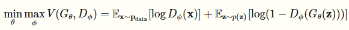
    > 
    > Noise variable z에 대해서 고려할 때
    > 
    > - 이 때 $p_{data}$ 는 이미 정해진 분포라 따로 고려할 점이 없다.
    > 
    > - 두번째 항 $E_{z\sim p(z)} [log(1-D_\phi(G_\theta(z))]$ 을 어떻게 할 것인가에 대해 고려해주면 된다.
  
  - 목적 함수를 두 단계로 고려한다.
    
    - 먼저 Discriminator 관점에서 데이터 셋에서 온 x($x \sim p_{data}$)에 대해 높은 확률 값($D_\phi(x)$)을 부여하고, 생성한 $G_\theta(z)$ ( $z \sim p(z)$)에 대해선 낮은 확률 값(1- $D_\phi(G_\theta(z))$)을 부여해라. 이를 극대화하자 
    
    - 반대로 Generator 관점에선 잘 속여야 한다. $E_{z \sim p(z)}$을 최대한 떨어트리자! 
  
  - 이때, Generator와 Discriminator은 각각 학습 하는 방향이 다르다. 따라서 제대로 학습이 안될 때가 많다. 
    
    > 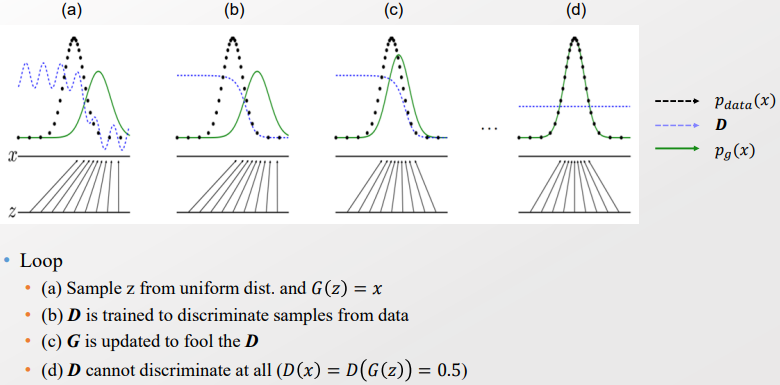
    > 
    > 매우 이상적인 상황에서만 이렇게 된다. 

 

###### Objective function of GAN의 이상적인 해답 찾기

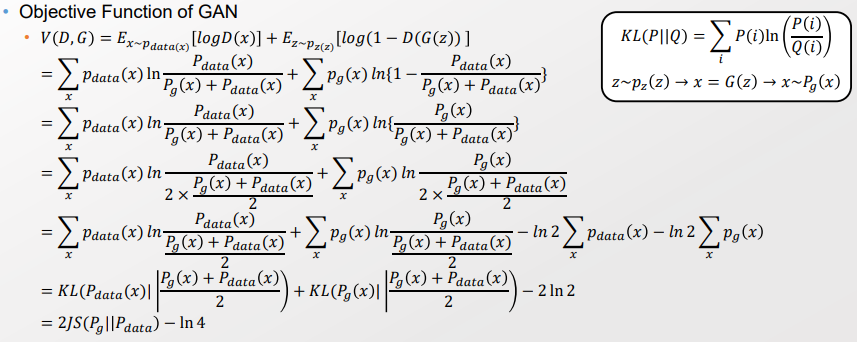

> $z \sim p_z(z) -> x= G(z) -> x \sim P_g(x)$ 

> Discriminator이 이미 Optimal이라고 가정한다. 
> 
> 그때 $D(x) = \frac{P_{data}(x)}{P_{data}(x) + P_g(x)}$ 을 성립한다. 

- 두 개의 Expectation을 Jensen-Shannon-Divergence로 표현한다.
  
  >  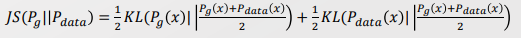

- JS을 통해서 Explicit 하게 구할 수 없었던 $P_g(x)$ 의 Bounded와 최적 값을 구할 수 있게 되었다. 

-----

##### Jensen Shanon Divergence & Training 방식

- 특징 
  
  - KL-divergence는 Lower bound( - 0 이상) 만 있는데 반해, JS-divergence는 양쪽으로 bound 되어 있다. 
    
    **=> 더욱 안정적이다.**
    
    > 0 <= JS(P||Q) <= ln2
    > 
    > - V(D,G)가 가질 수 있는 값의 범위를 생각해보면 얼추 맞음.
  
  - JS(P||Q)는 Symmetric 하다.
  
  - JS(P||Q) =0 이라면 P=Q와 동치이다.

- **정보 이론과 밀접한 관계를 맺고 있다.**
  
  - 상보 정보양(Mutual Information) I(X;Z)을 고려해보자. 
    
    - <mark>I(X;Z)는 X와 Z를 같이 고려했을 때 알게되는 정보를 의미한다.</mark> 
    
    > 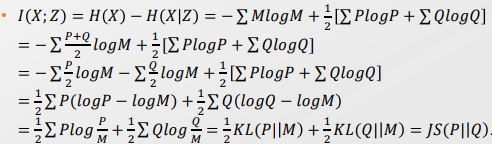
    > 
    > $I(X;Z) = H(X) + H(Z) - H(X,Z)$ 
    > 
    > $H(X) = \sum P logP $. H(Z), H(X,Z)도 동일하게 구할 수 있음. 
    > 
    > > X : Abstract function on the events. GAN에선 Data set + 생성된 Data
    > > 
    > > M : Mixture distribution. $X \sim M = \frac {P+Q}{2}$ 라고 가정. 
    > > 
    > > Z : mode selection between P and Q. 
    > > 
    > > - Gan에선 P와 Q는 각각 데이터셋에서 유래할 확률, 생성한 이미지에서 유래할 확률을 의미한다. Z는 Discriminator 느낌 Z=0 
    > > 
    > > > Z=0 라면, X가 P로 부터 왔음을 의미 
    > > > 
    > > > Z=1 라면, X가 Q로 부터 왔음을 의미 
    
    > 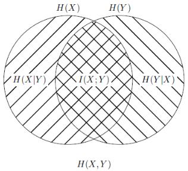

- 즉, Jensus's Divergence는 X와 Z 사이의 Mutual information과 동일하다. 
  
  - Jensus's Divergence의 값이 0 이라면, X와 Z 사이에 상호 정보는 없는 것과 동일한 의미를 가진다. [예측함에 있어서 Z는 어떠한 영향도 미칠 수 없다]
  
  - <u>Jensus's Divergence 값에 따라 Z가 X의 값을 유추함에 있어서 얼마나 많은 정보를 제공하는지 계산할 수 있다. </u>

 

- 다시 Gan으로 돌아와서 우리가 고려하는 분포 $P_{data}(x), P_g(x)$로 생각해보자. 
  
  - 우린 Objective function V(D,G)를 최적화시킬 것이며 이 값이 JS 와 같음을 보였다
  
  - 또한 JS은 Mutual Information으로서 한 Variable이 다른 Variable에 대해 제공하는 정보를 의미한다.
    
    - $P_{data}(x)$ 는 데이터셋이 주어질 때 고정된 값이다.
    
    - 그럼 우리가 조정할 수 있는 것은 $P_g(x)$ 뿐이다.
  
  - <mark>-> $JS(P_{data}(x); P_g(x))$ 를 최적화 시킬 때 $P_g(x)$ 에만 변화를 주게 된다.</mark>
    
    - <mark>한편으론 $P_g(x)$ 를 통해서 $P_{data}(x)$을 유추할 정보를 얻도록 한다는 것이다.</mark> 
    
    - 앞서 Implicit Likelihood인 <mark>$P_g(x)$ 가 $P_{data}(x)$을 최대한 유추할 정보를 주도록 최적화한다.</mark>

<mark>-> Implicit distribution인 $P_g(x)$을 최적화할 수 있게 되었다.</mark>

---

###### Theoretical Results of GAN

- 연구 차원에서 증명해냈을 때 가치가 있는 것은 2가지가 있다.
  
  - 1). 이상적인 상황은 존재하는가? 그리고 어떤 상태인가?
  
  - 2). 어떻게 이상적인 상황으로 다가갈 수 있는가?

- 1). 이상적인 상황 고려하기 [증명 완료 by Jensen ]
  
  - 앞서서 V(D,G) = $JS(P_{data}(x); P_g(x)) - ln4$  임을 보였다. 
  
  - 즉, $min_G max_D V(D,G) = min_Gmax_D [JS(P_{data}(x) ; P_g(x) - ln 4]$ 로, 만약 D가 이미 Optimal로 고정되어 있다면 Generator는 V(D,G) = -$ln 4$ 일때 최적이다. 
    
    - 즉, $p_{data} = p_g$ 로 $JS(P_{data}(x); P_g(x)) =0$ 일 때를 의미한다. 
    
    - 한편으로 의미 측면에서 Generator가 데이터셋의 분포($p_{data}$) 동일한 분포($p_g$)를 만들 때 최적임을 알 수 있다. 

- 2). 어떻게 최적으로 다가갈 것인가? [Convergence Path 보장 못함]
  
  - (가정) Global optimum으로 다가가기 까지 공간이 있다면, D와 G가 순차적으로 최적값으로 수렴할 것이다. 
  
  - 한편으론 Nash 균형으로 인해 둘다 최적으로 갈 수 있다~ 라고 하는 데 뻥임. 
    
    <u>-> D와 G는 서로 다른 학습 방향을 가지고 있기 때문에 순차적으로 학습할 수 밖에 없으며, 최적으로 수렴을 보장을 해주지 못한다.</u>

----

###### GAN의 단점 - Mode Collapse

- Generator 관점에서, 최적값을 가지는 특정 값(ex- Local optima)에 빠져 그것만 계속 생산할 수 있다. 
  
  > $G(z) = x^* $ s.t. $x^* = argmax_xD(x)$
  > 
  > 이때 $x^*$ 은 $z \sim p_z(z)$의 샘플링과 관계없이 고정된 결과가 될 수 있다. 
  > 
  > 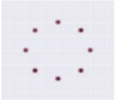최적의 솔루션이 좌측 그림처럼 8개 점에 대해서 있다. 
  > 
  > 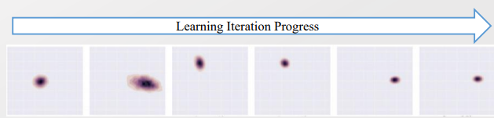
  > 
  > 하지만 학습해보면 최적의 솔루션 중 일부만 계속해서 생산해내는 Mode Collapse가 발생한다. 

- 따라서, 추가 조치를 하여 새로운 결과값을 찾도록 자극을 줘야 한다. 
  
  - 이때 G와 D 중에서 조치를 취해야하는 것은 D이다. 왜냐하면 G는 따로 참고할 것이 없으나, D는 정보(생성된 데이터인지, 데이터셋에서 왔는지 여부)를 더 알고 있으니까  
  
  - 그럼 어떻게 D를 설계할 것인가. 

 

- 이상적인 경우를 고려하자. 
  
  > 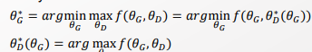
  
  - $\theta_D^*$ 의 값을 Gradient signal 값을 하나 하나 추가함에 따라 최종적으로 수렴한다고 가정한다. 
    
    > 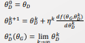
  
  - 하지만 실제론 $\theta_D^*$ 의 값을 구하기 위해 K을 무한대로 늘릴 순 없다. 따라서 적절한 K로 적용한다.(Surrogate 한다)
    
    > 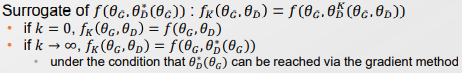

  

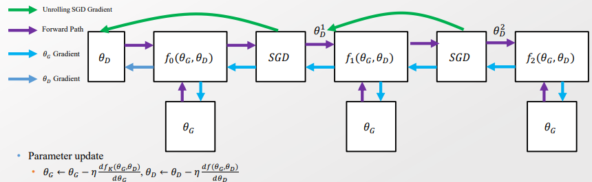

- 즉, 요점은 D에 대해서 바로 직전의 상황만 고려하는 것이 아니라, k 단계 이후의 경우의 수를 고려하는 것 [강화학습의 방식과 유사]
  
  - 이전 방식보다 좀 더 넓은 영역을 탐색할 수 있다. 

- Parameter을 update할 때, Generator에는 여러 Unrolled 상황을 고려하며 Discriminator에는 통상적으로 학습한다.
  
  > Q. Why? 왜 Generator에만 여러 경우를 고려하나? 
  > 
  > Unrolled GAN의 목적과 가정을 생각해보자 
  > 
  > 우리는 Mode Collapse를 일으키는 Generator을 학습시키고자 한다. 
  > 
  > 이것에 집중하기 위해서 Discriminator은 이미 Optimal 하다고 가정하고 있다. 
  > 
  > 즉, 현 목적과 가정을 기반으로 했을 때 Discrinator에는 기존대로 적용해도 어려움이 없다. 
  
  > Generator을 편미분 했을 때, 
  > 
  > 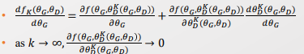[좌 : 정미분, 우 : 편미분]
  > 
  > k가 무한대에 가까워짐에 따라, $\theta_D^k = \theta_D^*$ 에 근사한다. 즉, 더 이상 변화가 없기 때문에 미분 값이 0에 수렴한다.
  > 
  > 반대로 K=0 이라면 일반적인 Gan과 동일해진다. 
  > 
  > k가 많을 수록 좋지만, Gradient sigmal은 Discounting 되며 점차 약해진다. 

- 이 방법은 D을 몇차례에 걸쳐 반복 학습하는 것과 다르다. D를 몇 차례 진행시켜 여러 버전을 만든 다음에 학습하는 것이다.

- 정리하면, Surrogate Function : $f_K(\theta_G, \theta_D) = f(\theta_G, \theta_D^K(\theta_G, \theta_D))$ 을 도입하여 기존 방식에 대한 이득을 discounting 시켜 탐색을 촉진시키며, 이를 통해 mode collapse를 해소한다.
  
  > 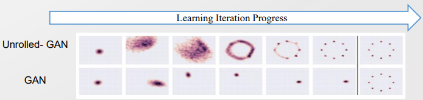
  
  - 단, 이 방식은 Z가 알아서 다양한 값을 가지리라 기대하는 것으로, 강력히 다른 값을 가지도록 조치할 필요가 있다. 지금은 기존의 이득을 discounting 하는 것이 끝이다.
    
    - 예시로, 다수의 Discriminator을 적용하거나 Augmentation을 부여가 있겠다.

-----------

#### Variants of Generative Adversarial Network - GAN Model의 변주

###### Conditional GAN

- 크게 1) Condition 조건을 아는 Supervised setting, 2) 조건을 모르는 Unsupervised learning 두가지 경우가 있다. 
  
  > 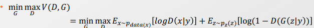
  > 
  > 이 경우는 y값이 주어진 Supervised learning setting! 
  > 
  > D와 G 모두 주어진 Condition y를 고려하자! 

- Supervised setting 에서는 G와 D에 Concatenate를 통해 추가해주면 된다. 끗. 
  
  > 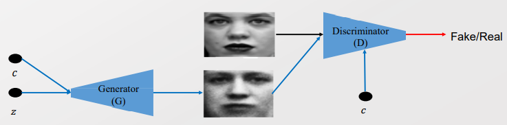
  > 
  > $NN_G(z,c;w_G) =x $
  > 
  > $NN_D(x,c;w_D) = p$ 

 

##### Info GAN

- Unsupervised setting 에서는 Latent variable을 추가하는 것을 고려한다.
  
  - 앞서 Mutual Information I(X;Z)을 통해서 Variable을 추가했을 때 얼마나 더 정보를 얻을 수 있는지 확인했다. 이를 활용한다. 
  
  > $min_G[max_DV(D,G) - \lambda I(c; G(z,c))]$ 
  > 
  > Latent variable을 C를 추가했을 때의 Mutual Information을 같이 고려하여 Generator을 최적화한다. 

- 이때 c는 Latent Variable로, 직접 구할 수 없어 근사를 필요로 한다. 
  
  - Mutual Infomation 식을 통해서 Lower bound를 찾아 Tight 하게 만들어주자 
  
  > 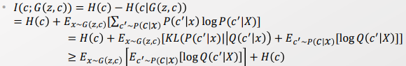
  > 
  > 3번째에서 4번째로 내려갈 때 KL-term(>=0 ) 을 생략한 것. 
  > 
  > 우리의 관심은 c와 z의 관계이므로, H(C)는 고려안해도 된다. 
  > 
  > $P(c'|x) logP(c'|X)
  > $ 의 값은 우리가 계산할 수 없다. 따라서 임의의 Q 분포를 도입하여 계산가능한 형태로 바꿔준다.  
  > 
  > 부등식이 Tight 해지는 시점은 KL-term이 0이 되는 순간, 즉, $P(c'|x) = Q(c'|x)$ 일 때이다. 
  
  > 이로써 I(c; G(z,c)의 Lower bound을 찾았다. 이제 Objective function에 적용하자. 
  > 
  > 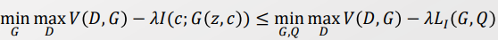
  
  > 이때 Q는 주어진 x를 기반으로 c 값을 만들어 내는 임의의 분포를 의미한다.

 

- Info GAN은 Conditional GAN과 상당히 유사하다.
  
  > 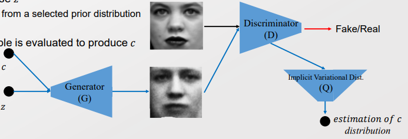
  > 
  > 이때 c가 x에 잘 반영되어 있다는 가정하에 적용한다
  
  - 단, Info GAN에서는 C가 Latent variable 이므로, Conditional GAN과 다르게 Concatenate 형태로 넣어줄 수가 없다. 
  
  - 결국, Q는 Latent variable c가 있다 치고, c를 맞춰야 한다. [= 시뮬레이션 과정]
    
    - C를 맞출 수 있도록 Q 또는 G을 학습시킨다. 

------------

### Modifying the Loss Characteristics - 과연 이 Loss가 옳을까?

- 지금까지의 모델들은 기능을 넓히자! 에 초점에 맞춰져 있었다. 

- 이제는 기존의 기능을 더 좋은 방법으로 하자!에 초점을 맞춘다.

- 앞서 GAN의 Objective function을 Jensen-Shannon divergence을 통해 표현했다. 
  
  > 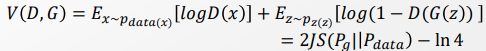
  
  - 하지만 Divergence는 Distance 조건을 충족시키지 못한다.
    
    > 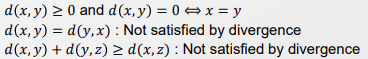
  
  - Distance는 벡터라면 구할 수 있다 함수는 벡터의 일종이다.
    
    > $R^\infin$ : Countably many. Sequential Array 
    > 
    > $R^R$ : Uncountably many. Dense. <u>실수 공간의 함수</u> 
    
    - 즉, 함수도 벡터이기에 Distance를 구할 수 있다. 
  
  - 분포 사이에 Divergence가 아닌 Distance를 재보자! 

 

- **벡터의 특성을 활용하기 위해 함수인 PDF을 통해 distance 형태로 Objective function을 표현해보자**
  
  - 앞서 Variational Inference 에서 Convex Duality를 다뤘던 것을 활용하자. 
  
  > 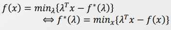
  > 
  > $f^*(\lambda)$를 Dual function, 또는 Conjugate function이라 한다.

- Fenchel conjugate라고 알려진, Convex conjugate function을 활용한다.
  
  > 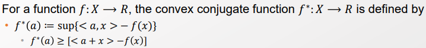
  
  - Fenchel conjugate의 특성 
    
    - Fenchel's inequality : For all $a, x \in X,  <a,x>$  <= $f^*(a) +f(x)$
    
    - 순서 변경 : If f(x) <= g(x) for all x $\in X $, $g^*(a) <= f^*(a) $ for all $a \in X$
    
    - $f^*$ 또한 항상 convex하며, Lower semi-continuous 하다.
      
      > 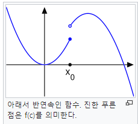
    
    - f(x)의 미분 값 a에 대해 아래 수식이 성립한다.
      
      > 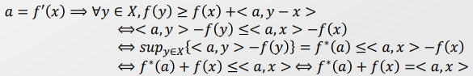
      > 
      > 첫번째 줄 : f(y) - f(x) >= <a,y-x> [Convexity of f]
      > 
      > 두번째 줄 : <a,y-x> = <a,y> - <a,x> 
      > 
      > 세번째 줄 : Fenchel conjugate 정의 $f^*(a) = sup[<a,x> - f(x)] $ 
      > 
      > 네번째 줄 : Fenchel's inequality 와 위의 식 함께 고려. 부등호 식이 반대임.  
    
    - <mark>$f^*(a) + f(x) = <a,x> $ when $a = f'(x)$</mark>

  

##### f- divergence

- 기존의 KL-Divergence를 f- Divergence로 변경하자! 
  
  > KL-Term : $KL(P||Q) = \int_x P(x) ln(\frac{P(x)}{Q(x)})dx $
  > 
  > $D_f(P||Q) = \int_x q(x) f(\frac{p(x)}{q(x)} dx)$
  > 
  > > 분자, 분포에 있는 것이 다르니 주의!
  > > 
  > > f : generator function, convex. f(1) = 0

- f에 대해서 Fenchel Conjugate $f^*(t), t \in T$ 을 정의할 수 있다. 
  
  >  $f(u) = sum_{t\in T} \{tu - f^*(t) \}$
  
  > 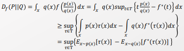
  > 
  > 두번째 줄 : Jensen's inequality. Sup이 개별적으로 적용된 것의 합보단, 전체 합의 Sup이 더 작음. 
  > 
  > - 첫째줄의 t와 둘째줄의 $\tau$ 은 Sup의 대상이 달라짐에 따라 값이 달라짐.
  > 
  > - t를 x의 값에 따라 변화하는 함수 $\tau(x)$ 로 표현함. t의 값은 x의 값에 따라 달라지기 때문에 모든 x의 경우에 대해 대응하기 위해 $\tau(x)$ 도입 필요. 
  > 
  > - 짜잔. <mark>$\tau(x)$ 는 GAN 에서의 Discriminator의 위치를 차지하고 있음</mark>
  
  - 이때 t는 Variational inference $\lambda$ 와 동일하게 Complexity을 줄이는 역할을 함. 
  
  - 우리가 접근가능(계산가능)한 영역은 마지막 줄의 Sup 정도가 되겠다. 
    
    > Q. Expectation 이니까 Sampling으로 근사시켜주는 건가? 
    > 
    > - Nope. Analytic 하게 최적값을 찾아냄 
    > 
    > p(x) : Real Image의 분포 
    > 
    > q(x) : Generated image의 분포                                                                                                                                                     

 

- 이제 우리가 고려해야할 것은 2개다. 
  
  - 1). 언제 Lower bound가 Tight 해지는가. (부등호가 등호가 되는가)
    
    - 개별 Sup의 합이 전체 합의 Sup과 같아질 때
    
    - 즉, Sup을 없애줄 수 있을 때 Tight 해진다.
  
  - 2). 어떻게 Tight 한 곳으로 접근할 수 있나(Sup을 언제 제거해줘도 되나)
    
    > $f(u) = sup_{t\in T} \{tu - f^*(t) \}$
    > 
    > <=> $f(x) = sup_{a\in T} \{ax - f^*(a) \}$  [u=x, t = a]
    
    > <u>우린 이미 이 sup이 $a=f'(x)$ 일때 없앨 수 있음을 보였다. </u>
    > 
    > 따라서 $\tau(x) = f'(\frac{p(x)}{q(x)})$ 일 때 최적값이다. 
    > 
    > - 왜 f' 안에 $\frac{p(x)}{q(x)}$ 인지는 아래에 설명 

 

- KL divergence를 Fenchel conjugate 형태로 바꿔보자! 
  
  > let u = $\frac{p(x)}{q(x)}$, f(u) = u log u
  > 
  > KL-term : $\int p(x) log \frac{p(x)}{q(x)} dx = \int q(x) \frac{p(x)}{q(x)} log\frac{p(x)}{q(x)} dx$
  > 
  >                                                   $= \int q(x)u log(u)dx $
  > 
  >                                                   $= \int q(x) f(u) dx= \int q(x)f(\frac{p(x)}{q(x)})$ [f-diver]
  > 
  > 앞서 증명했듯 최적 지점은 $\tau(x)  = f'(\frac{p(x)}{q(x)}) = 1 + log \frac{p(x)}{q(x)}$이다. 

 

- Gan도 Fenchel conjugate 형태로 바꿔보자!! 
  
  > 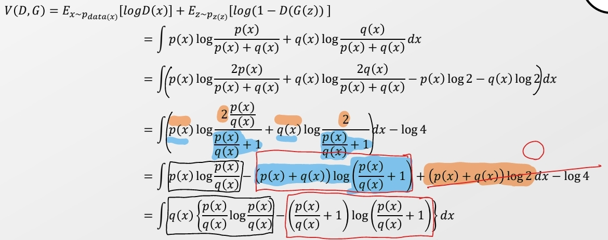
  > 
  > 여기서 $\frac{p(x)}{q(x)}$ 을 u라고 해보자. 
  > 
  > > $V(D,G) = \int q(x) [u logu - (u+1)log(u+1)] dx$ 
  > > 
  > > $f(\frac{p(x)}{q(x)}) = f(u) = u logu - (u+1)log(u+1)$
  > 
  > $V(D,G) = \int q(x) f(\frac{p(x)}{q(x)})dx$ 형태로 표현가능하다.
  
  > 또한 Optimal한 경우는 $\tau(x) = f'(\frac{p(x)}{q(x)}) = f'(u)$ 이므로, 
  > 
  > $\tau(x) = f'(u) = log \frac{u}{u+1} = log \frac{p(x)}{p(x)+q(x)}$ 일 때 성립한다. 
  
  > $\tau(x)$ 의 형태를 볼 때 Discriminator 형태를 띄고 있다. <mark>즉, $\tau(x)$가 Discriminator의 역할을 하고 있다고 볼 수 있다. </mark>
  > 
  > - x가 P에서 오는지 q에서 오는지 구분해준다. 
  > 
  > 또한 Tight해질려면 $\tau(x)$를 학습시켜야 한다.
  > 
  > 우리가 Neural Network에서 Gradient Signal을 통해 학습하는 것을 고려할 때,  <u>Sup 조건이 우리가 Tight 할 수 있는 기준을 찾도록 만들어 준다.</u> 
  > 
  > 반대로 말해 Sup이 없었다면 tight하게 만드는 Gradient Signal이 나오도록 요구하지 않았을 것이다. 

 

- 즉, F-divergence의 값을 직접 못 찾으니 Lower Bound를 Tight 하게 만드는 조건을 충족시킴으로써 찾는다. 
  
  - 마지막으로 값을 계산하기 위해 p(x), $f^*(x)$, q(x), $\tau(x)$ 에 대한 값을 찾기만 하면 된다. 
    
    > p(x) : 데이터셋 분포. 그냥 계산하면 됨 
    > 
    > $f^*(x)$ : F-divergence를 정의하면서 이미 구체화됨 
    > 
    > q(x) : Generator 결과의 분포! 근사를 통해 구해야 함 
    > 
    > $\tau(x)$ : 최적의 값이 그때 마다 다르다! 보통 p(x), q(x)의 값 모두 필요하기 때문에 q(x)을 구한 뒤 계산 가능 

- Lower bound를 $F(\theta, w) = E_{x\sim P}[T_w(x)] - E_{x \sim Q_\theta}[f^*(T_w(x))]$로 표현가능하며, 목적에 따라 조정해줄 수 있다. 
  
  - Divergence를 줄이기 위해 $\theta$를 통해서 $F(\theta, w)$을 줄인다. 
    
    > $\theta$ 는 Q 분포에 들어가는 벡터를 의미한다.
  
  - Tight 하게 만들기 위해 $w$을 통해 optimal $\tau$ 를 찾아 $F(\theta, w)$을 최대화한다. 
    
    > w는 $\tau(x)$에 들어가는 x를 의미하는 듯. 

<mark>=> 이젠 GAN에서 F-divergence Form만 찾으면 다 Tight 조건을 찾을 수 있다. </mark>

######  

###### f- divergence의 단점

- $\frac{p(x)}{q(x)}$ 에서 q(x)가 0인 경우 문제가 생긴다. 
  
  - 이전에는 q(x)가 임의의 분포로 Long-tail을 가진다고 가정하면 됐다.(ex-Gaussian)
  
  - 하지만 여기서의 q(x)는 Generator가 생성한 샘플의 분포로 우리 통제하에 없다.
  
  - 즉, 우리는 <u>어떻게 q(x)가 0의 값을 안 가진다는 것을 어떻게 알 수 있을까?</u> 
    
    - 특히 지금은 q(x)을 알아내자가 목표기 때문에 그냥 못 넘어간다.
  
  - 위의 문제를 해결하지 않고는 f-divergence를 사용하지 못한다. 

<mark>-> Divergence 말고 다른 걸 쓰자</mark>

----

#### Integral Probability Metrics(IPM) 도입

- 서로 다른 분포 $\mu$ 와 v의 서포트 영역의 차이를 Sup 한 값으로 distance를 정의한다.
  
  > 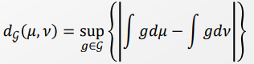
  
  - $\mathcal{G} $을 어떻게 세팅하느냐에 따라 IPM이 달라진다.
  
  - 지금까지 위의 식을 활용 못한 이유는 영역이 너무 넓어 적분을 계산하기 어려움.

- $\mathcal{G}$ 는 크게 3가지 종류가 있다. 
  
  - 1). Total variation distance 
    
    > 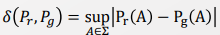
    > 
    > $\sum$ 의 모든 경우 고려 불가. 즉, 계산 불가 
  
  - 2). Wasserstein metric 
    
    > 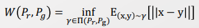
    > 
    > 적분 영역이 너무 넓어서 계산할 수 없음.
  
  - 3). Maximum Mean Discrepancy(MMD)
    
    > 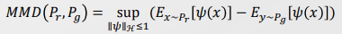
    > 
    > $\psi$ 는 임의의 함수. $\psi = I$ 일 때에는 Mean 구하는 것과 동일
    > 
    > 적분 영역이 좁아졌고, $\psi$ 는 내 통제에 있으니 그나마 계산 가능하다.
    
    - $\mathcal{G}$ 가 RKHS의 Unit ball 이다. 

---- 

#### GAN 과 MMD를 합쳐보자

- 기존의 f-divergence에서 f 함수를 MMD 형태로 부여하자 
  
  > 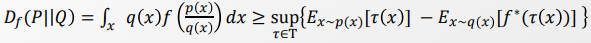
  > 
  > 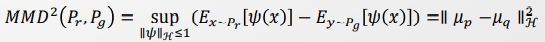
  > 
  > > Q. $\tau(x)$ 를 $\psi(x)$ 로 대체하는 것으로 보면 되겠다만.. 그런데 그렇게 해도 되나..? 아하 두 함수 모두 데이터가 p,q 에서 왔는가를 판단하려는 거니까. 
  > > 
  > > Divergence 함수를 Distance 함수로 바꾸는 것이라 생각하면 말 되네. 
  > 
  > $\psi(x) =x$ 일때, 이건 mean과 같아진다. 
  > 
  > $\psi(x) = (x, x^2)$ 일때, mean과 variance와 매칭된다.  
  > 
  > - 이때 정규 분포의 Sufficient statistic 조건을 충족한다. 
  
  - $\psi(x)$ 가 다양한 경우를 보장해주기 위해 Infinitly 하게 가면 좋겠다! Kernel trick을 도입하자! 
    
    > $\mu_o = \int k(x, .) p(dx) \in H$
    > 
    > k(x,.) : Kernel function for 커널 트릭 
    > 
    > H : Kernel Herbets space
    > 
    > 이때 p나 q에 대해서 직접적인 접근이 불가능할 수 있다. 따라서 $E[f(x)] = <f,\mu_p>_H$ 로 구한다. 

- 커널 two-sample test에 따라서 아래 식이 성립한다. 
  
  > 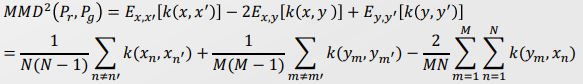
  > 
  > 각 Expectation은 Monte Carlo Expectation을 통해서 Sampling 근사를 한다.
  
  - Kernel Trick이 Inner product가 되는 상황에서만 쓸 수 있으니 이에 맞춰서 정의한다. 
  
  - 이젠 더 이상 $\psi$ 를 정의할 필요가 없다. 물론 k를 정해야 하긴 하지만 우리 자유다. 

 

- 이제 MMD를 최소화해보자 
  
  > 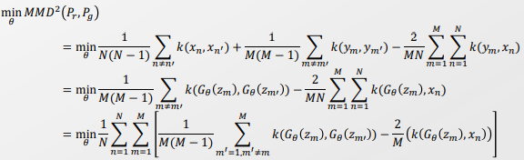
  > 
  > 이때 $k(x_n, x_n')$ 데이터 셋에서 유래하여 상수값이다. 즉, 고려안해도 된다. 
  > 
  > $y_m, y_m'$ 의 값은 Generator을 통해 많은 값으로 고려해줘야 한다.  
  > 
  > > $y_m = G_\theta(z_m)$

- <mark>하지만 계산량이 너무 많고, 굳이 MLP를 사용할 필요가 없어 사용하지  않는다. </mark>
  
  > Q. MLP? 위의 방법은 NN을 사용하지 않는 다는 의미일까나? 
  
  > $\sum_{n=1}^N$ : 모든 샘플 
  > 
  > $\sum_{m=1}^M$ : 여러번 반복 
  > 
  > 또한 $z_m, x_n$ 의 Joint한 경우를 고려해야 한다.
  > 
  > 거리를 또 각 계산해야 한다.  
  > 
  > -> 계산양이 너무 많다. 

- Kernel로는 주로 RBF를 주로 사용함 

-----

###### IPM 추가 Develop!

- Divergence 및 Distance Metric에 대해서 $p_{data}, p_g$ 분포에 따라 Gradient descent가 가능한지 점검하자. 

- 극단적인 경우를 확인하기 위해 $p_{data}, p_g$ 를 아래와 같이 정의하자. 
  
  > $Z \sim U[0,1]$ : the uniform distribution on the unit interval 
  > 
  > $P_0$ : (0,Z) $\in R^2$ 의 분포. 
  > 
  > $g_\theta(z) = (\theta, z), \theta \in R$. $\theta$는 Generator functino의 Parameter 
  > 
  > 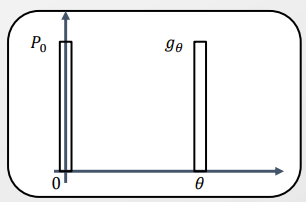
  > 
  > $p_{data}$ 는 0의 값에서만 1의 값을 가지고, 나머지 상황에선 0을 가진다.
  > 
  > $p_g = g_{\theta}$는 $\theta$ 에서만 1의 값을 가지고, 나머지 상황에선 0을 가진다. 
  > 
  > -> $\theta$ 가 0일 때 최적이나, 나머지 값들에 대해선 1의 Divergence/Distance를 가진다. 
  
  - 이때 Gradient Descent가 가능하도록 Continuous 조건을 만족하는 것은 Wasserstein metric 밖에 없다. 
    
    > 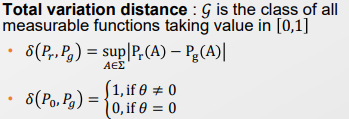
    
    > 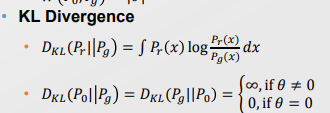
    
    > 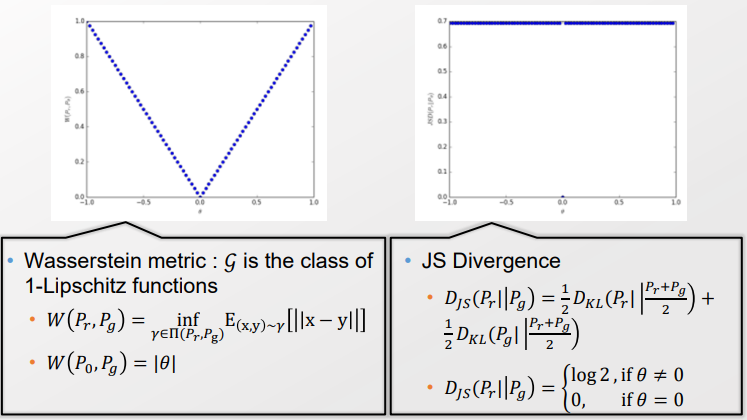
    > 
    > Wasserstein metric : 유일하게 $\theta =0$ 을 제외하고 모든 값에 대해서 Conti. $\theta=0$ 이라는 것은 이미 수렴한 것이니까 상관없음
    > 
    > JS Divergence :  Not Conti.  하지만 값이 log2 로 bound 되어 있어 Gradient descent는 가능하지만 점차 오차가 생김. 또한 수렴 방향이 나오지 않아서 수렴이 어려웠음. 
    > 
    > -> 작은 크기로 오차가 쌓이니 문제를 찾아내기 힘들었다.  
    
    -> 다른 Distance, Divergence는 NN에서 오차를 계속 만들어 낸다. 따라서 Wasserstein metric을 사용해야 한다! **[IPM의 정당성과 Wasserstein의 필요성]**

------

##### Wassertein Distance with GAN

- 문제점 : Wassertein Distance를 GAN에 대입하고자 하나 분포에 있어 차이가 있다. 
  
  > 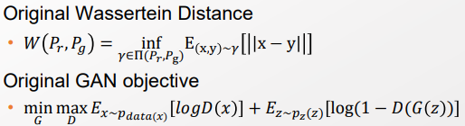
  > 
  > $E_{(x,y)\sim \gamma}$ 는 GAN의 $E_{x \sim p_{data}(x)}, E_{z \sim p_z(z)}$ 와는 다르다. 
  > 
  > $\gamma$ 는 joint distribution인데, $p_{data}(x), p_z(z)$ 는 Marginalize distribution이다. 
  > 
  > Joint distribution은 계산양이 많아 그대로 활용할 수 없으며, GAN에 적용하기 위해 $p_{data}, p_z$ 각각에 Marginalized 해야 한다. 
  > 
  > 이때 $p_{data}, p_z$ 에 Marginalized 함과 동시에 Wassertein Distance를 최소로 만드는 Translation을 탐색하자. **[분포의 Mass transport 필요].** 

 

###### Kantorovich-Rubinstein Duality

- Linear programming 에서 최적화에 있어 쌍대성이 존재한다. 
  
  > 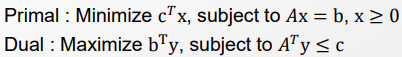
  > 
  > c : Translation 한 이후의 거리. 즉, $c^Tx$ 는 Translation 후 변화한 거리(정도)를 의미하며, 이를 최소화하는 것은 Wassertein distance 을 최소화하는 것이다. 
  > 
  > Duality에 의해 $c^Tx$ 를 최소화하는 것은 $b^Ty$ 를 최대화하는 것과 동일하다. 
  > 
  > 이때 A가 Wassertein distance가 최소값이 나오도록 Mass transportation 시켜주는 Matrix 라고 하자. 우리는 Duality를 활용하여 A의 조건을 알아보자(?) 

 

- $p_r $(데이터 셋 분포)를 최적의 $p_g$(generalize distribution)으로 옮기는 A를 찾자. 
  
  > 
  > 
  > 각각 $p_r$ 과, $p_g$ 는 Joint distribution $\gamma$ 가 나왔을 때 각각 Marginalize 한 결과 
  > 
  > 즉, 서로의 결과값이 정해진 상태에서, 어떻게 중간과정인 Projection을 했을 때 변환 전 후의 차이(||x-y||)가 최소화 되도록 하는 Projection Matrix를 찾자.  
  > 
  > - 즉, 최대한 변화 없이, 최소한의 변화만을 요구하는 값을 찾는다. 

 

- Projection을 모델링하자 
  
  > 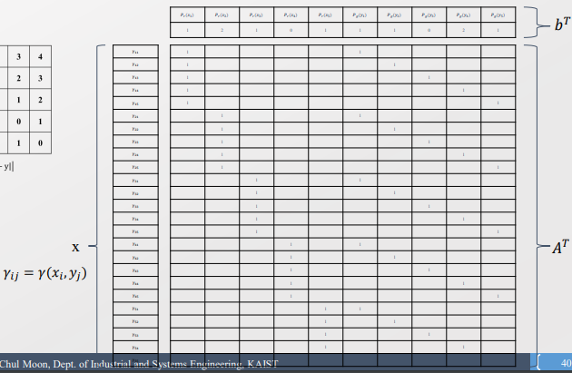
  > 
  > Decision variable x : $\gamma$ 의 모든 경우 (5 x 5)를 고려해야 함.  
  > 
  > - 우리가 찾아야 하는 값 
  > 
  > Translation matrix A : Ax =b. Translation을 한 다음에도 marginal distribution이 유지되도록 해야한다. [Hard constraint]
  > 
  > - 각  Marginalization 식을 풀어 쓴 것 
  >   
  >   > $\gamma_{11}+ \gamma_{12}+ \gamma_{13}+ \gamma_{14}+\gamma_{15} = P_r(x_1)$
  > 
  > output b : $\gamma$ 를 Projection 한 결과. $p_r, p_g$ 각 5개씩 총 10개. 
  > 
  > $c^T$ : Objective function coefficient : earth movement 간 거리. ||x-y||
  > 
  > -> x를 제외하고 A,b,c 모두 주어짐. 

 

- Duality를 활용하여 최적화 해야 하는 변수의 개수를 $n^2$ 에서 $2n$ 으로 줄인다. 
  
  > 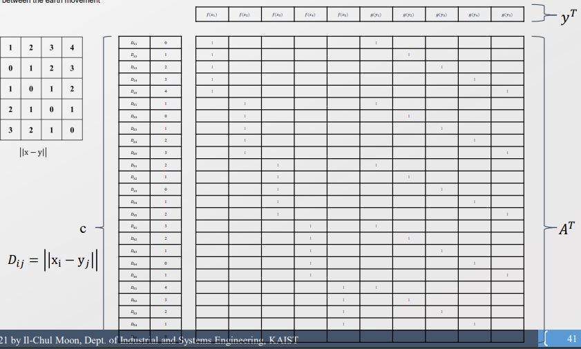
  > 
  > X의 개수가 25개($n^2$)인 것에 비해 Y는 10개(2n) 으로 줄었다. 
  > 
  >  y는 매 지점(x,y)들마다  Projection 될 Measure(f(x), g(y)) 의 Projection 
  > 
  > > f(x)의 x는 $p_r(=p_{data})$ 을, g(y)의 y는 $p_g$를 따름. 
  > > 
  > > -> 각 f(x), g(y)는 GAN 에서의 discriminator 역할을 하는 함수가 될 수 있다. 
  > 
  > <u>y를 최적화하면 우리가 목표로 하는 x 값을 구할 수 있다. </u>

 

- Dual 이 최적화 될 때 f(x) 가 Lipshitz constraint 특성을 지닌다. 
  - Dual : Maximize $b^Ty$, subject to $A^Ty<=c$ 이기 때문에, 각각 계산하면 아래와 같이 나온다. 
  
  > $f(x_i) + g(y_j)<= D_{ij}$   (행렬 계산을 하면 나옴)
  > 
  > 이때 $D_{ii} =0$ 이기에, $f(x_i) + g(y_i) <= 0$ 이 된다. 
  
  > $b^Ty $가 Maximize 로 Optimal 되는 것은  $A^Ty =c$  일때로, 
  > 
  > $f(x_i) = -g(y_i)$ 을 성립할 때로, 모든 경우에 대입하면 아래 식이 나온다. 
  > 
  > $f(x_i) + g(y_j) <= D_{i,j}$  => <mark>$ f(x_i) - f(y_i) <= D_{i,j}(=|x_i - y_j|)$  </mark>
  > 
  > -> 즉, f의 차이가 일정 상수 보다 이하인<mark> Lipschitz constraint 특성을 지님</mark>
  > 
  > > $d_Y(f(x_1), f(x_2)) <= Kd_X(x_1, x_2)$ [Lipschitz constraint]
  
  - Neural Network에서는 Lipschitz constraint가 당연히 성립해야 함. 그래야 Gradient가 발산하지 않을 수 있음. 

  

- 위의 내용을 종합하여 Kantorovich-Rubinstein Theorem이 성립한다. 
  
  > 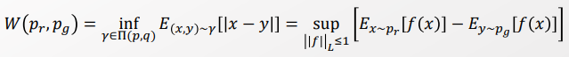
  > 
  > <u>Joint distribution의 Expectation을 Sup 형태로 끌어내어 기존 GAN 형식과 유사하게 생성한다!</u> **이것이 Kantorovich-Rubinstein Theorem의 의의!**
  > 
  > Lipschitz Constraint 특성을 띌 때, $f(x_i) - f(y_i) <= D_{i,j} = |x-y|$ 을 성립한다. 즉, $|x-y| $의 최소값은 f(x) - f(y) 의 최대값과 동일해진다. 
  > 
  > 물론 이때 서로 다른 분포에서 위치한다는 점을 같이 고려해야 한다. 

- 이후 GAN 식에 대입함으로써 Wassertein GAN을 마무리한다. 
  
  > 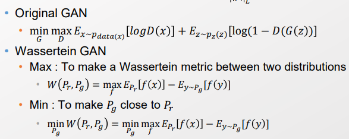
  
  - 이때 GAN과 Wassertein GAN에서 Discriminator가 바뀌었다. 
    
    - GAN에선 x가 Dataset에 속할 경우를 D(x), 아닐 경우를 1-D(x)로 여겼다. 
    
    - 하지만 Wassertein GAN 에선 모두 f 함수로 고려한다. 
    
    -> 즉, 더 이 식에선 f는 꼭 데이터셋 만 추려낸다는 것이 아니다. Generated 된 데이터로 상관없이 Generator을 발전시키는 데 도움이 되면 된다. 이젠 Critic 의 역할을 맡을 수 있게 되었다. 

