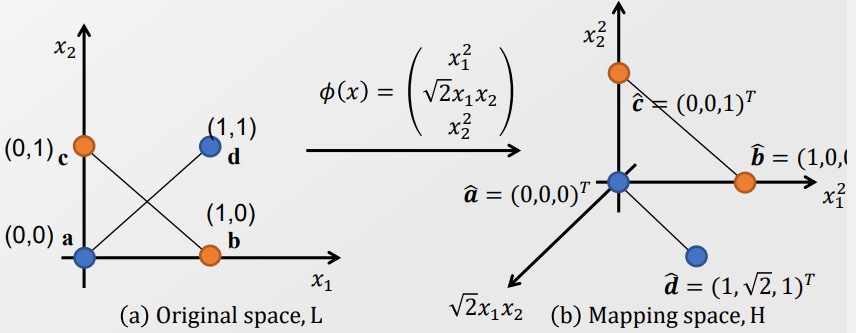

### 8주차 - Gaussian Process

##### Motivation

- 왜 갑자기 확률을 다룰까? 
  
  - 이전까지는 $p_g$ 의 변화 과정을 고려하지 않았다. 
  
  - 이제는 시간, 공간 등의 이유로 Dynamic 하게 변화하는 양태를 이해하고 모델링하자 .

 

##### Simple Continuous Domain Analysis

- 시간, 공간 등 Continuous 상황에서의 분포의 변화를 모델링해보자 

- 각 Domain과 Correlation 없이 Mean function을 예측해보자 
  
  > Moving Average with time window 
  > 
  > $MA(x) = \frac{1}{N} \sum_{x_i \in W,D} y_i$  s.t. $W = [x-w_{low}, x+ w_{high}], N =|\{x_i| x_i \in W,D \}|$

- Moving Average(이동 평균)은 매 관측 사이의 거리에 따라 Correlation에 영향을 준다.
  
  > 
  > 
  > 이때 관측값 사이의 거리를 계산함에 있어 미분 가능성이 중요하다. 
  > 
  > 따라서 무한번 미분할 수 있는 Gaussian Kernel(RBF) 을 적용한다. 
  
  > $k(x, x_i) = exp(-\frac{|x-x_i|^2}{L^2})$
  > 
  > 

=> 지금까지($t_n$) 까지 관측된 값을 가지고 그 다음 Step을 예측할 수 있을까? 

- <mark>$P(t_{n+1}, T_n)$ 을 계산할 수 있나?</mark>
  
  > $T_n : <t_1, t_2, ..., t_n>$

----

#### Derivation of Gaussian process

- XOR 문제의 경우 Linear 방식을 통해서 Discrimant space / Line을 형성할 수 없다. 

- 이를 해결하기 위해서는 1) Feature expantion, 2) Nonlinear function을 도입해야 한다. 
  
  > 

 

- Linear regression $y(x) = w^T\phi(x)$가 있다고 하자. 
  
  > $\phi : $ Design Matrix. Input vector x와 weight vector w 사이에 관계를 알려줌 
  > 
  > $\phi_{nk} = \phi_k(x_n)$

 

- 기존에는 w은 Deterministic value로 여겨졌다. 이제 Bayesian Statistic으로 고려하여 Random variable로 고려해주자 
  
  > $P(w) = N(w|0, \alpha^{-1}I)$    [Gaussian 분포에 따른다고 가정]
  > 
  > Gaussian distribution은 Variance 기반($\sigma$) 또는 precision($\alpha$) 기반으로 표현할 수 있다. 
  > 
  > > 공분산 행렬의 역행력 $\sum^{-1}$ 을 Precision matrix(정밀도 행렬) 이라 한다.

- 그럼 y 또한 Random variable이 된다. 그리고 기댓값을 구할 수 있다. 
  
  > 
  > 
  > Q. $E[ww^T] = \frac{1}{\alpha}$ 인가? 
  
  - 이때 공분산 행렬은 Gram matrix와 매우 유사하다. 
    
    >  Gram matrix : Vector 들의 집합($v_1, ..., v_n$) 들의 내적을 진행하는 것 
    > 
    > > 
    
    > 이때 Gram matrix는 벡터들 간의 내적을 구하는 것으로 Kernel Function을 쉽게 적용할 수 있다. 
    > 
    > $K_{nm} = k(x_n, x_m) = \frac{1}{\alpha} \phi(x_n)^T \phi(x_m)$
    > 
    > Kernel Trick을 계산양은 늘리지 않으면서 High-dimension을 Mapping 하는 것과 동일한 효과를 만든다. 
    
    => 공분산은 Gram matrix로 벡터들간의 내적의 형태로 표현할 수 있다. 즉, Kernel function을 사용할 수 있으며, 이는 Feature expection의 효과를 가져온다. 

----

##### Kernel function

- Kernel은 두 벡터의 내적의 형태를 띌 때 사용할 수 있다. 
  
  > $K(x_i, x_j) = \psi(x_i) \psi(x_j)$
  
  - Kernel은 다양한 형태를 가지고 있다. 
    
    > 

 

- Kernel은 높은 계산 효율을 가졌으며 XOR 문제를 해소할 수 있지만 현재 잘 사용하지 않는다. 
  
  - 그 이유는 적은 수의 파라미터로 Feature expantion 하기 때문에 Complex 하지 않기 때문이다. 또한 파라미터는 학습가능하지 않고 경험적으로 찾아야 한다.
  
  > 주로 가용하는 Gaussian Kernel 의 경우 parameter은 $\gamma$ 하나다. 
  
  - 반면 NN은 Complex 하며 Learnable 하다. 

- 그럼에도 고차원으로 추가 계산없이 활용할 수 있다는 점은 여전히 유용하다. 

 

- 관측값($t_n$)과 예측값($y_n)$, 그리고 오차($(e_n)$를 식으로 표현해보자 
  
  > $t_n = y_n(=w \phi(x)) + e_n $
  
  > Let $e_n \sim N(e_n | 0, \beta_{-1})$ 
  > 
  > Then $P(t_n|y_n) = N(t_n|y_n, \beta^{-1})$
  > 
  > $P(T|Y) = N(T|Y, \beta^{-1}I_N)$
  > 
  > > $T = (t_1, ..., t_N)^T, Y = (y_1, ..., y_N)^T$
  > 
  > - 단, Y 내부에서 off-diagonal이 0이 되어 $I_N$ 을 보장하지 않을 수 있음. 
  
  > 베이지안 조건부 확률을 활용하여 관측값에 대한 확률 값 (P(T)) 을 구한다. 
  > 
  > $P(T) = \int P(T|Y) P(Y)dY = \int N(T|Y, \beta^{-1}I_N)N(Y|0,K)dY$
  > 
  > - 두 Normal distribution의 Convolution으로 표현할 수 있다. 

  

- **두 Normal 분포의 Convolution을 하나의 Normal 분포로 표현할 수 있을 듯!**
  
  > 
  
  > Gaussian 분포(-$N(x|\mu, \sum)$) 식에 맞춰서 위의 식을 ZRZ의 형태로 만들자. 
  > 
  > 
  > 
  > 
  > 
  > 
  > 
  > A,B,C,D에 들어갈 값을 잘 조율하여 K와 같은 형태로 모일 수 있도록 조작하기 
  > 
  > $R^{-1}$ : Precision Matrix 
  > 
  > => 잘 정리하면 위의 복잡한 식이 깔끔하게 정리될 수 있다. 
  
  > $P(Z) = N(Z|0, R^{-1})$
  > 
  > 

 

- 위를 활용하여 서로 Multivariate normal distribution의 조건부 확률을 계산하자. 
  
  - 서로 다른 Multivariate Normal distribution 은 서로 관측이 안 되었다면 독립이다.
  
  - 하지만 관측이 되었다면 관계성(Cov != 0 ) 가 생겨버린다. 
  
  > 

- 따라서 $P(T_{N+1}$) 을 또한 계산할 수 있으며, 결국 목표인 $P(t_{N+1}, T_N)$ 을 구할 수 있다. 
  
  > 
  > 
  > 빨간선이 $t_1$ 의 관측 값임. 이로 인해서 $P(t_2|t_1)$ 은 빨간 선에 의해 잘린 단면 분포를 가지게 되면서 평균 값이 0에서 벗어나게 된다. 
  > 
  > 파란색 선 부분이 $mean(t_2|t_1)$ 임
  
  => Covariance 구조를 이용한 Regression이 가능해진다. 

 

- $P(T) = N(T|0, (\beta I_N)^{-1} + K)$ 식에서 Gram matrix K은 우리가 원하는 형태로 구성할 수 있다. 
  
  > $K_{nm} = \frac{1}{\alpha} \phi(x_n) \phi(x_m)$
  > 
  > 이때 $K_{nm} = \theta_0 exp(-\frac{\theta_1}{2} ||x_n-x_m||^2) + \theta_2 + \theta_3x_n^Tx_m$ 로 설정하면 각 $\theta$ 값에 따라서 특성을 구분해줄 수 있다. 
  > 
  > 
  > 
  > $\theta_0$ : 변동 폭의 증가 
  > 
  > $\theta_1$ : 변동 주기 감소
  > 
  > $\theta_2$ : 편차 차이의 증가 
  > 
  > $\theta_3$ : $x_n, x_m$ 의 Alignment 증가. 속도 변화폭 향ㅅ아 
  > 
  > $\beta I_N$ : Variance term으로, $\beta$ 가 커지면 노이즈가 커진다.  
  > 
  > => 데이터의 특성을 고려하여 $\theta, \beta$ 의 값을 안다면 다음 확률을 계산할 수 있다. 

- $P(T_{N+1}) = N(T|0,cov)$ , $P(t_{N+1}|T_N) =  N(k^Tcov_N^{-1}T_N, c- k^Tcov_N^{-1}k)$
  
  > 
  > 
  > k = $K_{(N+1)1} , ...., K_{(N+1)N}$
  
  > 

정리하면, 

- 우리가 구하고자 하는 값 $P(t_{N+1}|t_N)$ 은 Multivariate normal 분포의 조건부 분포를 계산함으로서 구할 수 있다. 

- 이처럼 시간이나 공간으로 Indexing 된 Random Variable의 집합을 Gaussian Process라고 한다.

- Gaussian Process의 형태는 $\theta_0, \theta_1, \theta_2, \theta_3$ ,$\beta$ 값을 통해 정해진다. 
  
  - 따라서 주어진 데이터를 통해서 위의 5개의 Parameter을 학습시킨다. 
  
  - 이때 Gradient descent 방식을 통해서 학습시키겠다. 

-----

