### 8주차 - Gaussian Process

##### Motivation

- 왜 갑자기 확률을 다룰까? 
  
  - 이전까지는 $p_g$ 의 변화 과정을 고려하지 않았다. 
  
  - 이제는 시간, 공간 등의 이유로 Dynamic 하게 변화하는 양태를 이해하고 모델링하자 .

 

##### Simple Continuous Domain Analysis

- 시간, 공간 등 Continuous 상황에서의 분포의 변화를 모델링해보자 

- 각 Domain과의 Correlation 없이 Mean function을 예측해보자 
  
  > Domain과 Correlation이 없다는 것은, 사전지식 없이 주어진 데이터 만으로 파악하겠다는 건가? 그런 듯. 
  
  > Moving Average with time window 
  > 
  > $MA(x) = \frac{1}{N} \sum_{x_i \in W,D} y_i$  s.t. $W = [x-w_{low}, x+ w_{high}], N =|\{x_i| x_i \in W,D \}|$

- Moving Average(이동 평균)은 매 관측 사이의 거리에 따라 Correlation에 영향을 준다.
  
  > 
  > 
  > 추후 Parameter 학습을 위해 Gradient 방식을 적용할 것이라, 관측값 사이의 거리를 계산함에 있어 미분 가능성이 중요하다. 
  > 
  > 따라서 무한번 미분할 수 있는 Gaussian Kernel(RBF) 을 적용한다. 
  
  > $k(x, x_i) = exp(-\frac{|x-x_i|^2}{L^2})$
  > 
  > 

=> 지금까지($t_n$) 까지 관측된 값을 가지고 그 다음 Step을 예측할 수 있을까? 

- <mark>$P(t_{n+1}, T_n)$ 을 계산할 수 있나?</mark>
  
  > $T_n : <t_1, t_2, ..., t_n>$

----

#### Derivation of Gaussian process

해결해야 하는 문제 

- XOR 문제 해결하기 : Kernel Trick을 통한 Feature Expansion
  
  - XOR 문제의 경우 Linear 방식을 통해서 Discrimant space / Line을 형성할 수 없다.
  
  - 이를 해결하고자 1) Feature expantion, 2) Nonlinear function을 도입해야 한다.
    
    > 
    
    => 이때, <u>Kernel Trick을 쓰면 고차원으로의 계산없이 Feature expantion을 한 효과를 얻을 수 있다</u>. 따라서 Kernel Trick을 쓸 수 있도록 내적의 형태로 표현해보자.

 

###### Kernel 도입을 위한 사전 작업 - Bayesian statistic을 도입하여 Kernel Trick 조건을 맞춰 선형 관계를 확장시킨다.

- Linear regression $y(x) = w^T\phi(x)$가 있다고 하자. 
  
  > $\phi : $ Design Matrix. Input vector x와 weight vector w 사이에 관계를 알려줌 
  > 
  > $\phi_{nk} = \phi_k(x_n)$

 

- 기존에는 w은 Deterministic value로 여겨졌다. 이제 Bayesian Statistic으로 고려하여 Random variable로 고려해주자 
  
  > $P(w) = N(w|0, \alpha^{-1}I)$    [Gaussian 분포에 따른다고 가정]
  > 
  > Gaussian distribution은 Variance 기반($\sigma$) 또는 precision($\alpha$) 기반으로 표현할 수 있다. 
  > 
  > > 공분산 행렬의 역행력 $\sum^{-1}$ 을 Precision matrix(정밀도 행렬) 이라 한다.
  > 
  > > 분산이 크다는 것은 그만큼 정확도가 낮다는 뜻. 

 

- 그럼 y 또한 Random variable이 된다. 이후 분산, 평균에 대한 기댓값을 구할 수 있다.

- 이때 분산은 두 내적의 곱으로 표현이 되어 Kernel Trick을 적용할 조건을 맞춘다. 
  
  > 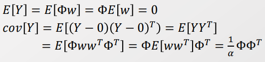
  > 
  > Q. $E[ww^T] = \frac{1}{\alpha}$ 인가? ㅇㅇㅇ 
  > 
  > w는 평균이 0이고,  분산이 $\frac{1}{\alpha}$ 인 정규분포에 속한다. 따라서 $E[ww^T]$ 은 w의 분산의 기댓값으로 $\frac{1}{\alpha}$ 을 가진다. 
  
  - 이때 공분산 행렬은 Gram matrix와 매우 유사하며, 두 내적의 형태로 표현되어 Kernel Trick을 사용할 조건이 맞춰졌다.
    
    >  Gram matrix : Vector 들의 집합($v_1, ..., v_n$) 들의 내적을 진행하는 것 
    > 
    > > 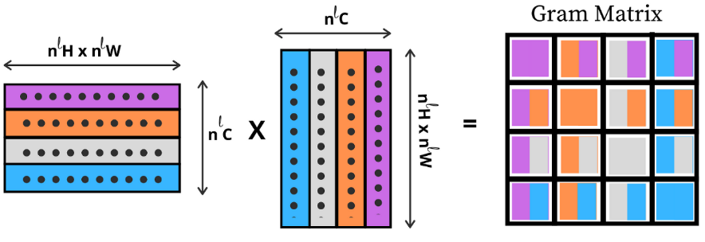
    
    > 이때 Gram matrix는 벡터들 간의 내적을 구하는 것으로 Kernel Function을 쉽게 적용할 수 있다. 
    > 
    > $K_{nm} = k(x_n, x_m) = \frac{1}{\alpha} \phi(x_n)^T \phi(x_m)$
    > 
    > Kernel Trick을 계산양은 늘리지 않으면서 High-dimension을 Mapping 하는 것과 동일한 효과를 만든다. 
    
    => 공분산은 Gram matrix로 벡터들간의 내적의 형태로 표현할 수 있다. <mark>즉, 분산은 Kernel function을 적용하여 Feature expansion의 효과를 낼 수 있다. </mark>

----

##### Kernel function

- Kernel은 두 벡터의 내적의 형태를 띌 때 사용할 수 있다. 
  
  > $K(x_i, x_j) = \psi(x_i) \psi(x_j)$
  
  - Kernel은 다양한 형태를 가지고 있다. 
    
    > 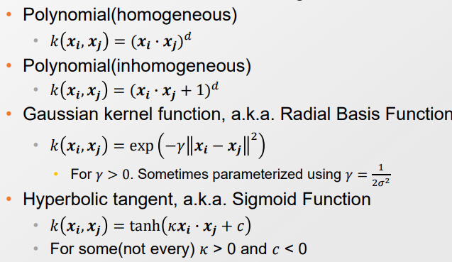

 

- **Kernel은 높은 계산 효율로 XOR 문제를 해소할 수 있지만 현재 잘 사용하지 않는다.**
  
  - 그 이유는 적은 수의 파라미터로 Feature expansion 하기 때문에 Complex 하지 않기 때문이다. 또한 파라미터는 학습가능하지 않고 경험적으로 찾아야 한다.
  
  > 주로 가용하는 Gaussian Kernel 의 경우 parameter은 $\gamma$ 하나다. 
  
  - 반면 NN은 Complex 하며 Learnable 하다. 

- 그럼에도 고차원으로 추가 계산없이 활용할 수 있다는 점은 여전히 유용하다. 

------

###### 조건부 확률을 통해 $P(t_{n+1}, T_N)$ 에 대한 식 구하기

- 관측값($t_n$)과 예측값($y_n)$, 그리고 오차($(e_n)$를 식으로 표현해보자 
  
  > $t_n = y_n(=w \phi(x)) + e_n $
  
  > Let $e_n \sim N(e_n | 0, \beta_{-1})$ 
  > 
  > Then $P(t_n|y_n) = N(t_n|y_n, \beta^{-1})$
  > 
  > $P(T|Y) = N(T|Y, \beta^{-1}I_N)$
  > 
  > > $T = (t_1, ..., t_N)^T, Y = (y_1, ..., y_N)^T$
  > 
  > - 단, Y 내부에서 off-diagonal이 0이 되어 $I_N$ 을 보장하지 않을 수 있음. 
  
  > 베이지안 조건부 확률을 활용하여 관측값에 대한 확률 값 (P(T)) 을 구한다. 
  > 
  > $P(T) = \int P(T|Y) P(Y)dY = \int N(T|Y, \beta^{-1}I_N)N(Y|0,K)dY$
  > 
  > > $P(Y) = N(Y|0,K)$ 에서 K는 분산을 표현하는 임의의 Matrix 이다. 
  > 
  > - 두 Normal distribution의 Convolution으로 표현할 수 있다. 

  

- **두 Normal 분포의 Convolution을 하나의 Normal 분포로 표현할 수 있을 듯!**
  
  > 
  
  > Gaussian 분포(-$N(x|\mu, \sum)$) 식에 맞춰서 위의 식을 ZRZ의 형태로 만들자. 
  > 
  > 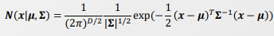
  > 
  > 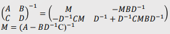
  > 
  > 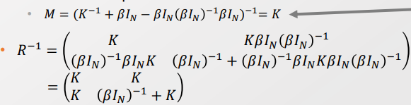
  > 
  > A,B,C,D에 들어갈 값을 잘 조율하여 K와 같은 형태로 모일 수 있도록 조작하기 
  > 
  > $R^{-1}$ : Precision Matrix 
  > 
  > => 잘 정리하면 위의 복잡한 식이 깔끔하게 정리될 수 있다. 
  
  > $P(Z) = N(Z|0, R^{-1})$
  > 
  > 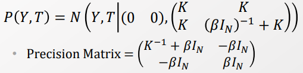

 

- 위를 활용하여 서로 Multivariate normal distribution의 조건부 확률을 계산하자. 
  
  - 서로 다른 Multivariate Normal distribution 은 서로 관측이 안 되었다면 독립이다.
  
  - 하지만 관측이 되었다면 관계성(Cov != 0 ) 가 생겨버린다. 따라서 $P(X_1|X_2) != P(X_1, X_2)$ 이므로 조건부 확률을 통해서 계산해야 한다. 
  
  > 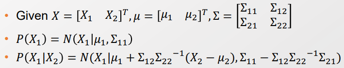

- 따라서 $P(T_{N+1}$) 을 또한 계산할 수 있으며, 결국 목표인 $P(t_{N+1}, T_N)$ 을 구할 수 있다. 
  
  > 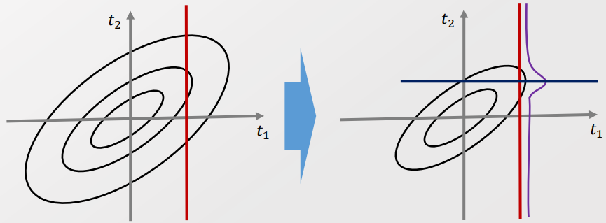
  > 
  > 빨간선이 $t_1$ 의 관측 값임. 이로 인해서 $P(t_2|t_1)$ 은 빨간 선에 의해 잘린 단면 분포를 가지게 되면서 평균 값이 0에서 벗어나게 된다. 
  > 
  > 파란색 선 부분이 $mean(t_2|t_1)$ 임
  
  => Covariance 구조를 이용한 Regression이 가능해진다. 

 

- $P(T) = N(T|0, (\beta I_N)^{-1} + K)$ 식에서 Gram matrix K은 우리가 원하는 형태로 구성할 수 있다. 
  
  > $K_{nm} = \frac{1}{\alpha} \phi(x_n) \phi(x_m)$
  > 
  > 이때 $K_{nm} = \theta_0 exp(-\frac{\theta_1}{2} ||x_n-x_m||^2) + \theta_2 + \theta_3x_n^Tx_m$ 로 설정하면 각 $\theta$ 값에 따라서 특성을 구분해줄 수 있다. 
  > 
  > 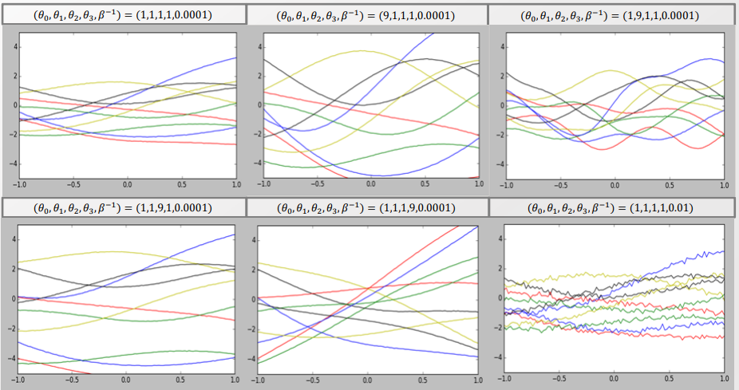
  > 
  > $\theta_0$ : 변동 폭의 증가 
  > 
  > $\theta_1$ : 변동 주기 감소
  > 
  > $\theta_2$ : 편차 차이의 증가 
  > 
  > $\theta_3$ : $x_n, x_m$ 의 Alignment 증가. 속도 변화폭 향ㅅ아 
  > 
  > $\beta I_N$ : Variance term으로, $\beta$ 가 커지면 노이즈가 커진다.  
  > 
  > => 데이터의 특성을 고려하여 $\theta, \beta$ 의 값을 안다면 다음 확률을 계산할 수 있다. 

- $P(T_{N+1}) = N(T|0,cov)$ , $P(t_{N+1}|T_N) =  N(k^Tcov_N^{-1}T_N, c- k^Tcov_N^{-1}k)$
  
  > 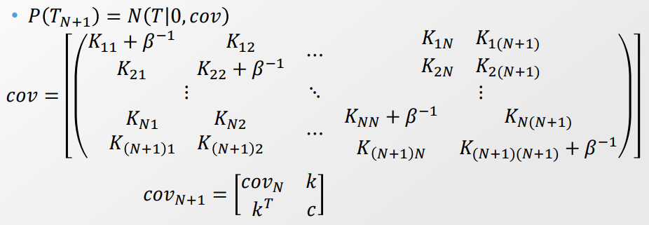
  > 
  > k = $K_{(N+1)1} , ...., K_{(N+1)N}$. 
  > 
  > k는 이전 Step이 새로운 n+1 단계에 얼마나 영향을 미치는 가를 의미. 
  
  > 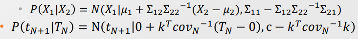
  > 
  > $\mu_{t_{N+1}} = k^Tcov_N^{-1}T_N, \sigma^2_{t_{N+1}} = c-k^Tcov_N^{-1}k$
  
  => Modeling 끝! 이제 Calculation 할 수 있다. 

 

정리하면, 

- 우리가 구하고자 하는 값 $P(t_{N+1}|t_N)$ 은 Multivariate normal 분포의 조건부 분포를 계산함으로서 구할 수 있다. 

- 이처럼 시간이나 공간으로 Indexing 된 Random Variable의 집합을 Gaussian Process라고 한다.

- Gaussian Process의 형태는 Kernel의 파라미터 $\theta_0, \theta_1, \theta_2, \theta_3$ ,$\beta$ 값을 통해 정해진다. 
  
  - 따라서 주어진 데이터를 통해서 위의 5개의 Parameter을 학습시킨다. 
  
  - 이때 Gradient descent 방식을 통해서 학습시키겠다. 

 

- 파라미터 학습을 위해 Gradient을 적용해준다. 
  
  > 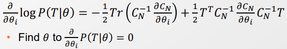

-----

###### Random process의 특징 (ex- Gaussian Process)

- Random Process는 확률 모델이 확장된 것으로, 기존의 확률 모델이 가지고 있던 Sampling 능력과 Density 측정 방식을 제공한다. 
  
  - Density 는 Variational inference를 가능하게 만든다. VA, KL-divergence 등등 GAN까지.
  
  - Sampling은 Gibs Sampling, Monte Carlo, Gibs sampling, MCMC 쪽까지 내려온 것 

- 여기에 더해 Random Process는 인덱스 파라미터(t)를 추가한다. 
  
  > Distribution : P(w)
  > 
  > Random Process : X(t,w) 
  
  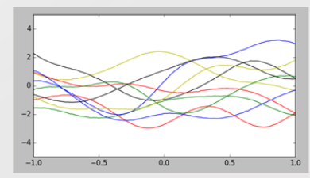
  
  - 특정 시기로 고정된다면(fixed t), Random process는 확률분포가 된다. 
  
  - 특정 경우로 고정된다면(fixed w), Random process 는 deterministic function이 된다. 
    
    > Random process의 Randomness는 w에 의존하고 있었다. 따라서 w가 결정되고 나서는 Deterministic 하게 된다. 
    > 
    > w를 고정되는 것은 Sampling 된 것과 같다. Sampling 된 이후는 Deterministic 하다. 

- 각 Fixed t에 대해서 나오는 확률 분포의 이름을 따 ~~ Process라고 부른다. 
  
  > ex)- Gaussian Process 

  

- Process를 알면 Regression, Classifier Cluster 모두다 가능하다. 
  
  - Cluster는 Latent variable을 EM으로 학습하고, 이를 활용하면 된다. 
  
  - 하지만 GP의 Latent variable 생성은 너무 맥락이 길어서 여기선 생략 

-----

#### Gaussian Process Classifier

- Classification을 두 가지로 나눌 수 있다. 
  
  - Discriminate Model 
    
    > 목표값인 $P(Y|X)$ 을 직접적으로 구한다. 
    > 
    > Y 에 대한 레이블 정보가 있어야 하기 때문에 SL 의 범주에 속하며, X의 레이블을 잘 구분하는 <u>결정 경계를 학습하는 것이 1차 목표</u>임. 
    > 
    > 따라서 Generative model에 비해 가정이 단순하고 성능이 높음 
    > 
    > Ex)- 선형회귀, 로지스틱 회귀 
  
  - Generative Model 
    
    > $P(Y|X) \propto P(X|Y)P(Y)$ & normalize. 
    > 
    > 데이터 X가 생성되는 과정을 P(Y), P(X|Y)로 정의하여, 간접적으로 P(Y|X)을 도출함. 각각 <u>P(Y), P(X|Y)를 학습하는 것</u>이 목적 
    > 
    > 레이블 정보가 있어도 되고, 없어도 모델을 구축할 수 있음. 또한 데이터 분포를 통해 Sampling이 가능함. 
    > 
    > 단, 가정이 많고 유추해야 할 것이 많아. Discriminate Model에 비해 Classify 성능이 떨어짐 
    > 
    > Ex)- Gausian Mixture, Topic modeling 
    
    **=> Classify 성능만 비교할 때는 Discriminate Model이 좋을 수 밖에 없음.**

 

- **Discriminate model 관점에서 1차 목적은 결정 경계를 학습하는 것이다.**
  
  - Function Approximator인 NN은 XOR 문제를 해결하기 위해 선형 회귀에 Sigmoid를 적용하고 있었다. 
    
    - NN은 Function Approximator 일 뿐이다. 즉,  NN이 어떤 모델을 모델링 하냐에 따라서 Discriminative/Generative Model 둘 다 될 수 있다.
    
    > 각 Layer : $\sigma(ax +b)$. 각 a와 b는 Gradient를 통해 학습 
  
  - 또한 Classify는 0과 1사이로 Bound 되어 확률 형태로 표현된 Regression 인 점을 고려하자. 
  
  - 즉, 기존의 Classification이 sigmoid function에 선형 회귀 값을 넣은 형태이다. 따라서 <mark>선형 회귀 부분을 Gaussian regression으로 대체할 수 있다. </mark>
    
    > Gaussian process : $f(x, \theta)$ -> GP classifier : $y= \sigma(f(x;\theta))$
  
  => 기존의 선형 층을 다수 쌓아야 가능했던 Funtion Approximator을 단층의 GP은 Stacking 없이도 전부 표현할 수 있게 되었다.

-----

##### Kernel 방식의 장단점과 NN와의 연계

- Kernel과 DNN은 둘다 XOR 문제를 풀 수 있다. 반면 가지는 특성은 서로 달랐다. 

- Kernel은 적은 계산량, 소수의 파라미터 학습으로도 Feature expansion의 역할을 수행한다. 

- 하지만 Data의 많아질 수록, 소수의 파라미터로 모든 데이터를 설명할 수는 없다. 
  
  - 위의 Kernel 에서도 $k = K_{(N+1)1} , ...., K_{(N+1)N}$ 는 데이터가 늘어남에 따라 계속 증가한다. 
  
  - <mark>즉, Kernel은 데이터의 Complexity를 일정이상 반영하기 어렵다. </mark>
    
    => 반면 DNN은 파라미터의 개수가 많아 계산양은 많은 대신, 데이터의 Complexity를 반영해줄 수 있다.

 

- 즉, 데이터의 Complexity 반영 부분에 있어 DNN의 도입은 필요했고, DNN에 적용하기 위해서는 Gradient 방식 즉, 미분이 가능해야 했다. 
  
  - 다만, SVM, Simplex 방법들은 바로 Optimal solution을 찾을 때 Quadratic program을 적용하여 Gradient 방식을 적용할 여지가 없었고, 결국 NN에서 활용할 수 없었다. 
  
  - 그럼 Kernel은 NN에 들어올 수 있었을까? O 
  
  <mark>=> 앞서 보였듯 Bayesian Network 적용을 통해서 Kernel은 NN에 들어올 수 있었다.</mark> 

 

- GP와 NN은 Gradient Optimization이 가능해서 같이 적용할 수 있다.
  
  - NN은 항상 적정 Depth에 대한 고민이 있었으나, 마지막 층에 GP을 적용해줌으로써 지금껏 고려하지 못한 Feature들을 포괄할 수 있다.
  
  - Kernel은 반면 고려할 수 있는 경우가 너무 적었다. 따라서 NN에서 Kernel을 중첩시키는 방향, DEEP Kernel 방향으로 접근한다.

-----

##### Bayesian Optimization with Gaussian Process

- Bayesian에서는 어떻게 GP를 최적화해야 할까 

- 왜 Bayesian이라고 하는가? => 주어진 데이터에 맞춰 모델을 update 해가기 때문 

> 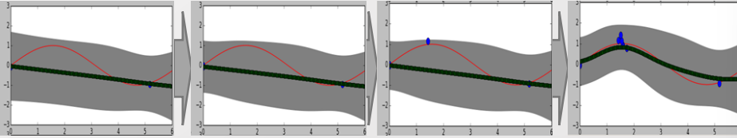
> 
> 상황 : 여러 관측치가 주어져 있지 않고, 하나씩 알아가는 중 
> 
> 직선 : 예상 범위의 평균
> 
> 빨간 선 : 실제 분포 
> 
> 경계 범위 : $\beta$ 값에 따라 정해짐. 0으로 정할 경우 데이터 개별마다 엄청 맞춰버림. 

- Acquisition Method를 통해서 Sampling의 우선순위를 구체화한다. 
  
  - Ex- 1). 가장 높은 값을 관측해본다. 
    
    > 왼쪽 그림에서 가장 왼쪽 그림에서 파란 점이 찍혀있는데 그림 상 안보임 
  
  - Ex- 2). 랜덤하게 찍는다. 만약 경계값에 가깝게 나온다면 여러번 뽑는다. 

 

- Acquision Method의 기준인 MPI을 통해  탐험과 활용 사이에서의 균형을 잡는다. 
  
  > Maximum probability of improvement(MPI) 
  > 
  > - 현재의 최적화된 가치 $y_{max}$보다 (1+m) 만큼 Confidence를 주는 경우에 Sampling 해라. 
  > 
  > - 단, Sampling 하는 값이 맞는지 모름. 기준으로 Confidence 만을 고려함. 
  > 
  > 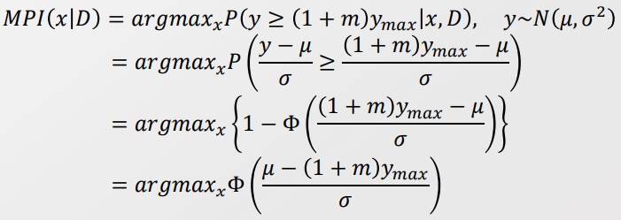
  > 
  > $\mu, \sigma$ 는 데이터 셋 D로 부터 찾은 것 
  > 
  > 즉, hyperparameter는 m(argin) 뿐이다. m을 조절하여 탐험과 활용 사이의 균형을 잡는다. 
  > 
  > 두번째 -> 3번째 줄은 t분포의 느낌. 

 

- 어떻게 적은 Sampling으로 m을 최적화할 것인가? 
  
  - 모르는 Latent variable이 있었을 때 Marginalize해서 구했다. 
  
  - Maximum expected improvement 을 통해서 구하자 
  
  > 
