### 9주차 - Dirichlet Process

#### Definition of dirichlet process

- Dirichlet 분포란 k개의 multivariate Gaussian 분포로 구성된 분포를 의미한다. 
  
  > 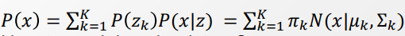
  > 
  > $z_k \in \{0, 1\}, \sum_k z_k =1, P(z_k=1) = \pi_k, \sum^K_{k=1} \pi_k= 1, (0 <= \pi <= 1)$
  > 
  > - $z_k$ 가 의미하는 바는 무엇일까? k번째 Multinomial distribution에 속하는 경우? 
  > 
  > $P(Z) = \prod^K_{k=1} \pi_k^{z_k}$
  
  > 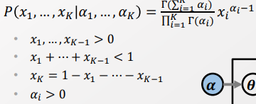
  > 
  > - Dirichlet 특성 - Probabilistic k-simplex에 따라, $x_i$ 는 확률의 정의를 따른다. 
  >   
  >   > $\sum_k x_k =1, \forall x_k >=0$
  >   > 
  >   > Q. 왜 위의 교재에서는 0보다 크다고 설정했을까? 오타인가? 아니면 모르는 조건이 더 있는 건가? 
  > 
  > Dirichlet 분포를 풀어내면 $\gamma$ 분포로 표현할 수 있다. 
  > 
  > 이로써 $\alpha_i$ 의 값에 따라서 분포의 형태가 정해진다. 
  
  > 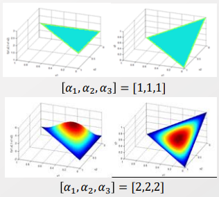
  > 
  > 각 $\alpha_i$ 들의 값이 균일할 때에는 어디에 쏠리는 곳이 없이 고르게 분포한다. 
  > 
  > $\alpha_i$ 값이 1일 때는 평평하고, 1 보다 크면 위로 굴곡이 일어난다.
  > 
  > 값이 클수록 Skewness가 증가한다.  
  > 
  > 그렇다면 $\alpha_i$ 값이 1보다 작을 때에는 아래로 들어갈 것이라 상상할 수 있다. 

 

- Dirichlet 분포와 Multinomial distribution은 Conjugate 관계이다. 
  
  - Multinomial distribution 
    
    > 
    > 
    > N : $\sum_i c_i$. Independently and identically distributed instances 
    > 
    > $c_i $ : Number of occurences of the i-th choice 
    
    > Q. $\theta$ 는 무엇을 의미할까? multinomial의 parameter을 의미하는 것 같은데. 어떻게 위와 같이 Multinomial을 정의할 수 있을까? 
  
  - Dirichlet 분포 
    
    > 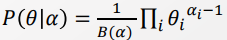
    > 
    > $B(\alpha)$ : 베타 분포 값을 말하는 듯. Normailize 용 
    
    => 둘의 수식이 매우 유사함을 알아챌 수 있다. [Conjugate 관계]

 

- Bayesian posterior [conjugate 관계 묶기]
  
  > 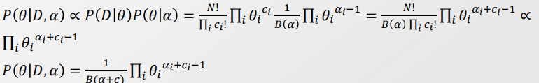
  > 
  > Bayesian posterior에서 Multinomial은 Likelihood, Dirichlet 분포는 Prior의 형태를 띈다. 
  > 
  > - Dirichlet 분포는 Multinomial의 Parameter을 정하니까. 즉, 분포들의 형상에 대해 정보를 줌. 
  > 
  > Likelihood인 Multinomial은 아무리 노력해도 다수의 특이점(?)을 만들어 주기가 어렵다. 
  > 
  > 그렇다면 k다수의 특이점(?)을 만들기 위해서는 Prior인 Dirichlet 분포에서 표현해줘야 한다. 
  
  - 또 다른 conjugate 관계인 Binomial 분포와 Beta 분포를 묶을 수 있다. 

 

- 지금껏 Dirichlet 분포를 최적화함에 있어서  "k"를 설정해주기가 참 어려웠다. 
  
  - Dirichlet 분포에서 k란 몇개의 multinomial distribution으로 구성되는지를 정하는 요소다. 

- => <u>혹시 Dirichlet 분포를 Process로 만들어 K를 무한대로 보내버리면($\pi_k$의 차원을 무한대로) 한다면 더 이상 Selection을 안해도 되지 않을까?</u> 
  
  - 우리에게 필요한 것은 $\pi_k$ 값이다. $\pi_k$ 는 각 분포가 전체에서 얼마나 큰 비중을 차지하는 가를 의미하며, 이걸 통해서 값들을 어떻게 Cluster 할 것인지 파악할 수 있다.  
    
    > 비중이 높은 Multinomial의 평균, 분산 값을 기반으로 각 Cluster의 기준을 잡을 수 있다. 또한 Multinomial의 형태를 띄기 때문에 임의의 점 x에 대해 Cluster와의 평균과의 거리를 측정함으로써 Cluster에 속할 확률값을 계산할 수 있다. 
  
  - 즉, $\pi_k$ 의 차원을 무한대로 만들어 준 후, 그 중에서 분포상 높은 비중을 가질 때(<-> $\alpha_k$ 의 값이 높아 Skewness 확보)의 경우를 추출한다면 최적의 K개의 Cluster을 선정할 수 있다.  
  
  - 그럼 Dirichlet 분포 상 다수의 분포값을 높게 형성하려면 $\alpha_k$ 값들을 어떻게 형성해줘야 할까? 바로 $\alpha_k$의 값을 1보다 작게 만들면 분포의 형상은 아래로 내려간다. 
    
    => 즉,  k를 무한대로 보내줬을 때 유의미한 확률 값(특이점)을 가지는 k' 개의 꼭지점을 상상해볼 수 있다. 

 

###### Drichlet Process 정의하기

- Process의 구조 
  
  - Input : w(경우의 수), Index paramter T 
  
  - 둘 중 하나씩 고정이 되면 그에 따른 결과값을 줘야함
    
    -  T가 고정이 되면, w에 대한 Random distribution을 줘야한다.
    
    - w가 고정이 되면, Sampled 된 discriminative function을 줘야한다.

- Drichlet Process :  $G|\alpha, H ~\sim DP(\alpha, H),$
  
  > $G|\alpha$ : $\alpha$ 값으로 Partition 된 G 영역에 대해서 
  > 
  > $H \sim DP(\alpha, H)$ : 기본 Base distributino H에 대해 $\alpha$로 Scale 된 dirichlet 분포를 적용한다. 
  > 
  > - Scaling parameter인 $\alpha$ indexed parameter로서 고려해준다. 
  > 
  > > $\alpha$ 의 차원은 무한대로 갈 수 있다. 
  
  > 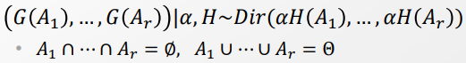
  > 
  > $A_i$ : Partition된 영역들.  w와 같은 역할을 한다.
  > 
  > H : Base distribution.  
  > 
  > - $H(A_i) $: Partition $A_i$에 대한 확률값 반환. 
  > 
  > $\alpha$ : T의 역할. $\alpha$ 가 고정이 되면 각 Multinomial distribution이 $\alpha$ 값에 의해 Scaling 된 Dirichlet distribution H을 반환한다.  
  > 
  > $\alpha$ 값에 따라 어떻게 Scailing 할지 정해진다
  > 
  > > 만약 특정 경우 k에 대해서만 뽑고 싶다면 관련된 $\alpha_k$ 값을 크게 준다. 
  > > 
  > > 그럼 k에 가까운 값들의 확률 분포가 높아져 관련된 값만 Sampling 될 것이다.
  > > 
  > > 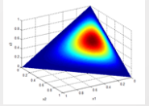  
  > 
  > > 반대로 다양하게 Sampling 하고 싶다면 $\alpha$ 의 값을 1 또는 그 보다 작게 부여한다. 

 

- 아래 특성을 띈다. 외우지 않아도 된다. 이해만 하자. 
  
  > 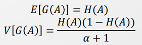
  > 
  > H : Base distribution 
  > 
  > $\alpha$ : Concetration parameter
  
  > Dirichlet process의 기댓값과 분산을 구하는 방법

 

- Dirichlet Process을 Posterior distribution에 적용해보자. 
  
  > 
  > 
  > $\theta$ : Observed Data
  > 
  > $n_i$ : i 번째 w에 속하는 횟수. 
  > 
  > $\delta_{\theta_i}$ : $\theta_i$ 로 인한 영향 
  > 
  > $\alpha +n$ : 데이터가 추가됨에 따라 Concentration이 강화됨. 
  > 
  > => 데이터 $\theta_i$가 추가됨에 따라 기존의 Base distribution은 discount를 하고, 데이터의 영향을 반영함. 
  
  => <mark>Bayesian Posterior 과정은 새로운 Data가 주어졌을 떄 DP를 학습하는 방법이 된다.</mark> 
  
  - 사실상 여기서 끝. 

- 이때 $\alpha$의 값은 Dirichlet distribution과 Independent 하다. 따로 주어지지 않았다면 0으로 고려하면 된다. 

---------

##### Drichlet process 적용하기 - with scheme

- 앞의 과정을 통해서 우리는 Drichlet process를 모델링 했다. 하지만 이를 적용하기 위해선 Drichlet distribution으로 바꿀 필요가 있다. 
  
  - 특정 Time index 에서 어떻게 Distribution을 만들어 낼 수 있을까? 
  
  - 그리고 각 Distribution으로부터 어떻게 Sampling 할 수 있을까? 

=> 이를 구해내기 위해 주로 사용하는 Scheme가 있다.

- Schme는 크게 2가지로 나뉜다. 
  
  - 앞서 Distribution은 Sampling based와 Density Based 방식으로 나눠져왔다. 
  
  - 1).Density Based 방식인 Stick-breaking construction과 
  
  - 2).Sampling based 방식인 Polya Urn scheme / Chinese restaurant process 로 나뉜다. 
    
    > 자매품 : Indian buffet process 
  
  => 즉, Distribution에 대한 수식은 바로 못 얻어도, Density 또는 Sampling 방식 중 하나라도 접근가능하면 distribution을 쓸 수 있는 것과 같아진다. 

 

###### Stick-breaking Construction - Density Based

- 무한번의 선택을 통해서 probability mass 함수를 만든다고 가정하자. 
  
  > 과정은 분필을 계속해서 부러트리는 것과 유사하다. 
  > 
  > $\beta ~\sim GEM(\alpha)$ : DP의 Realised Version 
  > 
  > 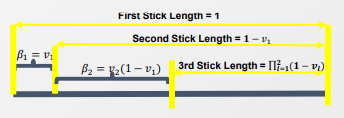
  > 
  > $k = 1, 2, ..., \infin$
  > 
  > $v_k|\alpha \sim Beta(1, \alpha) \in [0,1]$
  > 
  > > $v_i$ : i번째 잘라낸 분필의 크기 
  > > 
  > > 한번씩 더 시행을 할 때마다 차원을 1개씩 추가하는 것과 같다. 
  > 
  > > $Beta(\alpha, \beta)$ : $\alpha, \beta$ 값에 따라 형태가 달라진다. 
  > > 
  > > 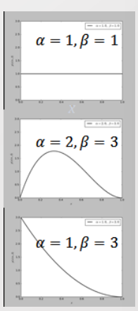
  > > 
  > > $\beta$ 값을 크게 만들수록 값이 0에 위치할 확률이 커진다. 
  > > 
  > > 즉, $\beta$ 값이 클수록 분필을 조금씩 자르는 것이며, 작을 수록 크게 자르는 것이다. 분필을 얼마나 잘라낼 것인지를 조절한다. 
  > > 
  > > => $\alpha$는 잘라내어지는 정도(scale)을 정한다. 
  
  > $\beta_k = v_k \prod_{l=1}^{k-1}(1-v_l)$   
  > 
  > $\beta \sim GEM(\alpha)$
  > 
  > <=> $G|\alpha, H \sim~ DP(\alpha, H)$ 의 형태를 띈다. 
  > 
  > > G : $\sum^{\infin}_{k=1} \beta_k\delta_{\theta_k}$
  > > 
  > > $\theta_k|H \sim H$ 

 

- $\beta \sim GEM(\alpha)$ 에서 $\alpha$ 값을 조정함에 따라 분포가 나타난다.
  
  > 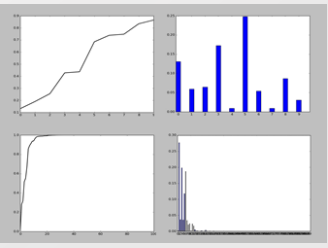
  > 
  > 좌측 : CDF form <-> 우측 : pdf form 
  > 
  > 상단 : $\alpha$ 값을 크게 주어(- beta 분포(1, $\alpha$)) 각 CDF가 고르게 돌라감. 
  > 
  > 하단 : $\alpha$ 값을 작게 주어 CDF가 급격히 올라감.  
  
  => Dirichlet Process를 통해 Infinite dimention에 대한 dirichlet distribution을 만들 수 있음을 보였다. 또한 특정 타임 인덱스에서는 특정 dirichlet distribution을 보여줌. 
  
  - 분필 한번($v_i$) 는 각각 dirichlet distribution을 가진다.    

- Density 측정을 통해 Explicit Distribution을 얻었다. 이젠 지금까지의 Explicit distribution 기반의 방법론에 적용할 수 있다. 
  
  - ELBO Optimization 
  
  - Variational inference를 하기 위해 stig(?) 을 해야 한다. 

 

###### Polya Urn Scheme & Chines restuarant - Sampling Based

- Polya Urn Scheme 설명 
  
  > 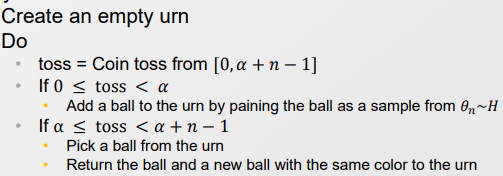
  > 
  > 빈 항아리(Urn) 과 버튼을 누르면 Base distribution에 따른 Sampling 결과를 주는 기계가 있다고 하자. Sampling 한 결과는 빈 항아리에 넣는다. 
  > 
  > $\alpha$ 는 얼마나 기계를 신뢰할 것인지를 의미한다. 
  > 
  > 처음에는 기계를 신뢰하여 $\frac{\alpha}{\alpha+n-1}$ 비율로 기계를 사용하여 Sampling 받지만, 가끔식은 $\frac{n-1}{\alpha+n-1}$ 비율로 항아리에서 부터 뽑는다. 
  > 
  > 항아리에서 뽑았을 경우 동일한 종류의 공을 항아리에 1개 더 넣는다. 

 

- Chiness restaurant process 
  
  > 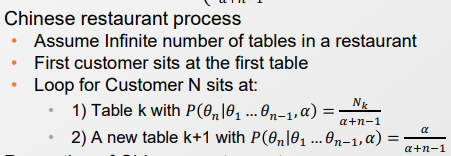
  > 
  > Urn과 유사 

 

- Dirichlet Process가 구성되는 과정을 Approximation 해보자 
  
  > 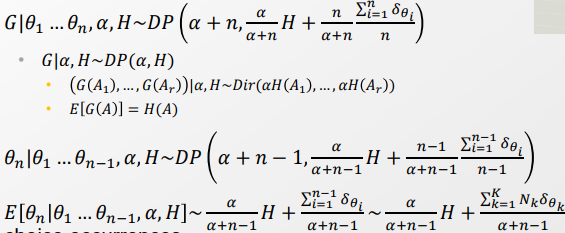
  > 
  > $\theta_i$ : Observed Data 
  > 
  > 처음에는 $\alpha$ 값이 클수록 기존의 H 분포에 따라 Sampling 한다. 
  > 
  > 하지만 추가되는 Data가 늘어남에 따라 Data로 인해 Sampling 되는 값에 맞춰 분포를 수정한다. 
  
  > $\theta_1, ..., \theta_{i-1}$ 까지의 데이터셋을 기반으로 다음 Sampling 결과인 $\theta_n$을 추측해본다.  
  > 
  > - MCMC 방식의 Sampling 후 결과 확인. 
  > 
  > 즉, 이때 기존의 Distribution H와 이후 나온 데이터셋을 고려한 분포로 $\theta_n$ 의 종류를 추측한다.  
  
  > Index t 역할을 하는 $\alpha$ 값을 고정하면 Dirichlet distribution이 나온다. 
  > 
  > input w의 역할을 하는 $A_i$ 을 넣으면 <u>deterministic placement over cluster이 나온다. </u>

=> DP 에 대한 모델을 구성할 필요없이 DP로부터 관측 값을 Sampling 할 수 있다. 

Q. Sampling이 수학적으로 뭘 의미하는 걸까? 예제에서 수식으로 전환이 와닿지가 않네

 

- Sampling Based 방법의 문제 : Rich-get-richer 
  
  - 초기 상태에 따라 뒤의 상황에 계속 영향을 준다. 왜곡이 바랭한다. 
  
  => 마치 초기 상태가 없었던 것처럼 다시 고려하면 된다. Ex)- De finetti's Theorem, gibbs sampling

-----------

#### Dirichlet Process mixture model

- 지금까지는 Prior 모델, 즉, $\alpha$ 을 학습하는 데 초점을 잡았다. 

- k개 차원에 대해서 Base distribution의 비중을 다뤘고, Process를 통해 k를 무한대로 확장했다. 
  
  - 이를 보면 <u>Non-parametric 방법은 파라미터가 없는 것이 아닌, 너무 많은 모델을 의미한다. </u>

- 지금까지는 어떤 Cluster에 속하는 지를 알려주는 $z_k$ 를 통해서 $\pi_k$을 학습했다.
  
  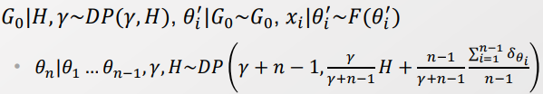
  
  > 위의 식은 n-1 번의 clustering 이후에, 새로운 cluster을 시작할 것인가 아닌가를 의미한다.
  > 
  > 즉, $z_k$ 는 어느 cluster에 속할지를 알려주는 Indicator 역할을 했다. 
  
  - 더 나아가 새로운 k번째 Cluster을 만든다고 할 때, 이때의 파라미터 $\theta_n$ 은 어떻게 만들 것인가? 
    
    - 이에 대해서 아직 다루지 않았다. 
    
    - 즉, 파라미터 $\theta_n$ 또한 만들어주는 것을 고려할 필요가 있다. 
    
    > 관측된 파라미터는 $\theta$로, 생성한 파라미터는 $\theta'$ 라고 하자. 
    > 
    > ex)- $\theta = \{\mu, \sigma\}$

 

##### Incicator View -> Alternative application 관계로의 전환

- indicator view란 Indicator $z_k$ 를 기반으로 $\alpha$를 학습하는 것(확인 필요 )
  
  - 이때 각각의 Cluster에 대한 $\theta$는 주어졌다고 가정. 

- 이제부턴 dirichlet prior $\alpha$ 가 주어진 상황에서, $\theta'$를 샘플링하자
  
  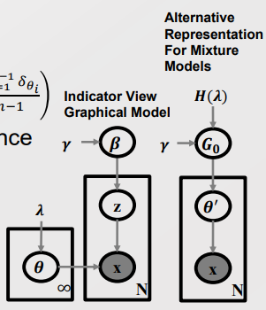
  
  > $\gamma$ : $\alpha$ 값에 대한 분포..? 
  
  - $\theta$는 $x_i$ 마다 주어져 있다. 즉, $x_i$ 마다 $\theta'$을 다시 만들어 낼 수 있다고 볼 수 있다.   
    
    > $x_i | \theta_i' \sim F(\theta_i)$
    > 
    > $F :$  파라미터 $\theta'$ 을 생성하는 분포
    > 
    > > ex)- Gaussian distribution.

 

- **파라미터가 generalization 될 필요가 있다.**
  
  - $\theta$ 는 $\{\mu, \sigma\}$ 로 볼 수 있는데, 1개의 샘플만 있다면 어떻게 공분산을 구할 것인가? 
  
  - 즉, 주어진 Sample Data에 대해서 각각의 파라미터를 계산하는 것이 아닌, 파라미터 자체도 생성(generate)할 필요가 있다.  
  
  - 이를 위해선 새로운 Cluster의 parameter을 Sampling하기 위해서 추가적인 분포($F$)를 필요로 한다.
    
    > ex)- $F(x_i|\theta_i') = N(x_i|\mu_{\theta_i'}, \sum_{\theta_i'})$

-----

##### Alternatives in Formulating Mixture Models - Dirichlet process Mixture model(DPMM)

> 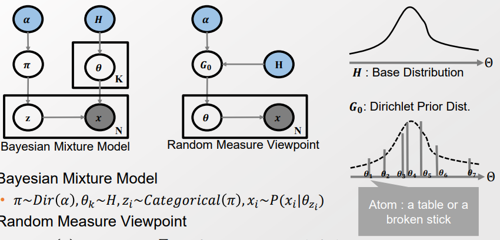
> 
> $\alpha$ : dirichlet 역할 수행. Atom을 어떻게 생성할 것인지를 관장함. 
> 
>  $\pi_k$ : 각 cluster 별 비중 
> 
> $z_k$ : 어느 Cluster에 속했는지 알려주는 indicator 
> 
> $H :$ Base distribution
> 
> > 여러 제한 조건을 다 풀면 Normal inverse wischart(?) 분포의 형태를 띄게 된다.
> 
> $G_0$ : Dirichlet prior distribution. H와 $\alpha$ 값을 받아 parameter을 생성함
> 
> > Partition 된 H에 의해서 Atom의 위치가 결정됨. Normal inverse wischart에 의해 $\mu$ 주변으로 많이 찍힘.  
> > 
> > $\alpha$는 각 Atom의 위치가 얼마나 가능성(likelihood)한지 결정한다. 즉, Atom에 영향을 준다. 분산과 비슷한 느낌. 높을 수록 흩어지는 게 적으나, 낮을수록 멀리 떨어진 값이 생길 수 있다.

 

- 이제부터 $\theta_i$ 는 각 i번째 Atom을 의미하는 Indicator 이자, 파라미터로 고려한다. 
  
  - 즉, Cluster만을 Sampling 하는 것이 아니라, Cluster의 Parameter까지 Sampling 한다. 

 

- DPMM 과정 - Chinese restuarant table 관점 
  
  > 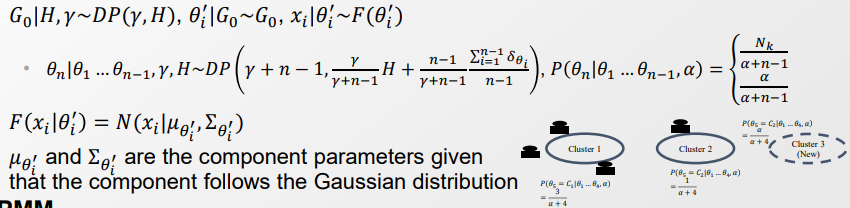
  
  - 1). 최초의 Table 을 할당한다. 
  
  - 2). Sampling을 시작한다. 또한 Dataset에서의 instance를 고려한다(?) 
  
  - 3). 최초에 할당했던 instance를 제거한다. [rich-start problem 방지]
  
  - 4). 어느 Cluster에 앉을지 계산한다. [Calculate Prior]
    
    > $\theta_n|\theta_1, ..., \theta_{n-1}, \gamma, H \sim DP$
  
  - 5). 각 Cluster 별 likelihood를 계산한다. [Calculate likelihood]
    
    > $N(x_i|\mu_{\theta_i'}, \sum_{\theta_i'})$
  
  - 6). Prior과 Likelihood를 통해 Posterior을 계산한다. 
    
    > F : normal inverse wischart(?)
  
  - 7). Posterior로부터 Cluster parameter을 샘플링한다. 
  
  - 8). 각 parameter을 학습한다. 

 

- 나와 비슷한 Embedding을 가진 값들을 동일한 Cluster에 속하도록 하는 것은 Likelihood에 의해 정해진다. 

- 비슷하진 않아도 Cluster의 크기가 커져 공통점이 생겨 기존의 cluster에  속하는 여부는 Prior $\alpha$ 값에 의해 결정됨

- 기존의 Cluster와 비슷하지도 않아 새로운 Cluster를 필요로 하는 정도는 $\gamma$의 값에 의해서 정해진다. 
  
  - $\gamma$의 값에 비례하여 Cluster의 개수가 정해진다. 
  
  - 단, K가 무한정 늘어날 수는 없다. 따라서 최후엔 Truncated 하여 유의미한 값들만 남겨준다. 
    
    > 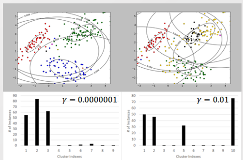
    > 
    > $\gamma$ 값이 클수록 유의미한 cluster의 개수가 늘어난다. 
    > 
    > 둘다 cluster에 속한 데이터의 개수가 적은 항목이 있다. 이런 cluster들은 Truncated 해준다. 

 

#### Difference between K-means

- K-means은 고질적인 한계가 있다. 
  
  - 표현력 관점에서는 크게 다르지 않을 수 있다. 
  
  - 구조적인 측면에서 K 를 어떻게 정할 것인가에 대해 설명해주지 못한다. 
    
    - 즉, Rigid 한 K에 대해서 Cluster을 맞춰나간다. 

- 반면 DPMM은 K에 대해서 Flexible 하다. 
  
  - K에 대해서 제한을 주지 않는다. 
  
  - 반대로 K에 대해서 선택할 수 있도록 한다. 

------

#### Hierarchical Dirichlet Process

- GMM과 LDA는 차이가 있다. 
  
  - 전자는 EM을 활용하고, 후자는 Variation inference를 했다. 
  
  - 그 차이는 Hierarchally compose 되어 있는가 이다. 

 

- 우리는 DPMM을 LDA와 같이 Hierarchical Structure에도 적용하고 싶으나, 제한이 있다. 
  
  - 2개의 Cluster에 대한 $\alpha$ 값이 서로 다르더라도 각각의 $\theta_i$에 대한 값은 공유해야 한다. 
  
  > 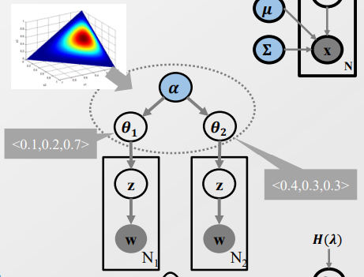
  
  - 최소한 ATOM, $\theta_i$ 의 값들은 공유해야 한다. 

 

##### Solution of Atom sharing

> 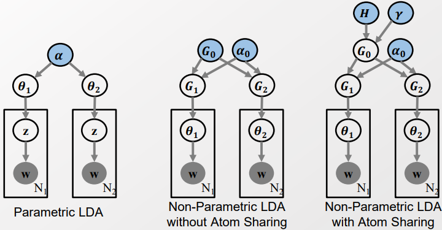
> 
> 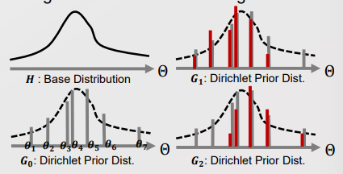
> 
> 각각의 $\theta_i$에 대한 비중을 다르게 나올 수 있지만, $\theta_i$의 값 자체는 공유하자. (<=> Atom의 위치는 공유하자)
> 
> > $G_0$ :sampling from $G_0 \sim DP(H,\gamma)$ 
> > 
> > $G_i$ : Sampling from $G_i|G_0 \sim DP(G_0, \alpha_0)$

- $\phi_k \sim H$ 을 새롭게 정의하여 공유한다. 
  
  > 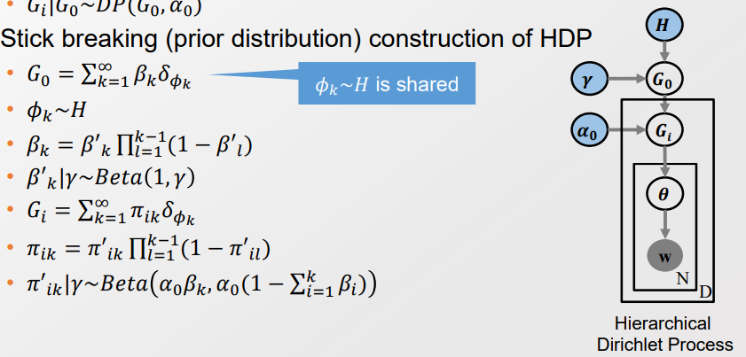
  
  - 이후 Full joint에서 Factorizing 함으로써 GIbbs sampling 형태로 표현가능. 여기선 생략
