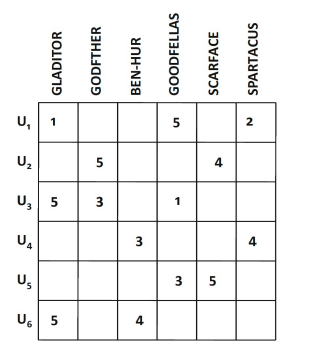
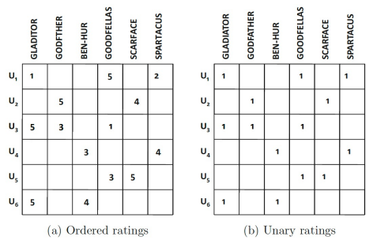
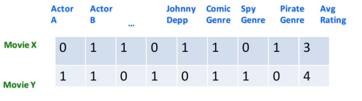

### 1주차 - Introduction to Reconmmender System

##### 추천 시스템은 왜 배워야 하는가?

- SNS를 통해서 무수히 많은 정보가 쏟아진다. 따라서 filtering을 거쳐서 한정된 시간 내에 유의미한 정보를 접할 수 있다. 

- **목적 : To model people's preferences, opinions and behaviors**
  
  1. To identify things that we might like 
  
  2. To help people discover new content
  
  3. To discover which things go together
  
  4. To personalize user experiences in response to user feedback 

- 영향력 
  
  - 높은 비중의 물품 구매가 물품 추천으로부터 유래한다. 
  
  - Lex Fridman - <u>"Recommendation system affect the information we see, how we learn, what we think, how we communicate"</u>

##### 추천 시스템의 문제 정의

1. 예측(Prediction) : 관측된 값을 기반으로 관측되지 않은 값을 예측하는 것 
   
   > 
   > 
   > 예측 문제를 **Matrix completion problem** 이라고도 부름  

2. 순위 매기기(Ranking) : 개별 유저에게 맞춰 Top k 개의 우선순위를 제공하는 것 
   
   - 순위 측정으로, 예측된 값의 상대적 순위만 중요하다. 

- **평가(Rating)의 종류**
  
  - Explicit feedback : 선호 유무 및 정도를 명시 
    
    > Interval-based / Continuous value -based / Like or dislike(Binary)
    
    - 장점 : 직접적으로 선호도를 표현했기 때문에 정확도가 높으며 많이 사용한다. 
    
    - 문제점 : 유저들이 각 item 별로 항상 평가하는 것은 아니다. 사용가능한 평가의 수가 너무 적을 수 있다. 이 경우 추천 퀄리티가 낮아진다. 
    
    - **초점 : 어떻게 유주들이 보다 item에 대해 평가를 하도록 자극할 것인가?**
  
  - Implicit feedback : 선호에 대한 간접적인 증거 
    
    > Unary(ex- past purchase,  Click) 
    
    - 장점 : 유저의 행동을 이끌어 내는데 노력을 들일 필요 없으며, 수집하기 쉽다.
    
    - 단점 : 유저의 선호 유무, 특히 불호(Dislike)를 구체화할 Mechanism이 없다. 
      
      - 각 <u>유저의 행동들이 긍정적일 것 이란 가정 하에 예측</u>하여, 정확도가 낮다.

- Ex)- 평가 종류 별 해석 
  
  
  
  > 동일한 경험을 한 유저들에 대해서 Explicit / Implicit rating 방식에 따라 평가함. 
  
  - 동일한 경험을 해도 다른 해석을 할 수 있다. 
    
    - U1 과 U3 의 경험을 분석할 때, 좌측은 선호도가 정 반대임을 알 수 있다. 
    
    - 하지만 우측은 동일한 선택지를 했기 때문에 선호도가 유사하다고 해석한다. 

- **평가 종류 별로 Missing value을 특정 값(ex-0)으로 대체했을 때의 결과가 다르다.**
  
  - <u>Implicit feedback 의 경우, '0' 값으로 대체할 것을 권장한다. </u>
    
    - 오히려 0으로 대체하지 않는다면 상당한 과적합이 일어날 수 있다. 
      
      > 선택된 경우만을 고려하기 때문에, 해당 상황에 과적합되어 있다. 
    
    - 또한 0으로 대체해도 실제 관측 값과 비교적 큰 차이를 만들지 않아 안정적이다. 
  
  - <u>Explicit feedback은 특정 값으로 대체할 것을 권장하지 않는다. </u>
    
    - 대체한 특정값이 실제 관측값과의 차이가 클 수 있어 큰 오차를 만들 수 있다.

##### 비지니스 관점에서의 추천 시스템의 목적

- 상품을 더 파는 것! 
  
  - How? : 어떤 물품을 추천했을 때 상품 판매를 촉진시킬 수 있는가에 대한 해답 찾기! 

- **4가지 목표치**
  
  1. Relevance : 유저에게 친숙한 Item 추천 
     
     - 가장 중요한 목표지만, 그 자체로 충분하지 않다. 
     
     - Relevance를 측정하는 두가지 지표 
     
     > RMSE(RecoMmender System Error) : $\sqrt\frac {\sum^N_{i=1} (Predicted_i - Actual_i)^2} {N} $
     > 
     > MAE(Mean Absolute Error) : $\frac{1} {N} \sum^N_{i=1} |Predicted_i - Actual_i|$
     > 
     > - 오차의 크기가 커질 수록 RMSE는 MAE비해 증가율이 크다.
  
  2. Novelty : 유저가 과거에 경험하지 못했던(보지 못했던) Item 추천 
     
     - Novelty 한 물품을 지속적으로 추천하면 상품 다양성의 감소를 초래할 수 있다. 
  
  3. Serendipity : (완전히) 새로운 Item을 추천하는 것 
     
     - 장점 : 장기적이고 전략적인 관점에서 이득이다. *(탐험 추구 느낌)*
     
     - 단점 : 관련없는 상품을 추천할 수 있다. 
       
       > ex)- 특정 분야를 좋아하는 유저에게, 해당 분야지만 아직 경험못한 것은 Novelty. 아예 새로운 분야를 추천하면 Serendipity. 
  
  4. Diversity : 다양한 타입의 물품을 추천하기 
     
     - 관련된 물품을 모두 싫어할 최악의 경우에 대비하여, 적어도 하나는 유저의 흥미를 끌 수 있도록 안정성을 보장

##### 추천 시스템의 기본 모델 종류

- **Collaborative filtering(CF) : Only rating**
  
  - Memory-based approach(Neighborhood-based CF) 
  
  - Model-based approach 

- **Side information-based Recommendation**
  
  - Content-based recommendation : Only Content
  
  - Content-based CF : Rating + Content

- **Advanced topics**
  
  - Sequential Recommendation & Graph-based Recommendation 

*이번 주는 Content-based Recommendation 만을 다룸* 

##### Content-based Recommendation

- 목표 : 유저가 좋아하는 것과 **유사한(Similar)** 아이템을 추천하기 
  
  - <u>Item의 내용(Content)에'만' 기반</u>하여 추천한다.  
  
  > ex)- 영화 추천 / 웹사이트 / 블로그 / 뉴스 

- **의의 : 사용자의 평가를 사용할 수 없을 때에도 사용할 수 있다.**

- **유사도 측정 방식** 
  
  - Content의 특징들을 벡터로 표현한다(Profile)
    
    > ex)- 영화 주요 특징 벡터화
    > 
    > 
  
  - 다수의 특징 중 **중요도를 산정**하여 중요 특징들을 선택한다. 
    
    - TF-IDF 등의 방법 등을 통해 중요도 산정한다. <u></u>
      
      - <u>TD-IDF는 많이 사용되지만(TF), 전반적으로 적게 쓸수록(IDF)</u> 해당 상황에서 **중요한 단어라고 판단**한다. 
      
      > TF(Term frequency) : $1 + log tf_{t,d}$
      > 
      > IDF(Inverse Document Frequency) : $log \frac{N}{df_t +1}$
      > 
      > > df : Num of doc. 작을수록 현 상황에 더 informative함을 의미 
      > 
      > <mark>TF-IDF = $(1+ logt f_{t,d}) (log \frac{N}{df_t +1})$</mark>
      > 
      > - 각 빈도가 만, 억대로 올라가는 경우도 있어 log로 정도를 완화시킴
      > 
      > - 각 값들에 +1 을 해주어 0이 되는 경우를 방지한다. 

- **장점** 
  
  - 다른 유저 정보를 필요로 하지 않다 > Cold-start, Sparsity 등 정보가 부족하지 않다.
    
    - 유일한(Unique) 취향을 가진 유저에게도 추천이 가능하다. 
    
    - 새롭고 유명하지 않은 상품 또한 추천할 수 있다. 
  
  - 추천의 이유를 밝힐 수 있다. 

- **단점**
  
  - Content가 유의미한 특징들로 encoding 될 필요가 있다. > 일부 영역에선 제한됨
  
  - Serendipity를 구현하기가 어렵다. 
  
  - 참고하는 정보가 적어 과적합하기 쉽다. 
  
  - 새로운 Item은 잘 추천하지만, 유저 정보는 없어 새로운 유저에겐 효과적이지 않다. 
  
  - <mark>=> 실제 환경에선 순수한 Content-based 추천 방식은 사용되지 않는다. </mark>
    
    - <u>많은 Metadata 보다 소수의 Rating이 성능이 좋다는게 경험적으로 증명</u>되었다. 

