#### 2주차 - Neighborhood-Based Collaborative filtering

#### 이웃 기반의 Collaborative Filtering

- 추천을 생성하는 데 있어 가장 유용한 방법
  
  - 다양한 영역에 적용되고 있으며, 수많은 알고리즘과 변형이 존재한다. 

- **방향성 : "Wisdom of the crowd"를 기반으로 Item을 추천한다.**

- **기본 전제**
  
  1. 유저들은 Item에 대해 (Implicitly / Explicitly) 평가를 해야한다. 
  
  2. 과거에 유사한 성향을 가진 고객은 미래에도 동일한 취향을 가질 것이다.

- **방식**
  
  - '유사한' 유저들은 유사한 평가 패턴을 보일 것이다. 
  
  - '유사한' Item은 유사한 평가를 받을 것이다. 
  
  - <mark>→ "유사한(Similarity)" 에 대한 정의를 필요로 한다. </mark>
    
    > '유사한 유저' 의 정도는 얼마나 비슷한 Item을 구매했는가로 측정!
    > 
    > '유사한 Item'의 정도는 얼마나 비슷한 유저들이 구매했는가로 측정!

- **Collaborative Filtering의 형태**
  
  - **Input : User-item의 평가 Matrix만 있으면 됨!** 
    
    > 나중에 어떻게 User-item을 연결시키는 가 까지 논의할 예정 
  
  - Output 
    
    1. **Prediction** : how many like/dislike about a certain item  <mark>[Explicit feedback]</mark>
    
    2. **Ranking** : top-k list of recommendation items                   <mark>[Implicit feedback]</mark>

****

- **유저 기반 Collaborative filtering**
  
  - **목적 : 미경험 Item에 대한 Active User의 선호도를 예측 및 최고 선호도 Item 추천**
  
  - **방식** 
    
    - Active user와 유사한 Item을 좋아하며, 미경험 Item i를 평가한 유저군 탐색
    
    - 해당 유저군의 Item i에 대한 평가들의 대표값(ex- 평균)을 구한다. 
    
    - 가장 높은 예측 선호도를 가진 Item을 Active user에게 추천한다. 
  
  - **기본 전제와 아이디어**
    
    - 과거에 유사한 취향을 가진 사람은 미래에도 유사한 취향을 가질 것이다.
    
    - 유저 선호도는 시간에 대해 안정적이며 일관된다.
  
  - **고려할 점** 
    
    1. 어떻게 유사도(Similarity)를 측정할 것인가? > 아래 참고 
    
    2. 얼마나 많은 이웃을 고려해야 하는가? 
       
       - 유사도가 0 이상인 경우만 고려. 
       
       - 데이터 셋에 따라 다르지만 보통 50~200개 정도. 
    
    3. 이웃들의 평가로부터 어떻게 예측을 해야 하는가? 
       
       - Data type(Explicit / Implicit)에 따라 각각 어떤 예측 방법을 써야하는가?
       
       - 아래 참고!

- Notation
  
  > 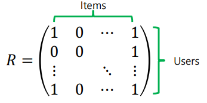
  > 
  > $R_{u, :}$ : 유저 u가 각 Item 을 샀는지 여부 [Binary]
  > 
  > $R_{:, i}$ : Item i를 각 유저별로 샀는지 여부 [Binary]
  > 
  > $I_u$ = {i|$R_{u,i} =1$} : 유저 u가 구매한 물건들의 집합
  > 
  > $U_i$ = {u|$R_{u,i} =1$} : Item i를 구매한 유저들의 집합
  
  

- **유사도 측정하기!**
  
  - **Implicit Feedback의 경우**
    
    1. Euclidean distance 
       
       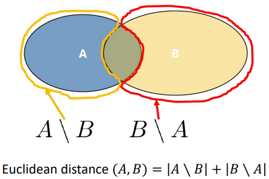
       
       - 단점 : 공통 요소가 거의 없을 때에도, 작은 규모의 집합에만 적용할만하다.
    
    2. Jaccard Similarity <u>[Euclidean distance 단점 해결]</u>
       
       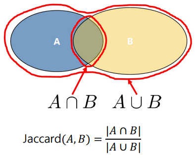
       
       - 단점 : Binary 경우에만 사용할 수 있다. 
    
    3. **Cosine Similarity [임의의 벡터에도 사용가능 - Jaccard 의 확장버전]**
       
       
       
       - Cosine Similarity 의 값에 따라 두 Item / 두 유저간의 관계성을 알 수 있다. 
  
  
  
  - **Explicit Feedback의 경우 - Pearson Correltaion** 
    
    - **의의 : 서로 다른 유저들의 Explicit rating을 고려할 수 있다!** 
    
    > 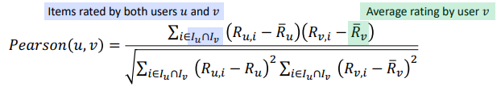
    > 
    > - 각 유저 u, v에 대해 평균 값보다 클 때 +, 작을 때 - 값을 부여함. 

- **예측하기** 
  
  - 유저 기반 Collaborative Filtering 
    
    > 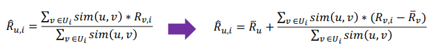
  
  - Item 기반 Collaborative Filtering 
    
    > 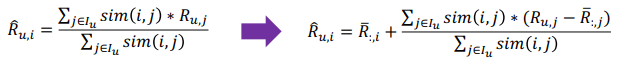
    
    - Item 기반 CF는 Active 유저의 평가치 또한 고려하기 때문에 보다 좋은 추천이 가능하다. 
    
    - 또한 추천에 대한 이유를 제공할 수 있다. (ex- 넌 예전에 A를 썼었으니, B 추천)
      
      > 유저 기반은 그저 '다른 사람도 좋아했다' 이상의 설명을 할 수 없음. 
      > 
      > Social Network 상황 아래에서는 유저 기반도 이유를 댈 수 있게 됨. 
  
  - Similarity가 각 평가치에 가중치로서 역할을 함. 

- **이웃 기반 CF 방식의 특징** 
  
  - 모든 평가치가 동일하게 가치있지는 않다! (유사도가 높을 수록 가중치가 붙는다)
    
    - 매우 유사한 항목의 경우, 해당 경우는 과하게 강조될 수 있다. 
  
  - 가중치는 고려하는 요소(유저, Item)의 개수가 늘어날수록 선형적으로 감소한다. 
  
  - 관련성이 있는 것들(이웃) 만 고려한다. 

- **이웃 기반 CF 방식의 장단점**
  
  - 이웃 기반 CF는 **Memory-based CF** 라고도 불린다. 
    
    - 각각의 유사도를 기록한 후, 나중에 예측, Ranking에서 사용하기 때문 
  
  - **장점** 
    
    - 최소한의 정보(Rating / Implicit feedback) 만을 요구한다.
    
    - 대부분의 경우에서 좋은 성능을 가져온다. 
  
  - **단점**
    
    - Sparsity / Cold-start 문제 발생 
      
      - 시스템 내에 충분한 유저들이 있어야 한다. 
      
      - 아래 추가 서술 
    
    - 계산성 확보 필요 
      
      - 유저와 Item의 수가 늘어남에 따라 노구되는 계산량이 증가한다. 
      
      - 한 유저가 한 Item을 구매할 때, 관련성 있는 유저들의 Item Ranking이 변할 수 있다. (매 순간 엄청난 양의 계산을 해야한다.)
    
    - 다양성 부족 : 다양한 결과를 촉진하지 않는다

- **Sparsity / Cold-start problem [RecSys의 오랜 문제]**
  
  - <mark>어떻게 새로운 아이템과 새로운 유저에 대해 추천을 할 것인가? </mark>
  
  - **New User problem** : 추천을 위해 유저의 선호도에 대한 평가를 수집해야만 한다. 
    
    > ex)- watcha : 가입 시 이전에 봤던 영화 10개 고리기 
    
    - Hydrid RecSys 가 위의 문제 해결을 도울 수 있음 
  
  - **New Item Problem** : 새로운 Item에 대해 충분한 양의 평가가 들어오기 전에 추천을 할 수 없다.

---------------------

#### A Regression Modeling VIew of Neighborhood Methods

- Item 기반 CF의 예측 함수에서 $I_u$ 가 모든 Item을 포함하면 선형 회귀와 유사해진다.
  
  > 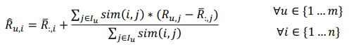
  
  > 선형 회귀 : 각 Coefficient 들은 <u>최적화 모델</u>을 통해 결정된다. 
  > 
  > Item 기반 CF 예측 : 각 Coeffient(여기선 Similarity)는 <u>휴리스틱</u>하게 결정된다.
  
  - 따라서 Coefficient를 가중치($W^{item}_{i,j}$)로 표현하여, 선형 회귀와 유사하게 표현한다. 
    
    > 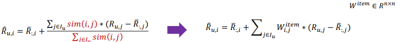

- **Sparse Linear Models(SLIM)**
  
  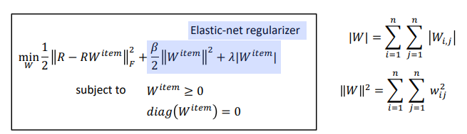
  
  - SLIM에서는 모든 Item을 고려하여, 이웃인 Item만을 고려하지 않는다. 
    
    > 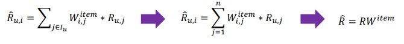
  
  - $W^{item}_{i,j}$ 를 정의함에 있어, <u>본인 자신을 의미하는 $W_{t,t}$ 의 값은 0으로 설정</u>한다. 
    
    - 이를 통해 자기 자신의 결과를 반복하는 경우를 막아 과적합을 피한다. 
  
  - 추가적으로<u> Shrinkage method를 도입하여 모델의 분산을 줄일 것</u>이다. 
    
    >  $y = X\beta  +b$ 라고 할 때, $\beta$ 값을 0으로 보낼 것이다. 
    > 
    > 이를 위해 $\beta$와 관련하여 L1, L2 규제를 도입한다. 
    > 
    > > 선형회귀 
    > > 
    > > 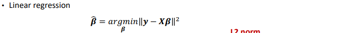
    > > 
    > > L1(Lasso regulation) : $\lambda|\beta|$, where $|\beta| = \sum^p_{j=1} |\beta_j|$
    > > 
    > > 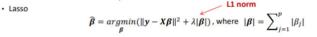
    > > 
    > > L2(Ridge regulation) : $\lambda||\beta||^2$, where $||\beta||^2 = \sum^p_{j=1} \beta^2_j$
    > > 
    > > 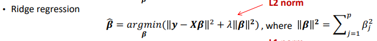
    > 
    > **규제 항으로 $\beta$ 가 들어갔기 때문에, $\beta$ 값도 점차 0으로 근접할 것이다.**
  
  

- Ridge vs Rasso 
  
  
  
  > 왼쪽이 Lasso, 오른쪽이 Lidge 
  
  - 특정 값 RSS에 해당하는 Contour을 고려했을 때, 각 제약을 충족시킬 때의 접점이 다르다. 
  
  - 이는 반대로 말해, 주어진 제약 조건에 대해서 Lidge는 보다 작은 RSS 값으로도 접점을 만들어 낼 수 있다는 것. 

----------

#### 추천 시스템의 평가 방식

- 평가 예측 →  회귀 방식 적용 
  
  - Input : 유저 / Item의 평가 쌍의 집합 
  
  - Output : 각 유저 / Item의 쌍 별로 예측한 평가치를 부여 
  
  - 평가 방식 : RMSE / MAE [예전에 다뤘으므로 생략]

- Top-k 추천 → Ranking 방식 적용 
  
  - Input : 추천하고자 하는 Item의 수(k),  유저 / Item 쌍의 Implicit 데이터
  
  - Output : 각 유저에 맞춰 가장 추천할 만한 k개의 Item들 
  
  - 평가 방식  : Precision , Recall, F1, AP, RR, NDCG 

- Precision & Recall, F1
  
  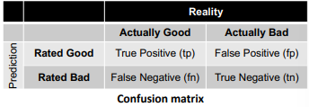
  
  > Precision : $\frac{tp}{tp + fp}$
  > 
  > Recall : $\frac{tp}{tp+fn}$
  
  - Precision 과 Recall 사이에는 Trade off 가 존재한다. 
    
    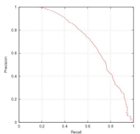
    
    - 이 점을 고려하기 위해 F1을 도입한다. 
    
    > $F_1 = 2 * \frac {precision  * recall}{precision + recall}$

- ROC & AUC 
  
  > ex)- 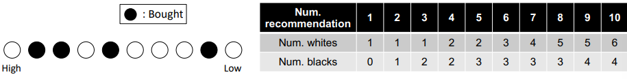
  
  > 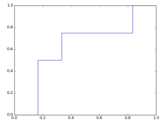
  > 
  > - 이때 파란색 선이 ROC Curve를, 파란색 선 아래의 영역을 AUC라고 한다. 
  > 
  > - AUC 가 클수록 좋다. 

- **Rank position matter**
  
  - 높은 Rank에 있는 Item이 선택되었을 때 낮은 Rank의 것보다 높은 점수를 줘야한다.
  1. **Average Precision(AP) : 높게 Ranked 된 것을 맞췄을 때 가중치 부여**
     
     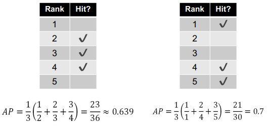
     
     > mAP = $\frac{1}{|U|} \sum^{|U|}_{i=1} AP(u)$
     > 
     > AP(u) = $\frac{1}{|S|} \sum^n_{k=1} prec@k$ * $rel(k)$
  
  2. **Reciprocal Rank(RR) : 맞춘 아이템들의 Rank의 역순을 합한다**. 
     
     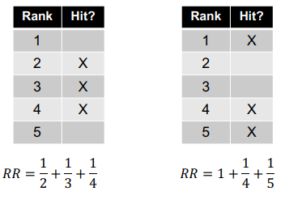
     
     > MRR = $\frac{1}{|U|} \sum^{|U|}_{u=1} RR(u)$
     > 
     > RR(u) = $\sum^k_{i=1} \frac{relevanc_i}{rank_i}$
  
  3. **Normalized disconted Cumulative gain(nDCG)**
     
     > $nDCG_{pos} = \frac{DCG_{pos}}{IDCG_{pos}}$ , $nDCG_5 = \frac{DCG_5}{IDCG_5} \sim 0.81$
     
     > 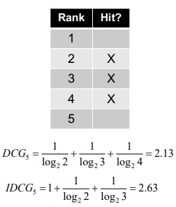
     
     > $DCG_{pos} - rel_1 + \sum^{pos}_{i=2} \frac{rel_i}{log_2i}$
     > 
     > > pos : 관련도가 축적된 위치 - 고려하는 Rank의 수
     > > 
     > > $rel_i$ : i 위치에서의 관련 정도 
     > 
     > $IDCG_{pos} = rel_1 + \sum^{|h|-1}_{i=2} \frac{rel_i}{log_2i}$

