#### 3주차 - 모델 기반의 Collaborative Filtering

**모델 기반의 CF이란, 휴리스틱한 방식 대신에 데이터를 기반으로 모델을 학습하는 방법을 의미한다. 아래와 같은 종류가 있다**

- Explicit feedback : Matrix factorization, SVD++, Probabliity Matrix Factorization 
  
  > 정확한 Rating을 기반으로 Latent feature을 추출하려는 시도! 

- Implicit feedback 
  
  - MF-based 
    
    - Pointwise : OCCF, WRMF  
    
    - Pairwise : BPR 
    
    - Liskwise : listRank, CLiMF(learning to rank)
  
  - Metric learning-based 
    
    - CML
    
    - TransCF
    
    - LRML
  
  - Deep learning-based 
    
    - NCF, CDAE 

----------------------

##### Explicit Feedback based Model

###### Matrix Factorization

- **Idea**
  
  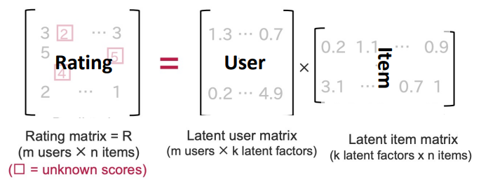
  
  1. 유저와 Item 안에 Latent factor가 있다 여긴다. 
  
  2. 평가 점수(Rating score)가 유저와 Item의 Latent factor로부터 구해진다 가정한다.
     
     - 즉, 평가 점수는 유저와 Item의 Latent Factor의 곱으로 표현된다. 
     
     - 이때 Latent factor의 차원은 유저와 Item의 수보다 훨씬 적을 것이다. 
  
  <mark>→ 우리가 유저와 Item의 Latent Factor을 알면 반대로 Rating을 예측할 수 있을 것!</mark>

- **목적 : 유저와 Item의 Latent Factor을 계산하자!**
  
  - 수단 : **Singular Value Decomposition(SVD)** 적용 
  
  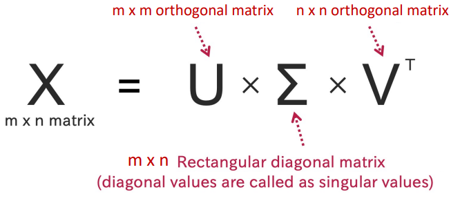
  
  > SVD는 차원 축소를 위해서도 자주 사용된다. 
  > 
  > 또한 $\sum$ 의 Diagonal 값 중에서 큰 값만 선택함으로써 주요 특징을 남기면서 근사시킬 수 있다. 단, 이때 근사값은 실제 값과 완전히 같진 않다. 

- **MF에서의 Missing Value 해결 방법**
  
  - MIssing Value를 0으로 대체 
    
    - 단점 : 예측 값이 종종 음수로 나온다. 또한 성능을 악화시킬 수 있다. 
  
  - Missing Value를 사용하지 않음 - **<mark>SVD ++ </mark>**
    
    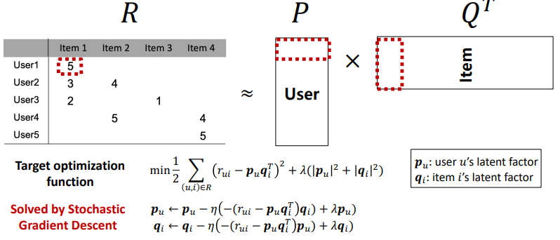
    
    > ++ 는 목표 함수에서 추가된 두 규제 항을 의미한다.
    
    - 목표로 하는 최적화 함수를 우리가 알고 있는 값만으로 계산한다. 
    
    - 또한 각 유저와 Item의 Latent Factor을 의미하는 $p_u, q_i$와 관련된 규제항을 도입하여 각각을 갱신해준다.
  
  - 확률론적으로 접근한다 - **<mark>Probabilistic Matrix Factorization(PMF)</mark>**
    
    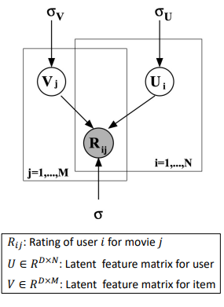
    
    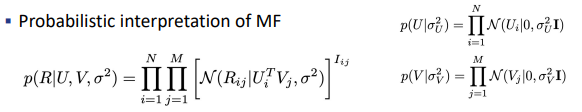
    
    > Latent factor $v_j, u_i$ 는 Gaussian 분포를 따른다 가정 
    > 
    > $R_{ij}$ 또한 $v_j, u_i$에 기반하여 Gaussian 분포라고 가정  **→ 확률값 산출 가능**
    
    - 이후 관측한 값($R_{ij}$)를 기반으로 Latent factor $u_i, v_j$ 를 갱신 
      
      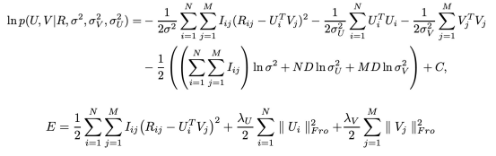

---

##### Implicit feedback Base Model

**Learning to Rank** - Similar to supervised classification problem 

- **Point wise** : Direct relevance of and item 
  
  - Idea : Confidence level을 고려함 
    
    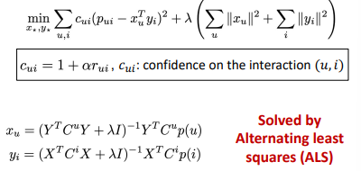
    
    > 유저가 특정 Item i를 사용한 것을 긍정적인 지표로 본다 
    > 
    > 반대로 특정 Item j를 사용하지 않는 것을 선호도가 없는 것으로 본다. 
    
    > 이때, $c_ui$ 에 +1을 하는 것은 $R_{ui}$ 가 0일 경우에도 값을 부여하기 위함이다. 
    > 
    > $\alpha$ : 가중치
  
  - 단점 : 최적화를 위해 모든 가능한 (u,i)을 고려해야 하기 때문에 SGD는 활용못한다.

- **Pairwise** : Pairwise preference over two items(observed / Unobserved)
  
  - BPR : Bayesian Personalized ranking from implicit Feedback  
  
  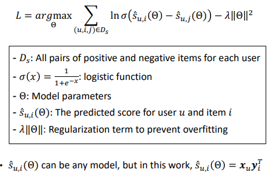
  
  > 선택한 Item i를 선택하지 않은 Item j 보다 선호한다. 
  
  - 단점 : 모든 관찰되지 않는 Items들을 동일하게 고려한다. 

- **Listwise** : Ranking loss over the entie list
  
  - **List Lank**
    
    - Idea : Cross Entropy를 통해 Top-1의 확률을 계산한다. 
      
      
      
      > Cross Entropy H : $-\sum p *log q$ . 이 값을 기반으로 최적화 
    
    - Loss Function은 Training list와 Output list 사이의 <u>불확실성을 반영</u>한다.
      
      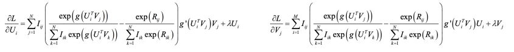
  
  - **CLIMF : Collaborative less-is-more filtering** 
    
    - Idea : Directly <u>Maximize the Mean Reciprocal Rank(MRR)</u>
    
    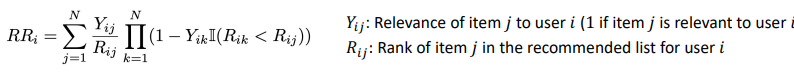
    
    > RR은 Non-smooth func로 Gradient-based optimization 이 불가능하다. 
    > 
    > > Non-smooth : 무한번 미분이 불가능함. 즉, 미분을 기반으로 최적화시키는 Gradient-based optimization은 불가하다. 
    > 
    > => <u>각각의 요소들($II(R_{ik} < R_{ij} ), \frac{1}{R_{ij}}$) 을 근사한 값으로 대체</u>한다. 
    > 
    > 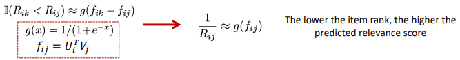
    
    > 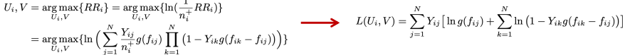

----- 

##### Metric learning-based

- 지표(Metric)을 기반으로 유사도를 측정한다! 

- 한 방법으로 샘플 간 거리를 유사도로 고려한다. 
  
  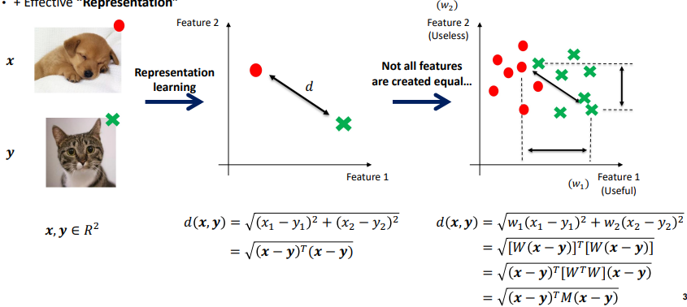
  
  - 이때 샘플 간의 거리를 잴 때 특성별로 얼마나 가치있는 정보인지가 차이난다. 
    
    - 따라서 특성별로 가중치를 부여함으로써 유사도를 측정한다. 

- **목표 : 데이터를 기반으로 예측을 도와주는 Metric Matrix를 학습하는 것**
  
  > $d(x,y) = \sqrt{(x-y)^TM(x-y)}$
  
  - 관측된 일부 자료를 기반으로 유사한 클래스 간의 거리는 작게, 다른 클래스 간은 크게 만들어 주는 **Metric Matrix M**을 찾고자 한다. 

- 문제점 : <u>MF는 Inner Product의 경우 삼각부등식을 위반하여, 유사도로 고려할 수 없다. </u>
  
  - 두 특정 관계 사이의 Positive relationship이 반영되지 않는 결과를 만들 수 있다. 
  
  > 삼각 부등식 : d(x,z) <= d(x,y) + d(y,z) 
  > 
  > 유사도는 종종 s(x,z) >= s(x,y) + s(y,z) 를 성립시킨다. 
  
  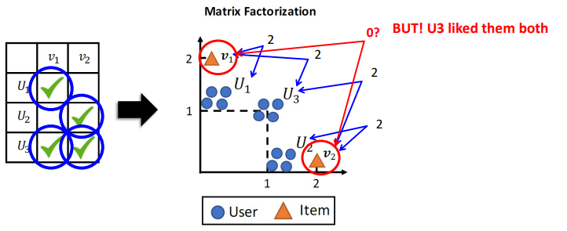
  
  > U1, U2만 고려했을 땐 $v_1, v_2$ 는 멀리 분배되어야 한다. 
  > 
  > 하지만 U3은 v1, v2를 둘다 선호할 수 있다. 
  > 
  > *Q. 그래서 이걸 해결했다는 거야 안했다는 거야?*
  > 
  > - 아래 방법들로 해결한 거 같네 

###### Collaborative Metric Learning(CML)

- Idea :유저는 싫어하는 Item 보다는 좋아하는 Item에 가까워야 한다. 
  
  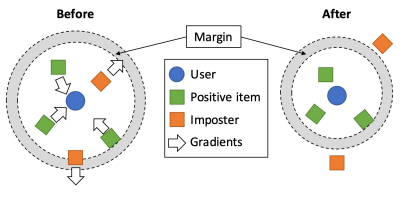
  
  > $d(i,j) = ||u_i - v_j|| $ (Euclideean distance)
  > 
  > 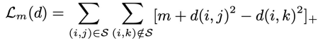
  
  - 위의 Loss 함수를 최소함으로써 각 Item 별 거리를 재조정한다. 
    
    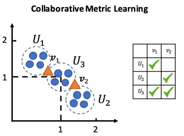
    
    > 이를 통해서 v1, v2의 가 u1-u3, u2-u3 사이에 오도록 조정한다. 

- **Collaborative translational Metric Learning(TRANSCF)**
  
  - 의의 : CML의 한계 "각각의 유저는 단일 점에 근사되어 진다." 극복  
    
    > user-item 관계 사이에서 Intensity 와 Heterogeneity를 고려못하게 된다. 
    > 
    > 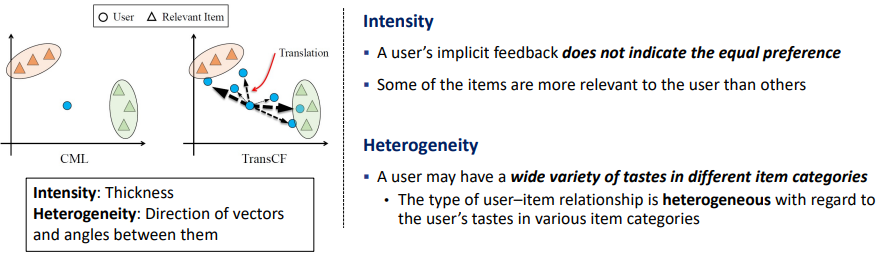
  
  - 방법 : Translation mechanism 도입
    
    - 객체 간의 관계를 그들 사이의 translation operation으로 해석한다.
    
    > 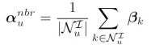, 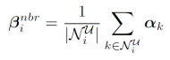
    > 
    > - 유저와 Item를 각 이웃공간 내의 값의 합으로 고려한다. 
    > 
    > 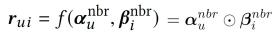
    > 
    > - 유저와 Item 간 관계( $r_{ui}$) 를 $a_u, \beta_i$의 관계를 모델링하여 표현한다. 
  
  - 목표 함수 및 2가지 규제를 최적화하는 것으로 Intensity와 Heterogeneity를 보존한채 학습한다.
    
    > 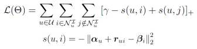
    > 
    > > *Q.$\gamma$ 가 의미하는 건 뭐지?*
    > 
    > 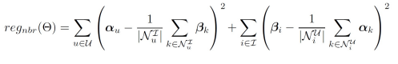
    > 
    > - $\alpha_u, \beta_i$의 값들이  $\alpha_u^{nbr}, \beta_i^{nbr}$ 에 근사할 수 있다면 <u>이웃(Neighborhood)의 정보가 보다 잘 반영 될 것</u>  
    > 
    > - <mark>→ 규제항으로 추가</mark>
    > 
    > 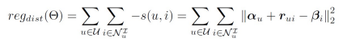
    > 
    > - <u>Negative Item을 밀어냄으로써 관련성 있는 객체들을 모을 수 있을 것</u>
    > 
    > - <mark>→ 규제항으로 추가 </mark>

- **Latent relational metric learning Via Memory-based attention for collaborative ranking(LRML)**
  
  - Idea : 각각의 유저-Item의 관계를 묘사하는 Latent 관계를 학습하자 
    
    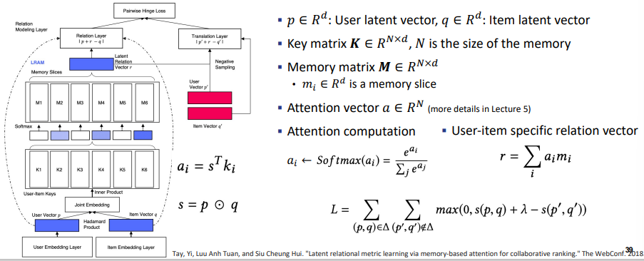
    
    > Attention으로 가중치 산출 
    > 
    > Relation layer은 Minimize 하며, Translation layer을 최대화한다. 
    > 
    > 추후 자세히 다룰 예정 

---- 

##### Deep learning-based Methods

**Neural collaborative Filtering(NCF)**

- Idea : 유저-Item의 관계를 Neural Network를 통해서 구현한다.(Inner product X)
  
  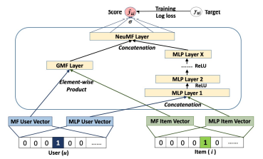

**Collaborative Denoising Auto-Encoders for Top-N Recommender systems(CDAE)**

- Idea : noise를 제거하는 Autoencoder를 도입한다 
  
  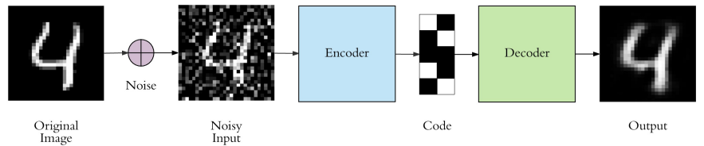
