#### 4주차 - Side information-based RecSys

###### Outline

- Content-based Filtering(Only contents)

- General information : FM, DeepFM, Wide & Deep

- Social information : SoRec, SoReg, SBRP, TBPR

- Text information : CTR, CDL, ConvMF

- Image information : HDC, VBPR, DVBPR, VPOI

------------------

##### Content-based Filtering - 1주차에 설명함.

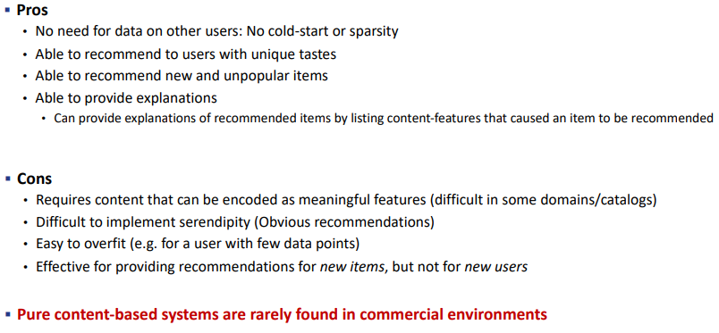

> 다른 자료를 필요로 하지 않는다는게 Content-based Filtering을 하는 이유이나, 
> 
> 소수의 Explicit Data가 방대한 양의 Content-based 정보보다 효과가 좋기 때문에 Pure Content-based system은 거의 사용되지 않는다. 

----

#### General information : FM, DeepFM, Wide & Deep

- 내가 생각하는 General information 방법의 단점 
  
  - 수치화되어 있지 않는 특성, 각 수치가 특성의 차이를 고려하지 못할 경우(ex-categorical value)위의 방법은 사용할 수 없겠다. 
    
    - 아 Categorical value는 괜찮겠다. one-hot incoding을 적용해주면 될 거니까 
    
    - 한편으론 one-hot incoding을 적용하면 over confidence이 발생할 것으로 보이는데? 이 부분에서 confi 개념으로 접근해볼 수 있을까? 
    
    - Probability & in-out distribution 확인해보자 
  
  - 혹은 사용하기 위해서 Embedding 등 추가적인 수단을 필요로 하겠다. 

- Side information : Tabular feature data 
  
  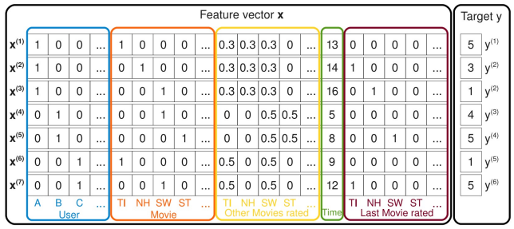
  
  > Feature Matrix X $\in R^{m * n}$ 
  > 
  > Target $y \in R^m$
  > 
  > > m : Target의 수 
  > > 
  > > n : Feature의 수 

- **Factorization MAchines(FM)** 
  
  - **Idea : Factorized parameter을 통해 모든 변수 사이의 관계를 알아내자!**
    
    > <mark>$y(x) = w_0 + \sum_{i=1}^nw_ix_i + \sum_{i=1}^n \sum_{j=i+1}^n  <v_i, v_j>x_ix_j$</mark>
    
     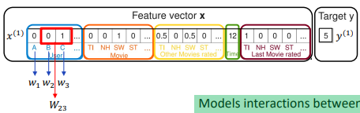
    
    > x : 각 Item의 특성 
    > 
    > y : Item x의 순위 산정 
    > 
    > $w_i : $ 각 유저와 관련이 있는가 유무 
    > 
    > $w_{ij}$ : user i 와 user j 간의 관계 강도 
    > 
    > $v_i$ : i 번째 Item의 Feature를 Factor로 가지는 벡터
    > 
    > <$v_i, v_j$> : i번째, j번째 Item 간의 특성 내적값 

- Polynomial Regression 형태에서 FM으로 바꿨으며 계산양을 대폭 줄였다.
  
  > $w_0 + \sum_{i=1}^nw_ix_i + \sum_{i=1}^n \sum_{j=i+1}^n $ <mark>$W_{ij}$</mark> $x_ix_j$ : Polynomial Regression 
  > 
  > $y(x) = w_0 + \sum_{i=1}^nw_ix_i + \sum_{i=1}^n \sum_{j=i+1}^n $ <mark>$<v_i, v_j>$</mark> $x_ix_j$ : FM 
  > 
  > - 둘의 차이는 <u>아이템 i, j 간의 관계를 어떻게 표현할 것인가</u>
  
  - $<v_i, v_j> = \sum_{f=1}^k v_{i,f} * v_{j,f}$ 는 O($kn^2$) 의 계산 복잡도를 가진다. 
  
  - 하지만 아래의 Factorization 과정을 통해서 $O(kn)$ 으로 줄일 수 있다. 
    
    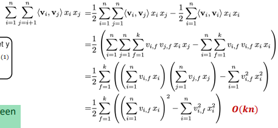

- **Wide & Deep Learning for Recommender Systems** 
  
  - **Idea : 일반화된 선형 모델인 Wide 모델과 Deep 모델을 합치자!** 
    
    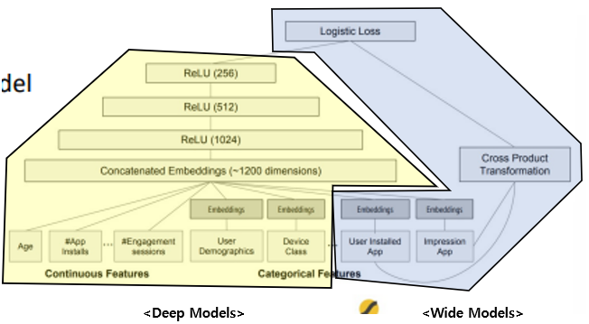
    
    
    
    > Wide Model : Wide set of cross-product feature transformation을 통해서 **특성간의 관계를 기억**하자! 
    > 
    > > $y = w^T \phi(x) +b$
    > 
    > Deep Model : Sparse feature에 대해 학습된 저차원의 dense embedding을 통해서 **관측되지 않은 특성을 보다 잘 일반화**하자! 
    > 
    > > $a^{l+1} = f(W^{(l)}a^{(l)} + b^{(l)} )$ 
    > 
    > → <mark>$P(Y=1|x) = \sigma(w^T_{wide}[x, \phi(x)] + w^T_{deep}a^{(l_f)}+b) $</mark>

- **Deep Factorization Machine(DEEPFM)**
  
  - **Idea : FM과 DL을 조합하여 저차원, 고차원의 특징의 관계를 고려하자!**
    
    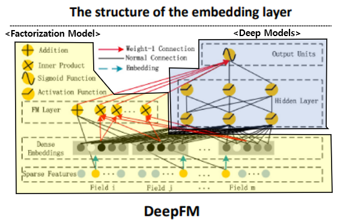
    
    > $y_{DNN} = \sigma(W^{|H|+1} * a^H + b^{|H|+1})$
    > 
    > $\hat y = sigmoid(y_{FM} + y_{DNN})$
    
    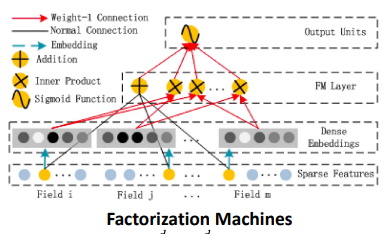
    
    > Factorization Machines : Sparse feature(0 or 1) 로부터 해당되는 값(<w,x>)만 뽑아 계산하기  
    > 
    > $y_{FM} = <w,x> + \sum^d_{j_1=1} \sum^d_{j_2=j_1 +1} <V_i, V_j> x_{j1} * x_{j2}$

- **Wide & Deep 모델과의 차이점** 
  
  1. 공통된 Input Layer 위에 FM과 DL를 쌓아 같이 공유하고 있다는 점  
  
  2. Feature engineering이 불필요하다는 점 

---- 

#### Social information : SoRec, SoReg, SBPR, TBPR

- **Idea : 유저는 일반적으로  Social Friends 와 유사한 취미를 공유할 것이다.**

- Probabilistic Matrix Factorization : 3주차에서 다룸

- **Social Recommendation Using Probabilistic Matrix Factorization(SOREC)**
  
  - **Idea : Rating Matrix뿐만 아니라 사회 관계 Matrix 도 같이 Factorizing 하자!**
    
    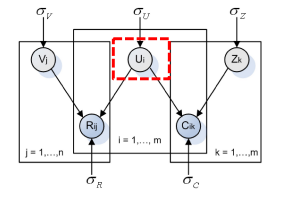
    
    > <mark>$L(R,C,U,V,Z)$</mark>
    > 
    > <mark>$= \frac{1}{2} \sum_{i=1}^m \sum_{j=1}^n I_{ij}^R(r_{ij} - g(U_i^TV_j))^2 + \frac{\lambda_U}{2}||U||^2_F + \frac{\lambda_V}{2}||V||^2_F$ </mark>
    > 
    > <mark>   + $\frac{\lambda_C}{2} \sum_{i=1}^m\sum_{k=1}^m I_{ik}^C (c_{ik}^* - g(U_i^TZ_k))^2 + \frac{\lambda_Z}{2}||Z||^2_F$</mark>
    > 
    > - <u>위의 항은 Rating Matrix에 대한 Loss 식</u>이며, <u>아래 항은 Social Recommendation에 Loss 식</u>임. 
    > 
    > - 그리고 **두 항목들은 공통된 U를 기반으로 정보를 주고 받을 것**
    
    > Latent Variable U,V,Z 에 대해서 Observed Data를 기반으로 새롭게 할당
    > 
    > - Latent Variable이 있으니, EM-algorithm을 필요로 한다.
    > 
    > 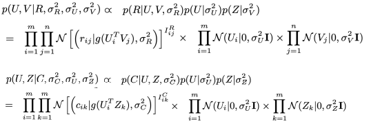
    > 
    > - 여기서 두 경우 모두 U를 공유하고 있기 때문에, $R_{ij},C_{ik}$ 의 정보가 서로에게 전파될 수 있다.  
    
    > 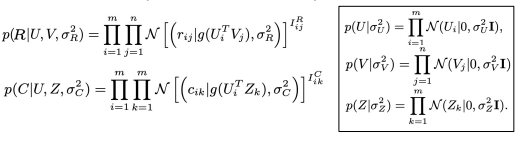
    > 
    > > g(x) : $\frac{1}{1+exp(-x)}$ . $U_i^T V_j$, $U_i^TZ_k$ 의 반경을 [0,1]로 줄이기 위해 사용
    > 
    > > $R \in R^{n *m}$ : n개의 유저의 m개의 Item에 대한 평가 
    > > 
    > > $C \in R^{n * n}$ : 유저간 관계. 관계가 있으면 1, 없으면 0   

- SOREC은 Training Data가 적어질수록 PMF 대비 더 좋은 성능을 낸다. 
  
  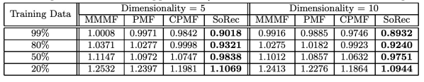
  
  > Training Data의 비중이 줄어들수록 두 방법의 평가 지표 차이가 벌어진다. 

##### Recommender systems with social Regularization(SOREG)

- **Idea : Social network 정보를 규제항으로서 여기기** 
  
  - <u>친구들과 유사하지 않은(관련없는) 취향을 가진 경우 다르게 다루기</u> 
  
  > Loss 함수에 규제항 하나 추가 
  > 
  > Average-based : $\frac{\alpha}{2} \sum_{i=1}^m ||U_i - \frac{\sum_{f \in F^+(i)} Sim(i,f) * U_f}{\sum_{f \in F^+(i)} Sim(i,f)}||^2_F$
  > 
  > 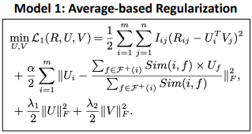
  > 
  > Individual-based : $\frac{\beta}{2} \sum_{i=1}^m \sum_{f \in F^+(i)} Sim(i,f) ||U_i - U_f||^2_F$
  > 
  > 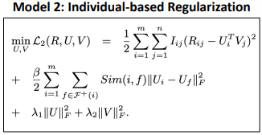
  
  > Sim : Person Correlation Coefficient를 활용하여 측정 
  > 
  > 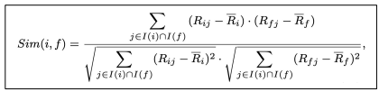

##### Leveraging Social Connections to improve personalized Ranking For Collaborative Filtering(SBPR)

- Idea : BRP Top-k 랭킹 추천을 위해 Social network 정보 사용  
  
  - 모델 MF 기반 방법중 BPR을 확장한 것 

- 가정 : 유저들은 친구들이 선호하는 Item을 높은 랭크로 할당하는 경향이 있다. 
  
  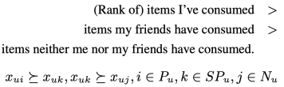

> 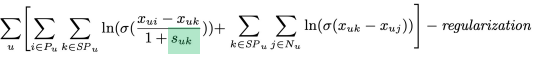
> 
> > $s_{uk} $ : 유저 u의 친구가 Item k을 얼마나 선호하는가? 

- 결과 : 성능이 향상되며, 고려하는 친구의 수가 늘어날수록 좋다. 
  
  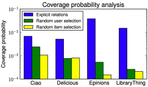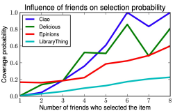

- 추가 가정 : 친구를 통해 알게된 Item을 선택안한 경우는, 평범하게 모르는 경우보다 더 나쁜 것으로 여긴다. 
  
  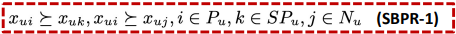
  
  > $x_{ui} : $ 그냥 모르는 것 
  > 
  > $x_{uj}$ : 이웃(친구)들이 알려준 건데 선택안한 것 

#### Social Recommendation with Strong and Weak Ties(TBPR)

- Idea : 사회 관계 중에서 Weak-ties(중요!) 와 Strong-ties를 고려하자!
  
  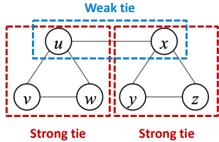
  
  > Strength는 Jaccard를 통해 얼마나 공통된 관계가 많을지를 기반으로 측정한다. 
  > 
  > 
  > 
  > 또한 Strong / Weak ties 유무는 Threshold 관점에서 판단한다. 

> Loss function 
> 
> 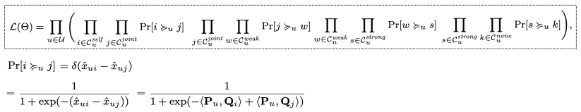

- Weak Tie / Strong Tie 중 각각 무엇을 더 선호할 지 검증 결과, Weak Tie의 결과가 더 좋았다.  
  
  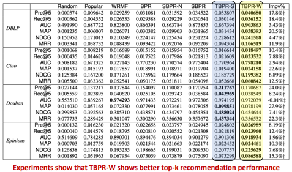
  
  <mark>→ Weak tie의 경우 연결점이 적어 보다 새로운(Novelty) 정보를 전달해줄 수 있다!</mark> 

