#### 4주차 - Side information-based RecSys

###### Outline

- Content-based Filtering(Only contents)

- General information : FM, DeepFM, Wide & Deep

- Social information : SoRec, SoReg, SBRP, TBPR

- Text information : CTR, CDL, ConvMF

- Image information : HDC, VBPR, DVBPR, VPOI

------------------

##### Content-based Filtering - 1주차에 설명함.

> 다른 자료를 필요로 하지 않는다는게 Content-based Filtering을 하는 이유이나, 
> 
> 소수의 Explicit Data가 방대한 양의 Content-based 정보보다 효과가 좋기 때문에 Pure Content-based system은 거의 사용되지 않는다. 

----

#### General information : FM, DeepFM, Wide & Deep

- 내가 생각하는 General information 방법의 단점 
  
  - 수치화되어 있지 않는 특성, 각 수치가 특성의 차이를 고려하지 못할 경우(ex-categorical value)위의 방법은 사용할 수 없겠다. 
    
    - 아 Categorical value는 괜찮겠다. one-hot incoding을 적용해주면 될 거니까 
    
    - 한편으론 one-hot incoding을 적용하면 over confidence이 발생할 것으로 보이는데? 이 부분에서 confi 개념으로 접근해볼 수 있을까? 
    
    - Probability & in-out distribution 확인해보자 
  
  - 혹은 사용하기 위해서 Embedding 등 추가적인 수단을 필요로 하겠다. 

- Side information : Tabular feature data 
  
  
  
  > Feature Matrix X $\in R^{m * n}$ 
  > 
  > Target $y \in R^m$
  > 
  > > m : Target의 수 
  > > 
  > > n : Feature의 수 

- **Factorization MAchines(FM)** 
  
  - **Idea : Factorized parameter을 통해 모든 변수 사이의 관계를 알아내자!**
    
    > <mark>$y(x) = w_0 + \sum_{i=1}^nw_ix_i + \sum_{i=1}^n \sum_{j=i+1}^n  <v_i, v_j>x_ix_j$</mark>
    
     
    
    > x : 각 Item의 특성 
    > 
    > y : Item x의 순위 산정 
    > 
    > $w_i : $ 각 유저와 관련이 있는가 유무 
    > 
    > $w_{ij}$ : user i 와 user j 간의 관계 강도 
    > 
    > $v_i$ : i 번째 Item의 Feature를 Factor로 가지는 벡터
    > 
    > <$v_i, v_j$> : i번째, j번째 Item 간의 특성 내적값 

- Polynomial Regression 형태에서 FM으로 바꿨으며 계산양을 대폭 줄였다.
  
  > $w_0 + \sum_{i=1}^nw_ix_i + \sum_{i=1}^n \sum_{j=i+1}^n $ <mark>$W_{ij}$</mark> $x_ix_j$ : Polynomial Regression 
  > 
  > $y(x) = w_0 + \sum_{i=1}^nw_ix_i + \sum_{i=1}^n \sum_{j=i+1}^n $ <mark>$<v_i, v_j>$</mark> $x_ix_j$ : FM 
  > 
  > - 둘의 차이는 <u>아이템 i, j 간의 관계를 어떻게 표현할 것인가</u>
  
  - $<v_i, v_j> = \sum_{f=1}^k v_{i,f} * v_{j,f}$ 는 O($kn^2$) 의 계산 복잡도를 가진다. 
  
  - 하지만 아래의 Factorization 과정을 통해서 $O(kn)$ 으로 줄일 수 있다. 
    
    

- **Wide & Deep Learning for Recommender Systems** 
  
  - **Idea : 일반화된 선형 모델인 Wide 모델과 Deep 모델을 합치자!** 
    
    
    
    
    
    > Wide Model : Wide set of cross-product feature transformation을 통해서 **특성간의 관계를 기억**하자! 
    > 
    > > $y = w^T \phi(x) +b$
    > 
    > Deep Model : Sparse feature에 대해 학습된 저차원의 dense embedding을 통해서 **관측되지 않은 특성을 보다 잘 일반화**하자! 
    > 
    > > $a^{l+1} = f(W^{(l)}a^{(l)} + b^{(l)} )$ 
    > 
    > → <mark>$P(Y=1|x) = \sigma(w^T_{wide}[x, \phi(x)] + w^T_{deep}a^{(l_f)}+b) $</mark>

- **Deep Factorization Machine(DEEPFM)**
  
  - **Idea : FM과 DL을 조합하여 저차원, 고차원의 특징의 관계를 고려하자!**
    
    
    
    > $y_{DNN} = \sigma(W^{|H|+1} * a^H + b^{|H|+1})$
    > 
    > $\hat y = sigmoid(y_{FM} + y_{DNN})$
    
    
    
    > Factorization Machines : Sparse feature(0 or 1) 로부터 해당되는 값(<w,x>)만 뽑아 계산하기  
    > 
    > $y_{FM} = <w,x> + \sum^d_{j_1=1} \sum^d_{j_2=j_1 +1} <V_i, V_j> x_{j1} * x_{j2}$

- **Wide & Deep 모델과의 차이점** 
  
  1. 공통된 Input Layer 위에 FM과 DL를 쌓아 같이 공유하고 있다는 점  
  
  2. Feature engineering이 불필요하다는 점 

---- 

#### Social information : SoRec, SoReg, SBPR, TBPR

- **Idea : 유저는 일반적으로  Social Friends 와 유사한 취미를 공유할 것이다.**

- Probabilistic Matrix Factorization : 3주차에서 다룸

- **Social Recommendation Using Probabilistic Matrix Factorization(SOREC)**
  
  - **Idea : Rating Matrix뿐만 아니라 사회 관계 Matrix 도 같이 Factorizing 하자!**
    
    
    
    > <mark>$L(R,C,U,V,Z)$</mark>
    > 
    > <mark>$= \frac{1}{2} \sum_{i=1}^m \sum_{j=1}^n I_{ij}^R(r_{ij} - g(U_i^TV_j))^2 + \frac{\lambda_U}{2}||U||^2_F + \frac{\lambda_V}{2}||V||^2_F$ </mark>
    > 
    > <mark>   + $\frac{\lambda_C}{2} \sum_{i=1}^m\sum_{k=1}^m I_{ik}^C (c_{ik}^* - g(U_i^TZ_k))^2 + \frac{\lambda_Z}{2}||Z||^2_F$</mark>
    > 
    > - <u>위의 항은 Rating Matrix에 대한 Loss 식</u>이며, <u>아래 항은 Social Recommendation에 Loss 식</u>임. 
    > 
    > - 그리고 **두 항목들은 공통된 U를 기반으로 정보를 주고 받을 것**
    
    > Latent Variable U,V,Z 에 대해서 Observed Data를 기반으로 새롭게 할당
    > 
    > - Latent Variable이 있으니, EM-algorithm을 필요로 한다.
    > 
    > 
    > 
    > - 여기서 두 경우 모두 U를 공유하고 있기 때문에, $R_{ij},C_{ik}$ 의 정보가 서로에게 전파될 수 있다.  
    
    > 
    > 
    > > g(x) : $\frac{1}{1+exp(-x)}$ . $U_i^T V_j$, $U_i^TZ_k$ 의 반경을 [0,1]로 줄이기 위해 사용
    > 
    > > $R \in R^{n *m}$ : n개의 유저의 m개의 Item에 대한 평가 
    > > 
    > > $C \in R^{n * n}$ : 유저간 관계. 관계가 있으면 1, 없으면 0   

- SOREC은 Training Data가 적어질수록 PMF 대비 더 좋은 성능을 낸다. 
  
  
  
  > Training Data의 비중이 줄어들수록 두 방법의 평가 지표 차이가 벌어진다. 

##### Recommender systems with social Regularization(SOREG)

- **Idea : Social network 정보를 규제항으로서 여기기** 
  
  - <u>친구들과 유사하지 않은(관련없는) 취향을 가진 경우 다르게 다루기</u> 
  
  > Loss 함수에 규제항 하나 추가 
  > 
  > Average-based : $\frac{\alpha}{2} \sum_{i=1}^m ||U_i - \frac{\sum_{f \in F^+(i)} Sim(i,f) * U_f}{\sum_{f \in F^+(i)} Sim(i,f)}||^2_F$
  > 
  > 
  > 
  > Individual-based : $\frac{\beta}{2} \sum_{i=1}^m \sum_{f \in F^+(i)} Sim(i,f) ||U_i - U_f||^2_F$
  > 
  > 
  
  > Sim : Person Correlation Coefficient를 활용하여 측정 
  > 
  > 

##### Leveraging Social Connections to improve personalized Ranking For Collaborative Filtering(SBPR)

- Idea : BRP Top-k 랭킹 추천을 위해 Social network 정보 사용  
  
  - 모델 MF 기반 방법중 BPR을 확장한 것 

- 가정 : 유저들은 친구들이 선호하는 Item을 높은 랭크로 할당하는 경향이 있다. 
  
  

> 
> 
> > $s_{uk} $ : 유저 u의 친구가 Item k을 얼마나 선호하는가? 

- 결과 : 성능이 향상되며, 고려하는 친구의 수가 늘어날수록 좋다. 
  
  

- 추가 가정 : 친구를 통해 알게된 Item을 선택안한 경우는, 평범하게 모르는 경우보다 더 나쁜 것으로 여긴다. 
  
  
  
  > $x_{ui} : $ 그냥 모르는 것 
  > 
  > $x_{uj}$ : 이웃(친구)들이 알려준 건데 선택안한 것 

#### Social Recommendation with Strong and Weak Ties(TBPR)

- Idea : 사회 관계 중에서 Weak-ties(중요!) 와 Strong-ties를 고려하자!
  
  
  
  > Strength는 Jaccard를 통해 얼마나 공통된 관계가 많을지를 기반으로 측정한다. 
  > 
  > 
  > 
  > 또한 Strong / Weak ties 유무는 Threshold 관점에서 판단한다. 

> Loss function 
> 
> 

- Weak Tie / Strong Tie 중 각각 무엇을 더 선호할 지 검증 결과, Weak Tie의 결과가 더 좋았다.  
  
  
  
  <mark>→ Weak tie의 경우 연결점이 적어 보다 새로운(Novelty) 정보를 전달해줄 수 있다!</mark> 

----

#### Text information : CTR, CDL, ConvMF

- Idea : **1) Reviews** written by users and **2) item description text** can be helpful for modeling user and item latent factors 

**Collaborative Topic modeling for recommending scientific articles(CTR)**

- Idea : Latent Dirichlt Allocation(LDA)과 PMF를 활용하여 주제별 Word를 모델링함 
  
  > PMF : Probabilistic Matrix Factorixation 

- Background : LDA 
  
  - 해결한 문제 : 각 서류별로 어떻게 Topic을 매칭시켜야할지 모른다. 
  
  - → 각 문서별로 사용한 단어와 빈도를 통해서 Topic을 예측한다.
    
    - **What is LDA? - Dirichlet distributions**
      
      - 새로운 문서를 Sampling하는 **수많은 Machine 중에서 가장 Original과 유사한 것을 Topic으로 선정**한다.
      
      - 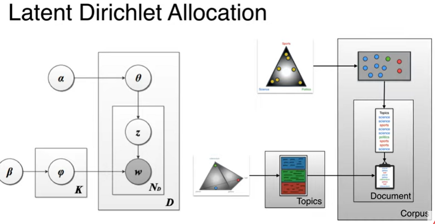
      
      - 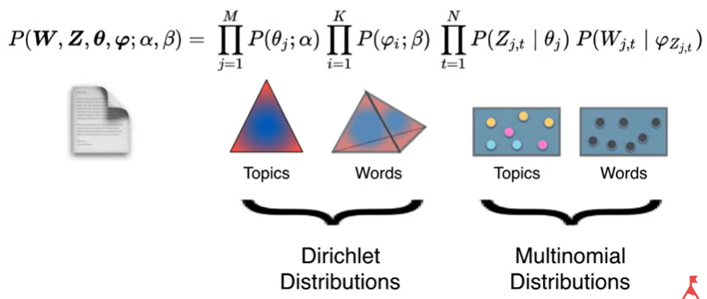
      
      - 
        
        - 1). Dirichlet $\alpha$ 로부터 각 Topic의 확률분포 $\theta_j$ 를 추출한다. $P(\theta_j; \alpha)$
        
        - 2). $\theta_j$분포에 맞춰 Topic을 Random하게 샘플링한다. $\prod_{i=1}^N P(Z_{j,i}|\theta_j)$
        
        - 3). 샘플링한 Topic을 단어별 유사도 비율을 추출한다.$\prod_{i=1}^KP(\psi_i;\beta)$
        
        - 4). $\psi_{z_{j,i}}$에 맞춰 단어를 샘플링하여 문서를 제작한다. $P(W_{j,i}|\psi_{z_{j,i}})$
        
        - → Dirichlet 분포에 따라 샘플링한 $\alpha$들 중 가장 Topic, 단어에 가깝게 모으게 한 $\alpha$ 를 Topic으로 선정한다.
          
          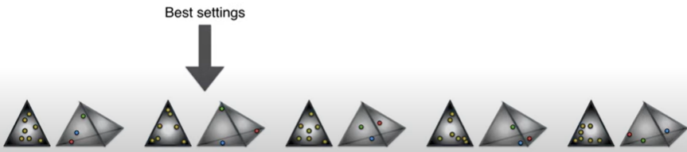
      
      > **Dirichlet distribution**
      > 
      > 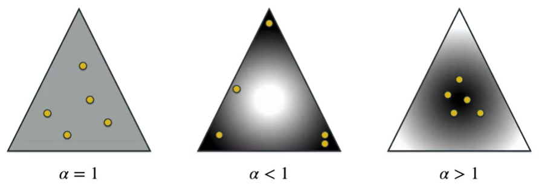
      > 
      > 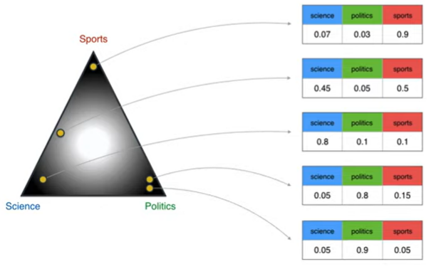
      > 
      > 각 점을 잘 포함하는 것을 꼭지로 삼았을 때 점으로 모여든다.
      > 
      > 반대로 잘 포함하지 못할 경우 중간으로 모이게 된다.
      > 
      > → 즉, Topic을 잘 설정하였을 경우 중간의 사례처럼 모이게 된다. 
      > 
      > → 또는 각 단어별로 Topic의 위치를 파악하는데 사용한다.
      > 
      > 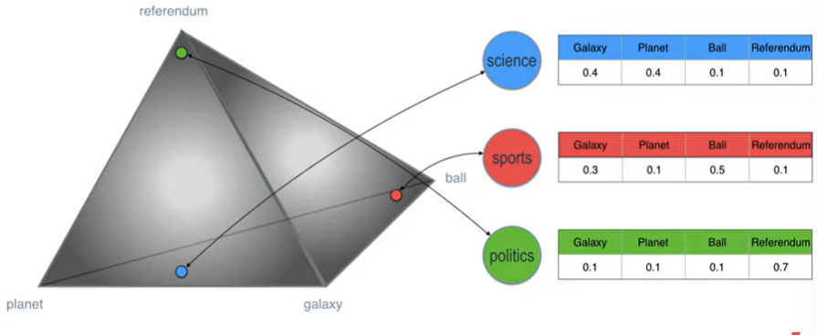
      > 
      > + Dirichlet distribution은 Topic의 개수만큼의 dim을 필요로 한다. 
    
    - **How to train? - Gibbs sampling** 
      
      - 각 문서의 Word들이 어떤 Topic으로 많이 분류되었는지를 기반으로, 해당 문서의 Topic의 확률로 계산한다 .
      
      - 반대로 동일한 Word가 서류 전체에서 어떤 Topic으로 많이 분류되었는지를 기반으로, 해당 Word이 특정 Topic으로 할당될 확률로 계산한다.
        
        → 각 단어와 문서가 가능한 단일 Topic으로 정리하고자 한다. 
      
      - Gibbs Sampling은 한번에 1개씩만 수정하도록 문제를 축소해준다. 
        
        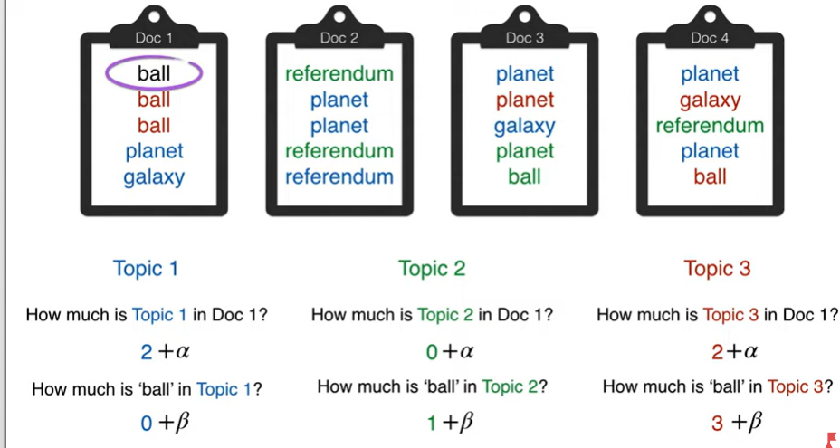
        
        > 한 단어에 대해서 Topic이 지정이 안되었다고 가정하고, 
        > 
        > 1). 해당 문서에서 단어들이 어떤 주제로 가장 많이 분류되었나,
        > 
        > 2). 전체 문서해서 해당 단어가 어떤 주제로 가장 많이 분류되었나
        > 
        > 를 곱하여 가장 높은 값을 가진 것으로 할당하자! 
        > 
        > *이때, 1).2). 중 1개라도 0이면 아예 값이 사라짐. 이를 방지하고자 상수 $\alpha, \beta$ 를 더해 막아줌. 
        > 
        > **→ 이 과정을 통해서 점차 좋은 값으로 할당해나갈 것임!**

- **LDA와 PMF을 함께 사용하여 Item에 대한 Update를 진행하자!** 
  
  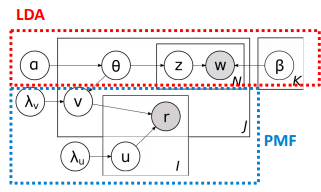
  
  > $v_j$ : Item Latent Vector. LDA와 PMF의 연결점 
  > 
  > - LDA는 Item update에만 영향을 준다. 
  > 
  > $u_i$ : User Latent Vector 
  
  - Item Latent Vector $v_j$ 는 Topic 별 확률분포 $\theta_j$ 에 근처에 있다. 
    
    > $v_j \sim N(\theta_j, \lambda_v^{-1}I_K)$
    > 
    > > $v_j = \epsilon_j + \theta_j$
    > > 
    > > $\epsilon_j \sim N(0, \lambda_V^{-1}I_k)$
  
  - $v_j$가 $\theta_j$ 와의 연관성을 고려해야한다는 것 외에는 $u_i$ 와 유사한 식을 사용한다. 
    
    > 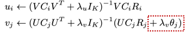

- CTR은 Collaborative learning과 다르게 Cold-start 문제를 해결할 수 있다.
  
  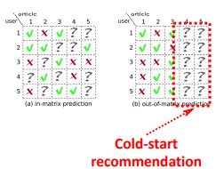
  
  > Collaborative learning은 다른 사람들의 평가를 꼭 필요로 함. 
  
  - CTR에서는 평가($r_{ij}^*$)를 아래와 같이 계산하여, Cold-start에서도 활용가능하다 
    
    > $r_{ij}^* \sim (u_i^*)^T(\theta_j^* + \epsilon_j^*) = (u_i^*)^Tv_j^*$
    > 
    > $r_{ij} \sim (u_i^*)^T\theta_j^*$   [Cold Start 상황으로 $\epsilon_j^*$ 값이 없음]

#### Collaborative deep learning for recommender systems(CDL)

- **Idea : Model documents with stacked denoising autoencoder(SDAE), and combine it with PMF**
  
  > 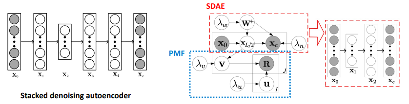
  > 
  > CTR과 동일하게 Item Latent variable $v$ 를 통해서 SDAE를 통해 학습한 것을 PMF에 넘겨준다. 
  
  > 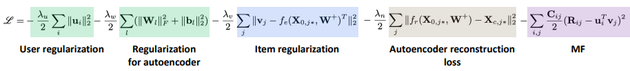
  > 
  > 각 작업별 Regularization이 붙는다. 
  > 
  > 추가로 정보를 고려하고 싶으면 Regularizion form으로 추가할 수 있다. 
  > 
  > <mark>Q. Regularization 끼리 서로 상충되는 경우가 발생안하나? Regualization끼리 상성이 있을 것 같은데? 질문하고 싶군!</mark>

##### Convolutional MF For Document Context-Aware Recommendation (CONVMF)

- 문제제기 : 이전 방식인 CTR, CDL의 경우 단어의 순서와 맥락을 고려하지 못했다

- Idea : Convolution Network를 통해 맥락을 고려하고 이를 PMF와 연결한다. 
  
  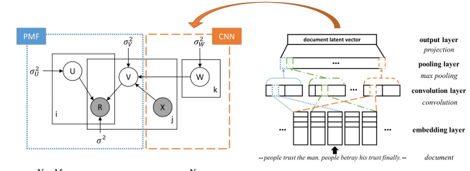
  
  > 이때 문서를 서로 다른 Chunk로 나눠 입력한다.
  > 
  > ex)- 원본 : People trust the man. people betray his trust finally. 
  > 
  > 1). People trust the man
  > 
  > 2). trust the man. people
  > 
  > 3). the man. people betray 
  > 
  > .... 

- Loss 함수는 앞서 도입한 방법과 크게 다르지 않다. CNN 도입에 따른 Regularization form이 변경되었다. 
  
  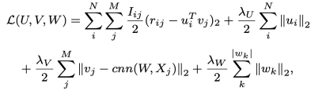

----

#### Image information : HDC, VBPR, DVBPR, VPOI

- Idea : Item Images가 Item의 Latent variable을 학습하는 데 도움이 될 것! 

##### Learning Visual clothing style with <mark>h</mark>eterogeneous <mark>D</mark>yadic <mark>c</mark>ooccurrences (HDC)

- Task : "어떤 옷이 신발과 잘 어울릴까"에 대해 답해보자! 

- Idea : user behavior data에서 Co-occurrence에 기반하여 모델 호환성을 쌓자
  
  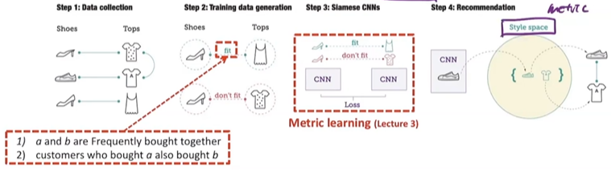
  
  > 함께 구매했던 것을 fit(+) 으로 고려하며, 함께 구매하지 않은 것을 (-)로 부여함 
  > 
  > 각각을 CNN을 통해서 학습한 다음 Top-K Item에 대해서 추천한다.

##### <mark>V</mark>isual <mark>B</mark>ayesian <mark>p</mark>ersonalized <mark>R</mark>anking from Implicit feedback(VMPR)

- Idea : 시각적 특성을 BPR에 함께 반영한다. 

> 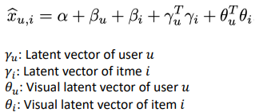
> 
> - 이때 Visual latent vector of item i $\theta_i$ 은 CNN을 통해서 생성한다! 

> 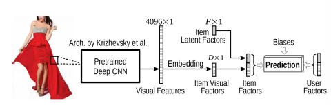
> 
> 여기서 Item Visual Factor을 $f_i$(D-dimension)를 의미한다. 
> 
> $\theta_i$(f-dim) 는 $f_i$에  Transformation Matrix(F x D) E를 곱함으로서 계산한다. 
> 
> > $\theta_i = Ef_i$

> 추가로 BRP Loss를 추가하여 Fit(+), not fit(-)의 차이를 부각시킨다. 
> 
> 
> 
> > $\hat x_{u,i} : $ Fit data (+)
> > 
> > $\hat x_{u,j}$ : Not fit data (-)

- VMPR은 다른 방법에 비해 성과가 많이 향상시킨다.
  
  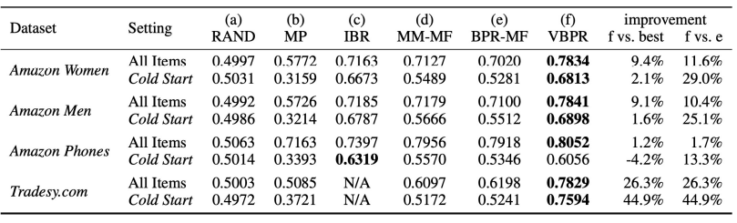
  
  - 특히 Cold Start에서도 상당한 성능을 내고 있음을 확인할 수 있다. 

##### Visualy-Aware fashion Recommendation and Design with generative Image models(DVBPR)

- Idea : Item 추천을 넘어 유저가 선호할 만한 상품의 이미지를 생성하자! 
  
  

- VBPR의 문제 : Item visual feature vector가 고정되어 있다. 
  
  - VBPR에서 Visual Image의 특성을 학습한 Deep CNN을 end-to-end로 연결하자
  
  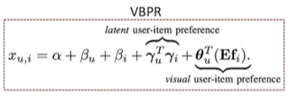
  
  > $f_i$ 가 고정되어 있다! 
  
  - 여기서 $x_{u,i} = \theta_u^T \phi(X_i)$ 로 바꾼다. 
    
    > $\phi$ 은 CNN을 의미하며, $X_i$은 Input을 의미함. 
    > 
    > 즉, CNN을 통해서 Item visual feature vector의 여러 형태를 가져온다. 
    
      

- 또한 Personlized fashion recommendation을 넘어, Gan, CGAN을 통해 Personlized fashion design을 제공하자! 
  
  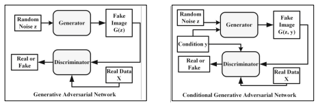
  
  > 둘의 차이는 조건부 확률을 쓰냐, 안쓰냐의 차이임. 
  > 
  > 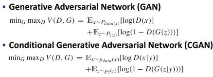

- 마지막으로 유저의 선호도를 maximize하는 realistic image를 생성한다.
  
  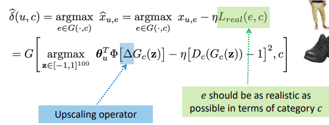
  
  > 기존의 Top-k Item을 추천하는 것의 구조와 동일. 
  > 
  > Argmax 대상만 실제 데이터에서 생성 데이터로 바꾼 것 
  > 
  > upscaling operator은 중요하지 않음

##### What your Images reveal : Exploiting visual contents for point-of-interest recommendation(VPOI)

- Idea : 시각적 정보와 함께 Point-of-interest(POI) 추천을 향상시키자
  
  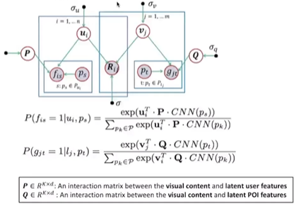
  
  > 유저가 평소 관심있던 것(POI)와 시각적 정보의 관련성(Q)과 시각적 정보와 유저특성관의 관련성(P)를 추가적으로 고려해준다. 

