### 5주차 - Sequential Recommendation & Graph-based Recommendation

##### Outline

- Sequential recommendation 
  
  - FPMC, TVBPR, TransRec 

- Session-based recommendation 
  
  - GRU4Rec, HRNN, NARM 

- Graph-based recommendation 
  
  - SR-GNN, GC-SAN, NGCF, LightGCN, DGCF 

-----

#### Sequential Recommendation

- Goal : 과거의 사건을 고려하여 유저가 좋아할만한 successive item을 추천하자 

- Challenge 
  
  - User interests are dynamic 
  
  - Sequential pattern is of crucial importance : Item, 유저 모두 고려 필요 

##### Factorizing personalized Markov Chains for Next-Basket Recommendation(FPMC)

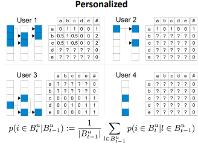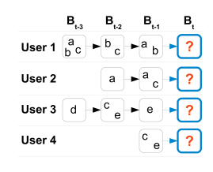

- 각 유저에 대해서, 이전과 이후를 비교하여 i -> j 의 가능성을 계산함 
  
  > ex)- User 1에서 1->2, 2->3 동안 시작 부분에 b가 나온 경우는 2번. 
  > 
  > 2번 동안, 끝에a가 1번, b가 2번, c가 1번 나왔으니, 각 확률은 0.5, 1, 0.5 이다.  

- 단 이 방식은 한계가 있다. 
  
  - Observed data가 적어서 모든 parameter을 측정할 수가 없다. 
  
  - 너무 소수의 Data로 각 Transition의 확률을 계산한다. 
  
  -> Latent foctor model을 적용한다. 

- Idea : Jointly Factorize the matrices 
  
  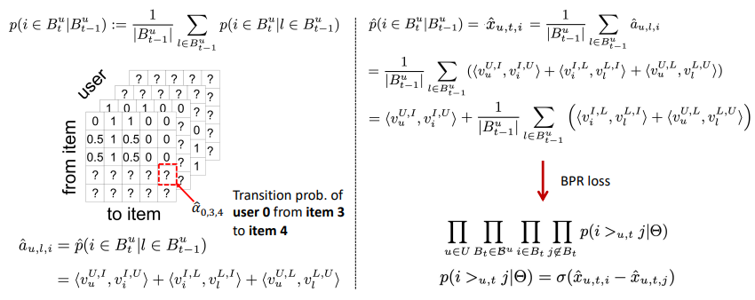
  
  > Item i -> Item j 의 Transition과 각 User들을 고려하면 3차원이 된다. 
  
  - 3차원의 Transition prob $\alpha$ 는 User-Item, Item-Latent, Latent-User의 내적으로 근사한다. 
  
  - 이후 근사한 Transition prob $\hat \alpha$를 기반으로 처음의 $P(i\in B_t^u|B_{t-1}^u)$ 를 구한다. 
  
  - 마지막으로 BRP loss를 통해 결과값을 산출한다. 

##### Ups and Downs : Modeling the visual evolution of Fashion Trensd with One-class collaborative Filtering(TVBPR)

- Motivation : Modeling user preferences in domains like fashion is difficult due to evolution of fashion trend over time **[Dynamic 해진다]**
  
  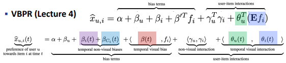
  
  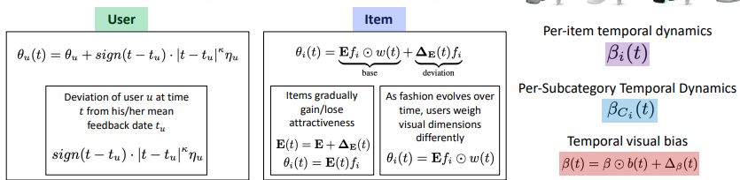
  
  > ex)- u 의 값이 1,2,5,7 이였다면, $t_u$는 그 평균이다($\frac{1+2+5+7}{4} = 4$)
  
  - $\theta_u$ 는 시간이 흐름에 따라 계속 변하는 것을 sign과 시간 차의 곱으로 표현한다. 
  
  - $\theta_t$ 는 Base와 Deviation의 합으로 고려한다. 
    
    - Base는 Item 자체가 점차 매력이 상승/ 하강하는 것을 
    
    - Deviation은 Fashion 유행의 변화를 의미하며, 유저별로 다르게 weight를 준다. 

##### Translation-based ReCommendation(TRANSREC)

- Idea : Apply Translation Mechanism to sequential recommendation
  
  > Translation Mechanism : 각 의미의 연관성 고려 
  > 
  > ex)- Barack Obama + nationality => United States 

- $\gamma_i + t_u \sim \gamma_j$ <=> t time의 Item $\gamma_{t}$는 t-1 time의 $\gamma_{t-1}$과 유저 $t_u $ 의 합과 유사해야 한다. 
  
  - 이 Metric space에서는 Neighborhood와 Translation을 성립한다. 
    
    > Neighborhood : 유사성 개념으로 사용 
    > 
    > Translation : 다양한 의미론적 Transition 관게를 표현 
  
  - 두 조건을 통해서 Triagle inequality를 충족된다. 
    

- Triangle inequality을 활용해서 <mark>Data Sparsity issue를 해소</mark>한다. 
  
  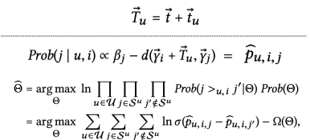
  
  

##### Personalized Top-N Sequential Recommendation VIa convolutional Sequence embedding(CASER)

- Motivation : Markov Chain-based 방식은 오직 Point level interaction만 고려한다. 
  
  - 하지만 Union-level sequential patterns(with or without skip)이 중요하다. 
    
    > ex)- 빵은 Butter와 Milk 둘다로 구성된다. 하지만 Milk, Butter 단독으론 빵을 만들지 못한다.
    
    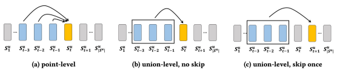
    
    > Skip의 경우 중간에 쓸데없는 것이 포함되었을 때 쓸데없는 연관성을 고려하지 않기 위함이다.
    > 
    > ex)- 호텔에 도착하여 Attraction을 하는 과정을 볼 때, 중간에 잠시 음식점을 들렸다고 하자. 그런데 음식점은 호텔 Attraction과 관련성이 없다. 
  
  

- Use association rule mining to validate the assumption 
  
  > ASsociation rule mining에 대해선 "Mining association rules between sets of Items in large databases" 를 참고할 것 
  
  > $Confidence(X->Y) = \frac{sup(X,Y)}{sup(X)} = \frac{N_{X->Y}}{N_X}$
  > 
  > > sup : num of occurence 
  > 
  > 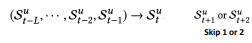에 대해서 Confidence를 계산한다. 

- Idea : Capture union-level patterns by CNN 
  
  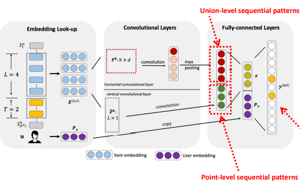
  
  > L : Num of Item 
  > 
  > H : Skip 후 남은 개수. (ex- H=L 이면 no Skip, H = L-1 이면 Skip 1)
  > 
  > F : Convolution filter. 
  > 
  > - Horizontal convolution filter은 Item embedding을 각 Row 별로 representation 진행. Union-level sequential 을 의미 
  > 
  > - Vertical convolutional filter은 각 column 별로 representation. Point-level sequential pattern을 의미 
  > 
  > T : 미래에 Interaction할 Item들. 마지막 Fully-connected layer 에서는 1의 값으로, 나머지들은 0으로 배정되어야 함 
  
  
  
  > -> 이후에 Cross loss를 계산함으로써 모델을 학습할 것 
  > 
  > 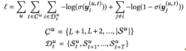
  
  > 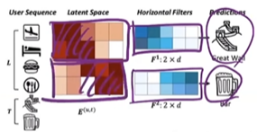
  > 
  > > 붉은 색 일수록 큰 값을 가짐 
  > 
  > - 이미 고려했던 4개 상황을 볼 때, Latent variable의 앞쪽 부분은 place와 연관되며, 뒤쪽은 음식과 관련된다. 
  > 
  > - 따라서 이후 나올 Great wall 과 Bar의 Latent variable의 유사성을 고려하여 이후 선택지를 고른다. 

-----

#### Session-based recommendation

- Session : Multiple user-item interactions that happen together in a short period of time 
  
  > 짧은 시간 내에 고려했던 품목들. 당시의 목적과 의도를 유추
  > 
  > ex)- 쿠팡에서 휴대폰 관련해서 확인하려고 관련 기기 잠시 찾아보기 

- Challenge 
  
  - Session은 각 유저 id와 연계되지 않는다. 
  
  - Sessong은 짧다 
  
  - User ID를 안다고 해도 어떻게 long-term, short-term session과 연결시킬 것인가? 

##### Session-based recommendations with Recurrent neural networks(GRU4REC)

- Idea : Session 속 유저 sequence에 RNN을 활용한다. 
  
  - Item에 대한 Click을 sequence로 고려한다. 
  
  - 전체 Session을 모델링 함으로써 보다 정확한 추천을 제공한다.
  
  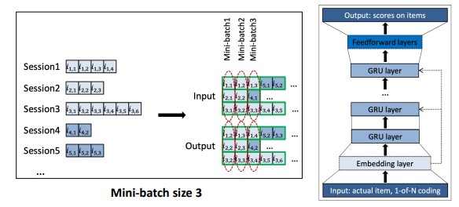
  
  > GRU는 RNN 발전 버전. Gate 적용 
  > 
  > $i_{i,j} -> i_{i,j+1}$ 식으로 Prediction 
  
  - 이후 BRP loss를 통해서 모델을 학습시켜준다.

##### Personalizing session-based recommendations with hierarchical recurrent neural networks(HRNN)

- Motivation : User profile을 활용할 수 있는 Domain이 있따. 

- Idea : RNN 모델을 personalized 하자 with cross-session information transfer 
  
  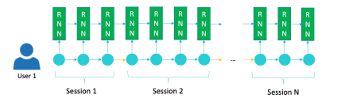
  
  - 단 단순히 Concetane 하는 것은 성능이 거의 없다. 

- Solution : User와 Session representation을 구분한다. 
  
  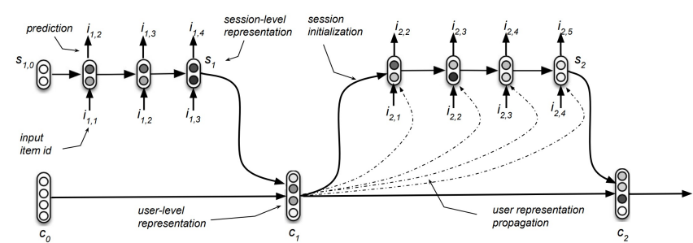
  
  > Session과 User를 각각 RNN 활용한다. 
  
  <mark>-> User가 달라지면, 결과가 달라진다.</mark>

##### Neural Attentive session-based recommendation(NARM)

- Motivation : 과거 session 중 현재 session의 user의 목적이 강조되지 않는다.(똑같이 여겨진다)
  
  - 현재 session과 유사했던 session들을 강조하자. 
  
  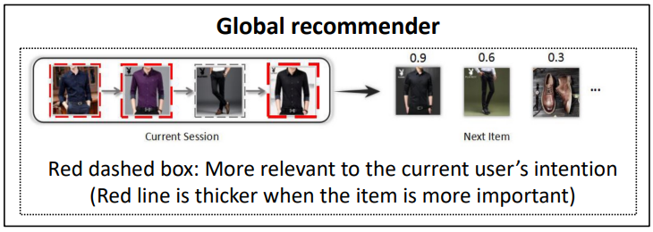
  
  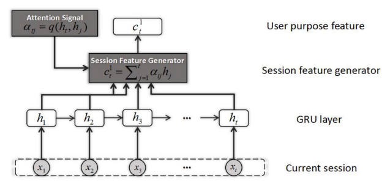
  
  > Session feature generator 속 $\alpha$ : attention weight 

- <mark>즉, Attention mechanism 도입하여 문제를 해결한다.</mark>
  
  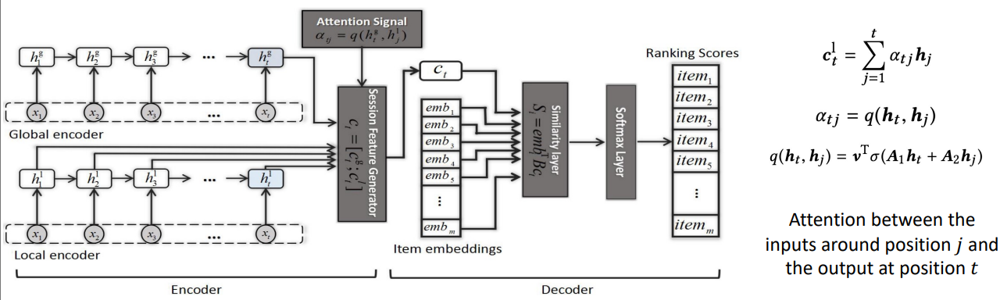

------

### Graph-based recommendation

##### Session-based recommendation with graph Neural networks(SR-GNN)

- Motivation : 이전 방식들은 Item의 Complex transition을 고려하지 못한다. 
  
  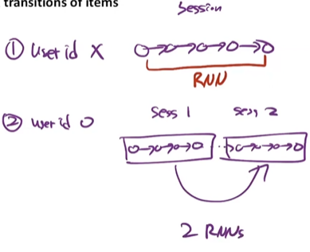
  
  > 기존 방식에선 Session 간 관계는 고려하나, 
  > 
  > 각 session 간의 각 노드별 이동에 대해선 고려하지 못한다.
  
  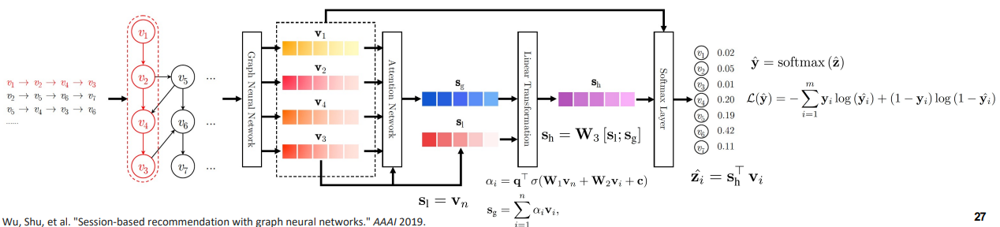
  
  > ex)- user id가 없는 경우.
  > 
  > 가장 왼쪽에 노드간의 이동이 자유분방하게 이동하고 있다. 
  > 
  > 이 경우 Graph는 각각의 이동을 모두 고려할 수 있다. 
  
  > $s_g$  : 각 노드의 Attention weighted 된 Global embedding
  > 
  > $s_l$ : 마지막 node의 embedding

##### Graph Contextualized self-Attention Network for session-based recommendation(GC-SAN)

- Idea :  Apply self-attention mechanism to adaptively assign weights to previous items regardless of their deistances in the current session 
  
  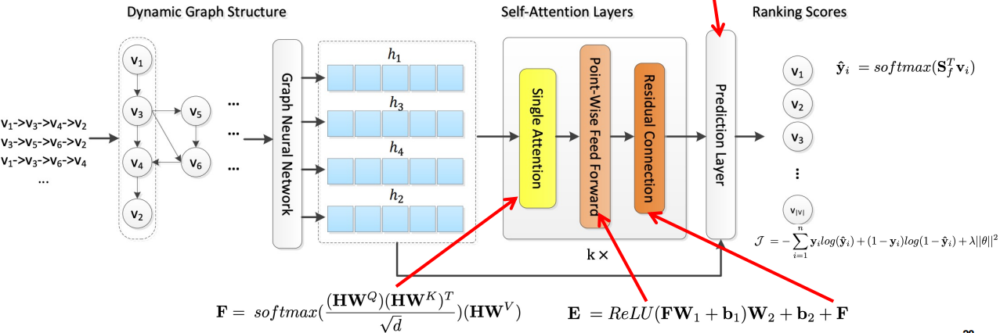

##### Neural Graph Collaborative filterin(NGCF)

- Idea : Integrate the user-item **high-order interaction**s into the embedding process 
  
  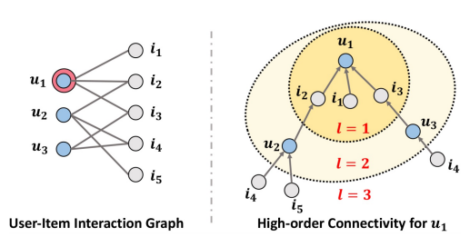
  
  > $u_1, u_2$는 $i_2$ 와 연관되어 있다는 점에서 서로 유사할 것이다. 
  > 
  > $l=3$ 일 때, $i_4$ 는 $i_5$ 보다 $u_1$에 관련될 확률이 크다. $i_4$ 는 2개의 path가 있는 반면, $i_5$ 는 1개의 path만 있기 때문이다. 
  
  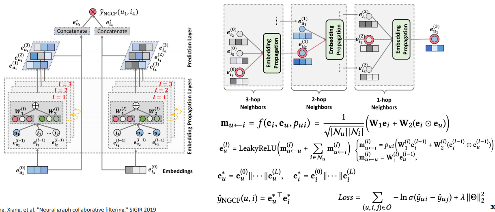
  
  - 알고 싶은 관계(ex- u1과 i4)를 알기 위해, 각각의 High-order에 대해서 Latent variable을 계산한다. 
    
    - 이때 high-order의 결과를 한 차원 아래에 전달하는 형태로 계산양을 줄인다.
  
  - 이후 Concatenate하여 $e_{u_1}$ 와 $e_{i4}$ 를 구한 후 유사도를 계산한다.
    
    

##### Simplifying and powering graph convolution network for recommendation(LightGCN)

- Idea : Feature transformation and nonlinear activation of GNN in NGCF is not beneficial 
  
  - NGCF를 단순화 하자 
    
    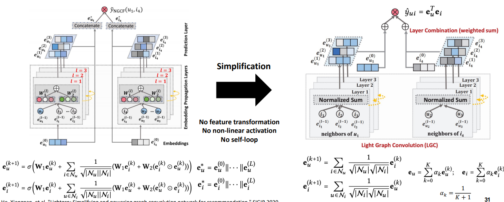

##### Disentangled graph collaborative filtering(DGCF)

- Motivation : 유저별로 아이템을 사용하는 의도가 다르다. 
  
  - 이전의 방법들은 각각의 Item에 대한 의도를 구분하는데 실패했다. 
  
  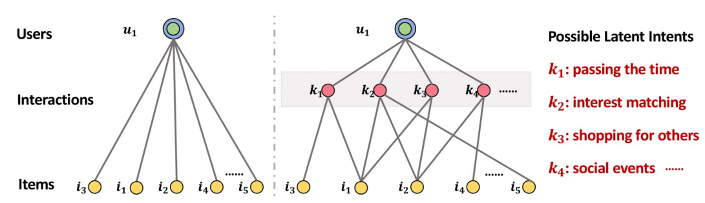
  
  > k : Latent variable about Intents. 사전에 의도가 정리되어야 함. 
  
  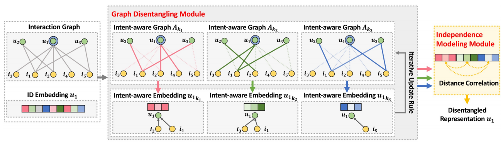
  
  > k=3 인 경우. 
  
  - 각각의 k에 대해서 Item과 유저간의 관계를 embedding 한다. 
    
    - 그런데 어떻게..? 
  
  - 의도를 고려하지 않고 관계를 따졌을 때(가장 왼쪽-S)과, 각각의 의도를 구분하여 합친 Distance Correlation(가장 오른쪽)을 만든다. 
    
    - 이때, Distance Correlation 간의 차이를 명확하게 만들수록 각 의도별 특징이 부각된다.
  
  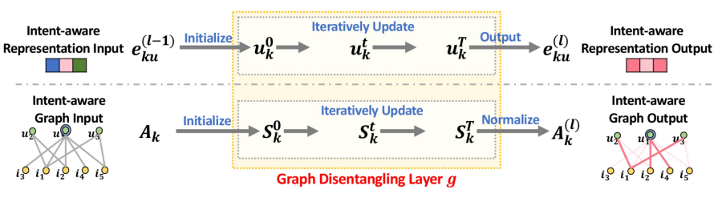
  
  - 각 의도별 차이를 부각시키면서 이를 기반으로 $u_k, S_k$ 을 update 시킨다. 
    
    > 식은 논문 참고 

