### 6주차 - Introduction to Graph-basd ML

###### Graph

- 정의 : 데이터와 그들 사이의 관계에 대한 일반적인 표현 
  
  > Graph G = (V,E) 로 정의된다. 
  > 
  > > V : set of nodes 
  > > 
  > > E : set of edges between these nodes 
  > 
  > > node i  -> node j 는 (i,j) $\in E$ 로 표현된다. 
  > 
  > Feature information $X \in R^{|V| * F}$
  
  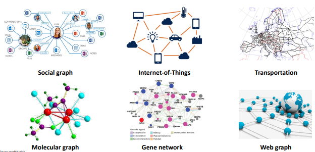
  
  > 수많은 형태의 자료들이 Graph로 이뤄져 있다. 

- **Graph의 종류들** : Raw data를 Network로 표현할 때 데이터를 잃지 않아야 한다.
  
  - Undirected / Directed 
    
    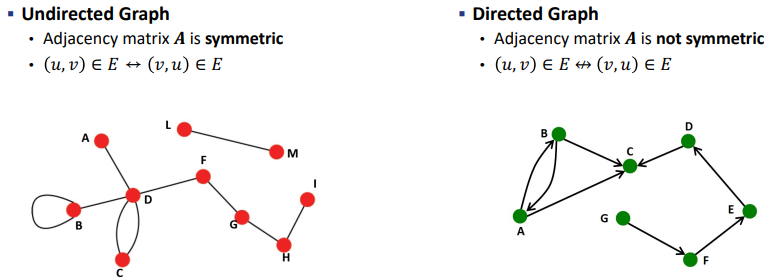
  
  - Homogeneous network : Single type of node and egde 
  
  - Heterogeneous network : Multiple types of nodes and edges 
    
    - Multiplex network : Single node type & Multiple edge types 
      
      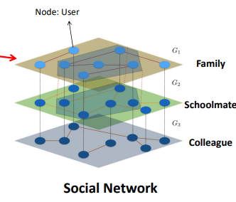
      
      > 동일한 노드에 대해서 서로 다른 관계를 확인할 수 있음 
    
    - Bipartite graph : Node를 두 disjoint sets U and V로 구분 
      
      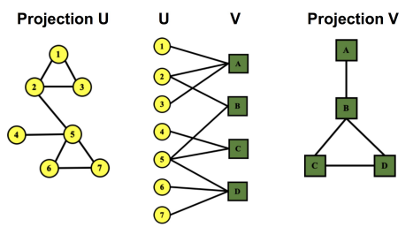
      
      > 이때 U, V는 서로 Independent sets이다. 
      > 
      > 또한 각각의 Projection 형태의 연결을 원본 그래프로 표현할 수 있다. 
      > 
      > - ex)- A 는 2번 노드을 통해 B와 연결되어 있다. 
      > 
      > - ex)- 4는 C 노드를 통해 5와 연결되어 있다.   

- Traditional Graph Representation 
  
  - Adjacency matrix를 활용
  
  - 문제점 
    
    - 데이터에 빈 값이 너무 많다. 
    
    - 고차원일 경우 표현을 잘 못했다. 
    
    - 계산이 복잡하다 
    
    - "의미"를 잘 표현하지 못했다.
  
  <mark>→ 보다 Graph를 잘 Representation을 하기 위해 Deep learning을 도입하자!</mark> 

- Challenges 
  
  - DNN은 정형화된 구조에 적용가능했다. 
  
  - Graph는 너무 복잡했다. (임의의 구조, 서로 다른 타입의 node와 edge, 큰 Dataset)

----

**Machine learning on Graphs - Classic**

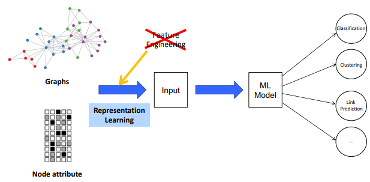

> 기존의 Feature engineering이 맡았던 역할을 Representation leaning이 수행한다. 
> 
> Good Representaion은 기본이다! 
> 
> <mark>→ Machine Learning = Representation + Objective + Optimization </mark>

- Node Classification : predict a type of a given node 

- Link Prediction : Predict whether two nodes are linked 

- Community detection : Identify densily linked clusters of nodes 

- Network similarity : How similar are two (sub) networks 

###### Typical Tasks

- Node-level tasks
  
  - Node label classification 
  
  - Node label regression

- edge-level tasks
  
  - Link label classification (ex- link prediction, relation classification)

- Graph-level tasks 
  
  - Graph label classification
  
  - Graph label regression
  
  → Molecular property prediction, Scene understanding
  
  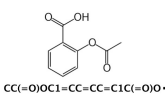 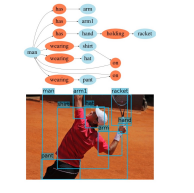
  
  > Graph의 전체 구조를 알아야만 특성을 설명할 수 있는 경우. 
  > 
  > 부분으로 쪼개면 그 의미를 잃음 

---- 

#### Traditional Methods

- 효과적인 특성(feature)을 쓰는 것이 성능을 올리는 핵심이다. 

- Traditional Methods는 Hand-crafted features를 사용한다. 

###### Node-level features

- 목표 : Network 상에서 노드의 구조와 위치를 특징잡자(Characterize)!
  
  - Node degree : 각 노드별로 연결된 edge의 개수
    
    - 한계 : 모든 이웃들이 동일하게 여겨진다. 
    
    
  
  - Node centrality : 각 노드별 중요도를 고려한다. 
    
    -  Eigenvector centrality : 각 노드별 할당된 eigenvalue를 기반으로 측정 
      
      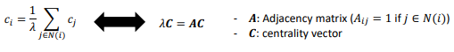
      
      > $c_i$ : Eigenvector. 가장 큰 Eigenvalue에 할당된 Eigenvector을 Centrality를 위해 사용한다.
    
    - Betweenness centrality : 각 노드 간 최적 루트 간 node i가 포함되는 경우의 수
      
      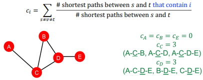
    
    - Closeness centrality : 각 노드간 가장 짧은 path length 일 수록 중요 
      
      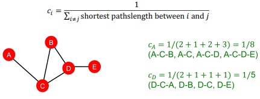
  
  - Clutering coefficient : 이웃들이 서로 연결되는 비중에 따라 측정 
    
    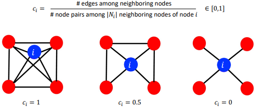
  
  - Graphlets : 서로 연결되어 있는 induced non-isomorphi subgraph
    
    > induced subgraph : 어떤 노드들을 선택했을 때, 해당 노드들 사이에 연결된 모든 엣지를 포함하는 subgraph 
    
    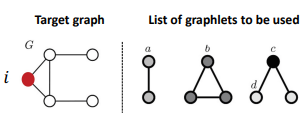
    
    - Graphlet degree vector(GDV) :  주어진 노드별로 Graphlet의 개수 vector 측정
      
      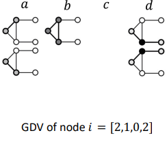

- Edge-level Feature 
  
  - 목표 : 두 노드 간에 연결되어야 하는지 판단 
  
  - Distance-based feature : 두 노드간 가장 짧은 path 거리 기반 
    
    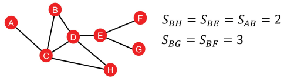
    
    - 한계 : 각 이웃들의 Degree 간 겹치는 점을 무시함 
      
      > B와 H 노드는 C,D 노드를 공유함 
      > 
      > B와 E는 1개 노드를 공유함 
      > 
      > → 위의 정보를 사용하지 못함 
  
  - Local neighborhood overlap 
    
    - 목표 : 두 노드간의 공유하는 이웃들의 개수를 파악하자 
      
      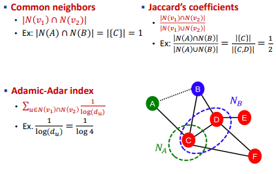
    
    - 한계 : 아무런 이웃을 공유하지 않을 때 항상 0의 값이 나온다. 
      
      - 그럼에도 각 노드간에 연결될 경우가 나타날 수 있다. 
        
        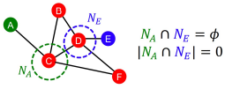
  
  - Global neighborhood overlap
    
    - Kats index : 주어진 두 노드 간 k 의 Length를 가진 Path의 수 
      
      > $P^{(K)}_{ij}$ = num of patths of length K between node i and node j
      > 
      > Adjacency matrix의 K 제곱으로 표현 가능 
      > 
      > 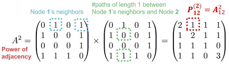 
    
    - 각 kats index 별로 discount factor $\beta$ 도입하기 
      
      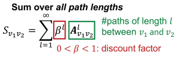
      
      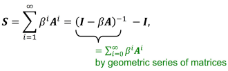

