### 7주차 - Node lovel Network Embedding

##### Outline

- Overview

- Homogenous Network Embedding

- Multi-aspect Network Embedding

- Attributed Network Embedding

- Heterogeneous Network Embedding

- Task-guided Network Embedding

-----

##### Overview

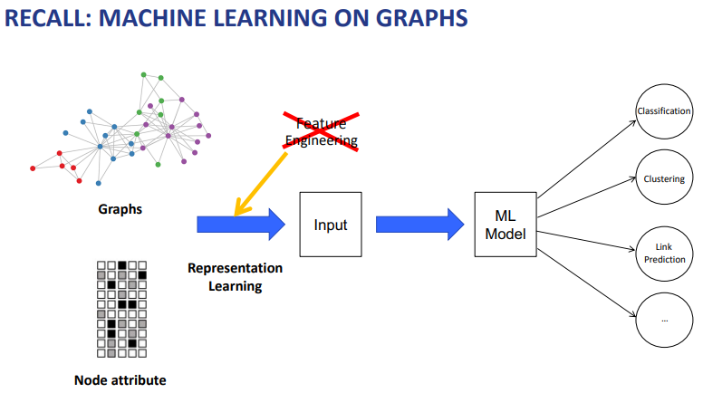

- Representation Learning은 기계가 자동으로 특징을 추출한다! 

 

##### Graph representation learning

- goal : Original network와 유사하게 Embedding Space로 node 정보들을 Encode 하자!
  
  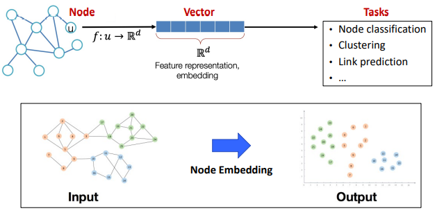
  
  > Embedding 한 후에도 기존 공간에서의 정보가 유지되도록 한다.
  
  - Embedding은 각 Task와 독립적으로 진행된다. 
  
  - Embedding 된 Vector들은 각각의 Task에서 활용된다. 

 

##### Node embedding

- 고려해야할 2가지 
  
  - 1). 어떻게 node들을 encode 할 것인가? -> Encoder
  
  - 2). Similarity(유사성)을 Embedding 공간에서 어떻게 정의할 것인가? -> Decoder

###### Encoder

- 목적 : 각 노드들을 저차원의 Vector로 Mapping한다. 
  
  > $ENC(v) = z_v$
  > 
  > > $v$ : Node in the input graph
  > > 
  > > $z_v$ : d-dimensional embedding vector 

- 가장 단순한 Encoding 접근은 One-hot vector을 통한 Embedding-look up 이다. 
  
  > 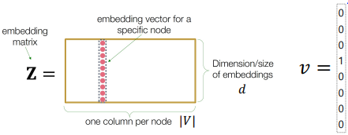

 

###### Decoder(similarity fuction)

- 어떻게 original graph의 관계를 Embedding space의 관계로 Mapping할지 구체화한다.
  
  > 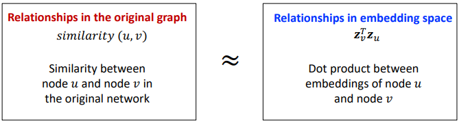

 

###### Encoder + Decoder Framework (Simplest version)

- 목적 : Maximize $z_v^Tz_u$ for node pairs (u,v) that are similar 
  
  - decoder를 $z_v^Tz_u$로 설정했기 때문 

- Node similarity를 정의하는데 있어 여러 방안이 있다. 
  
  - Node 간 연결되었는가? 
  
  - 동일한 이웃을 공유하는가?
  
  - 유사한 구조적 역할을 맡고 있는가? 
    
    +ETC 

---------------

##### Homogeneous Network Embedding

###### Random walk

- 방법 : Starting Node에서 시작하여, 갈 수 있는 neiborhood node들을 전략에 따라 확률적으로 이동하여 이동한다.

- 의도 :  **Random walk는 Local, High-order neighborhood 정보 모두 고려할 수 있다.**
  
  > 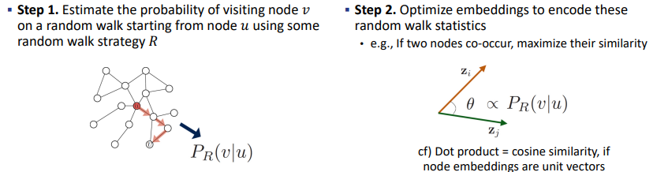
  > 
  > Strategy R이 무엇이냐에 따라서 Random walk의 방식이 달라짐 
  > 
  > 노드 간 거리가 가깝고, 연결 Egde가 많을수록 확률값이 높다. 
  > 
  > 노드 간 거리가 멀고, 연결 edge가 적을수록 확률값이 낮다. 
  > 
  > <mark>-> 확률값이 얼마나 Similar 한지를 반영하고 있다. </mark>

 

##### Random Walk-based node embedding

- Input : G = (V,E)

- Goal : Mapping 함수 $f : u -> R^d $ for $u \in V$  을 학습하자! 
  
  > $f(u) = z_u \in R^d$

- 과정 
  
  - 1). 일부 Random walk Strategy R 기반으로 고정된 길이의 Random walk을 각 node 별로 진행한다. 
  
  - 2). 각 노드 $u$에 대해서 Random walk를 통해 방문했던 Node들의 set $N_R(u)$ 을 만든다. 
    
    > 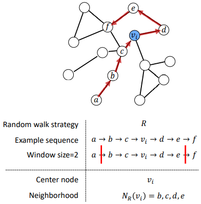
    > 
    > Q. a와 같이 구석에 있는 값들은 어떻게? 중간에 있는 값을 선택하는 거라면 a는 언제나 중간 값이 될 수가 없는데? 
    > 
    > - Latent variable이 Input variable과 동일한 크기라는 것은, 모든 노드에 대해서 $N_R$ 이 나와야 한다는 건데. 그냥 $N_R$ 이 없다고 치면 되나? 
  
  - 3). $max_f \sum_{u\in V} logP(N_R(u)|z_u)$ 을 만족시키도록 Embedding을 최적화시킨다.
    
    > 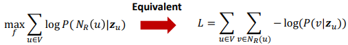
    
    > $P(v|z_u)$ 은 Softmax를 통해서 Parameterize 한다.
    > 
    > > $P(v|z_u) = \frac{exp(z_u^Tz_v)}{\sum_{j \in V} exp(z_u^Tz_j) }$
    > 
    > 단, 분모의 $\sum_{j \in V} exp(z_u^Tz_j)$은 $O(|V|^2)$ 의 계산 복잡도를 가지고 있어 다른 방식이 필요하다. 
    
    > By Noise Constractive Estimation(NCE), 
    > 
    > $P(v|z_u) = \frac{exp(z_u^Tz_v)}{\sum_{j \in V} exp(z_u^Tz_j) } \sim log(\sigma(z_u^Tz_v)) - \sum_{j=1}^k log(\sigma(z_u^Tz_j))$
    > 
    > > $\sigma(x) = \frac{1}{1+e^{-x}}$
    > > 
    > > $j \sim P_V$. s.t. $P_v$ : Random distribution over nodes 
    > 
    > -> 전체 노드에 대해서 정규화를 해주는 것이 아니라, 중요한 k개의 샘플(Negative samples)에 대해서만 정규화해준다. k개의 샘플링은 각 노드의 degree를 고려한다.
    > 
    > - Q. 고려해주는 방식은 Distribution을 통해서겠지? 코드 확인해보면 될 부분인 듯 
    
    > 최적화 간 모든 node에 대해서 gradient descent를 하는 것이 아닌, 각 단일 노드에 대해서만 진행한다. 
    > 
    > - 전체에 대해서 update 하는 것은 계산양이 많아 비현실적이다.
    > 
    > 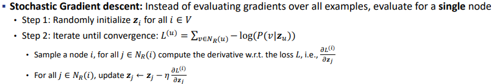

 

###### Random walk의 전략 R에 따라서 $N_R(u)$를 만드는 방식이 달라진다.

- 1). Deep walk : Simple random walk. (나중에 다룰 예정)

- 2). node2vec 방식 : Biased random walk

---- 

##### Node2Vec : Biased Walks

- Idea : Local 과 Global 시각을 trade off 할 수 있도록 flexible하고 biased 한 Random walk를 활용한다. 
  
  > Random walk는 크게 2가지 방향성이 있다. 
  > 
  > 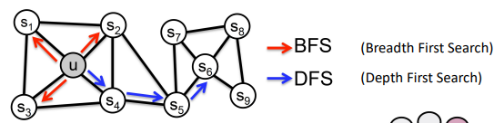
  > 
  > - Deepwalk's simple walk는 Global view(BFS)에 집중한다.

- 방법 : BFS와 DFS를 조율하는 2개의 parameter을 사용한다.
  
  > 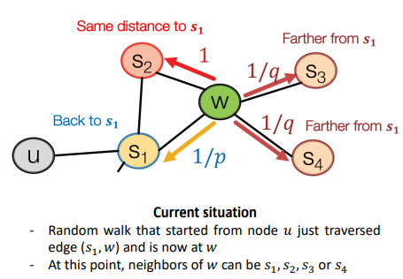
  > 
  > u에서 시작해서 random walk가 $s_1$을 거쳐 w까지 간 상태이다. 
  > 
  > $s_1$으로 가면 return 하는 것이며, $s_2$ 는 $s_1$와 연결되어 있기에 '$s_1$ -> w' 와 '$s_1 $-> $s_2$' 거리가 같게 이동하는 것이다. 마지막으로 $s_3, s_4$ 는 기존 노드에서부터 더 멀어진다. 
  > 
  > > Return parameter p : 이전 노드로 돌아온다. $\frac{1}{p}$는 이전 노드로 돌아갈 확률을 의미한다. 
  > > 
  > > Walk away parameter q  : 더 나아간다. $\frac{1}{q}$ 는 더 나아갈 확률을 의미한다.
  > > 
  > > Q. p와 q는 상수로 주어지는 건가? (ex- 10, 20)
  
  - p의 값이 낮으면 return 할 확률이 높아져 BFS-like walk가 된다. 
  
  - q의 값이 낮으면 더 나아갈 확률이 높아져 DFS-like walk가 된다. 
    
    > 이것만 보면 p와 q는 독립적으로 보이는데? 
    > 
    > w에서 s1,s2,s3,s4 로 갈 최종 확률은 Normalize를 해서 계산하는 거겠지? 

----

#### LINE : Large-scale Information Network Embedding

- Idea : First-order and second-order proximity를 보존하자 [BFS 방식]
  
  > 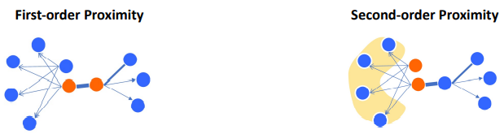

> First-order Proximity의 경우 많은 link들이 관측되지 않는다는 점, 그리고 전체 네트워크 구조를 담기엔 충분하지 않다는 단점이 있다. 
> 
> 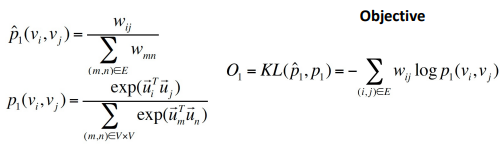
> 
> > $w_{ij} =$ 원본 Graph에서의 두 노드간의 유사성. 직접 구할 수 없으니 Representation learning을 통해 Mapping 한 곳에서 적용한다. 
> > 
> > Q. 엥 $w_{ij}$ 를 구할 수 있나? 왜 Objective function에 들어가 있는거지? 
> > 
> > - Random 하게 Initialize 한 다음에 NN을 통해서 학습시킬 순 있겠다. 
> > 
> > - Objective function에서 학습의 대상이 뭐지? 

> Second-order proximity는 노드들의 이웃 구조 사이의 근접성을 의미한다.
> 
> 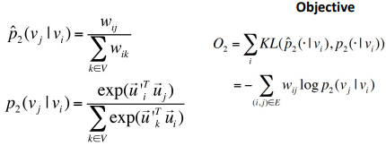

> First-order와 Second-order의 Proximity 는 $\sum$ 에 들어가는 항목만 다르다. 

----

#### SDNE - Structural Deep Network Embedding

- Idea : 다수의 Layer을 가진 Auto encoder를 기반으로 Node embedding을 적용한다.
  
  - 이를 통해서 Shallow 모델이 포착할 수 없는 highly non-linear network structure을 embedding 한다. (Deepwalk, node2vec, Line 모두 Shallow-단층 모델이다)
  
  > 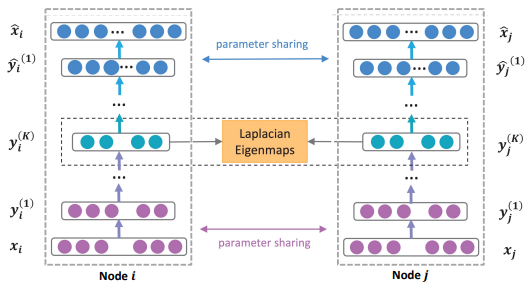
  > 
  > Q. Parameter sharing 은 정확히 어떻게 되나? 동시에? 순차적으로? 
  > 
  > - 동시에 한다면 Batch를 통해서 Normalize 해서 반영하는 것 같고
  > 
  > - 따로라면 뭐 큰 문제는 없지 
  
  - second order proximity를 측정하기 위해서 각 노드별로 원본과 복원한 값의 차이를 구한다. 
    
    > 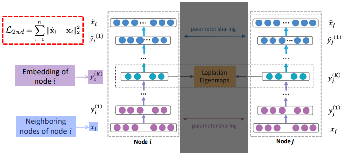
    > 
    > Q. 왜 복원한 값과의 차이를 구하는게 second order의 Loss가 되는 거지? 
    > 
    > - 총 Loss를 복원을 얼마나 잘 하냐, Latent variable 간의 거리가 가깝냐 두가지로 나눈 것 같고. 그냥 각각을 Second, first로 나눈 건가 싶다. 
  
  - first order proximity를 측정하기 위해서 서로 다른 노드 간 연결된 경우 때로 한정하여 측정한다.
    
    > 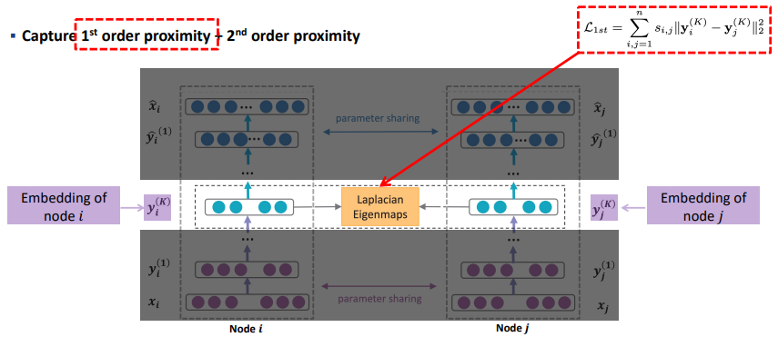
  
  - 최종 Loss 함수는 first order의 loss와 second order loss의 합으로 한다.
    
    > $L_{mix} = L_{2nd} + \alpha L_{1st}$

 

##### Remarks

- 아직까지 Node label, attribute를 활용하지 않았다 [unsupervised]

- 각 Node embedding은 Task와 독립적이다. 
  
  - 각 Task에 맞게 최적화되진 않았지만, 그렇기에 모든 Task에 적용할 수 있다.

-----------------------

#### Multi-aspect Network Embedding

- 어떻게 다양한 특성들에 차별성을 주어 보다 많은 정보를 받아들일 수 있을까? 
  
  > 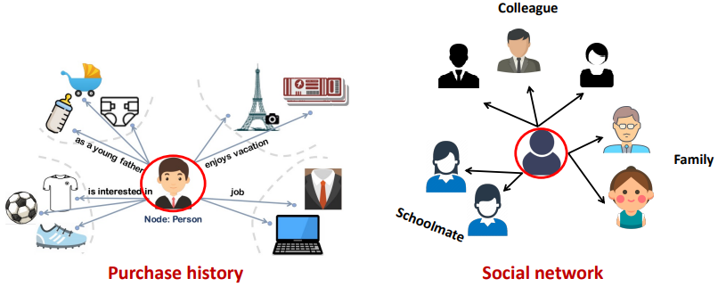

 

##### PolyDeepWalk

- Idea : 각 노드의 Multi-aspect을 고려하는 Deep walk를 하자! 
  
  - 각 Aspect 별로 Clustering을 하여 각 노드의 Aspect를 정의해준다. 
  
  - 각 노드와 Context node 에 대해서 aspect에 대해 sampling 한다. 

- 기존 Deep walk에서 Cluster을 추가로 고려해주자 
  
  > 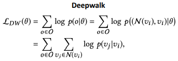
  > 
  > $\theta$ : Model Parameter 
  > 
  > O : Random walk을 통해 얻은 모든 Observation o = $(N(v_i), v_i) \in O$ 
  > 
  > >  $v_i$ : Center node
  
  > 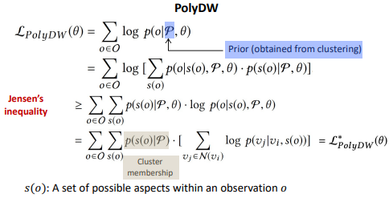
  > 
  > > $logp(o|P, \theta) = log [\sum_{s(o)} P(o,s(o)|P,\theta)]$
  > > 
  > > $p(o, s(o)|P,\theta) = p(o|s(o),P, \theta)p(s(o)|P,\theta) $
  > 
  > 마지막 줄에 Aspect o에서 노드로 변경하면서 Parameter $\theta$를 생략해줌 

- PolyDW의 모델 구조는 다음과 같다. 
  
  > 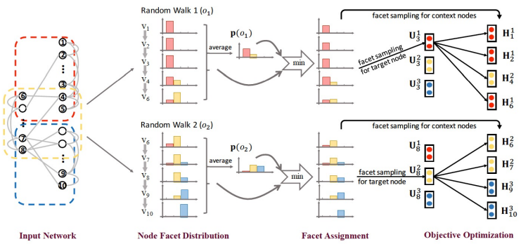
  > 
  > Aspect 별로 묶는다. (ex- 직장, 가족, sns 등등) **[Offline cluster]**
  > 
  > 각 Cluster 안에서만 Random walk를 수행한다. 
  > 
  > Random walk 간, Cluster 안에 속한 각 노드의 Cluster 비중과, 각 특성별 Cluster의 평균 비중의 차이를 최소화해준다. 
  
  - 음.. 뭐랄까 Clustering이 목적인 건가? 

- Poly DW의 단점 
  
  - 1). 각 노드는 현 맥락에 상관없이 fixed aspect을 가정한다.
    
    - Dynamic 을 고려하지 못한다. 
    
    - 가중치를 부여하지 않는다. 
  
  - 2). Embedding의 결과가 Off clustering의 성과에 의존한다.
    
    - 학습이 End-to-End 가 아니다.
    
    - End-to-End 여야 최적화할 수 있다. 

----

#### Asp2Vec

- Idea : 맥락을 고려하여 각 노드를 Neighborhood에 따라서 다른 면모를 고려해준다.
  
  > ex)- 가족에서의 나와, 직장 동료로서의 나, 친구로서의 나는 모두 다르다. 
  
  - PolyDW 에서는 One-hop Neighbor 만을 고려했다면 이번엔 Multi-hop neighbors을 고려한다.

- **해결해야할 점**
  
  - 맥락을 고려해주기 위해 맥락 별로 각 노드마다 Aspect을 할당한다.
  
  - 하지만 이 할당하는 과정이 non-differentiable 하여 NN에 넣을 수 없다.
    
    <mark>=> Categorical Variable을 미분할 수 있도록 하는 Gumbel-softmax trick을 활용!</mark>
    
    > 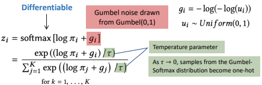

- **Objective function은 아래와 같다.**
  
  > 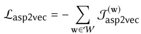
  > 
  > - 각 맥락 별(w)로 따로 Loss를 구하여 이를 합해준다. 
  
  > 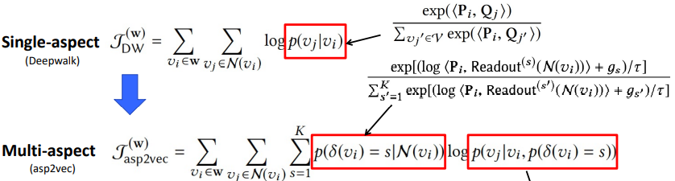
  > 
  > $p(\delta(v_i) =s | N(v_i))$ : 맥락(이웃)을 고려했을 때 $v_i$의 Aspect가 s일 확률 
  > 
  > > 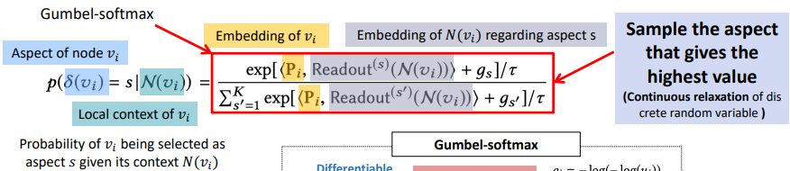
  > 
  > $p(v_j|v_i, p(\delta(v_i)=s))$ : 중심 노드가 $v_i$ 일 때, $v_j$가 속할 확률 
  > 
  > > 

 

- ASP2VECT 이 앞으로 해결해야 할 문제 
  
  - Multi-aspect면 충분한가? 
  
  - **각 Aspect 사이의 Interaction 도 포착해야 한다!**

 

- **목표**
  
  - 1). 각 Aspect 사이의 공통 정보를 포착할 수 있어야 한다.[Relatedness]
  
  - 2). 각 Aspect들은 다른 Aspect 로부터 달라야 한다. 
    
    - 각 Aspect들의 고유한 특성을 independently 하게 포착할 수 있어야 한다.  

- 각각의 목표를 이루기 위한 방법은 아래와 같다. 
  
  - 각 Aspect별 고유 특성 포착 : Aspect embedding 간의 유사성을 최소화하자! 
    
    > 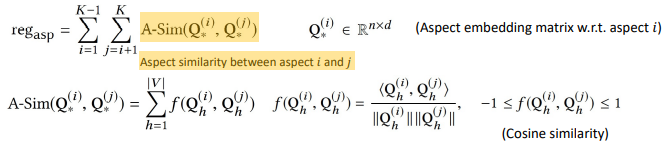
    > 
    > K 개의 Aspect 별로 모든 Aspect Pair 간의 유사성을 합하여, 각 Aspect 간 유사성을 구한다.  이후 이를 규제항으로 부여하여 최소화하도록 한다.
    > 
    > Aspect i,j 에 대해서 유사성은, 각 노드들의 Consine similarity의 합으로 구한다. 
  
  - 동시에 Aspect 간 유사성 포착 : 어느 정도는 유사성을 허용해준다. 
    
    > 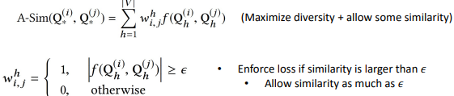
    > 
    > $\epsilon$ 보다 유사성이 클 경우 허용해준다.

- 최종 목적 함수는 ASP2VEC 에 Diversity와 Similarity를 고려하도록 규제항을 추가한다. 
  
  > 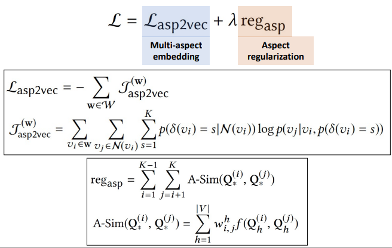

-----

#### SPLITTER

- 주어진 Original Graph에 대해서 Persona Graph을 계산하자!
  
  > Persona graph : 각 Ego network를 분리한 Graph 
  > 
  > 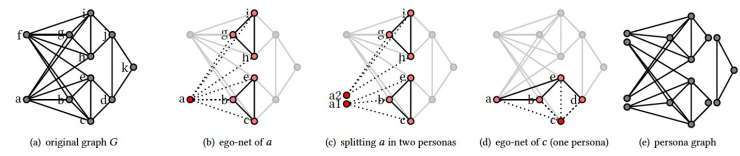

- 각 노드 $v_i$ 마다 $N(v_i)$ 을 예측할 때, Persona 안에 있는 값들은 유사하게 Embedding 하도록 고려하자 
  
  > 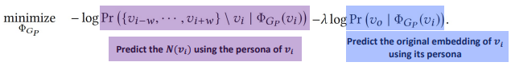

------

### Attributed Network Embedding

- 노드와 연관있는 모든 정보를 활용하자! 
  
  > ex)- user content, reviews, paper abstract

- 문제점 : 관련성이 높으며 서로 다른 노드의 Attributes와 Graph의 Network(구조)를 어떻게 잘 합칠 것인가? **[Graph topology + Node attributes]**
  
  - 또한 노드의 수와 Attributes의 양이 많아 계산양을 많이 필요할 것이다. 

 

##### Deep Attributed Network Embedding(DANE)

- Idea : Attributed network의 Proximity는 Graph의 구조, Attribute 모두에 의존할 것 
  
  - Graph 구조, Attribute 따로 AE를 통해 Latent variable을 추출한다. 
  
  - 그리고 각 Latent variable 간 Consistent and complementary loss를 계산한다. 

- Method 
  
  - 1). Graph의 구조적 특성에 대해 AE로 학습한다.
    
    > 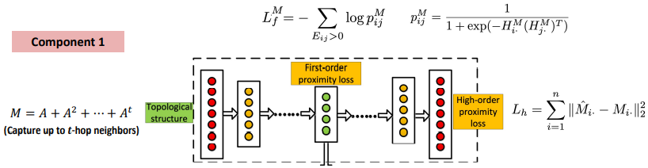
    > 
    > t-hop 경우를 고려한 M matrix를 활용한다. 
    > 
    > AE는 Recontruction loss를 통해 parameter을 학습한다.
    > 
    > M Matrix의 각 요소별 확률 값은 Hidden variable 간 내적을 Sigmoid 한 값으로 구한다.
    > 
    > 각 확률에 대해 MLE를 달성하도록 $L^M_f$ 를 구성한다. 
  
  - 2). Node Attribute에 대해서도 동일하게 구성한다.
    
    > 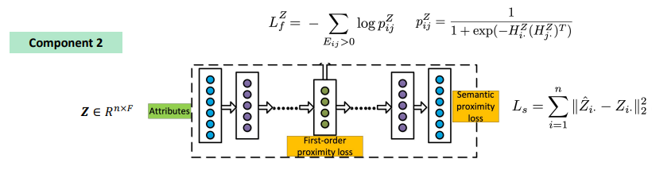
  
  - 3). Graph 구조와 Node Attribute 2개의 Modal information의 유사성을 고려하여 최종 확률 값이 최대가 되도록 한다.
    
    > 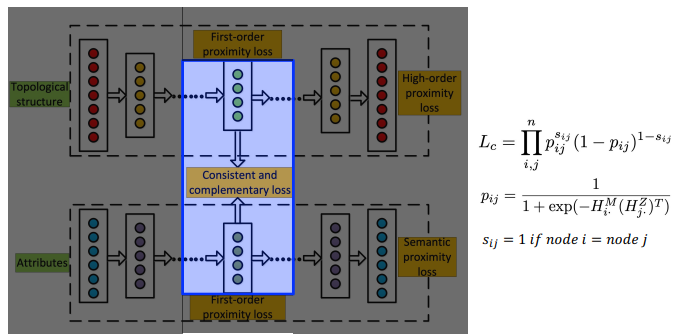
    > 
    > $p_{ij}$ 에서 $H_i^M  (H_j^Z)^T$ 로 서로 다른 Latent variable 간의 내적을 통해 구한다.

 

#### Semi-supervsed / supervised graph representation learning

- 앞의 방법들은 모두 unsupervised 방식이다. 
  
  - 주로 Prroximity와 Graph의 구조에 대해서 집중했다. 
  
  - 이제 Node label과 Attribute information을 통해 Node embedding을 해보자. 
    
    > ex)- Node classification 

 

##### Planetoid

- Idea : Graph 구조와 Label에 기반을 둔 Random walk을 활용하자! 
  
  - Graph와 Lable 각각으로부터 Sampling 하여 Graph로 연결한다.
    
    > 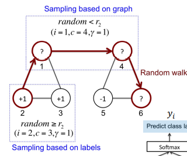
    > 
    > $r_2$ : unform distribution인 Random 에서 Thereshold 역할
    > 
    > - 즉, 일정 확률 아래면 Graph에서, 위면 Label 기반으로 Sampling 
    
    > 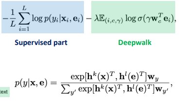
    > 
    > Supervised 영역과 deep walk 영역을 구분하여 같이 고려한다.

  

#### Graph Convolution Network(GCN)  [매우 중요 ]

- Idea : 이웃 노드로부터 정보를 받고 조합하자! [Message passing]
  
  > 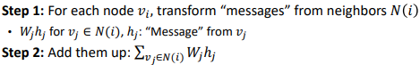
  
  - Message는 Relational information 과 Attribute information을 포함한다. 
  
  > 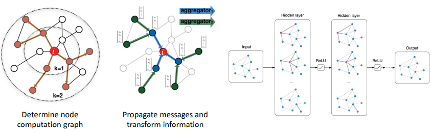

----

### Heterogenous Network Embedding

##### Heterogeneous Network(NETNET)

- 현실에선 다양한 타입의 Node와 Edge를 가진 Graph들이 많다. 

- 이런 Network 들을 Heterogenous network라 부른다.
  
  > 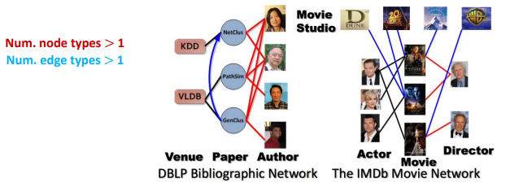

 

- **Method : 기존의 Deepwalk을 Heterogenous network로 확장하자!**
  
  - 각 노드의 Type를 추가적으로 고려한다. 
  
  > 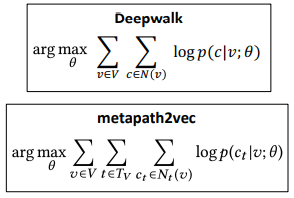
  > 
  > $T_V$ : Type of nodes 
  > 
  > $N_t(v)$ : t 타입인 v노드의 Neighborhood
  
  - Deep walk는 각 Type들의 조합 사이에서 이동한다. 
    
    > ex)- Author - Paper - Author 조합 
    > 
    > 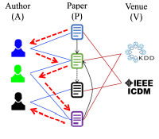[APA]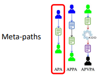[그 외 조합]
  
  - 기존의 Deep walk와 동일하게 중심 노드를 기준으로 이웃의 확률값을 구한다.
    
    > 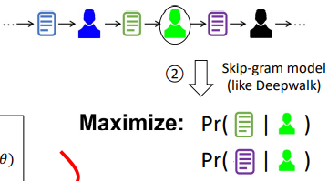
  
  - $p_{ij}$ 는 Softmax를 통해서 계산할 것이다. 단, 모델의 형태에 따라 들어가는 벡터가 달라진다. 
    
    > 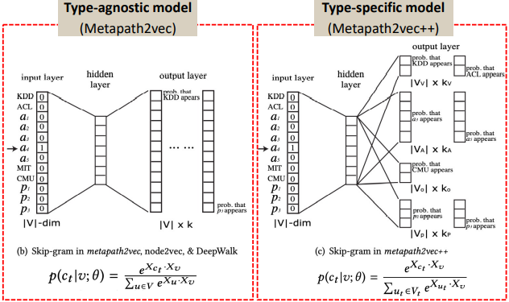

 

##### HIN2Vec

- 동기 : 만약 우리가 미리 정해진 metapath가 없다면 어떻하지?
  
  - 위의 Metapath에서는 미리 정해져 있었다. 

- Idea  : 노드와 targeted relation에 대해서 Latent vector을 학습하자! 
  
  > 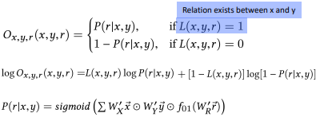
  > 
  > 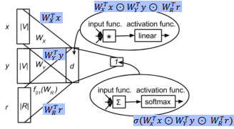
  > 
  > 이때 r의 경우의 수는 정의해둔다. 
  > 
  > > 

 

#### Multi-Layer(Multiplex) Network

- 동기 : 단일 타입의 노드에 대해서 다양한 Edge를 가지는 경우도 많다. 
  
  > 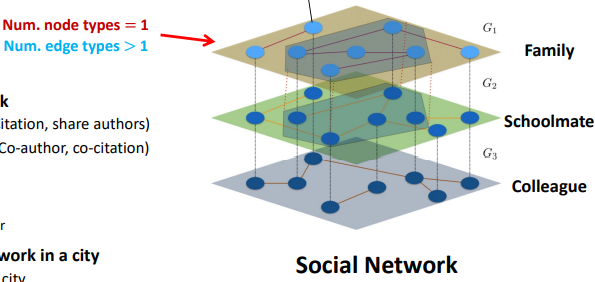

- Idea : 다양한 관점의 Graph에서 각각 representation learning을 하고, 그 결과값을 함께 고려해주자! 
  
  > 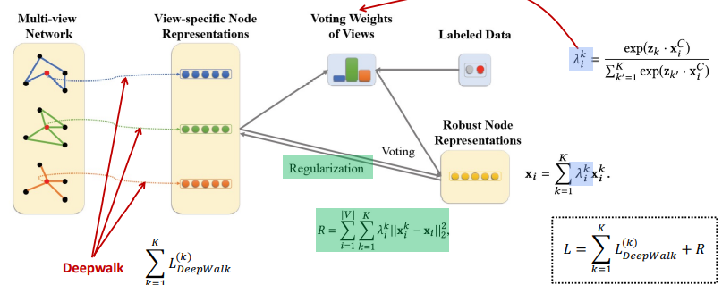
  > 
  > Labeled Data를 통해서 각 Graph의 Representation들의 비중을 학습시키자!

-----

### Task-guided Network Embedding

- Task 마다 최적화시킨 Node embedding을 해보자! 
  
  > Ex)- Author Identification 

 

##### Task-Guided and Path-augmented heterogeneous network embedding

- Method 
  
  - 1). [Supervised part] 각각의 Type 별로 representation learning을 한 다음 weight conbination을 하여 Author score을 계산한다. 
    
    > 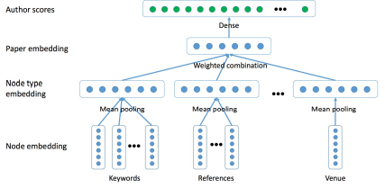
    
    > 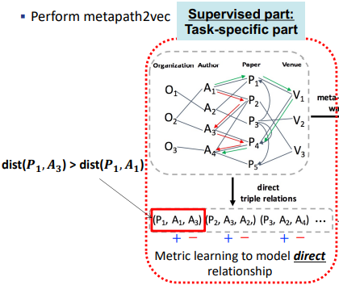
    > 
    > Paper1이 Author 1,2에 직접적으로, 3,4에 간접적으로 연결되어 있다.
    > 
    > - 이때 Paper은 GRU 방법을 통해 Representation의 형태로 입력한다.
    > 
    > 이 중에서 거리가 가까운 것에 +를, 먼 것에 -을 부여한다.
    > 
    > 직접적으로 연결된 관계에 높은 Score을 매긴다. [Metric learning]  
  
  - 2). [Unsupervised part] 각 Type 간의 관련성을 Metapath2vec 방식으로 고려한다.
    
    - Supervised part에서 구성해둔 구조에 따라 Meta-path walk을 한다. 
    
    > 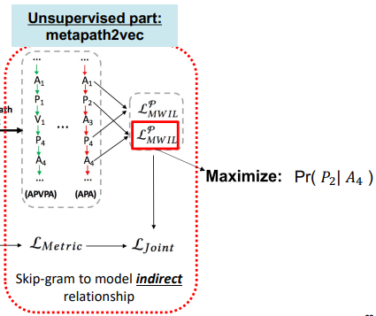
    > 
    > 간접적으로 연결된 관계를 반영한다. 

 

##### Pair Embedding

- Task-guided embedding에서 두 노드간의 pairwise relationship을 모델링하는 것은 중요하다. 

- 따라서 Pairwise relationship의 likelihood을 모델링하는 모델이 필요하다. 
  
  - 단, 이전의 방법들은 Node-centric 하여, Pairwise 관계를 잘 반영하지 못했다. 
    
    > 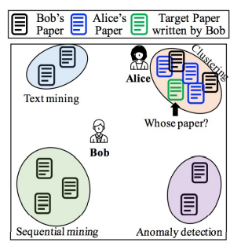
    > 
    > Bob은 다양한 분야를 작성하여, 전체를 함께 고려할 경우 중간에 위치한다. 
    > 
    > 하지만 Bob이 Clutering 분야에 새로운 논문을 썼을 때에는 그가 썼음에도 불구하고 Alice와 가깝게 배치하는 오류가 생긴다. 
    
    > 우리가 원하는 결과는 'Bob이 썼다'는 Pairwise relation을 고려하여 배치하는 것이다. 
    > 
    > 

 

- Method 
  
  - 1). Pair을 Embedding 한다 
    
    > 
    > 
    > Embedding layer에 Pairwise relation을 같이 넣는다. 
    > 
    > - 이 때 Contents를 가진 Paper을 입력하기 위해 따로 GRU 과정을 통해 representation을 추출한다. 
    > 
    > 이후 각 요소별, Pairwise, 제외 사항을 고려한다. 
  
  - 2). Context path를 Embedding 한다. 
    
    > 
    
    > Context path 란 Pair 관계 사이에 생기는 Sequence를 의미한다.
    > 
    > 
    > 
    > 우린 pair 사이에 있는 공통요소(ex- 연구 주제)를 추론하기 위해 Context path를 고려해야 한다.
  
  - 3). 주어진 Context Path를 고려하여 Pair을 예측한다. 
    
    > 
    > 
    > 
    
    > 
    
    > -> Pair embedding은 빈도높은 context path를 Embedding 하는 것과 유사하다. <mark>즉, Pair embedding은 공통요소(ex- 연구 주제)을 암호화한다.</mark> 
  
  - 4). Pair 가 유효한지 분류한다. 
    
    > 
    > 
    > -> Classifier을 통해서 Pair가 좀더 valid 하도록 강조한다. 또한 상대적으로 영향력이 적은 노드(ex- 저자)를 확인할 수 있다.
    
    > 
  
  - 최종 Joint objective는 아래와 같다.
    
    > 
    > 
    > $S(P)$ : Meta path의 집합 
    > 
    > $W_p$ : Meta path p에 의해 생성된 Random walk의 set 
    > 
    > $\tau$ : Neighborhood의 window size
    > 
    > $C_v$ : Walk w에 있는 Paper v의 위치 

- 결과 
  
  > 
  
  - 확연히 잘 구분한다. 
