#### 8주차 - Graph Neural Network

##### Outline

- **Graph Neural Network(GNN)**
  
  - Graph Convolutional Neural Network 
  
  - Graph Attention Network 
  
  - Graph SAGE
  
  - Deep Graph Infomax(DGI)
  
  - GNNs with Edge Embeddings 

- **GNN on heterogeneous network** 
  
  - Relational GCN (R-GCN)
  
  - Deep Multiplex Graph Infomax(DMGI)
  
  - Heterogenous GNN(HetGNN)

---- 

#### Overview of Graph Neural Network

- GNN이란 Deep ENcoder이다. 
  
  - 기존의 Encoder은 1개의 층으로 이뤄진 Shallow Model이였다. 
  
  - GNN은 Graph 구조에 기반을 두고 Non-linear Transformation을 하는 다수의 Layer을 통해 Encoding 하는 것이다. 
  
  > 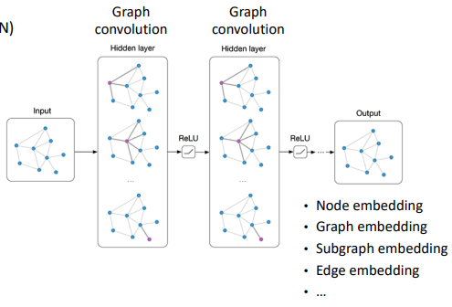

  

- Graph representation learning에서의 해결해야할 난관 
  
  - 기존의 DNN은 Regular structure Data에 맞춰 디자인되어 있다. 
  
  - Graph는 매우 복잡하다.
    
    - Arbitrary structure : Grid와 같은 Spatial locality가 없다 / 고정된 순서가 없다. 
    
    - Heterogeneous : Directed / undirectd, binary/weighted/type 등 다양한 형태가 있다. 
    
    - Large-scale : 노드와 Egde가 수백만에서 수십 억개가 있을 수 있다. 

 

- CNN에서 Convolution filter을 통해서 각 local receptive field 의 특징을 학습한다. 

- 이를 Graph에도 적용한다. 
  
  > 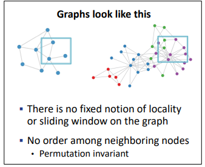
  
  - 서로 이웃 노드로부터 정보를 전달하고 결합한다. [Message passing]

---- 

#### Graph Convoultional Network(GCN)

- Idea : 노드의 이웃들로부터 Message passing을 함으로써 구조 / 특성 정보를 반영하자. 
  
  > 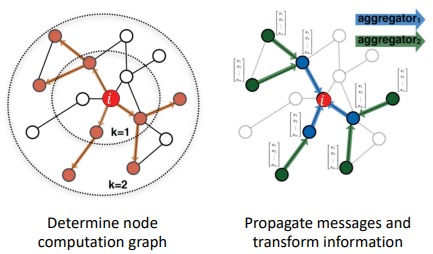
  
  - Local network Neighborhood에 기반하여 Node Embdding을 만든다. 
    
    > 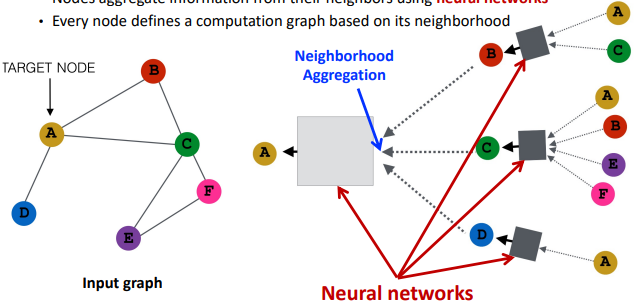

 

- 이때 우리가 고려해야할 점은 2가지다. 추후 다른 GNN과의 구분할 수 있다.
  
  > 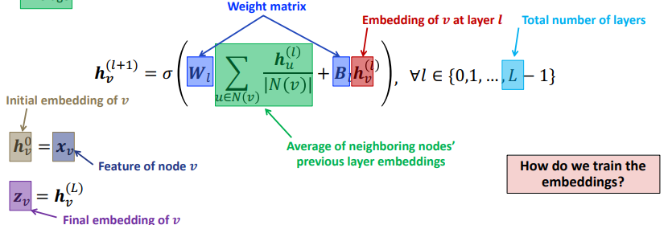
  
  - 1). 어떤 것을 Neural Network로 구성할 것인가? 
    
    - Weight Matrix B와 W. 
  
  - 2). 어떻게 Neighboring node들을 Aggregate 할 것인가? 
    
    - Average 적용. 

  

- 학습 목표인 W와 B에 대해 계산을 원할히 하기 위해선 나머지 값들도 Matrix로 구성할 필요가 있다. 
  
  > 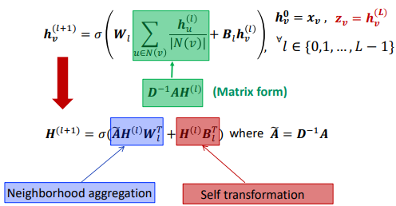
  
  - 만약 A가 값이 많이 없는 Sparse matrix 일 경우 계산양이 대폭 줄어들 수 있다. 

 

- 학습을 위한 Loss 함수 설정해야 한다. 크게 Supervised / Unsupervised loss가 있다.
  
  - 1). Supervised loss : Label Data 활용 
    
    > 
    > 
    > 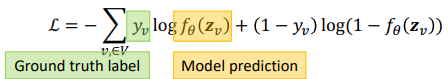
    > 
    > $y_v$ : v Node의 Label 
    > 
    > $f_\theta$ : 파라미터 $\theta$를 가진 Classifier 
    > 
    > L : loss 함수. y가 실수라면 regression이, 또는 Categorical 이면 Cross entropy가 된다. 
  
  - 2). Unsupervised loss : Graph의 구조 활용 (ex- adjacency information)
    
    > 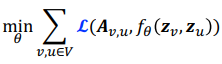
    > 
    > 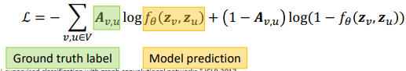
    > 
    > $f_\theta$ : Encoder. 노드 Latent variable $z_v, z_u$ 을 받아 구조를 반환. 흠.. Decoder 설명 느낌인것 
    > 
    > L : ex)- adjacency information일 경우, 0 or 1의 값을 가지기에 Cross entropy 형태를 띈다.  

----

#### Graph Attention Network(GAT)

- 각 서로 다른  Neighboring node에 대해서 Attention을 통해 서로 가중치를 부여하자.
  
  > 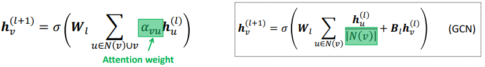
  > 
  > $\alpha_{vu} :$ 노드 u와 v 사이의 중요한 정도
  
  - GCN에서는 이웃 노드들이 서로 비중이 똑같을 것이라고 가정한다. ($\alpha_{uv} = \frac{1}{|N(v)|}$)

- Attention은 각 데이터의 Semantic 부분에 가중치를 부여한다. 
  
  - 따라서 Attention을 활용하여 각 노드에 적절한 가중치를 부여할 수 있다. 

  

- Attention weight $\alpha_{uv}$을 어떻게 계산할 것인가? 
  
  > $\alpha_{uv} = \frac{exp(e_{uv})}{\sum_{k \in N(v)} exp(e_{vk})}$
  > 
  > 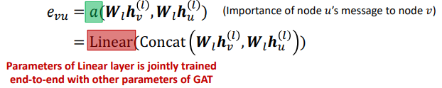
  > 
  > 이때 Linear 부분에 대해서 또다른 Weight matrix W'를 활용한다. 
  > 
  > - W' 의 값은 학습이 진행됨에 따라 최적화되어 간다. 
  > 
  > - 그리고 각각의 계산 값들을 Concat 한다. 

- 또한 Multi head attention을 적용하여 복수의 Attention score을 만들어 낸다. 
  
  > 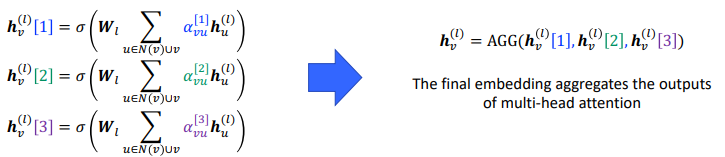
  > 
  > 이후 각각의 Attention score을 Aggregate 하여 최종 Embedding을 만든다. 

--------

#### GraphSAGE

- Idea : GCN / GAT을 일반화하자. 
  
  > 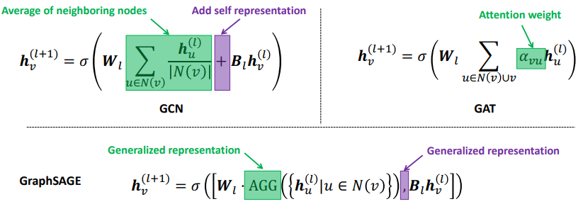
  > 
  > Aggregation 방법으로 일반화 
  > 
  > - Mean / Pool / LSTM 등 다양하게 들어갈 수 있음. 
  > 
  > - LSTM의 경우가 가장 성능이 좋음 
  > 
  > Bias 부분을 일반화함. 

-----

##### Inductive capability of GNN

- Inductive learning : Training 당시에 없었던 노드에 대해서도 Embedding을 얻을 수 있다. 
  
  - 이는 Embedding matrix에 대한 학습은 Deepwalk/node2vec을 통해 이미 마쳤기에 , 새로운 Node가 들어온다해서 새롭게 학습할 필요가 없어 가능하다. 
  
  - 대신 Embedding 자체가 아닌, Embedding을 활용하는 Aggregator와 Transformer을 학습하자. 

 

#### Deep Graph Infomax(DGI)

###### 배경지식

- **Mutual Information(MI)**
  
  - 두 변수가 공유하는 정보의 양을 측정한다. 
    
    > 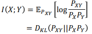
    
    > 만약 X와 Y가 Independent 하다면 MI =0 이 된다. 
    
    - 최근까지 MI에 대한 계산이 Neural Network 상에서 안되었다. 
    
    - 하지만 2018년 ICML에서 발표된 "Mutual information neural estimation(MINE)" 을 통해서 이제 가능해졌다. 

- **Deep Infomax** 
  
  - Image data에 대한 Unsupervised representation learning
  
  -  Idea : local patch와 Global representation 간의 Mutual information을 극대화한다.  

- **DGI Idea** 
  
  > 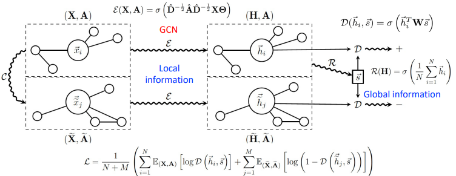
  > 
  > 아래 Loss 함수를 최적화하는 것이 MI을 Maximize 하는 것과 같음이 논문에 밝혀져 있음. 
  > 
  > 아래에 놓여있는 $\tilde X, \tilde A$ 들은 C(corrupt graph)을 통해서  만들어낸 Graph들이다. 위의 값에 +, 아래의 값에 - 를 적용하여 Loss 함수를 만들어낸다. 
  > 
  > - 아래 있는 값들은 Generate한 값으로 봐야하나? 
  
  - Deep Informax를 Graph domain에 적용한다.
  
  - Image에서의 Local patch representation은 Graph에서의 Node representation과 같다. 
    
    - 이로써 Node의 특징을 추가적으로 고려한다.
  
  - GCN encoder을 학습한다.
    
    > 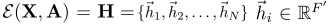
    > 
    > $\epsilon$  :GCN encoder
    > 
    > X : Feature  / A : Adjacency 
    > 
    > $h_1$ : Embedding vec
    
    - Local node neighborhood에 대해 반복하여 Aggregation 함으로써 Node representation을 생성한다. 
    
    - $h_i$는 node i 주변의 Graph patch들을 요약한다.(representation 한다)

-----------

#### GNNS with Edge embeddings

- 동기 : Edges 또한 정보를 가지고 있을 것이다. 
  
  > ex)- 저자와 논문간의 관계 
  > 
  > 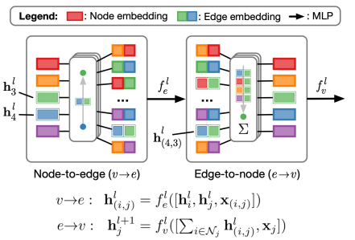

---------

### GNN on heterogeneous network

- Multi-layer(Multiplex) Network 

- R-GCN : Relational GCN 
  
  - Idea : GCN을 확장하여 서로 다른 종류의 Relationship까지 고려하자 
    
    > 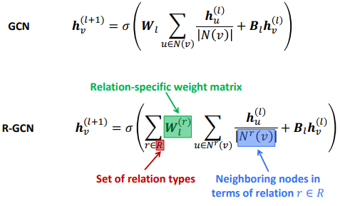
    > 
    > 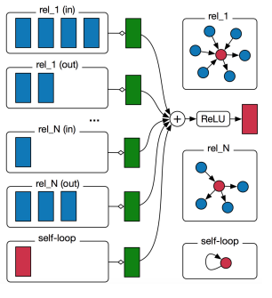

  

#### DMGI : Unsupervised attributed Multiplex Network Embedding

- Idea : Infomax 원리를 Multiplex network에도 적용하자! [DGI를 Multiplex network로 표현해보자]
  
  > 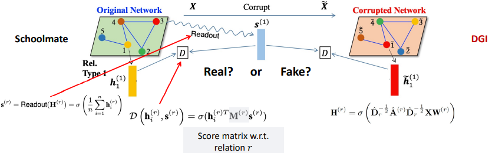
  > 
  > Schoomate 등 다양한 관계들 (Multiplex)을 반영하면서 Infomax 하자! 
  
  > 이때 어느 관계가 더 중요한지 Attention 을 통해서 비중을 정한다. 
  > 
  > 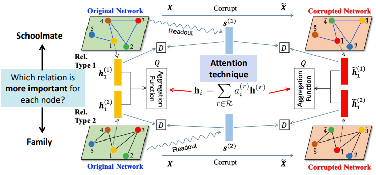
  
  > 최종적으로 Corrupted Network와 Original Network에 대해 Consensus Regularization 함으로써 Embedding 한다. 
  > 
  > 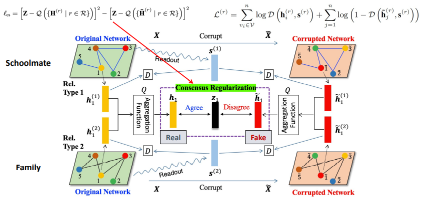

--------

#### Heterogeneous Graph Neural Network(HETGNN)

- Idea : Multi type / Multi node 를 함께 고려하자 
  
  > 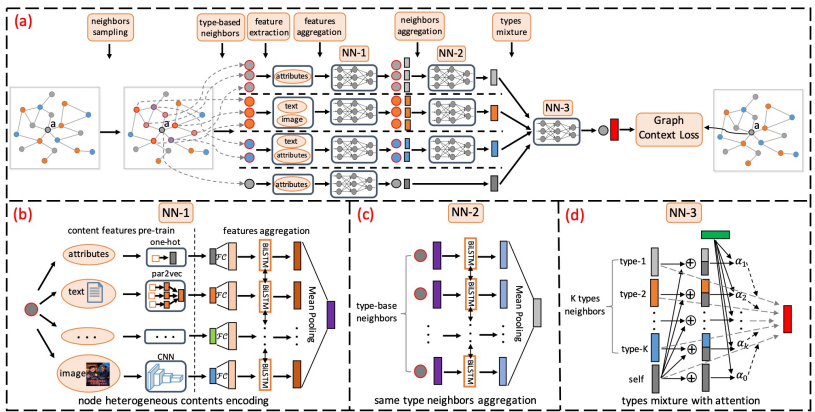

