### 9주차 - Advanced Topics in GNN

##### Outline

- Graph Pooling Methods 
  
  - Simple pooling method 
  
  - Clusgtering-based pooling 
  
  - Sampling-based pooling 

- Training GNN
  
  - Self-supervised learning
  
  - Going deeper with GNN 

--- 

#### Graph pooling Methods

###### Background - Typical tasks

- Graph에서 크게 Node / Edge / Graph 단위의 Prediction이 가능하다. 
  
  - Node-level 의 경우 Label classification / regression 등이 가능했고 
  
  - Egde-level의 경우 Link prediction / relation classification이 가능했다. 

- Graph Level Task의 경우, Node/Edge 각각이 Graph 형태로 결합했을 때 새로운 의미를 가지는 경우에 활용한다. 
  
  > ex)- Molecular property prediction 
  > 
  > Ex)- Drug discovery 
  > 
  > Ex)- Scene understanding 

 

##### Overview

- 동기 : Graph-level task에 대해 전체 Graph의 representation이 필요하다.
  
  - 어떻게 각 노드로 부터 정보를 요약할 수 있을까? 

- 직관 : 노드 각각의 feature와 Graph의 구조 정보 둘다 포착할 필요가 있다. 

- 방법 : Graph에 속해 있는 모든 Node을 활용하여 예측하자. 
  
  > 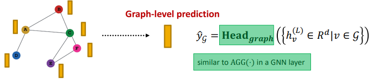
  
  > Node-level GNN 과의 차이점은 Aggregation 하는 대상에 차이가 있다. 
  > 
  > 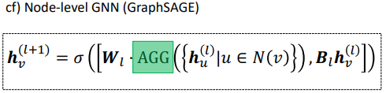
  > 
  > Aggregation의 대상이 Neighborhood에서 전체 그래프로 확대되었다. 

 

#### Graph-pooling method의 종류

##### 1). Simple methods

- Mean / Max / sum 등 기존의 Aggregation 방법 적용 

> 

- 단점 : Graph의 크기가 클 경우 정보의 Loss가 많이 일어난다.
  
  > 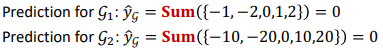
  > 
  > 각 노드 feature의 크기가 10배가 차이가 있어도 Sum을 하면 동일해진다. 
  > 
  > 즉, $G_1, G_2$ 을 구분하지 못한다. 
  
  - 따라서 작은 Graph에만 효과가 있다. 

##### 2). Clustering-based

- Simple methods의 해결책은 Hierarchical을 구축하여 Pooling 하는 것이다. 
  
  > Ex)- 동일한 $G_1, G_2$ 상황에서 ReLU(SUM)을 통해서 Aggregate 한다. 
  > 
  > 즉, 음수 값이 앞의 2개의 값과 뒤의 세 개의 값을 따로 Aggregate 한다. 
  > 
  > 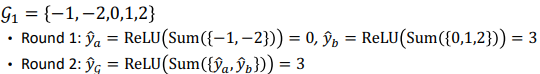
  > 
  > 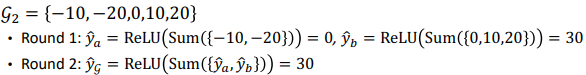
  > 
  > => 이제 $G_1, G_2$을 구분할 수 있다. 

 

##### 3). Cluster-based : DIFFPOL

- Idea : Hierarchically Node embedding을 진행한다. [subgraph 단위로]
  
  > 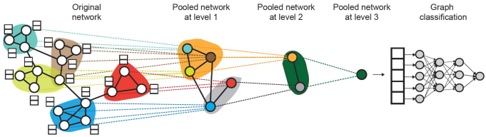
  
  - 두 가지 GNN을 서로 다른 Level에서 계산하고 이후 각자를 leverage 한다.
    
    > GNN A : 전체 Graph Node에 대해서 Embedding 한다. 
    > 
    > $ H^{l} = GNN_A(A^{(l)}, X^{(l)}) \in R^{n * d}$
    > 
    > $GNN_A : A$(n x n) $X$(n x F)  $W$(F x <u>d</u>) => n x d 
    > 
    > > A: Adjacency matrix 
    > > 
    > > X : Node 
    > > 
    > > W : Weight
    
    > GNN B : Graph를 k개의 Cluster로 묶은 다음, 위의 그림과 같이 각 Cluster에 대해 embedding 한다. 
    > 
    > $S^{(l)} = Softmax(GNN_B(A^{(l)}, X^{(l)}) \in R^{n*k}$
    > 
    > $GNN_B = A$(n x n) $X$(n x F) $W$(F x <u>k</u>) => n x k
    
    > 각 GNN에 대해서 W의 차원만 달라진다. 
  
  - 각각의 Pooling Layer에 대해서, 
    
    - $GNN_A$을 통해 생성한 Node embedding을 aggregate 하기 위해 $GNN_B$ 을 통해 얻은 Clustering assignment을 활용한다.
      
      > 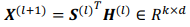
    
    - 각 Cluster 간의 연결성은 유지한채 Cluster을 Single new Node를 생성한다.
      
      > 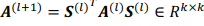
    
    => 각 Pooling Layer을 넘어갈 때 마다 <u>Graph의 차원은 Node개수 n에서 Cluster의 개수 k로 축소한다.</u>

 

##### 4) Sampling-based : TOPKPOOL

- Idea : 중요한 Node를 선발하기 위해 Projection vector을 도입하자. 
  
  > 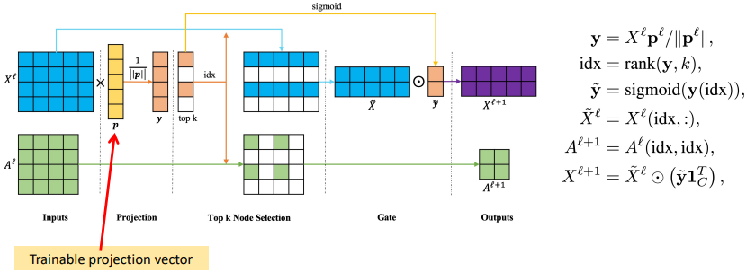
  
  > $X^{l}$ : Node. n(num of node) x d(feature)
  > 
  > $p$ : Projection vector. d x 1 
  > 
  > y : Projected value. n x 1. 
  > 
  > $\tilde y$ : 값이 높은 Top k 만을 선별한 y vector. k x 1 

 

##### 5) Sampling-based : SAGPOOL

- Idea : 나이브한 Projection vector 보단 GCN을 통해 Self-attention score을 계산하자. 
  
  > 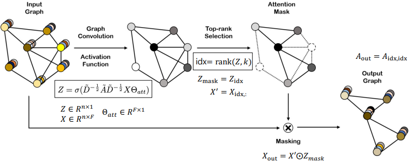
  > 
  > $\Theta_{att}$ : 학습 가능한 Attention score. Projection vector 역할을 함
  > 
  > Top - rank selection도 부여함. 

  

---------

#### Training GNN

##### Background - What is self-supervised learning?

- unsupervised learning은 Data를 label로 고려하여 학습한다.

- 일반적으로 데이터의 일부와 task에 대해 예측하도록 하지 않는다.

- 다만, Pretext task에 대해서 Data 안에서의 관계성을 배우도록 할 수 있다. 
  
  > Ex)- Jigsaw puzzle 
  > 
  > 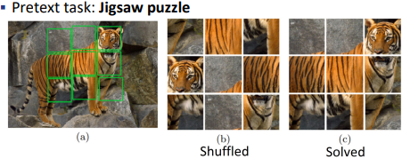
  
  > Ex)- Colarization 
  > 
  > 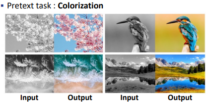
  
  > Ex)- Rotation 
  > 
  > 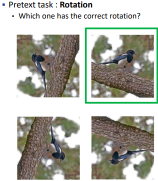

 

##### Graph에서의 Pretext task의 예시

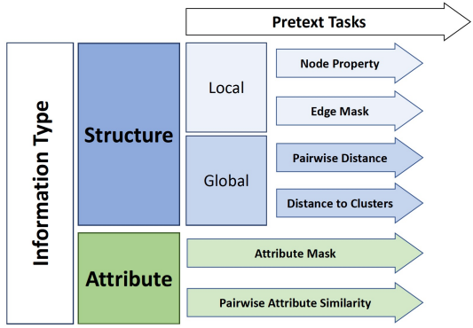

 

###### Structure - Local - Node Property

- 목표 : 각 노드에 대한 Degree / Local node importance / Local clustering coefficient을 예측하자! 
  
  > 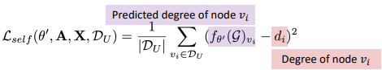

 

###### Structure - Local - Edge Mask

- 목표 : 주어진 Node 쌍에 대해서 link가 있는지 없는지 예측하자. 
  
  > 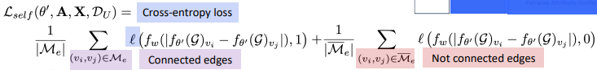

 

###### Structure - Global - Pairwise distance

- 목표 : 서로 다른 Node 쌍간의 거리를 예측하자. 
  
  > 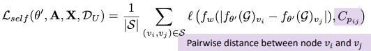

 

###### Structure - Global - Distance to clusters

- 목표 : 각 cluster 별 중심 노드와 각 unlabeled node 간의 거리를 유지한다.

- 방법 : 1) Graph 를 k개의 Clustering을 적용한다, 2) 각 Cluster $C_j$ 에 대해서 가장 높은 Degree를 가진 것을 Center node라 정의한다. 3) 이후 Cluster 별로 중심 노드와의 거리를 학습한다. 
  
  > 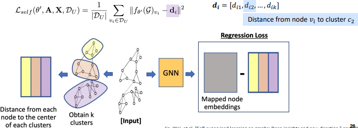

 

###### Attribute - Attribute mask

- 목표 : Masked 될 특성을 예측하자. 
  
  > 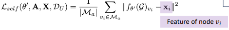

 

###### Attribute - Pairwise Attribute Similarity

- 목표 : Pairwise node 간의 feature의 유사성을 예측하자. 
  
  > 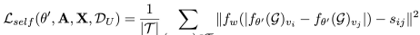

 

###### Self-task 간 성능 비교 - Global Structure가 일반적으로 local structure보다 좋다.

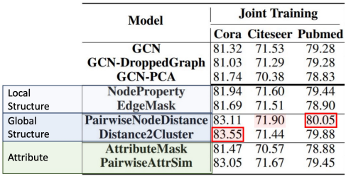

 

###### Another pretext task : Context prediction

- 목표 : 맥락을 예측하자! 
  
  > 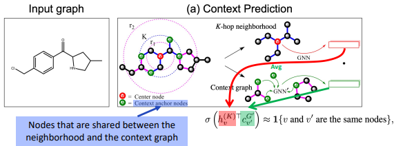
  
  - 각 Hop의 횟수에 따라 서로 다른 subgraph가 나온다. 

----

##### Consrastive learning

- Self-supervised learning의 일종이다.

- 특정 Class로 Classification을 하진 않으나, 유사한 Data 들의 쌍이 그렇지 않은 Data들의 쌍보다 유사도가 높도록 학습시킨다.
  
  > 
  
  > 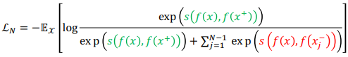

 

###### Contrastive Multi-view representation learning on Graph

- Idea : First-order neighbor과 General graph diffusion과 대조시키자. 
  
  - Diffusion을 통해서 비어있는 edge를 채운 Global View와 기존의 Local view를 비교하자. 
  
  > 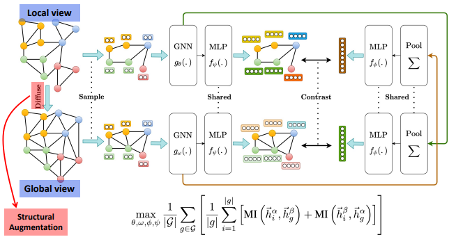
  
  > Local View에서 도출한 Graph Embedding은 Global view Graph와, Global View에서 도출한 Graph Embedding은 Local view Graph와 Constrast 한다.

-----

##### GCC : Graph Contrastive coding for graph neural network pretraining

- Idea : Network 내부, 그리고 상호간의 Subgraph instance를 차별화하자. 
  
  > 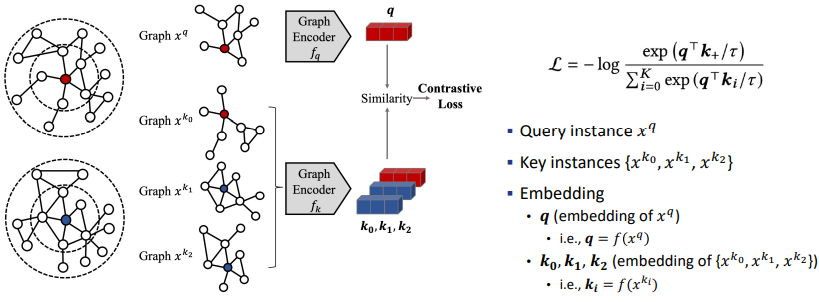
  
  - 각각의 원본 Graph에서 subgraph을 sampling 한다. 
  
  - 이후 각각의 subgraph들을 Encoding 한다음, 각 embedding 간의 similarity를 Contras 하도록 한다. 

-----

#### Training GNN - Going deeper with GNN

- GNN을 깊게 만들수록 Receptive field가 커진다. 이로인해 보다 Global view를 갖출 수 있다. 
  
  > 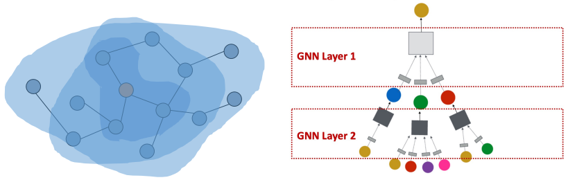

- 하지만 GNN을 깊게 할수록 Oversmoothing 등의 문제가 발생하여 성능이 악화한다. 
  
  > 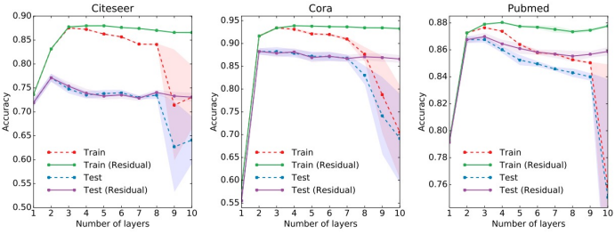

- Oversmoothing이란, 모든 Node embdding이 동일한 값으로 수렴하는 현상이다. 
  
  > 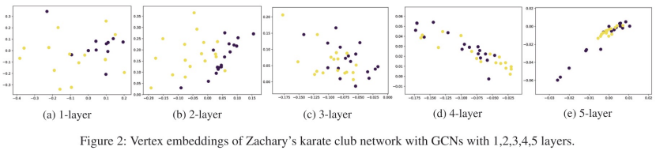
  
  - Node embedding은 각각의 Node를 구별할 수 있어야 한다. 
  
  - Over smoothing 문제는 층을 깊게 할 수록 Receptive field가 겹치는 부분이 많아져 발생한다. 
    
    > 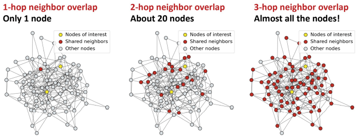
    > 
    > 위의 그림은 서로 겹치는 이웃들만을 표기한 것이다. 
    > 
    > 층을 깊게할 수록 겹치는 값들이 대거 늘어난다.

- 수학 관점에서 다회차의 Propagation은 representation이 분리할 수 없도록 만든다는 것이 증명됬다. 
  
  > 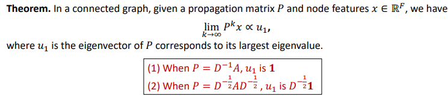

 

- 어떻게 Oversmoothing 문제를 해결하고 표현력을 증가시킬 수 있을까? 
  
  - 1). 각 GNN Layer 별로 표현력을 증대시킨다. 
    
    - 기존의 Aggregation 또는 Transformation은 1개의 층에 한정했다. 
    
    - 이제 다수의 층에 적용하자.
    
    > 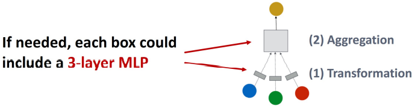
  
  - 2). 잔차 연결을 통해서 Layer을 거치지 않는 길을 마련한다. 
    
    > 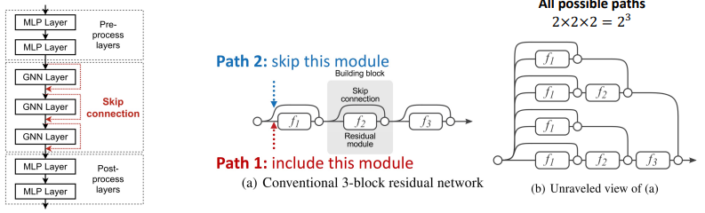
    > 
    > 이때 잔차 연결을 통해 생길 수 있는 경우의 수는 총 layer 가 l개 일때 $2^l$ 이 된다. 
    
    - 잔차 연결의 식은 아래와 같다. 잔차 연결은 바로 마지막 층으로 연결가능하다.
    
    > 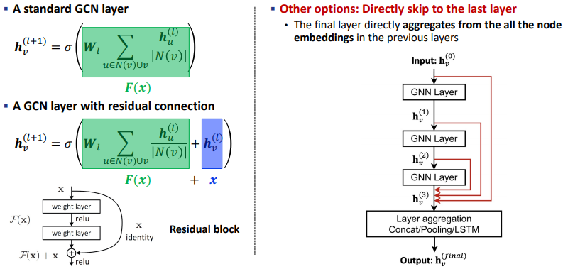
  
  - 3). 각 Iteration 마다 Random하게 Edge를 Dropout 한다. 
    
    > 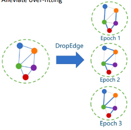
    
    - 각 노드간의 연결성을 끊어 over-smoothing을 방지한다. 
    
    - Dropout 한 여러 버전의 graph을 통해 과적합을 방지한다.

-----

##### PAIRNORM

- Idea : Gnn의 각 Layer 마다 Normalization 해주자 
  
  > 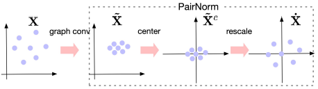
  
  - Total Pairwise squared direction(TPSD)는 상수 값으로 각 Layer마다 유지된다. 

- 방법 : 1) 각 중심 표현($\tilde x^c_i$)을 계산한다. 2) 이후 중심 표현의 값으로 Scaling 한다. 
  
  > 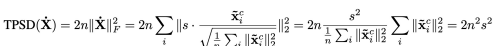
  > 
  > Normalize 되고 난 결과를 볼 때, 우린 Scaling factor s만 고려하면 된다.

----

##### APPNP

- Idea : Target node의 보다 나은 Locality를 포착하기 위해서 개인화된 page rank을 활용하자 
  
  > 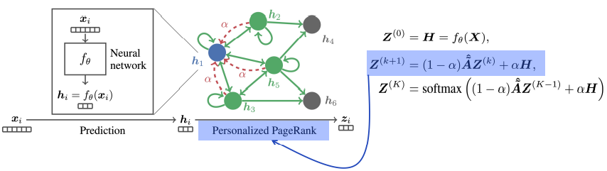
  
  - Teleport probability $\alpha$ 값을 도입한다. 
  
  - 각각의 Neural Network을 propagation scheme 에서 분리한다. 

----

#### SGCN

- 동기 : GCN을 보다 효율적으로 학습할 순 없을까? 

- Idea : 불필요한 Complexity와 계산 부분(non-linearity & weight matrice)을 생략하자.
  
  > 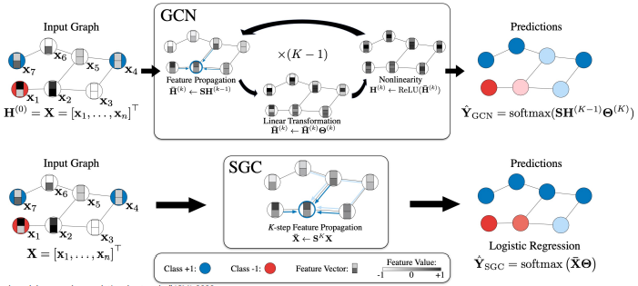
  
  - 기존의 GCN은 k-1번 반복하면서 weight을 학습한다. 
  
  - SGCN에서는 반복 과정을 생략하여 계산 속도를 향상한다.
    
    > 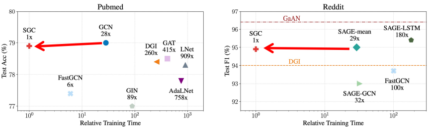

