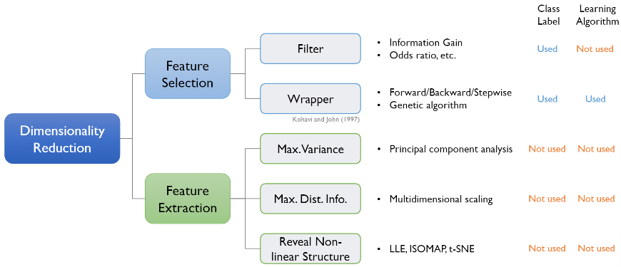
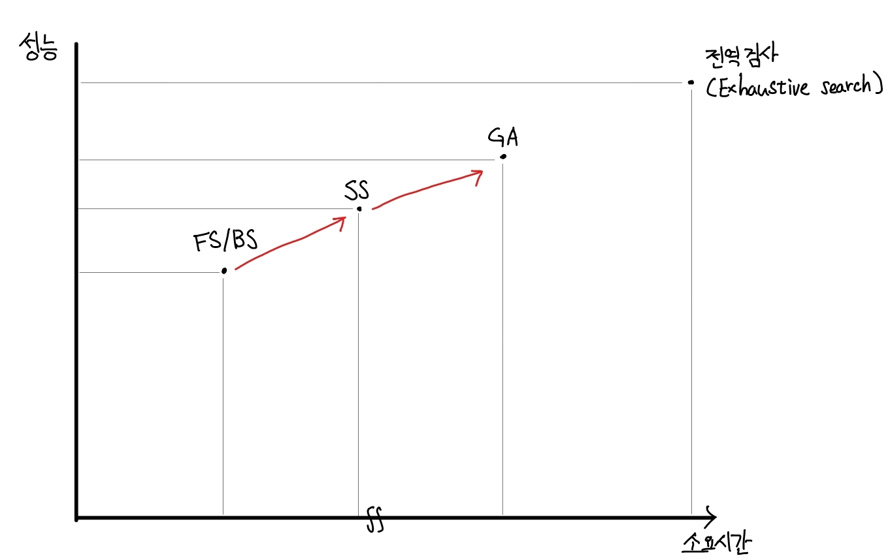
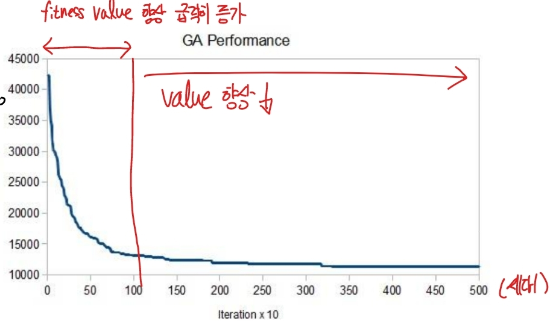

# 차원 감소(Dimensionality Reduction)

출처 : 강필성 교수님의 Business Analytics 강의 

## 머신러닝 과정

1. 전처리(Pre-Processing)
   
   - 정규화 
   
   - **차원 축소**
   
   - 이미지 처리 

2. 학습 
   
   - Supervised
   
   - Unsupervised
   
   - Minimization 

3. 오류 분석(Error Analysis)
   
   - 정확도 / Recall
   
   - 과대 적합
   
   - 평가 / 교차검증 등 

### 차원 축소가 필요한 이유

1. 차원 감소를 통한 계산 효율 향상. 
   
   - 차원이 높을 수록 차원의 저주에 의해 필요로 하는 사례가 많아지며, 이는 계산량 증가로 연결된다.
     
     > **차원의 저주** : 차원이 증가할 때 동일한 설명을 갖추기 위해서 필요로 하는 사례의 수가 **지수적으로 증가**한다.
   
   - 정보를 유지하는 차원(Intrinsic dimension)은 기존 차원에 비해 작은 경우가 있다. 고려 요소가 많을수록 모델 성능을 향상할 것 같지만, 이는 각 요소들이 독립성을 갖췄을 때에 해당한다. 이는 매우 비현실적인 전제로 변수간 의존성을 제거함으로써 차원을 축소할 수 있다. 

2.  노이즈 감소를 통한 예측 성능 향상 
   
   - 고차원일수록 노이즈가 생길 가능성이 높아, 예측 성능을 낮춘다

### 차원 축소의 효과

1. 변수간 상관관계를 제거한다

2. 전처리를 단순화시킨다

3. 관련된 정보를 유지하면서 불필요한 변수를 제거한다

4. 시각화가 가능하다 

### 차원 축소의 방식

- Feature Selection : 기존에 있는 변수 중 "선택" 
  
  > ex) 10개의 변수 중 설명력이 높은 3개 선택
  > 
  > Filter(Unsupervised) : 변수 선택과 모델 학습이 독립적 
  > 
  > Wrapper(Supervised) : 모델 학습의 결과에 최적화된 변수 선정  

- Feature Extraction : 기존에 있는 변수를 조합하여 최대한 많은 정보(변수, 거리 등)를 보존하는 새로운 변수를 추출. 
  
  > ex) z1 = x1 + 2x2, z2 = x3 + 3x4

---

## Feature Selection - Wrapper(Supervised)

- 전역검사 : 모든 가능한 조합을 확인하는 것. 경우의 수 $2^n$ -1 (n : 변수의 개수)

- FS(Forward Selection) : 설명력이 높은 변수부터 차례대로 선택하는 방식 
  
  > 설명력 : 모델이 얼마나 데이터를 잘 설명하는 지를 의미. 설명력 지표(Performance Metrics)로 AIC / BIC / Adjustd $R^2$ 이 있음.

- BS(Backward Selection) : FS와 반대방향으로, 설명력이 낮은 변수부터 제거하는 방식 

- SS(Stepwise Selection) : 설명력이 높은 변수부터 선택하되, 선택된 변수들의 조합도 같이 고려

- GA(Genetic Algorithm) : 휴리스틱한 접근 방식으로, 유전학습 과정을 모방한 방식 
  
  > 휴리스틱 : 대충 어림짐작하기. 복잡한 문제를 효율적으로 시행착오를 거치며 성능을 확보

#### Genetic Algorithm 과정

1) 염색체(Chromesome) 초기화 및 파라미터 설정 
   
   - 염색체 초기화 : 각 염색체의 변수마다 랜덤하게 사용 유무 결정 
   
   - 파라미터 : 염색체 수 / 성능 평가 방식(Fitness fuction) / 교배방식(Crossover mechanism) / 돌연변이율(Rate of mutation) / 종료 조건

2) 각 염색체 선택 변수별 모델 학습 

3) 각 염색체 적합도 평가 

4) 우수 염색체 선택(Selection) 
   
   - 결정론적(Deterministic) 선택 : 성능이 좋은 상위 n%의 염색체만 선정
   
   - 확률존적(Probabilistic) 선택  : 성능에 비례하여 각 염색체가 선정될 확률 부여. 

5) 다음 세대 염색체 생성(Crossoveer & Mutation)
   
   - Crossover : 선택한 염색체들 간 변수값을 교체함. 
   
   - Mutation : 일정 확률로 변수의 값을 변경함
   
   > 이전 세대의 최고 성능을 가진 염색체는 그대로 물려주며 원하는 성능이 나오기 까지 2~5번 과정 반복
   > 
   > 
6. 최종 변수 집합 선택 

--- 

## Feature Extraction

### 1. PCA(Principal Component Analysis)

- ##### 목적 : Original Data의 **분산**을 가장 잘 보존하는 축을 찾자!

- ##### 과정
1. Data Centering 
   
   - 추후 수식 정리의 편의성을 확보하기 위해 분산의 평균을 0으로 맞춘다.
   
   - 분산( $Var(X) =\frac{1}{n} * X X^T$ )에서 $X$ 대신, $X-\overline{X}$를 대입한다.  
     
     

2. 최적화 문제로 수식화 한다. 
   
   - <mark>$V = \frac{1}{n}(w^TX)(w^TX)^T$ = $\frac{1}{n}w^TXX^Tw = w^TSw$ </mark>
     
     > w^TX는 basis $w$에 대해 전사한 매트릭스를 의미
     > 
     > $S$는 벡터 $x$가 정규화 되었을 때의 공분산 매트릭스로, $S=\frac{1}{n}XX^T$임
   
   - 분산을 최대하는 PCA 목적 상 만족시켜야 하는 조건은 아래와 같음 
     
     - <mark>$max (w^TSw)$   $s.t.$  $w^Tw = 1$ </mark>

3.  최적해의 답을 찾는다. 
   
   - 라그랑주 승수법을 이용 
     
     - $max (w^TSw)$  $s.t.$  $w^Tw = 1$ <=> <mark>$L = w^TSw - \lambda(w^Tw -1)$</mark>
     
     - 최대값은 미분값이 0인 지점으로,  
       
       - $\frac{\partial L}{\partial w} =0 $  => <u>$Sw - \lambda w = 0$ (1번식) </u>=> $(S-\lambda I)w = 0$ 
       
       - 을 성립시키는 $\lambda $와 $w$ 찾기. 

4. basis $w$중 기본이 되는 축 찾는다. 
   
   - <mark>$V$</mark> $= \frac{1}{n}(w^TX)(w^TX)^T = \frac{1}{n}w^TXX^Tw = w^TSw$ = <mark>$\lambda_1 + \lambda_2 + ... + \lambda_n$</mark>
     
     - Since $Sw_1$ = $\lambda_1w_1$ & $w^Tw =1$, 
       
       - $w_1^TSw_1 = w_1^T\lambda_1w1 = \lambda_1w_1^Tw_1 = \lambda_1$
     
     - $V = trace(w^TSw) = \lambda_1 + \lambda_2 + ... + \lambda_n$
   
   - eigenvalue를 내림차순에 따라 eigenvector 들 정렬한다. 
     
     - 위에 식에 의거하여 <mark>basis $w_1$ 에 의해 표현되는 분산의 비율은 $\frac{\lambda_1}{sum_{i=1}^n \lambda_i}$ </mark>이다. 
     
     - $\lambda_1$ 이 가장 크기에, basis $w_1$ 이 기본 데이터의 분산을 가장 많이 보존한다. 

5. 기본 데이터를 basis $w_1$ 에 전사하여 새로운 특징(값)을 얻는다. 

6. 새로운 특징으로부터 원 데이터를 복구시킨다. 

- ##### PCA 이슈
  
  - 몇 개의 Principal component를 선정해야 하는가? 
    
    - 정확히 정해진 개수는 없음. 
    
    - 보존하고자 하는 분산 비율과, 각 도메인의 전문가 지식에 달림 
    
    - 또는 분산 비율이 급격하게 감소하는 지점(Elbow point)까지 선정 

- ##### PCA 한계
  
  - 가우시안 분포를 전제로 작동하여, 그 외 경우(ex- non Gaussian / multimodla Gaussian 분포)에는 잘 작동하지 못함 
  
  - 데이터 분류에는 부적절함 
    
    - 

---

