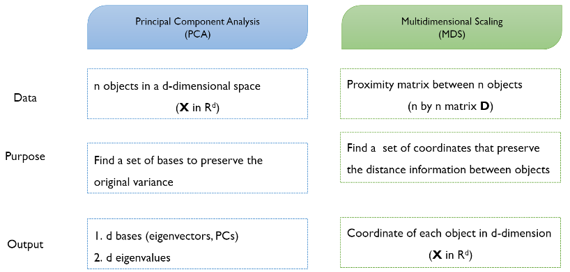

# Topic 1 차원 감소(Dimensionality Reduction)

출처 : 강필성 교수님의 Business Analytics 강의 

출처 : 단단한 머신러닝 챕터 10 - 차원 축소와 척도 학습

#### 해결할 점

1. LLE 에서 각 $W_{ij}$ 와 $z_ij$ 값을 구하는 방법이 생략되어 있음. 확인할 것 
   
   - $\ W_{ij}$ 계산 과정은 찾음. 하지만 해당 결과로 전개하는 방식은 못찾음. 

## 

### 차원 축소가 필요한 이유

1. 차원 감소를 통한 계산 효율 향상. 
   
   - 차원이 높을 수록 차원의 저주에 의해 필요로 하는 사례가 많아지며, 이는 계산량 증가로 연결된다.
     
     > **차원의 저주** : 차원이 증가할 때 동일한 설명을 갖추기 위해서 필요로 하는 사례의 수가 **지수적으로 증가**한다.
   
   - 정보를 유지하는 차원(Intrinsic dimension)은 기존 차원에 비해 작은 경우가 있다. 고려 요소가 많을수록 모델 성능을 향상할 것 같지만, 이는 각 요소들이 독립성을 갖췄을 때에 해당한다. 이는 매우 비현실적인 전제로 변수간 의존성을 제거함으로써 정보 손실을 최소화하면서 차원을 축소할 수 있다. 

2. 노이즈 감소를 통한 예측 성능 향상 
   
   - 고차원일수록 노이즈가 생길 가능성이 높아, 예측 성능을 낮춘다

### 차원 축소의 효과

1. 변수간 상관관계를 제거한다

2. 전처리를 단순화시킨다

3. 관련된 정보를 유지하면서 불필요한 변수를 제거한다

4. 시각화가 가능하다 

5. 샘플의 샘플링 밀도를 올릴 수 있다. 

### 차원 축소의 방식

- Feature Selection : 기존에 있는 변수 중 "선택" 
  
  > ex) 10개의 변수 중 설명력이 높은 3개 선택
  > 
  > Filter(Unsupervised) : 변수 선택과 모델 학습이 독립적 
  > 
  > Wrapper(Supervised) : 모델 학습의 결과에 최적화된 변수 선정  

- Feature Extraction : 기존에 있는 변수를 조합하여 최대한 많은 정보(변수, 거리 등)를 보존하는 새로운 변수를 추출. 
  
  > ex) z1 = x1 + 2x2, z2 = x3 + 3x4

---

## Feature Selection - Wrapper(Supervised)

- 전역검사 : 모든 가능한 조합을 확인하는 것. 경우의 수 $2^n$ -1 (n : 변수의 개수)

- FS(Forward Selection) : 설명력이 높은 변수부터 차례대로 선택하는 방식 
  
  > 설명력 : 모델이 얼마나 데이터를 잘 설명하는 지를 의미. 설명력 지표(Performance Metrics)로 AIC / BIC / Adjustd $R^2$ 이 있음.

- BS(Backward Selection) : FS와 반대방향으로, 설명력이 낮은 변수부터 제거하는 방식 

- SS(Stepwise Selection) : 설명력이 높은 변수부터 선택하되, 선택된 변수들의 조합도 같이 고려

- GA(Genetic Algorithm) : 휴리스틱한 접근 방식으로, 유전학습 과정을 모방한 방식 
  
  > 휴리스틱 : 대충 어림짐작하기. 복잡한 문제를 효율적으로 시행착오를 거치며 성능을 확보

#### Genetic Algorithm 과정

1) 염색체(Chromesome) 초기화 및 파라미터 설정 
   
   - 염색체 초기화 : 각 염색체의 변수마다 랜덤하게 사용 유무 결정 
   
   - 파라미터 : 염색체 수 / 성능 평가 방식(Fitness fuction) / 교배방식(Crossover mechanism) / 돌연변이율(Rate of mutation) / 종료 조건

2) 각 염색체 선택 변수별 모델 학습 

3) 각 염색체 적합도 평가 

4) 우수 염색체 선택(Selection) 
   
   - 결정론적(Deterministic) 선택 : 성능이 좋은 상위 n%의 염색체만 선정
   
   - 확률존적(Probabilistic) 선택  : 성능에 비례하여 각 염색체가 선정될 확률 부여. 

5) 다음 세대 염색체 생성(Crossoveer & Mutation)
   
   - Crossover : 선택한 염색체들 간 변수값을 교체함. 
   
   - Mutation : 일정 확률로 변수의 값을 변경함
   
   > 이전 세대의 최고 성능을 가진 염색체는 그대로 물려주며 원하는 성능이 나오기 까지 2~5번 과정 반복
   > 
   > 
6. 최종 변수 집합 선택 

--- 

## Feature Extraction

### 1. PCA(Principal Component Analysis)

- ##### 목적 : Original Data의 **분산**을 가장 잘 보존하는 축을 찾자!
  
  ##### 과정
1. Data Centering 
   
   - 추후 수식 정리의 편의성을 확보하기 위해 분산의 평균을 0으로 맞춘다.
   
   - 분산( $Var(X) =\frac{1}{n} * X X^T$ )에서 $X$ 대신, $X-\overline{X}$를 대입한다.  

2. 최적화 문제로 수식화 한다. 
   
   - <mark>$V = \frac{1}{n}(w^TX)(w^TX)^T$ = $\frac{1}{n}w^TXX^Tw = w^TSw$ </mark>
     
     > $w^TX$는 basis $w$에 대해 전사한 매트릭스를 의미
     > 
     > $S$는 벡터 $x$가 정규화 되었을 때의 공분산 매트릭스로, $S=\frac{1}{n}XX^T$임
   
   - 분산을 최대하는 PCA 목적 상 만족시켜야 하는 조건은 아래와 같음 
     
     - <mark>$max (w^TSw)$   $s.t.$  $w^Tw = 1$ </mark>

3. 최적해의 답을 찾는다. 
   
   - 라그랑주 승수법을 이용 
     
     - $max (w^TSw)$  $s.t.$  $w^Tw = 1$ <=> <mark>$L = w^TSw - \lambda(w^Tw -1)$</mark>
     
     - 최대값은 미분값이 0인 지점으로,  
       
       - $\frac{\partial L}{\partial w} =0 $  => <u>$Sw - \lambda w = 0$ (1번식) </u>=> $(S-\lambda I)w = 0$ 
       
       - 을 성립시키는 $\lambda $와 $w$ 찾기. 

4. basis $w$중 기본이 되는 축 찾는다. 
   
   - <mark>$V$</mark> $= \frac{1}{n}(w^TX)(w^TX)^T = \frac{1}{n}w^TXX^Tw = w^TSw$ = <mark>$\lambda_1 + \lambda_2 + ... + \lambda_n$</mark>
     
     - Since $Sw_1$ = $\lambda_1w_1$ & $w^Tw =1$, 
       
       - $w_1^TSw_1 = w_1^T\lambda_1w1 = \lambda_1w_1^Tw_1 = \lambda_1$
     
     - $V = trace(w^TSw) = \lambda_1 + \lambda_2 + ... + \lambda_n$
   
   - eigenvalue를 내림차순에 따라 eigenvector 들 정렬한다. 
     
     - 위에 식에 의거하여 <mark>basis $w_1$ 에 의해 표현되는 분산의 비율은 $\frac{\lambda_1}{sum_{i=1}^n \lambda_i}$ </mark>이다. 
     
     - $\lambda_1$ 이 가장 크기에, basis $w_1$ 이 기본 데이터의 분산을 가장 많이 보존한다. 

5. 기본 데이터를 basis $w_1$ 에 전사하여 새로운 특징(값)을 얻는다. 

6. 새로운 특징으로부터 원 데이터를 복구시킨다. 

    

- ##### PCA 이슈
  
  - 몇 개의 Principal component를 선정해야 하는가? 
    
    - 정확히 정해진 개수는 없음. 
    
    - 보존하고자 하는 분산 비율과, 각 도메인의 전문가 지식에 달림 
    
    - 또는 분산 비율이 급격하게 감소하는 지점(Elbow point)까지 선정 

- ##### PCA 한계
  
  - 가우시안 분포를 전제로 작동하여, 그 외 경우(ex- non Gaussian / multimodla Gaussian 분포)에는 잘 작동하지 못함 
  
  - 데이터 분류에는 부적절함 
    
    - 

---

### 2. MDS(Multidimensional Scaling)

- ###### 목적 : 기본 데이터의 "거리" 정보를 보존하는 축을 찾자.
  
  - 다차원에서 대상 간의 거리가 주어져 있을 때, 대상들을 저차원(보통 2,3차원)으로 동일한 상대적 거리를 가진 실수 공간의 점들로 배치시키는 방법 

- **PCA VS MDS**
  
  - 
  
  - >  MDS가 PCA보다 적용할 수 있는 범위가 넓음. PCA의 데이터는 $X$ (in $R^d$) 인데, 항상 모든 속성의 값이 주어진다 할 수 없기 때문. 반면 MDS는 샘플 n개가 있다면 Proximity matrix가 주어진다 할 수 있음  . 

##### 과정

1. **Proximity / Distance Matrix 만들기**
   
   - D 차원에서 두 샘플 z_i 와 z_j 의 거리를 dist_{ij} 라고 할 시, 저차원으로 임베딩한 값을 각각 x_i, x_i가 아래를 만족하면 우리는 거리 값을 유지했다고 할 수 있다.
     
     > $dist_{ij}^2 (=d_{ij}^2) = ||x_i - x_j||^2$
   
   - 조건 : Distance Matrix라면 삼각 부등식을 만족해야함
     
     > 
   
   - Distance : 유클리안, 맨해튼 등의 방식이 있음 
   
   - Similarity : 상관관계(Correlation), Jaccard 등의 방식이 있음 

2. **거리 정보를 보존하는 축을 추출하기. (part 1 $D -> B$)**
   
   - 전체 과정 : <mark>Distance matrix $D$ (n x n)-> 내적 matrix $B$ (n x n) -> $X$ (d x n)</mark>
     
     - 또는 <mark>$D : (x_r - x_s)^T(x_r-x_s) => B : x_r^Tx_s => X : x$</mark>
   
   - Distance matrix $D$ 의 각 성분들은 아래로 표현가능 하다 
     
     > $d_{rs}^2 = (x_r - x_s)^T(x_r-x_s)$
   
   - 내적 Matrix $B$ 는 Distance matrix $D$ 로 부터 얻어질 수 있다. 
     
     > $[B]_{rs} = b_{rs} = x_r^Tx_s$
   
   - $b_{rs}$ 를 우리가 알 수 있는  $d_{rs}$ 에 대한 식으로 변경함으로써 계산한다. (*우리는 Distance matrix에서 $d_{rs}$ 만 계산해낼 수 있음  )
     
     - 모든 p 변수에 대한 평균이 0으로 가정 
       
       > $\sum_{r=1}^{n} x_{ri} =0, (i=1,2, ... p)$
       > 
       > $d_{rs}^2 = x_r^Tx_r + x_s^Tx_s - 2x_r^Tx_s$
       
       > 
       > 
       > 
       
       - 위의 (1), (2), (3) 식을 통해 $b_{rs}$ 를 모두 $d_{rs}$ 에 대한 식으로 변경
       
       > 
   
   - $b_{rs}$ 를 $a_{rs}, a_{r.}, a_{.s}, a_{..}$ 에 대한 식으로 바꾸는 행렬 계산식 도출 
     
     - $[A]_{rs} = a_{rs}$ , $H = I - \frac{1}{n}11^T$
     
     - then <mark>$B = HAH$. </mark>

3. **거리 정보를 보존하는 축을 추출하기. (part 2 B -> X)**
   
   - Inner Matrix $B$ 로부터 새로운 coordinate matrix $X$(n x p, p < n) 찾아내기 
     
     - $B = XX^T, rank(B) = rank(XX^T) = rank(X) = p$
   
   - Matrix $B$를 고유값 분해(Eigen-decomposition)를 통해 정리 
     
     - $B$ 는 Symmetric, positive semi-definite, rank가 p이기 때문에, non-negative인 p개의 고유값(eigenvalue)과 0값인 n-p 개의 고유값을 가진다.
     
     > positve semi-definite : $x^TBx >= 0$ for all of $x \in R^d /0$
     
     - $B = V \wedge V^T$
       
       > $\wedge = diag(\lambda_1, \lambda_2, ... \lambda_p)$
       > 
       > $V = [v_1, v_2, ... v_p]$
   
   - 현실 응용에서는 차원 축소의 효율성을 위해, $dist_{ij}$ 와 $||x_i-x_j||$ 꼭 같아야 한다고 요구하진 않는다. 고유값이 0인 경우는 효율성을 위해 제거하기도 한다. 
     
     - (n-p) 개의 0 값인 고유값 때문에 B는 다시 아래와 같이 표현할 수 있음. 
       
       > $B_1 = V_1\wedge_1V_1^T, \wedge_1 = diag(\lambda_1, \lambda_2, ... \lambda_p), V_1 = [v_1, v_2, ... v_p]$
     
     - 위의 식에 의거하여<mark> $X$(n x 1) = $V_1\wedge_1^\frac{1}{2}$</mark> 로 구현

##### 추가 내용

- S - Stress : p차원 공간상에서의 원래거리와 2차원 공간상에서 표현된 거리 사이의 일치성을 측정하는 방식 
  
  - S-Stress 값을 최대한 작게 하도록 반복과정을 수행하며, 최종 표현 결과의 적합도 수준은 스트레스 값에 의하여 결정된다. 
  
  - 통상적으로 S-Stress의 크기가 5% 이내이면 잘 표현되었다고 하며, 20% 이상인 경우에는 잘못 표현되었다고 함.  

- 원 차원 D 보다 차원이 줄어들었을 때 정보의 손실이 발생할 수 있으니, 이때 S-stress 방법을 통해 얼마나 잘 표현하는 것인지 확인하는 것으로 판단됨. 

-----

## Non-linear case

##### 매니폴드 학습 - ex) ISOMAP / LEE

> 매니폴드 학습 : 학습되지 않은 상태에서 비유클리디안 형태의 데이터를 이용해 모델을 학습하는 것. 
> 
> 비유클리디안 : 유클리드 거리(두 점을 직선으로 이은 것이 최단 거리)를 적용할 수 없는 형태. 

-          (비유클리디안 예시)     
  
  - 위의 그림에서 점의 이동은 파란 실선에 따라 움직인다. 따라서 두 점 사이의 거리를 구할 때 두 점 사이의 직선거리가 아닌, 파란 선을 따라 이동한 거리를 재야한다. 

- 위상학 개념을 빌린 차원 축소 방법으로, 주요 특징으로는 국소적으로는 유클리드 공간의 성질을 가진다는 점이다. (<=> 가까운 거리 내에서는 유클리드 거리를 적용할 수 있다)

- 일반적으로 저차원 매니폴드가 고차원 공간으로 임베딩시킨 후, 국소거리간 유클리드 공간의 성질을 이용하여 전체 데이터의 관계를 유클리드 방식으로 표현해냄. 

##### 1. ISOMAP(Isometric Feature Mapping) 의의

- 다차원, non-linear 한 데이터 간 거리 정보 보존을 목표로 함.  
  
  - 계산 효율성 증대, 전역해(global optimality) 탐색, 점진적인 수렴 보장 가능 
  - 기존 매니폴드 방식(고차원으로 임베딩 후 직선 거리구하기)에 반대하여, 저차원내에서 유사 거리를 구하고자 함.  

- 
  
  > 점 두개를 각각 a점, b점으로 지칭하겠음 
  > 
  > 파란색 선은 a점, b점을 직선으로 이었을 때의 길이 
  > 
  > 빨간색 선은 a점, b점 간에 각 노드를 지나서 온다고 할 때 최소 거리를 의미함. 
  
  - 1) PCA / MDS 를 못 쓰는 이유 
       
       - PCA 와 MDS는 다차원 내에 최소거리를 측정함. 이를 그림 A의 파란색 점선과 동일함. 하지만 매니폴드 공간에는 적합하지 않은 방법임. 
    
    2) 파란색 선이 아니라 빨간 색 선을 구하는 이유 
       
       - 파란색 선은 기하학적으로 봤을 때 최적 거리라 할 수 있으나, 해당 거리를 측정할 수 없음. 이에 isomap에선 점 a, b에 대한 거리 d(a,b)를 가까온 노드와 연결하여 나온 거리로 재정의하여 계산함. 

##### ISOMAP 방식

1. 이웃 그래프(Neighborhood graph)를 만든다. 
   
   - $\epsilon$ - Isomap : $\epsilon$ 보다 거리가 작은 두 점을 연결 
   
   - $k$ - Isomap : 두 점간의 거리가 k번째 까지 가까운 경우 연결 

2. 가장 가까운 길을 계산하기 
   
   - $d_G(i,j)$ 의 값을 i와 j가 연결되어 있으면 둘의 거리 값($d_X(i,j)$)으로, 그렇지 않다면 $-\infty$ 를 부여 
   
   - 각 k 값(1,2,... N) 에 대해, $d_G(i,j) = min(d_G(i,j), d_G(i,k) + d_G(k,i)$ 적용 

3. MDS 방법을 통해 d 차원 임베딩 실시  

##### 2. LLE(Locally Linear Embedding) 의의 <mark>(이해도 낮음- 고민 더 필요)</mark>

- 고차원 공간에서 데이터들 사이의 <u>선형적 구조</u>를 보존하면서 저차원으로 임베딩하는 것
  
  > 여기서 선형적 구조란, "특정 샘플이 다른 샘플에 의한 선형 조합되는 것''을 의미
  > 
  > ex) - $x_i = w_{ij}x_j + w_{ik}x_k + w_{il}x_l$

- 장점 
1. 사용하기 쉽다. 

2. 최적화가 Local Minimum으로 가지 않는다.  

3. 비선형 임베딩 생성이 가능하다. 

4. 차원 감소 가능 

##### LLE 과정

    * Eigenvectors V가 d+1 차원을 가지는 것은 Rayletz-Ritz Theorem 의한 것 *

> Rayletz - Ritz Theorem : 최적의 임베딩은 매트릭스 M의 bottom d+1 eigenvector들을 계산함으로서 찾아진다. 

    

1. 각 샘플별 이웃 샘플 선정 

2. 비용 함수(~복원정도)를 최소화하는 각 이웃으로부터 최대한 복원시키는 비중 $W_{ij}$ 계산
   
   - 변수 $x$를 기반으로 $W$ 을 계산하는 것 
   
   
   
   > $W_{ij}$ : $x_i$ 를 재복원하기 위해 $x_j$에 부여되는 가중치. 
   > 
   > 이웃에 의해 완전히 복원되면(<=> 한 점이 이웃에 의해 둘러싸이면) $E(W)=0$ 임.  
   
   - 이때 $W_{ij}$ 의 값은 아래와 같음 
     
     > $W_{ij} = \frac{\sum_{k\in Q_i} C_{jk}^{-1}}{\sum_{l,s \in Q_i} C_{ls}^{-1}}$
     > 
     > s.t. $C_{jk} = (x_i - x_j)^T(x_i - x_k)$

3. 아래 식을 최소화 시키면서 $W_{ij}$ 으로 가장 잘 복원된 벡터 $y$ 를 계산  <mark>(아래 식 이해도 낮음)</mark>
   
   - 변수 $W_{ij}$ 를 기반으로 벡터 $y$ 를 계산하는 것 
     
     
     
     

### 3. t-SNE(Stochastic Neihbor Embedding) 의의

- 자기 범주에 있는 것끼리 모아 구분하기 - 가장 많이 사용하는 방법  
  
  - 

- 가까운 이웃 뿐만 아니라, 멀리 있는 이웃들까지 고려하자! (LLE와 차이)
  
  - 단, 거리에 반비례하여 확률값을 부여하자

##### 용어 정리

       

> $p_{j|i}$ : 원래 차원($D$)에서 객체 i가 j를 이웃으로 선택할 확률
> 
> $q_{j|i}$ : 축소된 차원($D^{'}$)에서 객체 i가 j를 이웃으로 선택할 확률
> 
> *아래 분모는 이웃 사례를 다 더했을 때 1이 되도록 강제하는 normalizaion임 

###### 목표 : 고차원 상의 분포를 저차원 상에 임베딩(전사)했을 때에도 최대한 비슷하게 유지할 것.(<=> $p_{i|j}$ 와 $q_{i|j}$를 최대한 유사하게 만들 것 )

##### SNE 과정

1. 적절한 이웃 반경 설정하기 - 원하는 수준의 엔트로피에 맞춰서 
   
   - $x_i$ 는 원래 차원에서 가우시안 분포에 따라 분포한다 했을 때, 표준편차의 크기에 따라 $x_j$ 를 유의미한 이웃으로 고려할 수도 아닐 수도 있음  
     
     - <=> radius(=표준편차)에 $p_{j|i}$ 값과 엔트로피는 비례한다
   
   - 따라서 우리가 원하는 엔트로피 정도에 따라 반경(radius)를 계산한다. 
     
     
     
     >  H($P_i$) : 엔트로피
   
   - 이때 SNE는 복잡도(Perplexity)가 5~50 사이에선 대체로 강건(robust)하다.

2. 저차원 표현에 대한 비용 함수 - Kullback Leiber divergence - 설정하여, 최소화할 것
   
   > Kullback-Leibler divergence : 두 평균 분산에 대한 차이를 비교하는 방법. 
   > 
   >  단, non-symmetric 하기 때문에 distance matrix는 아님
   > 
   > 
   
   - 비용 함수를 편미분하여 최소값을 찾아낼 것. 결과는 아래와 같이 단순하게 나오나, 과정은 매우 귀찮음. 
     
     - 

##### SNE 추가 Develop

1. SNE를 Symmetric 하게 재정의하기 
   
   
   
   > i와 j가 함께 뽑힐 확률인 $p_{ij}$ 를 1) i에서 j를 이웃으로 뽑을 확률($p_{j|i}$)과 2) j에서 i를 이웃으로 뽑을 확률($p_{i|j}$)의 합의 형태로 표현함.  
   
   - 위의 식을 적용할 경우 비용 함수의 gradient는 아래와 같이 표현됨 
     
     
   
   - 단, 위의 Symmetric SNE는 Crowding problem이 발생함 
     
     - SNE가 Gausian 분포에 의존하다보니, j가 일정 이상 i에서 떨어지면 가능성이 급격하게 떨어지게 됨

2. Crowding Problem을 해결하기 위해 자유도가 1인 t 분포를 적용 (t-SNE)
   
   
   
   > 고차원에서는 Gausian 분포를, 저차원 상에서는 t 분포를 적용 
