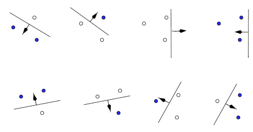
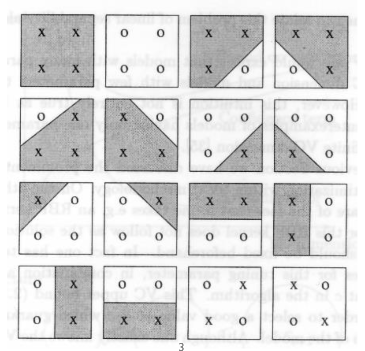
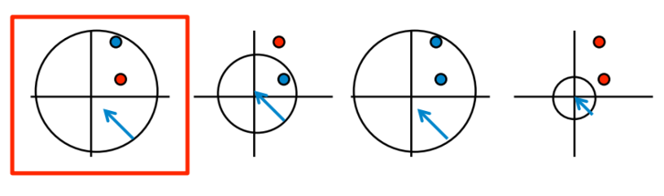
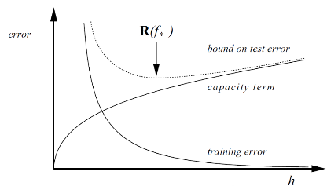
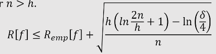
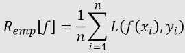

# Topic 2 커널(Kernel) 기반 학습

출처 : 강필성 교수님의 Business Analytics 강의

출처 : 단단한 머신러닝 챕터 6 - 서포트 벡터 머신 

##### 

#### 기본 개념

- ###### Shatter
  
  > 함수 F에 의해 n개의 point가 임의의 +1/-1의 값을 가질 때의 모든 경우의 수가 직선 분류기에 의해 구현될 경우, 함수 F는 n개의 points를 shatter 할 수 있다. 
  
       
  
      
  
  - ex-1)2차원 상에서 3개의 점은 직선방정식에 의해 Shatter 가능하다 
    
    ex-2)2차원 상에서 4개의 점은 직선방정식에 의해 Shatter 불가능하다.
    
    ex-3)2차원 상에서 2개의 점은 원에 의해 Shatter 불가능하다.

- ###### VC Dimension
  
  > 특정 가설 H에 의해 Shatter 될 수 있는 point들의 최대 개수
  
  - 가설 공간의 수용량을 측정하는데 사용됨. 
  
  - 수용량은 함수의 복잡도, 분류 경계면의 융튱성(flexibility)를 측정하는 수단이 됨. 

- ###### Structural Risk Minimization(SRM)
  
      
  
  > h :  VC dim. 모델의 복잡도(capacity term)을 의미
  
  - 모델의 리스크(-bound on test error)는 Training Error(empirical error)과 Capacity term의 합으로 Bound 된다.
    
    
    
    
    
    > h : VC dimention 
    > 
    > n :  학습 데이터의 수
    > 
    > $\delta $ :  0~1 사이에 들어가는 확률 parameter 
    > 
    > L : Loss 함수. 예측이 맞으면 0, 틀리면 1의 값을 가짐.
    
    - 학습 데이터의 수가 증가하면, Capacity 감소 및 Training error 감소함. 
    
    - 모델 복잡도가 증가하면, Capacity는 증가 및 Training error 감소함<mark> (Trading off 관계)</mark>

##### 짥막 정리 - 커널머신 vs 딥러닝

- 과거 머신러닝 분야에서는 Kernel 방식이 Deep-learning 방식보다 각광받음. 
  
  - SRM에 의거하여, 모델 복잡도가 높은 Deep-learning은 Kernel에 비해 성능이 좋지 않다고 여김. 
  
  - 또한 Kernel 방식을 통해서는 바로 최적해(global optimum)을 찾을 수 있는 데 비해, Deep-learning은 Local optimum을 찾음.  

- 하지만 위의 두 이유는 Deep-learning의 발전을 통해 해결될 수 있었음 
  
  - 1. 모델 복잡도가 매우 높아도, 정규화 등 몇가지 조치를 해주면 유의미한 $R[f_*]$ 를 만들 수 있음 
    
    2. 다차원 공간에서 모든 방향에 대해 local optimum인 경우는 거의 없음을 확인. Deep-learning으로도 대단히 높은 확률로 Global optimum을 찾을 수 있음을 증명
       
       

----- 

### SVR(Support Vectoc Machine)

- SVR은 분류 결정 방법이다. 
  
      
  
  - $g(x)$는 Linear SVR 이며, 추후 Kernel 도입시 Non-linear functions 처럼 적용할 수 있다. 

- ###### 의의
  
  - 이진 분류 문제에서 SRM을 최소화하는 모델을 찾을 수 있다. 

###### 

- ###### SVR 유형 분류 - 선형/비선형 유무, 예외 허용 유무

        

- ###### Margin
  
  > Margin : 분류 경계면으로 부터 가장 가까운 양쪽 범주 객체와의 거리
  
  >       
  
  - margin 길이를 최대로 가지는 직선 분류기는 <mark>강건성이 높으며, Capacity term을 줄여 전체 Error을 줄일 수 있다.</mark> 
    
    - Margin과 VC-dimention의 관계식은 아래와 같다. 
      
      
      
      위의 식에서 Margin을 최소함으로써 Vc-dim을 최소화시킬 수 있다.  
      
      > h : Capacity term(VC - dim)
      > 
      > R : 전체 data를 감싸는 호구의 반지름 (고정값)
      > 
      > $\triangle$ : Margin (변동값)
      > 
      > D : 차원 수 (고정값)  
  
  - 따라서<mark> Margin을 최대로 가지는 직선 분류기를 제일 좋은 것</mark>으로, 
    
    <mark>최대 마진을 가진 직선 분류기를 찾는 것이 SVM의 목표</mark>이다. 
  
  - 예외를 허용하는 경우를 Soft marging으로, 허용하지 않는 경우를 Hard margin이라 한다. 
  
  

- **KKT(Karush-kuhn-Tucker) 조건**
  
  - KKT 조건 수립 <=> 강한 쌍대성 성립(Duality gap이 zero다 )
    
    - KKT 조건 
      
      > m개의 부등식 제약 $h_i(x)$ <= 0 와 r개의 등식 제약 $l_j(x) =0$ 아래에서 함수 $f(x)$ 를 최소화하기 위해선 아래의 조건을 성립해야 한다. 
      > 
      > 1. Stationary : $0 \in \sigma(f(x) + \sum_{i =1}^m u_ih_i(x) + \sum_{j=1}^rv_jl_j(x)) $
      > 
      > 2. Complementary slackness : $u_ih_i(x) =0$ for $\forall i$ 
      > 
      > 3. Primary feasibility : $h_i(x)<=0, l_j(x) =0$ for $\forall i,j$
      > 
      > 4. Dual feasibility : $u_i >= 0 $ for $\forall i$
    
    - 강한 쌍대성 
      
      - 듀얼 문제의 값과 목적 함수의 값이 동일하게 되는 것 
        
        > 듀얼 함수 : $\tau(u, v)$ = $inf_{x \in D} L(x,u,v)$ 
        > 
        > 목적함수 : $f(x)$
  
  - **증명**
    
    1. $L(x,u,v) = f(x) + \sum_{i =1}^m u_ih_i(x) + \sum_{j=1}^rv_jl_j(x)$이며,  $\sum_{i =1}^m u_ih_i(x) + \sum_{j=1}^rv_jl_j(x)$ 은 항상 0보다 작거나 같다.
    
    2. 1에 의해서 듀얼함수와 목적함수 간에 아래의 관계가 형성된다 
       
       $\tau(u, v) = inf_{x \in D} L(x,u,v)$ <= $​L(\tilde x,u,v)$ <= $f(\tilde x)$ 
       
       > $\tilde x$ : 제약식을 성립시키는 $x$ 값들 
    
    3. KKT 조건에 따라서 $L(x,u,v)$ 의 제약식 부분들은 모두 0으로 제거된다. 그 결과 $\tau(u, v)$ = $f(\tilde x)$ 을 성립한다. 이는 듀얼 문제의 최대값을 찾은 것이자 목적함수의 최소값을 찾은 것을 의미한다. 
       
       

---

#### SVR - Linear & Hard margin 과정

1. **최적화 문제 정의**
   
   - Margin의 크기를 최대화하면서, 데이터를 이진 분류하는 선형 함수($w^Tx +b$) 
     
     - $min \frac{1}{2}||w||^2$ s.t. $y_i(w^Tx_i + b) >= 1 $ 
     
     > margin의 크기 : $\frac{2}{||w||^2}$ . margin을 최대화 하는 것은 $\frac{1}{2}||w||^2$ 을 최소화하는 것과 동일 
     > 
     > $y_i$는 1) $w^Tx + b >= 1$ 일때 +1 값이, 2) $w^Tx+b <= -1$ 일때 -1 값을 가짐. 두 경우 합쳐서 $y_i(w^Tx_i + b) >= 1$ 를 의미함. 

2. **라그랑주 승수법을 통해서 라그랑주 목적 함수(Primal fuction)로 변환**
   
   <mark>(식 1)</mark>
   
   > $\alpha_i$ : 라그랑주 승수 
   
   - 편미분에 의해 아래 조건이 성립할 때 목적함수는 최솟값을 가짐 
     
     <mark> (조건 1)</mark>
   
   - 또한 KKT에 의해서 목적함수 속 제약식 부분들은 아래의 조건을 만족해야 함. 
     
      <mark>(식 2)</mark>
     
     s.t.  
     
     - 즉, $w^Tx_i +b$ = $y_i$ <mark>(식 3)</mark> 경우 외엔 $\alpha_i$ 가 0으로, 고려하지 않아도 된다. 
     
     - <=> Support Vector 위에 있는 점들만 고려해주면 된다. <mark> (조건 2)</mark>
       
       > Support Vector :  분류 경계면에서 가장 가까운 점들로 $w^Tx_i + b$ = $y_i$을 만족시킴. 
- - <mark>조건 1, 조건 2에 의해 $w$는 Support Vector 위의 점에게만 영향을 받는다.</mark>
  
  <mark>(조건 3)</mark>
3. **목적 함수(Primal fuction)을 듀얼 함수(Dual fuction)로 변경하여 답 찾기.**
   
   > 듀얼 문제 : 목적함수의 x 변수를 $\lambda$에 대한 식으로 대입하여 나오는 문제. 
   > 
   > "라그랑주 목적 함수의 최소값 = 라그랑주 듀얼 문제의 최대값" 이라는 관계를 가지고 있으며, 종종 $L_P$ 를 $L_D$ 로 바꾸면 수월하게 풀릴 때가 있음. 
   
   - 목적함수(식 1)에 조건 1을 대입하면 아래의 수식이 나옴
     
     
     
     - 위의 수식에서 $y_i, y_j, x_i, x_j$ 는 주어지는 값으로 상수 취급할 때, 
       
       듀얼 문제는 $\alpha$ 에 대한 <mark>Convex 함수 형태를 띔</mark>. 
       
       즉, <mark>항상 최적값(global optimum)을 찾을 수 있음 </mark>
   
   - 위의 수식을 충족시키는 $\alpha_i$ 값을 찾음으로써 새로운 값($x_{new}$)를 분류하는 함수를 만들 수 있다. 
     
     

- **추가 - SMO 적용**
  
  - SVM 문제의 계산량은 훈련 데이터 샘플 수에 정비례하여, 큰 데이터 처리에는 제약이 많음
  
  - 이에 라그랑주 승수 2개를 선별($\alpha_i, \alpha_j$) 외의 모든 파라미터들을 고정시켜 계산양을 줄인다. 
    
    - 각 라그랑주 승수에 대응하는 샘플의 마진값이 가장 큰 $\alpha_i, \alpha_j $ 을 선택한다. 

 

+ **추가 -  Margin 계산하는 법**
  
  + Support Vector (식 3)을 정리 및 조건 1을 대입하면 아래의 식이 됨
    
    
    
    위의 식 양 측에 $\alpha_iy_i$ 를 곱한다음 Sum을 취하면 아래 식이 됨
    
    
    
    $y_i^2$ 이 1인 점, 조건 1을 반영하여 margin의 길이($\rho$)를 구할 수 있음.  
    
    

---

#### SVR - Linear & Soft margin

- **의의 및 방향성**
  
  - 실제 데이터에는 노이즈가 많아, Hard margin이 아예 안나오는 경우가 많음. 
  
  - 이에 예외에 대해 얼마나 비용(C)을 따질지 고려하고, 예외 정도에 따라 페널티($\xi$)를 부여함으로써 최적의 직선 분류기를 찾고자 함. 

- ##### 과정 - Hard margin과 유사
1. **최적화 문제 정의**
   
   - $min \frac{1}{2}||w||^2 + C\sum_{i=1}^{N} \xi_i $
   
   - s.t. $y_i(w^Tx_i +b) >= 1 - \xi_i, \xi_i >= 0, \forall i$
     
     > 
     > 
     > $\xi_i$ (Penalty) : Margin에서부터 예외까지의 거리 
     > 
     > C : Regularization Cost. Penalty를 얼마나 크게 고려할 것인가.

2. **라그랑주 승수법을 통해서 라그랑주 목적 함수(Primal fuction)로 변환**
   
   (식1)
   
   > $\alpha_i$ : 제약식 $y_i(w^Tx_i+b) >= 1- \xi_i $에 대한 라그랑주 승수 
   > 
   > $\mu_i$ : 제약식 $\xi_i >= 0$ 에 대한 라그랑주 승수. 
   > 
   >     *위의 사진에는 $\mu_i$ >=0 에 대한 식이 누락됨
- 편미분에 의해 아래 식이 도출됨 
  
  <mark>(조건 1)</mark>

- KKT 조건에 따라서 목적함수의 제약식 부분은 아래 조건을 만족해야 함. 
  
  가. $\alpha_i(y_i(w^Tx_i +b) -1 + \xi_i) =0$ (단, 제약식과 $\alpha_i$가 동시에 0일 순 없다.)
  
  나. $\mu_i\xi_i$ =0 (단 $\mu_i 와 \xi_i$는 동시에 0일 순 없다.)
  
  다. $C - \alpha_i - \mu_i$ = 0 (from 조건 1)

- 위의 조건들은 $\alpha_i$ 의 값에 따라 3가지 상황으로 구분된다. 
  
  <mark>$w$ 의 값은 $x$가 1) 서포트 벡터 위에 있을 때, 2) 예외일 경우에만 고려하면 된다. </mark> 
  
  - case1 : $\alpha_i =0$ 
    
    - $\alpha_i =0$ 이므로, (다) 조건은 "$C=\mu_i$" 이며, 이는 (나) 조건에서 $\xi_i =0$ 임을 도출할 수 있다.
    
    - $\alpha_i =0$ , $\xi_i =0$ 이므로, (가) 조건은 $y_i(w^Tx_i +b) -1 \neq 0$ 로 바뀐다. 이는 <mark>$x_i$ 가 Support vector 위에 없음</mark>을 의미한다.
  
  - case 2 : 0 < $\alpha_i < C$  
    
    - (다) 조건에서 $\mu_i >0$ 임을 도출, 이는 (나) 조건에서 $\xi_i =0$ 임을 도출할 수 있다. 
    
    - $\alpha_i \neq 0$, $\xi_i =0$ 이므로, (가) 조건은  $y_i(w^Tx_i +b) -1 = 0$로 바뀐다. 이는 <mark>$x_i$가 Support vector 위에 있음</mark>을 의미한다. 
  
  - case 3 : $\alpha_i = C$
    
    - (다) 조건에서 $\mu_i =0$ 임을 도출, 이는 (나) 조건에서 $\xi_i \neq 0$ 임을 도출할 수 있다.  
    
    - $\alpha_i \neq 0, \xi_i \neq 0$ 이므로, (가) 조건은 $y_i(w^Tx_i +b) -1 - \xi_i = 0$로 바뀐다. 이는<mark> $x_i$가 Margin을 벗어나 페널티를 받는 곳에 있음</mark>을 의미한다. 
    
     
3. **목적 함수(Primal fuction)을 듀얼 함수(Dual fuction)로 변경하여 답 찾기.**
   
       
   
   - 식 1에서 조건 1을 대입하여, 노란색 / 초록색끼리 식을 정리하면 아래의 식이 나옴
     
     
     
     - 위 결과에서 듀얼문제의 식 자체는 Hard margin과 동일하나, $\alpha_i$ 에 대한 제약식만 추가된 것을 확인할 수 있다. 

--- 

#### SVR - Non - Linear & Soft margin

##### 커널 함수의 도입

- 목적 :<mark> Margin을 최대화하고, training error를 최소화하는 Hyperplane을 찾는 것</mark> 

- Mapping function $\phi(x)$을 도입함으로써 저차원의 input 벡터를 고차원으로 매핑한다. 
  
  단 커널 함수를 도입하여 고차원 상의 계산을 생략한다.
  
  

- ###### 과정 - 앞의 과정과 유사
  
  1. **최적화 문제 정의**
  - $min \frac{1}{2}||w||^2 + C\sum_{i=1}^{N} \xi_i$
  
  - s.t. $y_i $ <mark>$(w^T\phi(x_i)$</mark> +$b) >= 1 - \xi_i, \xi_i >= 0, \forall i$
2. **라그랑주 승수법을 통해서 라그랑주 목적 함수(Primal fuction)로 변환**
   
       

3. **목적 함수(Primal fuction)을 듀얼 함수(Dual fuction)로 변경하여 답 찾기.**
   
   
   
   > 각 과정의 유일한 차이점은 $xi, xj$ 값들이 $\phi(x_i), \phi(x_j)$로 바뀐 것

4. **커널 트릭을 도입한다.**
   
   
   
   > 커널 함수 : $\phi(x_I)\phi(x_j) = K(x_i,x_j) $을 만족하는 함수
   
   - 여기서 $\phi(x_i)^T\phi(x_j)$ 의 형태는 벡터간의 내적과 동일하다. 만약 저차원에서 <mark>$\phi(x_i)^T\phi(x_j)$의 값과 동일하게 만들어주는 Kernel 함수를 찾을 수 있다면</mark> 우리는 굳이<mark> $\phi(x)$ 함수를 찾지 않아도 된다</mark>.
- ##### 커널 함수의 장점
  
  1. 효율적이다. 일반적으로 $\phi(x)$ 를 계산하는 것보다 Kernel 함수를 도입하는 게 계산양이 적다.
  
  2. 융튱성이 있다. $\phi(x)$가 존재한다면 Kernel 함수는 임의적으로 선택할 수 있다. 

- ##### 커널 함수의 조건
  
  1. Symmetric 해야한다. 
     
     - $\phi(x_i)^T\phi(x_j)$ = $\phi(x_j)^T\phi(x_i)$ 이므로, 
     
     - $K(x_i, x_j) = K(x_j, x_i) 가 성립한다$
  
  2. Positive semi-definite 여야 한다. 
     
     > 임의의 벡터 X에 대해서 항상 $x^TKx$ >=0 을 성립한다. 
     
     - 이 조건을 달성해야 <mark>재생 커널 힐베르트 공간</mark> 특성을 가지며 항상 대응하는 mapping 함수 $\phi(x)$ 를 찾을 수 있다. 

- ##### 커널 함수의 종류
  
  - Polinomial : $K(x,y) = (xy+c)^d, c>0$
  
  - <u>Gaussian (RBF)</u> : $K(x,y) = exp(-\frac{||x-y||^2}{2\sigma^2}), \sigma \neq 0 $
    
    - RBF는 유한 차원의 데이터를 무한 차원까지 mapping 할 수 있기 때문에 자주 쓰임 
  
  - Sigmoid : $K(x,y) = tanh(a(xy) +b), a,b>=0$ 

- **RBF Kernel의 $\sigma$ 값, Cost와 경계 복잡도의 관계**
  
  - $\sigma$ 는 데이터의 표준분산을 의미. ( <=> kernel 함수의 width를 의미함)
    
    - $\sigma$ 값이 클수록 분류 경계면은 선형에 가까워지며, 작아질수록 복잡해짐
    
    - <=> gamma가 작을수록 분류 경계면은 선형에 가까워지며, 커질수록 복잡해짐
      
      > gamma = $\frac{1}{\sigma^2}$
  
  - Cost값이 예외에 대해 얼마나 민감하게 대응할지를 의미 
    
    - Cost 값이 높아질수록 경계복잡도는 복잡해지며, 낮아질수록 단순해짐. 

---

### SVR(Support Vector Regression)

###### Fuction fitting의 목적

1. 에러를 최소화하라 by loss function 

2. 가능한 단순한 게 좋다 
- 1,2 둘다 고려한 예제) - Ridge Regression
  
  - min { <mark>$\frac{1}{n}\sum_{i=1}^n(y_i-\hat{y}_i)^2$</mark> (1)  +<mark> $\lambda\sum_{i=1}^d\hat{\beta_d^2}$ </mark>(2)}
    
    > (1) 식의 의미는 Loss를 최소화하라는 것 
    > 
    > (2) 식의 의미는 모형을 단순화하라는 것. 
    > 
    > $\hat{\beta_d}$ : 회귀계수
  
  - 장점 
    
    - 계수 크기에 페널티를 줌으로써 variance가 큰 상황을 막아, 함수가 overfitting 하는 경우를 방지한다. 

- <mark>SVR의 목적도 1) 에러를 최소화하면서, 2) 함수의 단순함(flatness)을 추구하는 것</mark>이다.
  
  - ex) $\epsilon - SVR $ 
    
    - 조치 1) function에 Epsilon-tube 적용하여 예외 허용  
    
    - 조치 2) Loss function으로 hinge loss를 선택하여, 예외에 덜 민감하게 반응 
      
      >  $y=f(x) +\epsilon$
      
      > 
      > 
      >  *기존에는 Loss function으로 Squared loss를 사용.*

- ##### SVR - linear & non-linear 과정
  
  1. **최적화 문제 정의**
     
     
     
     > $\xi_i^*$ : 추정값보다 실제값이 큰 정도. 기준은 Epsilon tube 경계선
     > 
     > $\xi_i$ : 추정값보다 실제값이 작은 정도. 기준은 Epsilon tube 경계선
     > 
     >  *우측 그래프에는 $\xi, \hat\xi$ 가 서로 반대로 표기됨*
     
     - $\frac{1}{n}||w||^2$ 을 최소화하는 것은 margin을 크게하는 것이자, 함수를 간단히 표현하는 것과 동일 
     
     - $C\sum_{i=1}^n(\xi_i+\xi_i^*)$ 을 최소화하는 것은 오차를 줄이는 것과 동일
2. **라그랑주 승수법을 통해서 라그랑주 목적 함수(Primal fuction)로 변환**
   
   
   
   > $\alpha_i, \alpha_i^{(*)}, \eta_i, \eta_i^{(*)}$ : 라그랑주 상수  
   
   - 편미분에 의해 아래 식이 도출됨
     
     

3. **목적 함수(Primal fuction)을 듀얼 함수(Dual fuction)로 변경하여 답 찾기.**
   
   
   
   - 주어지는 값인 $x_i, y_i, \epsilon$ 를 대입하면 $\alpha_i, \alpha_i^{(*)}$ 에 대한 convex 함수 형태로 바뀜. 듀얼 문제의 해를 구한다면 아래의 Decision Fuction을 도출할 수 있음 
     
     

4. **커널 트릭을 도입한다.** (Non-linear case 포함)
   
   
   
   
- SVR에 사용하는 다양한 Loss Fuction 예시 (상황에 따라 사용하는 게 다름)
  
  

--- 

### Kernel Fisher Discriminant Analysis

##### 1. LDA

- 목적 : 두 클래스를 보다 잘 구분해낼 수 있는 Projection line을 찾는 것 
  
  <=><mark> Projction 했을 때 1) 클래스 간 거리는 최대화하면서, 2) 클래스 내 거리는 최소화</mark>하는 것 
  
   (후자를 선호)

- ##### 과정
1. **클래스 간 거리를 최대화하는 $w$ 를 찾는 수식 성립**
   
   - Projection 이후 클래스간 거리 : $m_2 - m_1$ = $w^T(M_2 - M_1)$ 
     
     > $M_i$ : i 번째 클래스의 중앙점
     > 
     > - $Mi$ = $\frac{1}{N_1}\sum_{n\in C_i} x_n$
     > 
     > $w$ : Normal vector 
     > 
     > $C_i $ : i 번째 클래스 

2. **클래스 내 거리를 최소화하는 $w$ 를 찾는 수식 성립**
   
   - $s_k^2 = \sum_{n\in C_k}(y_n-m_k)^2$
     
     > $y_n = w^Tx_n$
     > 
     > $s_k^2$ : 클래스 내 거리 제곱 합

3. **$J(w) = $ $\frac{(클래스 간 거리)} {(클래스 내 거리)}$ 을 수식화하기**
   
   - $J(w) = \frac{(m_2 - m_1)^2}{s_1^2+s_2^2}$ = $\frac{w^TS_Bw}{w^TS_ww}$ 
     
     > $S_B = (m_2-m_1)(m_2-m_1)^T$
     > 
     > $S_w = \sum_{n\in C_1}(x_n-m_1)(x_n-m_1)^T + \sum_{n \in C_2}(x_n - m_2)(x_n-m_2)^T$

4. **$J(w)$을 최대로 만드는 w의 값 찾기**
   
   - $J(w)$을 미분하여 최소값 찾는 조건 찾기 
     
     - $(w^TS_Bw)S_Ww = (w^TS_Ww)S_Bw$ <mark>(식 1)</mark>
     
     > $J(w)$ = $\frac{g(x)}{f(x)}$ 에 대해 미분하면 위의 식을 도출할 수 있음. 
   
   - $S_Bw$ 는 항상 $(m_2-m_1)$ 방향을 지닌 벡터임 
     
     > $S_Bw = (m_2-m_1)(m_2-m_1)^Tw$ = $(m_2 - m_1)$ * $\beta$ <mark>(식 2)</mark>
     > 
     > - $\beta = (m_2 - m_1)^Tw$ . 스칼라 값 
   
   - 식 1 과 식 2를 통해  $S_ww$ 와 $w$ 대한 식으로 정리해주기 
     
     > $S_ww = \frac{w^TS_ww}{w^TS_Bw}S_Bw$ = $\beta *\frac{w^TS_ww}{w^TS_Bw}(m_2-m_1) $
     > 
     > - $w^TS_ww$ 와 $w^TS_Bw$ 모두 스칼라 값이여서 나눠줄 수 있다. 
     > 
     > <mark>$w = S_w^{-1} \frac{\beta}{\alpha}(m_2-m_1)$</mark>
     > 
     > - $\alpha = \frac{w^TS_Bw}{w^TS_ww}$

5. **Kernel 함수 도입하기**
   
   
   
   > 
   > 
   > > $\phi(x)$ : x 를 고차원(d)으로 보내는 매핑 함수
   > > 
   > > $m^\phi$ : d 차원으로 매핑된 $x_n$ 의 평균
- <mark>$w^TS_W^\phi w$ 와 $w^TS_Bw$ 값을 모두 Kernel 함수의 형태로 변경 가능 </mark>
  
  
  
  $w^TS_Bw$  
  
  > $1_{N_j}$ : 모든 원소의 값이 $\frac{1}{N_i}$ 인 ($N_i$ x $N_i$) 행렬  

- $w^TS_B^\phi w$ = $\alpha^TM\alpha$ 전개과정 
  
  > <mark> $w$ 는 $\phi(x)$ 으로 매핑된 feature space 내 속해 있으므로, $\phi(x)$의 선형 결합으로 표현될 수 있다. </mark>
  > 
  > - $w = \sum_{n=1}^N \alpha_n \phi(x_n) , \alpha \in R$<mark> (식 3)</mark>
  
  > 식 3 우측에 $m_i^\phi$ 를 곱함으로써 아래의 식을 도출할 수 있다.
  > 
  > 
  
  > > $\alpha^T$ : (1 x N)의 벡터로 $\alpha_i$ 값들을 속성으로 가짐
  
  > > $\mu_i$ : (N x 1)의 벡터로 $(\mu_i)_n$ 의 값들을 속성을 가짐
  > 
  > > $(\mu_i)_n = \frac{1}{N_i}\sum_{k=1}^{N_i}K(x_n, x_k^i)$

- $J(w)$ 의 식을 $J(\alpha)$ 식으로 변경하여 $\alpha$ 에 대한 식으로 정리하기 
  
   =>(편미분) =>  
  
  

- $\alpha$ 에 대한 해를 찾아 Projection 한 값 $y(x)$를 찾는다. 
  
  

--- 

### KPDA - Kernel PCA

- **의의 및 방향성** 
  
  - Non- linear한 경우에선 PCA가 분산을 최대화한다는 목표를 이룰 수 없다. 
    
    Kernel 함수를 도입하여 Non-linear인 경우도 적용한다. 
    
    

- ##### 과정
1. **Data Centering을 가정**
   
   

2. **공분산 식을 통해 분산을 최대화하는 조건 탐색**
   
   <mark> (식 1)</mark>
   
   - $C^{\phi}$ 행렬에 대한 고유값, 고유벡터에 따라 아래 식이 도출됨 
     
     <mark>(식 2)</mark>
   
   - PCA에서 동일하게 최대한 $\lambda_k$의 클수록 전체 분산은 보존됨. 따라서 $\lambda_k$ 에 대응하는<mark> $v_k$ 에 대한 식을 찾는 것이 목표</mark>임. 
     
      <mark>(식 3)</mark>
     
     - 식 1과 식 2에서 $v_k$ 를 $\phi(x)$의 선형결합으로 표현하여 공분산 식을 재정리.
       
       > $v_k = \sum_{i=1}^N \alpha_{ki} \phi(x_i)$ <mark>(식 4)</mark>
       > 
       > $\alpha_{ki} : v_k$ 구성할때 사용된 $\phi(x_i)$ 의 계수
     
     - <mark>$\alpha_{ki}$ 에 대해서만 값을 구할 수 있으면 됨. </mark>

3. **식 2을 식 4을 통해  $v_k$ 를 $\phi(x)$의 선형결합으로 표현하여 공분산 식을 재정리.**
   
   

4. **위의 식에서 $\phi(x)$ 가 홀수개 있어, Kernel 함수로의 변환을 용이하게 하기 위해 양측에 $\phi(x_i)$ 를 곱하기**
   
   <mark>(식 3)</mark>

5. **식 3을 커널에 대해서 정리하면 아래 식이 된다.**
   
    <=> <mark>(식 4)</mark>
   
   > $\alpha_k : (\alpha_{k1}, \alpha_{k2}, ... , \alpha_{kN})^T$
   
   - 이 때<mark> $\lambda_kN$ 을 고유값으로 본다면, $\alpha_k$ 는 Kernel Maxtirx K의 고유벡터가 된다.</mark> 
     
     <mark><=> $\alpha_k$ 를 구할 수 있다.  </mark>

6. **식 3에 $\alpha_k$의 값을 대입하여 $y_k(x)$ 을 구한다.**
   
   
