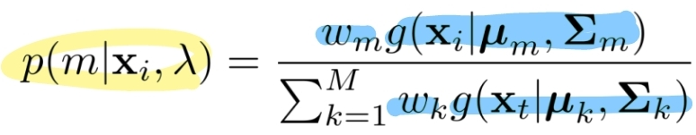
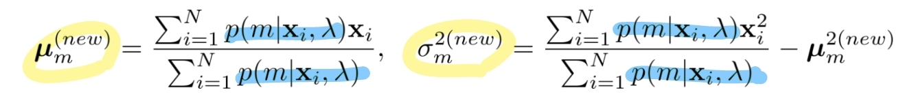

# Topic 3 이상치 탐색(Anomaly Detection)

출처 : 강필성 교수님의 Business Analytics 강의

출처 : 단단한 머신러닝 챕터 10 - 차원 축소와 척도 학습

#### Anomaly Detection 기본 개념

- 이상치 탐색은 크게 2가지 관점이 있다. 
  
  1. 데이터 생성 관점 : 이상치란 서로 다른 생성 메커니즘을 가진것으로 의심되는 것  
  
  2. 확률 밀도 관점 : 이상치란 발생 확률이 매우 낮은 것 
     
     - 굳이 다른 메커니즘에서 생산될 필요가 없음을 시사 

- 용어 
  
  - Noise : 데이터 생성간 자연히 발생하는 에러 
  
  - Outlier : 일반적인 데이터 생성 메커니즘을 위반하는 값. 분석시 유의미한 정보를 얻을 수 있음 
  
  - abonormal / novel : Outlier과 유사하나 각각 부정적 / 긍정적 늬앙스를 가짐.

- 분류(Classification)과 이상치 탐색(Anomaly detection)의 개념 차이
  
  
  
  - 분류에서 A,B 점은 normal이라고 판단한다. 
  
  - 이상치 탐색에서는 일반적으로 normal의 범위가 더 좁으며, normal 영역 외에는 어떠한 그룹으로 다시 묶일 수 있다. 따라서 <mark>"A,B 점은 normal이 아니다" </mark>라고만 서술할 수 있다. 

- 분류와 이상치 탐색 적용 상황 구분 
  
  
  
  *클래스 간 극심한 불균형이 있으면서 소수 클래스의 사례가 적을 때 이상치 탐색 적용*

- 일반화(Generalization)와 구체화(Specialization) 간 Trade-off 관계 
  
  
  
  - 일반화 : 범주에 포함할 범위를 넓힐 수 있음. 하지만 오답의 가능성이 증가함 
  
  - 구체화 : 오답의 가능성을 줄여줌. 하지만 정답인데도 범주에서 배제할 가능성 증가함. 

- 이상치의 종류 
  
  1. Global outlier : 태생적으로 원데이터와 다른 이상치 
  
  2. Contextual outlier (local outlier) : 상황과 환경에 따라 이상치가 되는 것 
     
     > ex)- 사하라 사막에서 영상 30도는 특이하지 않으나, 알래스카에서 영상 30도는 이상치로 볼 수 있음  
  
  3. Collective outlier : 집단 개념의 이상치. 

- **해결해야할 문제**
  
  1. Normal 과 Outlier의 경계가 모호하다(<=> grey area가 있다)
  
  2. 측정 수단을 정하는 것은 적용하는 도메인과 모델의 관계에 의존적이다. 
     
     > ex)- 의료 분야에서는 값의 분포가 좁아 이상치 탐색이 용이하나, 마케팅 분야에서는 그렇지 않다. 
  
  3. 이상치는 "왜 이상치인지"에 대한 해석상의 요인을 제공해야 한다. 

- **Performance Measure**
  
  - Normal과 abnorbal 간의 경계가 모호하여 결과치가 "이다/아니다"가 아닌 확률값으로 구해야 함. 이를 계산하고자 Performance Measure을 도입
    
    
    
    
  
  - FRR과 FAR은 서로 Trade-off 관계임. 
    
    
    
    - EER : FAR과 FRR이 동일해질 때의 Error rate  
    
    - IE : FAR - FRR 곡선의 아래 영역. 낮을수록 좋음. 이상치 탐색에 사용 
    
    - AUROC : 분류에 사용하는 측정치로 높을수록 좋음. 

----

## Density Base - Anomaly Detection

###### 방식

- 데이터를 통해 유추된 확률 밀도 함수를 통해 이상치 유무를 판단하는 방식 
  
  - Train 과정에서 Normal 데이터를 기반으로 확률 밀도를 계산
  
  - Test 과정에서 Normal / abnormal 데이터를 입력하여 낮은 확률 밀도 값을 가질 경우 이상치로 판단 

- 크게 3가지 방법으로 Mixture of Gaussian / Kernel / Local Oulier Factor 가 있음
  
        

### 1. Mixture of Gaussian Density Estimation

- ##### 의의
  
  - 관측 데이터의 분포가 가우시안일 것이라 가정하는 것은 현실적으로 어렵다. 
    
     $(f(x) : 추정해야 하는 밀도 함수)$
    
    > $f(x) \approx w_1N(\mu_1, \sigma_1^2) + w_2N(\mu_2, \sigma_2^2) + w_3N(\mu_3, \sigma_3^2) $
  
  - 다수의 가우시안 분포의 결합으로 보다 편차(bias)가 작도록 만든다.  

##### MoG Density Estimation 방식

1. **관측 데이터들이 가우시안 분포로부터 생성되었다고 가정하여 확률 밀도 함수 도출** 

    

> 
> 
> 
> 
> $M, \mu_m, \sum_m$ : 미지수. 해당 값들은 입력 데이터로부터 계산해야함. 

2. **Expectation-Maximization 알고리즘을 통해서 객체 확률 / 가우시안 파라미터들의 값을 각각 최적화 진행** 
   
   > 객체 확률 : m 번째 가우시안 분포에 x값이 속할 확률 
   
   - E / M - step 을, 과정을 진행해도 값이 변하지 않는 순간까지 반복  
     
     - E - Step : 가우시안 파라미터를 고정하여 객체 확률 값을 계산 
       
        
       
       > $w_mg(x_i|\mu_m, \sum_m)$ : m 번째 분포에서 생성될 확률 
       > 
       > $\sum_{k=1}^M w_mg(x_i|\mu_m, \sum_m)$ : 모든 분포에서 생성될 확률의 합
     
     - M - step : 객체 확률 값을 고정하여 가우시안 파라미터 값들을 계산 
       
       

3. **적절한 가우시안 분포 개수(m) 정하기**
   
   - m을 1, 2, 3... M개 대입하여 가장 우도가 높은 경우로 선정 
- 이슈 
  
  - 공분산 행렬을 어떻게 처리하느냐에 따라 분포의 모양이 달라짐. 
    
    
    
    1. Spherical : 모든 독립변수에 대해서 Normalization되었으며, 독립성을 가지고 있다. 
    
    2. Diagonal : 모든 독립변수들이 독립성을 가지고 있다. 
       
       > 현실적으로 많이 선택 
    
    3. Full : 모든 독립변수들이 일정 정도 상관관계를 가지고 있다. 
       
       > Full matrix가 제일 성능이 좋지만, noise data등으로 역행렬이 없을 때가 많음. 

- 
