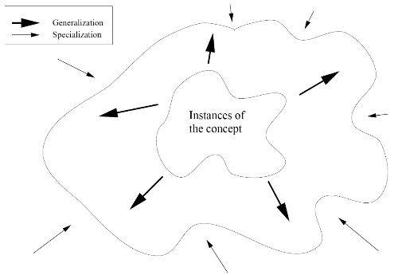
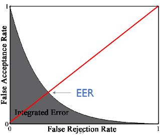
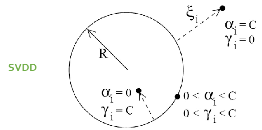

# Topic 3 이상치 탐색(Anomaly Detection)

출처 : 강필성 교수님의 Business Analytics 강의

출처 : 단단한 머신러닝 챕터 10 - 차원 축소와 척도 학습

#### Anomaly Detection 기본 개념

- 이상치 탐색은 크게 2가지 관점이 있다. 
  
  1. 데이터 생성 관점 : 이상치란 서로 다른 생성 메커니즘을 가진것으로 의심되는 것  
  
  2. 확률 밀도 관점 : 이상치란 발생 확률이 매우 낮은 것 
     
     - 굳이 다른 메커니즘에서 생산될 필요가 없음을 시사 

- 용어 
  
  - Noise : 데이터 생성간 자연히 발생하는 에러 
  
  - Outlier : 일반적인 데이터 생성 메커니즘을 위반하는 값. 분석시 유의미한 정보를 얻을 수 있음 
  
  - abonormal / novel : Outlier과 유사하나 각각 부정적 / 긍정적 늬앙스를 가짐.

- 분류(Classification)과 이상치 탐색(Anomaly detection)의 개념 차이
  
  
  
  - 분류에서 A, B 점은 normal이라고 판단한다. 
  
  - 이상치 탐색에서는 일반적으로 normal의 범위가 더 좁으며, normal 영역 외에는 어떠한 그룹으로 다시 묶일 수 있다. 따라서 <mark>"A,B 점은 normal이 아니다" </mark>라고만 서술할 수 있다. 

- 분류와 이상치 탐색 적용 상황 구분 
  
  
  
  *클래스 간 극심한 불균형이 있으면서 소수 클래스의 사례가 적을 때 이상치 탐색 적용*

- 일반화(Generalization)와 구체화(Specialization) 간 Trade-off 관계 
  
  
  
  - 일반화 : 범주에 포함할 범위를 넓힐 수 있음. 하지만 오답의 가능성이 증가함 
  
  - 구체화 : 오답의 가능성을 줄여줌. 하지만 정답인데도 범주에서 배제할 가능성 증가함. 

- 이상치의 종류 
  
  1. Global outlier : 태생적으로 원데이터와 다른 이상치 
  
  2. Contextual outlier (local outlier) : 상황과 환경에 따라 이상치가 되는 것 
     
     > ex)- 사하라 사막에서 영상 30도는 특이하지 않으나, 알래스카에서 영상 30도는 이상치로 볼 수 있음  
  
  3. Collective outlier : 집단 개념의 이상치. 

- **해결해야할 문제**
  
  1. Normal 과 Outlier의 경계가 모호하다(<=> grey area가 있다)
  
  2. 측정 수단을 정하는 것은 적용하는 도메인과 모델의 관계에 의존적이다. 
     
     > ex)- 의료 분야에서는 값의 분포가 좁아 이상치 탐색이 용이하나, 마케팅 분야에서는 그렇지 않다. 
  
  3. 이상치는 "왜 이상치인지"에 대한 해석상의 요인을 제공해야 한다. 

- **Performance Measure**
  
  - Normal과 abnorbal 간의 경계가 모호하여 결과치가 "이다/아니다" 중 확정적으로 나오는 것이 아니라 확률값으로 구해야 함. 이를 계산하고자 Performance Measure을 도입
    
    
    
    
  
  - FRR과 FAR은 서로 Trade-off 관계임. 
    
    
    
    - EER : FAR과 FRR이 동일해질 때의 Error rate  
    
    - IE : FAR - FRR 곡선의 아래 영역. 낮을수록 좋음. 이상치 탐색에 사용 
    
    - AUROC : 분류에 사용하는 측정치로 높을수록 좋음. 

----

## Density Base - Anomaly Detection

###### 방식

- 데이터를 통해 유추된 확률 밀도 함수를 통해 이상치 유무를 판단하는 방식 
  
  - Train 과정에서 Normal 데이터를 기반으로 확률 밀도를 계산
  
  - Test 과정에서 Normal / abnormal 데이터를 입력하여 낮은 확률 밀도 값을 가질 경우 이상치로 판단 

- 크게 3가지 방법으로 Mixture of Gaussian / Kernel / Local Oulier Factor 가 있음
  
        

### 1. Mixture of Gaussian Density Estimation

- ##### 의의
  
  - 관측 데이터가 단일 가우시안 분포를 띄기란 현실적으로 어렵다. 
    
     $(f(x) : 추정해야 하는 밀도 함수)$
    
    > $f(x) \approx w_1N(\mu_1, \sigma_1^2) + w_2N(\mu_2, \sigma_2^2) + w_3N(\mu_3, \sigma_3^2) $
  
  - 다수의 가우시안 분포의 결합으로 보다 편차(bias)가 작도록 만든다.  

##### MoG Density Estimation 방식

1. **관측 데이터가 다수의 가우시안 분포로부터 생성되었다고 가정하여 확률 밀도 함수 도출** 

    

> 
> 
> 
> 
> $M, \mu_m, \sum_m$ : 미지수. 해당 값들은 입력 데이터로부터 계산해야함. 

2. **Expectation-Maximization 알고리즘을 통해서 객체 확률 / 가우시안 파라미터들의 값을 각각 최적화 진행** 
   
   > 객체 확률 : m 번째 가우시안 분포에 x값이 속할 확률 
   
   - E / M - step 과정을 진행해도 값이 변하지 않는 순간까지 반복할 것  
     
     - E - Step : 가우시안 파라미터를 고정하여 객체 확률 값을 계산 
       
        
       
       > $w_mg(x_i|\mu_m, \sum_m)$ : m 번째 분포에서 생성될 확률 
       > 
       > $\sum_{k=1}^M w_mg(x_i|\mu_m, \sum_m)$ : 모든 분포에서 생성될 확률의 합
     
     - M - step : 객체 확률 값을 고정하여 가우시안 파라미터 값들을 계산 
       
       

3. **적절한 가우시안 분포 개수(m) 정하기**
   
   - m을 1, 2, 3... M개 대입하여 가장 우도가 높은 경우로 선정 
- 이슈 
  
  - 공분산 행렬을 어떻게 처리하느냐에 따라 분포의 모양이 달라짐. 
    
    
    
    1. Spherical : 모든 독립변수에 대해서 Normalization되었으며, 독립성을 가지고 있다. 
    
    2. Diagonal : 모든 독립변수들이 독립성을 가지고 있다. 
       
       > 현실적으로 많이 선택 
    
    3. Full : 모든 독립변수들이 일정 정도 상관관계를 가지고 있다. 
       
       > Full matrix가 제일 성능이 좋지만, noise data등으로 역행렬이 없을 때가 많음. 

--- 

##### 2. Parzen Window Density Estimation

- **의의 및 방향성**
  
  - 특정한 형태의 분포(ex-가우시안 분포)를 가정하는 것 없이 밀도를 측정한다. 
  
  - 객체마다 커널함수를 적용하여 확률 밀도를 파악한다. 
    
    - 커널함수로 무엇을 선택하냐에 따라 추정값이 달라진다. 
      
      

- **과정** 
  
  1. **확률 밀도 $p(x)$ 를 직접 계산하기 위해 P 값 구하기** 
     
     > $P$ = 특정 영역 R에 x의 값이 속할 확률  $\int_R p(x)dx$. 
     
     - P(k) = $\begin{pmatrix} N \\ K \end{pmatrix}P^k(1-P)^{N-k}$. N개의 샘플 중 K개가 R에 속할 확률 
       
       - $E[k] = NP, Var[k] = NP(1-P)$
       
       - $E[\frac{k}{N}] = P, Var[\frac{k}{N}] = \frac{P(1-P)}{N}$
     
     - N의 값이 무한대만큼 증가한다면, P의 값은 $\frac{k}{N}$ 에 근사한다고 볼 수 있다. 
  
  2. **근사한 P 값을 기반으로 p(x) 값 구하기**
     
     - <mark>$P = \int_R p(x)dx \approx p(x)V = \frac{k}{N} <=> p(x) = \frac{k}{NV}$</mark>
       
       > V : R의 영역. $x_2 - x_1$ 의 값이 충분히 줄어든다면 $p(x_1) = p(x_2)$가 될 수 있다.
     
     - **$p(x) = \frac{k}{NV}$좀 더 이해하기**
       
       - 추정은 N을 늘리고 V는 줄이는 과정에서 보다 정확해진다.
       
       - 현실 속에서 N은 보통 고정된다. 따라서 우리는 V에 대해 타협안을 만들어야 한다.
         
         - 충분히 크면 R 영역 내에 충분한 예제를 포함할 수 있다.
         
         - 충분히 작다면 p(x)를 R 영역 내에서 하나의 상수처럼 고려할 수 있다.
       
       - Kernel-density estimation vs k-nearest neighbor density estimation
         
         - Kernel - density : V를 고정하여 k 결정하기
         
         - k-nearset neighbor density estimation : k를 고정하여 V 결정하기

- **추가 개선점**
  
  - R을 x를 중점으로 하며 변의 길이가 h인 hypercube라고 가정하자. 
    
    - $K(u) = 1 (|u_j| < \frac{1}{n}$ $\forall j = 1, ... d)$ / 0 (otherwise) 
    
    - $k = \sum_{i=1}^N K(\frac{x_i - x_c}{h})$ , $p(x) = \frac{1}{Nh^d}\sum_{i=1}^N K(\frac{x_i - x}{h})$
      
      > $x_i$ : 객체 
      > 
      > $x_c$ : 중앙
      > 
      > h : 변의 길이 
    
    - 단, K(u)는 $x_i$가 중앙에서부터 얼마나 떨어져 있든지 관계없이 동일한 값을 부여하며, 확률 밀도 간 불연속성을 부여한다는 단점이 있다. 
  
  - <mark>Smoothing Kernel function 적용 </mark>
    
    - 조건 : $\int_R K(x)dx$ = 1 
    
    - 일반적으로 가우시안 분포처럼 Symmetric 하고 unimodal인 밀도 함수를 주로 사용함
      
      - $p(x) = \frac{1}{N} \sum_{i=1}^N K(\frac{x^i - x}{h})$
      
      - 
  
  - <mark>Smoothing parameter h - 적절한 h 탐색 필요 </mark>
    
    - h가 충분히 크다면 over-smooth 밀도 분포가, 
    
    - h가 충분히 작다면 뾰족한 밀도 분포가 나올 것 
      
      (우측 아래로 갈수록 h가 커짐)
    
    - h 값은 EM 알고리즘을 통해 최적화할 수 있음. 

--- 

##### 3. Local Outlier Factor(LOF)

- **의의 및 방향성** 
  
  - 주변 밀도를 고려하여 Abnormal Score을 계산하자 
    
    
    
    >  $O_2 $의 abnormal score > $O_3$ 의 abnormal score 
  
  - Parameter, 데이터 분포에 대해 어떠한 가정도 불필요로 함. 

- **정의**
  
  - **k-distance(p)**: 객체 p로부터 k번째 가까운 객체까지의 거리 
    
    > D 영역에는 p를 제외하고 $d(p,o^{'})$ <= $d(p,o)$ 를 만족하는 적어도 k개의 $o^{'}$ 가 있어야 한다. 
    > 
    > D 영역에는 p를 제외하고 $d(p,o^{'}) < d(p,o)$ 를 만족하는 적어도 k개의 $o^{'}$ 가 있어야 한다.
    > 
    > > D : k번째 가까운 객체를 포함하는 영역 

- **k-distance neighborhood of p**
  
  > $N_k(p) =$ {$q \in D/[p]| d(p,q)<= k-distance(p)$}

- **Reachability distance**
  
  > Rechability - distance_k(p,o) = max{k-distance(o), d(p,o)}
  > 
  > 
  > 
  > - p가 아니라 o라는 점이 중요
  > 
  > > d(p,o) : p와 o의 실제거리

- **Local reachability density of p**
  
  > $lrd_k(p) = \frac{|N_k(p)|}{\sum_{o \in N_k(p)} reachability - distance_k(p.o)}$
  > 
  > > $|N_k(p)|$ : 동일한 값이 나타났을 때 보정하는 역할(무엇을 보정하는지 체크 필요)
  > > 
  > > - k-distance(p)와 동일한 거리에 있는 값이 많을수록 분모의 값이 올라감. 하지만 밀도가 줄어드는 것은 아니기 때문에 분자 측에서도 동일하게 올려줘야 함.  
  > > 
  > > $\sum_{o \in N_k(p)} reachability - distance_k(p.o)$ : 주변 밀도에 반응
  
  - p가 주변 밀도가 낮은 곳에선 분모가 늘어나 $lrd_k(p)$ 값이 낮게, 높은 곳에선 분모가 줄어들어 $lrd_k(p)$의 값이 상승한다. ($lrd_k$ 는 주변 밀도와 비례한다)
  - 

- LOF(Local outlier factor)
  
  > $LOF_k(p) = \frac{\sum_{o \in N-K(p)} \frac{lrd_k(o)}{lrd_k(p)}}{|Nk(p)|} = \frac{ \frac{1}{lrd_k(p)} \sum_{o \in N_k(p)} lrd_k(o)}{|N_k(p)}$
  > 
  > > $\frac{1}{lrd_k(p)}$ : p의 밀도를 의미
  > > 
  > > $\sum_{o \in N_k(p)} lrd_k(o)$ : o의 밀도를 의미
  
  
  
  - p 와 0의 주변 밀도를 비교하여, 상대적 빈도가 낮은 곳의 abnormal score를 높게 측정함.

###### **특징**

- **장점** 
  
  - 사전에 필요로 하는 Parameter, 분포가 없다. 주어진 데이터 만으로 abnormal score를 측정한다
  
  - 주변 밀도를 고려하여 abnormal score를 측정하다

- **단점** 
  
  - 계산양이 많다 
  
  - 각 score의 절대적 기준이 없다. <mark>즉, 서로 다른 dataset의 score를 비교할 수 없다. </mark>

----

### Distance-based Method

##### 1. K-Nearest Neighbor-based Approach

- **의의 및 방향성**
  
  - abnormal 데이터는 다른 데이터로부터 멀리 떨어져 있을 것이라 가정 
  
  - normal 데이터에 대한 어떠한 가정도 하지 않으며, 거리로만 정상 유무를 판단함

- **거리기준**    
  
  
  
  - Maximum distance : $d_{max}^k = \kappa(x) = ||x-z_k(x)||$ 
  
  - Average distance : $d_{avg}^k = \gamma(x) = \frac{1}{k}\sum_{j=1}^k||x-z_j(x)||$
  
  - Distance to mean : $d_{mean}^k = \delta(x) = ||x-\frac{1}{k}\sum_{j=1}^kz_j(x)||$
    
    > $d_{mean}$ 은 $d_{avg}$에 비해 얼마나 데이터가 고르게 분포해 있는가도 고려한다. 

- **거리기준 보강 : $d_{c-hull}^k$**
  
  - 방향성
    
    
    
    > o 가 $\triangle$ 보다 비정상 스코어가 높아야 한다. 
    
    1. 데이터가 정상이라면, 정상 데이터의 영역 안에 속할 것이다
    
    2. 정상데이터 영역에서 벗어날 수록 비정상 데이터이다 
  
  - 계산식 
    
    - $d_{c-hull}^k(x) = ||x_{new} - \sum_{j=1}^kw_iz_j(x)||$  
    
    > $x_{new}$가 정상 데이터의 영역 안에 속해 있으면 $d_{c-hull}$ 의 값은 0이다. 
  
  - <mark>$d_{c-hull}$은 기존에 사용하는 거리값에 보정치로서 사용된다. </mark>
    
    - $d_{hybrid}^k = d_{avg}^k * (\frac{2}{1+exp(-d_{c-hull}^k)})$ 
    
    
    
    > 기존 방식들은 영역 내에 구멍이 나거나, 각 영역 중간을 잘못 포함할 수 있다. 반면 $d_{hybrid}^k$ 는 이 둘의 문제점을 해결한다. 

##### 2. Clustering-based approach

- **방향성**
  
  - 어떠한 군집에도 속하지 않을경우 비정상 스코어가 높을 것이다 
  
  > $\chi = C1 \cup C2 ... \cup C_K$ s.t. $C_i \cap C_j = \phi, i \neq j $
  > 
  > > $\chi$ : 정상 데이터 영역 

- 거리 기준 
  
  
  
  > 둘 모두 절대거리는 동일하나, 오른쪽이 상대적 거리가 높아 더 비정상이다. 
  
  - 가장 가까운 중심점으로부터 **절대거리**
  
  - 가장 가까운 중심점으로부터 **상대적 거리**

##### 3. PCA -based approach

- **방향성**
  
  - 비정상 데이터일수록 정상 데이터에 비해 복원이 잘 안될 것이다.

- 복원 손실 
  
  > $error(x) = ||x-ww^Tx||^2 =(x-ww^Tx)^T(x-ww^Tx)$
  > 
  >                    $=$ $x^Tx - x^Tww^Tx - x^ww^Tx+x^Tww^Tww^Tx$
  > 
  >                     $= x^Tx - x^Tww^Tx = ||x||^2 - ||w^Tx||2$
  
  (1번이 2번보다 복원손실이 크다)

---

##### Auto-Encoder for Anomaly Detection

- "원본 데이터를 압축한 후, 최대한 원본에 가깝게 복원"하는 특징을 활용 

- 이상치일수록 "압축 > 복원" 과정에서 잃은 정보가 많을 것이다. 
  
  > $l(f(x)) = \frac{1}{2}\sum_k (\widehat x_k - x_k)^2$  의 값을 anomaly score로 사용 
  > 
  > > $\widehat x_k $ : 재복원한 데이터 값 

##### Support vector-based novelty detection

 

- SVM 모델을 토대로, abnormal 과 normal 관측치를 구분하는 경계 함수를 직접 만들기

###### 1. 1-SVM

- **방향성** 
  
  
  
  - 커널함수를 통해 원본 데이터를 Feature space로 mapping 한 후, margin을 최대화하면서 원점과의 거리가 가장 먼 Hyperplane 찾기
    
    > 최적화 문제 : $min \frac{1}{2}||w||^2 + \frac{1}{vl}\sum_{i=1}^l \xi_i - \rho$
    > 
    > - $\frac{1}{2}||w||^2$ : Margin 최대화를 통해 모델의 변동성 감소
    > 
    > - $\frac{1}{vl}\sum_{i=1}^l \xi_i$ : 경계면 조건을 만족못하는 정상 data에 부여되는 페널티
    > 
    > - $\rho$ : 원점에서 최대한 멀리 떨어진 hyperplane 과의 거리
  
  

- **과정 : SVM과 동일** 
  
  1. **목적함수 및 라그랑주 함수 정의**
     
     
  
  2. **KKT 조건에 따라 최적해 조건 확인** 
     
     
  
  3. **듀얼 문제로 전환** 
     
     
  
  4. **Kernel trick을 적용 후 Convex 문제의 해($\alpha$) 구하기** 
     
     

- **$\nu$ 의 역할**
  
  - <mark>$\nu$의 값은 Support vector의 최저 개수의 lower bound를, Error의 최대 개수의 Upper bound를 제공한다. </mark>
    
    - 적어도 $\nu l$ 개수의 Support vector가 존재해야함 
      
      > 조건 : $\nu \in [0,1], \alpha_i \in [0, \frac{1}{\nu l}], \sum \alpha_i =1$
      
      - $\sum \alpha_i =1$ 이 되려면 모든 $\alpha_i$ 가 최대값($\frac{1}{\nu l}$)을 가진다 해도 $\nu l$ 개수만큼 필요하다. 
    
    - 최대 $\nu l$개의 Support vector는 hyperplane 밖에 위치해야함. 
      
      - $\alpha_i = \frac{1}{\nu l}$ 일 때, support vector은 hyperplane 밖에 위치한다.  
        
        > $\alpha_i = \frac{1}{\nu l}$, => $\beta_i =0$ => $\xi_i > 0 $ 
      
      - $\alpha_i < \frac{1}{\nu l}$ 일때, support vector는 $\nu l$ 개 보다 더 생길 수 있지만 support vector 위 또는 안에 포함된다. 
  
  - <mark>$\nu$ 의 값이 높아질수록, 보다 복잡한 결정 경계가 형성된다. </mark>

###### 2. SVDD(Support Vector Data Description)

- **방향성**
  
  
  
  - 모든 정상 데이터를 포괄하는 hypersphere 찾기 

- 과정 : SVM과 동일 
  
  1. **목적함수 및 라그랑주 함수 설정**
     
     
     
     
  
  2. **KKT 조건에 따라 최적해 조건 찾기** 
     
     
  
  3. **듀얼문제로 전환하기** 
     
     
  
  4. **kernel trick 적용 후 convex 문제에 대한 해($\alpha$) 찾기** 

- SVDD는 Kernel 함수를 통해서 경계 복잡도를 설정함. 
  
  - ex) kernel 함수로 RBF 적용  
    
    
    
    > 결정 경계의 복잡도는 s 값에 반비례한다. 

*모든 데이터가 unit norm vector로 정규화 되었을 때 SVDD와 1-SVM은 동일함*
