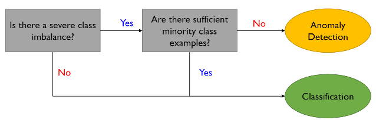

# Topic 3 이상치 탐색(Anomaly Detection)

출처 : 강필성 교수님의 Business Analytics 강의

출처 : 단단한 머신러닝 챕터 10 - 차원 축소와 척도 학습

#### Anomaly Detection 기본 개념

- 이상치 탐색은 크게 2가지 관점이 있다. 
  
  1. 데이터 생성 관점 : 이상치란 서로 다른 생성 메커니즘을 가진것으로 의심되는 것  
  
  2. 확률 밀도 관점 : 이상치란 발생 확률이 매우 낮은 것 
     
     - 굳이 다른 메커니즘에서 생산될 필요가 없음을 시사 

- 용어 
  
  - Noise : 데이터 생성간 자연히 발생하는 에러 
  
  - Outlier : 일반적인 데이터 생성 메커니즘을 위반하는 값. 분석시 유의미한 정보를 얻을 수 있음 
  
  - abonormal / novel : Outlier과 유사하나 각각 부정적 / 긍정적 늬앙스를 가짐.

- 분류(Classification)과 이상치 탐색(Anomaly detection)의 개념 차이
  
  
  
  - 분류에서 A,B 점은 normal이라고 판단한다. 
  
  - 이상치 탐색에서는 일반적으로 normal의 범위가 더 좁으며, normal 영역 외에는 어떠한 그룹으로 다시 묶일 수 있다. 따라서 <mark>"A,B 점은 normal이 아니다" </mark>라고만 서술할 수 있다. 

- 분류와 이상치 탐색 적용 상황 구분 
  
  
  
  *클래스 간 극심한 불균형이 있으면서 소수 클래스의 사례가 적을 때 이상치 탐색 적용*

- 일반화(Generalization)와 구체화(Specialization) 간 Trade-off 관계 
  
  
  
  - 일반화 : 범주에 포함할 범위를 넓힐 수 있음. 하지만 오답의 가능성이 증가함 
  
  - 구체화 : 오답의 가능성을 줄여줌. 하지만 정답인데도 범주에서 배제할 가능성 증가함. 

- 이상치의 종류 
  
  1. Global outlier : 태생적으로 원데이터와 다른 이상치 
  
  2. Contextual outlier (local outlier) : 상황과 환경에 따라 이상치가 되는 것 
     
     > ex)- 사하라 사막에서 영상 30도는 특이하지 않으나, 알래스카에서 영상 30도는 이상치로 볼 수 있음  
  
  3. Collective outlier : 집단 개념의 이상치. 

- **해결해야할 문제**
  
  1. Normal 과 Outlier의 경계가 모호하다(<=> grey area가 있다)
  
  2. 측정 수단을 정하는 것은 적용하는 도메인과 모델의 관계에 의존적이다. 
     
     > ex)- 의료 분야에서는 값의 분포가 좁아 이상치 탐색이 용이하나, 마케팅 분야에서는 그렇지 않다. 
  
  3. 이상치는 "왜 이상치인지"에 대한 해석상의 요인을 제공해야 한다. 

- **Performance Measure**
  
  - Normal과 abnorbal 간의 경계가 모호하여 결과치가 "이다/아니다"가 아닌 확률값으로 구해야 함. 이를 계산하고자 Performance Measure을 도입
    
    
    
    
  
  - FRR과 FAR은 서로 Trade-off 관계임. 
    
    
    
    - EER : FAR과 FRR이 동일해질 때의 Error rate  
    
    - IE : FAR - FRR 곡선의 아래 영역. 낮을수록 좋음. 이상치 탐색에 사용 
    
    - AUROC : 분류에 사용하는 측정치로 높을수록 좋음. 
  
  

