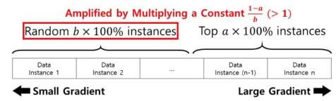
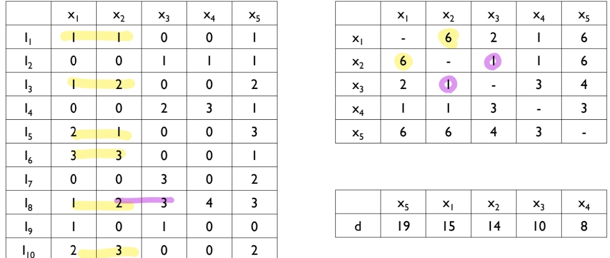

# Topic 4 앙상블 학습(Ensemble Learning)

출처 : 강필성 교수님의 Business Analytics 강의

출처 : 단단한 머신러닝 챕터 8 - 앙상블 학습 

#### Ensemble Learning 기본 개념

- ###### 전제 / 상황
  
  - **모든 환경에 최고의 성능을 내는 상위의 알고리즘이란 없다(No Free Lunch Thm).** 
    
    즉, Data set의 특징에 따라 최고 성능을 내는 알고리즘이 달라진다. 
  
  - 따라서, 수많은 기술들을 적용해보는 것이 임의의 새로운 분류 문제를 푸는데 최고의 보험이다.
    
    
    
    > y축이 Error rate을 의미. 낮을 수록 좋다. 오른쪽은 앙상블 기법 적용 
  
  - 하지만, <mark>여러 기술들을 적절히 결합한다면, 개별 기술보다 성능이 **"대체로"** 높게 나온다.</mark>
    
    

##### <mark>앙상블의 장점</mark>

1. **(통계 시점)일반화 성능 저하 방지**
   
   - 특정 단일 학습기만 사용할 때, 데이터 셋의 특징이 해당 단일 학습기와 적합히자 않다면 일반화 성능이 나빠질 수 있다.
   
   - 하지만, 여러 학습기를 합친다면 일정 이상의 일반화 성능을 보장할 수 있다.

2. **(계산 시점) 학습 알고리즘이 로컬 미니멈에 빠지는 위험한 경우를 줄여준다**
   
   - 특정 학습 방향은 로컬 미니멈에 빠질 수 있다.
   
   - 하지만 여러 방향에 대해 시도한다면(=다양한 경우를 확인한다면) 로컬 미니멈에 빠지는 경우를 줄일 수 있다.

3. **(표현의 관점) 실제 가설을 학습기로 표현할 수 없다 하더라도, 앙상블을 통해 최대한 유사한 가설을 도출할 수 있다.**
   
   - 여러 학습기의 조합, 사례의 조합을 통해 유사한 가설쪽으로 다가갈 수 있다.

###### (추가 - No Free Lunch Thm의 경험적 증명) ###### Do we Need Hundreds of Classifiers to Solve Real World Classification Problem?

- 2014년 논문 발표 당시 모든 분류 Dataset에 대해 boosting을 제외한 모든 알고리즘을 적용함.

(상위 5위에 속하는 알고리즘)

- 결론 1 : Rank가 1인 경우는 없다. (No Free Lunch)
  
  > Rank는 각 데이터셋별 알고리즘 성능 순위를 평균한 것

- 결론 2 : 그래도 Random forests와 SVM 계열이 유의미하게 상대적으로 분류 성능이 높게 나온다. 

- **앙상블의 종류**
  
  - 동질적 앙상블 : 단일 객체 학습기를 반복적으로 사용. 
    
    - 이때 객체 학습기를 '기초 학습기'라고 하며, 
    
    - 이러한 학습 알고리즘을 '기초 학습 알고리즘'이라 부름 
  
  - 이질적 앙상블 : 서로 다른 유형의 객체 학습기 사용 
    
    - 이때 객체 학습기를 '요소 학습기' 또는 '객체 학습기'라고 부름 

---

#### Bias - Variance Decomposition

- ###### 이론적 배경
  
  - 데이터는 모델에 Noise(~Error)가 추가된 형태로 나온다 가정
    
     $y = F^*(x) + \epsilon, \epsilon$ ~ $N(0, \sigma^2)$ 
    
    > - $F^*(x)$ : Target Fuction. 위 모델을 찾으려 하지만 정확히 알 순 없다. 
    > 
    > - $\epsilon$ : 에러. 독립적이고 동일하게 분포되어있다고 가정 
  
  - 각 Dataset에 대해 $F^*(x)$ 모델을 적용하여 나온 결과를 토대로 $\hat F_i(x)$ 모델 예측 
    
     
  
  - 특정 포인트 $x_0$에 대해서 $Err(x_0)$ 의 식을 정리하여 <mark>편차와, 분산을 분리함. </mark>
    
    
    
    > Q. 왜 2번째 줄에 $F^*(x_0)$가 아닌 $\hat F^*(x_0)$가 들어간거지? 동일하다고 보는건가? 
    > 
    > - 각 Data set별 Target Function임을 드러낸 것일수도, 
    
    - since $\overline F(x) = E[\hat F_D(x)]$,  $E[\overline F(x_0) - \hat F(x_0)] =0$
    
    

- ###### 편차와 분산의 특성
  
  
  
  - **편차(Bias) : 다양한 데이터셋으로부터 반복적으로 모델링 할 때 평균적 결과들이 유사한가?** 
    
    - Low Bias :  데이터 셋으로부터 평균적으로 정확히 측정하고 있다.
    
    - High Bias : 방향이 맞지 않다. (Poor match) 
  
  - **분산(Variance) : 개별적인 모델링이 평균과 얼마나 큰 차이를 보이는가** 
    
    - Low Variance : 다른 데이터 셋이라 하더라도 측정값이 거의 변하지 않는다. 
    
    - High Variance : 값이 퍼져 있다 (Weak match)
  
  - Error은 원 데이터에서 부여되는 것으로 제거할 수 없다
  
  - Q. 편차와 분산은 각각으로부터 독립적이지 않다.(Why?)
    
    - "에러값 = 편차 + 분산" 으로 이뤄져 있으니까? 
    
    - 모델 복잡도에 증가함에 따라 편차는 일반적으로 감소하나, 분산은 증가하는 추세를 보인다. 즉, 편차와 분산은 모델 복잡도에 연관성이 있으니, 서로 간에도 연관성이 있다 볼 수 있다?  

- **모델 복잡도에 따른 분류** 
  
  
  
  - Lower model complexity : High bias & low variance 
    
    - 개별 모델링의 값의 범위는 좁으나, 평균치가 정답과 거리가 있다. 
    
    > ex) Logistic regression, LDA, k-NN with large k, etc
    
    - Bagging 방법과 잘 맞음. Bagging을 통해 <u>분산</u>을 줄여줄 수 있음 
      - Q. 편차를 줄여줄 수 있어야 High bias 인 모델에 적용할 떄 의미가 크지 않나? 
      - 또한 데이터를 다양하게 제공하는 것이니 만큼 High bias에 적용하는 것은 맞아보임. 
  
  - Higher model complexity : low bias & high variance 
    
    - 평균치로는 정답과 가까우나, 개별 모델링의 값의 범위가 넓다. 
    
    > DT, ANN, SVM, k-NN with small k
    
    - Boosting과 잘 맞음. Boosting을 통해 <u>편차</u>를 줄여줄 수 있음
      - Q.  Boost 계열도 결국 보다 정확하게 측정하는 것이니 만큼 분산을 줄여줄 것 

- #04-2 강의 자료 11 Page의 내용이 Bagging / Boosting 의 효과에 대해 반대로 기술된듯 하다. 

###### 앙상블 학습의 특징

- **목적 : 다수의 학습방식 적용을 통해 다양성을 확보하여 Error을 줄인다.** 
  
  1. 분산을 줄인다 & 데이터 다양성 확보 : Bagging 기술을 적용한다. 
  
  2. 편차를 줄인다 & 모델 다양성 확보  : Boosting 기술을 적용한다.  

- **앙상블 학습 특징** 
  
  - <mark>성능이 있으면서 일정 이상 다른 모델을 합쳤을 때(다양성을 확보할 때) 효과가 좋다.</mark> 
  
  - 따라서 앙상블 구조를 짤 때 주요 질문은 아래와 같다. 
    
    1. **<mark>다양성을 확보</mark>하기 위해 앙상블 구조의 개별 요소들을 어떻게 생성할 것인가?** (매우 중요)
    
    2. 어떻게 개별 분류기의 결과를 결합할 것인가?

- **방식** 
  
  
  
  > 좌측(Boosting) : Implicit Diversity 확보. 각 학습기에 서로 다른 Random subset을 제공한 다음, 결과값을 합침 
  > 
  > 우측(Bagging) : Explicit Diversity 확보. 이전 학습 과정이 이후 과정에 영향을 미치는 등 기존 Data가 이전과 다름을 보장함. 

- **앙상블 학습이 효과가 있는 이유 (수리적 풀이)**
  
  $y_m(x)=f(x)+\epsilon_m(x)<=> E_x[(y_m(x)-f(x))^2]=E_x(\epsilon_m(x)^2)$  일 때,
  
  
  
  - 위의 수식은 Cauchy's 부등식에 의해 항상 성립함. 
    
    > $(ax+by)^2 <= (a^2 + b^2)(x^2+y^2)$
    > 
    > - $(\epsilon_1 + ... + \epsilon_m)^2 <= (1^2 + ... + 1^2)(\epsilon_1^2 + ... + \epsilon_m^2)$
  
  - 더불어 좌측은 앙상블 Error를, 우측은 평균 Error을 의미함. 
    
    
    
    > $f(x) = \frac{1}{M} * M *f(x)$
    > 
    > $y_m(x) - f(x) = \epsilon_m(x)$

- Error의 평균이 0이고, 각각 상관관계가 없다고 가정할 시 
  
  $E_{Ensemble} = \frac{1}{M} E_{Avg}$ 이 성립한다.  (best case)
  
      

---

#### Bagging(<mark>B</mark>ootstrap <mark>Agg</mark>regat<mark>ing</mark>)

- **방향성 / 의의** 
  
  
  
  - 모든 앙상블의 결과값들은 서로 다른 학습 데이터로부터 만들어진다. 
  
  - 각각의 데이터 셋은 전체 데이터에서 <mark>N번 랜덤 복원 추출</mark>로 만든다 **(Bootstrap)**. 
    
    - $y=f(x) + \epsilon$ 에서 원본 데이터는 $\epsilon$ 에  dependent 할 위험성이 있음. 
    
    - 따라서, Bootstrap을 통해 의도적으로 데이터의 분포를 왜곡함으로써 $\epsilon$ 이 모델과 독립적이도록 만든다. 
  
  - 각각의 데이터 셋으로 도출한 결과값을 수합하여 최종 예측 모델을 형성한다. 
  
  - 대체로 학습 모델의 성능을 향상시킨다. 
    
    
    
    > y축이 Error rate로 낮을수록 좋음 

- **특징** 
  
  - <mark>1)OOB을 Validate Data로 사용하여 신뢰도 및 일반화 정도를 향상시킨다.  </mark>
    
    >  N번 복원 추출 간 1번도 선택되지 않는 경우 
    
    > 
    
    - 즉, N이 일정 이상 큰 수라면, $\frac{2}{3}$ 정도는 Bootsrap에 1회 이상 속하며, $\frac{1}{3}$ 정도는 한번도 안 뽑힘. 
    
    - 한번도 안 뽑히는 경우는 <mark>OOB(Out of Bag)</mark>이며, 추후 평가 데이터(Validate Data)로 사용한다. 즉, **매번 다른 데이터 셋을 통해 학습할 때 다른 평가 데이터를 사용하여 신뢰도 및 일반화의 정도를 향상시킨다.**
    
    - 그 외로 OOB는 가지치기를 도울 수도 있고, 기초 학습기가 신경망일 때는 OOB 샘플을 통해 조기 종료를 도와 과소적합 위험을 줄이는 데 도움을 줄 수 있다. 
  
  - <mark>2)모든 모델에 적용할 수 있으나, Low Bias & high variance인 모델과 잘 어울린다.</mark>
    
    
    
    >  Ex)- ANN, SVM, DT
  
  - 3)각 데이터 셋별로 Parallel 하게 학습할 수 있어 병렬 학습이 가능하다.
  
  - 4)각 데이터 셋별 결과를 합치는 과정을 거쳐야 한다.
  
  - 5)계산 복잡도는 T(O(m) + O(s)) 로 기초 학습기의 계산 복잡도와 크게 차이 나지 않는다.(=효율적인 알고리즘이다)
    
    > O(m) : 기초 학습기 복잡도 
    > 
    > T : 훈련 횟수. 보통 그렇게 크지 않음
    > 
    > O(s) : 샘플링 및 평균 과정의 복잡도. 보통 매우 작음 

##### Result Aggregation

    

> 수많은 결합 방식이 있으며 각 방식에 따라 결과값이 달라짐. 

- Ex -1) Majority voting. 회귀 문제에 대해서 많이 사용. 
  
  

- Ex -2) Weighted voting (weight = 개별 모델의 학습 정확도)
  
  
  
  > 일반적으로 훈련 데이터를 통해 가중치를 학습함. 
  > 
  > 단, 훈련 데이터가 충분치 않거나 노이즈를 많이 포함하고 있어 가중치에 대한 신뢰도가 떨어짐. 더불어 규모가 큰 경우 학습해야하는 가중치가 많아서 쉽게 과적합 문제가 발생함. 
  > 
  > 따라서, 가중 평균법이 반드시 단순 평균법보다 뛰어나다고 할 수 없음. 이에 객체 학습기의 성능 차이에 클 때 사용하며, 성능이 비슷하면 단순 평균법을 사용함.

- Ex -3) Weighted voting(weight = 각 클래스별 예상 확률)
  
  
  
  > 상대다수 투표법, 가중 투표법 등 여러 버전이 있음. 
  > 
  > $P_i$가 특정 클래스로 예측하여 투표하면 Hard voting, 사후 확률에 대한 예측을 하면 Soft voting이라 함.

- Ex -4) Stacking : 메타 학습기. 각 결과를 수합하여 예측하는 새로운 예측 모델 구축
  
  
  
  > 각 학습기의 훈련 세트를 그대로 메타 학습기의 훈련 세트로 사용시 과적합 위험이 커짐. 
  > 
  > 따라서 교차 검증법, 홀드 아웃 등의 방법을 통해서 초급 학습기 훈련에 사용되지 않은 샘플로 메타 학습기를 학습함

---

#### Bagging - Random Forest

- 방향성 
  
  - 결정 나무(Decision Tree) 알고리즘에 특별히 적용된 bagging 방식 
  
  - 앙상블의 다양성을 올리기 위해 DT 를 1) Bagging을 통해 다수의 Tree 생성, <mark>2) 개별 트리의 분기간 고려할 독립변수를 Randomly 선택</mark>함
    
    
  
  - 이를 통해서 개별 트리의 결과의 다양성을 보다 높여줌 
    
    
    
    > A의 경우가 B보다 항상 평균값은 높으나, B의 사례에서 개별 과목의 점수가 더 높은 경우가 존재한다. 
    > 
    > 따라서 샘플 뿐만 아니라, 고려하는 변수도 Randomly 하게 선택할 시 DT의 개별 결과값이 경우가 더욱 다양해진다.  
    > 
    > 일반적으로 권장하는 선택 변수의 수는 $log_2d$ 임. (d는 데이터의 차원 개수) 

- **일반화 오류**
  
  - Ramdom forest의 각 트리들은 가지치기를 적용하지 않기 때문에 과적합이 발생할 수 있다. 
  
  
  
  - 랜덤 포레스트의 수렴성은 배깅과 유사하나, 초기 성능은 비교적 낮다. 하지만 객체 학습기의 숫자가 늘어남에 따라 일반적으로 더 낮은 일반화 오차율에 수렴한다. 
  
  - 만약 샘플의 개수가 충분히 크다면 일반화 오류는 아래 식에 의해 Bounded 된다. 
    
    > $Generalization$ $Error$ <= $\frac{\overline \rho(1-s^2)} {s^2}$ 
    > 
    > >  $\overline \rho $ : 개별 트리의 상관관계 계수의 평균. 다양성이 증가하면 감소한다. 
    > > 
    > > $s^2$ : margin function. (오답일 확률과 정답일 확률 차이)의 평균. 
    
    - 다양성이 증가하고, 알고리즘의 정확도가 올라갈수록 일반화 오류는 줄어든다. 
    
    
    
    > 위의 예시에서의 일반화 오류는 위의 식에 따라 0.3074 보다 작거나 같다. 
    > 
    > - Average correlation value (0.9027) / Average margin (0.7460) 
  
  - 랜덤 포레스트의 훈련 효율은 배깅보다 좋다. 
    
    - 배깅은 훈련 당시 모든 속성을 고려하여 분할 속성을 선택하나, 랜덤 포레스트는 랜덤으로 의사결정트리를 사용하고 의사결정 트리는 하나의 속성 집합만을 고려하기 때문이다. 

- <mark>**Random Forest의 추가 장점 - 변수의 중요도 측정 가능**</mark>
  
  - 독립 변수 중요도 측정 방식 
    
    - 원본 데이터에 대해 OOB Error 정도를 계산
    
    - 중요도를 판단할 변수의 값을 뒤섞은(Permutation) 데이터의 OOB Error 정도를 계산
    
    - 원본 데이터와 Permutation 한 데이터 사이의 OOB Error 차이를 확인. 차이가 클수록 결정간 중요한 데이터임.
      
      
      
      

- Random forest에서 특정 변수의 중요도가 높다면, 
  
  - Random Permutation 전/후의 OOB Error 차이가 커야함(= $\overline d_i$ 가 커야한다 )
    
    > $d_i^m = p_i^m - e_i^m$ 
    > 
    > > $p_i$ : Permutation 한 데이터의 OBB error 
    > > 
    > > $e_i$ : 원본 데이터의 OBB error
    > 
    > $\overline d_i = \frac{1}{m} \sum_{i=1}^m d_i^m$
  
  - 각 OBB Error차이의 편차가 적어야 한다(= $s_i$가 작아야 한다)
    
    > $s_i^2 = \frac{1}{m-1} \sum_{i=1}^m (d_i^m - \overline d_i)^2$
  
  - 따라서<mark> i번째 변수의 중요도($v_i$) 는 $\frac{\overline d_i }{s_i}$</mark> 로 표현 할 수 있다. 

---

## Adaptive Boosting(AdaBoost)

- **방향성**
  
  - 약한 모델(Weak model)을 엮으면 강한 모델만큼의 성능을 가질 수 있다. 
    
    > Weak model : 랜덤 추측보다 조금 더 성능이 괜찮은 모델. 
    > 
    > ex)- 랜덤 추출로 50%의 정확도를 가지는 Dataset에서 한 60% 정도의 정확도를 가지는 모델 
    
    - 약한 모델로는 주로 Stump tree를 사용한다. 
      
      > Stump tree : 임의의 사례의 임의의 변수값을 기준으로 데이터 셋을 이분화. 둘 중에서 정확도가 50% 이상인 사례를 선택한다. 
  
  - 적용한 모델이 풀기 어려웠던 사례의 비중을 높혀 만든 데이터 셋에, 반복적으로 약한 성능을 가진 모델을 적용한다.  
    
    
    
    >  맞춘 답의 비중은 줄이고, 틀린 답의 비중을 증가시킴
  
  - 이를 계속 반복할 때, 약한 모델들을 결합시킴으로써 단일의 정확한 예측 모델을 만들 수 있다.
    
    
    
    - $H(x') = sign(\sum_{t=1}^T \alpha_th_t(x'))$
    
    > 최종적으론 모든 사례를 정확히 구분할 수 있음. 
    > 
    > 파란 색을 -1, 빨간색을 +1의 값이라 할 때, 각 비중과 값을 곱해 더한 값이 양수면 +1(빨간색) 값 부여, 음수면 -1(파란색) 값 부여
  
  - 가중치를 가질 수 없는 샘플에 대해서는 Resampling을 통해서 처리한다. 

- **특징** 
  
  - 약한 학습 적용 간의 순서가 있어 학습이 순차적으로 일어난다. 
    
    - 단, 이것이 병렬 학습이 가능한 Bagging 보다 느리다는 의미가 아님. 오히려 내부 과정으로 인해 boosting의 속도가 빠를때가 있음.  
  
  - 초기의 높은 에러율은 추후 새로운 약한 모델을 적용함에 따라 낮아질 수 있다. 
  
  - Regression / Classification / Ranking 모두에 사용할 수 있음. 

- ###### 수학적 증명은 단단한 머신러닝 참고할 것!

### Gradient Boosting Machine = Gradient Descent + Boosting

- **Adaboost와의 차이점**
  
  - Adaboost : <u>높은 비중이 부여되는 것을 통해</u> 기존 Weak Model의 약점을 알 수 있다!
    
    > 비중($\alpha_t$) : $\frac{1}{2}ln(\frac{1-\epsilon}{\epsilon})$
  
  - GBM : <u>Gradient를 통해</u> 약점을 파악할 수 있다! 

- **방향성**
  
  - Weak model이 예측하고 남은 잔차를, 다시 예측하는 새로운 Weak model를 추가하여 보다 정확하게 예측하기! 
    
    
  
  
  
  >  $f_1(x)$ : Weak model을 통한 첫번째 예측값
  
  > $y- f_1(x)$ : $f_1(x)$로 예측한 후의 잔차
  > 
  > $f_2(x)$ : $f_1(x)$ 의 잔차($y- f_1(x)$)를 예상하는 Weak model
  > 
  > $y-f_1(x) - f_2(x)$ : $f_1(x), f_2(x)$로 예측한 뒤 나온 잔차 
  > 
  > 또 그것을 예측하는 $f_3(x)$ ... 반복 

- 이때 한 예시로 OLS를 통해 각 잔차를 최소화하는 손실함수를 정의할 경우, 손실함수의 - Gradient는 $y - f(x)$ 와 동일하다 
  
  > OLS : 최소자승법.  $minL = \frac{1}{2}\sum_{i=1}^n (y_i - f(x_i))^2$ 
  
  - $\frac{\partial L }{\partial f(x_i)} = f(x_i) - y_i$
  
  - <=> <mark>$y_i - f(x_i) = -\frac{\partial L}{\partial f(x_i)}$</mark>
  
  > OLS 외에도 $y - f(x)$ 형태의 Gradient 값을 내는 다른 손실함수도 다 가능. 어떤 손실함수를 적용하냐에 따라 매 단계별 학습 정도가 달라짐. 
  
  

- **Gradient Descent Algorithm 적용** 
  
  - Global minimum을 찾기 위해선 Gradient의 반대 방향으로 값을 움직여야한다. 
    
    앞서 찾은 $y_i - f(x_i)$를 대신 입력
    
    

    

- **특징**
  
  - Regression / Classification / Ranking 모두에 사용할 수 있음. 
  
  - Loss 함수로 어떤 것을 선택하냐에 따라 학습 속도가 달라짐 
  
  - <mark>학습간 변수의 중요도를 측정할 수 있음.</mark> 
  
  - <mark>학습 간 Noise도 학습할 수 있어, 과적합 문제가 있음(단점)</mark>
    
    > 잔차를 기반으로 그다음 Weak model를 구하다 보니, 매번 Noise가 고려 요소로 포함됨 

- **변수의 중요도 측정 방식** 
  
  - $Influence_j = \frac{1}{M} \sum_{k=1}^M Influence_j(T_k)$
    
    - $Influence_j(T) = \sum_{i=1}^{L-1} (IG_j$ x **1**$(S_i = j))$
    
    > $Influence_j(T) :$ 단일 트리 T에서 j번째 변수가 가지는 중요도 
    > 
    > $IG_i$ : i 번째 변수를 통해 얻을 수 있는 Information gain 
    > 
    > **1**($S_i = j$) : 해당 트리의 i번째 split에서 j 값 사용 유무 

- **과적합 개선 방안** 
  
  - Subsampling : 매번 학습할 때마다 원본 데이터의 일부를 랜덤하게 추출하여 학습. 
    
    - 복원 추출을 하여 Bagging과 유사하게 해도 되나, 굳이 한다해도 큰 의미는 없다. 
  
  - Shrinkage : 나중에 적용하는 Weak model에 감소 가중치를 적용 
    
    > $\hat y = f_1(x) + 0.9 *f_2(x) + 0.9^2 *f_3(x) + ...$
  
  - Early stopping : 과적합이 생길 것 같을 때 학습을 멈춤 

--- 

### 다양성

- 배경 
  
  - 객체 학습기 $h_i$에 대해 불확실성($A(h_i|x)$)을 아래와 같이 정의함. 앙상블의 불확실성은 $\overline A(h|x)$ 으로 정의한다.
  
  > $A(h_i|x) = (h_i(x)-H(x))^2$
  > 
  > $\overline A(h|x) =\sum_{i=1}^T w_iA(h_i|x)$ = $\sum_{i=1}^Tw_i(h_i(x) -H(x))^2$
  > 
  > <=> $\sum_{i=1}^Tw_iE(h_i|x) - E(H|x) = \overline E(h|x) -E(H|x)$
  > 
  > > 객체 학습기 평균 오차 : $E(h_i|x) = (f(x) - h_i(x))^2$ 
  > > 
  > > 앙상블 H의 평균 오차 : $E(H:x) =(f(x)-H(X))^2$
  
  - 그 외 각 항목별 정의는 아래 정리한다. 
    
    > 객체 학습기 일반화 오차 : $E_i = \int E(h_i|x)p(x)dx$
    > 
    > 객체 습기 불확실성 항 : $A_i = \int A(h_i|x)p(x)dx$
    > 
    > 앙상블 일반화 오차 : $E = \int E(H|x)p(x)dx$
    > 
    > 객체 학습기 일반화 오차 가중 평균 : $\overline E = \sum_{i=1}^Tw_iE_i$
  
  - 위의 식을 정리하면 $E = \overline E - \overline A$과 성립한다. 즉, <mark>객체 학습기의 정확성이 높고 다양성이 높을수록 앙상블은 좋다. (오차 불확실성 분해)</mark>
    
    - 단, $\overline E - \overline A$를 최적화 목표로 둘 수는 없다. 모든 샘플 공간에 대해 정의 되었을 뿐더러, $\overline A$ 가 직접적인 다양성 척도가 아니여서 앙상블이 구성된 이후에야 평가할 수 있기 때문. 

- **다양성 척도**
  
  - 객체 학습기의 다양성 정도를 계산하고자 사용함. 
  
  - 전통적 방법 : 객체 학습기를 쌍으로 유사성/비유사성 측정 
    
    (예측 결과 테이블)
    
    > a+ b+ c+ d = m
    
    - 불일치 척도 : $dis_{ij} = \frac{b+c}{m}$
    
    - 상관계수 : $p_{ij} = \frac{ad-bc}{\sqrt (a+b)(a+c)(c+d)(b+d)}$
    
    - Q 통계량 : $Q_{ij} = \frac{ad-bc}{ad+bc}$
    
    - $\kappa$ 통계량 : $\kappa = \frac{p_1-p_2}{1-p_2}$
      
      > $p_1$ : 두 분류기가 일치할 확률 ($= \frac{a+d}{m}$)
      > 
      > $p_2$ : 두 분류기가 우연히 일치할 확률 ($= \frac{(a+b)(a+c) + (c+d)(b+d)}{m^2}$)

- **다양성 확보 방법**
  
  - <u>데이터 샘플 교란법</u> :  매번 서로 다른 데이터의 하위 집합을 생성하고, 매번 다른 데이터 집합을 훈련에 사용하는 방식 
    
    > ex)- 부트스트랩핑, Adaboost 
    
    - 데이터에 민감함 학습기에 매우 효과적임. 
      
      - 단, 선형 학습기, 서포트 벡터 머신, 나이브 베이즈 분류기, k-최근접 이웃 분류기 등과 같이 안정된 기초 학습기에는 효과가 떨어짐. 
  
  - <u>입력 속성 교란법</u> : 서로 다른 Subspace는 데이터를 관찰하는 여러 시각을 제공함
    
    - 초기 집합에서 몇 개의 속성 부분집합만 선택하여 기초 학습기를 학습시킴 
  
  - <u>출력 표현 교란법</u> : 출력 표현을 변경하여 다양성을 증가시킴 
    
    - Flipping output : 일정 훈련 샘플의 레이블 변경 
    
    - Output Smearing : 분류 출력을 회귀 출력으로 전환한 후 기초 학습기를 만듬
  
  - <u>알고리즘 파라미터 교란법</u> : 임의로 서로 다른 파라미터를 설정하여 차이가 큰 객체 학습기 형성 

---

### XGBoost(eXtream Gradient BOOSTing)

- 확장성이 높은 Tree 기반의 Gradient Boosting 방식으로, 높은 성능으로 다양한 분야에서 사용된다. 

- **방향성** 
  
  1. 알고리즘적 발전 
     
     - Split Finding algorithm : 학습 병렬화 가능 
     
     - Sparsity - Aware Split Finding  : Missing data 처리 용이 
  
  2. 시스템적 발전 
     
     - Column black for parallel learning : 정렬 계산과정 단축 
     
     - cache - aware access : 하드웨어 기기 성능에 따른 계산 최적화  
     
     - Blocks for out of core commputation  : 계산 용량 조작을 통한 메모리 소화 

- **XGBoost의 기본 학습기 : CART(Classification And Regression Trees)**
  
  
  
  > F = {$f(x) = w_q(x)$} : 전체 트리구조를 의미하는 Function f의 input x를 넣었을 때의 결과값은, 각각의 Tree q(x)의 Node w 값의 합과 같다. 
  > 
  > q : $R^m => T$  
  > 
  > - q : Structure of each tree 
  > 
  > - T : Number of Leaves 
  > 
  > $w \in R^T$ 
  > 
  > - w : leaf Weights

- w의 값과, q에 대한 평가는 Loss Function울 통해서 구할 수 있다. 
  
  - $\hat y_i = \phi(x_i) = \sum_{k=1}^K f_k(x_i), f_k \in F$
    
    > F : 모든 CART Tree 들을 담고 있는 함수 공간 
  
  - <=> $f_1(x_i) + f_2(x_i) +  f_3(x_i) + ... + f_K(x_i)$ 
    
    - 이때, 새로운 함수 $f_K(x_i)$을 정의할 때 Loss Function이 최소가 되도록 한다.

- <mark>$L(\phi) = \sum_{i=1}^n l(y_i, \hat y_i) + \sum_k \rho(f_k)$</mark> <mark>(1번식)</mark>
  
  > $\phi$ : Function  
  > 
  > $l(y_i, \hat y_i)$ : Training Loss 
  > 
  > $\rho(f_k)$  = $\gamma T +\frac{1}{2}\lambda ||w||^2$: Regulation. Complexity of the trees <mark>(2번식)</mark>
  > 
  > > Q. 여기서 $\gamma$ 와 $\lambda$, 그리고 w는 무엇을 의미하지? (논문 체크)
  > > 
  > > w : Leaf Weight 

- 이때 Loss 함수는 Function을 인자로 받아 Numerical Vector가 아니다. 따라서 OLS 등과 같이 Enclidean Space를 활용한 방식으로 최적화를 할 수 없다. 
  
  - 따라서 Gradient Boosting의 방식을 차용하여, 
  
  - t 번째 Prediction($\hat y_i^t$) 는 t-1번째 Prediction($\hat y_{i-1}$) 에서 새로운 함수($f_t(x_i)$) 를 추가하는 형태로 정의한다 
    
    >  $\hat y_i^t = \hat y_i^{t-1} + f_t(x_i)$ <mark>(3번식) </mark>

- 1번식과 3번식을 합친 식 ( $L(\phi) = \sum_{i=1}^n l(y_i, \hat y_i^{t-1} + f_t(x_i)) + \sum_k \rho(f_k)$) ) 에 Taylor Series를 적용한다. 
  
  > Taylor Series : 특정 함수를 다항함수에 근사시키는 방법 
  
  > $l(y_i, \hat y_i^{t-1} + f_t(x_i)) => l(y_i, \hat y_i^{t-1}) + g_if_i(x_i) + \frac{1}{2}h_if_t^2(x_i) $  <mark>(4번식)</mark>
  > 
  > > $g_i $ = $l$ 함수의 $x_i$ 지점의 1차 미분 값
  > > 
  > > $h_i$ = $l$ 함수의 $x_i$ 지점의 2차 미분 값  

- 1번식에 4번식과 2번식을 전개하여 Loss 함수에 대해 새롭게 정의한다. 
  
  > $L(\phi) = \sum_{i=1}^n [l(y_i, \hat y_i^{t-1}) + g_if_i(x_i) + \frac{1}{2}h_if_t^2(x_i)] + \gamma T +\frac{1}{2}\lambda \sum_{j=1}^Tw_j^2)$
  > 
  > <=> $\sum_{j=1}^T[(\sum_{i \in I_j}g_i)w_j + \frac{1}{2}(\sum_{i\in I} h_i + \lambda)w_j^2] +\gamma T + A $ **<mark>(목표함수 )</mark>**
  > 
  > > A : $\sum_{i=1}^n l(y_i, \hat y_i^{t-1})$ . 상수값으로 Loss function의 최소값을 찾는 데 영향력이 없어 상수 A로 치환함. 
  > > 
  > > n : instances 
  > > 
  > > T : Leaf 개수. 이후 Tree의 개수를 기준으로 묶고자 함. 
  > 
  > - $\sum_{i=1}^n g_if_t(x_i) = \sum_{j=1}^T(\sum_{i \in I_j}g_i)w_j$, 
  >   
  >   $\sum_{i=1}^n h_if_t^2(x_i) = \sum_{j=1}^T(\sum_{i \in I_j}h_i)w_j^2$
  >   
  >   

- 목표함수에 대해서 $\sum_{i\in I_j}g_i = G_j,  \sum_{i\in I_j}h_i = H_j, w_j = x$로 정의하면, 
  
  > $Obj^t = \sum_{j=1}^T[G_jx + \frac{1}{2}(H_j + \lambda)x^2] + \gamma T$ 로, x에 대해 미분 시 
  > 
  > => $G_j + (H_j + \lambda)x = 0$. 따라서<mark> $x(=w_j)$가 $-\frac{G_j}{h_j + \lambda}$ </mark>일때 Loss 함수가 최소값이 된다. 

- 목표함수에 최소값을 만드는 $w_j$ 값을 대입하면 아래의 식이 나온다. 
  
  
  
  - 이때 부호가 음수인 점을 고려했을 때, $\frac{G_j^2}{H_j + \lambda}$ 가 커질수록 Loss는 감소하기 때문에  <mark>Tree의 성능 척도는 $\frac{G_j^2}{H_j + \lambda}$ </mark>라고 할 수 있다. 

- **Split finding Algorithm** 
  
  - 각 트리의 생성은 무한할 수 있기 때문에 트리의 적절한 Split의 기준을 정하고 최적의 트리를 만들 필요가 있다. 
  1. Basic exact greedy algorithm 
     
     - 데이터들을 크기에 따라 정렬을 한 다음, 모든 Split point에 대해서 계산하여 최적의 Split point을 선정함 
       
       - 장점 : 모든 Split point를 조사하는 만큼 항상 최적해를 찾는다. 
       
       - 단점 : 1) 데이터가 커 메모리에 다 들어가지 않을 때 효율이 떨어진다, 2) 분산 환경에서 처리가 불가능하다.  
         
         > Q. 분산 환경이란 병렬 학습을 의미하나? 그런듯 
  
  2. Approximate algorhtim 
     
     - 특정 특성 k의 Percentile에 따라서 데이터들을 l개의 Bucket으로 나눠 Split point 탐색. 
       
       
       
       
       
       > 총 40개 데이터를 가진 예시에서 basic greedy 방식에선 39개의 Split point에 대해 확인을 해야하나, Approximate 방식에선 총 10개의 bucket에서 각 3번씩, 총 30개 지점에 대해 병행 확인이 가능하다. 
       
       - 장점 : 1) exact greedy 방식보다 계산 효율이 좋다. 2) 병렬 학습이 가능하다. 3) 한번 학습간 사용하는 데이터 양이 줄어들어 메모리 운용에 비교적 제한점이 적다. 
     
     - 크게 Tree 별(Global Variant), Split 별(local Variant) 구분 방식이 있다. 두 방식간 무엇이 더 좋다고 딱 자르긴 애매하나, Tree별 구분 방식이 bucket의 수가 상대적으로 적기 때문에 Bucket의 수를 크게 잡아야 한다(= Bucket별 크기를 의미하는 $\epsilon$을 작게 잡아야 한다)
       
       
       
       > Tree 별 구분 : Split point로 구분 후 기존의 Bucket의 형태를 유지
       
       
       
       > Split 별 구분 : Split point로 구분 후 각 각 기존 Bucket의 개수를 유지
       
       
       
       > $\epsilon$ 값을 적절히 잡아준다면 Exact greedy, global / local variant approsimate 방식 모두 성능은 유사하다. 
  
  3. Sketch Algorithm  / weighted quatile algorithm 은 추후 논문 확인하고 추가하기 

- **Sparsity-Aware Split finding** 
  
  - 현상 : 수많은 현실 문제에서 데이터가 Sparse한 경우가 빈번하다(ex-결측치, one-hot encoding).
  
  - 결측치에 대해 데이터를 통해 학습한 Default direction을 설정한다. 
    
    
    
    > 데이터를 target value와, 특성값에 대해서 정렬. 이후 결측치를 오른쪽 / 왼쪽으로 정렬했을 때의 각 Split point 효과를 비교하여 Default direction을 설정. 
    
    - 장점 : 1) 결측치에 대해 주어진 데이터를 기반으로 값을 설정할 수 있다. 2) 계산 효율이 증대한다. 
      
      > Q. 결측치에 대해 값을 부여한 거면 정확도 성능을 제시해야하는것 아닌가? 왜 속도 개선 자료만 제시하지? (논문 읽고 추가하기)

- **System Design for Efficient Computing**
  
  1. Column block for Parallel learning
     
     - 트리 학습간 가장 시간이 소요되는 **"정렬"** 과정 효율화 - $O(nlogn)$
     
     - 기존의 Row orientation 방식을 Column Orientation 방식으로 변경하여, 각 특성별 정렬을 용이하게 변경함. 
       
       
       
       > Row Orientation에서는 특성 k에 대해서 정렬할 때 모든 샘플 값들을 다 불러와야 함.  
       > 
       > 반면 Column Orietation에선 특성 k에 대해서 정렬할 때 해당 특성 값들만 불러오면 됨. 
     
     - 각 특성별로 데이터를 정렬 및 결측치를 제거하여 데이터를 압축한 상태로 CSC(Compressed column) 형식으로 저장한다. 이를 통해 입력 데이터에 대해서 학습전 1번만 정렬을 계산하면 된다. 
       
       
2. Cache-aware access 
   
   - 하드웨어의 종류에 따라 Input/Output의 속도와 처리할 수 있는 데이터의 크기가 달라진다. 이에 한번 학습간 데이터의 크기를 줄여 가장 속도가 빠른 Cache 중심의 학습할 수 있을 여건을 보장한다.  
     
     > I/O 속도 : CPU cache > Memory > Disk 
     > 
     > 한번에 담을 수 있는 데이터 크기 : Disk > Memory > CPU cache 
     > 
     > 작은 크기의 데이터는 CPU cache로, 그렇지 않은 것은 Disk로 학습
     
     
     
     > Exact Greedy 방식에선 cache-aware prefeching 알고리즘을 적용하여  계산 효율 향상 
     > 
     > Approxiamte 방식에선 적절한 block(=bucket?) 크기를 설정하여 계산 효율 향상 

3. Blocks for out of core computation 
   
   - 데이터의 크기가 메모리 용량보다 클 경우 병목현상이 발생하여 계산 효율이 떨어짐. 
   
   - 이에 메모리 크기에 맞춰 데이터를 다수의 Block으로 나눠 disk에 저장 및 개별 학습함으로써 병목현상을 제거한다. 

### Light GBM

- **방향성** 
  
  - 일반적인 GBM은 모든 데이터에 대해 개별 Split point Information gain을 측정해야하기 때문에 계산양이 많다. 
  
  - 데이터와 고려 요소의 양을 줄이기 위해 GOSS, EFB 방법을 도입한다.  
  
  - 성능은 유사하나 계산양을 크게 줄일 수 있다. 
    
    
    
    > 성능이 일정하게 되는 지점까지 LightGBM이 훨씬 빠르게 도달한다.

- **GOSS(Gradient-based One-Side Sampling)**
  
  - 전제 : 데이터 객체간 <u>Gradient의 차이</u>가 information gain 계산에 서로 다른 역할을 할 것이다.
  
  - 따라서 Gradient의 차이가 큰 객체만 남기고, 차이가 적은 객체는 랜덤하게 제외시킨다.
    
    
    
    > Gradient의 크기가 상위 a %의 데이터는 온전히 보존, 그 외 경우는 b 비율만큼 랜덤하게 추출. $\frac{1-a}{b}$ 의 크기가 1보다 크도록 설정한다. 
    > 
    > ex)- 상위 10% 보존, 나머지 중에선 50%만 랜덤하게 산출. ($\frac{1-0.1}{0.5}$ >= 1 )   

- **EFB(Exclusive Feature Bundling)**
  
  - 전제 : 고려요소가 Sparse한 경우에서, 많은 요소들은 제한적으로 동시에 Nonzero의 값을 잘 가지지 않는다. (ex- one-hot encoding)
  
  - 따라서 이런 제한적인 요소들을 합친다고 하여 성능을 악화시키지 않는다.
    
    - 각 요소별로 비교적 독립적인 사례들끼리 묶어주고자 함.
    
    - 데이터별로 두 특징간 동시에 0의 값을 가지지 않을때를 Conflict로 정의한다. 즉, Conflict가 적을수록 두 특징은 비교적 겹치는 부분이 적음을 의미한다. 
      
       
      
      > 총 10개의 데이터 중에서 x1/x2 간에는 총 6번의 Conflict가 발생하고, x2 / x3 간에는 1번의 Conflict가 발생한다. 즉, x2/x3는 공통분모가 거의 없어 합쳐도 큰 영향을 주지 않을 것이다. 
    
    - 각 노드별 Conflict 정도를 각 노드별 Edge의 강도롤 설정한다. 이후 Cut-off 를 설정하여 일정이상의 Conflict가 있을 때 해당 Edge를 제거하여, 한데 묶을 Node set을 구성한다. 
      
      
      
      > Cut-off = 0.2. 총 10개의 데이터로, 2 이상의 값을 가진 Edge 전부 제거
      > 
      > 총 3개의 Node set : x5 / x1,x4 / x2, x3
    
    - 각 Node set을 Resuffling을 거친 후, 각 set 별로 값을 합쳐준다. 
      
      
      
      > 1)기준변수만 값이 있을 경우 : 기준 변수의 값을 그대로 사용한다. 
      > 
      > 2)비기준변수만 값이 있을 경우 : 기준 변수의 최대값을 더해준다. 
      > 
      > 3)Conflict가 발생할 경우 & 둘다 0일 경우 : 기준 변수의 값을 채택한다.
      > 
      > > Q. 기준 변수를 설정하는 방식은 Random 인가? 

---

### Cat Boost(<mark>Cat</mark>egory + Gradient <mark>boost</mark>ing)

- 방향성 
  
  - Gradient Boosting의 방식은 채택하나 1) Target Leakage,  2)Prediction Shift 의 문제점을 해소함 
    
    - Target Leakage : Categorical value를 Numerical value로 바꾸는 과정에서 output의 값을 참고한다. 학습 간에는 문제없지만, output 값이 주어지지 않는 Test 과정에선 제한된다.
    
    - Prediction Shift : 학습 데이터로 계산된 조건 분포(Conditional distribution - $F^{t-1}(x_k)|x_k$)가 테스트 데이터로 유추된 조건분포(-$F^{t-1}(x)|x$ )와 다르다. 

- 기본 전제 : Gradient boosting
  
  > $F^t$ : target value를 추측하는 함수로, t번째 발전시킨 버전 
  > 
  > - $F^t = F^{t-1} + \alpha h^t$ 
  > 
  > > $\alpha$ : Step size. h 함수에 대한 가중치 역할 
  > > 
  > > $h^t$ : 손실함수를 최소화하기 위해 추가하는 함수 
  > > 
  > > - $h^t = argmin_{h \in H} L(F^{t-1}+h) = argmin_{h \in H} EL(y, F^{t-1}(x) + h(x))$
  
  - $h^t$ 는 $-g^t(x,y)$ 에 근접하는 것으로 정한다. 
    
    > $g^t(X,y) = \frac{\delta L(y,s)}{\delta s}$ s.t. $s = F^{t-1}(X)$
    > 
    > OLS를 채택시, $h^t = argmin_{h \in H} E(-g'(X,y) - h(X))^2$ 가 된다.
    > 
    > >  X : Dataset 

- **Target Leakage**
  
  - Categorial Value들을 Numerical Value로 바꿔주기 위해서 TS(Target Statistics) 방식을 사용해왔다. 
    
    
    
    > 각 Category 별로, (Target value가 1인 경우의 수 / 총 개수) 로 값을 부여
    
    - 장점 : One-hot encoding과 달리, 각 Category 당 하나의 Numerical Value로 표현가능 
    
    - 추가 개선점으로, 적은 사례에 대해선 TS의 값이 극단적으로 클 수 있어 Smoothing을 적용하곤 한다. 
      
      (a : parameter, p : 평균 target value)
  
  - TS의 방식은 Target value를 필요로 한다(Target 값을 leakage 한다.)
    
    - 학습 과정에선 Target value가 주어져 문제가 없지만, 
    
    - Target value가 주어지지 않는 검정 과정에선 부적절하다.  
    
    - 이 차이가 **학습 과정과 검정과정 간의 간의 Conditional distribution의 값이 다른 Prediction shift 문제를 만들어 낸다.** 

- **Prediction shift**
  
  - 학습과 검정 간 손실함수을 최소화시키는 h(x)는 유사할 것이나, 그 결과인 Conditional distribution의 값이 달라지는 현상. 
    
    
  
  - 학습 과정에선 Target value에 따라 $x^i$ 의 값이 구분된다.
    
    cut-off 지점을 $\frac{0.5+ ap}{1+a}$ 로 잡으면 된다.
    
    
    
    > 
    
    - 단, <u>검증 과정의 데이터까지 포함할 시 x_i의 값을 더이상 Target value과 관련하여 구분할 수 없게 된다. </u> 또한 검증 데이터들의 Categorical value의 정보를 온전히 전달하지 못해 추후 학습과정과 검증 과정 상의 결과값이 달라지게 된다.
      
      
      
      > 검증 과정에서 학습과정에 없었던 Category인 G,H,I,J의 값은 $\sum_{j=1}^n 1[x_j^i = x_k^i]$ 의 값을 0으로 만든다. 그 결과 $x^i$ 값은 p로 고정된다.
  
  - **Prediction Shift가 생기는 이유는 학습과 검증 간 Gradient 값이 달라서임.**
    
    > $g^t(x_j, y_j)|x_k \neq g^t(x,y)|x$
    
    - 이는 학습 간 사용했던 Target value에 의해 $h^t$의 값이 편향되었기 때문이다.
    
    - 따라서, 학습과 검증간 Gradient를 동일하게 만들기 위해선 $x_k$ 샘플을 사용하지 않은 채 Gradient를 구해야 한다.
  
  - Prediction Shift를 해결하기 위해 TS에 대해 요구되는 조건은 아래와 같다.
    
    - 조건 1) 동일한 Target value를 가질 때 학습/검증 데이터 $x^i$의 기대값이 동일해야한다.
    
    
    
    - 조건 2) TS의 특징을 계산하고 모델을 학습함에 있어서 모든 학습 데이터를 효율적으로 사용해야 한다.
  
  - **방향성 2가지**
    
    - k번째 학습 데이터 x_k의 TS를 계산할 때 x_k를 뺀 D_k 데이터 셋을 활용한다.
      
      > $D_k \subset D / {x_k}$
      > 
      > 
      
      - ex1)- Holdout TS : 데이터 셋을 2개로 나눠 1개는 TS 계산만, 나머지는 학습에만 사용한다.
        
        - 조건 1은 만족하나, 조건 2를 만족 못시킴
      
      - ex2) - Leave-one-out TS : 학습에는 D_k를, 검증간에는 D를 사용한다.
        
        - 조건 2는 만족하나, 조건 1을 만족 못시킴
    
    - 가상의 시간을 도입하여 계산 순서를 부여하며, k번째 순서 이전의 데이터들만 사용한다. (Ordered TS)
      
      > $D_k = {x_j:= \sigma(j) <\sigma(k) }$
      > 
      > > $\sigma$ : Random Permutation. 특정 데이터가 더 많이 사용될 수 있어 순서를 섞어줌.
      > 
      > 
      
      
      
      - 조건 1 성립 : k번째 Target value를 안 썼기에 학습 / 검증 데이터의 TS의 값은 동일
      
      - 조건 2 성립 : k번째를 제외한 모든 데이터 사용 완료.
  
  - **Ordered Boosting**
    
    - Orderd TS의 개념을 가져와 Boosting에도 적용
    
    - 각 트리별로 학습할 때 Random Permutation을 진행. 해당 Permutation은 TS 계산과 잔차 계산 시 동일하게 적용됨.
      
      
      
      > M_i : i개의 파란색 데이터들을 통해 만든 트리모델
      > 
      > $r(x_i, y_i) = y_i - M_j(x_i) : x_i, y_i $들로 만든 잔차. $M_j$ 모델에는 $(x_i, y_i)$를 고려하지 않았으므로 $y_i$ 값과 독립적임. 즉, $r(x_i, y_i)$의 값은 $y_i$ 에 의해 편향되지 않음.
    
    - Oblivious Tree 구조를 통해 Ordered Boosting을 진행함.
      
      > Oblivious tree : 모든 트리에 동일한 분류 기준을 적용함.
      > 
      > 
      
      
      
      > $M_{r,j}(i)$ : i번 데이터 학습을 위해 Permutation $\sigma_r$로 섞인 데이터중 j 샘플까지 학습한 모델.
      > 
      > $\triangle(i)$ : Leaf value. Permutation $\sigma_r$ 에서 샘플 i보다 앞에 위치하면서, 동시에 $leaf_r(i)$에 속하는 샘플들의 $grad_{r, \sigma_r(i)-1}$ 평균값
      > 
      > $grad_{r, \sigma_r(i) -1}$ : Gradient value. Permutation $\sigma_r$에서 샘플 i보다 앞에 있는 샘플들로 학습한 모델 $M_{r, \sigma_r(i)-1}$ 의 gradient 값
      > 
      > > 
      > > 
      > > - 1번 트리에서 첫 결정 조건을 TS < 0.99로 설정하였을 때, l_7의 Gradient value와 Leaf value를 정하는 과정.
      > > 
      > > 
      > > 
      > > - 1번 트리에서 첫 결정 조건을 TS < 0.99로 설정하였을 때, l_8의 Gradient value와 Leaf value를 정하는 과정.
