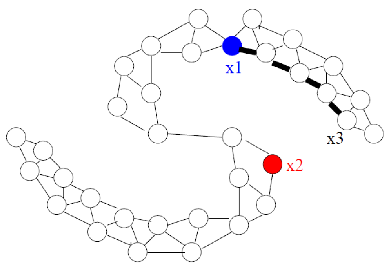
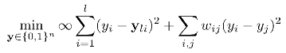
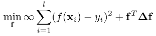
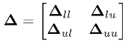
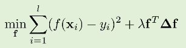
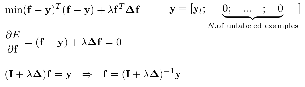

# Topic 5 준지도 학습(Semi Supervised Learning)

출처 : 강필성 교수님의 Business Analytics 강의

### 

SSL이 발달하면, 몇개의 label 데이터로 원하는 성능을 얻을 수 있다를 계산할 수 있지 않을까? 

### 개요

- 준지도 학습은 Label 데이터와 Unlabel 데이터를 함께 사용함으로써 지도학습보다 높은 성능을 추구한다. 
  
  
  
  > 비지도 학습을 적용할 경우 <mark>"얼추(Almost)" 성능이 증가</mark>한다. 반면 <mark>상황에 따라 성능이 미미하거나 나빠진다. </mark>

- 현실적인 상황에서 Label 데이터는 시공간/비용적 측면에서 얻기 힘들다. 반면 Unlabeled 데이터는 싸며 구하기 쉽다. 
  
  > 중국어 Parsing task : 2년간 4000문장 라벨링함. 
  
  

- **방식** 
  
  - Label 데이터로 모델을 학습한다. (지도 학습)
  
  - 학습한 모델을 기반으로 Unlabel 데이터의 Target value를 예측한다. 또한 예측값의 신뢰도를 측정한다. 
  
  - 상위의 신뢰도를 가진 데이터만 Label 데이터로 추가하여 모델을 수정한다. 

- **조건**
  
  - Unlabled 데이터는 군집(Cluster)을 형성해야 한다.  
    
    
    
    > 좌측의 경우 Labeling을 할 수 없다.
    
    > 데이터 분포가 있다고 가정하는 것은 현실에서도 많은 경우 적용됨.  
  
  - 동일한 군집에 속한 데이터는 동일한 클래스의 가능성이 높아야 한다. 
    
    

- **SSL VS Transductive learning**
  
  
  
  - SSL : 아직 주어지지 않은 Unlabled 데이터(Test 데이터)의 결과까지 예측 
  
  - Transductive learning : 현재 주어진 Unlabled 데이터의 결과만 예측 
    
    > SSL이 Transductive learning 보다 한발자국 더 나아간 것 

--- 

### Self-Training and Co-Training

##### Self-Training

- 가정 : Unlabled 데이터라도 예측값이 높은 신뢰도를 가진다면  맞는 것으로 판단한다. 
  
  

- 가짜(pseudo) lable 데이터를 추가하는 방식에 따라 방식이 세분화 된다. 
  
  - ex) 방식 1 : 상위 신뢰도의 일부 사례들을 계속해서 lable 데이터에 추가한다. 
  
  - ex) 방식 2 : 모든 unlabled 데이터를 그냥 추가한다. 
  
  - ex) 방식 3 : 모든 Unlabled 데이터를 신뢰도에 따라 가중치를 부여하여 lable 데이터에 추가한다.  
  
  - 그외 등등 여러 변종이 있음. 

> ex)- K-Nearest Neighbor 방식 채택 
> 
>     <->
> 
> > 초록색 : unlabled data. 빨간색 : X로 label된 값들. 파란색 : o로 Label 된 값들.
> 
> - 우측 상황처럼 Outlier 등 오류가 발생하면 다수의 사례를 잘못 판단하는 사례가 발생할 수 있다. 

- **Self-training 특징**
  
  - 장점 : 가장 쉬운 SSL 방식으로 NLL 분야 등 종종 사용한다. 
  
  - 단점 : 초기 오류가 성능을 악화하는 쪽으로 강화시킬 수 있다. 

##### Co-training

- 객체에 대해 설명하는 상호 배반적인 특징을 가진 데이터를 동시에 활용하여 학습 
  
  > ex)- Epclipse : 일식 <-> 차종 구분하기. 이미지 데이터와 test 데이터를 동시에 활용하여 학습 

- 서로 다른 데이터를 각자 학습한 후, 신뢰도가 높은 방식으로 그렇지 않은 방식을 재학습 시킴
  
  
  
  - 단, 두 데이터가 완전히 상호배반이 아닐 수 있음. 그래도 co-training을 통해 성능을 개선시키고자 함. 

- **신뢰도 측정 방식 with Naive Bayesian**
  
  - Intra confidence : Entropy 
    
    - 얼마나 현재 모델이 특정 두 범주에 대해서 극단적인 예측을 하고 있는가?
  
  - Inter confidence : Training error 
    
    - 현재 모델이 실질적으로 잘 예측하고 있는가. 
  
  - 신뢰범주 = Entropy x Training Error

---

#### Graph-based SSL

- **가정**
  
  - label 데이터와 Unlabel 데이터가 함께 주어진다 
  
  - <u>객체간 큰 관련성(Heavy edge)가 있다면 동일한 label을 가지는 경향</u>이 있다. 
    
    
    
    > $x_3$ 의 값은 $x_1$와 같이 파란색으로 label 가질 확률이 더 높다. 

- **그래프 구성** 
  
  - Nodes : 각 객체. Label 데이터($X_l$) 와 Unlabel 데이터($X_u$) 모두 포함 
  
  - Edges : 객체의 특징으로 부터 계산된 유사도에 따른 가중치 
    
    - K-NN 그래프나, $\epsilon -radius$ 그래프의 경우 Edge는 있으나 가중치는 없음. 
    
    - 완전 연결 그래프에선 가중치는 객체간 거리에 반비례하여 부여됨
      
      > $w_{ij} = exp(\frac{-||x_i-x_j||^2}{\sigma^2})$
    
    

- **최적화 문제 설정**
  
  - 조건 : Label 데이터는 고정시키면서, unlabel 데이터와의 오차를 최소화할 것 
    
    
    
    > 좌측 항 : 무한대 값이 곱해져 있기 때문에, 위의 식을 최소화하려면 무조건 $y_i$ 는 label 데이터인 $y_{li}$ 와 같아야 함. (Label 데이터 고정) 
    > 
    > > $y_{li} :$ 전체 데이터 중 label 데이터의 i 번째 y값. 
    > 
    > 우측 항 : $w_{ij}$ 는 거리에 반 비례하므로, 거리가 가까운 경우는 가능한 정확히 예측하며 반면 거리가 멀 경우 일부 오차를 허용함. 

- **Harmonic function** 
  
  - 의의 : **Unlabel 데이터의 예측값 f(x)가 [0,1] 과 같이 이산 값이 아니여도 된다.** 
    
    > $f(x_i) = y_i $ for $i = 1, ..., l$
    
    - 함수 f는 에너지를 최소화한다. 이때 거리가 가까운 객체간의 예측값은 유사하게 만들며, 거리가 먼 객체간 사이에는 오차를 허용한다. 
      
      > $\sum_{i ~j}w_{ij}(f(x_i) - f(x_j))^2$ 를 최소화하는 것을 목표로 한다. 
    
    
  
  - 이미 알고 있는 Label 된 데이터($x_1, ..., x_l$)의 f(x)의 값을 토대로 새로운 데이터 $f(x_{l+1}), ..., f(x_{l+u})$ 의 값을 아래 식을 통해서 계산한다. 
    
    >  $f(x_i) = \frac{\sum_{j~i} w_{ij}f(x_j)}{\sum_{j~i} w_{ij}} , \forall x_i \in X_u$
    
    - 또는 **graph laplacian을 통해서 f(x)의 값을 구할 수 있다.**
      
      <mark>$\frac{1}{2} \sum_{i~j}w_{ij}(f(x_i) - f(x_j))^2 = f^T \triangle f$</mark>
      
      > $\triangle (Laplacian$ $Matrix) = D - W$ 
      
      > >  W : n x n가중치($w_{ij}$) 매트릭스. Symmetric, non-negative 특징을 띔.
      > 
      > > > n = label & unlabel 데이터의 개수의 합 
      > > 
      > > D : Diagonal matrix s.t. $D_{ii} = \sum_{j=1}^nW_{ij}$
      
      
  
  - Harmonic function 과 Graph laplacian 을 통해 최적화 문제를 아래와 같이 바꿀 수 있다. 
    
    > 
    
    - 이 때 Laplacian Matrix를 아래와 같이 분리가능하다. 
      
      
    
    - 또한 최적화 문제의 해답을 찾기 위해 편미분을 진행하면 Harmonic 함수의 해를 찾을 수 있다. 
      
      $\frac{\partial L}{\partial f} = 0$ 
      
      <=>  $\triangle f = 0$  (since $\partial(f(x_i) - y_i) =0$)
      
      <=> $\begin{pmatrix} \triangle_{ll} & \triangle_{lu} \\ \triangle_{ul} & \triangle_{uu} \end{pmatrix} \begin{pmatrix} f_l \\ f_u \end{pmatrix} $=0 
      
      <=> 1) $\triangle_{ll}f_l + \triangle_{lu}f_u = 0$, 2) $\triangle_{ul}f_l + \triangle_{uu}f_u =0$
      
      => by 2),<mark> $f_u = -\triangle_{uu}^{-1} * \triangle_{ul} * f_l$</mark> (Harmonic Solution)

- **Harmonic Solution의 단점** 
  
  1. <u>기존 label 데이터가 틀렸거나, 수정되는 경우는 고려하지 않는다. </u>
     
     > ex- Noise로 인한 label 오분류
  
  
  
  2. <u>새롭게 추가되는 데이터(ex- 검증 데이터)를 직접 다룰 수 없다. </u>
     
     - Harmonic function은 이미 주어진 X_u 에 한정하여 정의되어 있다.
     
     - 즉, 새로운 데이터를 추가한다면 새롭게 Harmonic function을 정의해야 한다.
  
  
  
  - 따라서,<mark> 최적화 식에 $\infin$ 항을 제거 및 파라미터 $\lambda$를 도입</mark>하여 
    
    **1) label 데이터 간 $f(x_i) = y_i$ 을 최대한 지키면서,** 
    
    **2)label 데이터와 unlabel 데이터 간 오차를 최소화 사이를 조율한다.** 
    
    
    
    - 이때 해답은 편미분 시 0이 나오게 만드는 값을 찾는다. 
      
      
    
    - **$\lambda$ 의 값이 커지면 unlabel 데이터와 label 데이터 간 오차 축소에 중점을 두며(Smoothness 강화), 반대로 작아지면 label 데이터의 정확도에 중점을 둔다.**
    
    

- Graph - based SSL 단점 
  
  - 두 데이터 셋이 겹칠 경우 SSL은 정확도가 떨어진다. 
    
    
