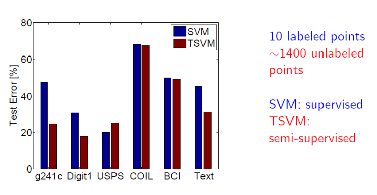

# Topic 5 준지도 학습(Semi Supervised Learning)

출처 : 강필성 교수님의 Business Analytics 강의

### 개요

- 준지도 학습은 Label 데이터와 Unlabel 데이터를 함께 사용함으로써 지도학습보다 높은 성능을 추구한다. 
  
  
  
  > 비지도 학습을 적용할 경우 <mark>"얼추(Almost)" 성능이 증가</mark>한다. 반면 <mark>상황에 따라 성능이 미미하거나 나빠진다. </mark>

- 현실적인 상황에서 Label 데이터는 시공간/비용적 측면에서 얻기 힘들다. 반면 Unlabeled 데이터는 싸며 구하기 쉽다. 
  
  > 중국어 Parsing task : 2년간 4000문장 라벨링함. 

- **방식** 
  
  - Label 데이터로 모델을 학습한다. 
  
  - 학습한 모델을 기반으로 Unlabel 데이터의 Target value를 예측한다. 또한 예측값의 신뢰도를 측정한다. 
  
  - 상위의 신뢰도를 가진 데이터만 Label 데이터로 추가하여 모델을 수정한다. 

- **조건**
  
  - Unlabled 데이터는 군집(Cluster)을 형성해야 한다.  
    
    > 현실에서도 많은 경우 적용됨.  
  
  - 동일한 군집에 속한 데이터는 동일한 클래스의 가능성이 높아야 한다. 
    
    
    
    > 좌측의 경우 Labeling을 할 수 없다. 

- **SSL VS Transductive learning**
  
  
  
  - SSL : 아직 주어지지 않은 Unlabled 데이터(Test 데이터)의 결과까지 예측 
  
  - Transductive learning : 현재 주어진 Unlabled 데이터의 결과만 예측 
    
    > SSL이 Transductive learning 보다 한발자국 더 나아간 것 

--- 

### Self-Training and Co-Training

- ##### Self-Training
  
  - 가정 : Unlabled 데이터라도 예측 결과값이 높은 신뢰도를 가진다면  맞는 것으로 판단한다. 
    
    
  
  - 가짜(pseudo) lable 데이터를 추가하는 방식에 따라 방식이 세분화 된다. 
    
    - 방식 1 : 상위 신뢰도의 일부 사례들을 계속해서 lable 데이터에 추가한다. 
    
    - 방식 2 : 모든 unlabled 데이터를 그냥 추가한다. 
    
    - 방식 3 : 모든 Unlabled 데이터를 신뢰도에 따라 가중치를 부여하여 lable 데이터에 추가한다.  
    
    - 그외 등등 여러 변종이 있음. 
  
  > ex)- K-Nearest Neighbor 방식 채택 
  > 
  >     
  > 
  > > 초록색 : unlabled data. 빨간색 : X로 label된 값들. 파란색 : o로 Label 된 값들.
  > 
  > - 우측 상황처럼 Outlier 등 오류가 발생하면 다수의 사례를 잘못 판단하는 사례가 발생할 수 있다. 

- **Self-training 특징**
  
  - 장점 : 가장 쉬운 SSL 방식으로 NLL 분야 등 종종 사용한다. 
  
  - 단점 : 초기 오류가 성능을 악화하는 쪽으로 강화시킬 수 있따. 

- ##### Co-training
  
  - 객체에 대해 설명하는 상호 배반적인 특징을 가진 데이터를 동시에 활용하여 학습 
    
    > ex)- Epclipse : 일식 <-> 차종 구분하기. 이미지 데이터와 test 데이터를 동시에 활용하여 학습 
  
  - 서로 다른 데이터를 각자 학습한 후, 신뢰도가 높은 방식으로 그렇지 않은 방식을 재학습 시킴
    
    
    
    - 단, 두 데이터가 완전히 상호배반이 아닐 수 있음. 그래도 co-training을 통해 성능을 개선시키고자 함. 
  
  
  
  - **신뢰도 측정 방식 with Naive Bayesian**
    
    - Intra confidence : Entropy 
      
      - 얼마나 현재 모델이 특정 두 범주에 대해서 극단적인 예측을 하고 있는가?
    
    - Inter confidence : Training error 
      
      - 현재 모델이 실질적으로 잘 예측하고 있는가. 
    
    - 신뢰범주 = Entropy x Training Error

