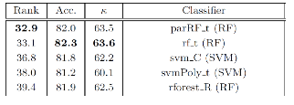
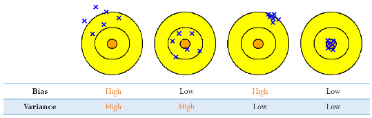
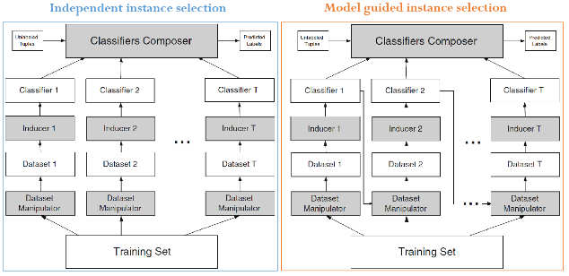

# Topic 4 앙상블 학습(Ensemble Learning)

출처 : 강필성 교수님의 Business Analytics 강의

#### 

#### Ensemble Learning 기본 개념

- 전제 / 상황 
  
  - 모든 환경에 최고의 성능을 내는 상위의 알고리즘이란 없다(No Free Lunch Thm). 
    
    즉, Data set의 특징에 따라 최고 성능을 내는 알고리즘이 달라진다. 
  
  - 따라서, 수많은 기술들을 적용해보는 것이 임의의 새로운 분류 문제를 푸는데 최고의 보험이다.
    
    
  
  - 하지만, <mark>여러 기술들을 적절히 결합한다면, 개별 기술보다 성능이 **"대체로"** 높게 나온다.</mark>
    
    
    
    > y축이 Error rate을 의미. 낮을 수록 좋다. 
    
    

- <u>Do we Need Hundreds of Classifiers to Solve Real World Classification Problem?</u>
  
  - 2014년 논문 발표 당시 모든 분류 Dataset에 대해 boosting을 제외한 모든 알고리즘을 적용함.
  
  (상위 5위에 속하는 알고리즘)
  
  - 결론 1 : Rank가 1인 경우는 없다. (No Free Lunch)
    
    > Rank는 각 데이터셋별 성능 순위를 평균한 것으로, 모든 경우에 대해서 최고의 성능이 나오는 경우는 없음을 의미 
  
  - 결론 2 : 그래도 Random forests와 SVM 계열이 유의미하게 상대적으로 분류 성능이 높게 나온다. 

---

#### Bias - Variance Decomposition

- ###### 이론적 배경
  
  - 데이터는 모델에 Noise(~Error)가 추가된 형태로 나온다 가정
    
     $y = F^*(x) = \epsilon, \epsilon$ ~ $N(0, \sigma^2)$ 
    
    > - $F^*(x)$ : Target Fuction. 위 모델을 찾으려 하지만 정확히 알 순 없다. 
    > 
    > - $\epsilon$ : 에러. 독립적이고 동일하게 분포되어있다고 가정 
  
  - 각 Dataset에 대해 $F^*(x)$ 모델을 적용하여 나온 결과를 토대로 $\hat F_i(x)$ 모델 예측 
    
     
    
    > +$\overline F(x)$ = $E[\hat F_D(x)]$ 
  
  - 특정 포인트 $x_0$에 대해서 $Err(x_0)$ 의 식을 정리하여 <mark>편차와, 분산을 분리함. </mark>
    
    
    
    > since $E[\overline F(x_0) - \hat F(x_0)] =0,$
    
    

- ###### 편차와 분산의 특성
  
  
  
  - **편차(Bias) : 다양한 데이터셋으로부터 반복적으로 모델링 할 때 평균적 결과들이 유사한가?** 
    
    - Low Bias :  데이터 셋으로부터 평균적으로 정확히 측정하고 있다.
    
    - High Bias : 방향이 맞지 않다. (Poor match) 
  
  - **분산(Variance) : 개별적인 모델링이 평균과 얼마나 큰 차이를 보이는가** 
    
    - Low Variance : 다른 데이터 셋이라 하더라도 측정값이 거의 변하지 않는다. 
    
    - High Variance : 값이 퍼져 있다 (Weak match)
  
  - Error은 원 데이터에서 부여되는 것으로 제거할 수 없다.(Check ) 
  
  - 편차와 분산은 각각으로부터 독립적이지 않다.(Why?)
    
    

- **모델 복잡도에 따른 분류** 
  
  
  
  - Lower model complexity : High bias & low variance 
    
    - 개별 모델리의 값의 범위는 좁으나, 평균치가 정답과 거리가 있다. 
    
    > ex) Logistic regression, LDA, k-NN with large k, etc
    
    - Bagging 방법과 잘 맞음. Bagging을 통해 분산을 줄여줄 수 있음 
  
  - Higher model complexity : low bias & high variance 
    
    - 평균치로는 정답과 가까우나, 개별 모델링의 값의 범위가 넓다. 
    
    > DT, ANN, SVM, k-NN with small k
    
    - Boosting과 잘 맞음. Boosting을 통해 편차를 줄여줄 수 있음

###### 앙상블 학습의 특징

- **목적 : 다수의 학습을 적용함으로서 Error을 줄인다.** 
  
  1. 분산을 줄인다 : Bagging 기술을 적용한다. 
  
  2. 편차를 줄인다 : Boosting 기술을 적용한다.  

- **앙상블 학습 특징** 
  
  - 동일한 모델을 합쳐봐야 이득이 없다. 성능이 있으면서 일정 이상 다른 모델들을 합쳤을 때 효과가 좋다. 
  
  - 따라서 앙상블 구조를 짤 때 주요 질문은 아래와 같다. 
    
    1. **충분한 다양성을 확보하기 위해 앙상블 구조의 개별 요소들을 어떻게 생성할 것인가?** (매우 중요)
    
    2. 어떻게 개별 분류기의 결과를 결합할 것인가?

- **방식** 
  
  
  
  > 좌측 : Implicit Diversity 확보. 각 학습기에 서로 다른 Random subset을 제공한 다음, 결과값을 합침 
  > 
  > 우측 : Explicit Diversity 확보. 이전 학습 과정이 이후 과정에 영향을 미치는 등 기존 Data가 이전과 다름을 보장함. 

- 앙상블 학습이 효과가 있는 이유 (수리적 풀이)
  
  $y_m(x)=f(x)+\epsilon_m(x)<=> E[(y_m(x)-f(x))^2]=E_x(\epsilon_m(x)^2)$  성립할 때, 
  
  
  
  - 위의 수식은 Cauchy's 부등식에 의해 항상 성립함. 
    
    > $(ax+by)^2 <= (a^2 + b^2)(x^2+y^2)$
    > 
    > - $(\epsilon_1 + ... + \epsilon_m)^2 <= (1^2 + ... + 1^2)(\epsilon_1^2 + ... + \epsilon_m^2)$
  
  - 더불어 좌측은 앙상블 Error를, 우측은 평균 Error을 의미함. 
    
    
    
    > $f(x) = \frac{1}{M} * M *f(x)$
    > 
    > $y_m(x) - f(x) = \epsilon_m(x)$
    
    
  
  - Error의 평균이 0이고, 각각 상관관계가 없다고 가정할 시 
    
    $E_{Ensemble} = \frac{1}{M} E_{Avg}$ 이 성립한다.  (best case)
  
      

