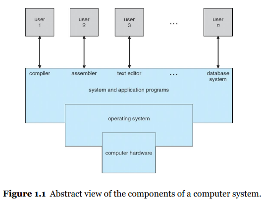
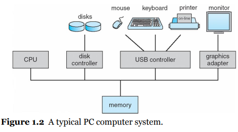
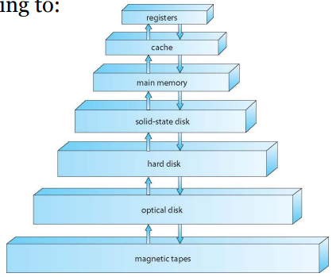

### 컴퓨터의 구성과 운영 체제의 역할

- 컴퓨터는 <u>정보</u>를 처리하는 기계로, 크게 <u>4가지(하드웨어, 운영체제, 응용 프로그램, 사용자)</u>로 나뉜다.
  
      
  
  > 정보 : 불확실성을 측정하는 양적 표현방식
  > 
  > 하드웨어 : 중앙 처리 장치 / 메모리 및 입출력 장치로 구성. 기본 계산용 자원을 제공함
  > 
  > 응용 프로그램 : 사용자의 계산 문제를 해결하기 위해 이들 자원이 어떻게 사용될지 정의하는 지시(instruction)의 집합

- 운영 체제는 하드웨어의 계산 자원을 응용 프로그램에 나눠주는 <mark>자원 할당자 역할을 수행하는 소프트 웨어</mark> 
  
  - 컴퓨터의 부적절한 사용을 방지하기 위해 사용자 프로그램의 수행을 제어하기 도 함
  
  - 구성 요소 
    
    1. 항상 실행중인 커널
    
    2. 응용 프로그램 개발을 쉽게하고 기능을 제공하는 미들웨어 프레임워크
    
    3. 시스템 실행 중 시스템 관리하는데 도움을 주는 시스템 프로그램.

#### 컴퓨터 시스템의 구성

- 컴퓨터 시스템은 <u>하나 이상의 CPU</u>와 <u>공유 메모리 </u>사이의 엑세스를 제공하는 <u>공통 버스</u>, 그리고 <u>연결된 여러 장치 컨트롤러</u>로 구성됨
  
  
  
  > 각 장치 컨트롤러는 각 로컬 버퍼 저장소, 특수 목적 레지스터 집합을 유지 관리하며 장치 드라이버를 가지고 있음. 
  > 
  > 장치 드라이버를 통해 운영체제에게 장치에 대한 일관된 인터페이스를 제공함. 

- 컴퓨터 작업은 다음의 순서로 작동함 
  
  1. 장치 드라이버가 장치 컨트롤러의 적절한 레지스터에 값을 적재한다.
  
  2. 장치 컨트롤러는 레지스터의 내용을 검사하여 수행할 작업을 결정한다.
  
  3. 컨트롤러는 장치에서 로컬 버퍼로 데이터 전송을 시작한다.
  
  4. 장치 컨트롤러는 **인터럽트**를 통해 장치 드라이버에게 작업이 완료되었음을 알린다.
     
     > <u>인터럽트는 하드웨어가 운영체제와 상호 작용하는 주요 방법</u>으로 장치의 상태(작업 완료 / 작업 요청 등)를 장치 드라이버에게 알린다.
  
  5. 장치 드라이버는 각 요청에 따라 상태 정보 / 다른 파트로 제어를 넘긴다.

#### 컴퓨터 시스템 구조

- 최신 컴퓨터 아키텍처는 다중 처리기 시스템이다.
  
  - 다중 처리기 시스템의 주요 장점은 처리량 증가이다. 다만 프로세서가 N개 는다고 해서 처리량이 N배 만큼 늘진 않는다.

- SMP(Symmetric multiprocessing)이 가장 흔한 다중 처리기 시스템으로, 각 CPU 프로세서가 모든 일을 한다. 
  
  - <-> Aymmetric multiprocessing : 각각의 프로세서들이 고유의 일만 한다. 

- **용어 정리**
  
  > CPU : 명령을 수행하는 하드웨어
  > 
  > Processor : 하나 이상의 CPU를 포함하는 물리적인 칩
  > 
  > Core : CPU의 기본 계산 단위
  > 
  > 다중 코어 : 1개의 CPU에 여러 코어를 포함함
  > 
  > 다중 처리기 : 여러 프로세스를 포함함

##### 저장장치 구조

- 저장장치 시스템은 속도와 비용에 따라 계층 구조로 구성할 수 있다.
  
  
  
  > 레벨이 높을수록 비싸지만 속도가 빠르다.
  > 
  > 계층이 내려갈수록 일반적으로 비트당 비용은 감소하고 반면 엑세스 시간은 증가한다.

- **메인메모리**
  
  - CPU는 메모리에서만 명령을 적재할 수 있어, 프로그램이 메인 메모리에 있어야만 실행시킬 수 있다.
  
  - 폰 노이만 구조 등을 통해 명령을 수행한다.
    
    - 폰 노이만 구조 시스템은 명령(fetch) - 실행(execution) 사이클로 형성되어 있다.
      
      > 명령(fetch) :먼저 메모리로부터 명령을 인출해, 그 명령을 명령 레지스터에 저장한다.
      > 
      > 실행(execution) : 명령을 해독하고, 실행한다.
  
  - 단, 메인 메모리는 1) 모든 프로그램과 데이터를 저장하기엔 너무 작으며, 2) 전원이 공급되지 않으면 내용을 잃어버리는 휘발성 저장장치이다.
    
    - 따라서 컴퓨터 시스템은 메인 메모리의 확장으로 비휘발성 보조저장장치를 제공한다.

- **비휘발성 저장장치**
  
  - 메인 메모리의 확장이며 대량의 데이터를 영구적으로 보유할 수 있다.
  
  - 가장 일반적인 비휘발성 저장장치는 프로그램과 데이터를 모두 저장할 수 있는 하드디스크이다.

#### 운영체제의 작용 및 역할

1. 최신 운영체제는 다중(=멀티) 프로그래밍 및 다중 태스킹을 통해 CPU 효율성을 증진시킴으로써 사용자 만족도를 올린다. 
   
   > 다중 프로그래밍 : CPU 작업과 입출력 작업을 병행하는 것. CPU가 항상 1개 이상의 작업을 실행할 수 있도록 프로그램을 구성하여 CPU 이용률을 높인다.
   > 
   > 다중 태스킹 : CPU 스케줄링 알고리즘이 프로세스 간에 빠르게 전환하여 CPU가 유휴 상태가 안되게 만든다.

2. 메모리 관리를 통해 CPU 이용률과 사용자의 응답 속도를 개선한다. 
   
   - CPU가 명령을 수행하기 위해 명령이 메인 메로리에 있어야 하므로, 적재적소에 메모리를 할당 및 회수해야함.

3. 운영체제는 사용자 프로그램이 시스템의 올바른 작동을 방해하지 않도록 사용자 모드와 커널 모드의 두 가지 모드를 통제/운영한다.
   
   - 커널 모드에서만 특권 명령어를 실행할 수 있다. 예를 들어 커널 모드로 전환하는 명령, I/O 제어, 타이머 관리 및 인터럽트 관리가 이러한 명령어들이다.
     
     > 특권 명령 : 악영향을 끼칠수 있는 일부 명령들. 이들을 특권 명령으로 지정하여 잘못된 사용자로부터 컴퓨터 시스템을 보호하고자 함.

4. 파일 시스템, 대용량 저장장치, 입출력 장치를 관리한다.

5. 프로세스의 교환 간 적절한 캐시 관리를 통해 필요한 정보가 적재적소에 전파되도록 한다.  

6. 가상화를 통해 컴퓨터 시스템이 사용자가 원하는 환경에 맞출 수 있도록 지원한다. 
   
   > 가상화 : 하드웨어를 여러가지 실행 환경으로 추상화하여 개별 환경이 자신만의 컴퓨터에서 실행되고 있다는 환상을 만들 수 있는 기술

