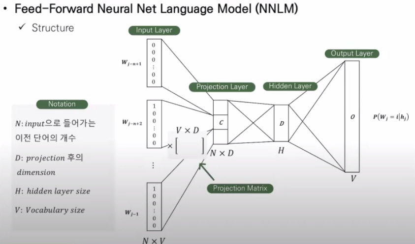
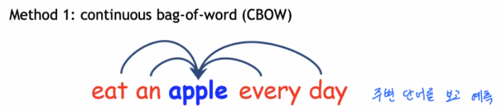
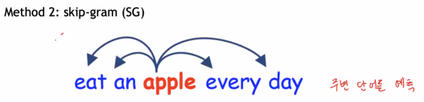

# Efficient Estimation of Word Representations in Vector Space

##### 1. 서론

- 기존의 NLP 시스템과 기술들은 각 단어를 독립적인 개별 객체로 여긴다. 이 방법은 단순하고 강건성이 높고, 간단한 모델로도 높은 성능을 낼 수 있다. 하지만 성능이 계산양에 압도될 때가 많다.    
  
  - One- hot 인코딩의 단점

- 이 논문의 목표는  계산양을 대폭 줄여 bil 단위의 단어 / mil 단위의 어휘들을 소화내면서 성능을 일정 이상 유지하는 모델/기술을 소개하는 것이다. 
  
  - 또한 단어의 선형 규칙들을 보존하는 새로운 모델 구조를 구성하고자 한다. 
  
  - 선형 규칙은 의미상 연관성을 띄거나, 문법적 구성을 동일하는 등 여러 의미의 유사성을 포함한다. 

- 이전 연구로는 NNLM이 있으며, NNLM 모델에서 최초 1회 hidden layer 학습 과정만 채택할 것이다. 

Q. distributed representations of word 가 정확히 의미하는 건 뭐지? 

##### 2. 모델 구조

- 모델 별 계산 복잡도는 O = E * T *Q 에 비례한다. 
  
  > E : 학습 epoch 횟수 
  > 
  > T : 학습 데이터의 단어 수 
  > 
  > Q : 모델 구조에 의해 정해지는 복잡도 

- 현재 사용하고 있는 NLP 모델 2가지의 계산 복잡도는 Non-linear hidden lay의 계산 복잡도에 가장 높은 비중을 가진다. 
  
  - NNLM 모델은 N * D * H  부분에 계산복잡도 비중이 높다. 
    
    
    
    > Q = N * D   +   N * D * H   +   H * V
    
    - V 는 Huffman binary tree(= Hierarchical Softmax) 도입시 계산양이 log2(Unigram-perplexity(V)) 까지 낮아진다. 
  
  - RNNLM 모델의 H * H 부분에 계산복잡도의 비중이 높다.
    
    > Q = H *H + H *V
    
    - V는 NNLM과 동일하게 log2(Unigram-perplexity(V))까지 낮아진다.

- 모델 학습간 DistBelief 모델과 동일하게 병행 학습을 진행하여 계산복잡도를 줄일 것이다. 

##### 3. New log-linear 모델

- 계산 복잡도를 줄이기 위해 log-linear한 모델 2가지를 살펴볼 것이다. 
  
  - CBOW  
    
    
    
    > Q= N * D + D * log2(V)
    > 
    > - N * D : 현재 단어를 중심으로 N개의 단어 Projection
    > 
    > - D * V : Projection layer에서 Output layer 계산 
  
  - Continuous Skipgram model
    
    
    
    > Q = C *(D+ D * log2(V))
    > 
    > > C : maximum distance of word
    > 
    > - 

##### 4. 결과

- 단어 벡터들의 성능을 측정하기 위해 8893개의 의미상의, 10675개의 문법상 질문을 담은 test set을 정의했으며, 정확도 측정 간 조금이라도 틀리면 오답으로 처리하였음

- Google news의 말뭉치 데이터 중 1 mil 개의 어휘를 선정하였으며, 이중 30k 개의 어휘를 뽑아 각 모델들의 성능을 확인하였음. 일반적으로 벡터 차원(d)과 데이터 양을 늘릴 때 성능이 향상됨.

- RNN 모델은 문법 부문에서 성능이 좋았으며, NNLM이 RNN보다 좀 더 나은 성능을 보였다. CBOW는 NNLM보다 문법 / 의미 둘 다에서 성능이 좋았으며, Skip-gram은 문법 부문에선 CBOW보단 떨어졌지만, 의미 부문에선 가장 성능이 좋았다. 
  
  - NNLM : sematic - 34.2 / syntatic - 64.5
  
  - CBOW : 57.3 / 68,9
  
  - Skip-gram : 66.1 / 65.1 

- 계산양을 최소화하기 위해 단 1회 epoch 학습을 진행하였을 때, CBOW가 Skip-gram에 비해 약 3배 가량 빨리 처리되었다. 

##### 5. 결과

- 단순한 모델로도 복잡한 모델구조만큼 얼추 성능이 나옴

- 또한 계산양이 매우 줄어들었기 때문에 보다 많은 양의 데이터 / 높은 차원을 소화할 수 있었음.  

