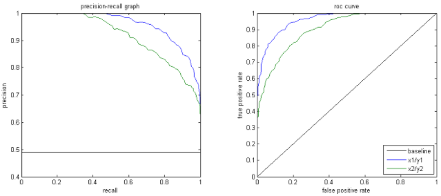

# Learning from imbalanced data

##### 1. Imbalanced Data의 정의와 필요성

- Imbalanced Data : 클래스간 불균등한 분포가 존재하는 데이터 
  
  > ex) 100 : 1, 1000 :1, 10000:1 

- 현실 속에서 Minority Data의 의미가 매우 중요할 때가 있다.  
  
  > ex) 의료 데이터 - 수백명 중 1명에게 발발하는 병이 있을 때, 발발한 1명의 데이터의 가치는 매우 높음. 
  
  

- Imbalaced data는 그렇지 않은 데이터와 추가 샘플 생성/평가 수단/ 학습방법 이 달라져야 한다. 따라서 Imbalanced data에 걸맞는 평가 지표를 학습해야 한다. 
  
  > ex) 총 100명 중 1명이 아픈 경우, 모든 사람이 건강하다고 잘못 진단해도 정확도는 99%를 달성한다. 

- Data complexity 란 무엇인가? 

##### 2. Imbalance 특징

- 내재적(Intrinsic) vs 외재적(extrinsic) imbalance 
  
  > 내재적 : 데이터 자체가 가지고 있는 Imbalance 
  > 
  > 외재적 : 데이터를 선출하는 과정 등 데이터 외부 요인으로 인해 발생한 Imbalance 

- Absolute rarity vs relative imbalance 
  
  > Absolute rarity : 사례가 부족하여 생기는 Imbalance
  > 
  > relativ imbalance : 비율 상 소수이긴하나, 클래스 사례는 충분한 경우 

- Between class imbalance vs within class imbalance 
  
  > between class imbalance : 서로 다른 클래스 간 생기는 imbalance 
  > 
  > within class imbalance : 한 클래스 내에서 분화된 그룹간 imbalance   

##### 3. Imbalance 상태를 해결하기 위한 최신 기술들

###### 1) Sampling => 비율 맞추기.

- Over sampling : Minority class 에서 추가로 표본을 뽑는 방식 
  
  > 주어진 Minority 예시에 과적합 가능성이 있음 .
  
  
  
  - SMOTE(Synthetic Minority oversampling technique)
    
    - 새로운 샘플을 두 예시 사이의 값으로 형성 
      
      > $x_{new} = x_i + (\hat x_i - x_i) * \delta$ ($\delta \in [0,1]$)
      > 
      > Jittering과 결합 시, $\delta $에 방향성이 부여될 되기도 함. 
    
    - 기본 데이터와 다른 데이터를 생성할 수 있으나, 클래스간 Overlapping 가능성을 높힘 
    
    
  
  - Borderline - SMOTE  (SMOTE 개선)
    
    - Minority와 Major의 비율을 계산하여 "Danger" 일때만 추가 샘플을 형성
      
      > Danger : $\frac{m}{2} <= |S_{m-NN} \cap S_{maj}| < m$ 
    
    - 클래스간 Overlapping 가능성을 낮춤 
    
    
  
  - ADASYN
    
    - Minority case 중 주변에 사례가 충분히 없을 경우에 한정하여 샘플링 
      
      > 생성해야할 minority case 수 : G = $(|S_{maj}| - |S_{min}|) *\delta$
      > 
      > 주변 밀도 비율 : $\tau_i = \frac{\triangle_i}{KZ}$ 
      > 
      > > K : K nearest neighbor 개수 
      > > 
      > > $\triangle_i $ : K nearest beighbor 영역 중 $S_{maj}$ 에 속하는 개수 
      > > 
      > > Z : $\sum \tau_i =1$ 을 성립하게 만드는 값  
    
    - $\tau_i$ 의 값을 기준으로 샘플링함으로써, 클래스간 Overlapping 가능성을 낮춤   
    
    
  
  - CBO(Cluster based Sampling)
    
    - Major / Minor 클래스 간 동일한 샘플 개수를 뽑도록 샘플링 
    
    
  
  - Sampling + Boosting 
    
    - SMOTE + Adaboost 
    
    - DataBoost - IM 

- Under sampling : Major class 에서 표본을 제거하는 방식 
  
  > Major 클래스에서 중요 데이터를 잃을 가능성이 있음 
  
  
  
  - Data cleansing Tech 
    
    - Tomek links : 소속된 클래스보다 타 클래스에 밀접한 경우 제거 

###### 2) Cost sensitive method (추가 확인 필요)

- 오분류로 인해 발생하는 비용을 최소화하는데 초점 
  
  - 일반적으로 Major 클래스를 Minor 클래스로 착각한 것보다, Minor 클래스를 Major 클래스로 분류한 비용을 더 크다고 여김.
  
  - 크게 3가지 방향성으로 나뉨  

- 오분류 비용 부여 
  
  - 비용에 민감한 Bootstrap 방식으로, 학습 / 추론 간 가장 최적의 training 분포를 선별하기 위해 사용

- 앙상블 방식에 비용 최소화 기술 적용 
  
  - 아직 앙상블 방식이 정확히 무엇을 의미하는지 모르겠... 

###### 3) Kernel - based method / active learning

- Kernel 기반 기술 중 대표격인 SVM 에서도 imbalance data에 대한 처리가 필요함.
  
  - 자칫하면 minority 데이터를 Major 클래스로 분류할 수 있음. 
  
  - Sampling 및 앙상블 방식을 추가로 적용한 GSVM-RU, GSVM 등이 추가로 발전함. 
  
  - 또는 SVM의 메카니즘에 기반하여 보다 Imbalanced data에 적합한 방식으로 OFS, ROWLSs 방식이 발전함. 

- Active learning method 
  
  - 기계가 라벨링을 자동으로 해주는 기술로, Imbalanced data에 대한 처리가 필요함 

### 4. Imbalanced 데이터 학습을 위한 평가 지표

- 단일 평가 지표 : Accuracy : $\frac{TP}{TP+TN}$
  
  - 정확도(Precision), 재현율(Recall), F-measure 적용 
    
    > Precision : $\frac{TP}{TP+FP}$
    > 
    > Recall : $\frac{TP}{TP+FN}$
    > 
    > F-measure : $\frac{(1+\beta)^2 Recall * Precision}{\beta^2 * Recall + Precision}$
    > 
    > - $\beta$ 의 값에 따라 Precision / Recall 중 무엇에 좀 더 비중을 줄 지 결정

- Curve 
  
  - Roc, PR 
    
    
  
  - Cost 

