# Topic 5 준지도 학습(Semi Supervised Learning)

출처 : 강필성 교수님의 Business Analytics 강의

출처 : 단단한 머신러닝 챕터 13 - 준지도 학습 

#### 공부 간 생긴 질문

SSL이 발달하면, 몇개의 label 데이터로 원하는 성능을 얻을 수 있을지 계산할 수 있지 않을까? 

### 

### 개요

- 준지도 학습은 Label 데이터와 Unlabel 데이터를 함께 사용함으로써 지도학습보다 높은 성능을 추구한다. 
  
  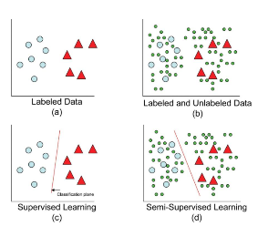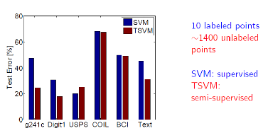
  
  > 비지도 학습을 적용할 경우 <mark>"얼추(Almost)" 성능이 증가</mark>한다. 반면 <mark>상황에 따라 성능이 미미하거나 나빠질 수 있다. </mark>

- 준지도 학습을 위한 환경은 현실적인 상황에서 자주 생긴다
  
  - 일부의 Label 데이터와 다수의 Unlabel 데이터들로 데이터셋이 구성될 때가 잦다. 
  
  - Label 데이터는 시공간/비용적 측면에서 얻기 힘들다. 반면 Unlabeled 데이터는 싸며 구하기 쉽다. 
  
  > 중국어 Parsing task : 2년간 4000문장 라벨링함. 

###### **방식**

- Label 데이터로 모델을 학습한다. (지도 학습)

- 학습한 모델을 기반으로 Unlabel 데이터의 Target value를 예측한다. 또한 예측값의 신뢰도를 측정한다. 

- 상위의 신뢰도를 가진 데이터만 Label 데이터로 추가하여 모델을 수정한다. 

**전제**

- <mark>가정 : 비슷한 샘플은 비슷한 출력값을 가진다   </mark>
  
  - 동일한 군집에 속한 데이터는 동일한 클래스일 가능성이 높아야 한다.
  
  - 주로, 클러스터 / 매니폴드 가설을 많이 채택한다. 
    
    - 클러스터 가설 : 데이터에 클러스터링 구조(밀집 구조)가 있다고 가정아래, 같은 클러스터링에 속한 샘플을 동일한 클래스로 배분하는 방식 
    
    - 매니폴드 가설 : 데이터의 분포가 메니폴드 구조로 되어 있다고 가정하며, 이웃되는 샘플들이 비슷한 출력값을 가질 것이라 판단하는 방식 
      
      >  매니폴드 구조 : 국소적인 시각에서 유클리드 공간의 성질을 지니는 구조. 다차원에 적용할 수 있어 클러스터 가설보다 범용성이 높다. 
      
      
      
      > 좌측의 경우 Uniformly Distribution 되어 있기 때문에 SSL의 가정을 적용할 수 없다. 
      > 
      > 데이터 분포가 있다고 가정하는 것은 현실에서도 많은 경우 적용됨.  

**준지도 학습 종류 : Pure SSL VS Transductive learning**

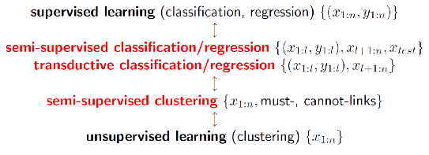

- Pure SSL : 아직 주어지지 않은 Unlabled 데이터(Test 데이터)의 결과를 예측 

- Transductive learning : 현재 주어진 Unlabled 데이터의 결과만 예측 
  
  >  SSL이 Transductive learning 보다 한발자국 더 나아간 것 

- *(추가) Active Learning : 모델 성능 개선에 도움이 될 샘플을 골라 효율적으로 학습하는 방식 

---

--- 

### Self-Training and Co-Training

##### Self-Training

- 가정 : Unlabled 데이터라도 예측값이 높은 신뢰도를 가진다면  맞는 것으로 판단한다. 
  
  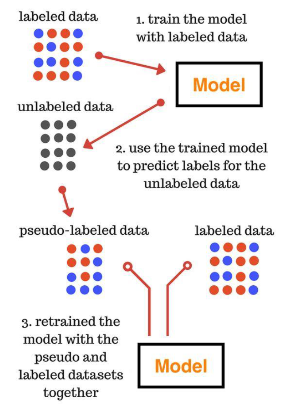

- 신뢰도를 측정하는 방식과, 가짜(pseudo) lable 데이터를 추가하는 방식에 따라 세분화 된다. 
  
  > ex)- K-Nearest Neighbor 방식 채택 
  > 
  >     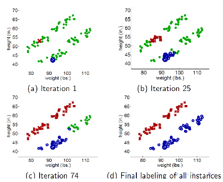<->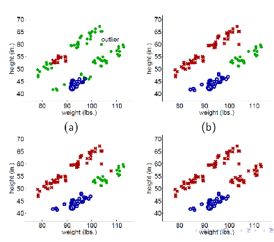
  > 
  > >  초록색 : unlabled data. 빨간색 : X로 label된 값들. 파란색 : o로 Label 된 값들.
  > 
  > - 우측 상황처럼 Outlier 등 오류가 발생하면 다수의 사례를 잘못 판단하는 사례가 발생할 수 있다. 

- **Self-training 특징**
  
  - 장점 : 가장 쉬운 SSL 방식으로 NLL 분야 등 종종 사용한다. 
  
  - 단점 : 초기 오류가 성능을 악화하는 쪽으로 강화시킬 수 있다. 

##### Co-training

- 객체에 대해 설명하는 상호 배반적인 특징을 가진 데이터를 동시에 활용하여 학습한다. 
  
  > ex)- Epclipse : 일식 <-> 차종 구분하기. 이미지 데이터와 test 데이터를 동시에 활용하여 학습 

- 서로 다른 데이터를 각자 학습한 후, 신뢰도가 높은 방식으로 그렇지 않은 방식을 재학습 시킨다. 
  
  
  
  - 이론적으로 두개의 데이터가 독립적일 때, Unlabel 데이터를 기반으로 Co-training을 통해 학습기의 성능을 임의의 정도까지 향상할 수 있음이 증명되었음. 
  
  - 단, 두 데이터가 완전히 상호배반이 아닐 수 있음. 그래도 여전히 효과적으로 약한 분류기의 성능을 향상시킬 수 있음이 증명됨. 
  
  - 후속 이론 연구를 통해 사실 상 단일 데이터로도 약한 학습기 사이에서 차이가 있어 다양성이 보장될 경우 일반화 성능을 향상시킬 수 있음 
    
    > 앙상블 학습과 연결됨. 

**신뢰도 측정 방식 - 학습 알고리즘에 따라 계산 방식이 달라짐** 

- 나이브 베이즈 분류기 : 사후확률을 통해 분류 신뢰도 측정 

- SVM : 마진의 크기를 통해 분류 신뢰도 측정 

- 일반적으로 측정하는 것은 아래의 항목들임 
  
  - Intra confidence : Entropy 
    
    - 얼마나 현재 모델이 특정 두 범주에 대해서 극단적인 예측을 하고 있는가?
  
  - Inter confidence : Training error 
    
    - 현재 모델이 실질적으로 잘 예측하고 있는가. 
  
  - 신뢰범주 = Entropy x Training Error

---

#### SSL SVM

###### 개요

- 서포트 벡터 머신 이론을 준지도 학습에 적용한다.  

- 기존 서포트 벡터 머신이 마진을 최대화하는 분할 초평면을 목표로 잡는 것에 비해, 준지도 SVM에선 데이터의 저밀도 구역을 통과하는 분할 초평면을 찾는 것을 목적으로 한다. 
  
  

###### 주요 방식 - TSVM

- 목표 : $D_u$ 샘플에 대해 예측 레이블 $\hat y = (\hat y_{l+1}, ..., + \hat y_{l+u}, \hat y_i \in (-1, +1))$ 을 찾는 것 
  
  $min_{w,b,\hat y, \xi} \frac{1}{2}||w||_2^2 + C_l \sum_{i=1}^l \xi_i + C_u \sum_{i=l+1}^m\xi_i$
  
  > $s.t.$ $y_i(w^Tx_i + b) >= 1- \xi_i, i=1,2, ..., l, $
  
  > $\hat y_i(w^Tx_i+b) >= 1-\xi_i, i= l+1, ... m,$
  
  > $\xi_i >=0, i=1,2, ..., m$ 
  
  > > 이때 $C_l, C_u$ 는 Label 샘플과 Unlable 샘플의 중요도의 밸런스를 맞추는 파라미터임.  

- **과정(ex - TSVM)**
  
  1. 지도학습 방식으로 label 샘플만을 통해 모델 학습 
  
  2. 학습된 모델을 통해 Unlabel 샘플의 y 값을 예측하여 label 데이터에 추가함 
     
     > 단, 레이블 예측이 정확하지 않으니 $C_u$를 $C_l$ 보다 작게 설정하여 레이블 데이터의 비중을 높도록 해야함
  
  3. 추가된 label 데이터를 포함하여 다시 SVM 모델을 학습함. 
  
  4. 이때 초기 SVM 모델과 레이블 분류가 다르거나, 오류 확률이 높은 unlabel 데이터를 찾아 레이블을 바꿔줌.   
  
  5. 3~4번 과정을 반복하여 정확도를 올려가며, $C_u = C_l$ 이 될때까지 점차 $C_u$의 크기를 키운다. 

- **TSVM 문제점**
  
  - 1)unlabel 데이터의 레이블 배치와 조정을 하는 과정에서 클래스 불균형 문제를 조우할 수 있음. 
    
    - 이를 해결하기 위해 $C_u$ 를 레이블이 양성($C_u^+$), 음성($C_u^-$) 두개의 항으로 나누며, 초기화 시 $C_u^+ = \frac{u_-}{u_+}C_u^-$ 로 설정함. 
      
      > $u_-, u_+$ : 각각 예측 레이블이 음성, 양성으로 분류된 샘플의 개수를 의미  
  
  - 2)계산양을 매우 많이 필요로 함. 
    
    - 따라서, SSL SVM 연구는 **어떻게 고효율적인 최적화 전략을 세우는가**로 설정됨 
    
    - 이에 대한 대책으로 Graph-based SSL, meanS3VM 등이 연구됨  
      
      > meanS3VM : 레이블 평균 예측값에 기반한 모델 

---

---

#### Graph-based SSL

###### **가정**

- label 데이터와 Unlabel 데이터가 함께 주어진다 

- <u>객체간 큰 관련성(Heavy edge)가 있다면 동일한 label을 가지는 경향</u>이 있다. 
  
  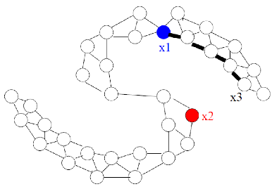
  
  > $x_3$ 의 값은 $x_1$와 같이 파란색으로 분류될확률이 더 높다. 

###### 

###### **그래프 구성**

- Nodes : 각 객체. Label 데이터($X_l$) 와 Unlabel 데이터($X_u$) 모두 포함 

- Edges : 객체의 특징으로 부터 계산된 유사도에 따른 가중치 
  
  - K-NN 그래프나, $\epsilon -radius$ 그래프의 경우 Edge는 있으나 가중치는 없음. 
  
  - 완전 연결 그래프에선 가중치는 객체간 거리에 반비례하여 부여됨
    
    > $w_{ij} = exp(\frac{-||x_i-x_j||^2}{\sigma^2})$

###### **최적화 문제 설정**

- 조건 : Label 데이터는 고정시키면서, unlabel 데이터와의 오차를 최소화할 것 
  
  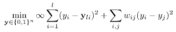
  
  > 좌측 항 : 무한대 값이 곱해져 있기 때문에, 손실 함수를 최소화하려면 무조건 $y_i$ 는 label 데이터인 $y_{li}$ 와 같아야 함. (Label 데이터 고정) 
  > 
  > > $y_{li} :$ 전체 데이터 중 label 데이터의 i 번째 y값. 
  > 
  > 우측 항 : $w_{ij}$ 는 거리에 반 비례하므로, 거리가 가까운 경우는 가능한 정확히 예측하며 반면 거리가 멀 경우 일부 오차를 허용함. 

###### **Harmonic function**

- 의의 : **Unlabel 데이터의 예측값 f(x)가 [0,1] 과 같이 이산 값이 아니여도 된다.** 

- 함수 f는 에너지를 최소화한다. 이때 거리가 가까운 객체간의 예측값은 유사하게 만들며, 거리가 먼 객체간 사이에는 오차를 허용한다. 
  
  > $\sum_{i ~j}w_{ij}(f(x_i) - f(x_j))^2$ 를 최소화하는 것을 목표로 한다. 

- **계산방식**
  
  - 이미 알고 있는 Label 된 데이터($x_1, ..., x_l$)의 f(x)의 값을 토대로 새로운 데이터 $f(x_{l+1}), ..., f(x_{l+u})$ 의 값을 아래 식을 통해서 계산한다. 
    
    >  $f(x_i) = \frac{\sum_{j~i} w_{ij}f(x_j)}{\sum_{j~i} w_{ij}} , \forall x_i \in X_u$
  
  - 또는 **graph laplacian을 통해서 f(x)의 값을 구할 수 있다.**
    
    > <mark>$\frac{1}{2} \sum_{i~j}w_{ij}(f(x_i) - f(x_j))^2 = f^T \triangle f$</mark>
    > 
    > *위의 식의 전개 증명은 단단한 머신러닝 p356에 되어 있음. 
    > 
    > > $\triangle (Laplacian$ $Matrix) = D - W$ 
    > > 
    > >  W : n x n가중치($w_{ij}$) 매트릭스. Symmetric, non-negative 특징을 띔.
    > > 
    > > D : Diagonal matrix s.t. $D_{ii} = \sum_{j=1}^nW_{ij}$
  
  - Harmonic function 과 Graph laplacian 을 통해 최적화 문제를 아래와 같이 바꿀 수 있다. (이진 분류) 
    
    > 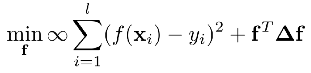
    
     이 때 Laplacian Matrix를 아래와 같이 분리가능하다. 
    
    > 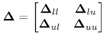
  
  - 또한 최적화 문제의 해답을 찾기 위해 편미분을 진행하면 Harmonic 함수의 해를 찾을 수 있다. 
    
    > $\frac{\partial L}{\partial f} = 0$ 
    > 
    > <=>  $\triangle f = 0$  (since $\partial(f(x_i) - y_i) =0$)
    > 
    > <=> $\begin{pmatrix} \triangle_{ll} & \triangle_{lu} \\ \triangle_{ul} & \triangle_{uu} \end{pmatrix} \begin{pmatrix} f_l \\ f_u \end{pmatrix} $=0 
    > 
    > <=> 1) $\triangle_{ll}f_l + \triangle_{lu}f_u = 0$, 2) $\triangle_{ul}f_l + \triangle_{uu}f_u =0$
    > 
    > => by 2),<mark> $f_u = -\triangle_{uu}^{-1} * \triangle_{ul} * f_l$</mark> (Harmonic Solution)
  
  - $P = D^{-1}W$ 라고 할 때, 
    
    > $P = \begin{pmatrix} D_u^{-1} & 0_{lu} \\ 0_{ul} & D_{uu}^{-1} \end{pmatrix}$ $\begin{pmatrix} W_{ll} & W_{lu} \\ W_{ul} & W_{uu} \end{pmatrix}$ 
    > 
    >  = $\begin{pmatrix} D_{ll}^{-1}W_{ll} & D_{ll}^{-1}W_{lu} \\ D_{uu}^{-1}W_{ul} & D_{uu}^{-1}W_{uu}  \end{pmatrix}$  
  
  - 즉, $P_{uu} = D_{uu}^{-1}W_uu, P_{ul} = D_{uu}^{-1}W_{ul}$ 으로 $f_u$은 아래와 같이 표현할 수 있다. 
    
    > <mark>$f_u$</mark> = $(D_{uu}(I-D_{uu}^{-1}W_{uu}))^{-1}W_{ul}f_l$ 
    > 
    >  = $(I - D_{uu}^{-1}W_{uu})^{-1}D_{uu}^{-1}W_{ul}f_l$
    > 
    >  =<mark> $(I- P_{uu})^{-1}P_{ul}f_l$ </mark>
  
  - 따라서 위의 식에 $f_l = (y_1;y_2;,...; y_l)$을 대입하여 $f_u$ 를 구할 수 있다(=unlabel 데이터에 대해 레이블을 예측할 수 있다).

*다진 분류의 경우는 단단한 머신러닝 p358를 참고할 것. 

###### 

###### **Harmonic Solution의 단점**

1. <u>기존 label 데이터가 틀렸거나, 수정되는 경우는 고려하지 않는다. </u>
   
   > ex- Noise로 인한 label 오분류
   
   - 따라서, 최적화 식에 $\infin$ 항을 제거 및 파라미터 $\lambda$를 도입하여
     
     - **1) label 데이터 간 $f(x_i) = y_i$ 을 최대한 지키면서,**
     
     - **2)label 데이터와 unlabel 데이터 간 오차를 최소화 사이를 조율한다.**
     
     - 
   
   - 이때 해답은 편미분 시 0이 나오게 만드는 값을 찾는다.
     
     
     
     - **$\lambda$ 의 값이 커지면 unlabel 데이터와 label 데이터 간 오차 축소에 중점을 두며(Smoothness 강화), 반대로 작아지면 label 데이터의 정확도에 중점을 둔다.**

2. <u>새롭게 추가되는 데이터(ex- 검증 데이터)를 직접 다룰 수 없다. </u>
   
   - Harmonic function은 이미 주어진 $X_u$ 에 한정하여 정의되어 있다.
   
   - 즉, 새로운 데이터를 추가한다면 새롭게 Harmonic function을 정의해야 한다.

3. 계산량이 매우 많다. 
   
   - 샘플 수가 O(m)이라면 알고리즘에 관한 행렬 규모는 $O(m^2)$가 됨. 

4. 두 데이터 셋이 겹치는 경우 정확도가 떨어진다. 
   
   > 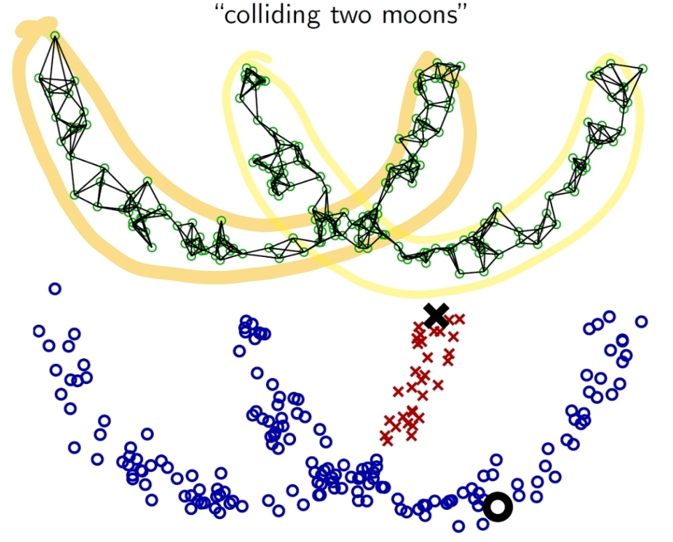

---

---

### SSL 클러스터링

- 클러스터링 과정에서 얻는 정보 
  
  - 1)필수 연결 & 연결 불가 제약  
    
    > 필수 연결 : 같은 클러스터링 내에 속하는 관계들 (ex- $x_2, x_5$ 는 동일한 클러스터링에 속한다)
    > 
    > 연결 불가 : 서로 다른 클러스터링에 속하는 관계들(ex- $x_4, x_7$ 는 각자 다른 클러스터링에 속한다)
  
  - 2)소량의 레이블 데이터 : 어떤 클러스터링에 속하는 지 알고 있는 데이터들 

- 위의 정보들을 기반으로 클러스터링 기반의 알고리즘을 도입한다. 
  
  - ex)- 제약된 k-means 알고리즘 : 각 클러스터링의 중심과 k-번째로 가까운 샘플들을 찾되, 제약 조건(필수연결/연결불가)을 성립하는지 비교한다. 
  
  - 혹, 소량의 레이블 데이터를 알 시, 각 클러스터 별 레이블 데이터의 평균을 구해 각 클러스터의 평균점으로 고려함. 각 평균점에서 가까운 점들을 평균점이 더 이상 움지기이지 않을 때까지 추가한다. 

---

---

### Generative models

**모델의 종류**

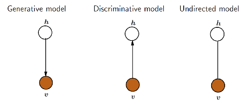

- Generative Model (생성 모델) : 결과 값을 토대로 입력 값을 예측하는 모델. 입력 값의 분포 확률을 파악하는 것이 목적임  
  
  > $p(v,h) = p(v|h) p(h)$ : 레이블 h가 주어졌을 때  설명 변수 v는 어떤 확률 분포를 띄는가? 

- Discriminative model (판별 모델) : 입력 값을 토대로 결과 값을 예측하는 모델  
  
  >  $p(h|v)$ : 설명변수 v가 주어졌을 때 레이블 h로 분류 될 확률 

- Undirected model :Energy-based 모델. 에너지를 가장 안전한 상태로 변경
  
  >  $p(v,h) = \frac{exp(-E(v,h))}{\sum_{v', h'} exp(-E(v', h'))}$

**전제** / **가정( - Gaussian Mixture Model)**

- <mark>각 레이블 별 설명변수들을 생성하는 매커니즘이 있을 것</mark>이다. 

- 입력 값의 분포를 가정하고, 최대우도법을 통해 구체적인 파라미터들을 유추한다.  

- 주로 가우시안 분포를 가정하나, 혼합 전문가 모델 또는 나이브 베이즈 모델 등도 적용한다. 
  
  - 혼합 전문가 모델과 나이브 베이즈 모델은 적은 레이블 데이터로도 좋은 성능을 내지만, 모델의 가설이 정확하지 않으면 오히려 성능이 떨어진다. 현실에서 사전에 정확한 모델의 가설을 세우는 것은 매우 어려워 범용적으로 혼합 가우시안 분포를 채택한다. 
    
    >  ex)- 가우시안 분포를 가정하고, 평균, 분산을 최대우도법을 통해 계산한다. 
    > 
    > $f(x) \in Y$ 를 특정 샘플 x에 대해 label을 예측하는 모델이라 하고, $\theta$ 를 각 레이블 마다의 가우시안 분포들의 파라미터 집합이라고 할 때 아래를 성립한다. 
    > 
    > - $f(x) = argmax_{j\in Y} p(y=j|x)$
    > 
    > - <=> $argmax_{j\in Y} \sum_{i=1}^N p(y=j, \theta = i|x)$
    > 
    > - <=> $argmax_{j \in Y} \sum_{i=1}^N p(y=j| \theta = i,x) * p(\theta = i|x) $
    >   
    >   - 이때 좌측 $p(y=j|\theta =i,x)$ 는 label의 값을 알아야 구할 수 있으니 label 데이터로 계산해야 하나, 
    >   
    >   - <u>우측 $p(\theta = i|x)$ 는 y 값을 몰라도 구할 수 있다.</u> 즉, **unlable 데이터를 활용할 수 있는 부분으로 SSL이 개입할 수 있을 여지**를 준다. 
  
  - **용어 정리** 
    
    - Model parameter ($\theta$) : {$w_1, w_2, \mu_1, \mu_2, \sum_1, \sum_2$} 
      
      > 가우시안 분포 2개로 구성되어 있다 가정한 상태, 다중 가우시안 분포일 경우 파라미터가 더 추가될 수 있음.
      > 
      > w : 비중, $\mu$ : 평균, $\sum$ : 공분산
    
    - $p(x,y|\theta) = p(y|\theta)p(x|y, \theta) = w_yN(x;\mu_y, \sum_y)$
      
      > $N(x; \mu_y, \sum_y ) :$ 평균과 분산으로 $\mu_y, \sum_y$ 을 가지는 정규분포 상 x의 확률 분포 
    
    - 분류 예측 : $p(y|x, \theta) = \frac{p(x,y|\theta)}{\sum_{y'}p(x,y'|\theta)}$ 
      
      - 두 레이블 y1, y2의 경계 분류면은 $p(y|x, \theta) = \frac{1}{2}$ 가 되는 지점이다. 
        
        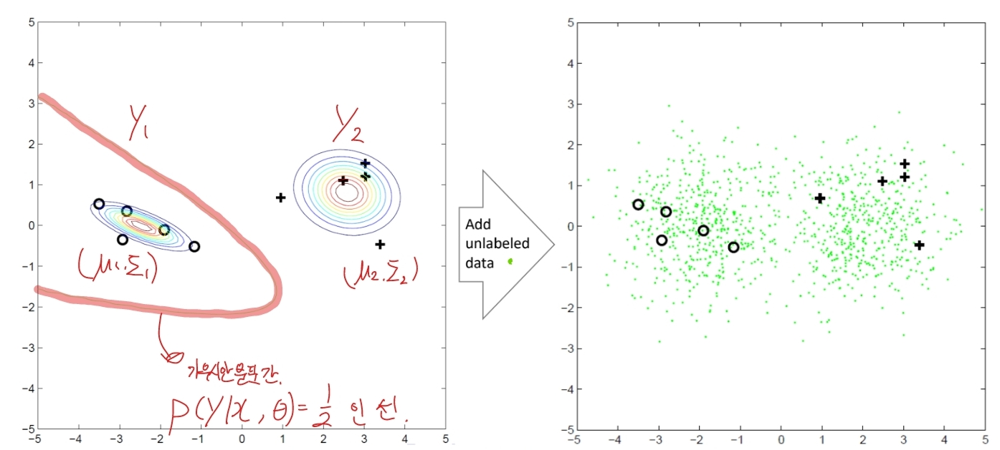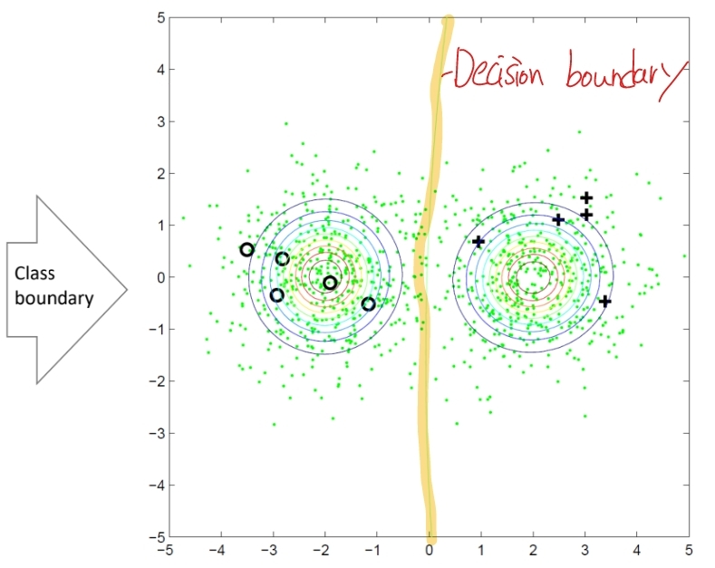
      
      - 위의 그림처럼 Unlabel 데이터를 추가하면 경계 분류면은 조정되어야 한다. 
        
        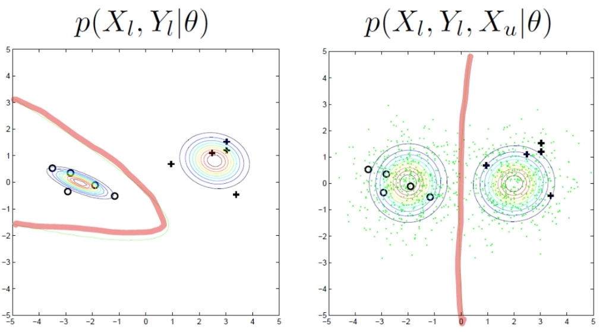
        
        > Unlabel 데이터가 추가되었으니 $X_u$를 같이 고려해야한다. 

###### **방향성**

- **목표 : 최대 우도법을 적용하여 $p(X_l, y_l, X_u|\theta)$ 값을 최대화하는 $\theta$ 를 찾는것.**
  
  - 현재 데이터 분포를 가장 잘 설명하는 파라미터 $\theta$ 를 알면 신빙성 있는 데이터를 생성할 수 있기 때문이다.  
  
  > $p(X_l, y_l, X_u|\theta) = \sum_{y_u} p(X_l, y_l, X_u, y_u|\theta)$ <mark>(1번식)</mark>

- 1번식에 최대우도법  적용 시, 
  
  > $p(X_l, y_l, X_u, \theta) = \sum_{i=1}^l logp(y_i|\theta)p(x_i|y_i, \theta)+$ <mark>$\sum_{i=l+1}^{l+u}log(\sum_{y=1}^2p(y|\theta)p(x_i|y,\theta))$</mark>
  > 
  > > since $p(X_l, y_l|\theta) = \sum_{i=1}^l logp(y_i|\theta)p(x_i|y_i, \theta)$, 하이라이트 친 부분이 Unlabel data로부터 나온 항목이다. 
  > > 
  > > 현재 y의 값이 1과 2로 구분되는 이진분류로, 추후 n까지 다진분류로 확장할 수 있다 . 위의 식은 y 값이 어떤 것이 나올지 모르니 어떤 값으로 나오든 포함할 수 있도록 식을 구성하였다. 
  
  - 이때, 하이라이트 된 부분을 통해 **Unlabel 데이터의 y값의 확률 값을 알아야 최적의 $\theta$를 알 수 있다.**

- **Gaussian Mixture Model의 파라미터는 EM 알고리즘 등 을 통해 구한다 .** 
  
  - EM 알고리즘은 하나의 사례로, 최대우도를 최대화하는 다른 방법들도 있음
    
    - > ex)- Variational approximation, direct optimization
  
  - E-Step : 현재 label 데이터로 구한 파라미터를 통해, unlable 샘플 $x_j$가 각 가우스 혼합 성분에 속할 확률($r_{ij}$)을 계산함   
    
    > $p(\theta =i |x) = \frac{\alpha_i * p(x|\mu_i, \sum_i)}{\sum_{i=1}^N \alpha_i * p(x|\mu_i, \sum_i)}$
    
    > $r_{ji} = \frac{\alpha_i *p(x_j|\mu_i, \sum_I)}{\sum_{i=1}^N \alpha_i * p(x_j | \mu_i, \sum_i)}$
  
  - M-step : $r_{ji}$ 에 기반해 모델 파라미터를 갱신한다. 
    
    > $\mu_i = \frac{1}{\sum_{x_j \in D_u} r_{ji} + l_i}(\sum_{x_j \in D_u} r_{ji} x_j + \sum_{(x_j, y_j) \in D_l \wedge y_j} x_j)$
    > 
    > $\sum_i = \frac{1}{\sum_{x_j \in D_u} r_{ji} + l_i}(\sum_{x_j \in D_u} r_{ji} (x_j-\mu_i)(x_j-\mu_i)^T + \sum_{(x_j, y_j) \in D_l \wedge y_j =i}(x_j-\mu_i)(x_j-\mu_i)^T)$
    > 
    > $\alpha_i = \frac{1}{m}(\sum_{x_j \in D_u} r_{ji} + l_i)$
    > 
    > 여기서 $l_i$는 i번째 클래스의 정답 데이터 샘플 수를 의미함 
  
  - 파라미터가 일정 이상 수렴할 때까지 EM 과정을 반복 수행함. 

**GMM을 통한 Generative 모델 장단점** 

- 장점 : 모델이 거의 정확하다면 매우 효율적일 수 있다.
  
  > 어떤 관점인지 확인 필요

- 단점 : 1) 종종 모델의 옳음 유무를 판단하기 어렵다. 2) 생성 모델이 잘못되었을 때 unlabel 데이터를 오분류 할 수 있다. 
  
  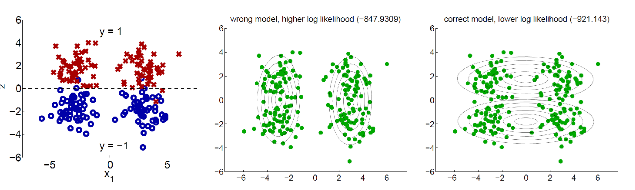
  
  > 가장 우측에 있는 분포가 맞으나, 좌측과 중간처럼 잘못 분류할 수 있다. 

--- 

### Deep Generative Model

###### **Variational Lower Bound**

- 생성 확률 모델 $p(X|\theta)$ 는 $\theta$ 값을 안다고 가정했을 때,  어떻게 X의 분포를 따르는 샘플을 생성할지 보여준다. 
  
  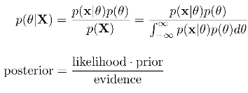
  
  > *분모의 X와 분자의 x는 동일해야 위의 식이 성립함.* 
  
  > $p(\theta|X) : $ 사후확률(Posterior). 데이터 X가 주어질 때 파라미터 $\theta$ 가 나올 확률 
  > 
  > $p(x|\theta) :$ 가능성(likelihood). 파라미터 $\theta$ 가 주어질 때 데이터 X가 생성될 확률 
  > 
  > $p(\theta) :$ 사전 확률(Prior). X값이 생성되기 전 $\theta$ 값이 독립적으로 나올 확률 
  > 
  > $p(X)= \int_{-\infin}^{\infin} p(X|\theta)p(\theta)d\theta = \int_{-\infin}^{\infin} p(X, \theta)d\theta$ : 정규화 상수( 또는 증거). 확률의 크기 조정 역할을 함. 모든 $\theta$ 값에 대한 X의 확률로, 모든 경우를 의미. 

- **목표는 사후확률 $p(\theta|X)$ 을 찾는 것**이다. 
  
  - 또는 $p(\theta|X)$를 통해 $p(X|\theta)$ 를 찾아 생성 모델을 만드는 것
  
  - 단, <u>지금으로썬 p(X)의 값을 구할 수 없다</u>. 
    
    - p(x)를 구하기 위해선 $\frac{x}{모든 x의 경우의 수}$ 를 알아야 하는데, 모든 경우의 수(분모)를 구할 수 없기 때문이다. 즉, 조건적으로만 확률을 구할 수 있지 독립적으로 확률을 구할 수 없다. 

- 해결책으로 $p(\theta|X)$를  아래 조건을 만족하는 $Q(\theta|X)$ 분포에 대해 근사시킨다. 
  
  - 1)$Q(\theta|X)$ 의 형태를 가정할 수 있어 계산과정이 상대적으로 빨라야 하며, 
    
    > Q. 형태를 가정할 수 있다는 게 어떤 의미일까?
  
  - 2)$Q(\theta|X)$ 는 $P(\theta|X)$ 와 유사해야 한다. 
    
    - 이 때 "유사성(closeness)" 정도를 측정하고자 KL divergence를 적용한다. 
      
      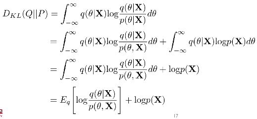
      
      > 첫번째 줄에서 두번째 줄 전개는 $p(\theta|X) = \frac{p(\theta, X)}{p(X)}$ 을 적용한 것
      > 
      > 두번째 줄에서 세번째 줄 전개는 $\int q(\theta|X) d\theta =1$ 을 적용한 것
    
    - KL-divergnce 식을 정리함으로써 아래의 부등식이 나온다. 
      
      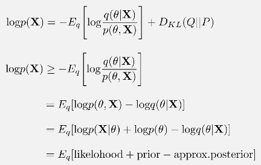
      
      > $D_{KL}(Q||P) >=0$
  
  - 즉, 앞서 구하지 못했던 $p(X)$는 <mark>ELBO$(E_q[likelihood + prior - approx.posterior])$</mark> 에 의해 **lower bound 되어 유추할 수 있다.** 
    
    - $logp(X)$의 값은 고정되어 있으므로, $D_{KL}(Q||P)$ 을 최소화하는 것은  ELBO를 최대화하는 것과 동일하다. 
      
      > $D_{KL}(Q||P)$ 의 값은 Q와 P가 유사할 수록 작아진다. 
    
    - 최대우도법은 데이터의 사전 정보(Prior) 을 반영하지 못해, 사후 확률의 값을 최대로 하는 파라미터를 찾고자 한다. 

**SSL에 사용된 초기 VAE(Variational Bayes) - M1 모델**

- 1단계 : label 데이터와 unlabel 데이터의 설명 변수(X)만 모아 잠재 변수(Z) 를 만든다. 
  
  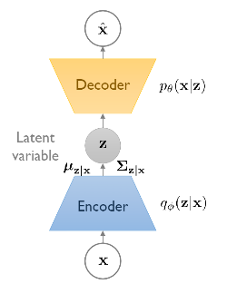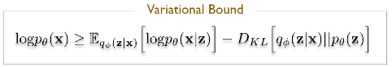
  
  이때 Variational bound에 우측 식을 성립함. (위의 식이 조금 이상한 듯 한데...)
  
  > Encoder(부호화) : X 값을 토대로 Z값 생성  
  > 
  > Decoder(복호화) : Z값을 토대로 $\hat X$ 값 생성  

- 2단계 : 잠재변수 Z와 라벨 Y를 묶어 지도학습을 통해 모델을 학습시킨다. 
  
  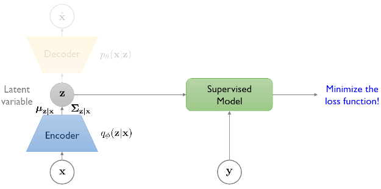

- 3단계 : 생성한 모델을 통해 Unlabel /Test 데이터의 레이블을 예측한다. 
  
  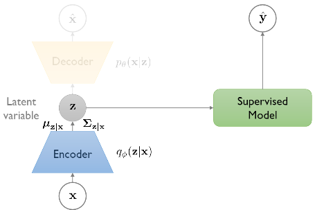
  
  - Q. 왜 중간에 Z값을 만들어서 평가하는 걸까? 
    
    - unlabel 데이터까지 같이 사용하면 성능이 향상되어서인가?

**VAE의 확장 - M2 Model** 

- M1 모델에선 label 데이터 y값을 모델 학습 간 사용하지 않는다. 이에 M2 모델에선  label 데이터 y값을 같이 고려하여 성능 향상시키고자 한다. 
  
  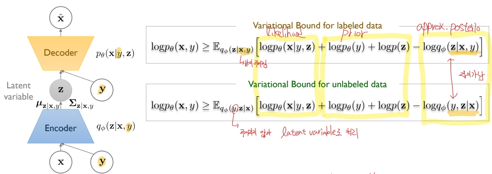
  
  > 이때 lable 데이터와 unlable 데이터 간에 세부 항목이 다름 
  > 
  > - lable 데이터는 y값이 주어지기 때문에 조건으로 같이 고려하면 되지만
  > 
  > - unlable 데이터는 그렇지 않아 잠재변수 Z 값을 통해 y 값을 추론해야함.  

- M1과 M2 모델을 결합한 M1 + M2 모델도 존재함. 
  
  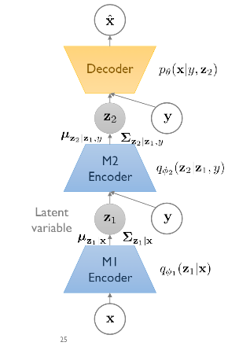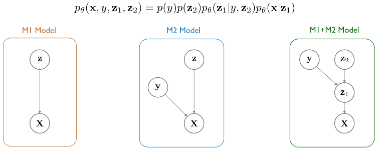

---

##### **UDA**(Unsupervised Data Augmentation) for Consistency Training

- 일반 이미지에 노이즈를 섞을 경우 사람은 영향을 거의 받지 않지만, 기계는 오류를 범하는 경우가 생긴다.
  
  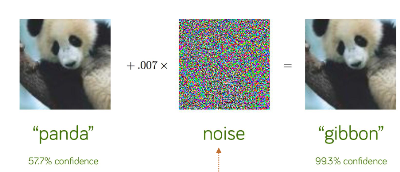

- 일관성 학습(Consistency Training)이란 모델 예측을 규제함으로써 작은 노이즈에 강건하게 만드는 것이다. 
  
  - augmentation 과정을 거치면 세부 정보가 바뀔 수 있음. 이는 noise가 추가된 것과 유사함.
  
  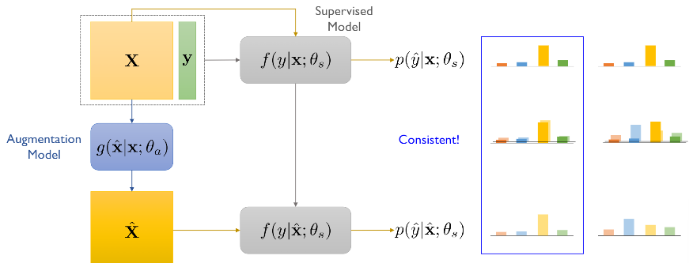
  
  - Augmentation 과정을 거친 것과 아닌 것의 결과에 일관성이 있어야한다.
  
  > $\theta_s$ : Supervised 모델의 파라미터
  > 
  > $\theta_a$ : Augmentation 모델의 파라미터

- UDA에선 일정한 augmentation 방식을 적용함으로써 SSL간 성능을 향상시킬 수 있음을 증명한다. 
  
  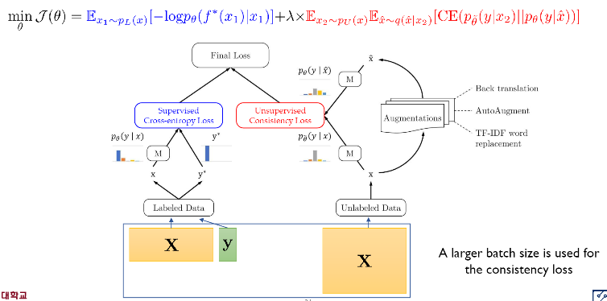
  
  - Label 데이터의 경우 최대한 정확한 Model을 생성하여 Cross Entropy loss 를 최소화해야 하며 
  
  - Unlable 데이터의 경우 augmentation 여부에 따라 예측값이 크게 바뀌어선 안된다. 

###### Augmentation 방법

- Back-translation for NLP 
  
  > ex)- 구글 번역기로 한글을 영어로 번역한 후 다시 한글로 번역하면 기존 문장의 의미와 유사하나 세부 사항은 다르게 나옴  

- Word replacing with TF-IDF 
  
  > 단어의 중요도를 TF-IDF로 계산한 후, 덜 중요한 요소를 유사한 의미의 다른 요소로 변경(ex- the > a )

- RandAugment 
  
  > 파이썬 이미지 처리 라이브러리 내 augmentation set으로부터 랜덤하게 추출 
