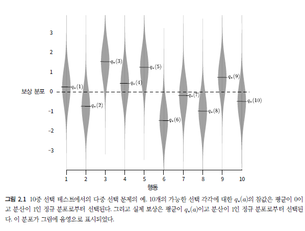
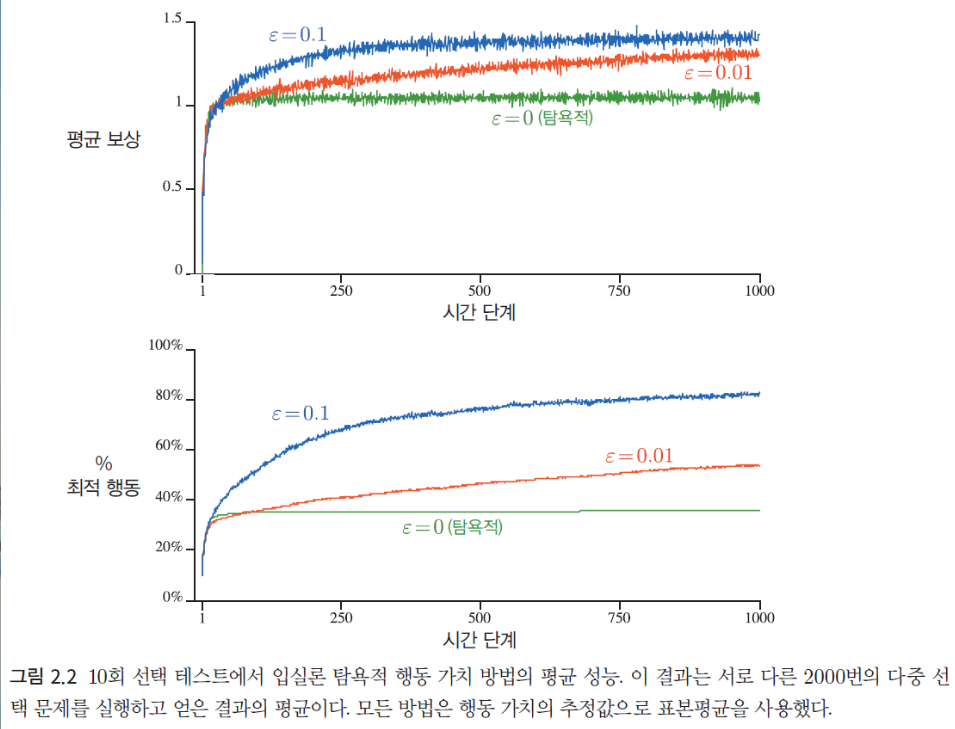
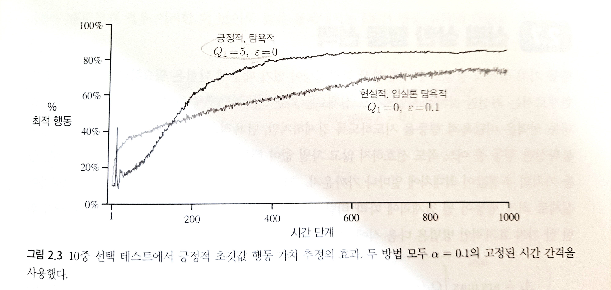
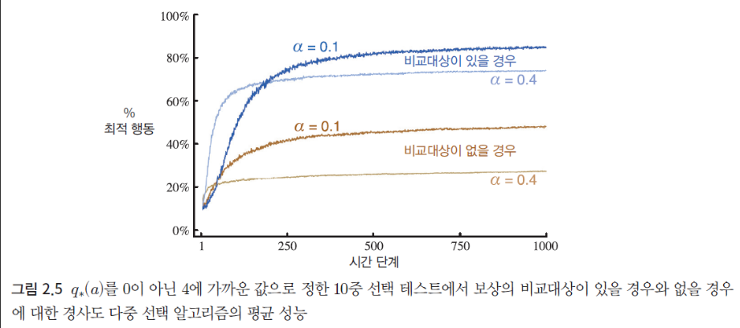
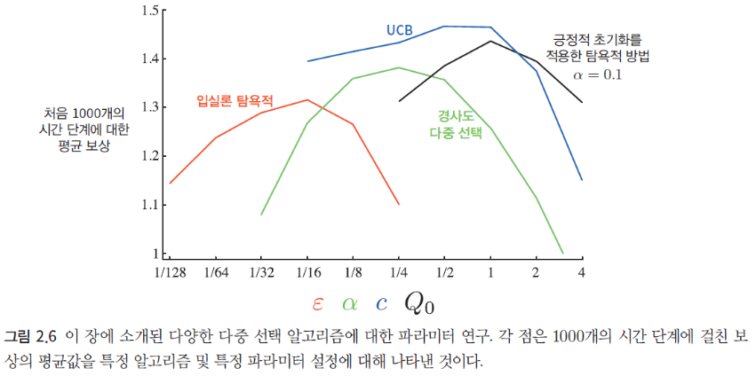

## Chapter 2 : 다중 선택

출처 : 단단한 강화학습 - Part 1 표 형태의 해법 속 챕터 2  

#### 

#### 서론

- 강화학습은 **지침**이 아닌, 행동을 **평가**하는 훈련 정보를 사용한다. 
  
  > 지침(Instruct) : 지금의 행동과는 상관없이 취해야 할 올바른 행동을 알려준다. 
  > 
  > 평가(Evalutate) : 지금의 행동이 얼마나 좋은지만 이야기한다. 
  
  - 평가적인 피드백은 <u>취해진 행동에 전적으로 의존</u>하는 반면, 지침적인 피드백은 취해진 행동과는 무관하게 이루어진다. 

- **전제**
  
  - 이번 장에서는 문제의 복잡성을 피하기 위해, **단순한 환경(비연합 구조)** 에서 강화학습의 평가적인 측면을 다룬다. 
    
    > 비연합(nonassociative) : 하나의 상황에 대해서만 행동을 학습한다. 즉, 이전, 이후 상황과 연관되어 있지 않다. 

-----

-----

### 다중 선택 문제(k-armed bandit problem)

1. <mark>k개의 서로 다른 옵션이나 행동 중 하나를 반복적으로 선택해야 할 때, </mark>

2. <mark>시간 간격동안 주어지는 보상의 총량에 대한 기댓값을 최대화하자! </mark>

###### 용어 정리

> 가치(value) : k개의 행동 각각에 기대할 수 있는 평균 보상값
> 
> $A_t$ : 시간 단계 t에서 선택되는 행동
> 
> $R_t$ : $A_t$에 따른 보상 
> 
> $q_*(a) =$ $E[R_t |A_t =a]$ : 행동 a가 선택되었을 때 얻는 보상의 기댓값
> 
> $Q_t(a) = $ 시간 단계 t에서 추정한 행동 a의 가치
> 
> 탐욕적(Greedy) 행동 : 각 시간 단계마다 최대의 가치를 갖는 행동
> 
> 활용(Exploiting) : 지금까지의 정보를 기반으로 탐욕적 행동을 하는 것 
> 
> 탐험(Exploring) : 탐욕적 행동이 아닌 다른 행동을 선택함으로써 비탐욕적 행동의 추정 가치를 상승시키는 것

###### 전제 및 바탕

- 행동의 가치를 추정할 수 있더라도 확실히 알지는 못한다.
  
  - 큰 수의 법칙에 따라 t가 증가함에 따라 추정값 $Q_t(a)$는 기댓값 $q_*(a)$ 에 수렴한다.  

- 하나의 행동을 선택할 때 활용과 탐험을 동시에 할 수 없다. 따라서 <u>활용과 탐험의 적절히 채택하는 것이 중요</u>하며, 이를 종종 활용과 탐험의 **갈등(conflict)** 로 지칭한다. 
  
  > 활용 : 지금 당장의 보상을 증가하나, 장기적인 관점에서 최적의 선택이 아닐 수 있음
  
  > 탐험 : 지금 보상이 좋지 않지만, 장기적으로 보다 최적의 선택을 찾는데 도움이 된다. 
  
  - 활용과 탐험 사이의 균형을 찾는 정교한 방법이 많이 있다. 하지만, 대부분 사전지식이 고정(정적)되어 있다 전제 아래에 가능하나, 이는 현실의 상황과 괴리가 있다. 

---

##### 행동 가치 방법

- 의미 : **행동의 가치를 추정하고 추정값으로부터 행동을 선택하도록 결정하는 방법**
  
  > 표본평균 방법 : $Q_t(a) = \frac{시간 t 이전에 취해지는 행동 a에 대한 보상의 합}{시각 t 이전에 행동 a를 취하는 횟수} = \frac{\sum^{t-1}_{i=1} R_i * 1|_{A_i =a}} {\sum^{t-1}_{i=1}  1|_{A_i =a}}$
  > 
  > $1|_{A_i=a}$ : $A_i = a$ 인 경우 1의 값을, 그 외에는 0의 값을 가짐. 

- **행동 선택 규칙** 
  
  - 탐욕적 방법 : 추정 가치가 최대인 행동 중 하나를 선택한다. 
    
    > $A_t = argmax_aQ_t(a)$
  
  - 입실론 탐욕적 방법 : 상대적 빈도수 $\epsilon$ 을 작은 값으로 유지하면서, 모든 행동을 대상으로 랜덤한 선택을 한다. 
    
    - 장점 : 단계의 개수가 무한으로 커지면 $Q_t(a)가 q_*(a)$로 수렴한다. 

##### 성능 검증 방법 - 10중 선택 테스트(10-armed testbed)

- 열 번의 선택을 하는 다중 선택 문제 2000개를 무작위로 생성한다. 

- 각 다중 선택 문제에 대한 행동 가치 $q_t(a)$ 는 평균이 0이고 분산이 1인 정규 분포로 부터 선택된다.  
  
  - 시간 단계 t에서 행동 $A_t$를 선택할 때, 실제 보상값 $R_t$ 은 평균이 $q_*(A_t)$ 이고 분산이 1인 정규 분포로부터 선택된다. 

- 
  
  - **탐욕적 방법**
    
    - 시작 직후에는 빠르게 성능 향상이 되나, 준최적(suboptimal) 행동을 수행하는 상황에 걸리기 때문에 장기적으로는 다른 방법보다 낮은 성능을 보인다.  
  
  - **입실론 탐욕적 방법** 
    
    - 최초에는 느릴지라도, 계속된 탐험을 통해 최적 행동을 식별할 확률을 증가시켰기 때문에 결국에는 더 좋은 성능을 보인다. 
    
    - $\epsilon$ 을 크게 잡으면 최적의 선택지를 빨리 알지만 지속적으로 $\epsilon$ 만큼 무작위 선택하여 손실이 있다.
    
    - 반대로 $\epsilon$을 작게 잡으면 최적의 선택지를 늦게 알지만, 무작위 선택으로 인한 손실이 적다.
  
  - => **보상의 분산이 작은 경우, 탐험의 중요성이 낮아져 탐욕적 방법이 더 좋다. 하지만 분산이 클 경우 입실론 탐욕적 방법이 더 좋다.** 

- 추가 고려점 
  
  - **분산이 적더라도, 다중 선택 문제가 비정상적이라면 탐험으로 큰 이득을 볼 수 있다.**
    
    > 비정상적(nonstationary) : 행동 가치의 참값이 시간에 따라 변한다. 
  
  - 또한 대부분의 강화학습에서는 비정상성인 경우가 많다. 

----

##### 점증적 구현

- 컴퓨터의 메모리 상 표본 평균이 구하기 어려운 경우, 점증적 구현을 적용한다. 

- 표본 평균으로 구한 가치 추정값 $Q_n$은 아래와 같다. 
  
  > $Q_n = \frac{R_1 + R_2 + ... + R_{n-1}}{n-1}$

- **점증적 구현을 통해 구한 $Q_n$ 은 아래와 같다.**
  
  > $Q_{n+1} = \frac{1}{n} \sum^n_{i=1} R_i$
  > 
  >             = $\frac{1}{n} [R_n + (n-1) * \frac{1}{n-1} \sum^{n-1}_{i=1} R_i ]$
  > 
  >             = $\frac{1}{n} [R_n + (n-1)Q_n$)]
  > 
  >             = $\frac{1}{n}[R_n + nQ_n - Q_n]$
  > 
  >             =<mark> $Q_n + \frac{1}{n} [R_n - Q_n]$</mark>
  
  > n=1 인 경우에는, $Q_1$에 상관없이 $Q_2$ = $R_1$이 된다.
  
  - 위의 식을 일반적으로 표현하면 다음과 같다. 
    
    > 새로운 추정값 <- 이전 추정값 + 시간 간격의 크기 [목푯값 - 이전 추정값]
    > 
    > 추정 오차(error) : 목푯값 - 이전 추정값

###### 비정상(nonstationary) 전제 하 점진적 구현

- 보상값의 확률 분포가 시간이 지남에 따라 변화하는 **'비정상 상황'** 속에선 최근의 보상에 더 큰 가중치를 주고, 오래된 보상일수록 낮은 가중치를 주는 것이 타장당하다. 

- 또한 점증적 계산 방법에서 $\frac{1}{n}$ 로 사용된 <u>'시간 간격의 크기'</u>는 사실 시간 단계마다 다를 수 있다. 
  
  >  $\alpha$ : 시간 간격의 크기가 고정인 경우
  > 
  >  $\alpha_t(a)$ : 시간 간격의 크기가 변동되는 경우 

- **기하급수적 최신 가중 평균** 
  
  * 시간 간격의 크기 $\alpha \in (0,1]$ 에 속한다 가정했을 때의 점진적 구현
  
  > $Q_{n+1} = Q_n + \alpha[R_n - Q_n]$
  > 
  >             = $\alpha R_n + (1-a)Q_n$ 
  > 
  >             = $\alpha R_n + (1-\alpha)\alpha R_{n-1} +(1-\alpha)^2\alpha R_{n-2} $
  > 
  >                 $ ... + (1-\alpha)^{n-1}\alpha R_1 + (1-\alpha)^n Q_1$
  > 
  >             = $(1-\alpha)^nQ_1 + \sum^n_{i=1} \alpha(1-\alpha)^{n-i} R_i$
  
  > 가중치의 합은 "$(1-\alpha)^n + \sum^n_{i=1} \alpha(1-\alpha)^{n-i}$  =1" 을 만족한다.   

- 또는 $\alpha_n(a)$ 을 적용할 수 있다. 단, **$\sum \alpha_n(a) =1$ 을 보장하기 위해서 아래 조건을 만족시켜야 한다.** 
  
  1. $\sum^\infin_{n=1} \alpha_n(a) = \infin$  
     
     > 어떠한 초기 조건이나 확률적 변동성(random fluctuation)도 극복할 만큼 충분히 큰 시간 간격을 보장하기 위함.  
  
  2. $\sum^{\infin}_{n=1} \alpha^2_n(a) < \infin$
     
     > 시간 간격이 감소하여 결국에는 수렴성을 확신할 만큼 충분히 작아질 것을 보장하기 위함. 
  - => 위의 조건으로 비춰볼때, $\alpha_n(a) = \alpha$ 을 적용하면 조건 2를 만족하지 못한다. 
    
    - 이는 <u>추정값이 결코 완전히 수렴하지 않고 가장 최근에 받은 보상에 반응하여 연속적으로 변한다는 것을 의미</u>한다. 
  
  - 단, 강화학습에 있어 **비정상적인 상황이 매우 많기 때문에**, 위와 같이 <u>확률의 수렴 조건은 실제 문제에 적용하거나 실증적 연구를 수행할 때에는 거의 사용되지 않는다</u>.

---

#### 긍정적 초기값

- 앞서 제시된 방법은 모두 초기 추정값 $Q_1(a)$에 어느 정도 영향을 받았다(편중되어 있다). 
  
  - 표본 평균 방법에서는 모든 행동이 최소 한 번이라도 선택되고 나면 이 편차는 사라진다. 
  
  - 하지만 <u>고정된 $\alpha$ 값을 이용하는 방법에서는 편차가 줄어들지만 끊임없이 영향력을 가진다. </u>

- => 즉, **초기값에 편중되는 현상**을 이용하여, **긍정적 초기값을 설정하여 성능을 향상**시킬 수 있다. 
  
  
  
  - ex)- 초기값을 높게 잡는다면, 대다수의 경우에서 보상에 실망하여 탐험을 하도록 촉진시킬 수 있다. 
    
    - 초기에는 탐험을 많이하여 더 나쁜 결과를 보이지만, 장기적으로는 더 좋은 성능을 보여준다. 

- 단, <u>위의 방식은 정상적 문제에는 꽤 효과적이나, 비정상적 문제에는 적합하지 않다. </u>
  
  - 시간의 흐름에 따라 보상 값이 바뀌는 상황 속에서 초기 조건에 너무 많이 초점을 두면 성능을 악화할 수 있다. 
  
  - 그럼에도, 이 간단한 **긍정적 초기값 설정 방법은 다른 방법과 조합했을 때 적합한 경우가 종종 있어 사용될 수 있다**.  

---

#### 신뢰 상한 행동 선택

- 행동 가치 추정의 정밀도에 대해 항상 불확실성이 있기 때문에 탐험은 필요하다. 

- 그렇다면 <u>행동 가치의 추정값이 최대치에 얼마나 가까운지, 그리고 추정의 불확실성이 얼마인지를 고려</u>하여 **최적 행동이 될 잠재력에 따라 탐험하면 성능이 향상될 것**이다. 

- <mark>신뢰상한(**U**pper **C**onfidnce **B**ound) : $A_t = argmax_a[Q_t(a) + c \sqrt{\frac{lnt}{N_t(a)}}]$</mark>
  
  > 제곱근 항을 통해 행동 a의 가치에 대한 추정값의 불확실성 또는 편차를 고려한다.
  > 
  > $N_t(a) :$ t 시간 이전에 행동 a가 선택된 횟수. 행동 a가 선택될수록 불확실성이 줄어든다. 
  > 
  > - $N_t(a) =0$ 이라면, a는 $A_t$의 값을 최대화하는 행동이다. 
  > 
  > c >0 : 탐험의 정도를 조절. 상한의 신뢰 수준을 결정한다.
  > 
  >  $A_t$의 최댓값은 행동 a의 진짜 가치로서 가능한 값들에 대한 일종의 상한이 된다. 
  > 
  > 자연로그를 사용하여, 증가량이 시간에 따라 감소하지만 계속 증가함을 표현
  
  - <u>결국 모든 행동이 선택되지만 더 작은 가치 추정값을 갖는 행동이나 이미 자주 선택된 행동은 시간에 따라 선택되는 빈도수가 작아질 것이다.</u> 

- 10중 선택 테스트에서 일반적으로 UCB는 입실론 탐욕적 방법보다 좋은 성능을 낸다. 

- 하지만 일반적인 강화학습 문제로 확장하여 적용하는 데 있어서는 입실론 탐욕적 방법보다 더 어렵다. 

---

#### 경사도 다중 선택 알고리즘 (Descent Algorithm)

- 행동 a에 대한 수치적 선호도($H_t(a))$를 학습한다! 

- <u>선호도가 클수록 그 행동이 더 자주 선택되지만, 선호도를 보상과 같은 것으로 보지 않는다</u>. 
  
  - 한 행동이 다른 행동에 대해 갖는 **상대적 선호도**만이 중요하다. 

- <mark>a 행동이 선택될 확률 : Pr{$A_t=a$} = $\frac{E^{H_t(a)}}{\sum^k_{b=1} e^{H_t(b)} } = \pi_t(a) $</mark>
  
  > $\pi_t(a) :$ 시각 t에 행동 a를 선택할 확률 

- **확률론적 경사도(Stochastic Gradient Descent) 증가 개념 활용 알고리즘**
  
  - <mark>$H_{t+1}(A_t) = H_t(A_t) + \alpha(R_t-\bar R_t)(1-\pi_t(A_t))$ </mark>
  
  - & (모든 a $\neq A_t 에 대해) $<mark> $H_{t+1}(a) = H_t(a) - \alpha(R_t - \bar R_t)\pi_t(a) $</mark>
    
    > $\alpha >0 :$ 시간 간격의 크기를 나타내는 파라미터 
    > 
    > $\bar R_t \in R$ : 시각 t까지의 모든 보상에 대한 평균. 현재 보상과 비교할 비교대상이 된다. 
  
  - 보상이 이 값보다 크면 미래에 $A_t$를 선택할 확률은 증가하고, 보상이 이 값보다 작으면 그 확률은 감소한다. 선택되지 않은 행동에 대한 확률은 반대로 움직인다. 

- 경사도 다중 선택 알고리즘에선 <u>'상대적 선호도'만을 고려</u>하기에, 모든 보상의 값이 증가하면 비교대상 또한 증가하기에 결과에 차이가 없다. 

- 하지만 <u>보상의 비교대상이 누락이 되면(<=> $\bar R_t$ =0), 성능이 상당히 저하</u>한다.

### 요약

- **각 방법론 특징**
  
  - 입실론 탐욕적 방법 : $\epsilon$ 만큼 무작위로 선택
  
  - 경사도 다중 알고리즘 : 행동의 선호도를 추정 및 확률화하여 행동 선택
  
  - UCB : 결정론적 방법으로 행동을 선택하나, 표본의 수가 적은 행동을 선호하게 만들어 탐험 진행

- **각 방법론 성능** 

- 모든 알고리즘의 성능은 중간 정도의 파라미터에서 최고의 성능을 보여준다. 

- 평가 방법은 1) 최선의 파라미터 설정값 사용시 성능과, 2) 파라미터 민감도 를 함께 평가해야 한다. 
  
  - 이번 장에서 설명한 모든 방법은 파라미터 민감도가 낮은 편이다
  
  - 따라서 UCB가 전반적인 상황에서 성능이 좋은 것처럼 보인다. 
