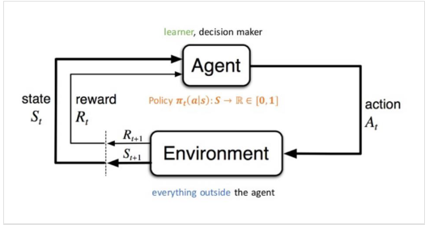
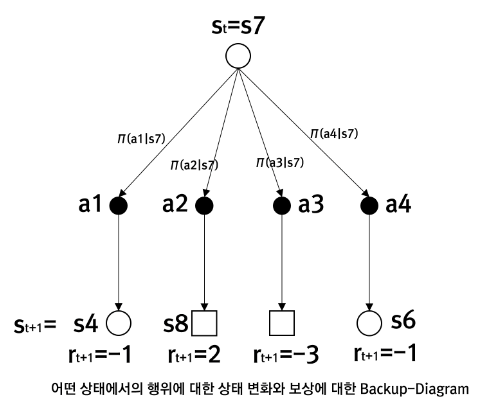
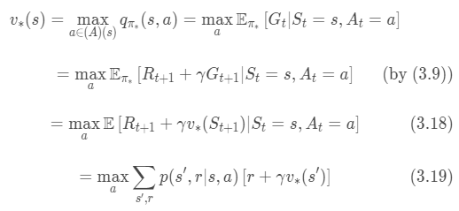
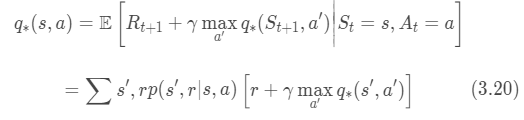
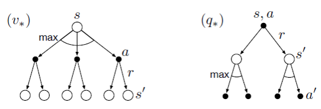

## Chapter 3 : 유한 마르코프 결정 과정(Finite Markow decision Process)

출처 : 단단한 강화학습 - Part 1 표 형태의 해법 속 챕터 3

#### 서론

- 강화학습의 구성이<u> 잘 정의된 전이 확률로 표현</u>될 때, **마르코프 결정 과정**(MDP)라고 한다.
  
  - MDP에서는 각 상태 s에 있는 각 행동 a에 대한 $q_*(s,a)$ 를 추정하거나 최적의 행동 선택을 가정한 채로 각 상태의 가치 $v_*(s)$ 를 추정한다. 
  
  - 또한 MDP는 지연된 보상을 포함하여, 지연된 보상과 즉각적인 보상 사이에서 균형을 잡고자 한다. 

- MDP는 강화학습 문제를 이론적으로 정교하게 설명할 수 있도록 해주는 이상적인 수학적 형태이다. 

- 유한 MDP는 유한한 상태, 행동 보상의 집합을 갖는 MDP를 의미한다. 

----

---

##### 에이전트-환경 인터페이스

- ###### 용어
  
  > 에어전트(Agent) : 학습자와 의사결정자 
  > 
  > - 에이전트는 행동을 선택한다. 
  > 
  > 환경(Environment) : 에이전트와 상호작용하는 에이전트 이외의 모든 것 
  > 
  > - 환경은 에이전트의 행동에 반응하여 새로운 환경과 보상을 제공한다. 

- 모든 시간 단계 t에서 에이전트는 환경의 상태(State) $S_t \in S$ 를 나타내는 어떤 것을 받으며, 이를 기반으로 행동(Action) $A_t \in A(s)$ 을 선택한다. 

- 시간 단계 t+1 에서 에어전트는 부분적으로는 이전 행동의 결과로서 숫자로 된 보상(Reward) $R_{T+1} \in R$ 을 받고 스스로가 새로운 상태 $S_{t+1}$ 에 있다고 인식한다. 
  
  - 그 결과 MDP와 에이전트는 다음과 같은 궤적(trajectory)을 만들어 낸다. 
    
    > $S_0, A_0, R_1, S_1, A_1, R_2, S_2, A_2, R_3 ...$

- <mark>$p(s', r |s,a) = Pr(S_t=s', R_T =r|S_{t-1}=s, A_{t-1} =a)$</mark>
  
  > 모든 $s \in S, a \in A(s)$ 에 대해 $\sum_{s' \in S}\sum_{r \in R}p(s',r|s,a) =1$
  
  - 함수 p는 MDP의 동역학을 정의하며, 4개의 변수(s', r, s,a) 로 정해지는 결정론적 함수다.
  
  - <u>$S_t, R_T$ 각각이 어떤 값을 가질 확률은 바로 직전 상태와 행동인 $S_{t-1}, A_{t-1} $ 에만 의존하며, 그 이전(t-2)의 상태와 행동에는 전혀 영향을 받지 않는다. </u>
    
    - 상태는 과거의 모든 에이전트-환경 상호작용에 대한 정보를 포함해야 한다. (상태에 대한 제약)
  
  - 이와 같은 조건을 만족하는 상태는 <mark>마르코프 특성(Markow property)</mark>을 가졌다고 한다. 

- ###### 추가 관련 함수
  
  > 상태 전이 확률 (State-transition probability) : $p(s'|s,a) = Pr(S_t = s' | S_{t-1}=s, A_{t-1}=a) = \sum_{r\in R}p(s',r|s,a)$
  > 
  > 보상의 기댓값 : $r(s,a) = E[R_t|S_{t-1} =s , A_{t-1} =a] = \sum_{r \in R} r \sum_{s' \in S} p(s',r|s,a)$
  > 
  > '상태-행동-다음 상태' 에 대한 보상의 기댓값 : $r(s,a,s') = E[R_t| S_{t-1}=s, A_{t-1}=a, S_t=s'] = \sum_{r \in R} r \frac{p(s', r|s,a)}{p(s'|s,a)}$

- MDP 구조는 목표 지향적인 상호작용으로부터의 학습 문제를 상당히 추상화한 것이다.
  
  - 목표 지향적인 행동을 학습하는 문제는 에이전트와 환경 사이에서 움직이는 3가지 신호(a,r,s)로 축약할 수 있다.
  
  - 시간 단계가 유동적이여도 된다. 
  
  - 에이전트와 환경에 대한 경계를 비교적 자유롭게 잡을 수 있다. 
    
    - 일반적인 규칙은 에이전트에 의해 임의로 변경될 수 없는 모든 것은 에이전트 밖에 있다고 간주한다. 
    
    - 보상을 계산하는 일은 항상 에이전트 밖에서 이루어진다. (에이전트가 개입되면 안되기 때문)
    
    - => 에이전트 - 환경 경계는 에이전트의 지식을 제한하기보다는 <u>에이전트의 '절대적 제어'의 한계</u>를 나타낸다. 

----

##### 목표와 보상

- 에이전트의 목표는 <u>장기적으로 자신이 받는 보상의 총합을 최대화하는 것</u>이다 **(보상가설)**
  
  - 즉, 보상은 곧 이루고자 하는 목표를 나타낸다. 
  
  - 단, 보상은 에이전트에게 '무엇을' 이루어야 하는지를 알려주는 방법이지, 그것을 '어떻게' 이루어야 하는지를 알려주는 것은 아니다. 
    
    - ex)- 목표를 이루기 위한 중간 단계에도 보상을 설정한다면, 에이전트는 중간 단계만 빠르게 반복할 수도 있다. 

---

##### 보상과 에피소드

- 에이전트는 일반적으로 **기대되는 이득(expected return  - Gain)** 을 최대화하고자 한다. 
  
  > $G_t = R_{t+1} + R_{t+2} + R_{t+3} ... R_T$
  > 
  > T : 최종 시간 단계.

- 에이전트 - 환경 상호작용이 종단 상태(Terminal State)이 있는 에피소드(Episode)로 구성되어 있을 때, 최종 시간 단계 T가 생긴다. 
  
  - 각 에피소드는 이전 에피소드가 종료된 방식과는 상관없이 독립적으로 시작한다. 
    
    - 종단 시각 T는 보통 에피소드마다 다른 값을 갖는 확률변수다. 
  
  - 이러한 종류의 에피소드를 다루는 작업을 <u>에피소딕 작업</u>  이라고 한다. 
  
  - 때론 모든 비종단(notterminal) 상태 S를 모든 상태와 종단 상태의 합 $S^+$ 와 구분할 필요가 있다. 

- 반면 많은 경우에 있어 에이전트-환경 상호작용은 식별 가능한 에피소드로 자연스럽게 나누어지지 않고 한계 없이 계속 이어진다. **(연속적인 작업)**
  
  - 이런 경우 매 순간의 보상을 합할 경우 이득이 $\infin$ 로 수렴하여, **할인(discounting)** 개념이 필요하다. 
  
  - 에이전트는 할인된 이득의 기댓값을 최대화하기 위해 $A_t$ 를 선택한다. 
    
    > <mark>$G_t = R_{t+1} + \gamma R_{t+2} + \gamma^2 R_{t+3} + ... = \sum^\infin_{k=0} \gamma^K R_{t+k+1} $</mark>
    > 
    > <=> $G_t = $ $R_{t+1} + \gamma [R_{t+2} + \gamma R_{t+3} + ... ] = R_{t+1} + \gamma G_{t+1}$
    > 
    > $\gamma :$ 할인율. 0 <= $\gamma$ <=1 의 범위를 가짐. 
  
  - 할인율은 미래 보상의 현재 가치를 결정한다. 

---

###### 에피소딕 작업과 연속적인 작업을 위한 통합 표기법

> $G_t = \sum^T_{k=t+1} \gamma^{k-t-1} R_k$ 

- T = $\infin$ 의 경우, $\gamma$ =1 이 될 가능성을 고려한 표기법 

##### 

---

---

##### 정책과 가치 함수 - Monte Carlo Method

- ###### 용어
  
  > **정책($\pi(a|s)$)** : 상태로부터 각각의 가능한 행동을 선택하는 확률로 대응되는 관계
  > 
  > > $\pi(a|s)$ : $S_t =s$ 일 경우 $A_t=a$ 일 확률

> **(상태) 가치 함수** : 에이전트가 주어진 상태에 있는 것이 '얼마나 좋은가'를 추정하는 상태의 함수 
> 
> - 가치 함수($v_\pi(s)$) 는 상태 s에서 시작한 이후로 정책 $\pi$을 따랐을 경우 얻게 되는 이득의 기댓값이다.
> 
> > 모든 $s \in S$ 에 대해 <mark>$v_\pi(s) = E_\pi[G_t | S_t =s] = E_\pi[\sum^\infin_{k=0} \gamma^K R_{t+k+1}| S_t =s ]$</mark>

> **(행동) 가치 함수** : 에이전트가 주어진 상태에서 어떤 행동을 하는 것이 좋은가를 추정하는 가치 함수
> 
> - $q_\pi(s,a)$ 를 정책 $\pi$  아래에서, 상태 s에서 행동 a를 취할 때의  이득의 기댓값으로 정의한다. 
> 
> > 모든 $s \in S$ 에 대해 <mark>$q_\pi(s,a) = E_\pi[G_t|S_t = s, A_t =a] = E_\pi[\sum^\infin_{k=0} \gamma^k R_{t+k+1} | S_t =s, A_t =a]$</mark>

- 가치 함수의 근본적인 특성은 <u>재귀적인 관계식</u>을 만족한다는 것이다. 
  
  > 모든 s $\in S$ 에 대해, 
  > 
  > $v_\pi(s) = E_\pi[G_t|S_t=s]$
  > 
  >             $ = E_\pi[R_{t+1} + \gamma G_{t+1} | S_t =s]$
  > 
  >             $ = \sum_a \pi(a|s) \sum_{s'} \sum_{r} p(s',r|s,a) [r+\gamma E_\pi[G_{t+1}|S_{t+1}=s']]$
  > 
  >            <mark> $ = \sum_a\pi(a|s) \sum_{s', r} p(s', r|s,a)[r+\gamma v_{\pi}(s')]$ </mark>**(벨만 방정식)**
  > 
  > **벨만 방정식** : 현재 상태의 가치 함수와 다음 타임 상태의 가치 함수의 관계식
  > 
  > *$\pi(a|s) * p(s',r|s,a)$  : 상태 s일 때 새로운 상태 s'와 r가 주어질 확률 
  
  - 가치 함수 $v_\pi$ 는 벨만 방정식의 유일한 해다. 

- **보강 다이어그램**
  
         h
  
  - 최상위에 있는 루트 노드인 상태 s로 시작하여 에이젠트는 정책 $\pi$ 에 따라 주어진 행동 중 어떤 것이라도 취할 수 있다. 각각에 행동에 대해 환경이 반응하여 다음 상태 s'와 보상 r이 함께 도출된다.  
    
    > 빈 원 : 상태를 의미 
    > 
    > t검은 원 : 상태 - 행동 쌍 을 의미

---

##### 최적 정책과 최적 가치 함수

- 모든 상태에 대한 이득의 기댓값이 정책 $\pi'$ 에서보다 정책 $\pi$에서 더 크거나 같다면, 정책 $\pi$가 더 좋은 것으로 정의된다. 
  
  > <=> 모든 $s \in S$에 대해 $v_\pi(s) >= v_{\pi'}(s)$ 일때만 $\pi >= \pi'$ 이다. 

- ###### 용어
  
  > **최적 정책**(Optimal Policy - $\pi_*$) : 다른 모든 정책보다 좋거나 아니면 같은 수준인 정책. 항상 하나 이상 존재 
  > 
  > **최적 상태 가치 함수**(Optimal state-value function - $v_*$) : 최적 정책이 갖는 상태 가치 함수 
  > 
  > > $v_*(s) = max_\pi v_\pi(s)$ for $\forall s \in S$
  > 
  > **최적 행동 가치 함수**(Optimal action-value function - $q_*$) : 최적 정책이 갖는 행동 가치 함수 
  > 
  > > $q_*(s,a) = max_\pi q_\pi(s,a)$ for $\forall s \in S$
  
  - =><mark> $q_*(s,a) = E[R_{t+1} + \gamma v_*(S_{t+1}) | S_t =s, A_T =a]$</mark>

- $v_*$ 는 정책에 대한 가치 함수로, **자기일관성 조건을 만족해야 한다.** 
  
  > 자기일관성 : 최정 정책을 따르는 상태의 가치는 그 상태에서 선택할 수 있는 가장 좋은 행동으로부터 나오는 이득의 기댓값과 같아야 한다. 
  > 
  > 
  > 
  > 
  > 
  > 
  > 
  > - 각 주어진 정책에 대
  > - 해서 가치의 기댓값이 아닌 **최대값**을 적용함. 이를 명시하기 위해 에이전트의 선택 지점에 호(arc) 표시를 추가함. 

- 최적 벨만 방정식을 해석적으로 푸는 것은 최적 정책을 찾는 하나의 방법으로, 강화학습 문제를 푸는 방법이다.
  
  - $v_*$ 를 구하면 최적 정책을 구하는 것은 상대적으로 쉽다. 
    
    - 각 상태 s에 대해서 최적 벨만 방정식의 가치 함수가 최댓값이 되도록 하는 행동이 하나 이상 존재할 것이다. 
    
    - 이러한 행동에 대해서 0이 아닌 확률을 부여하는 정책은 그 무엇이든 최적 정책이 된다. (최대 기댓값이 아닌, 해당 값이 최대이면 됨)
    
    - $v_*$에 이미 미래에 일어날 수 있는 모든 행동이 보상 결과가 반영되어 있기 때문에, $v_*$ 에 대해 탐욕적인(Greedy) 한 정책은 장기적으로 최적의 결과를 보장한다.
  
  - $q_*$ 를 알면 에이전트는 모든 상태에서 $q_*(s,a)$ 를 최대로 만드는 행동을 간단하게 찾을 수 있다. 

- 하지만 <u>실생활에는 적용하기 어려운 가정을 전제</u>로 하여, 직접적으로는 거의 쓸모가 없다. 
  
  - (1) 환경의 동역학을 정확히 알고 있다. (에이전트가 완전한 지식을 갖고 있다)
  
  - (2) 해의 계산을 완료하기 위한 충분한 계산 능력을 확보하고 있다. 
  
  - (3) 마르코프 성질을 가정한다. 

---

##### 최적성과 근사

- 잘 정의된 최적성 개념은 강화학습 방법론에 대한 접근방식을 결정하며, 다양한 학습 알고리즘의 이론적 특성을 이해할 방법을 제공한다. 

- 하지만, 실제 상황에 적용하기 위해선 다양한 수준에서 **근삿값**을 구할 수 있을 뿐이다. 
  
  - <mark>압도적인 계산 양</mark>으로 인해, 환경의 동역학에 대한 정확하고 완전한 모델이 있다 하더라도 최적 벨만 방정식을 풀어서 간단하게 최적 정책을 결정하는 것은 보통은 불가능하다. 
  
  - <mark>가용 메모리 용량 한계</mark>로, 얼마 되지 않는 제한된 크기의 상태 집합(표 형태로 된 경우)로만 한시적으로 계산할 수 있다. 이로 인해 수많은 상태를 단순하고 근사적으로 표현해야 한다.  
  
  - => **강화학습의 큰 제약 중 하나는 '계산 가용성'이며, 이에 대한 해결책으로 근사를 활용한다.** 
