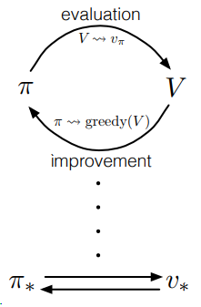
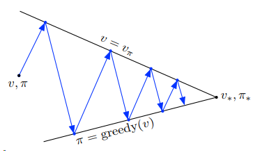

### Chapter 4 : 동적 프로그래밍(Dynamic Program)

출처 : 단단한 강화학습 - Part 1 표 형태의 해법 속 챕터 4

##### 서론

- <mark>동적 프로그래밍</mark>(DP)란, <u>마르코프 결정과정(MDP) 같은 환경 모델이 완벽하게 주어졌을 때</u> **최적 정책을 계산하기 위해 사용될 수 있는 일군의 알고리즘**을 가리킨다. 

- DP의 핵심 개념, 일반적으로는 강화학습의 핵심 개념은 **좋은 정책을 찾는 과정을 체계적으로 구조화하기 위해** **가치 함수를 사용한다.** 
  
  - 최적 가치 함수 $v_*$ 또는 $q_*$ 를 구하고 나면 최적 정책은 쉽게 구할 수 있다. 
  
  > $v_*(s) = max_a E[R_{t+1} + \gamma v_*(s)(S_{t+1})|S_t=s, A_t=a ] $
  > 
  >             $= max_a \sum_{s',r} p(s',r|s,a)[r+\gamma v_*(s')]$
  
  > $q_*(s,a) = E[R_{t+1} + \gamma max_{a'} q_*(S_{t+1}, a') | S_t=s, A_t=a]$
  > 
  >                 $= \sum_{s', r} p(s',r|s,a)[r+\gamma max_{a'} q_*(s',a')$
  
  - 각 $v_*(s), q_*(s,a)$ 는 최적 벨만 방정식을 만족한다. 
  
  - 벨만 방정식을 목표 가치 함수에 대한 근사를 향상시키기 갱신 규칙으로 변환함으로써 DP 알고리즘을 얻을 수 있다. 

---

---

##### 정책 평가(예측)

- ###### 용어
  
  > **정책평가**(Policy evaluation) 또는 **예측 문제**(Prediction Problem) : 임의의 정책 $\pi$에 대해 상태 가치 함수 $v_\pi$를 계산하는 것 
  > 
  > **반복 정책 평가**(Iterative policy evaluation) : 갱신 횟수 k을 $\infin$ 까지 보냄으로서 $v_k$가 최적 정책 가치함수  $v_\pi$ 에 수렴하도록 하는 알고리즘
  > 
  > **기댓값 갱신** : 이전 가치와 즉각적인 보상의 기댓값을 이용하여 새로운 가치를 구하는 것 
  > 
  > - 상태, 상태-행동 쌍의 갱신 여부나 이후 상태들의 기대 가치가 결합되는 방법에 따라 다양한 종류의 기댓값 갱신이 있음. 
  > 
  > - 갱신은 상태 공간에 대해 일괄처리하는 방식으로 이뤄진다. 

- 가치 함수 $v_*(s)$ 에 대해서 벨만 방정식이 성립한다. 
  
  > 모든 $s \in S$ 에 대해,
  > 
  > $v_\pi(s) = E_\pi[G_t|S_t=s]$ 
  > 
  > $             = E_\pi[R_{t+1} + \gamma G_{t+1} | S_t =s]$
  > 
  > $             = \sum_a \pi(a|s) \sum_{s'} \sum_{r} p(s',r|s,a) [r+\gamma E_\pi[G_{t+1}|S_{t+1}=s']]$
  > 
  > $             = \sum_a\pi(a|s) \sum_{s', r} p(s', r|s,a)[r+\gamma v_{\pi}(s')]$ **(벨만 방정식)**

- 벨만 방정식을 갱신 규칙으로 하여 모든 $s \in S$에 대해 다음과 같이 구한다.
  
  > <=> <mark>$v_{k+1}(s)$</mark> = $E_\pi [R_{t+1} + \gamma v_k(S_{t+1})|S_t=s] $
  > 
  >                       $= \sum_a \pi(a|s) \sum_{s',r} p(s',r|s,a)[r+\gamma$ <mark>$v_k(s')$</mark>]
  
  - $v_\pi$ 의 존재와 유일성(Uniqueness)은 둘 중 한 조건을 성립한다면 성립한다.
    
    - (1) $\gamma <1$을 만족하거나, 
    
    - (2)정책 $\pi$ 를 따르는 모든 상태가 종국적으로 더 이상 변하지 않는 상태에 도달하는 것이 보장한다. 
  
  - 환경의 동역학을 완전히 안다면, **벨만 방정식은 집합 |S|의 원소 개수만큼의 미지수($v_\pi(s), s \in S)$)를 갖는 선형 연립 방정식**이 된다. 
    
    - 이때 방정식의 개수도 집합 |S|의 원소 개수와 같다. 
    
    - $\pi(a|s), p(s',r|s,a)$ 을 모두 계산할 수 있으니, 미지수 s에 대해 변하는 선형 연립 방정식이 된다.  

---

##### 정책 향상

- **정책 향상 정리** : <u>상태 s에서 행동 a를 선택했을 때의 가치($q_\pi(s,a)$)가  $v_\pi(s)$ 보다 클 때</u>, a를 선택하는 새로운 정책 $\pi'$ 가 더 좋은 선택이며 더 좋은 결과를 가져올 것이다. 
  
  - 임의의 결정론적 정책 $\pi$ 와 $\pi'$ 가 아래를 성립한다면, 정책 $\pi'$ 는 $\pi$ 만큼 좋거나 그 이상 좋다고 한다. 
  
  >  $q_\pi(s,\pi'(s)) >= v_\pi(s)$ for $\forall s \in S$ <mark>[부등식 1]</mark>
  
  - 만약 임의의 상태 s에서 위의 부등식을 만족할 경우, 최소한 하나의 상태는 아래 식을 만족해야 한다. 
  
  >  $v_\pi'(s) >= v_\pi(S)$ 
  
  - 이때 변경된 정책 $\pi'$ 는 $\pi'(s)=a \neq \pi(s)$ 외에는 모두 동일한 정책이다. 

- **정책 향상** : <u>기존 정책의 가치에 대해 탐욕적이 되게 함으로써</u> 기존 정책을 능가하는 새로운 정책을 만드는 과정
  
  > $\pi'(s) = argmax_aq_\pi(s,a)$
  > 
  > $            = argmax_a E[R_{t+1} + \gamma v_\pi(S_{t+1})|S_t=s, A_t=a]$
  > 
  > $            = argmax_a \sum_{s',r} p(s',r|s,a)[r+\gamma v_\pi(s')]$
  
  - 만약 $v_\pi$ 와 $v_{\pi'}$ 가 같다면, 최적 벨만 방정식과 같게 된다.

- **정책 향상 정리 증명 과정**
  
  >  <mark>$v_\pi(s)$</mark>
  > 
  > $< =q_\pi(s,\pi'(s))$ 
  > 
  >     $= E[R_{t+1} + \gamma v_\pi(S_{t+1}) | s_t =s, A_t=\pi'(s)]$
  > 
  > $<= E_{\pi'}[R_{t+1} + \gamma q_\pi(S_{t+1}, \pi' (S_{t+1})) | s_t =s]$       (by 부등식 1)
  > 
  >    $  = E_{\pi'}[R_{t+1} + \gamma E_{\pi'}[R_{t+2} + \gamma v_\pi(S_{t+2})|S_{t+1}, A_{t+1} = \pi'(S_{t+1})]|S_t=s]$ 
  > 
  >    $= E_{\pi'}[R_{t+1} + \gamma R_{t+2} + \gamma^2 R_{t+3} + \gamma^3 v_\pi'(S_{t+3}) | s_t =s]$
  > 
  >     ...
  > 
  > $<= E_{\pi'}[R_{t+1} + \gamma R_{t+2} + \gamma^2 R_{t+3} + \gamma^3 R_{t+4} + ... | S_t=s]$
  > 
  >     <mark>$= v_{\pi'}(s)$</mark>

---- 

---

##### 정책 반복

- 가치 함수 $v_\pi$를 이용(계산)하여 더 좋은 정책 $\pi'$으로 <u>향상</u>시킬 수 있으며, (정책 향상)

- 새로운 정책 $\pi'$ 로 새롭게 $v_{\pi'}$ 를 <u>평가</u>할 수 있다.  (정책 평가)

- 위의 과정을 반복하여 최적 정책을 갖는 것을 **정책 반복(Policy Itration)** 이라 한다.
  
  > $\pi_0 \rightarrow^E v_{\pi_0} \rightarrow^I \pi_1 \rightarrow^E ... \rightarrow^I \pi_* \rightarrow^E v_* $
  > 
  > $\rightarrow^E$ : 정책 평가(Evaluation)
  > 
  > $\rightarrow^I$ : 정책 향상(Improvement) 

---

##### 가치 반복

- 정책 반복의 단점은 정책 반복의 주기마다 <u>정책 평가를 수행</u>한다는 것이다. (계산 양이 많다)

- 정책 반복 과정에서 <u>정책 평가 단계의 반복적 계산 과정을 중간에 멈출 수 있는 방법은 여러가지가 있다</u>. 
  
  - 더불어 계산 과정이 중간에 중단된다 하더라도 정책 반복의 수렴성은 보장된다. 
  
  - 중요히 다뤄야 할 특수한 경우는 **가치 반복(Value Iteration)** 이다.
  
  > 가치 반복 : 정책 평가의 계산 과정이 오직 한 번의 일괄 계산 이후에 중단되는 것 
  > 
  > $v_{k+1}(s) = max_aE[R_{t+1} + \gamma v_k(S_{t+1})|S_t=s, A_t=a]$
  > 
  >                 $= max_a \sum_{s',r} p(s', r|s,a) [r + \gamma v_k(s')]$

- 정책 평가와 마찬가지로, 가치 반복이 정확히 $v_*$로 수렴하기 위해서 형식적으로 무한 번의 반복이 필요하다. 
  
  - 실제 적용 간에는 가치 함수의 변화가 아주 작은 값 이내로 들어오면 반복을 멈춘다. 

- 가치 반복은 매번의 일괄 계산 과정에서 정책 <u>평가</u>의 일괄 계산과 정책 <u>향상</u>의 일괄 계산을 효과적으로 결합한다. 
  
  - 정책 향상의 일괄 계산 사이사이에 정책 평가의 일괄 계산을 여러 번 삽입함으로써 좀 더 빨리 수렴하게 할 수 있다.

----

---

##### 비동기 동적 프로그래밍(Asynchronous Dynamic Programing)

- DP의 주요 단점은 MDP의 전체 상태에 대한 계산 과정을 포함한다는 것이다. 
  
  - 즉, 상태 집합에 대한 일괄 계산이 필요하다. 
  
  - 상태 집합의 크기가 매우 크다면 한번의 일괄 계산도 큰 제약이 따른다. 
  
  - 따라서, 정책 향상을 이루기 위해 굳이 일괄 계산에만 집착할 필요는 없다.

- 비동기(Asynchronous) DP 은 <u>상태 집합에 대해 체계적인 일괄 계산을 수행하지 않는 개별적인(in-place) 반복</u> DP 알고리즘이다. 
  
  - <u>상태의 가치를 갱신하는 순서에 개의치 않고</u>, 다른 상태의 가치를 이용할 수 있는 상황이라면 그 값이 무엇이든 상관없이 이용하여 해당 상태의 가치를 갱신한다.
  
  - 단, 정확히 수렴하기 위해 모든 상태의 가치가 갱신될 때까지 갱신을 반복해야 한다.
    
    - 이때 특정 상태의 가치가 한 번 갱신될 동안 다른 상태의 가치는 여러 번 갱신될 수 있다. 
  
  - 따라서 갱신 과정이 어느 정도 진행된 이후에는 모든 상태에 대해 갱신해야 한다. 

- **장점** 
  
  - 갱신할 상태를 선택함에 있어 매우 유연하며, 이를 통해 계산양을 줄일 수 있다.
  
  - 비동기 알고리즘을 통해 에어전트 등과 실시간으로 상호작용하며 계산 과정을 섞어서 수행하는 것이 용이할 수 있다. 
    
    - ex)- MDP 문제를 풀기 위해, 에이전트가 실제로 MDP를 경험하면서 동시에 반복적 MDP 알고리즘을 실행할 수 있다. 
  
  - 또한 DP 알고리즘으로 얻는 최신 가치와 정책에 대한 정보는 에이전트의 의사결정에 지침이 될 수 있다. 
    
    - ex)- 상태 집합의 원소들 중 에이전트와 가장 관련이 있는 상태에만 초점을 맞춰 DP 알고리즘의 갱신을 적용한다. 

--- 

##### 일반화된 정책 반복(Generalized policy Iteration, GPI)

- **일반화된 정책 반복** : 정책 평가와 정책 향상 두 과정이 서로 상호작용하는 일반적인 방법
  
   
  
  - 항상 정책은 가치 함수의 측면에서 향상되며, 가치 함수는 그 정책에 대한 가치 함수로 귀결된다. 
  
  - **가치 함수는 현 정책을 따를 때, 정책은 현 가치 함수에 탐욕적일 때만 안정화된다.**
    
    - 더 이상 변화를 만들지 않으면(안정화), 가치 함수와 정책은 최적화된것이다.
    
    - 즉, 정책과 가치 함수가 최적 벨만 방정식을 만족함으로써 최적화되었음을 의미한다. 
  
  - **정책과 가치 함수는 서로 영향을 줘 장기적 측면에서 하나의 공통해를 찾는다.**

---

##### 동적 프로그래밍의 효율성

- 규모가 큰 문제를 제외하고, MDP를 푸는 다른 방법에 비해 DP 방법은 매우 효율적이다. 
  
  - 세부 상황을 제외하고, DP방법이 최적 정책을 걸리는 시간은 상태와 행동의 개수에 대한 다항 함수로 나타난다. 
    
    > n(상태의 개수), k(행동의 개수)에 대한 어떤 다항 함수의 값보다 작다. 
  
  - (결정론적) 정책의 전체 개수가 $k^n$ 라 하더라도, **DP 방법은 예외없이 다항 함수 시간(polinomial time)내에 최적 정책을 찾는다.**

- 한편 MDP를 풀기 위해 선형 프로그래밍 방법이 사용될 수 있다. 
  
  - 경우에 따라서는 선형 프로그래밍이 DP보다 최악의 조건에서 수렴성을 더 잘 보장한다. 
  
  - 하지만 <u>선형 프로그래밍은 DP 방법이 다룰 수 있는 상태의 개수보다 훨씬 더 적은 상태에 대해서만 적용 가능하다. </u>

- 상태 변수의 개수에 따라 '차원의 저주' 로 인해 DP의 적용 가능성이 제한되어 보이나, 
  
  - 이는 문제 자체에 내재된 어려움이지, 문제 해결 방법으로서 DP가 갖는 어려움이 아니다. 
  
  - <u>큰 상태 공간을 다루는데 있어, 직접 탐색과 선형 프로그래밍보다 DP가 더 적합하다</u>
  
  - 최근 컴퓨터 성능에 향상되어 DP를 통해 수백만 개의 상태를 갖는 MDP 문제를 풀 수 있다. 

- 정책 반복과 가치 반복은 둘 다 폭 넓게 사용된다. 
  
  - 일반적으로 둘 중 어느것이 더 좋은 지는 확실치 않다. 

- 큰 규모의 상태 공간을 다루는 문제에서는 종종 비동기 DP 방법이 선호된다. 
