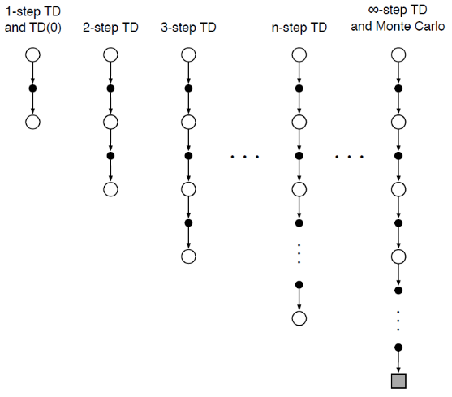
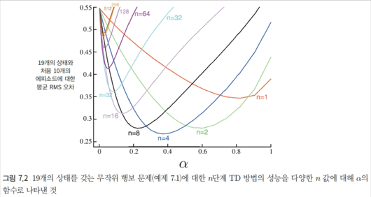
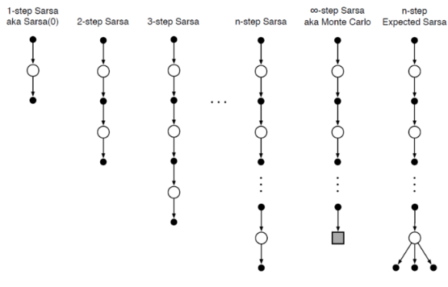
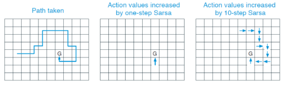
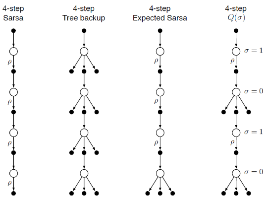

### Chapter 6 : n 단계 부트스트랩(Bootstrap)

출처 : 단단한 강화학습 - Part 1 표 형태의 해법 속 챕터 5

##### 서론

- n 단계 부트스트랩은 MC 방법과 TD 방식의 <u>중간의 성격</u>을 띈다. 
  
  - MC 방법은 에피소드가 끝나 모든 보상을 계산할 수 있을 때 적용할 수 있으며, 
  
  - TD 방법은 매 시간 단계마다 갱신한다. 
  
  - **=> n 단계 부트스트랩은 n 시간마다 갱신한다.** 

- n 단계 부트스트랩은 다수의 단계에 걸쳐 부트스트랩이 일어날 수 있게 하기 때문에 단일 시간 단계의 억압(-매 순간 갱신)으로부터 자유롭게 해 준다.
  
  - 또한 부트스트랩은 <u>식별 가능한 상태 변화가 발생한 시간 구간에서 잘 작동</u>한다. 

---

##### n 단계 TD 예측

- TD, MC 방식을 절충하는 한 방법은 적당한 수의 보상을 통해 상태를 갱신하는 것이다. 
  
  
  
  - n 단계 갱신에서도 여전히 <u>초기의 추정값과 나중의 추정값의 차이에 기반</u>하여 초기 추정값을 갱신하기 때문에 <u>여전히 TD방법</u>이다. 
  
  - 이와 같이 <u>시간 차이가 n 단계 걸쳐 확장하는 방법</u>을 **n단계 TD 방법**이라 부른다.

- MC, TD, n단계 방식의 $v_\pi(S_t)$ 예측 
  
  > MC : $G_t = R_{t+1} + \gamma R_{t+2} + \gamma^2 R_{t+3} + ... + \gamma^{T-t-1}R_T$ 
  > 
  > TD : $G_{t:t+1} = R_{t+1} + \gamma V_t(S_{t+1})$
  > 
  > n 단계 TD : $G_{t:t+n} = R_{t+1} + \gamma R_{t+2} + ...+ \gamma^{n-1}R_{t+n}  +$ <mark>$\gamma^{n}V_{t+n-1}(S_{t+n})$</mark>
  > 
  > - $ n>=1, 0 <= t < T-n$ 을 만족하는 모든 n,t 에 대해 모두 성립한다. 
  > 
  > - 모든 n 단계 이득은 n 단계 이후가 잘리고, 잘린 부분은 $V_{t+n-1}(S_{t+n})$ 으로 대체하여 계산한 전체 이득에 대한 근삿값으로 생각될 수 있다. 
  > 
  > - 만약 $t+n >= T$ 를 만족하면, 잘린 항들은 모두 0으로 간주되고 n 단계 이득은 보통의 전체 이득과 같게 정의된다. 
  
  - 즉, **n 단계 방식은 t+n 단계가 되어 $R_{t+n}, V_{t+n-1}$ 을 알 때 가치를 갱신**할 수 있다.
    
    > $V_{t+n}(S_t) = V_{t+n-1}(S_t) + \alpha[G_{t:t+n} - V_{t+n-1}(S_t)], 0 <= t < T$
    > 
    > - *$\alpha$ 의 값은 학습률과 유사한 느낌*
    > - 이 때 다른 모든 상태( $\forall s \neq S_t)$의 가치는 변하지 않은 채로 남아있다.

- n 단계의 이득의 중요한 특성은 **이득의 기댓값이 최악의 경우에도 $V_{t+n-1}$ 보다 $v_\pi$에 대한 더 좋은 추정값이 됨을 보장**한다.
  
  - 기댓값의 최대 오차는 $V_{t+n-1}$ 의 최대 오차에 $\gamma^n$ 을 곱한 것의 이하임이 보장된다.
    
    > $max_s[E_\pi[G_{t:t+n}| S_t =s] - v_\pi| <= \gamma^n max_s |V_{t+n-1(s)} - v_\pi(s)|$
  
  - 이것을 n 단계 이득의 **오차 감소 특성**이라 한다. 

- TD 방법과 MC 방법을 <mark>n단계 방법으로 일반화하면 잠재적으로 더 좋은 성능</mark>을 낸다.
  
  
  
  > n 단계 TD 예측에 있어, n은 상태 개수의 중간 값을 사용한 방법이 좋다.

--- 

##### n 단계 살사

- **n 단계 살사**는 <u>n 단계 형식의 살사</u>를 의미한다.
  
  
  
  > $G_{t:t+n} = R_{t+1} + \gamma R_{t+2} + .. + \gamma^{n-1}R_{t+n} + $ <mark>$\gamma^n Q_{t+n-1}(S_{t+n}, A_{t+n})$</mark>
  > 
  > $(n >=1, 0 <= t < T-n)$
  > 
  > >  $Q_{t+n}(S_t, A_t) = Q_{t+n-1}(S_t,A_t) + \alpha[G_{t:t+n} - Q_{t+n-1}(S_t,A_t)]$  
  > > 
  > > - $\forall s \neq S_t $ or $\forall t \neq A_t$ 에 대해선 $Q_{t+n}(s,a) = Q_{t+n-1}(s,a)$
  
  - 주요 개념은 <u>행동에 대한 상태(상태-행동 쌍)을 단순히 전환하고 $\epsilon$ 탐욕적 정책을 사용하는 것</u>이다. 
  
  - n 단계 살사와 구분하기 위해, 원래의 살사는 **단일 단계 살사**, 또는 <u>살사(0)</u>이라 한다. 

- n 단계 방법은 한번에 마지막 n개의 행동을 강화(갱신)한다.
  
  
  
  > 마지막 행동으로 G에 도달할 때 외에는 보상이 전부 0 
  > 
  > *즉, 마지막 행동 $Q_{t+n-1}$ 으로 인해 보상을 얻게 됨에 따라 $G_{t:t+n}, G_{t+1:t+n+1},  ... =G_{t+n-1:t+2n}$ 이 한번에 갱신되게 된다*
  > 
  > - since t+n 이 종결 상태이기 때문에, 그 이후에 나오는 $R$ 의 값은 0이다.
  
  - 반면 단일 단계 방법은 한번에 마지막 행동 1개만을 갱신한다.

- 기댓값 살사는 마지막 항목이 <u>정책 $\pi$ 하에서 각각이 갖는 확률에 따라 가중치가 부여된 모든 행동에 대한 분기(branch)라는 점만 다르다</u>.
  
  > $G_{t:t+n} = R_{t+1} + \gamma R_{t+2} + .. + \gamma^{n-1}R_{t+n} + $ <mark>$\gamma^n \bar V_{t+n=1}(S_{t+n})$</mark>
  > 
  > > $\bar V_t(s) = \sum_a \pi(a|s)Q_t(s,a) $ for $\forall s \in S$

--- 

##### n 단계 비활성 정책 학습

- 서로 다른 정책 $\pi, b$ 를 이용함에 있어, $b$ 정책에서 나온 데이터를 사용하려면 <mark>중요도추출 비율을 이용하여 두 정책 사이의 차이점을 고려</mark>해야 한다.
  
  > $V_{t+n}(S_t) = V_{t+n-1}(S_t) + \alpha \rho_{t:t+n-1}[G_{t:t+n} - V_{t+n-1}(S_t)], (0 <= t < T)$
  > 
  > > $\rho_{t:h} = \prod^{min(h,T-1)}_{k=t} \frac{\pi(A_k|S_k)}{(A_k|S_k)}$
  > > 
  > > - 정책 b에서보다 $\pi$ 에서 선택될 확률이 훨씬 높은 어떤 행동이 선택되었다면 가중치가 증가한다. 이는 드물게 발견되는 것이니 합리적이다. 

- n단계 살사 갱신은 다음과 같은 비활성 정책 형태로 대체될 수 있다. 
  
  > $Q_{t+n}(S_t,A_t) = Q_{t+n-1}(S_t,A_t) + $ <mark>$\alpha \rho_{t+1:t+n}$</mark> $[G_{t:t+n} - Q_{t+n-1}(S_t, A_t)]$
  > 
  > - 이때 중요도 추출비율은 n 단계 TD의 경우보다 한 단계 늦게 시작하고 한 단계 늦게 끝난다. 이는 상태 행동 쌍을 갱신하고 있기 때문이다.
  > 
  > - 그 행동이 이미 선택되었으므로 앞으로 이어지는 행동에 대해서만 중요도 추출법을 적용하여 이미 일어난 결과로부터 완전히 학습하고자 하는 것

- n 단계 기댓값 살사의 비활성 정책은 n 단계 살사와 동일하나, <mark>$\rho_{t+1:t+n-1}$ 을 사용한다는 점만 다르다.</mark> 

--- 

##### 제어 변수가 있는 결정 단계별 방법

- 다단계 비활성 정책보다 효율적인 접근법으로 **결정 단계별 중요도추출** 개념이 있다

- n 단계 이득에 $\rho$ 를 고려할 때, $\rho=0$ 인 경우와 아닌 경우의 편차가 심해질 수 있다. 
  
  > n단계 이득 : $G_{t:h} = R_{t+1} + \gamma G_{t+1:h}$  (t < h < T)
  > 
  > $\rho$를 고려한 n 단계 이득 : $\rho(R_{t+1} + \gamma G_{t+1:h})$ 
  > 
  > - 이 때, 시각 t에서 특정 행동이 <u>정책 $\pi$ 하에서 선택될 확률이 0이라면, 이득은 0이 된다</u>. 이는 기댓값 G의 값이 $\rho$ 에 영향을 받아 0이 됨을 의미한다. 

- 따라서, n 단계 이득을 아래와 같이 일반화할 것을 사용한다. 
  
  > $G_{t:h} = \rho_t (R_{t+1} + \gamma G_{t+1 :h}) + $ <mark>$(1-\rho_t)V_{h_1}(S_t)$</mark>
  > 
  > - $\rho_t$ 의 값이 0이 되면, 목표를 추정값과 같게 한다. 
  > 
  > - 뒤에 추가된 항을 **제어변수** 라고 한다. 
  >   
  >   - 제어 변수는 기댓값을 변화시키지 못한다. 

- 제어 변수가 있는 비활성 정책 형태는 다음과 같다. (이해 50%)
  
  > $G_{t:h} = R_{t+1} + \gamma [\rho_{t+1} G_{t+1:h} + \bar V_{h-1}(S_{t+1}) - \rho_{t+1} Q_{h-1}(S_{t+1}, A_{t+1})]$
  > 
  >          $= R_{t+1} + \gamma \rho_{t+1}(G_{t+1:h} - Q_{h-1}(S_{t+1}, A_{t+1})) + \gamma V_{h-1}(S_{t+1})$
  > 
  > - h < T 이면 재귀 과정은 $G_{h:h} = Q_{h-1}(S_h, A_h)$로 끝난다.
  > 
  > - 반면 h >= T 이면 재귀 과정은 $G_{T-1:h} = R_T$ 로 끝난다. 

- 중요도 추출법은 <u>성능이 좋은 비활성 정책 학습을 가능</u>하게 해주지만, 그와 함께 갱신되는 분산이 큰 값을 갖는다. 
  
  - 즉, 시간 간격 파라미터를 작은 값으로 해야하고, 이는 <mark>학습 속도 저하를 초래</mark>한다. 
  
  - 하지만 비활성 정책 방법이 개선될 여지가 있다. 
    
    - ex)- 제어 변수 설정, 자동간격 방법, 변하지 않는 갱신 등등 

--- 

##### 중요도 추출법을 사용하지 않는 비활성 정책 학습 : n 단계 트리 보강 알고리즘

- n 단계 트리 보강 알고리즘은 선택되지 않은 행동에 대해서는 표본이 없기 때문에,  <mark>부트스트랩을 수행하여 얻은 행동의 가치에 대한 추정값을 통해 갱신의 목표</mark>를 만든다. 
  
  > 
  > 
  > - 선택받지 못한 행동인 <u>리프 노드의 행동 가치 추정값으로 갱신한다.</u>

- n 단계 트리 보강 이득은 다음과 같다.
  
  > 1단계 트리 보강 : $G_{t:t+1} = R_{t+1} + \gamma \sum_a \pi(a|S_{t+1})Q_t(S_{t+1},a)$
  > 
  > 2단계 트리 보강 : $G_{t:t+2}$
  > 
  > = $R_{t+1} + \gamma \sum_{a=\neq A_{t+1}} \pi(a|S_{t+1})Q_{t+1}(S_{t+1}, a)$
  > 
  > $    + \gamma \pi(A_{t+1}|S_{t+1})(R_{t+2} + \gamma \sum_a \pi(a|S_{t+2})Q_{t+1}(S_{t+2},a))$
  > 
  > $= R_{t+1} + \gamma \sum_{a=\neq A_{t+1}} \pi(a|S_{t+1})Q_{t+1}(S_{t+1}, a)$
  > 
  > $    +\gamma \pi(A_{t+1}|S_{t+1})(R_{t+2} + \gamma \pi(A_{t+1}{S_{t+1}})G_{t+1:t+2}$
  > 
  > **n 단계 트리 보강** : **$G_{t:t+n}$**
  > 
  > $= R_{t+1} + \gamma \sum_{a=\neq A_{t+1}} \pi(a|S_{t+1})Q_{t+1}(S_{t+1}, a)$
  > 
  > $    +\gamma \pi(A_{t+1}|S_{t+1})(R_{t+2} + \gamma \pi(A_{t+1}{S_{t+1}}))G_{t+1:t+n}$

- n 단계 트리 보강 이득은 n 단계 살사에서 나오는 행동 가치 갱신 규칙과 함께 사용된다. 
  
  > $Q_{t+n}(S_t, A_t) = Q_{t+n-1}(S_t, A_t) + \alpha[G_{t:t+n} - Q_{t+n-1}(S_t,A_t)]$

--- 

##### 통합 알고리즘 : n단계 Q[$\sigma$]

- n단계 $Q[\sigma]$는 <u>행동을 표본으로서 취하기를 원하는지, 아니면 트리 보강 갱신과 같이 기댓값을 고려할 것인지 단계별로 결정</u>한다.
  
  
  
  - 이 때 몇번째 단계의 표본/ 기댓값 중 선택하는 방식을 다양화할 수 있다. 
    
    - ex)- 확률 변수 $\sigma_t$ 부여 

- n 단계 $Q[\sigma]$의 이득은 다음과 같다. 
  
  > $G_{t:h}$
  > 
  > $= R_{t+1} + \gamma \sum_{a=\neq A_{t+1}} \pi(a|S_{t+1})Q_{t+1}(S_{t+1}, a)$
  > 
  > $    +\gamma \pi(A_{t+1}|S_{t+1})(R_{t+2} + \gamma \pi(A_{t+1}{S_{t+1}}))G_{t+1:h}$
  > 
  > > since $\sum_{a=\neq A_{t+1}} \pi(a|S_{t+1})Q_{t+1}(S_{t+1}, a) = $ $\bar V_{h-1}(S_{t+1}) - \pi(A_{t+1}|S_{t+1})Q_{h-1}(S_{t+1}, A_{t+1})$
  > 
  > <mark>$= R_{t+1} +\gamma \pi(A_{t+1}|S_{t+1})(G_{t+1:h} - Q_{h-1}(S_{t+1}, A_{t+1})) + \gamma \bar V_{h-1}(S_{t+1}) $</mark>
  > 
  > > since $\pi(A_{t+1}|S_{t+1}) = \sigma_{t+1} \rho_{t+1} + (1-\sigma_{t+1})\pi(A_{t+1}|S_{t+1})$ 
  > 
  > <mark>$= R_{t+1} +\gamma (\sigma_{t+1} \rho_{t+1} + (1-\sigma_{t+1})\pi(A_{t+1}|S_{t+1})) (G_{t+1:h} - Q_{h-1}(S_{t+1}, A_{t+1}))$</mark>
  > 
  > <mark>    $+ \gamma \bar V_{h-1} (S_{t+1})$</mark>

