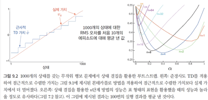
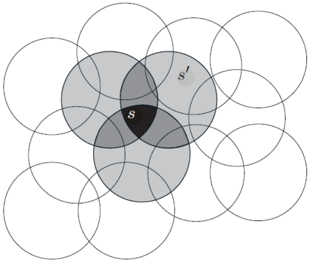
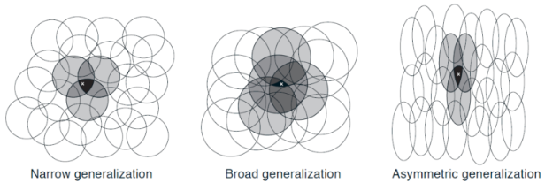
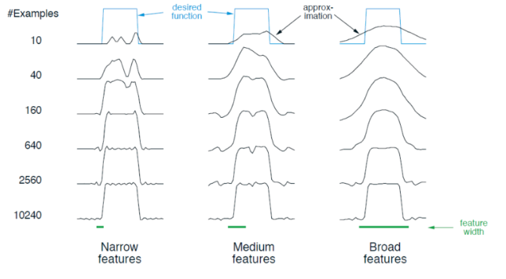
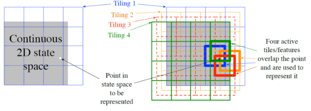
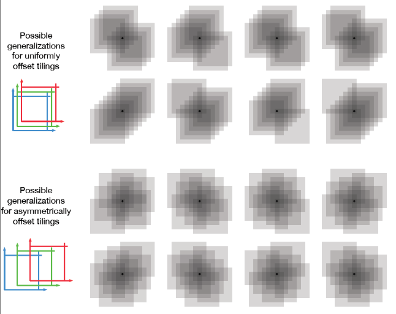
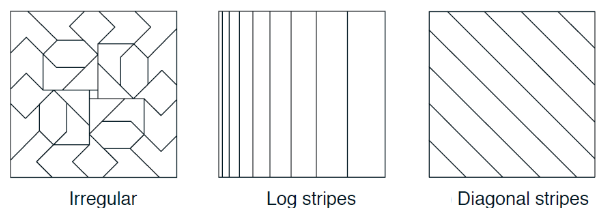
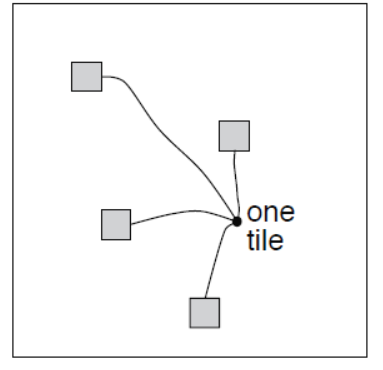
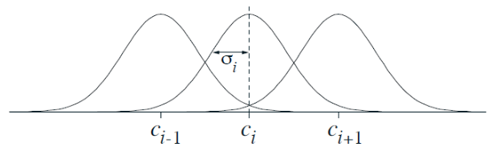

### Chapter 8 : 표에 기반한 방법을 이용한 계획 및 학습

출처 : 단단한 강화학습 - Part 2 근사적 해법 

##### 서론

- 이제부터 **근사적 가치 함수**를 <u>가중치 $w \in R^d$ 를 갖는 파라미터화된 함수</u>로 표현한다. 
  
  > $\hat v(s,w)$ ~= $v_\pi(s)$ 
  > 
  > > w : (일반적으로) 모든 층에서의 연결 가중치 벡터
  > > 
  > > $\hat v$ : (일반적으로) 다층 인공 신경망에 의해 계산된 함수   
  
  - 일반적으로 <u>가중치의 개수(w의 차원)은 상태의 개수보다 훨씬 적다</u>. ($d << |S|$)
  
  - <u>가중치 하나의 값을 바꾸면 많은 상태의 가치 추정값이 바뀐다. </u>
    
    - 갱신으로 인한 상태의 변화는 일반화되어 다른 많은 상태의 가치에 영향을 준다.

- **일반화는 학습을 더 강력하게 만들면서, 한편으론 관리/이해를 어렵게만든다.**
  
  - +강화학습을 <u>함수 근사로 확장함으로써 부분 관측 가능한 문제에 적용가능</u>해진다.

----

##### 가치 함수 근사

- 예측은 특정 상태에서의 가치를 그 상태에 대한 **'보강된 가치'** 또는 **갱신 목표**(update target)<u>를 향해 이동시키기 위한 가치 함수 추정값의 갱신</u>으로 설명된다. 
  
  > <mark>$s |→ u $</mark>
  > 
  > > s : 상태 (갱신의 대상)
  > > 
  > > u : s의 가치 추정값이 도달해야 하는 갱신의 목표 
  > 
  > ex)- MC : $S_t |→ G_t$, TD(0) : $S_t |→ R_{t+1} + \gamma \hat v(S_{t+1}, w_t)$

- **함수 근사 방법**은 <u>근사하려고 하는 함수의 예제가 주어진다는 것을 전제</u>로 한다.
  
  > 함수값이 목표$u$ 에 유사할 때, 종종 **함수근사**(function approximat)라고 한다.  
  
  - 즉, 입출력 예제를 모사하는 방법으로서 <u>지도 학습의 일환</u>으로 분류된다. 
    
    - 원칙적으론 지도학습의 방법론(ex-인공 신경망, 결정 트리 등)을 사용할 수 있다.
    
    - 하지만 일반적으로 비정상적 / 온라인 상황 속 학습을 강조하는 강화학습 특성 상, <u>정적 훈련 데이터를 전제로 하는 지도 학습의 방법이 적합하지 않을 수 있다.</u>

---

##### 예측 목적($\bar {VE}$)

- 표 형태의 데이터 속에서는 예측의 분명한 목적을 명시하지 않아도 괜찮다. 
  
  - 표 형태에선, 학습된 가치 함수는 실제 가치 함수와 정확하게 같아질 수 있다. 
  
  - 표 형태에선, 각 상태에서 학습된 가치는 분리되어 있다.

- 반면, **근사에선 주어진 상태 수에 보다 적은 가중치 수로 인해 목적을 선택**해야 한다. 
  
  - 특정 가치 추정값을 정확하게 만드는 것은 다른 상태를 덜 정확하게 만드는 것을 의미한다. 즉, <u>모든 상태에 대해 정확하게 추정하는 건 불가능</u>하다. 
  
  - 또한 한 상태의 갱신은 다른 많은 상태에 영향을 미친다. 
  
  - => <mark>어떤 상태를 가장 우선시할 것인지를 명시하기 위해 상태 분포를 도입한다.</mark> 
    
    > 상태 분포 : $\mu(s) >= 0 , \sum_a \mu(s) =1$
  
  - 또한 **에피소딕과 연속적인 문제를 분리**하여 살펴 봐야 한다.

- **Ex)-에피소딕 문제의 활성 정책 분포**
  
  - 에피소딕 문제에서는 초기 상태가 어떻게 선택되는지에 따라 활성 정책 분포가 영향을 받는다는 점에서 다른 문제의 활성 정책 분포와 다르다.
    
    > 모든 $s \in S$ 에 대해 $\eta(s) = h(s) + \sum_s \eta(\bar s) \sum_a\pi(a|\bar s)p(s|\bar s,a)$
    > 
    > > $h(s)$ : 상태 s에서 시작할 확률
    > > 
    > > $\eta(s)$ : 단일 에피소드의 상태 s에서 평균적으로 소비된 시간 단계의 수
  
  - 이때 <u>활성 정책 분포는 각 상태의 소비된 시간의 비율을 정규화한 것</u>이 된다.
    
    > 모든 $s \in S$에 대해 $\mu(s) = \frac{\eta(s)}{\sum_{s'}\eta(s')}$ (할인이 없는 경우)

- <u>가중치 w에 대한 성능을 판단</u>하기 위해 **가치추정오차**(**V**alue **E**rror)을 도입한다.
  
  > <mark>$\bar {VE}$ = $\sum_{s \in S} \mu(s) [v_\pi(s) - \hat v(s,w)]^2$ </mark>   (평균 제곱 가치 오차)
  > 
  > - 대체로 **$\mu(s)$** 는 '**상태 s에서 소비된 시간의 비율**' 로 선택된다.  
  > 
  > - 활성 정책 훈련의 경우, 이것은 **활성 정책 분포**라고 불린다. 
  
  - 제곱근 $\bar {VE}$는 <u>근사 가치가 실제 가치와 얼마나 차이를 갖는지에 대한 지표</u>가 된다.
    
    - $\bar {VE}$ 가 최적의 지표란 점은 명확하지 않다. 
    
    - 더 나은 대안이 뭔지 또한 명확하지 않기에, 지금으로선 $\bar {VE}$ 에 초점을 둔다.

- $\bar {VE}$ 측면에서 이상적인 목표는 **전역 최적값**(global optimum) $w^*$을 찾는 것이다. 
  
  > 전역 최적값 $w^*$ : $\bar {VE}(w^*) <= \bar {VE}(w)$ for $\forall w \in W$
  
  - 하지만 위의 목표는 인공 신경망 등 복잡한 함수의 근사에선 보통 가능하지 않다. 
  
  - 또한 일부 문제에선 **지엽 최적값**(local optimum)으로 조차 수렴성을 보장못한다. 

---

##### 확률론적 경사도(Stochastic-Gradient Descent, SGD)와 준경사도 방법

- SGD은 함수 근사 방법 중 가장 폭넓게 사용되며, 특히 온라인 강화학습에 잘 맞는다. 

- SGD는 각 예제에 대해 <u>오차를 가장 많이 감소시키는 방향으로 가중치 벡터를 조금씩 조정</u>함으로써 관측된 <u>예제의 오차를 최소화</u>한다. 
  
  > $w_{t+1} = w_t - \frac{1}{2} \alpha \nabla [v_\pi(S_t) - \bar v(S_t, w_t)]^2 $
  > 
  >            <mark>$= w_t + \alpha[v_\pi(S_t) - \hat v(S_t,w_t)]\nabla \hat v(S_t, w_t)$</mark>
  > 
  > > $w_t$ : t번째 시간 단계에서의 가중치 벡터($w_1, w_2, ..., w_d$)
  > > 
  > > $\hat v(s,w)$ : 모든 $s \in S$에 대해 미분가능한 w의 함수 
  > > 
  > > $\alpha$ : 양의 시간 간격 파라미터 
  > > 
  > > $\nabla \hat v(S_t, w_t)$ = ($\frac {\theta f(w)}{\theta w_1},\frac {\theta f(w)}{\theta w_2}, ... , \frac {\theta f(w)}{\theta w_d} $) . 함수 f의 경사도를 의미. 
  > > 
  > > $f(w)$ : 벡터 w를 변수로 하는 임의의 스칼라 함수 
  
  - SGD 말고도 다른 방향으로 예제와의 오차를 제거할 수 있지만, 바람직하진 않다. 
  
  - SGD는 $\alpha$가 **표준적인 확률론적 근사 조건을 만족 시, 지역적 최적값으로 수렴**한다. 
    
    > 표준적인 확률론적 근사 조건 : $\sum_{n=1}^\infin \alpha_n = \infin $ & $\sum_{n=1}^\infin \alpha_n ^2 < \infin$

- 위의 식에서 구할 수 없는 $v_\pi(S_t)$을 근사값 $U_t(S_t)$로 대체한다. 
  
  > <mark>$w_{t+1} = w_t + \alpha[U_t - \hat v(S_t,w_t)]\nabla \hat v(S_t, w_t)$</mark>
  > 
  > - 이때 $U_t$의 값은 $v_\pi$ 값에 오차가 섞인 값일 수도 있다. 
  
  - <u>$U_t$가 각각의 t에 대해 편차 없는 추정값</u>이라면, **$w_t$ 는 지엽적 최적값으로 수렴**한다.
    
    - 즉, 부트스트랩을 사용하는 n단계 이득이나 DP의 경우, $U_t$에 대해 편차를 부여하여 $w_t$가 수렴할 것을 보장하지 못한다.

- 부트스트랩은 **준경사도 방법**로 불리며 <u>특정 상황(선형 근사)하 안정적으로 수렴</u>한다.
  
  - $v_\pi(s)$와는 독립적인 목표를 잡음으로써, <u>가중치 $w_t$를 변경하는 것이 추정값에 미치는 효과는 고려하되 목표에 미치는 효과를 무시</u>한다. 
    
    > $U_t = R_{t+1} + \gamma \hat v(S_{t+1}, w)$     [준경사도 방법의 원형 - TD(0)]
  
  - 부트스트랩은 보통 <mark>빠른 학습이 가능하며, 연속적인 학습과 온라인 학습이 가능</mark>하다.

- **상태 결집**(state aggregation)은 함수 근사를 일반화하는 간단한 형태다. 
  
  - 상태 결집 하에서 상태는 함께 묶이고, 한 묶음당 하나의 가치 추정값($w_i$)를 갖는다.
  
  - 상태의 가치는 상태가 속한 묶음의 성분으로서 추정된다. 
  
  - 상태가 갱신되면 그 성분 하나만 갱신된다. 

---

##### 선형 방법

- <u>근사함수 $\hat v(., w)$가 가중치 벡터 w에 대해 선형 함수인 경우</u>를 의미하며, 함수 근사의 가장 중요하고 특별한 경우이다.
  
  > $\hat v(s,w) = w^Tx(s) = \sum^d_{t=1} w_ix_i(s)$
  > 
  > > $x(s) :$ 상태 s를 나타내는 **특징 벡터**라고 부름. 
  > > 
  > > - 한 함수의 특징(feature)은 그 함수의 전부를 나타내는 것으로 간주
  > > 
  > > - 어떤 상태에 대한 함수의 가치를 **s의 특징**(feature of s) 이라고 부름
  
  - 선형 방법의 경우, <u>특징은 근사 함수 집합에 대한 선형 기저(linear basis)형성</u>하기 때문에, <mark>특징은 **기저 함수**(basis function)이 된다</mark> .

- 선형 함수의 경우 일반적인 SGD 갱신은 다음과 같다. 
  
  > $w_{t+1} = w_t + \alpha[U_t - \hat v(S_t, w_t)] x(S_t)$
  > 
  > > $\nabla \hat v(s,w) = x(s)$

- **선형 방법은 여러 측면에서 선호받는다.**
  
  - 식이 매우 간단하여 수학적 분석이 용이하다.
  
  - 데이터와 계산 측면에서 매우 효율적일 수 있다. 
  
  - <u>오직 하나의 최적값이 존재하여, 지엽적 최적값을 보장하는 모든 방법은 전역 최적값으로 수렴함을 보장</u>한다.
    
    - 또는 더욱 간단한 함수가 있을 경우 동등하게 좋은 최적값의 집합이 존재한다.

- 선형 함수 근사 하<u> TD(0) 알고리즘의 수렴성은 다음 식에 따라 보장</u>된다. 
  
  > $w_{t+1} = w_t + \alpha(R_{t+1} + \gamma w_t^Tx_{t+1} - w^T_t x_t)x_t$
  > 
  >            $= w_t + \alpha(R_{t+1}x_t - x_t(x_t - \gamma x_{t+1}^T w_t)$
  > 
  > <mark>$E[w_{t+1}|w_t] = w_t + \alpha(b-Aw_t)$ </mark>
  > 
  > > $x_t = x(S_t)$
  > > 
  > > $b = E[R_{t+1}x_t] \in R^d $
  > > 
  > > $A = E[x_t(x_t - \gamma x_{t+1})^T] \in R^d$ x $R^d$
  > 
  > - $b- Aw_t =0$ 일 경우, 가중치 벡터는 수렴한다. 
  
  > $b - Aw_{TD} =0$
  > 
  >                   $b = Aw_{TD}$
  > 
  >             $w_{TD} = A^{-1}b$
  
  - $A^{-1}$ 의 존재 증명은 책 참고할 것 :) 

- TD 고정점에서, (연속적인 문제의 경우) <u>발생 가능한 가장 작은 오차를 유한하게 확장한 값에 의해 $\bar {VE}$가 제한</u>된다 
  
  > <mark>$\bar {VE}(w_{TD}) <= \frac {1} {1-\gamma} min_w \bar {VE}(w) $</mark>
  > 
  > *Why? $\alpha$ 의 값이 그렇게 되야한다는 건 대략 감이 오긴 하는데 정확히는 모르겠다.*
  
  - 즉, TD 방법을 적용한 결과가 점근적으로 수렴했을 때의 오차는, 발생 가능한 가장 작은 오차에 $\frac {1}{1-\gamma}$ 을 곱한 값보다 크지 않다. 

- **MC 방법과 TD 방법은 어떤 방법이 최선**인가는 <u>근사 및 문제의 특성, 그리고 얼마나 오랫동안 학습이 지속되는 지에 따라 다르다. </u>
  
  
  
  - TD 방법은 MC 보다 분산이 크게 감소해서 MC 보다 더 빠르다, 
  
  - 단, $\gamma$ 가 종종 1에 가깝기 때문에, TD 방식의 점근적 수렴 시점이 늦춰질 수 있다. 

--- 

##### 선형 방법을 위한 특징 만들기

- **선형 방법이 실제 상황에서 효율성을 갖출 수 있는지 여부**는 <u>상태가 특징의 측면에서 어떻게 표현되는지에 크게 의존</u>한다. 
  
  - 적합한 특징을 선택하는 것은 학습 간에 사전 배경지식을 추가하는 중요한 방법이다. 
  
  - 단, **선형 방법은 특징 들 사이의 상호작용을 전혀 고려할 수 없다는 한계점**이 있다. 
    
    - 따라서 특징 간 상호작용을 고려하기 위해선 <u>추가적인 특징 설정이 필요</u>하다. 

- **특징 간 상호작용을 표현하기 위한 일반적인 방법들**
1. **다항식** 
   
   > 특징 벡터 : X(s) = ($x_1(s), x_2(s), ... , x_n(s)$) 
   > 
   > $x_i(s) = \prod^k_{j=1} s^{c_{i, j}}_j$ 
   > 
   > > $x_i$ : k차원 상태 공간에 대해 n차 다항식을 기저로 하는 각각의 특징 값들 
   > > 
   > > $c_{i,j}$ : 0 이상의 정수 n에 대해 집합 {0, 1, ... , N}의 원소 
   
   - 높은 차수의 다항식 기저는 좀 더 복잡한 함수에 대한 정확한 근사를 가능하게 한다. 
     - 단, 특징의 개수는 k에 따라 기하급수적으로 증가하여 다항 회귀로 특징을 선택할 필요가 있다.

2. **프리에 기저** 
   
   > $x_i(s) = cos(\pi s^T c^i)$  s.t. $s = (s_1, s_2, ..., s_k)^T, s_i\in[0,1]$
   > 
   > $s^Tc^i$ : {0, ... , n} 에 속하는 정수 하나를 s의 각 차원에 할당한다.
   > 
   > > $c^i = (c_1^i, ..., c^i_k)$
   
   - 푸리에 기저는 <u>충분한 기저 함수가 있다면 본질적으로 어떤 함수든 원하는 만큼 정확하게 근사</u>할 수 있으며, <u>기저 함수의 가중치가 쉽게 계산된다</u>는 점에서 선호받는다. 
- 푸리에 코사인 특징을 준경사도 TD(0), 준경사도 살사 등의 학습에 적용할 때에는 시간 간격 파라미터를 다른 값으로 적용하길 권장한다. 
  
  > $\alpha_i  = \alpha / \sqrt{(c_1^i)^2 + ... + (c_k^i)^2}$

- 살사에 사용되는 푸리에 코사인 특징은 다른 기저 함수 대비 좋은 성능을 낸다. 

- n차 푸리에 기저에서 특징의 개수는 상태 공간의 차원 수에 따라 기하급수적으로 증가하나, 충분히 적을 경우(ex- k <= 5) 모든 특징을 사용되도록 n을 정할 수 있다. 

- 또한 상태 변수들 사이의 <u>상호작용을 고려하기 위해 벡터 $c_i$를 설정</u>하고, 근사 과정에서 <u>noise로 보이는 $c_j$ 값을 제한함</u>으로써 **특징 벡터의 선택이 용이**해진다.  
  
  - 단, 각 푸리에 특징은 항상(Globaly) 적용되기에, 특정 구간(local) 특성을 나타내기엔 어려울 수 있다. 
3. **엉성한 부호화(Coarse coding)**
   
   
   
   > 상태 집합의 표현은 각각의 원에 속하냐, 안속하냐의 특징으로 구성된다. 
   > 
   > s가 원 안쪽에 있으면 해당 특징은 1의 값을 띄며 존재한다(Present)고 불린다.
   > 
   > 그 밖의 경우에는 특징이 0이고 부재중(absent) 상태라 불린다. 
- **원의 크기 / 형태에 따라 엉성한 부호화의 효과가 달라진다.** 
  
  - [전제] 각 원에 대해 학습에 의해 변할 수 있는 하나의 가중치 $w_i$가 존재한다.
  
  - 상태 s에 대해 훈련을 한다면, s를 포함하는 모든 원의 가중치는 영향을 받는다.
  
  - 근사적 가치 함수는 원의 가중치($w_i$)로 부터 영향을 받을 것이며, 영향의 정도는 s가 포함된 원의 개수에 비례할 것이다. 
  
  
  
  - 즉, 원의 크기는 일반화의 크기와 근사적 가치 함수에 미치는 영향력에 비례하며, 원의 형태은 일반화의 특성을 결정한다. 
    
    - => <u>한 지점 > 다른 지점의 초기 일반화는 원의 크기/형태에 의해 결정</u>된다. 
  
  - <u>상태의 세밀한 구분은 특징(원)의 개수에 비례한다.</u> 

- 단, 학습의 단계에 따라서 원(특징)의 개수 / 크기 / 형태는 영향력이 달라진다. 
  
  
  
  - 초기에는 원의 크기가 큰 효과를 가지나,  <u>최종적으로는 거의 영향력</u>이 없다. 
  
  - 오히려 **함수의 정확도는 원의 개수에 비례**하여 향상된다. 
4. **타일 부호화(Tile Coding)**
   
   - 다차원 연속 공간에 대한 유연하고 계산 효율이 좋은 엉성한 부호화의 한 종류다. 
   
   
   
   > 타일 영역(Tiling) : 묶인 특징의 수용 영역. *여기선 좌측 파란색 사각형을 의미* 
   > 
   > 타일(Tile) : 묶음을 구성하는 각 요소 
   > 
   > - 엉성한 부호화를 위해, 일정 간격으로 움직이는 다수의 타일 영역을 활용.   *우측 사진에서 다양한 색깔로 다수 타일 표현*
   
   - **타일 부호화의 장점**
     
     - 타일 부호화가 타일 영역을 이용하기 때문에, <u>어떤 순간에 든 활성화된 특징의 전체 개수가 모든 상태에서 동일하다는 점</u>이다. 
       
       - 각 타일 영역별로 정확히 하나의 특징이 매칭되기 때문에, 존재하는 특징의 전체 개수는 언제나 타일 영역의 개수와 동일하다. 
       
       - -> **시간 간격 파라미터 $\alpha$를 쉽고 직관적으로 설정할 수 있게 해준다.** 
         
         - ex)- $\alpha = \frac {1}{n}$ 이면 단일 시행이 됨. 분모를 더 키우면 천천히 학습됨. 
     
     - 이진 특성 벡터를 활용하여, <u>근사적 가치 함수 계산 간 가중 합계를 쉽게 구한다</u>.
       
       > $\hat v(s,w) = w^Tx(s) = \sum^d_{t=1} w_ix_i(s)$. 이때 w가 0 또는 1이다. 
- **타일 부호화의 특징**
  
  - 훈련된 상태(s)가 속한 타일속 다른 상태들(s')은 일반화가 된다. 
  
  - **일반화 속도**는 상태가 *(다수의 타일 영역간)* 공유하는 <u>타일의 개수에 비례</u>한다.  
    
    > *위 그림에서 상태 s 는 4개의 타일 영역 간 4개의 타일에 공유되고 있음.*
  
  - 타일 영역 간 간격은 비대칭적으로 할 것을 권장한다. 
    
    
    
    > 상단 : 대칭적 간격  / 하단 : 비대칭적 간격 
    
    - 타일 영역간 간격을 대칭적으로 할 시 인위적인 대각석 구조를 띔. 
    
    - 반면, 비대칭적으로 할 때 구 모양에 가까워 일반화 패턴이 균일해짐 

     - **타일 영역에 대한 선택(개수, 모양)이 일반화를 결정한다.**
    
       
    
       - 타일의 개수는 점근적으로 수렴한 근사의 해상도 또는 정확도를 결정한다. 
    
       - 타일의 모양은 일반화의 특성을 결정한다. 
    
       - +각 타일 영역들은 서로 다른 모양의 타일을 사용할 것을 권장한다. 

+ +해싱(Hasing)을 통해 성능의 손실 없이 요구되는 메모리 용량을 줄일 수 있다. 
  
  > 
  > 
  > **해싱** : 지속적인 의사 무작위(pseudo-random)추출을 통해 큰 타일 영역을 훨씬 더 작은 여러 개의 타일 집합으로 나누는 것. 
  
  - 해싱을 통해 메모리는 요구하는 만큼만 필요하여 <u>차원의 저주로부터 자유롭게 한다</u>.
5. **방사형 기저 함수(Radical Basis Function, RBF)**
   
   - 엉성한 부호화를 연속적인 값을 갖는 특징으로 일반화한 것 
     
     > $x_i(s) = exp(-\frac {||s-c_i||^2 } {2 \sigma^2_i})$
     > 
     > 
     
     - 각 특징이 진 값을 갖는 것이 아니라 [0,1] 구간의 어떤 값이든 될 수 있다.
     
     - 이를 통해 <u>특징이 존재하는 정도(Degree)를 반영</u>할 수 있다.
   
   - RBF는 Conti 하며 미분가능한 근사 함수를 도출하나, <u>상당한 계산 복잡도를 요구하며 상태의 차원이 2차원을 넘을 경우 성능이 저하되어 실제 상황에서 잘 안 쓰인다</u>. 
- +**RBF 네트워크**는 RBF를 특징으로 사용하는 선형 함수 근사 기법이다. 
  
  - 일부 몇몇 방법은 비선형 함수 근사 영역으로 들어가 특징의 중심과 너비도 변화시킬 수 있다. 
  
  - 단, <u>계산의 복잡도가 크고 학습이 수렴하기까지 많은 수동 조율이 필요</u>하다.

---

##### 시간 간격 파라미터를 수동으로 선택하기

- 대부분의 SGD 방법은 수동으로 적절한 시간 간격 파라미터 $\alpha$ 를 선택해야 한다.

- 아쉽게도 이론적 고려사항들을 거의 도움이 안된다. 
  
  - Ex)- $\alpha_t = \frac {1}{t}$ 은 표 기반 MC 외에, 비정상적 문제를 위한 TD 방법이나 함수 근사를 하든 모든 방법에 적합하지 않다.
  
  - 선형 학습 방법에 사용한 재귀적 최소 재곱법은 규모가 큰 문제에선 적용할 수 없다.
    
    > 재귀적 최소 제곱법(recursive least-squares method) 은 학습하는 파라미터 개수의 d배에 해당하는 개수의 파라미터를 필요로 한다. 

- 시간 간격 파라미터 설정을 위해 직관적인 감각을 발휘하는 게 좋다. 
  
  - 선형 SGD 방법의 시간 간격 파라미터를 설정하는 좋은 경험적 방법은 다음과 같다.
    
    > $\alpha = (r E[x^Tx])^{-1}$
    > 
    > > r : 경험의 횟수 
    > > 
    > > x : SGD에서 입력 벡터와 같은 분포로부터 랜덤하게 선택된 특징 벡터 
    > > 
    > > - 특징 벡터의 길이가 크게 변하지 않는다면 가장 성능이 좋을 것
    
    - 상태에 대한 추정값은 해당 상태에 대해 대략 r번의 경험이 진행된 이후에 목표의 평균값으로 수렴할 것이며, 이때 최근의 목표가 가장 큰 효과를 보일 것이다. 
    
    - 일반적인 함수 근사에 있어 한 상태에 대한 **경험의 횟수**(r)는, 각 상태별로 서로에 대해 유사한 정도가 다 달라 명확하게 개념을 세울 수 없다.   
      
      > *한 50% 이해한 듯*  

--- 

##### 비선형 함수 근사 : 인공 신경망

- 인공신경망(ANN)은 비선형 함수 근사에 폭넓게 사용된다. 

- Hidden layer을 갖는 ANN은 '보편적 근사', '자동 특징 공학' 특성을 지닌다. 
  
  > 보편적 근사 : 입력 공간의 좁은 영역에 대해 모든 연속 함수를 모든 수준의 정밀도로 근사할 수 있다. (Cybenko, 1989)
  > 
  > 자동 특징 공학 : 특징들을 기계가 스스로 구한다. 

- ANN 학습 방법은 상황에 따라 달라질 수 있다. 
  
  - 일반적으로 SGD 방식으로 학습한다. 
  
  - 강화학습에서는 TD오차, 경사도 다중 선택, 정책 경사도 알고리즘 등 보상의 기댓값을 최대화하는 것을 목표로 삼을 수 있다. 

--- 

##### 최소 제곱 TD (Least-Square TD)

- 선형 함수 근사를 위한 방법으로 최고일 것? 
  
  > *어떻게 이렇게 확답할 수 있을까?* > 해석학적으로 최적 값을 찾아냈기 때문에

- 선형 함수 근사를 이용한 TD(0)는 시간 간격이 적절하게 감소할 경우 TD 고정점을 향해 점근적으로 수렴한다. 
  
  > $w_{TD} = A^{-1}b$
  > 
  > > $A = E[x_t(x_t-\gamma x_{t+1})^T]$
  > > 
  > > $b = E[R_{t+1}x_t]$
  
  - 이때, TD(0)의 목표값($A^{-1}b$)을 이미 알고 있기에, <mark>각 A,b 의 추정값을 구한다면 점근 과정을 계산하지 않아도 된다.</mark> 

- LSTD(Least-Square TD) 알고리즘이 A와 b의 추정값을 구하여 계산 과정을 줄인다.
  
  > $\hat A_t = \sum^{t-1}_{k=0} x_k(x_k-\gamma x_{k+1} + \epsilon I)$
  > 
  > - $I$는 $\hat A_t$ 의 역행렬 보장하기 위해 도입 
  > 
  > $\hat b_t = \sum^{t-1}_{k=0}R_{t+1}x_k$
  > 
  > $w_t = \hat A_t^{-1} \hat b_t$
  
  - LSTD는 선형 TD(0) 중 가장 데이터를 효율적으로 활용하지만, 또한 더 많은 계산량을 필요로 한다. 

- LSTD의 계산/메모리 복잡도 
  
  - $\hat A_t$ 에 대한 갱신은 행렬을 갱신하는 것이다.(O($d^2$)) 
  
  - 또한 $\hat A_t^{-1}$ 의 계산 복잡도 또한 추가된다. ($O(d^2)$)
    
    > 역행렬 계산 복잡도는 $O(d^3)$이나 셔먼-모리슨 공식으로 $O(d^2)$로 줄인다.
    > 
    > $\hat A_t^{-1} = (\hat A_{t-1} + x_{t-1}(x_{t-1} - \gamma x_t)^T)$
    > 
    >           $= \hat A_{t-1}^{-1} - \frac {\hat A_{t-1}^{-1}x_{t-1}(x_{t-1} - \gamma x_t)^T \hat A_{t-1}^{-1}} {1 + (x_{t-1} - \gamma x_t)^T \hat A_{t-1}^{-1}x_{t-1}}$
  
  - *TD(0)의 계산 복잡도는 $O(d)$ 이다.*
  
  - => <u>LSTD가 데이터 효율을 위해 계산량을 추가로 투입할 가치가 있는지</u>는 <mark>1)d가 얼마나 크냐</mark>, <mark>2)빠른 학습이 얼마나 중요하냐</mark>, <mark>3)시스템의 다른 부분에서 필요로 하는 계산량</mark>에 따라 달라진다. 

- LSTD는 시간 간격 파라미터를 설정하지 않아도 된다. 
  
  - 대신 $\epsilon$ 값을 설정해야 한다. 
  
  - 시간 파라미터가 없다는 것은 LSTD가 모든 과거 값을 잊지 않는다는 걸 의미한다. 이는 목표 정책 $\pi$ 가 변하지 않는 한 바람직하다.
    
    - 만약 목표 정책 $\pi$ 가 변할 경우 시간 파라미터(ex- 할인율)을 고려해야 하며 기존의 장점은 사라진다.  

--- 

##### 메모리 기반 함수 근사

- 메모리 기반 함수 근사는 Nonparametric 방법의 대표적인 예시다. 
  
  - 훈련 예제가 들어올 때마다 파라미터를 갱신없이 단순히 예제를 메모리에 저장한다. 
  
  - 시스템이 출력을 도출하도록 요청받을 때까지 훈련 예제를 처리하는 것이 지연되기 때문에, 이 방법을 **게으른 학습**(Lazy learning)이라고 부른다. 

- 메모리 기반 함수는 훈련 예제를 결합하는 몇 가지 방법에 의해 함수의 형태를 결정한다. 
  
  - **함수의 목적**은 <u>훈련 예제 그 자체, 쿼리 상태에 대한 가치 추정값을 도출하는 것</u>이다.
    
    > 쿼리 상태(Query State) : 

- 여기서는 메모리 기반 방법 중 **지역 학습**(local-learning) 방법에 초점을 잡는다. 
  
  - 쿼리 상태와 가장 관련성있는 상태를 가지는 메모리로부터 훈련 예제를 받는다. 
    
    > 관련성은 보통 상태들 거리에 의존한다. 
    > 
    > 거리 또한 다양하게 정의될 수 있다. 
    
    > ex)- 최근접 이웃(nearest neighbor). 

- 메모리 기반 방법의 장점은 아래와 같다. 
  
  - 함수 근사를 미리 지정된 함수 형태에 맞추도록 제한하지 않는다. 
  
  - 데이터가 많이 축적될수록 정밀도가 향상된다. 
  
  - [지역 학습] 실제 / 시뮬레이션 속 상태 주변에 함수 근사의 초점을 잡을 수 있다. 
  
  - 학습자의 경험이 상태 주변에 대한 가치 추정값에 비교적 즉각 영향을 미친다. 
    
    - 파라미터 기반 방법들은 전역적 근사 함수의 파라미터를 갱신해야 한다. 
    
    - +전역 근사를 하지 않기 때문에 차원의 저주 문제를 다룰 수 있다. 
  
  - 단, 메모리 크기에 비례하여 속도가 저하되어, 대용량 DB에는 적용이 어렵다. 

---- 

##### 커널 기반 함수 근사

- 가중 평균 등의 메모리 기반 방법은 s' 와 s 사이의 유사성에 따라 가중치를 할당한다.
  
  - 이러한 <u>가중치를 할당하는 함수</u>를 **커널함수**(kernel function) 또는 **커널**이라 한다. 
    
    > k : S x S -> R. 

- k(s, s')는 s'가 s에 일반화되는 정도이자, 얼마나 연관되는지를 수치적으로 나타낸다. 
  
  - Parametic 선형 함수로부터 도출된 일반화 강도는 항상 커널 함수로 표현할 수 있다.

- **커널 회귀**(Kernel Regression)는 메모리에 저장된 <u>'모든' 예제의 목표에 대한 커널 가중 평균을 계산하는 메모리 기반 방법</u>으로, 결과를 쿼리 상태(s)에 저장한다. 
  
  > $\hat v(s,D) = \sum_{s' \in D} k(s, s')g(s')$       [가중 평균 방식]
  > 
  > > $D$ : 저장된 예제의 집합 
  > > 
  > > $g(s')$ : 저장된 예제(s')에 대한 목표 

- 보통의 커널은 가우시안 방사향 기저 함수(Radial Basis Function, RBF)이다. 
  
  - 함수 근사는 미리 결정된 RBF를 선형 조합 형태로 한다. 
  
  - 이때 커널 회귀는 메모리 기반이며, 파라미터를 포함하지 않는 다는 점에서 Parametic 방법과 차이를 보인다. 

- 단, 커널 회귀가 $x(s), x(s')$ 를 사용하고 동일한 데이터에 대해 학습한다면, <u>커널 회귀는 파라미터 기반의 선형 방법과 동일한 근사 결과</u>를 만들어 낸다. 
  
  - 커널함수는 특징 벡터의 내적으로 표현될 수 있다. 
    
    >  $k(s,s') = x(s)^Tx(s')$  
    > 
    > $x(s) :$ 특징벡터 
  
  - 즉, <mark>특징 벡터 계산없이 커널 함수를 통해 함수 근사가 가능하다.(Kernel Trick)</mark> 
    
    - 이를 통해 **파라미터 기반 선형 반복보다 계산 양을 줄일 수 있다. **

----

##### 활성 정책 학습에 대한 보다 깊은 관찰 : 특정 상태에 초점 잡기

- 지금껏 **활성 정책 분포**를 목표 정책을 따르는 동안 <u>MDP 에서의 상태 분포로 정의</u>해왔다. 

- 앞으로는 이 개념을 상당히 일반화할 것 

- 새로운 개념 
  
  > **관심지표**(Interest) $I_t$ : 시각 t에서 상태(or 상태행동 쌍)의 가치에 대한 관심정도
  > 
  > **강조지표**(Emphasis) $M_t$ : 시각 t에 수행된 학습에 대한 강조 정도 
  > 
  > > $w_{t+n} = w_{t+n-1} +\alpha M_t[G_{t:t+n} - \hat v(S_t, w_{t+n-1})] \nabla \hat v(S_t, w_{t+n-1}) $  for $0 <= t < T$
  > > 
  > > $M_t = I_t + \gamma^n M_{t-n}$ ,  for  0<= t < T

