### Chapter 7 : 표에 기반한 방법을 이용한 계획 및 학습

출처 : 단단한 강화학습 - Part 1 표 형태의 해법 속 챕터 7

##### 서론

- **모델에 기반한 강화학습**과 **모델 없는 강화학습**에 대한 종합적인 시각을 개발할 것이다. 
  
  - **공통점** 
    
    - 중요 핵심 목표로 <mark>가치 함수</mark>를 계산한다. 
    
    - 미래 사건을 내다보고, 보강된(Backed-up) 가치를 계산하고, 그것을 근사적 가치 함수를 위한 갱신 목표로 사용한다. 
  
  - **차이점** 
    
    - 모델에 기반한 방법에서는 <mark>계획(Planning)</mark>이 중요한 역할을 한다.
    
    - 모델 없는 방법에서는 <mark>학습(Learning)</mark>이 중요한 역할을 한다.  

---

##### 모델과 계획

- 용어 
  
  > **모델(Model)** : 환경이 행동에 어떻게 반응할 것인지를 예측하기 위해 학습자가 사용할 수 있는 모든 것. 경험을 모사하거나 시뮬레이션하기 위해 사용될 수 있다.
  > 
  > **분포 모델(Distribution model)** : 모든 가능성을 제공하고 각 가능성에 해당하는 확률을 제공하는 모델 
  > 
  > **표본 모델(sample model)** : 모든 가능성 중 확률에 따라 추출된 하나의 가능성만을 제공하는 모델 
  > 
  > **계획(Planning)** : 모델링된 환경과의 상호작용을 위해 모델을 입력으로 하여 정책을 만들어 내거나 향상시키는 모든 계산 과정 

- **분포 모델 / 표본 모델의 차이점**
  
  - 분포 모델 
    
    - 분포 모델은 <u>항상 표본을 추출할 수 있다</u>는 점에서 표본 모델보다 강력하다. 
    
    - 시작 상태와 정책이 있다면 <u>모든 가능한 에피소드와 확률을 생성가능</u>하다.
    
    - 시뮬레이션된 경험(simulated experience)를 만들기 위해 모델을 사용한다.
  
  - 표본 모델
    
    - 많은 실제 적용 사례에서 표본 모델이 분포 모델보다 <u>구하기가 훨씬 용이</u>하다. 
    
    - 시작 상태와 정책이 있다면 <u>하나의 완전한 에피소드를 도출</u>할 수 있다. 
    
    - 환경을 시뮬레이션 하기 위해 모델을 사용한다. 

- **계획의 두가지 접근법** - 저자의 계획 정의에 기반하여 
  
  - **상태 공간 계획(State-space planning)** : 주로 최적 정책이나 목표를 향한 최적 경로를 찾기 위해 상태 공간을 탐색 
  
  - **계획 공간 계획(Plan-space planning)** : 계획 공간에 대한 탐색을 통해 계획이 수행된다. (이 책에선 다루지 않을 예정)

- 모든 상태 공간 계획 방법은 하나의 공통된 구조를 갖는다는 관점을 고수할 것
  
  - (1) 모든 상태 공간 계획은 <u>가치 함수 계산을 정책을 향상시키기 위한 핵심적인 중간 단계를 포함</u>한다.  
  
  - (2) 시뮬레이션된 경험에 적용된 갱신 또는 보강 과정에 의해 가치 함수를 계산한다. 
    
    > *Q. 갱신과 보강 작업은 다른건가? 상식적으론 갱신 개념에 보강이 포함되는 것 같은데*
    
    > 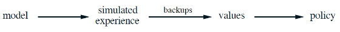

- 학습과 계획 방법의 핵심은 **보강 갱신 과정에 의한 가치 함수의 추정**이다. 
  
  - 학습과 계획 사이에 분명 차이가 있다. 
    
    - 계획은 <u>모델로부터 생성된 시뮬레이션된 경험을 사용</u>한다. 
    
    - 학습 방법은 <u>환경으로부터 생성된 진짜 경험을 이용</u>한다 
  
  - 그럼에도 공통의 구조를 갖는다는 것은 <mark>많은 개념과 알고리즘이 학습과 계획 사이에서 전환될 수 있음을 의미</mark>한다.
    
    - 특히 많은 경우, 학습 알고리즘은 계획 방법의 핵심 갱신 단계를 대체할 수 있다.
    
    - **학습 방법**은 진짜 경험 뿐이 아니라 <u>시뮬레이션된 경험에도 적용</u>될 수 있다. 
      
      - ex)- 무작위 표본 단일 단계 표 기반 Q 계획 
        
        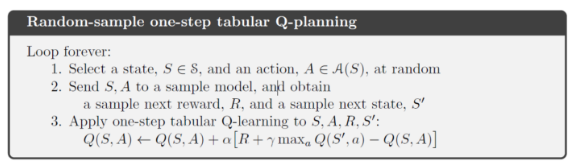

--- 

##### 다이나 : 계획, 행동, 학습의 통합

- 계획이 환경과 상호작용하며 온라인으로 수행될 때는 수많은 이슈가 발생한다. 
  
  - 상호작용으로부터 얻은 새로운 정보는 모델을 변경하는 등 계획과 상호작용한다. 
  
  - 결정을 내리는 것과 모델을 학습하는 것 모두 계산이 많이 필요하다면, 이용 가능한 계산 능력을 두 작업으로 나누어야 할 수 있다. 

- 위와 같은 이슈를 논의하기 위해 <mark>다이나 Q(Dyna-Q)</mark>를 제시한다. 
  
  
  
  - 실제 경험은 **2가지 역할**을 한다. 
    
    - **(1) 모델학습** : 모델이 실제 환경을 더 정확하게 모사시키도록 학습시킨다.
      
      - 간접적 강화학습이라 불리며, 이 과정은 계획에 포함된다. 
    
    - **(2) 직접적 강화학습** : 가치 함수와 정책을 직접 향상시킨다.

- **간접적 방법과 직접적 방법 모두 장단점이 있다.**
  
  - 간접적 방법은 효율적으로 제한된 경험을 이용하여 더 좋은 정책을 획득한다. 
  
  - 직접적 방법은 훨씬 간단하고 모델의 설계에 포함된 편차에 영향을 받지 않는다. 

- 다이나 학습자의 전체 구조는 다음과 같다. 
  
  
  
  > 중간 열은 학습자와 환경 사이의 기본적인 상호작용과 실제 경험의 궤적을 의미
  > 
  > 오른쪽 열은 모델 기반 과정을 의미한다.
  > 
  > > 탐색 제어(Search control) : 모델로부터 시뮬레이션된 경험 도출 
  
  - <u>일반적으로 직접적/간접적 방법 모두 동일한 강화학습 방법이 사용</u>된다.
    
    - 즉, 강화학습은 학습과 계획 둘 다를 위한 '마지막 공통 경로'다. 
    
    - 학습과 계획은 각자가 사용하는 경험만 다를 뿐 거의 동일한 구조를 공유한다는 점에서 깊게 결합되어 있다. 
  
  - 다이나 Q에서 행동, 모델학습, 직접적인 강화학습 과정은 거의 계산을 필요로 하지 않기 때문에, <u>남는 시간은 많은 계산을 필요로 하는 계획에 사용</u>될 수 있다. 
    
    - 계획은 변경된 모델에 맞춰 가치 함수의 값을 갱신하는 것으로 계산이 많다.
    
    - 또한 실제 행동이 다수의 상태 가치를 변경한다면 다수의 반복 계산이 필요하다.

- 다이나 Q를 수행할 때마다 계획 단계의 반복 횟수(n)의 크기에 따라 성능의 차이가 있다.
  
  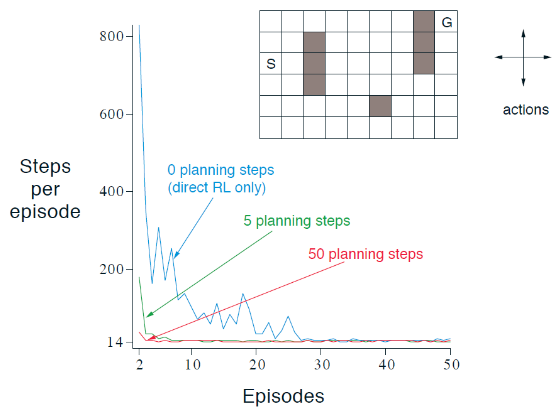
  
  > S로부터 G까지 가능한 빨리 가는 것이 목표다. 
  > 
  > n=0 인 학습자는 오직 직접적인 강화학습만을 이용한다.
  
  - 최초의 에피소드 이후에 모든 n 값에 대해 성능이 향상되었지만, <u>n 값이 클수록 훨씬 더 빨리 향상되었다</u>. 
    
    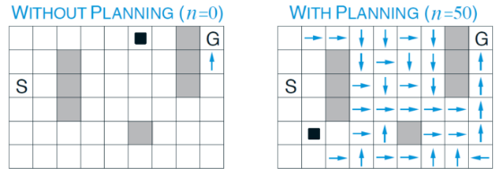
    
    > → 는 각 에피소드에서 탐욕적 행동을 나타낸다. 
    > 
    > → 가 없다면 해당 상태의 모든 행동 가치가 동일함을 의미한다. 
    
    - 즉, <u>계획을 많이 실행할수록, 많은 상태 속에서 탐욕적인 정책을 산출</u>할 수 있다.
      
      - 왼쪽의 경우, 경우의 수가 매우 많이 나온다. 
      
      - 오른쪽의 경우, 초반의 상/하 방향만 정해지면 그 이후에는 확정적이다. 

--- 

##### 모델이 틀렸을 때

- 모델이 부정확할 때 계획 과정은 <u>준최적(suboptimal) 정책을 계산</u>할 가능성이 높다. 
  
  - 특히, 환경이 확률론적이고 오직 제한된 개수의 표본만이 측정되었거나, 
  
  - 모델이 불완전하게 일반화된 함수 근사를 사용하여 학습되었거나 
  
  - 환경이 변했고 새로운 환경의 행동이 아직 감지 안되는 등 
  
  - => 여러가지 이유로 모델은 부정확할 수 있다. 

- **변화하는 환경에 대해서 최적의 방법을 찾느냐는 탐험과 활용 사이의 갈등의 문제이다.**
  
  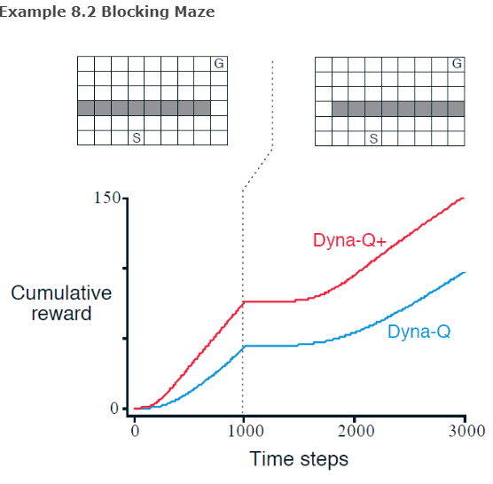
  
  > Dyna-Q+ : 각 상태-행동 쌍을 추적하여 환경과의 실제 상호작용 속에서 마지막 상태-행동 쌍에서 얼마나 많은 시간 단계가 경과했는지를 고려한다. 
  > 
  > - 경과한 시간이 길수록 모델이 부정확할 가능성이 더 커진다 가정할 때, 오랫동안 시도되지 않은 행동을 테스트하기 위해 보상($ r + k \sqrt \tau$)을 제공한다. 
  >   
  >   > r : 보상 
  >   > 
  >   > k : 임의의 작은 수
  >   > 
  >   > $\tau$ : 시도되지 않은 기간  
  
  - 최적의 정책을 찾을 때까지, 그리고 환경이 변화했을 때에도 탐험하는 **Dyna-Q의 성능이 더 좋다**. 

- 환경이 보다 유리하게 변한다고 해도, 모델이 변화를 감지하지 못한다면 준최적 정책을 반복한다. 
  
  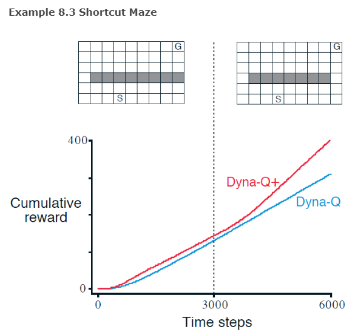

--- 

##### 우선순위가 있는 일괄처리

- <u>경험했던 상태-행동 쌍에서 균등하게 최초의 한 쌍을 선택하는 것은 보통 최선이 아니다. </u>
  
  - 목표와 연결되지 않은 곳(가치가 0)에서 갱신을 해도 변화가 없다. 
  
  - 계획이 진행됨에 따라 유용한 갱신의 영역은 커지지만, 계획 자체는 계획이 가장 잘 수행되는 곳에 초점을 맞추었을 때보다 여전히 더 비효율적이다. 

- 따라서 <u>목표 상태/가치 함수에 변화가 생긴 상태로부터 역방향으로 진행</u>한다(**역행초점**).
  
  - 한 상태의 가치 추정값이 변화했다고 했을 때, 그 상태를 일으킨 행동과 그 전의 상태와 행동 등 역순으로  갱신해나갈 수 있다.

- 이때 **시급성에 따라 갱신의 우선순위를 정하고, 그 우선순위에 따라 갱신을 수행**한다
  
  > 이는 **우선순위가 있는 일괄처리**의 기본 개념이다.
  
  - 확률론적 환경에서 <u>전이 확률 추정값의 다양성</u>이 <u>변화의 크기</u> 및 상태-행동 쌍이 갱신되어야 하는 <u>시급성에 있어서 다양성을 야기</u>한다.
  
  - 상태-행동 쌍의 가치 추정값이 갱신할 때, 값이 변화하는 크기에 따라 상태-행동 쌍의 나열 순서를 정한다. 
    
    - 가장 우선순위가 높은 상태-행동 쌍이 갱신된 다음, 그 쌍 이전에 존재했던 쌍들 각각에 미치는 효과가 계산된다. 
    
    - 그 효과가 일정 기준값보다 크면, 새로운 우선순위를 가지고 나열에 삽입된다. 
    
    - 이때 나열에 삽입된 것보다 낮은 우선순위를 갖는 쌍들은 제거한다. 
  
  - <mark>=> 문제에 따라 정책 수렴 속도를 5~10배까지도 향상시킨다.</mark>

- 우선순위가 있는 일괄처리는 확률론적인 환경으로 확장하는 것은 어렵지 않다. 
  
  - 모든 가능한 다음 상태와 그들의 발생 확률을 고려하여 <u>기댓값 갱신</u>을 하면된다.

- <mark>**모든 종류의 상태 공간 계획은 갱신의 유형만 다를 뿐 가치 갱신의 나열로 인식된다.**</mark>
  
  - 갱신의 유형은 **기댓값 갱신, 표본 갱신, 갱신의 크기, 수행되는 순서** 등 이 있다.
  
  - 갱신 방법에 따라 장단점이 갈린다. 
    
    > ex)- 기댓값 갱신 : 발생 확률이 낮은 전이에 많은 계산량을 낭비할 수 있다.  
  
  - 이 절에서는 역행 초점을 강조했으나, 하나의 전략일 뿐이다. 
    
    > ex)- 순행 초점 : 현재 정책 하에서 자주 마주치는 상태로부터 얼마나 쉽게 그 상태에 도달할 수 있는지에 따라 상태에 초점을 둠 

--- 

##### 기댓값 갱신 대 표본 갱신

- 단일 단계 갱신에 초점을 맞췄을 때, 갱신은 <u>세 개의 2차원적 구분자</u>에 따라 구분된다. 
  
  - (1) **상태 가치 / 행동 가치** 중 어떤 것을 갱신하는가?
  
  - (2) **최적 정책 / 임의 정책** 중 무엇의 가치를 추정하는가?
  
  - (3) **기댓값 갱신 / 표본 갱신** 중 무엇을 사용할 것인가?
  
  
  
  > 지금까지 나온 방법들은 총 8가지 구분 중 7가지에 해당된다. 
  > 
  > 나머지 1개는 유의미하지 않아 다루지 않는다.

- **기댓값 갱신 vs 표본 갱신** 
  
  - 가용 여부 : 기댓값 갱신은 분포 모델이 있어야만 가능하다. 표본 갱신은 환경과 표본 모델로 부터 나오는 표본 전이만 있어도 된다. 
  
  - 추정값 편차 : 기댓값 갱신은 없으나, 표본 갱신은 표폰 편차가 있다.
  
  - 계산량 : 기댓값 갱신은 대략 표본 갱신에 필요한 계산량의 <u>분기계수(b)</u>배에 해당하는 계산량이 필요하다. 
    
    > **분기계수(b)** : $\hat p(s'|s,a) >0 $ 을 만족하는 가능한 다음 상태 s'의 개수 
    
    > 기댓값 갱신 : $Q(s,a) ← \sum_{s', r} \hat p(s',r|s,a)[r + \gamma max_{a'}Q(s',a')]$
    > 
    > > $\hat p(s',r|s,a)$ : 추정된 동역학 형태의 모델 
    > 
    > 표본 갱신 : $Q(s,a) ← Q(s,a) + \alpha [R+ \gamma max_{a'}Q(S',a') - Q(s,a)]$
  
  - => <mark>기댓값 갱신을 계산할 시간이 충분하다면 기댓값 갱신이 좋다.</mark> <mark>하지만 그렇지 않다면 표본 갱신을 더 선호한다. </mark>
    
    - 규모가 큰 문제에서는 항상 후자의 상황에 놓이게 된다. 

- **큰 확률론적 분기 또는 도출해야 하는 상태가 너무 많을 땐,  표본 갱신의 성능이 좋다.**
  
  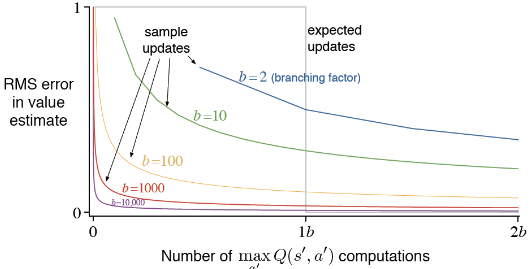
  
  > b개의 모든 이후 상태의 발생 확률이 동일 / 초기 추정값의 오차가 1으로 가정
  
  - 기댓값 갱신이 되고 나면 추정 오차는 0으로 감소한다. 
  
  - 표본 갱신의 초정 오차는 $\sqrt \frac{b-1}{bt}$ 에 따라 감소한다. 
    
    > t : 수행된 표본 갱신의 수 
    
    - 이 때 <u>적당히 큰 b에 대해 전체 b번의 갱신</u> 중 **초기의 아주 적은 수의 갱신만으로 오차가 극적으로 감소**한다.
    
    - <mark>소요되는 시간이 하나의 상태-행동 쌍이 기댓값 갱신을 수행하는 시간으로도</mark>, <mark>기댓값 갱신 효과의 몇 퍼센트 이내로 가치를 극적으로 향상</mark>시킬 수 있다. 
    
    - +표본 갱신 간 모델이 보완 된다는 점을 고려할 때 더욱 성과가 좋을 것이다. 

--- 

##### 궤적 표본 추출

- 갱신을 분산시키는 두 가지 방법 
  
  - (1) 철저한(exhausitive) 일괄처리 : 모든 상태를 고려 및 갱신 
  
  - **(2) 궤적 표본 추출** : 활성 정책 분포에 따라 관측된 분포에 따라 갱신을 분산

- 활성 정책 vs 균등 분포 상 궤적 표본 추출의 특징 
  
  
  
  > 각 전이에 대해 기대되는 보상은 평균이 0이고 분산이 1인 정규 분포로 선택됨
  > 
  > 모든 전이에 대해 각 전이가 종단 상태로 갈 확률은 0.1이다. 
  
  - 단기적으로 활성 정책 분포는 최적의 행동에 집중하여 성과가 좋으나, 장기적으로는 보다 다양한 경우를 고려한 균등 분포가 더 결과가 좋아질 수 있다.
  
  - 활성 정책은 <u>분기계수(b)의 크기에 반비례</u>, <u>전체 상태의 수의 크기에 비례</u>하여 **더 좋은 성과를 내는 기간이 길어진다**. 
    
    - 즉, <mark>규모가 큰 문제에서는 활성 정책을 기반으로 갱신하는 것이 선호된다.</mark> 

---

##### 실시간 동적 프로그래밍(Real-Time Dynamic Programming, RTDP)

- RTDP는 DP 가치 반복 알고리즘의 활성 정책 궤적 표본추출 버전이다. 

- RTDP는 전통적인 일괄처리 기반의 정책과 DP와 밀접하게 연결되어 있어 활성 정책 궤적 표본추출의 몇가지 장점을 잘 보여준다. 

- RTDP는 비동기(asynchronous) DP 알고리즘의 일종이다. 
  
  - 비동기 DP 알고리즘은 상태 가치를 갱신할 때 갱신 순서가 어떻게 되든 상관없고, 다른 상태 중에 이용 가능한 상태가 있다면 무엇이든 가리지 않고 그 상태의 가치를 이용한다. 
  
  - RTDP는 갱신 순서가 실제 또는 시뮬레이션된 궤적에서 상태를 마주치는 순서와 동일해야 한다.

- 활성정책 궤적표본추출은 어떤 시작상태로부터 도달할 수 없는 **무관한 상태**를 건너뛴다.
  
  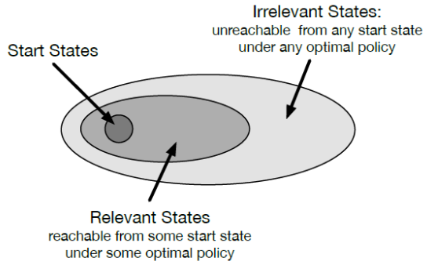
  
  - 최적정책을 찾는 제어문제에서, 무관한 상태에 대해 최적행동을 지정할 필요가 없다.
  
  - 필요한 것은 **관련된 상태**와만 관련이 있는 **최적 부분 정책**을 찾는 것이다.

- 하지만 살사 같은 활성 정책 궤적 표본 추출 제어 방법으로 최적 부분 정책을 찾기 위해, 일반적으로 <u>모든 상태-행동 쌍(무관한 경우까지)을 무한 번 마주쳐야 한다</u>. 
  
  - **RTDP는 일정 조건 내에서 위 제약없이 최적 부분 정책을 찾는 것이 보장**된다. 
    
    - (1) 모든 목표 상태의 초기 가치는 0이다. 
    
    - (2) 어떠한 시작 상태로 시작해도 목표 상태에 100% 도달함을 보장하는 최소 하나의 정책이 존재한다. 
    
    - (3) 목표 상태가 아닌 상태로부터의 전이에 대한 보상은 철저히 음의 값이다
    
    - (4) 모든 초기 가치는 최적 가치보다 크거나 최적 가치와 같다.(조건 1이면 충족)

- 이러한 특성의 문제는 **확률론적 최적 경로 문제**(Stochastic optimal path problem)이다.
  
  - 위 문제들은 보상 최대화 대신 <u>비용 최소화의 측면</u>에서 바라본다. 
  
  - 음의 보상을 최대화하는 것은 시작 상태 → 목표 상태로 가는 경로 비용 최소화하는 것과 같다. 
    
    > ex)- 최소 시간 제어 문제. 골프 문제 

- **DP vs RTDP 의 특징 비교(from 예제)**
  
  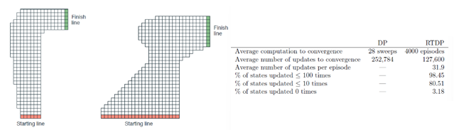
  
  > 자동차를 운전하여 트랙 안에 머물면서 가능한 빨리 결승선을 통과하는 문제
  
  - RTDP에 소요된 갱신 횟수는 DP에 소요된 횟수의 약 <u>절반정도</u>이다. 
    
    - 전통적인 가치 반복(ex- DP)이 모든 상태의 가치를 갱신된 반면, 
    
    - **RTDP는 문제의 목적과 관련이 있는 상태의 집합에 초점을 맞춰 갱신**했다.
  
  - 또한, RTDP는 가치 함수가 최적 가치 함수 $v_\pi$에 가까워질 때 <u>학습자가 궤적을 생성하기 위해 사용하는 정책도 최적 정책에 가까워진다</u>. 
    
    - 이는 RTDP가 항상 현재 가치 함수에 탐욕적이기 때문이다. 
      
      - 일괄처리에서 가치 함수의 변화량이 작을 때만 가치 반복이 종료된다. 
      
      - 즉, $v_*$와 최적 정책에 정밀하게 근사할 때 일괄처리가 마무리 된다.  
    
    - 단, 가치 반복이 종료되기 한참 전에 이미 최적 정책일 가능성이 있다.
      
      - 최적 정책은 $v_*$ 외에 다른 가치 함수에 대해 탐욕적일 수 있기 때문 
    
    - 따라서 <u>최적 정책의 탄생을 확인하는 일이 추가로 필요</u>하며, 이를 위한 계산량도 상당하다.

--- 

##### 결정 시점에서의 계획

- 계획은 최소한 <u>두 가지 방식</u>으로 사용될 수 있다. 
  
  - (1) **백그라운드 계획**(Background Planning) : 정책/가치 함수 향상을 위해 계획 사용
    
    > ex)- 지금까지 다뤄왔던 가치 함수 / 정책 갱신 예시들  
  
  - (2) **결정 시각 계획**(Decision-time Planning) : 특정 상태에 집중하여 계획 

- 결정 시각 계획은 새로운 상태 $S_t$를 마주치고 난 '이후에' 계획을 시작하고 완료하는 것.
  
  > ex)- 체스에서 2~3수 앞을 내다보는 것 
  
  - 일반적으로, 한 단계 앞보다 더 멀리 내다볼 수 있고, 이를 통해 상태와 보상의 다양한 예측 궤적을 초래하는 행동 선택을 평가할 수 있다.
  
  - 단, 현재 행동을 선택하기 위해 사용된 후에는 계획은 폐기된다.  
  
  - 추가로 앞을 많이 내다볼수록 필요한 계산양이 늘어나기 때문에, <u>빠른 반응이 필요하지 않은 상황에 적용할 때 가장 유용</u>하다. 

- 백그라운드 계획과 결정 시각 계획은 다양한 방식으로 혼합될 수 있다. 
  
  - 계획이 결정 시각에서만 행해질 때도, 계획을 시뮬레이션된 경험으로부터 갱신과 가치, 그리고 정책으로 진행하는 것을 볼 수 있다.
  
  - 결정 시각 계획을 폐기한 이후에도, 그 결과를 백그라운드 계획에 반영하여 전체 성능 향상에 이바지할 수 있다. 

----

##### 경험적 탐색(Heuristic search)

- 경험적 탐색은 결정 시각 계획 방법의 일종으로, <u>마주치는 각 상태에 대해 그 상태로부터 진행 가능한 많은 경로를 고려</u>한다. 
  
  - 근사적 가치 함수가 리프 노드(경우의 수)에 적용되고, 이후 현재 상태를 보강한다. 
  
  - 보강 이후, 행동 노드 중 가장 좋은 것이 선택되고 모든 보강 가치는 폐기된다. 
  
  - => **경험적 탐색을 탐욕적 정책이 단일 단계를 넘어 확장된 것으로 바라볼 수 있다.**

- **경험적 탐색의 특징**
  
  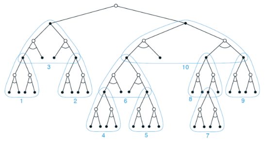
  
  - 깊게 탐색하기 때문에 더 좋은 행동을 선택할 수 있다. 반면 계산량은 많아진다. 
  
  - 경험적 탐색의 탐색 트리를 통해 가치 판단하기 때문에 메모리와 계산 능력이 좋을 수록 성능이 좋다. 
  
  - 트리 탐색 방식에 따라 성능이 달라진다. 깊이 우선(depth-first) 방식을 채택했을 때 현재와 그 이후의 가능한 상태들에 집중하여 갱신할 수 있다. 

--- 

##### 주사위 던지기 알고리즘

- 주사위 던지기(Rollout) 알고리즘은 <u>현재 환경 상태에서 시작</u>하는 <u>시뮬레이션된 궤적들</u>에 적용된 <u>MC 제어</u>에 기반한 <u>결정 시각 계획 알고리즘</u>이다.
  
  - 주어진 정책 하에서 가능한 행동을 시작함으로써 많은 시뮬레이션 궤적을 생성한다.
  
  - 궤적의 보상에 대한 평균을 계산하여 주어진 정책 하에서의 행동 가치를 추정한다. 
  
  - 행동 가치 추정값이 정확하다고 생각될 때 가장 큰 가치 기댓값을 갖는 행동을 한다. 
  
  - 행동 이후, 그 결과로 생긴 다음 상태로부터 과정이 새롭게 진행된다. 

- 주사위 던지기 알고리즘은 <u>현재 상태 속 주어진 정책을 향상시키는 것</u>을 목표로 한다. 
  
  > 이때 주어진 정책을 주사위 던지기 정책(Rollout policy)라 부른다.
  
  > 일반적인 MC 제어 알고리즘은 최적 행동 가치 함수를 추정하는 것을 목표로 한다.
  
  - 주어진 정책을 기반으로 행동 가치의 MC 추정값을 계산하여 높은 값을 선택한다.
  
  - 주사위 던지기 알고리즘은 추정값을 즉각적으로 사용하고 폐기한다. 
    
    - 이는 모든 상태-행동 쌍의 결과에 대해 표본을 추출할 필요도, 함수를 근사할 필요도 없기에 알고리즘의 구현을 상대적으로 쉽게 만든다. 

- 주사위 던지기 알고리즘은 <u>성능과 계산량 중에서 Trade-off 관계</u>를 가진다. 
  
  - 성능은 주사위 던지기 정책의 특성과 MC 가치 추정값의 순위에 따라 달라진다. 
    
    - 주사위 정책을 충분히 시뮬레이션하는데 많은 시간을 필요로 한다.
  
  - 결정 시각 계획 방법으로서 보통 엄격한 시간 제한을 가진다.
  
  - => **성능과 계산량 사이의 균형을 맞춰야 한다.** 

- 성능과 계산량 사이의 균형을 맞추는 방법으로서 몇가지 접근법이 있다.
  
  - MC를 구성하는 모든 시행은 모두 독립적이기에, 병렬로 계산하기 
  
  - 시뮬레이션된 궤적을 에피소드가 완료되기 전에 중단하고, 저장된 평가 함수를 이용하여 중단된 보상을 보정하기 

- **주사위 알고리즘의 장점**
  
  - 궤적 표본 추출을 통해 DP의 철저한 일괄처리를 회피한다. 
  
  - 기댓값 갱신이 아닌 표본 갱신에 의존함으로써 분포 모델에 대한 필요성을 없앤다.

--- 

##### 몬테카를로 트리 탐색(Monte Carlo Tree Search, MCTS)

- 시뮬레이션이 더 좋은 경로로의 연속적인 방향 설정을 위해, <mark>MC 시뮬레이션 간 얻은 가치 추정값을 추적하는 수단을 추가</mark>한다. 
  
  - 주사위 던지기 알고리즘의 일종이나, 성능이 더 뛰어나다. 
  
  - **빠른 다단계 시뮬레이션이 가능한 정도로 충분히 간단한 환경 모델**이 있다면 단일 학습자 순차결정(Single-agent sequntial decision) 문제에 폭넓게 효과를 볼 것이다. 

- MCTS는 <u>이전의 시뮬레이션으로부터 높은 평가를 받은 궤적의 초기 부분을 확장하여,</u>   현재 상태에서 시작하는 여러 시뮬레이션에 연속적으로 초점을 맞추는 것이다. 
  
  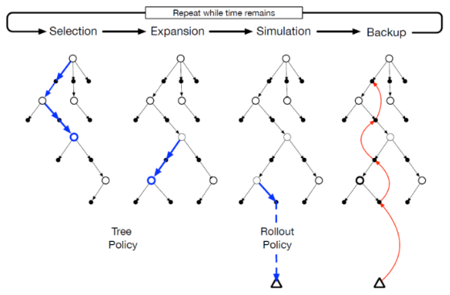
  
  > 선택(Selection) : 할당된 행동 가치를 기반으로 트리 정책이 리프 노드를 선택
  > 
  > > 트리 정책 : 탐험과 활용의 균형을 맞추며, 많은 정보를 가지고 있는 정책 
  > 
  > 확장(Expansion) : 반복 실행 간 탐험하지 않은 행동을 통해 리프 노드를 확장
  > 
  > 시뮬레이션 : 노드 중 완전한 에피소드에 대한 시뮬레이션 실행 및 행동 선택
  > 
  > 보강 : 시뮬레이션간 지나간 트리 구조에 할당된 행동 가치 갱신 및 초기화   
  
  - MCTS는 할당된 시간 / 계산 능력이 소진될 때까지 4가지 과정을 반복한다. 
  
  - MCTS는 MC 가치 추정값 중 몇 단계 안에 가장 도달할 가능성이 높은 상태-행동 쌍의 일부분에 대해서만 유지한다.

- **MCTS의 특징**
  
  - MCTS는 근원 상태에서 시작하는 시뮬레이션에 적용된 MC 제어를 기반으로 하는 결정 시각 알고리즘이다. 
    
    - **온라인이면서 점증적이고 표본에 기반한 가치 추정과 정책 향상의 이점**이 있다.
  
  - 높은 이득을 주는 궤적과 초기 부분을 공유하는 궤적에 MC 시행을 집중시킨다.
    
    - 즉, **효율이 좋다**.  
  
  - 점증적으로 트리를 확장하여 행동 가치 함수를 저장하는 열람표의 규모를 키운다.
    
    - 높은 이득을 주는 표본 궤적의 초기 부분에 메모리가 할당되어, <u>과거의 경험을 사용하는 이점을 누리되 행동 가치 함수를 전반적으로 근사하지 않아도 된다.</u>
