# Topic 3 이상치 탐색(Anomaly Detection)

출처 : 강필성 교수님의 Business Analytics 강의

#### 

#### Anomaly Detection 개요

###### 분류(Classification)와 이상치 탐색(Anomaly detection)의 개념 차이

- 분류와 이상치 탐색의 목표는 둘다 "**구분**" 하는 것으로 명확히 구분된다기 보단 일부 늬앙스의 차이가 있다.   

> 분류(좌측): 비교적 분할 경계가 포괄적이다. 따라서 예시에서 좌측을 '가' 타입이라 정의할 시, 우측을 '나' 타입으로 정의함으로써 A,B 샘플이 '나' 타입에 속한다 할 수 있다.  
> 
> 이상치 탐색(우측) : 비교적 분할 경계가 제한적이다.  Normal 영역 외에는 특정 그룹으로 다시 묶일 수 있다.  따라서 Normal 외의 있는 데이터에 대해 임의로 분류할 수 없다. A,B 샘플은 Normal 에 속하지 않는다고 표현해야 한다. 

- 분류와 이상치 탐색은 주어진 데이터의 / 분포에 따라 구분되곤 한다. 
  
  
  
  *클래스 간 극심한 불균형이 있으면서 소수 클래스의 사례가 적을 때 이상치 탐색 적용*

###### 

###### 이상치 탐색은 크게 2가지 관점이 있다.

1. 데이터 생성 관점 : 이상치란 서로 다른 생성 메커니즘을 가진것으로 의심되는 것  

2. 확률 밀도 관점 : 이상치란 발생 확률이 매우 낮은 것 
   
   - 굳이 다른 메커니즘에서 생산될 필요가 없음을 시사 

##### 

##### 이상치 탐색을 위해 적용하는 방법은 크게 3가지 방향성이 있다.

1. **Density based** : 확률밀도함수를 통해 낮은 확률값을 가진 값을  이상치로 고려 
   
   > 특징 : 데이터 생성 관점에서 접근. 특정 타입으로 분류되는 값들의 파라미터(평균, 분산 등)을 가정하여 가장 유사한 값을 찾고자 함. 나중에 나온 방식일수록 특정 데이터에 대한 분포에 대한 전제를 제거하는 방식이 등장하나, 그만큼 계산량이 증가한다. 

2. **Distance based** : 주요 분포에서 거리가 멀리 떨어질 수록 이상치로 고려 
   
   > 특징 : 데이터에 대한 어떠한 가정도 하지 않음. 데이터의 거리에 의존하여 이상치 유무를 판단함. 그대신 "거리" 를 어떻게 정의하는가에 따라 결과가 달라질 수 있으며, n개 데이터 사이의 거리값을 구해야하는 만큼 계산량이 많다. 

3. **Model-based** : 주어진 모델에 따라 Density / Distance 외의 방식으로 이상치 탐색  
   
   > 특징 : 모델에 따라 특성이 많이 달라짐. 압축 및 복원을 통해 이상치를 판단하는 방식과 Isolation tree를 사용하는 모델 등이 있다. 

    

###### 이상치와 관련된 용어 및 종류

- 이상치를 표현하는 단어들 
  
  - Noise : 데이터 생성간 자연히 발생하는 에러 
  
  - Outlier : 일반적인 데이터 생성 메커니즘을 위반하는 값. 분석시 유의미한 정보를 얻을 수 있음 
  
  - abonormal / novel : Outlier과 유사하나 각각 부정적 / 긍정적 늬앙스를 가짐.

- 이상치의 종류 
  
  1. Global outlier : 태생적으로 원데이터와 다른 이상치
  
  2. Contextual outlier (local outlier) : 상황과 환경에 따라 이상치가 되는 것
     
     > ex)- 사하라 사막에서 영상 30도는 특이하지 않으나, 알래스카에서 영상 30도는 이상치로 볼 수 있음
  
  3. Collective outlier : 집단 개념의 이상치.

###### 이상치 탐색의 특징과 해결해야할 문제

- 일반화(Generalization)와 구체화(Specialization) 간 Trade-off 관계를 띈다. 
  
  
  
  - 일반화 : 범주에 포함할 범위를 넓힐 수 있음. 하지만 오답의 가능성이 증가함 
  
  - 구체화 : 오답의 가능성을 줄여줌. 하지만 정답인데도 범주에서 배제할 가능성 증가함. 

- **해결해야할 문제**
  
  1. Normal 과 Outlier의 경계가 모호하다(<=>회색 영억이 있다)
  
  2. 측정 수단을 정하는 것은 적용하는 도메인과 모델과의 관계에 의존적이다. 
     
     > ex)- 의료 분야에서는 값의 분포가 좁아 이상치 탐색이 용이하나, 마케팅 분야에서는 그렇지 않다. 
  
  3. 이상치는 "왜 이상치인
  
  4. 지"에 대한 해석상의 요인을 제공해야 한다. 

###### **Performance Measure**

- 회색 영역이 있어 결과치가 "이다/아니다" 중 확정적으로 판단할 수 없어 가능성(확률)을 측정한다. 따라서 Performance Measure을 도입한다. 
  
  
  
  

- ex) FRR과 FAR은 서로 Trade-off 관계임. 
  
  
  
  - EER : FAR과 FRR이 동일해질 때의 Error rate  
  
  - IE : FAR - FRR 곡선의 아래 영역. 낮을수록 좋음. 이상치 탐색에 사용 
  
  - AUROC : 분류에 사용하는 측정치로 높을수록 좋음. 

----

## Density Base - Anomaly Detection

###### 방식

- <mark>데이터를 통해 유추된 확률 밀도 함수를 통해 이상치 유무를 판단하는 방식</mark>이다.
  
  - Train 과정에서 Normal 데이터를 기반으로 확률 밀도를 계산
  
  - Test 과정에서 Normal / abnormal 데이터를 입력하여 낮은 확률 밀도 값을 가질 경우 이상치로 판단 

- 크게 3가지 방법으로 1)Mixture of Gaussian, 2)Kernel,  3)Local Oulier Factor 가 있다.
  
      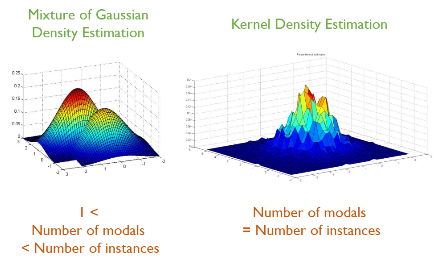  

### 1. Mixture of Gaussian Density Estimation

- **방향성** 
  
  - 대체로 데이터의 분포를 가정할 때 가우시안 분포를 가정하면 얼추 맞다. 
  
  - 하지만 관측 데이터가 "단일" 가우시안 분포를 띄기란 현실적으로 어려우므로, 다수의 가우시안 분포의 결합으로 보다 편차(Bias)가 작도록 만든다. 
    
     $(f(x) : 추정해야 하는 밀도 함수)$
    
    > $f(x) \approx w_1N(\mu_1, \sigma_1^2) + w_2N(\mu_2, \sigma_2^2) + w_3N(\mu_3, \sigma_3^2) $

##### MoG Density Estimation 방식

1. **관측 데이터가 다수의 가우시안 분포로부터 생성되었다고 가정하여 확률 밀도 함수 도출** 
   
   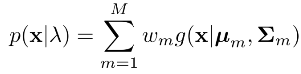
   
   > 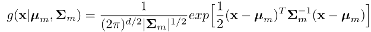
   > 
   > 
   > 
   > >  $M, \mu_m, \sum_m $: 입력 데이터로부터 계산해하는 파라미터값. 
   > > 
   > >  w : 각 가우시안 분포별 비중. 지금은 임의로 주어주는 수 밖에 없음. 
   > > 
   > > d : 데이터 x의 특성 수 
   > > 
   > > m : 가우시안 분포의 개수. 임의로 선정 후 추후 최대우도법에 의거하여 최적의 값을 선정해야 함.  

2. **Expectation-Maximization 알고리즘을 통해서 확률밀도 함수와 / 가우시안 파라미터들의 값을 각각 최적화 진행** 
   
   - 확률 밀도 함수는 파라미터 값에, 파라미터 값은 확률 밀도 함수에 상호 영향을 미친다. 
     
     - 따라서 파라미터 고정하여 확률 밀도 함수 예측 과정(E-Step)과, 
     
     - 확률 밀도 함수를 기준으로 파라미터를 최신화하여 확률을 최대화하는 과정(M-step)을 반복한다. 
   
   - 단계별 수식   
     
     - E - Step : 가우시안 파라미터를 고정하여 객체 확률 값을 계산 
       
        
       
       > $w_mg(x_i|\mu_m, \sum_m)$ : m 번째 분포에서 생성될 확률 
       > 
       > $\sum_{k=1}^M w_mg(x_i|\mu_m, \sum_m)$ : 모든 분포에서 생성될 확률의 합
     
     - M - step : 객체 확률 값을 고정하여 가우시안 파라미터 값들을 계산 
       
       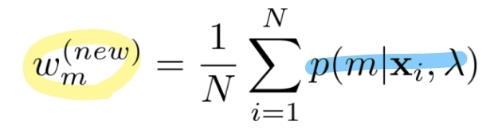

3. **적절한 가우시안 분포 개수(m) 정하기**
   
   - m을 1, 2, 3... M개 대입하여 가장 가능성이 높은 경우로 선정(최대우도법)

###### 이슈

- 공분산 행렬을 어떻게 가정하느냐에 따라 예측 분포가 달라진다. 
  
  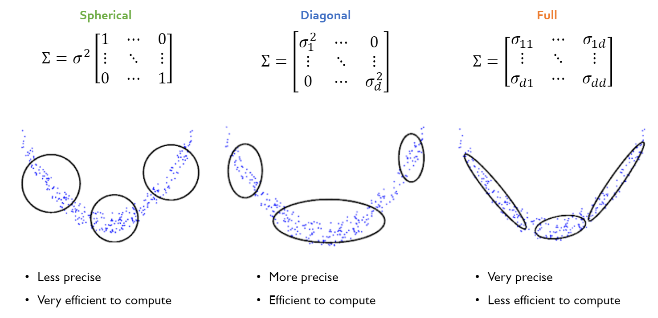
  
  1. Spherical : 모든 독립변수에 대해서 Normalization되었으며, 독립성을 가지고 있다. 
  
  2. Diagonal : 모든 독립변수들이 독립성을 가지고 있다. 
     
     > Full rank가 계산을 못하는 경우가 있어, 타협안으로 많이 선택
  
  3. Full : 모든 독립변수들이 일정 정도 상관관계를 가지고 있다. 
     
     > Full matrix가 제일 성능이 좋고 현실 데이터의 특성에 가장 유수한 가정임.
     > 
     > 하지만 noise data등으로 역행렬이 없을 때가 있어, 확률밀도 함수를 계산 못하는 경우가 있다.  

--- 

##### 2. Parzen Window Density Estimation

- **의의 및 방향성**
  
  - <u>특정한 형태의 분포(ex-가우시안 분포)를 가정하는 것 없이</u> 밀도를 측정한다. 
  
  - 객체마다 커널함수를 적용하여 확률 밀도를 파악한다. 
    
    - <mark>커널함수로 무엇을 선택하냐에 따라 추정값이 달라진다. </mark>
      
      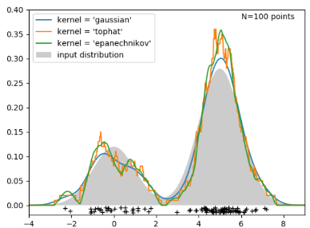
  
  ###### **과정**
  
  1. **특정 영역에 속할 확률 P값을 구하여 확률 밀도 $p(x)$ 를 계산할 토대 만들기** 
     
     > $P$ = 특정 영역 R에 x의 값이 속할 확률  $\int_R p(x)dx$. 
     
     - P(k) = $\begin{pmatrix} N \\ K \end{pmatrix}P^k(1-P)^{N-k}$. N개의 샘플 중 K개가 R에 속할 확률 
       
       - $E[k] = NP, Var[k] = NP(1-P)$
       
       - $E[\frac{k}{N}] = P, Var[\frac{k}{N}] = \frac{P(1-P)}{N}$
     
     - N의 값이 무한대만큼 증가한다면, P의 값은 $\frac{k}{N}$ 에 근사한다고 볼 수 있다. 
  
  2. **P 값을 기반으로 p(x)의 근사값 구하기**
     
     - 영역 R을 충분히 작게 잡는다면, 해당 영역 내의 확률밀도 p(x)는 상수로 봐도 충분히 결과값이 비슷하게 나올 것이다. 
       
       <mark>$P = \int_R p(x)dx \approx p(x)\int_R dx = p(x)V = \frac{k}{N} $</mark>
       
        <=> <mark>$p(x) \approx \frac{k}{NV}$</mark>
       
       > V : R 영역의 크기. 
     
     - **$p(x) = \frac{k}{NV}$좀 더 이해하기**
       
       - 추정은 데이터의 수(N)을 늘리고 R의 영역(크기 -V)을 줄이는 과정에서 보다 정확해진다.
       
       - 현실 속에서 N은 보통 고정된다. 따라서 우리는 V에 대해 타협안을 만들어야 한다.
         
         - 충분히 크면 R 영역 내에 충분한 예제를 포함할 수 있다.
         
         - 충분히 작다면 p(x)를 R 영역 내에서 하나의 상수처럼 고려할 수 있다.
     
     - *Kernel-density estimation vs k-nearest neighbor density estimation
       
       - Kernel - density : V를 고정하여 k 결정하기
       
       - k-nearest neighbor density estimation : k를 고정하여 V 결정하기

###### **추가 개선점 - Smoothing 부여를 위한 커널 함수 적용**

- 현재는 특정 영역 R에 속하면 확률밀도 p(x)의 값이 동일하다 가정하였으나, 이는 사실과 다르며 확률 밀도 간 불연속성을 부여하게 된다. 
  
  > ex)- R을 객체 x를 중점으로 하며 변의 길이가 h인 hypercube라고 가정하자. 
  > 
  > 이때 R 영역 내에서의 객체 x의 확률값이 동일하다 가정하면 Kernel 함수는 아래와 같이 정해진다. 
  > 
  > > $K(u) = 1 (|u_j| < \frac{1}{n}$ $\forall j = 1, ... d)$ / 0 (otherwise) 
  > > 
  > > $k = \sum_{i=1}^N K(\frac{x_i - x_c}{h})$ , $p(x) = \frac{1}{Nh^d}\sum_{i=1}^N K(\frac{x_i - x}{h})$
  > > 
  > > $x_i$ : 객체 
  > > 
  > > $x_c$ : 중앙
  > > 
  > > h : 변의 길이 

- 따라서 특정 영역 R에서도 중심에서 벗어나는 정도에 따라 확률 밀도 p(x)의 값에 영향을 주기 위해 <mark>Smoothing Kernel function</mark>을 적용한다.  
  
  > 조건 : $\int_R K(x)dx$ = 1 
  
  - 일반적으로 가우시안 분포처럼 Symmetric 하고 unimodal인 밀도 함수를 주로 사용함 
    
    > $p(x) = \frac{1}{N} \sum_{i=1}^N K(\frac{x^i - x}{h})$
    > 
    > 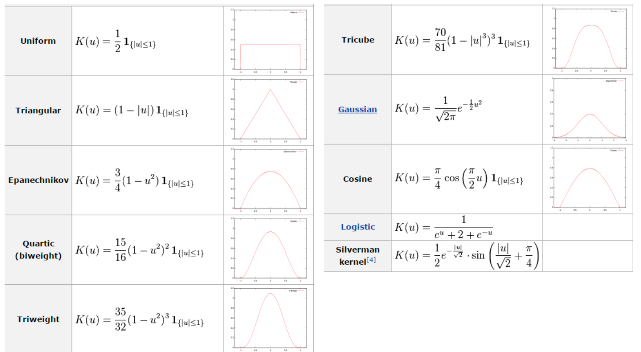
    > 
    > > h : Smoothing parameter. 적절한 h값을 탐색할 필요가 있음. 
  
  - h의 크기에 따라 확률 밀도 분포가 다르게 나온다. 다만, EM 알고리즘을 통해 최적화 가능하다. 
    
    - h가 충분히 크다면 over-smooth 밀도 분포가, 
    
    - h가 충분히 작다면 뾰족한 밀도 분포가 나온다.
      
      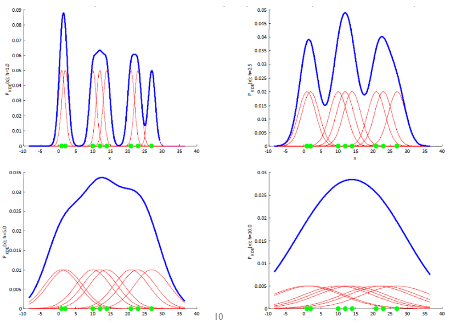
      
      >  우측 아래로 갈수록 h가 커짐

- 

--- 

##### 3. Local Outlier Factor(LOF)

- **의의 및 방향성** 
  
  - 어떠한 가정없이 주변 밀도만을 고려하여 Abnormal Score을 계산하자 
    
    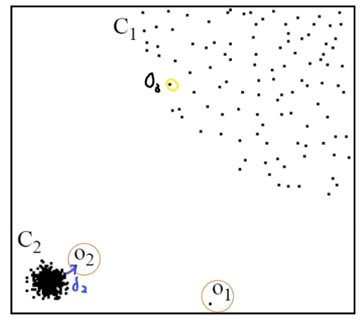
    
    > $O_2, O_3$은 둘 다 각 클러스터로부터 비슷하게 거리가 띄워져 있으나, 각 클러스터의 밀도를 고려할 때 $O_2$ 가 더 이상치라고 고려해야 한다. 

###### **정의**

- **k-distance(p)**: 객체 p로부터 k번째 가까운 객체까지의 거리 
  
  > D 영역에는 p를 제외하고 $d(p,o^{'})$ <= $d(p,o)$ 를 만족하는 적어도 k개의 $o^{'}$ 가 있어야 한다. 
  > 
  > > D : k번째 가까운 객체를 포함하는 영역 

- **k-distance neighborhood of p**
  
  > 객체 p를 기준으로 k-distance(p)의 반지름을 그렸을 때 속하는 객체들의 집합
  > 
  > $N_k(p) =$ {$q \in D/[p]$ | $ d(p,q)<= k-distance(p)$}

- **Reachability distance**
  
  > Reachability - $distance_k(p,o)$ = max{k-distance(o), d(p,o)}
  > 
  > 
  > 
  > - Reachability을 계산하는 기준이 p가 아니라 o라는 점이 중요
  > 
  > > d(p,o) : p와 o의 실제거리

- **Local reachability density of p : $lrd_k(p)$**
  
  > $lrd_k(p) = \frac{|N_k(p)|}{\sum_{o \in N_k(p)} reachability - distance_k(p.o)}$
  > 
  > >  $\sum_{o \in N_k(p)} reachability - distance_k(p.o)$ : 주변 밀도에 반응
  > 
  > - 일반적으로 $|N_k(p)|$ 는 k이며, neiborhood 경계면에 값들이 모여 있다면 k + $\alpha$ 의 값을 띈다. 
  >   
  >   - $|N_k(p)$| 의 값이 k로 고정되었다 할 때, 밀도는 $N_k(p)$ 내의 거리의 합에 반비례한다. 
  >   
  >   - 단, p의 neighbor 들이 원의 끝 부분에 몰려있다면(=동일한 거리에 있다면), 밀도가 낮아지거나 높아지는 것이 아니다. 따라서 이를 고려하기 위해 분자로 $|N_k(p)|$ 를 채택한 것이다.  
  
  - p가 주변 밀도가 낮은 곳에선 분모가 늘어나 $lrd_k(p)$ 값이 낮게, 높은 곳에선 분모가 줄어들어 $lrd_k(p)$의 값이 상승한다. ($lrd_k$ 는 주변 밀도와 비례한다)
  - 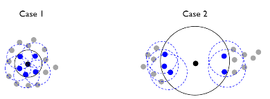

- **LOF(Local outlier factor)**
  
  > $LOF_k(p) = \frac{\sum_{o \in N-K(p)} \frac{lrd_k(o)}{lrd_k(p)}}{|Nk(p)|} = \frac{ \frac{1}{lrd_k(p)} \sum_{o \in N_k(p)} lrd_k(o)}{|N_k(p)}$
  > 
  > > $\frac{1}{lrd_k(p)}$ : p의 밀도를 의미
  > > 
  > > $\sum_{o \in N_k(p)} lrd_k(o)$ : o의 밀도를 의미
  
  
  
  - p 와 0의 주변 밀도를 비교하여, 상대적 빈도가 낮은 곳의 abnormal score를 높게 측정한다. 

###### 

###### **특징**

- **장점** 
  
  - 사전에 필요로 하는 Parameter, 분포가 없다. 주어진 데이터 만으로 abnormal score를 측정한다
  
  - 주변 밀도를 고려하여 abnormal score를 측정하다

- **단점** 
  
  - 계산양이 많다 
  
  - 각 score의 절대적 기준이 없다. <mark>즉, 서로 다른 dataset의 score를 비교할 수 없다. </mark>
    
    
    
    > 이 데이터 내에선 상대적으로 이상치인 값들을 확인할 수 있으나, 이 값들을 다른 데이터의 값들과 비교할 수 없다. 

----

---

### Distance-based Method

##### 1. K-Nearest Neighbor-based Approach

- **의의 및 방향성**
  
  - abnormal 데이터는 다른 데이터로부터 멀리 떨어져 있을 것이라 가정 
  
  - normal 데이터에 대한 어떠한 가정도 하지 않으며, 거리로만 정상 유무를 판단함

- **거리기준**    
  
  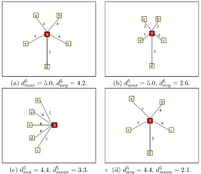
  
  - Maximum distance : $d_{max}^k = \kappa(x) = ||x-z_k(x)||$ 
  
  - Average distance : $d_{avg}^k = \gamma(x) = \frac{1}{k}\sum_{j=1}^k||x-z_j(x)||$
  
  - Distance to mean : $d_{mean}^k = \delta(x) = ||x-\frac{1}{k}\sum_{j=1}^kz_j(x)||$
    
    > $d_{mean}$ 은 $d_{avg}$에 비해 얼마나 데이터가 고르게 분포해 있는가도 고려한다. 

###### 개선안 : **거리기준 보강 - $d_{c-hull}^k$**

- 방향성
  
  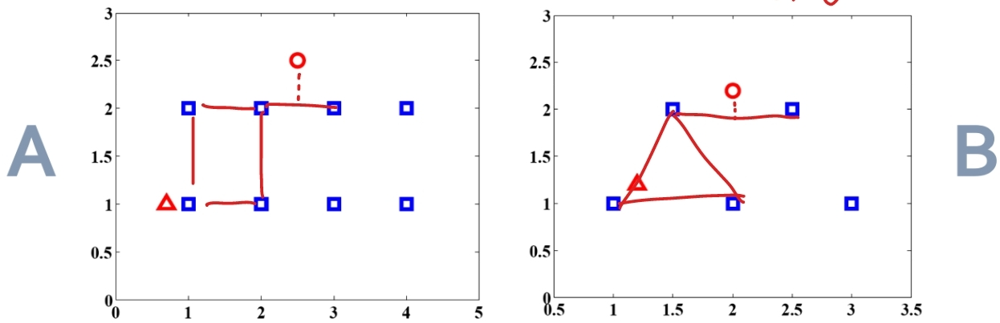
  
  > o 가 $\triangle$ 보다 비정상 스코어가 높아야 한다. 
  
  1. 데이터가 정상이라면, 정상 데이터의 영역 안에 속할 것이다
  
  2. 정상데이터 영역에서 벗어날 수록 비정상 데이터이다 

- 계산식 
  
  - <mark>$d_{c-hull}$은 기존에 사용하는 거리값에 보정치로서 사용된다. </mark>
    
    > $d_{c-hull}^k(x) = ||x_{new} - \sum_{j=1}^kw_iz_j(x)||$
    > 
    > - $x_{new}$가 정상 데이터의 영역 안에 속해 있으면 $d_{c-hull}$ 의 값은 0이다.
    
    - $d_{hybrid}^k = d_{avg}^k * (\frac{2}{1+exp(-d_{c-hull}^k)})$ 
    
    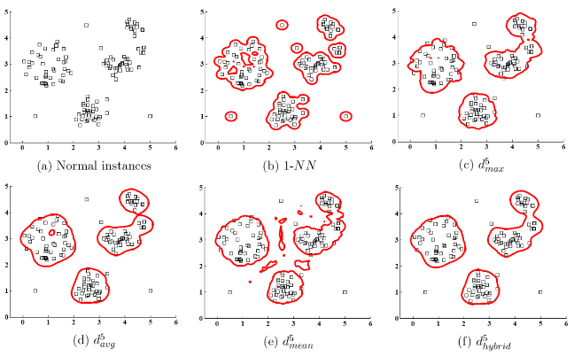
    
    > 기존 방식들은 영역 내에 구멍이 나거나, 각 영역 중간을 잘못 포함할 수 있다. 반면 $d_{hybrid}^k$ 는 이 둘의 문제점을 해결한다. 

---

##### 2. Clustering-based approach

- **방향성**
  
  - 어떠한 군집에도 속하지 않을경우 이상치일 확률이 높을 것이다 
  
  > $\chi = C1 \cup C2 ... \cup C_K$ s.t. $C_i \cap C_j = \phi, i \neq j $
  > 
  > > $\chi$ : 정상 데이터 영역 

- 거리 종류 
  
  
  
  > 둘 모두 절대거리는 동일하나, 오른쪽이 상대적 거리가 높아 더 비정상이다. 
  
  - 가장 가까운 중심점으로부터 **절대거리**
  
  - 가장 가까운 중심점으로부터 **상대적 거리**

##### 3. PCA -based approach

- **방향성**
  
  - 비정상 데이터일수록 정상 데이터에 비해 복원이 잘 안될 것이다.

- 복원 손실 계산방식
  
  > $error(x) = ||x-ww^Tx||^2 =(x-ww^Tx)^T(x-ww^Tx)$
  > 
  >                    $=$ $x^Tx - x^Tww^Tx - x^ww^Tx+x^Tww^Tww^Tx$
  > 
  >                     $= x^Tx - x^Tww^Tx = ||x||^2 - ||w^Tx||2$
  
  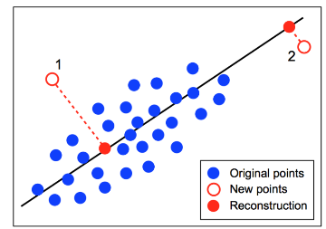(1번이 2번보다 복원손실이 크다)

---

---

### Model-based Anomaly Detection

##### 1.Auto-Encoder for Anomaly Detection

- **원본 데이터를 압축한 후, 최대한 원본에 가깝게 복원**하는 특징을 활용 

- 이상치일수록 "압축 > 복원" 과정에서 잃은 정보가 많을 것이다. 
  
  > $l(f(x)) = \frac{1}{2}\sum_k (\widehat x_k - x_k)^2$  의 값을 anomaly score로 사용 
  > 
  > > $\widehat x_k $ : 재복원한 데이터 값 

- ex)- **Support vector-based novelty detection**
  
   
  
  > SVM 모델을 토대로, 이상치를 구분하는 경계 함수를 직접 만들기

###### 1-1. 1-SVM

- **방향성** 
  
  
  
  - 커널함수를 통해 원본 데이터를 Feature space로 mapping 한 후, margin을 최대화하면서 원점과의 거리가 가장 먼 Hyperplane 찾기
    
    > 최적화 문제 : $min \frac{1}{2}||w||^2 + \frac{1}{vl}\sum_{i=1}^l \xi_i - \rho$
    > 
    > > $\frac{1}{2}||w||^2$ : Margin 최대화를 통해 모델의 변동성 감소
    > 
    > > $\frac{1}{vl}\sum_{i=1}^l \xi_i$ : 경계면 조건을 만족못하는 정상 data에 부여되는 페널티
    > 
    > > $\rho$ : 원점에서 최대한 멀리 떨어진 hyperplane 과의 거리

- **과정 : SVM과 동일** 
  
  1. **목적함수 및 라그랑주 함수 정의**
     
     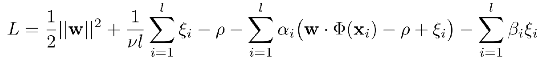
  
  2. **KKT 조건에 따라 최적해 조건 확인** 
     
     
  
  3. **듀얼 문제로 전환** 
     
     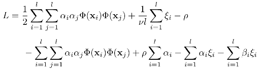
  
  4. **Kernel trick을 적용 후 Convex 문제의 해($\alpha$) 구하기** 
     
     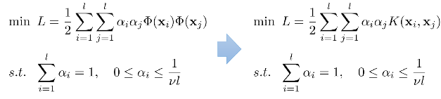

- **$\nu$ 의 역할**
  
  - <mark>$\nu$의 값은 Support vector의 최저 개수의 lower bound를, Error의 최대 개수의 Upper bound를 제공한다. </mark>
    
    - 적어도 $\nu l$ 개수의 Support vector가 존재해야한다. 
      
      > 조건 : $\nu \in [0,1], \alpha_i \in [0, \frac{1}{\nu l}], \sum \alpha_i =1$
      
      - $\sum \alpha_i =1$ 이 되려면 모든 $\alpha_i$ 가 최대값($\frac{1}{\nu l}$)을 가진다 해도 $\nu l$ 개수만큼 필요하다. 
    
    - 최대 $\nu l$개의 Support vector는 hyperplane 밖에 위치해야함. 
      
      - $\alpha_i = \frac{1}{\nu l}$ 일 때, support vector은 hyperplane 밖에 위치한다.  
        
        > $\alpha_i = \frac{1}{\nu l}$, => $\beta_i =0$ => $\xi_i > 0 $ 
      
      - $\alpha_i < \frac{1}{\nu l}$ 일때, support vector는 $\nu l$ 개 보다 더 생길 수 있지만 support vector 위 또는 안에 포함된다. 
  
  - <mark>$\nu$ 의 값이 높아질수록, 보다 복잡한 결정 경계가 형성된다. </mark>

###### 1-2. SVDD(Support Vector Data Description)

- **방향성**
  
  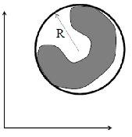
  
  - 모든 정상 데이터를 포괄하는 hypersphere 찾기 

- 과정 : SVM과 동일 
  
  1. **목적함수 및 라그랑주 함수 설정**
     
     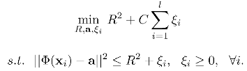
     
     
  
  2. **KKT 조건에 따라 최적해 조건 찾기** 
     
     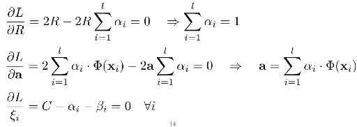
  
  3. **듀얼문제로 전환하기** 
     
     
  
  4. **kernel trick 적용 후 convex 문제에 대한 해($\alpha$) 찾기** 
     
     - SVDD는 Kernel 함수를 통해서 경계 복잡도를 설정함. 
     
     - ex) kernel 함수로 RBF 적용  
       
       
       
       >  결정 경계의 복잡도는 s 값에 반비례한다. 

Tip. *모든 데이터가 unit norm vector로 정규화 되었을 때 SVDD와 1-SVM은 동일함*

---

##### Isolation Forest and Its Variations

- **방향성**
  
  > 가정 1 : Minority는 보다 적은 사례로 이뤄져 있다. 
  > 
  > 가정 2 : Minority는 정상 사례에 비해 매우 다른 특성 값을 가지고 있다. 
  
  - 임의의 변수의 임의의 특성 value로 구분하며, 고립(Isolation)하고자 하는 객체가 속한 방향의 데이터만 유지한다.  
    
    > 고립(Isolation) : 경계선 안에 유일하게 자신의 사례만 포함되는 경우  
  
  - 랜덤으로 변수와 속성값을 선택한다고 해도 여러번 시도 후 평균을 구하면, 정상 사례를 고립시킬 때가 Minority 사례를 선택할 때보다 Split 횟수를 많이 가질 것이다.
    
    - Split 횟수는 Abnormal score와 반비례할 것이라 판단한다. 
    
    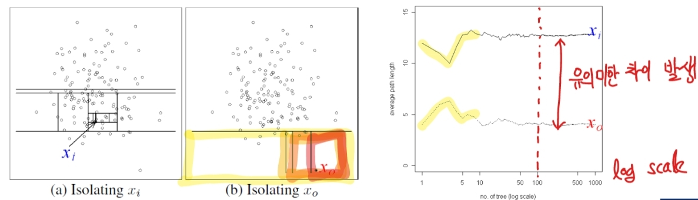

- **의의** 
  
  - 간단한 방식으로 학습 계산량이 다른 방법에 비해 압도적으로 적다. 

###### Isolation Forest

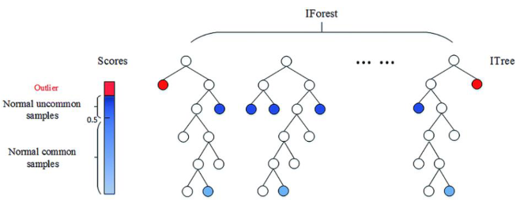

- n개의 데이터를 가진 데이터셋 X에서, 임의로 선택된 값 q가  아래의 조건을 맞출 때까지 임의로 추출된 p 값으로 Split을 반복적으로 수행한다.
  
  - |X| =1 
  
  - 모든 나무가 높이 제한에 도달할 때까지
  
  - X에 속한 모든 데이터가 동일할 때까지  

- **Path Length**
  
  - Isolation Forest에서 Root node에서부터 Terminal node까지 닿는데 필요한 Split 횟수 
  
  - 평균 Path Length는 각 사례의 Abnormal score로 사용된다. 
    
    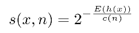
    
    > E(h(x)) : 1개의 Tree에 대해서 x를 Isolation 시키기 위한 Path length 
    > 
    > c(n) : 평균 Path length 

###### 개선점

1. 학습데이터 수가 너무 많으면 계산양이 늘어남. 이에 일정 데이터를 샘플링 하여 진행
   
   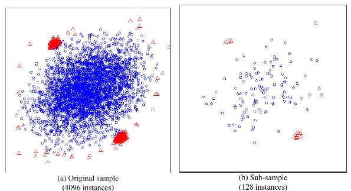

2. 데이터 샘플의 분포 형태에 따라 Abnormal Score를 잘못 계산할 수 있음. 
   
   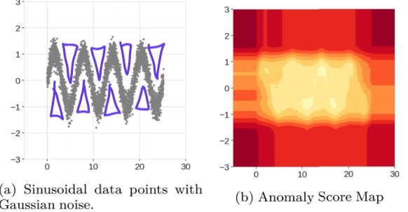
   
   > *파란색으로 칠해진 부분의 데이터들은 Minority로 봐야하지만 Abnormal Score 상 정상으로 판단된다.* 
   
   - 이에 Split의 기준이 되는 점을 선택한 이후 기울기도 랜덤하게 부여한다. 
     
     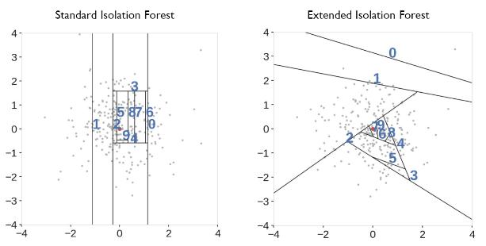 
